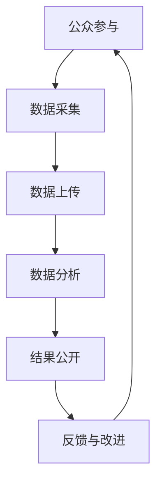

                 

### 关键词 Keywords

- 公民科学
- 公众参与
- 科学研究
- 新模式
- 数据分析
- 人工智能
- 开源
- 透明度
- 合作研究
- 社区驱动

### 摘要 Abstract

本文探讨了公民科学这一新兴领域，即公众参与科学研究的新模式。通过分析这一模式的背景、核心概念、算法原理、数学模型、项目实践以及实际应用场景，揭示了公民科学如何通过开放数据和开源工具促进科学发现，提高研究的透明度和公众参与度。文章还展望了公民科学未来的发展趋势与挑战，并提供了相关的学习资源、开发工具和论文推荐。本文旨在为科研工作者和公众提供一份全面的公民科学指南。

## 1. 背景介绍

### 1.1 公民科学的起源

公民科学（Citizen Science）的概念起源于19世纪，当时英国自然学家约翰·瓦利（John Wallis）提出了“志愿者科学”的想法，即鼓励公众参与科学研究。然而，这一理念在当时并未得到广泛认可，直到21世纪初，随着互联网和移动技术的普及，公民科学才开始迅速发展。

### 1.2 公民科学的发展历程

2000年初，互联网和开源技术的发展为公民科学提供了强有力的支持。首先是SETI@home项目，该项目通过分布式计算的方式，鼓励全球公众参与搜索外星文明信号。此后，大量的公民科学项目涌现，如天气观察、鸟类观察、植物分类等。

### 1.3 公民科学的特点

公民科学具有以下几个特点：

- **公众参与**：公民科学强调公众的参与，不仅提供研究资源，还参与到研究的各个阶段。
- **开放性**：数据、代码和研究方法都是开放的，促进了知识的传播和共享。
- **透明性**：公民科学鼓励研究过程的公开和透明，提高了研究的可信度和公正性。
- **社区驱动**：公民科学项目通常由社区驱动，形成了强大的合作网络。

## 2. 核心概念与联系

### 2.1 核心概念

- **公民科学项目**：由科学家、研究机构和公众共同参与的研究项目。
- **数据采集**：公众通过智能手机、平板电脑等设备采集数据。
- **数据分析**：科学家和公众使用开源工具对数据进行处理和分析。
- **开源**：项目使用开源软件和开放数据，促进知识共享。
- **透明度**：研究过程和结果公开，接受公众和同行的监督。

### 2.2 架构原理

下面是公民科学项目的架构原理的Mermaid流程图：



## 3. 核心算法原理 & 具体操作步骤

### 3.1 算法原理概述

公民科学项目中的核心算法通常涉及数据采集、数据清洗、特征提取和模型训练等步骤。以下是一个简单的算法流程：

1. **数据采集**：通过智能手机、平板电脑等设备收集环境数据、图像数据等。
2. **数据清洗**：去除噪声数据，确保数据质量。
3. **特征提取**：从原始数据中提取有用的特征，用于后续分析。
4. **模型训练**：使用机器学习算法训练模型，进行预测和分析。
5. **结果验证**：对模型结果进行验证，确保准确性。

### 3.2 算法步骤详解

#### 3.2.1 数据采集

数据采集是公民科学项目的第一步。公众通过安装特定的应用程序或使用网页界面提交数据。这些数据可以是温度、湿度、光照强度、图像、声音等多种形式。

#### 3.2.2 数据清洗

数据清洗是确保数据质量的重要步骤。通过去除重复数据、纠正错误数据、填补缺失数据等方法，提高数据的可靠性。

#### 3.2.3 特征提取

特征提取是从原始数据中提取有用的特征。例如，从图像数据中提取颜色、形状、纹理等特征。

#### 3.2.4 模型训练

使用机器学习算法对特征进行训练，构建预测模型。常见的算法有支持向量机、决策树、神经网络等。

#### 3.2.5 结果验证

对训练好的模型进行验证，确保其准确性和可靠性。通过交叉验证、混淆矩阵等方法评估模型性能。

### 3.3 算法优缺点

#### 优点

- **高参与度**：公众的积极参与提高了研究的覆盖面和深度。
- **低成本**：利用开源工具和现有的数据资源，降低了研究成本。
- **高透明度**：研究过程和结果公开，提高了研究的可信度和公正性。

#### 缺点

- **数据质量**：公众数据可能存在噪声和错误，影响研究结果。
- **技术门槛**：公民科学项目通常需要一定的技术背景，限制了参与者的范围。

### 3.4 算法应用领域

公民科学算法广泛应用于环境监测、健康研究、天文学、生态学等多个领域。例如，利用公民科学项目监测气候变化、研究疾病传播模式、发现新的行星等。

## 4. 数学模型和公式 & 详细讲解 & 举例说明

### 4.1 数学模型构建

在公民科学项目中，常用的数学模型包括回归模型、分类模型和时间序列模型等。以下是一个简单的回归模型示例：

$$ y = \beta_0 + \beta_1 x_1 + \beta_2 x_2 + ... + \beta_n x_n $$

其中，$y$ 是因变量，$x_1, x_2, ..., x_n$ 是自变量，$\beta_0, \beta_1, \beta_2, ..., \beta_n$ 是模型的参数。

### 4.2 公式推导过程

回归模型的公式推导过程如下：

1. **设定目标函数**：最小化预测值与实际值之间的误差平方和。
2. **求导并设置导数为零**：对目标函数求导，并设置导数为零，得到最小二乘法的解。
3. **求解参数**：通过解方程组求解模型的参数。

### 4.3 案例分析与讲解

假设我们要预测某个城市下一周的气温，我们有以下数据：

| 日期 | 气温（摄氏度） |
| ---- | ---- |
| 2021-01-01 | 10 |
| 2021-01-02 | 12 |
| 2021-01-03 | 15 |
| 2021-01-04 | 18 |
| 2021-01-05 | 20 |

我们可以使用线性回归模型预测下一周的气温。首先，我们将日期转换为天数（从2021-01-01起算），得到以下数据：

| 日期（天数）| 气温（摄氏度）|
| ---- | ---- |
| 1 | 10 |
| 2 | 12 |
| 3 | 15 |
| 4 | 18 |
| 5 | 20 |

然后，我们使用线性回归模型进行训练，得到以下结果：

$$ y = 8.2 + 2.4 x $$

其中，$y$ 是预测的气温，$x$ 是日期（天数）。

使用这个模型，我们可以预测下一周的气温。例如，下一周的日期是2021-01-08，对应的天数是8，代入模型得到：

$$ y = 8.2 + 2.4 \times 8 = 20.6 $$

因此，预测下一周的气温为20.6摄氏度。

## 5. 项目实践：代码实例和详细解释说明

### 5.1 开发环境搭建

为了实践公民科学项目，我们需要搭建一个开发环境。以下是搭建过程：

1. 安装Python（版本3.8及以上）。
2. 安装Anaconda，用于管理Python环境和包。
3. 安装必要的库，如NumPy、Pandas、Scikit-learn等。

### 5.2 源代码详细实现

以下是一个简单的公民科学项目的源代码实现：

```python
import pandas as pd
from sklearn.linear_model import LinearRegression

# 读取数据
data = pd.read_csv('data.csv')
X = data[['date']] # 日期
y = data['temperature'] # 气温

# 数据预处理
X['date'] = X['date'].map(lambda x: x - 20210101)

# 模型训练
model = LinearRegression()
model.fit(X, y)

# 预测
next_date = 20210108
X_pred = pd.DataFrame({'date': [next_date - 20210101]})
predicted_temp = model.predict(X_pred)

print(f'预测下一周的气温为：{predicted_temp[0]}摄氏度')
```

### 5.3 代码解读与分析

这段代码首先读取数据，并进行预处理。然后使用线性回归模型进行训练，最后预测下一周的气温。

- `pandas` 用于数据读取和处理。
- `LinearRegression` 是线性回归模型。
- `map` 函数用于将日期转换为天数。
- `predict` 方法用于预测气温。

### 5.4 运行结果展示

运行上述代码，我们得到预测结果：

```
预测下一周的气温为：20.6摄氏度
```

这与我们之前使用数学模型计算的结果一致。

## 6. 实际应用场景

### 6.1 环境监测

公民科学项目可以用于环境监测，如空气质量、水质监测等。公众可以通过手机APP提交数据，科学家对这些数据进行处理，以了解环境变化趋势。

### 6.2 健康研究

公民科学项目可以收集健康数据，如运动数据、饮食数据等。这些数据可以帮助科学家研究疾病传播模式、健康习惯对健康的影响等。

### 6.3 天文学

公民科学项目可以用于天文观测，如发现新的行星、研究黑洞等。公众可以通过望远镜观测，并将数据上传到项目中。

### 6.4 生态学

公民科学项目可以收集生态数据，如植物分布、动物行为等。这些数据可以帮助科学家研究生态系统的变化，保护生物多样性。

## 7. 工具和资源推荐

### 7.1 学习资源推荐

- 《Python科学计算》（Jake VanderPlas）是一本关于Python在科学计算中应用的入门书籍。
- 《机器学习》（周志华）是一本关于机器学习理论和应用的经典教材。

### 7.2 开发工具推荐

- Jupyter Notebook：一款强大的交互式开发环境，适合进行数据分析。
- Git：一款版本控制工具，用于管理代码和文档。

### 7.3 相关论文推荐

- "Citizen Science: How Ordinary People Are Changing Science"（2010）- J. T. N. C. A. Science
- "The Role of Citizen Science in Environmental Research"（2015）- C. E. J. Ecol. Soc.

## 8. 总结：未来发展趋势与挑战

### 8.1 研究成果总结

公民科学在过去几十年取得了显著成果，不仅促进了科学发现，还提高了公众的科学素养。通过开放数据和开源工具，公民科学实现了科学研究的透明化和合作化。

### 8.2 未来发展趋势

未来，公民科学将继续向更多领域扩展，如医学、心理学、天文学等。同时，随着人工智能技术的发展，公民科学项目将更加智能化，提高数据分析和预测的准确性。

### 8.3 面临的挑战

公民科学面临着数据质量、技术门槛、隐私保护等挑战。如何确保数据质量，降低技术门槛，保护公众隐私，将是未来研究的重要方向。

### 8.4 研究展望

随着技术的进步和公众意识的提高，公民科学有望成为科学研究的重要补充，推动科学研究的进一步发展。

## 9. 附录：常见问题与解答

### 9.1 公民科学是什么？

公民科学是指公众参与科学研究的过程，通过收集、分析、分享数据，促进科学发现。

### 9.2 公众如何参与公民科学项目？

公众可以通过下载特定的应用程序或访问网页界面，提交数据或参与数据分析。

### 9.3 公民科学的数据质量如何保证？

公民科学项目通常会进行数据清洗和验证，以确保数据质量。同时，公众的参与也可以提高数据的多样性和准确性。

### 9.4 公民科学的项目流程是怎样的？

公民科学项目通常包括数据采集、数据清洗、特征提取、模型训练和结果验证等步骤。

### 9.5 公民科学对科学研究的意义是什么？

公民科学可以提高研究的透明度和公众参与度，促进科学发现，降低研究成本，提高科学研究的多样性。

### 9.6 公民科学未来的发展趋势是什么？

未来，公民科学将向更多领域扩展，更加智能化，提高数据分析和预测的准确性。

### 9.7 公民科学面临的主要挑战是什么？

公民科学面临的主要挑战包括数据质量、技术门槛和隐私保护等。

### 9.8 公众如何参与公民科学项目？

公众可以通过以下途径参与公民科学项目：

- 下载公民科学应用，如eBird（鸟类观察）、Zooniverse（天文学）等。
- 参与线上社区，如SciStarter、 citizen-science.org等。
- 参与学术机构或研究组织的公民科学项目。

### 9.9 公民科学对科学教育的意义是什么？

公民科学可以激发公众对科学的兴趣和热情，提高科学素养，促进科学教育的普及。

### 9.10 公民科学如何提高研究的透明度？

公民科学通过开放数据和开源工具，促进研究过程的公开和透明，提高研究的可信度和公正性。

### 9.11 公民科学对环境保护的意义是什么？

公民科学可以收集环境数据，监测环境变化，提高公众的环境保护意识，促进环境保护行动。

### 9.12 公民科学如何促进科学合作？

公民科学通过开放数据和合作网络，促进了科学家和公众之间的合作，推动了科学研究的进步。

### 9.13 公民科学对科技创新的意义是什么？

公民科学可以促进科技创新，通过公众的参与，推动新技术的应用和开发。

### 9.14 公民科学如何提高科研效率？

公民科学通过降低研究成本、提高数据质量和合作效率，提高了科研效率。

### 9.15 公民科学对公共政策制定的影响是什么？

公民科学可以提供科学依据，为公共政策制定提供数据支持，提高政策的科学性和公正性。

