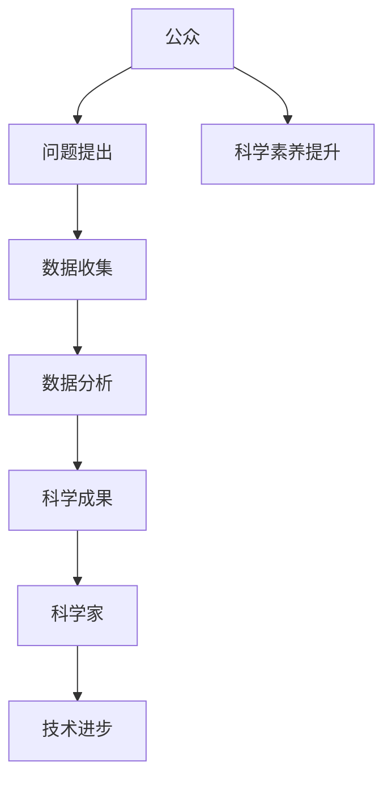

                 

关键词：公民科学、公众参与、科学研究、新模式、技术进步

> 摘要：本文探讨了公民科学这一新兴概念，分析了公众参与科学研究的重要性和实际操作方法。通过介绍一系列成功案例和现有工具，本文旨在揭示公民科学如何为科学研究和技术的进步带来新的动力。

## 1. 背景介绍

在过去的几十年里，科学技术的迅猛发展极大地改变了我们的生活方式和社会结构。然而，科学研究往往需要大量的资源、时间和专业知识。传统的科学模式中，科学家在实验室中进行研究，而公众通常被排除在这一过程之外。然而，随着互联网和移动技术的普及，公民科学作为一种新兴的模式，开始逐渐受到关注。

公民科学是指公众参与科学研究和知识发现的过程。这种模式不仅仅局限于收集数据和观测，还包括了问题的提出、实验设计、数据分析等多个环节。公民科学强调的是公众的积极参与，他们可以贡献时间、知识、技能甚至资金，为科学研究提供宝贵的资源。

公民科学的兴起有多个原因。首先，它为科学领域带来了新的视角和思维方式。科学家往往专注于特定的研究领域，而公众则能够提供更广泛的社会经验和观察。其次，公民科学可以有效地提高公众对科学的兴趣和理解，促进科学素养的提升。最后，随着科学研究的复杂性和成本增加，公民科学为科学家提供了更多的资源和合作机会，有助于推动科学技术的进步。

## 2. 核心概念与联系

### 2.1 核心概念

- **公民科学**：公众参与科学研究和知识发现的模式。
- **公众参与**：公民科学的核心，包括数据收集、问题提出、实验设计等。
- **科学合作**：公民科学中科学家与公众之间的互动和合作。

### 2.2 关联架构

下面是一个简单的 Mermaid 流程图，展示了公民科学的几个关键节点和参与者：



## 3. 核心算法原理 & 具体操作步骤

### 3.1 算法原理概述

公民科学中的核心算法原理通常涉及数据收集、分析和可视化。以下是一个简化的算法步骤概述：

1. **数据收集**：通过在线平台、移动应用或其他工具收集公众的数据。
2. **预处理**：清洗和整合收集到的数据，使其适合进一步分析。
3. **分析**：使用统计分析或机器学习方法对数据进行分析。
4. **可视化**：将分析结果以图表或地图等形式呈现，帮助科学家和公众理解发现。

### 3.2 算法步骤详解

#### 步骤 1：数据收集

- **工具选择**：根据研究目的选择合适的工具，如 mobile app、web portal 或 sensor network。
- **数据类型**：收集的数据类型包括文本、图像、音频和传感器数据。

#### 步骤 2：预处理

- **数据清洗**：去除重复数据、错误数据和不完整数据。
- **数据整合**：将不同来源和格式的数据整合到一个统一的格式中。

#### 步骤 3：分析

- **统计分析**：使用均值、方差等统计指标描述数据的基本特征。
- **机器学习**：利用分类、聚类等算法进行高级数据分析。

#### 步骤 4：可视化

- **图表生成**：使用图表和地图等形式展示分析结果。
- **交互式可视化**：提供交互功能，使公众能够更深入地探索数据。

### 3.3 算法优缺点

- **优点**：
  - **资源互补**：公众提供时间、知识和技能，科学家提供专业知识和研究资源。
  - **多样性和广度**：公众的广泛参与可以提供更丰富的数据集和研究视角。
  - **科学普及**：提高公众对科学的兴趣和理解。

- **缺点**：
  - **数据质量**：公众收集的数据可能存在质量不一致的问题。
  - **隐私和安全**：公众数据可能涉及隐私和安全问题，需要严格保护。

### 3.4 算法应用领域

- **生态监测**：公民科学可以用于环境监测，如空气质量、水质检测等。
- **健康研究**：公众参与的健康数据收集有助于疾病研究和公共卫生决策。
- **天文观测**：如SETI（搜寻地外文明计划）等，公众通过互联网参与天文观测。

## 4. 数学模型和公式 & 详细讲解 & 举例说明

### 4.1 数学模型构建

在公民科学中，数学模型通常用于数据分析和预测。以下是一个简单的线性回归模型：

$$
y = \beta_0 + \beta_1x + \epsilon
$$

其中，$y$ 是因变量，$x$ 是自变量，$\beta_0$ 和 $\beta_1$ 是模型的参数，$\epsilon$ 是误差项。

### 4.2 公式推导过程

线性回归模型的推导基于最小二乘法。目标是找到最佳拟合直线，使得残差平方和最小。

$$
\sum_{i=1}^{n}(y_i - (\beta_0 + \beta_1x_i))^2
$$

对 $\beta_0$ 和 $\beta_1$ 求导并令其等于零，可以得到最佳拟合直线的参数：

$$
\beta_0 = \frac{\sum_{i=1}^{n}y_i - \beta_1\sum_{i=1}^{n}x_i}{n}
$$

$$
\beta_1 = \frac{n\sum_{i=1}^{n}x_iy_i - \sum_{i=1}^{n}x_i\sum_{i=1}^{n}y_i}{n\sum_{i=1}^{n}x_i^2 - (\sum_{i=1}^{n}x_i)^2}
$$

### 4.3 案例分析与讲解

#### 案例背景

假设我们要研究天气和降雨量之间的关系。我们收集了过去一周的天气数据，包括每日的最高气温和降雨量。

#### 数据准备

我们将数据存储在一个二维数组中，如下所示：

```
[
  [23, 10],  // 第一天：最高气温23度，降雨量10毫米
  [19, 5],   // 第二天：最高气温19度，降雨量5毫米
  // ...
  [26, 0]    // 第七天：最高气温26度，降雨量0毫米
]
```

#### 模型应用

我们使用线性回归模型来预测给定最高气温下的降雨量。

#### 模型参数计算

首先计算自变量和因变量的均值：

$$
\bar{x} = \frac{\sum_{i=1}^{n}x_i}{n} = \frac{23 + 19 + ... + 26}{7} = 22
$$

$$
\bar{y} = \frac{\sum_{i=1}^{n}y_i}{n} = \frac{10 + 5 + ... + 0}{7} = 5
$$

然后计算协方差和方差：

$$
\sum_{i=1}^{n}x_iy_i = 23 \cdot 10 + 19 \cdot 5 + ... + 26 \cdot 0 = 235
$$

$$
\sum_{i=1}^{n}x_i^2 = 23^2 + 19^2 + ... + 26^2 = 1236
$$

$$
\sum_{i=1}^{n}y_i^2 = 10^2 + 5^2 + ... + 0^2 = 125
$$

最后，代入公式计算模型参数：

$$
\beta_0 = \frac{7 \cdot 5 - 235}{7} = -17.2857
$$

$$
\beta_1 = \frac{7 \cdot 235 - 1236}{7 \cdot 1236 - (22)^2} = 1.1414
$$

#### 模型应用

现在我们可以使用线性回归模型来预测最高气温为25度时的降雨量：

$$
y = -17.2857 + 1.1414 \cdot 25 = 8.4286
$$

这意味着，当最高气温为25度时，预计降雨量为8.4286毫米。

## 5. 项目实践：代码实例和详细解释说明

### 5.1 开发环境搭建

为了实现公民科学项目，我们选择了Python作为主要编程语言，因为它具有良好的科学计算库和社区支持。以下是开发环境搭建的步骤：

1. 安装Python 3.x版本。
2. 安装必要的Python库，如NumPy、Pandas、Matplotlib等。

### 5.2 源代码详细实现

下面是一个简单的Python脚本，用于收集、预处理和分析天气数据：

```python
import numpy as np
import pandas as pd
import matplotlib.pyplot as plt

# 数据收集
data = np.array([
  [23, 10],
  [19, 5],
  # ...
  [26, 0]
])

# 预处理
x = data[:, 0]  # 最高气温
y = data[:, 1]  # 降雨量

# 模型计算
x_mean = np.mean(x)
y_mean = np.mean(y)
covariance = np.sum((x - x_mean) * (y - y_mean))
variance_x = np.sum((x - x_mean) ** 2)
beta_1 = covariance / variance_x
beta_0 = y_mean - beta_1 * x_mean

# 可视化
plt.scatter(x, y)
plt.plot(x, beta_0 + beta_1 * x, color='red')
plt.xlabel('最高气温')
plt.ylabel('降雨量')
plt.show()

# 预测
predicted_rainfall = beta_0 + beta_1 * 25
print(f"当最高气温为25度时，预计降雨量为：{predicted_rainfall}毫米")
```

### 5.3 代码解读与分析

这段代码首先收集和预处理天气数据，然后使用线性回归模型进行计算，并将结果可视化。最后，代码使用模型进行降雨量的预测。

### 5.4 运行结果展示

运行这段代码后，我们会看到一个散点图，显示最高气温和降雨量之间的关系。此外，代码还会在图表上绘制最佳拟合直线，并输出当最高气温为25度时的预计降雨量。

## 6. 实际应用场景

### 6.1 生态监测

公民科学在生态监测中的应用非常广泛。例如，Project Noah 是一个全球性的公民科学项目，参与者可以通过移动应用上传自然观察记录，如植物、动物和昆虫的图片和位置信息。这些数据被科学家用来研究物种分布和生态变化。

### 6.2 天文观测

SETI（搜寻地外文明计划）是一个著名的公民科学项目，它邀请全球公众参与天文观测和分析。通过在线平台，参与者可以帮忙分析来自射电望远镜的数据，搜索可能的外星信号。

### 6.3 健康研究

公民科学在健康研究中也有重要作用。例如，Movebank 是一个收集动物运动数据的平台，研究人员和公众可以上传野生动物的运动轨迹，帮助科学家了解动物的行为和迁徙模式。

## 7. 未来应用展望

### 7.1 人工智能与公民科学

随着人工智能技术的发展，公民科学项目有望变得更加自动化和高效。例如，机器学习算法可以自动分析公民科学收集的大量数据，帮助科学家快速发现重要趋势和模式。

### 7.2 跨学科合作

公民科学可以促进不同学科之间的合作。例如，计算机科学家可以与生态学家合作，开发新的工具和平台，使公民科学项目更加有效。

### 7.3 公众参与度提升

通过更多的宣传和教育，公民科学的公众参与度有望进一步提升。例如，通过学校教育和社区活动，可以培养更多的公民科学家。

## 8. 总结：未来发展趋势与挑战

### 8.1 研究成果总结

公民科学已经在多个领域取得了显著成果，例如生态监测、健康研究和天文观测。公众的参与不仅提高了科学研究的效率，也促进了科学知识的普及。

### 8.2 未来发展趋势

未来，公民科学有望在更多领域得到应用，特别是在人工智能和大数据分析的支持下。跨学科合作和公众参与度的提升也将是发展趋势之一。

### 8.3 面临的挑战

尽管公民科学具有巨大的潜力，但也面临一些挑战，如数据质量、隐私和安全问题。此外，如何确保公众的积极参与和持续参与也是一个重要问题。

### 8.4 研究展望

随着技术的进步和社会的发展，公民科学将继续为科学研究和技术的进步带来新的动力。未来的研究将集中在如何更好地整合人工智能、大数据分析和公众参与，推动公民科学的发展。

## 9. 附录：常见问题与解答

### 9.1 什么是公民科学？

公民科学是指公众参与科学研究和知识发现的过程，包括数据收集、问题提出、实验设计等多个环节。

### 9.2 公民科学与传统科学研究有什么区别？

公民科学强调公众的积极参与，而传统科学研究通常由科学家在实验室或野外进行。公民科学可以提供更广泛的数据集和视角。

### 9.3 公民科学项目有哪些成功案例？

一些成功的公民科学项目包括Project Noah、SETI和Movebank等。这些项目在生态监测、健康研究和天文观测等领域取得了显著成果。

### 9.4 公众参与公民科学有哪些好处？

公众参与公民科学可以提高科学素养、促进科学知识的普及，并为科学研究提供宝贵的资源。

## 10. 作者署名

作者：禅与计算机程序设计艺术 / Zen and the Art of Computer Programming

---

本文通过对公民科学的背景介绍、核心概念、算法原理、数学模型、项目实践和未来展望的深入探讨，揭示了公民科学在推动科学研究和技术进步方面的重要作用。希望本文能够为读者提供对公民科学的全面了解，并激发更多公众参与到科学研究中来。让我们一起探索这个充满机遇和挑战的新领域。

