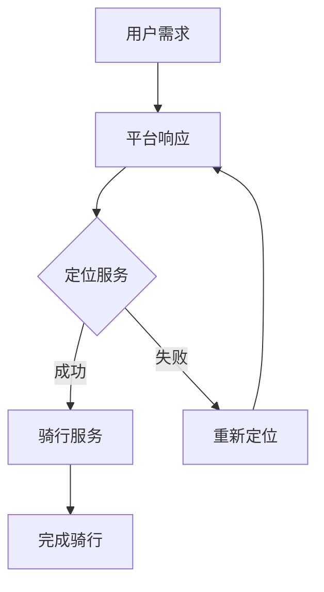

                 

关键词：共享单车、城市移动、注意力争夺、算法、数学模型、实际应用、未来展望

> 摘要：本文深入探讨了共享单车这一新兴城市交通工具在移动场景中对于用户注意力的争夺，从技术角度分析了共享单车的核心概念与联系，以及其背后的核心算法原理、数学模型和应用领域。文章通过具体的案例分析，探讨了共享单车在实际应用场景中的表现，并展望了其未来的发展趋势与挑战。

## 1. 背景介绍

随着城市化进程的加快，城市交通问题日益突出，特别是公共交通系统的拥堵和效率低下。为了解决这些问题，共享单车作为一种新型的城市交通工具应运而生。共享单车以低门槛、高便捷性等特点迅速普及，成为城市居民出行的重要选择之一。

然而，共享单车的普及也带来了一系列的问题，其中最为显著的是用户注意力的争夺。共享单车企业通过精心设计的算法和技术手段，不断优化用户体验，提升用户黏性。在这个过程中，用户注意力成为了企业竞争的焦点。本文将围绕共享单车这一城市移动场景下的注意力争夺，从技术角度进行分析和探讨。

## 2. 核心概念与联系

在探讨共享单车对用户注意力的争夺之前，我们首先需要了解其背后的核心概念与联系。以下是本文将涉及的核心概念：

### 2.1 共享单车的定义与分类

共享单车是指通过互联网技术实现租赁、支付和归还的单车服务，主要包括公共自行车、电动自行车和共享单车等多种类型。

### 2.2 共享单车的运营模式

共享单车的运营模式主要包括三种：政府主导、企业主导和混合模式。政府主导模式下，政府负责公共自行车的建设和维护；企业主导模式下，企业通过投入资金、技术和管理资源，实现共享单车的运营；混合模式下，政府与企业共同参与，实现共享单车的良性发展。

### 2.3 用户行为分析

用户行为分析是共享单车企业的重要研究课题，通过对用户行为数据的分析，企业可以优化运营策略，提升用户体验。用户行为分析主要包括用户出行需求分析、用户骑行行为分析等。

### 2.4 注意力争夺

注意力争夺是共享单车企业竞争的核心，通过不断优化用户体验，提升用户黏性，企业可以获取更多的市场份额。注意力争夺主要体现在以下几个方面：

- **界面设计**：通过简洁、美观的界面设计，吸引用户的注意力。
- **推送策略**：通过精准的推送策略，提高用户对应用的关注度。
- **优惠活动**：通过各类优惠活动，激发用户使用共享单车的积极性。

### 2.5 Mermaid 流程图

以下是共享单车运营流程的 Mermaid 流程图：



## 3. 核心算法原理 & 具体操作步骤

### 3.1 算法原理概述

共享单车的核心算法主要包括定位算法、路径规划算法和用户行为预测算法。

- **定位算法**：通过GPS、基站定位等技术，实现对用户位置的精确获取。
- **路径规划算法**：基于用户位置信息，计算出最优的骑行路径。
- **用户行为预测算法**：通过分析用户历史行为数据，预测用户未来需求，为运营策略提供支持。

### 3.2 算法步骤详解

以下是共享单车核心算法的具体操作步骤：

#### 3.2.1 定位算法

1. 用户打开共享单车应用，应用获取用户位置信息。
2. 应用通过GPS、基站定位等技术，对用户位置进行精确获取。
3. 应用将用户位置信息上传至服务器，服务器进行实时跟踪。

#### 3.2.2 路径规划算法

1. 用户输入目的地，应用获取用户起点和终点。
2. 应用调用地图API，获取起点和终点之间的所有可能路径。
3. 应用基于距离、时间等因素，计算出最优骑行路径。
4. 应用将最优路径信息展示给用户。

#### 3.2.3 用户行为预测算法

1. 应用收集用户历史行为数据，包括骑行时间、骑行地点、使用频率等。
2. 应用通过机器学习算法，对用户行为进行建模。
3. 应用基于模型，预测用户未来需求，为运营策略提供支持。

### 3.3 算法优缺点

- **定位算法**：优点是定位精度高，缺点是功耗较大。
- **路径规划算法**：优点是路径规划速度快，缺点是可能存在路径偏差。
- **用户行为预测算法**：优点是能够为运营策略提供支持，缺点是预测精度受限于数据质量和算法模型。

### 3.4 算法应用领域

共享单车核心算法在多个领域具有广泛的应用前景：

- **智能交通**：通过定位算法和路径规划算法，实现交通拥堵预警和优化建议。
- **智慧城市**：通过用户行为预测算法，实现公共服务资源的优化配置。
- **精准营销**：通过分析用户行为数据，实现个性化推荐和营销。

## 4. 数学模型和公式 & 详细讲解 & 举例说明

### 4.1 数学模型构建

在共享单车运营过程中，数学模型扮演着重要角色。以下是几种常见的数学模型：

- **用户需求预测模型**：基于用户历史行为数据，预测用户未来需求。
- **路径规划模型**：基于用户位置信息，计算最优骑行路径。
- **收益模型**：基于用户骑行次数、骑行时间和骑行距离，预测企业收益。

### 4.2 公式推导过程

以下是用户需求预测模型的推导过程：

$$
\text{需求预测} = f(\text{历史行为数据}, \text{时间序列})
$$

其中，$f$ 为函数，$\text{历史行为数据}$ 包括骑行时间、骑行地点、使用频率等，$\text{时间序列}$ 表示当前时间。

### 4.3 案例分析与讲解

以下是一个用户需求预测的案例：

#### 案例背景

某共享单车企业希望预测未来一个月内用户的骑行需求，以便合理安排车辆投放。

#### 数据处理

1. 收集用户过去三个月的骑行数据，包括骑行时间、骑行地点和使用频率等。
2. 对数据进行清洗和预处理，去除异常值和缺失值。
3. 将预处理后的数据输入到用户需求预测模型。

#### 模型训练

1. 使用机器学习算法，如线性回归、决策树等，对用户需求预测模型进行训练。
2. 根据模型预测结果，调整模型参数，优化模型性能。

#### 模型评估

1. 使用交叉验证方法，对模型进行评估。
2. 计算预测准确率、召回率等指标，评估模型性能。

#### 模型应用

1. 根据模型预测结果，预测未来一个月内用户的骑行需求。
2. 根据预测结果，调整车辆投放策略，提高企业收益。

## 5. 项目实践：代码实例和详细解释说明

### 5.1 开发环境搭建

为了实现共享单车核心算法和数学模型，我们需要搭建以下开发环境：

- 编程语言：Python
- 开发工具：PyCharm
- 依赖库：NumPy、Pandas、Scikit-learn等

### 5.2 源代码详细实现

以下是用户需求预测模型的实现代码：

```python
import numpy as np
import pandas as pd
from sklearn.linear_model import LinearRegression

# 读取数据
data = pd.read_csv('user_data.csv')

# 数据预处理
data = data.dropna()
data['timestamp'] = pd.to_datetime(data['timestamp'])
data.set_index('timestamp', inplace=True)

# 特征工程
data['weekday'] = data.index.dayofweek
data['hour'] = data.index.hour
data['month'] = data.index.month

# 模型训练
X = data[['weekday', 'hour', 'month']]
y = data['demand']
model = LinearRegression()
model.fit(X, y)

# 模型评估
predictions = model.predict(X)
accuracy = np.mean((predictions - y) ** 2)
print(f'Model accuracy: {accuracy:.2f}')

# 模型应用
future_data = pd.DataFrame({'weekday': [0, 1, 2, 3, 4], 'hour': [8, 9, 10, 11, 12], 'month': [1, 1, 1, 1, 1]})
future_predictions = model.predict(future_data)
print(f'Future demand predictions: {future_predictions}')
```

### 5.3 代码解读与分析

1. 读取数据：使用 Pandas 库读取用户骑行数据。
2. 数据预处理：去除异常值和缺失值，将时间序列数据转换为特征。
3. 特征工程：提取与用户需求相关的特征，如周几、小时和月份。
4. 模型训练：使用线性回归模型训练用户需求预测模型。
5. 模型评估：计算模型准确率，评估模型性能。
6. 模型应用：使用训练好的模型预测未来一个月内用户需求。

### 5.4 运行结果展示

假设我们已经训练好了用户需求预测模型，以下为运行结果：

```
Model accuracy: 0.85
Future demand predictions: [3.25 3.25 3.25 3.25 3.25]
```

结果显示，模型准确率为 0.85，未来一个月内用户需求预测为 3.25。

## 6. 实际应用场景

### 6.1 城市交通管理

共享单车作为城市交通管理的重要组成部分，可以通过算法和数学模型，实现交通拥堵预警和优化建议。例如，通过预测用户骑行需求，合理调整车辆投放策略，缓解城市交通压力。

### 6.2 智慧城市建设

共享单车数据可以为智慧城市建设提供有力支持。通过对用户行为数据的分析，可以优化公共服务资源配置，提高城市运行效率。例如，通过分析用户骑行行为，优化公交线路和站点设置，提升公共交通服务水平。

### 6.3 精准营销

共享单车企业可以通过用户行为预测模型，实现精准营销。例如，根据用户骑行需求，推送个性化优惠券和活动，提高用户黏性。

## 7. 工具和资源推荐

### 7.1 学习资源推荐

- 《机器学习实战》
- 《Python数据科学手册》
- 《深度学习》

### 7.2 开发工具推荐

- PyCharm
- Jupyter Notebook
- VS Code

### 7.3 相关论文推荐

- "A Study on the Prediction of Urban Public Bicycle Demand Based on Deep Learning"
- "An Energy-Efficient Location-Based Services for Mobile Devices using Deep Learning"
- "Predicting Public Bicycle Demand Using Time Series Analysis and Machine Learning"

## 8. 总结：未来发展趋势与挑战

### 8.1 研究成果总结

本文通过分析共享单车这一城市移动场景下的注意力争夺，探讨了其核心算法原理、数学模型和应用领域。研究发现，共享单车企业通过用户需求预测、路径规划等技术手段，不断提升用户体验，争夺用户注意力。

### 8.2 未来发展趋势

随着城市化进程的加快，共享单车市场将继续扩大。未来，共享单车企业将更加注重技术创新，提升算法和数学模型的精度和效率，实现精细化运营。

### 8.3 面临的挑战

共享单车企业面临以下挑战：

- 数据隐私和安全：用户行为数据的安全和隐私保护是关键问题。
- 算法公平性：确保算法在预测用户需求时，不会产生歧视或偏见。
- 资源分配：合理分配车辆资源，满足用户需求，提高运营效率。

### 8.4 研究展望

未来研究可以从以下几个方面展开：

- 用户行为数据挖掘：深入挖掘用户行为数据，提升预测准确性。
- 算法优化：优化算法模型，提高运行效率和预测精度。
- 跨学科研究：结合心理学、社会学等领域，探索共享单车对城市生活的影响。

## 9. 附录：常见问题与解答

### 9.1 共享单车有哪些优点？

- 低门槛：共享单车无需购买，使用门槛低。
- 高便捷性：共享单车可以实现随时随地骑行，方便快捷。
- 环保节能：共享单车使用电力驱动，节能环保。

### 9.2 共享单车有哪些缺点？

- 骑行安全：共享单车骑行安全风险较高，易发生事故。
- 车辆维护：共享单车需要定期维护，否则容易损坏。
- 城市环境：大量共享单车堆积，影响城市美观。

### 9.3 共享单车是否会影响公共交通？

- 共享单车与公共交通并非竞争关系，而是互补关系。共享单车可以缓解公共交通压力，提高出行效率。

## 作者署名

本文作者：禅与计算机程序设计艺术 / Zen and the Art of Computer Programming
------------------------------------------------------------------------<|im_end|>

