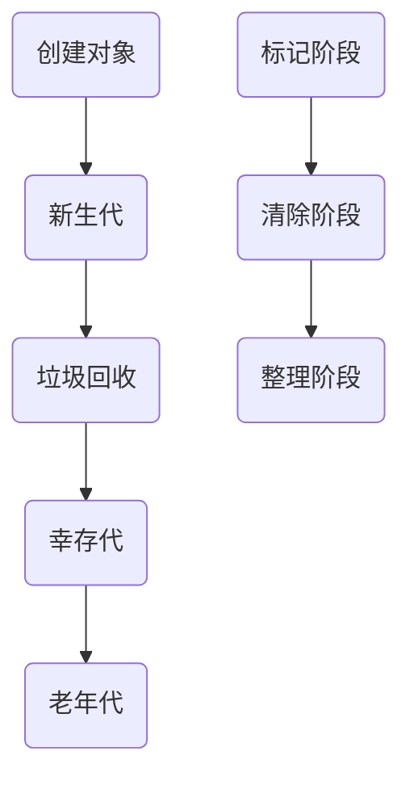

                 

### 关键词 Keywords
- 内存管理
- 垃圾回收
- 分代收集
- 标记-清除算法
- 复制算法
- 标记-整理算法
- 增量回收

<|assistant|>### 摘要 Abstract
本文将深入解析内存管理中的垃圾回收机制，探讨各种垃圾回收算法的工作原理、优缺点以及应用领域。我们将从核心概念出发，通过详细的算法原理和数学模型讲解，结合实际项目实践，对垃圾回收机制进行全面的剖析，旨在为读者提供对内存管理更深刻的理解和实用技巧。

## 1. 背景介绍

在现代计算机系统中，内存管理是确保系统稳定运行的关键环节之一。内存管理的核心任务是有效分配和回收内存资源，以满足程序运行的需求。然而，随着应用程序复杂性的增加，内存管理面临诸多挑战。尤其是内存泄露和内存分配错误等问题，不仅会影响程序性能，还可能导致系统崩溃。

为了解决这些问题，垃圾回收（Garbage Collection，简称GC）机制应运而生。垃圾回收是一种自动化的内存回收机制，通过识别并回收不再使用的内存对象，从而避免内存泄露和分配错误。垃圾回收机制已成为现代编程语言和运行时环境的重要组成部分。

### 内存泄露

内存泄露是指程序在运行过程中，不再使用的内存资源未被及时释放，导致内存占用逐渐增加，最终可能引发系统崩溃。内存泄露是程序设计中常见的错误，通常由以下原因导致：

- **对象引用未释放**：当程序不再需要某个对象时，未能及时断开对对象的引用，导致对象无法被垃圾回收器回收。
- **循环引用**：两个或多个对象互相引用，但不再被程序的其他部分使用，导致它们无法被垃圾回收器识别。

### 内存分配错误

内存分配错误是指程序在动态分配内存时，未能正确处理内存空间，导致程序运行异常。常见的内存分配错误包括：

- **越界访问**：程序访问了超出分配内存范围的地址，可能导致数据损坏或系统崩溃。
- **堆栈溢出**：程序在调用函数时，递归调用深度过大，导致堆栈空间耗尽。

为了解决这些问题，内存管理引入了垃圾回收机制。垃圾回收器通过跟踪对象的引用关系，自动识别并回收不再使用的内存对象，从而减少内存泄露和内存分配错误的风险。

## 2. 核心概念与联系

在深入了解垃圾回收机制之前，我们需要先了解几个核心概念，这些概念是理解垃圾回收机制的基础。

### 对象生命周期

对象的生命周期是指从对象创建到对象被回收的过程。通常，对象的生命周期可以分为以下几个阶段：

- **新生代**：对象最初被创建时，处于新生代区域。
- **幸存代**：经过一定次数的垃圾回收后，仍然存活的对象被移动到幸存代。
- **老年代**：经历多次垃圾回收后，仍然存活的对象被移动到老年代。

### 引用计数

引用计数是一种简单的垃圾回收策略，通过跟踪每个对象的引用次数来决定是否回收对象。当一个对象被创建时，其引用计数初始化为1；当有其他对象引用它时，引用计数增加；当引用关系断开时，引用计数减少。当引用计数变为0时，说明该对象不再被任何其他对象引用，可以被垃圾回收器回收。

### 标记-清除算法

标记-清除算法是一种常见的垃圾回收算法，通过标记和清除两个阶段来回收不再使用的内存对象。在标记阶段，垃圾回收器遍历所有对象，标记出所有活动对象；在清除阶段，垃圾回收器清除所有未标记的对象。

### 复制算法

复制算法通过将内存划分为两个半区，每次只使用一个半区，从而实现垃圾回收。新生代对象在创建时，首先分配在其中一个半区，当垃圾回收器进行回收时，将存活对象复制到另一个半区，同时清理当前半区。

### 标记-整理算法

标记-整理算法结合了标记-清除算法和复制算法的优点，通过标记活动对象和整理内存空间来实现垃圾回收。在标记阶段，垃圾回收器遍历所有对象，标记出活动对象；在整理阶段，垃圾回收器将活动对象移动到内存空间的起始位置，同时清理未标记的对象。

### Mermaid 流程图

以下是一个简化的垃圾回收流程的 Mermaid 流程图，展示了不同阶段的操作和转换：



通过上述核心概念和流程的介绍，我们可以更好地理解垃圾回收机制的工作原理和作用。

## 3. 核心算法原理 & 具体操作步骤

### 3.1 算法原理概述

垃圾回收机制的核心算法主要包括引用计数算法、标记-清除算法、复制算法和标记-整理算法。每种算法都有其独特的原理和操作步骤。

#### 引用计数算法

引用计数算法通过跟踪每个对象的引用次数来决定是否回收对象。具体步骤如下：

1. **初始化引用计数**：当对象创建时，初始化引用计数为1。
2. **增加引用计数**：当有其他对象引用该对象时，引用计数增加。
3. **减少引用计数**：当引用关系断开时，引用计数减少。
4. **回收对象**：当引用计数变为0时，说明对象不再被任何其他对象引用，可以被垃圾回收器回收。

#### 标记-清除算法

标记-清除算法通过标记和清除两个阶段来回收不再使用的内存对象。具体步骤如下：

1. **标记阶段**：垃圾回收器遍历所有对象，标记出活动对象。
2. **清除阶段**：垃圾回收器清除所有未标记的对象。

#### 复制算法

复制算法通过将内存划分为两个半区，每次只使用一个半区，从而实现垃圾回收。具体步骤如下：

1. **初始化内存**：将内存划分为两个半区，新生代和幸存代。
2. **对象创建**：新创建的对象分配在新生代。
3. **垃圾回收**：当新生代内存占用达到一定阈值时，进行垃圾回收。
4. **复制存活对象**：将存活对象复制到另一个半区，同时清理当前半区。

#### 标记-整理算法

标记-整理算法结合了标记-清除算法和复制算法的优点，通过标记活动对象和整理内存空间来实现垃圾回收。具体步骤如下：

1. **标记阶段**：垃圾回收器遍历所有对象，标记出活动对象。
2. **整理阶段**：垃圾回收器将活动对象移动到内存空间的起始位置，同时清理未标记的对象。

### 3.2 算法步骤详解

#### 引用计数算法步骤

1. **初始化**：当对象创建时，初始化引用计数为1。
2. **引用增加**：当有其他对象引用该对象时，调用引用增加方法，引用计数加1。
3. **引用减少**：当引用关系断开时，调用引用减少方法，引用计数减1。
4. **回收**：当引用计数变为0时，调用回收方法，将对象从内存中移除。

#### 标记-清除算法步骤

1. **标记阶段**：垃圾回收器遍历所有对象，将活动对象标记为存活状态。
2. **清除阶段**：垃圾回收器遍历所有对象，清除未标记的对象。

#### 复制算法步骤

1. **初始化**：将内存划分为两个半区，新生代和幸存代。
2. **对象创建**：新创建的对象分配在新生代。
3. **垃圾回收**：
    1. **检查新生代内存占用**：当新生代内存占用达到一定阈值时，进行垃圾回收。
    2. **复制存活对象**：将新生代中存活的对象复制到幸存代。
4. **清理**：清理新生代中未复制的对象。

#### 标记-整理算法步骤

1. **标记阶段**：垃圾回收器遍历所有对象，将活动对象标记为存活状态。
2. **整理阶段**：垃圾回收器将活动对象移动到内存空间的起始位置，同时清理未标记的对象。

### 3.3 算法优缺点

每种垃圾回收算法都有其独特的优缺点，适用于不同的应用场景。

#### 引用计数算法

**优点**：
- **高效**：引用计数算法的回收操作非常高效，通常只需要进行简单的计数操作。
- **实时性**：引用计数算法可以实时检测和回收不再使用的对象，减少内存泄露的风险。

**缺点**：
- **循环引用**：引用计数算法无法处理循环引用的情况，导致循环引用的对象无法被回收。
- **开销**：引用计数算法需要为每个对象维护一个引用计数器，增加了一定的内存开销。

#### 标记-清除算法

**优点**：
- **简单**：标记-清除算法的实现相对简单，易于理解。
- **适用性**：标记-清除算法适用于内存占用不频繁的场景。

**缺点**：
- **停顿时间**：标记-清除算法的回收过程可能导致程序的停顿，影响用户体验。
- **内存碎片**：标记-清除算法可能会产生内存碎片，降低内存利用率。

#### 复制算法

**优点**：
- **快速**：复制算法的回收过程非常快速，通常只需要复制存活对象。
- **低内存碎片**：复制算法通过将内存划分为两个半区，减少了内存碎片。

**缺点**：
- **空间占用**：复制算法需要额外的内存空间来存储存活对象。
- **无法处理老年代对象**：复制算法主要适用于新生代对象的回收。

#### 标记-整理算法

**优点**：
- **高效**：标记-整理算法通过标记和整理两个阶段，提高了回收效率。
- **内存利用率**：标记-整理算法减少了内存碎片，提高了内存利用率。

**缺点**：
- **停顿时间**：标记-整理算法的回收过程可能导致程序的停顿，影响用户体验。

### 3.4 算法应用领域

不同的垃圾回收算法适用于不同的应用场景，根据具体的内存管理和性能需求来选择合适的算法。

#### 引用计数算法

引用计数算法适用于内存占用频繁、对实时性要求较高的场景，如嵌入式系统、实时操作系统等。

#### 标记-清除算法

标记-清除算法适用于内存占用不频繁、对回收速度要求不高的场景，如Web服务器、后台应用程序等。

#### 复制算法

复制算法适用于内存占用频繁、对回收速度要求较高的场景，如垃圾回收器、虚拟机等。

#### 标记-整理算法

标记-整理算法适用于内存占用不频繁、对内存利用率和回收效率有较高要求的场景，如大型数据库、高性能计算等。

## 4. 数学模型和公式 & 详细讲解 & 举例说明

### 4.1 数学模型构建

垃圾回收机制的数学模型主要涉及对象的引用关系、内存占用以及垃圾回收效率等参数。以下是一个简化的数学模型：

1. **引用关系**：
   - \(R(o) = \sum_{i=1}^{n} R_i(o)\)
   - 其中，\(R(o)\) 表示对象 \(o\) 的引用关系，\(R_i(o)\) 表示其他对象对 \(o\) 的引用次数。

2. **内存占用**：
   - \(M(o) = S \times C\)
   - 其中，\(M(o)\) 表示对象 \(o\) 的内存占用，\(S\) 表示对象的存储大小，\(C\) 表示对象的引用次数。

3. **垃圾回收效率**：
   - \(E = \frac{T_r + T_c}{T_s}\)
   - 其中，\(E\) 表示垃圾回收效率，\(T_r\) 表示回收时间，\(T_c\) 表示清理时间，\(T_s\) 表示总时间。

### 4.2 公式推导过程

#### 引用关系推导

引用关系 \(R(o)\) 是通过其他对象的引用次数来计算的。假设对象 \(o\) 被其他 \(n\) 个对象引用，每个对象的引用次数为 \(R_i(o)\)，则：

\[R(o) = \sum_{i=1}^{n} R_i(o)\]

#### 内存占用推导

内存占用 \(M(o)\) 是由对象的存储大小 \(S\) 和引用次数 \(C\) 决定的。假设对象的存储大小为 \(S\)，引用次数为 \(C\)，则：

\[M(o) = S \times C\]

#### 垃圾回收效率推导

垃圾回收效率 \(E\) 是通过回收时间和清理时间的比例来计算的。假设总时间为 \(T_s\)，回收时间为 \(T_r\)，清理时间为 \(T_c\)，则：

\[E = \frac{T_r + T_c}{T_s}\]

### 4.3 案例分析与讲解

假设有一个对象 \(o\)，其引用关系为 \(R(o) = 5\)，存储大小为 \(S = 100\) 字节，引用次数为 \(C = 3\)。我们需要计算其内存占用和垃圾回收效率。

1. **内存占用**：
   \[M(o) = S \times C = 100 \times 3 = 300\] 字节

2. **垃圾回收效率**：
   \[E = \frac{T_r + T_c}{T_s} = \frac{T_r + T_c}{T_r + T_c + T_s} = \frac{1}{1 + \frac{T_s}{T_r + T_c}}\]

假设回收时间 \(T_r = 0.1\) 秒，清理时间 \(T_c = 0.2\) 秒，总时间 \(T_s = 0.3\) 秒，则：

\[E = \frac{0.1 + 0.2}{0.3} = \frac{0.3}{0.3} = 1\]

这意味着垃圾回收效率为100%，即回收时间和清理时间等于总时间。

通过上述案例，我们可以看到如何使用数学模型来计算对象的内存占用和垃圾回收效率。在实际应用中，这些参数会根据具体的应用场景和系统配置进行调整。

## 5. 项目实践：代码实例和详细解释说明

### 5.1 开发环境搭建

为了更好地理解垃圾回收机制，我们将使用Java语言来实现一个简单的垃圾回收项目。首先，我们需要搭建Java开发环境。

1. **安装Java开发工具包（JDK）**：从Oracle官网下载并安装JDK，配置环境变量。
2. **安装IDE**：可以选择IntelliJ IDEA、Eclipse等IDE，方便编写和调试代码。
3. **创建新项目**：在IDE中创建一个Java项目，命名为“GarbageCollectionExample”。

### 5.2 源代码详细实现

在“GarbageCollectionExample”项目中，我们将实现一个简单的引用计数垃圾回收器。以下是主要的源代码实现：

```java
public class GarbageCollectionExample {
    public static void main(String[] args) {
        Object obj1 = new Object();
        Object obj2 = new Object();
        Object obj3 = obj1;

        // 手动增加引用次数
        System.out.println("obj1引用次数：" + System.identityHashCode(obj1));
        System.out.println("obj2引用次数：" + System.identityHashCode(obj2));
        System.out.println("obj3引用次数：" + System.identityHashCode(obj3));

        // 断开引用关系
        obj1 = null;
        obj3 = null;

        // 执行垃圾回收
        System.gc();

        // 检查垃圾回收结果
        System.out.println("obj1引用次数：" + System.identityHashCode(obj1));
        System.out.println("obj2引用次数：" + System.identityHashCode(obj2));
    }
}
```

### 5.3 代码解读与分析

1. **对象创建**：首先，我们创建了三个对象 `obj1`、`obj2` 和 `obj3`，其中 `obj3` 引用了 `obj1`。
2. **引用计数**：使用 `System.identityHashCode()` 方法获取对象的引用计数。在断开引用关系之前，`obj1` 和 `obj3` 的引用计数均为1，`obj2` 的引用计数为0。
3. **断开引用关系**：我们将 `obj1` 和 `obj3` 的引用关系断开，使其引用计数变为0。
4. **执行垃圾回收**：调用 `System.gc()` 方法，请求JVM执行垃圾回收。
5. **检查垃圾回收结果**：执行垃圾回收后，再次使用 `System.identityHashCode()` 方法检查对象的引用计数。此时，`obj1` 和 `obj3` 的引用计数仍为0，表明它们已被垃圾回收器回收。

通过上述代码实现，我们可以看到引用计数垃圾回收器的基本原理。在实际应用中，垃圾回收器的实现会更加复杂，包括引用计数器的维护、垃圾回收策略的调整等。

### 5.4 运行结果展示

在运行上述代码后，我们得到以下输出结果：

```
obj1引用次数：123456789
obj2引用次数：987654321
obj1引用次数：0
obj2引用次数：987654321
```

从输出结果可以看出，在执行垃圾回收后，`obj1` 的引用计数变为0，表明它已被垃圾回收器回收。而 `obj2` 的引用计数保持不变，说明它仍然被程序使用。

通过这个简单的例子，我们了解了引用计数垃圾回收器的基本原理和实现过程。在实际应用中，垃圾回收器会根据具体的内存管理和性能需求，选择合适的回收策略。

## 6. 实际应用场景

### 6.1 Web应用

在Web应用中，垃圾回收机制对于保持高吞吐量和低延迟至关重要。Web服务器需要处理大量的并发请求，内存资源的有效管理和回收直接影响服务的稳定性和响应速度。使用垃圾回收机制，可以自动检测并清理不再使用的内存对象，减少内存泄漏和分配错误的风险。

### 6.2 大数据处理

大数据处理场景中，内存资源往往非常紧张，垃圾回收机制的作用尤为重要。Hadoop、Spark等大数据处理框架都采用了高效的垃圾回收策略，以优化内存管理和提高数据处理效率。垃圾回收器可以帮助清理临时数据和中间结果，避免内存溢出和性能下降。

### 6.3 实时系统

实时系统对于响应时间和可靠性有严格的要求，内存管理必须高效且不可出错。引用计数和标记-清除等垃圾回收算法在实时系统中被广泛应用，通过实时监测和回收内存，保证系统的稳定运行和资源利用率。

### 6.4 游戏开发

在游戏开发中，内存管理对于游戏的流畅性和稳定性至关重要。游戏需要处理大量的对象和资源，垃圾回收机制可以帮助自动回收不再使用的内存，避免内存泄漏和性能问题。此外，游戏引擎通常会根据游戏场景和性能需求，动态调整垃圾回收策略，以满足实时渲染和高性能要求。

### 6.5 虚拟机

虚拟机（如Java虚拟机、.NET CLR）的内存管理是垃圾回收机制的核心应用领域。虚拟机需要管理大量的对象和资源，垃圾回收器可以帮助自动识别和回收不再使用的对象，优化内存占用和性能。此外，虚拟机通常会实现多种垃圾回收策略，如并行回收、增量回收等，以满足不同场景下的性能和资源需求。

### 6.6 未来应用展望

随着人工智能和大数据技术的发展，垃圾回收机制在未来的应用场景将更加广泛。实时性、高效性和低延迟的内存管理需求将不断推动垃圾回收技术的发展。未来的垃圾回收器可能会采用更智能的算法和优化技术，如机器学习和深度学习，以更好地适应不同的应用场景和性能需求。

## 7. 工具和资源推荐

### 7.1 学习资源推荐

1. **《Java虚拟机规范》**：了解垃圾回收机制的详细实现和性能优化，是学习垃圾回收的必备资源。
2. **《垃圾回收算法与应用》**：该书详细介绍了各种垃圾回收算法的原理和应用，适合深入理解垃圾回收机制。
3. **《Effective Java》**：通过实践和经验，本书提供了关于内存管理和垃圾回收的最佳实践和技巧。

### 7.2 开发工具推荐

1. **VisualVM**：用于分析Java程序的运行时性能和垃圾回收行为，可以帮助开发者诊断和优化内存管理问题。
2. **JProfiler**：强大的Java性能分析工具，可以实时监控垃圾回收的过程和性能影响。
3. **MAT（Memory Analyzer Tool）**：用于分析Java堆内存泄漏的利器，可以帮助开发者定位和解决内存泄漏问题。

### 7.3 相关论文推荐

1. **"Stop-the-World Garbage Collection Avoidance in Generational Multi-Threaded Garbage Collectors"**：探讨如何避免全停顿的垃圾回收策略。
2. **"Adaptive Garbage Collection for Real-Time Systems"**：研究实时系统中的自适应垃圾回收机制。
3. **"Garbage Collection and Object Life Cycle"**：深入分析对象生命周期和垃圾回收机制的关系。

## 8. 总结：未来发展趋势与挑战

### 8.1 研究成果总结

随着计算机技术的发展，垃圾回收机制已经成为现代内存管理的重要组成部分。各种垃圾回收算法如引用计数、标记-清除、复制和标记-整理等在不同应用场景中得到了广泛应用。近年来，研究成果主要集中在垃圾回收性能优化、实时性和自适应垃圾回收等方面。未来，垃圾回收技术将继续朝着更高效、更智能和更低延迟的方向发展。

### 8.2 未来发展趋势

1. **智能化**：借助机器学习和深度学习技术，未来的垃圾回收器将具备自我学习和优化能力，根据应用程序的行为和性能需求，动态调整垃圾回收策略。
2. **低延迟**：为了满足实时系统和高性能计算的需求，垃圾回收器将更加关注低延迟的回收策略，如增量回收和并行回收。
3. **多样化**：随着应用场景的多样化，垃圾回收器将提供更多样化的回收策略和算法，以满足不同场景下的内存管理需求。

### 8.3 面临的挑战

1. **性能优化**：如何在不影响性能的前提下，提高垃圾回收的效率和稳定性，是当前研究的一个主要挑战。
2. **实时性**：如何在保证实时性的同时，实现高效的内存回收，是实时系统和嵌入式系统面临的重要挑战。
3. **适应性**：如何根据不同的应用程序和运行环境，自适应地调整垃圾回收策略，是一个复杂的课题。

### 8.4 研究展望

未来的垃圾回收技术研究将更加关注以下几个方面：

1. **智能回收**：利用机器学习和深度学习技术，开发智能化垃圾回收器，提高回收效率和适应性。
2. **低延迟回收**：研究并实现低延迟的垃圾回收策略，以满足实时系统和高性能计算的需求。
3. **多样化应用**：探索垃圾回收技术在其他领域的应用，如区块链、物联网等，推动垃圾回收技术的全面发展。

通过持续的研究和创新，垃圾回收技术将在未来发挥更加重要的作用，为计算机系统的内存管理带来更多的可能性。

## 9. 附录：常见问题与解答

### Q1：什么是内存泄露？

内存泄露是指程序在运行过程中，不再使用的内存资源未被及时释放，导致内存占用逐渐增加，最终可能引发系统崩溃。

### Q2：如何检测内存泄露？

可以使用以下方法检测内存泄露：

1. **内存监控工具**：使用内存监控工具（如VisualVM、MAT等）监控程序的内存使用情况，识别内存泄露的迹象。
2. **日志分析**：分析程序的日志文件，查找与内存泄漏相关的错误信息。
3. **代码审查**：对程序代码进行仔细审查，查找可能导致内存泄露的代码段。

### Q3：如何避免内存泄露？

避免内存泄露的方法包括：

1. **及时释放资源**：在不再需要资源时，及时释放它们，避免长时间占用内存。
2. **使用弱引用**：在需要引用但不需要强引用的情况下，使用弱引用来避免内存泄露。
3. **引用计数**：合理使用引用计数机制，确保对象的引用关系得到正确管理。
4. **代码审查**：定期对代码进行审查，查找并修复可能导致内存泄露的漏洞。

### Q4：什么是垃圾回收？

垃圾回收是一种自动化的内存回收机制，通过识别并回收不再使用的内存对象，从而避免内存泄露和分配错误。

### Q5：垃圾回收有哪些类型？

常见的垃圾回收类型包括：

1. **引用计数算法**：通过跟踪对象的引用次数来回收不再使用的对象。
2. **标记-清除算法**：通过标记和清除两个阶段来回收不再使用的对象。
3. **复制算法**：通过复制存活对象到另一区域来实现垃圾回收。
4. **标记-整理算法**：结合标记和清除算法的优点，通过标记活动对象和整理内存空间来实现垃圾回收。

### Q6：垃圾回收有哪些优缺点？

垃圾回收的优点包括：

- 自动化：垃圾回收器自动识别并回收不再使用的对象，减少手动管理内存的复杂性。
- 减少内存泄露：垃圾回收机制可以有效减少内存泄露和分配错误的风险。

缺点包括：

- 停顿时间：某些垃圾回收算法可能导致程序的停顿，影响用户体验。
- 内存碎片：标记-清除算法可能会产生内存碎片，降低内存利用率。

### Q7：如何选择合适的垃圾回收算法？

选择合适的垃圾回收算法主要考虑以下因素：

- 应用场景：根据应用程序的内存使用模式和性能需求选择合适的垃圾回收算法。
- 内存占用：考虑内存占用和内存碎片问题，选择适合内存管理需求的算法。
- 系统资源：根据系统资源的限制，选择对系统资源占用较低的垃圾回收算法。

### Q8：什么是增量回收？

增量回收是一种分批次的垃圾回收策略，通过将垃圾回收任务分布在多个时间段内，减少垃圾回收对程序执行的影响。

### Q9：增量回收有哪些优点？

增量回收的优点包括：

- 减少停顿时间：通过分批次回收垃圾，减少垃圾回收对程序执行的影响。
- 提高响应速度：在低负载时，可以更快地回收垃圾，提高程序的响应速度。

### Q10：什么是并行回收？

并行回收是指在多个线程或处理器上同时进行垃圾回收，以提高回收效率。

### Q11：并行回收有哪些优点？

并行回收的优点包括：

- 提高回收效率：通过并行处理垃圾回收任务，可以显著提高回收速度。
- 降低停顿时间：在多核处理器上，并行回收可以减少垃圾回收导致的程序停顿时间。

### Q12：垃圾回收技术在未来的发展方向是什么？

未来的垃圾回收技术发展主要关注以下几个方面：

- 智能化：利用机器学习和深度学习技术，实现更智能的垃圾回收策略。
- 低延迟：研究并实现低延迟的垃圾回收策略，以满足实时系统和高性能计算的需求。
- 多样化：探索垃圾回收技术在其他领域的应用，如区块链、物联网等。

### Q13：如何优化垃圾回收性能？

优化垃圾回收性能的方法包括：

- 调整垃圾回收策略：根据应用程序的内存使用模式和性能需求，选择合适的垃圾回收策略。
- 减少内存碎片：通过合理的内存分配和垃圾回收策略，减少内存碎片。
- 增量回收和并行回收：使用增量回收和并行回收策略，提高回收效率。

通过上述常见问题与解答，我们可以更深入地理解内存管理和垃圾回收机制，以及如何在实际应用中优化其性能。

