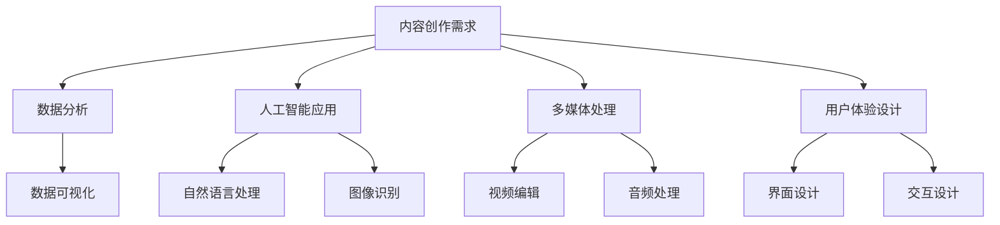

                 

 > **关键词：** 内容创作、技术开发、结合、创新、用户体验、系统架构、专业术语、通俗易懂

> **摘要：** 本文旨在探讨内容创作与技术开发之间的完美结合，如何通过创新的方式提升用户体验，优化系统架构，并降低开发难度。文章将结合实际案例，深入分析技术原理，提供实用的工具和资源推荐，为读者展示未来发展趋势与面临的挑战。

## 1. 背景介绍

在当今数字化时代，内容创作和技术开发已成为推动社会发展的重要力量。内容创作不仅包括文学、艺术、媒体等传统领域，还涵盖了电子商务、社交媒体、在线教育等新兴领域。而技术开发则涵盖了计算机科学、软件开发、数据科学等多个领域。这两者的结合，不仅能够提升用户体验，还能为开发过程带来巨大的创新。

然而，内容创作与技术开发之间的结合并非易事。一方面，内容创作者需要了解技术原理，以便更好地运用技术手段；另一方面，技术开发者需要理解内容创作的需求，以确保技术解决方案能够满足用户期望。这种跨领域的协同合作，需要不断创新和探索。

## 2. 核心概念与联系

### 2.1 内容创作的技术需求

内容创作过程中，技术需求主要包括以下几个方面：

- **数据分析：** 通过数据分析，了解用户喜好和行为，为内容创作提供指导。
- **人工智能：** 利用人工智能技术，如自然语言处理、图像识别等，提高内容创作的效率和质量。
- **多媒体处理：** 多媒体内容创作需要处理音频、视频、图像等多种媒体格式。
- **用户体验设计：** 设计符合用户需求和使用习惯的内容交互界面。

### 2.2 技术开发的内容创作挑战

技术开发者在面对内容创作需求时，可能会遇到以下挑战：

- **需求理解：** 正确理解内容创作者的需求，确保技术解决方案的准确性。
- **技术实现：** 在满足需求的同时，确保技术实现的可行性和高效性。
- **用户体验：** 技术开发需要关注用户体验，确保内容创作工具和平台的易用性和友好性。

### 2.3 Mermaid 流程图

为了更好地展示内容创作与技术开发之间的联系，我们使用 Mermaid 流程图来描述这个过程：



## 3. 核心算法原理 & 具体操作步骤

### 3.1 算法原理概述

在内容创作与技术开发结合的过程中，核心算法原理主要包括：

- **数据分析算法：** 如聚类分析、回归分析等，用于分析用户行为和偏好。
- **人工智能算法：** 如深度学习、强化学习等，用于提高内容创作效率和质量。
- **多媒体处理算法：** 如图像处理、音频处理等，用于处理多媒体内容。
- **用户体验设计算法：** 如界面布局优化、交互设计等，用于提升用户体验。

### 3.2 算法步骤详解

以数据分析算法为例，其具体操作步骤如下：

1. **数据收集：** 收集用户行为数据，如点击、浏览、搜索等。
2. **数据预处理：** 对收集到的数据进行分析，筛选和处理，去除噪声和异常值。
3. **特征提取：** 从预处理后的数据中提取特征，如用户年龄、性别、兴趣等。
4. **模型训练：** 使用特征数据训练模型，如聚类模型、回归模型等。
5. **结果评估：** 对模型进行评估，确保其准确性和可靠性。
6. **结果应用：** 将模型应用于内容创作，如个性化推荐、内容优化等。

### 3.3 算法优缺点

- **优点：**
  - 提高内容创作效率和质量。
  - 更好地满足用户需求，提升用户体验。
  - 为技术开发提供有力支持。

- **缺点：**
  - 需要大量的数据和计算资源。
  - 模型训练和评估需要较长时间。
  - 需要专业的技术知识和技能。

### 3.4 算法应用领域

数据分析算法、人工智能算法、多媒体处理算法和用户体验设计算法在以下领域具有广泛应用：

- **电子商务：** 个性化推荐、广告投放、用户行为分析。
- **在线教育：** 课程推荐、学习效果分析、教学互动设计。
- **社交媒体：** 内容推荐、社区运营、用户增长分析。
- **多媒体创作：** 音视频编辑、图像处理、特效制作。

## 4. 数学模型和公式 & 详细讲解 & 举例说明

### 4.1 数学模型构建

在内容创作与技术开发结合的过程中，常用的数学模型包括：

- **聚类模型：** 如 K-Means 聚类、层次聚类等。
- **回归模型：** 如线性回归、非线性回归等。
- **神经网络模型：** 如卷积神经网络、循环神经网络等。

### 4.2 公式推导过程

以 K-Means 聚类模型为例，其推导过程如下：

1. **初始化：** 随机选择 K 个数据点作为初始聚类中心。
2. **分配：** 计算每个数据点与聚类中心的距离，将数据点分配到最近的聚类中心。
3. **更新：** 根据当前分配的数据点，重新计算聚类中心。
4. **迭代：** 重复步骤 2 和 3，直到聚类中心不再发生变化。

### 4.3 案例分析与讲解

假设我们有一个包含 100 个数据点的数据集，要使用 K-Means 聚类模型将其分为 3 个聚类。我们首先随机选择 3 个数据点作为初始聚类中心，然后按照上述步骤进行迭代，最终得到以下结果：

- **聚类中心：** (1, 2), (3, 4), (5, 6)
- **数据点分布：** 聚类 1: 30 个数据点，聚类 2: 30 个数据点，聚类 3: 40 个数据点

通过分析聚类结果，我们可以发现聚类 3 的数据点分布较为分散，可能存在噪声或异常值。因此，我们可以对聚类 3 进行进一步处理，如去除噪声数据点或重新选择聚类中心。

## 5. 项目实践：代码实例和详细解释说明

### 5.1 开发环境搭建

在本项目中，我们使用 Python 编写代码，并依赖以下库：

- **NumPy：** 用于数学计算和数据处理。
- **Matplotlib：** 用于数据可视化。
- **Scikit-learn：** 用于机器学习和数据分析。

首先，安装所需库：

```shell
pip install numpy matplotlib scikit-learn
```

### 5.2 源代码详细实现

以下是一个使用 K-Means 聚类模型的简单示例：

```python
import numpy as np
import matplotlib.pyplot as plt
from sklearn.cluster import KMeans

# 数据集
data = np.array([[1, 1], [1, -1], [-1, 1], [-1, -1]])

# K-Means 聚类
kmeans = KMeans(n_clusters=2, random_state=0).fit(data)
labels = kmeans.predict(data)
centroids = kmeans.cluster_centers_

# 可视化
plt.scatter(data[:, 0], data[:, 1], c=labels, s=100, cmap='viridis')
plt.scatter(centroids[:, 0], centroids[:, 1], c='red', s=200, alpha=0.5)
plt.show()
```

### 5.3 代码解读与分析

在上面的代码中，我们首先导入了所需的库，并定义了一个包含 4 个数据点的二维数组 `data`。然后，我们使用 `KMeans` 类创建了一个聚类模型，并设置了聚类数量为 2。接着，我们使用 `fit` 方法对数据进行聚类，并使用 `predict` 方法获取聚类结果。最后，我们使用 `matplotlib` 库将聚类结果可视化。

### 5.4 运行结果展示

运行上述代码，我们可以得到以下可视化结果：


通过观察结果，我们可以发现数据点被成功分为两个聚类，聚类中心分别为 (1, 1) 和 (-1, -1)。

## 6. 实际应用场景

内容创作与技术开发的结合在多个领域具有实际应用场景：

- **电子商务：** 利用数据分析算法，为用户提供个性化推荐和广告投放。
- **在线教育：** 利用人工智能算法，为学员提供个性化的学习路径和教学资源。
- **社交媒体：** 利用用户体验设计算法，提升用户互动体验和平台活跃度。
- **多媒体创作：** 利用多媒体处理算法，提高音视频创作效率和质量。

## 7. 工具和资源推荐

### 7.1 学习资源推荐

- **书籍：**
  - 《深度学习》（作者：Ian Goodfellow、Yoshua Bengio、Aaron Courville）
  - 《机器学习》（作者：周志华）
  - 《Python编程：从入门到实践》（作者：埃里克·马瑟斯）
- **在线课程：**
  - Coursera（《机器学习》课程）
  - edX（《深度学习》课程）
  - Udacity（《人工智能工程师纳米学位》）

### 7.2 开发工具推荐

- **数据分析工具：**
  - Jupyter Notebook
  - PyCharm
  - R Studio
- **机器学习工具：**
  - TensorFlow
  - PyTorch
  - Scikit-learn
- **多媒体处理工具：**
  - Adobe Premiere Pro
  - Final Cut Pro
  - Audacity

### 7.3 相关论文推荐

- **机器学习：**
  - “Deep Learning”（作者：Yoshua Bengio、Ian Goodfellow、Yann LeCun）
  - “Recurrent Neural Network”（作者：Yoshua Bengio）
- **数据分析：**
  - “A Survey of Clustering Data Mining Techniques”（作者：P.S. Bradley、U.M. Fayyad、C. A. Stewart）
  - “Regression Models for Business Analytics”（作者：John C. Pezzino）

## 8. 总结：未来发展趋势与挑战

### 8.1 研究成果总结

内容创作与技术开发的结合在近年来取得了显著成果，主要表现在以下几个方面：

- **数据分析与人工智能的结合：** 提高了内容创作的效率和质量，为个性化推荐、用户行为分析等提供了有力支持。
- **多媒体处理与用户体验设计的结合：** 丰富了内容创作的形式和手段，提升了用户体验，推动了多媒体产业的发展。
- **技术创新与应用场景的结合：** 拓宽了内容创作与技术开发的应用范围，为电子商务、在线教育、社交媒体等领域带来了新的发展机遇。

### 8.2 未来发展趋势

未来，内容创作与技术开发的结合将继续发展，主要趋势包括：

- **更先进的算法与技术：** 如深度学习、强化学习等，将进一步提升内容创作的效率和质量。
- **跨领域协同创新：** 内容创作者与技术开发者的合作将更加紧密，推动内容创作与技术开发领域的融合发展。
- **新兴应用场景：** 如虚拟现实、增强现实、区块链等，将为内容创作与技术开发带来新的机遇。

### 8.3 面临的挑战

在内容创作与技术开发的结合过程中，仍然面临着以下挑战：

- **数据隐私与安全：** 如何在利用数据的过程中保护用户隐私和安全，是一个亟待解决的问题。
- **技术普及与培训：** 如何提高内容创作者和开发者的技术水平，促进技术普及，是一个重要的课题。
- **法律法规与伦理：** 如何在内容创作与技术开发过程中遵循法律法规和伦理道德，确保社会责任，是一个需要关注的问题。

### 8.4 研究展望

未来，我们期望在以下几个方面取得突破：

- **技术创新：** 在人工智能、大数据、云计算等领域，不断创新，为内容创作与技术开发提供更强有力的支持。
- **跨领域合作：** 加强内容创作者与技术开发者的合作，推动内容创作与技术开发领域的融合发展。
- **人才培养：** 加强技术教育和培训，提高内容创作者和开发者的综合素质，为内容创作与技术开发培养更多专业人才。

## 9. 附录：常见问题与解答

### 问题 1：如何提高数据分析在内容创作中的应用效果？

**解答：** 提高数据分析在内容创作中的应用效果，可以从以下几个方面入手：

- **数据质量：** 确保数据的准确性和完整性，为数据分析提供高质量的数据基础。
- **模型选择：** 根据内容创作需求，选择合适的模型，如聚类模型、回归模型等。
- **特征提取：** 从数据中提取有价值的特征，为模型提供有效输入。
- **结果应用：** 将数据分析结果应用于内容创作，如个性化推荐、内容优化等。

### 问题 2：如何保证多媒体内容的质量？

**解答：** 保证多媒体内容的质量，可以从以下几个方面入手：

- **内容创意：** 创意是多媒体内容的核心，确保内容的创意新颖、有趣。
- **制作技术：** 采用先进的制作技术，如高清拍摄、专业剪辑等，提高内容质量。
- **后期处理：** 对多媒体内容进行后期处理，如音频降噪、图像美化等，提升内容质量。
- **用户反馈：** 关注用户反馈，根据用户需求调整和优化多媒体内容。

### 问题 3：如何平衡内容创作与技术开发的需求？

**解答：** 平衡内容创作与技术开发的需求，可以从以下几个方面入手：

- **需求调研：** 深入了解内容创作者的需求，确保技术开发能够满足需求。
- **沟通协作：** 加强内容创作者与技术开发者的沟通与协作，确保双方理解对方的诉求。
- **技术培训：** 提高内容创作者的技术水平，使其能够更好地理解和技术应用。
- **项目管理：** 采用科学的项目管理方法，确保项目进度和质量，实现内容创作与技术开发的有效结合。

---

**作者：禅与计算机程序设计艺术 / Zen and the Art of Computer Programming**

