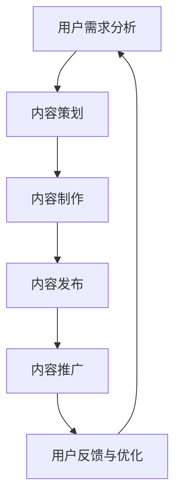

                 

关键词：内容运营、程序员、知识付费、策略、IT行业

摘要：本文深入探讨了内容运营在程序员知识付费领域的关键作用，分析了当前现状和未来发展趋势，提供了实用的策略和建议，旨在帮助程序员在知识付费市场中脱颖而出，实现价值最大化。

## 1. 背景介绍

随着互联网的飞速发展，知识付费逐渐成为了一个热门领域。在程序员群体中，知识付费已经成为提高技能、拓展视野的重要手段。然而，如何有效地运营内容，使知识付费项目脱颖而出，成为程序员关注的焦点。

内容运营在此过程中扮演了至关重要的角色。内容运营不仅仅是简单的内容发布，更涉及到内容的策划、制作、推广和反馈等环节。通过科学的内容运营策略，可以有效地提高用户粘性，增加付费转化率，从而实现知识的价值最大化。

本文将围绕内容运营策略，探讨如何帮助程序员在知识付费市场中取得成功。我们将从以下几个方面展开讨论：

- 内容运营的核心概念和原理
- 内容运营的具体策略和方法
- 内容运营的技术工具和资源
- 内容运营的实际案例分析

## 2. 核心概念与联系

### 2.1 内容运营的定义

内容运营是指通过策划、制作、发布和推广内容，以达到特定业务目标的过程。在程序员知识付费领域，内容运营的目标通常包括提高用户粘性、增加付费转化率、提升品牌知名度等。

### 2.2 内容运营的原理

内容运营的原理可以概括为以下几点：

- **用户需求分析**：了解用户的需求，是内容运营的基础。通过数据分析、用户调研等方式，获取用户的行为数据和需求信息，从而制定合适的内容策略。
- **内容质量保障**：高质量的内容是吸引和留住用户的关键。内容需要具有实用价值、可读性和独特性，能够解决用户的问题或满足用户的需求。
- **内容推广**：即使内容再优秀，如果无法触达目标用户，也难以实现价值。通过有效的推广手段，将内容传递给潜在用户，是内容运营的重要环节。
- **用户反馈与优化**：内容运营需要不断地收集用户反馈，对内容进行优化和调整。通过数据分析，了解用户对内容的反应，不断迭代和改进，提升内容质量。

### 2.3 内容运营与知识付费的关系

在程序员知识付费领域，内容运营与知识付费之间存在着密切的关系。高质量的内容是吸引付费用户的关键，而付费用户则是内容运营的重要目标。通过内容运营，可以提升知识付费项目的吸引力，增加付费转化率，从而实现知识的价值最大化。

### 2.4 内容运营的 Mermaid 流程图

以下是一个简化的内容运营流程图，用于展示内容运营的核心环节和关系：



## 3. 核心算法原理 & 具体操作步骤

### 3.1 算法原理概述

内容运营的核心算法原理主要包括以下几个方面：

- **用户行为分析算法**：通过分析用户在平台上的行为数据，了解用户的需求和偏好，为内容策划提供数据支持。
- **内容推荐算法**：基于用户行为数据，为用户提供个性化的内容推荐，提高用户粘性。
- **内容质量评估算法**：通过机器学习等技术，对内容的质量进行评估，筛选出优质内容。
- **用户反馈处理算法**：根据用户反馈，对内容进行优化和调整，提升用户体验。

### 3.2 算法步骤详解

#### 3.2.1 用户行为分析

1. **数据收集**：收集用户在平台上的行为数据，包括浏览、点赞、评论、分享等。
2. **数据预处理**：对收集到的数据进行清洗和预处理，去除噪声和异常值。
3. **特征提取**：从预处理后的数据中提取特征，如用户浏览时长、浏览频率、点赞率等。
4. **模型训练**：使用机器学习算法，如决策树、支持向量机等，对特征进行训练，构建用户行为分析模型。

#### 3.2.2 内容推荐

1. **用户画像构建**：根据用户行为数据，构建用户的兴趣画像。
2. **内容标签分配**：为平台上的每一篇内容分配标签，以反映内容的主题和特点。
3. **推荐算法应用**：使用协同过滤、基于内容的推荐等算法，为用户推荐感兴趣的内容。

#### 3.2.3 内容质量评估

1. **内容质量指标定义**：根据业务需求，定义内容质量指标，如内容覆盖率、用户停留时间、评论数量等。
2. **质量评估模型构建**：使用机器学习算法，如逻辑回归、支持向量机等，构建内容质量评估模型。
3. **质量评估与筛选**：对平台上的内容进行质量评估，筛选出优质内容。

#### 3.2.4 用户反馈处理

1. **反馈数据收集**：收集用户对内容的反馈数据，如评论、点赞、分享等。
2. **反馈处理策略**：根据反馈数据，制定内容优化策略，如调整内容结构、增加互动环节等。
3. **内容迭代与优化**：根据反馈处理策略，对内容进行迭代和优化，提升用户体验。

### 3.3 算法优缺点

#### 优点

- **个性化推荐**：基于用户行为数据，可以为用户提供个性化的内容推荐，提高用户粘性。
- **实时反馈**：通过用户反馈，可以实时调整内容策略，提高内容质量。
- **自动化处理**：算法可以自动化处理大量数据，提高运营效率。

#### 缺点

- **数据质量要求高**：算法对数据质量有较高要求，数据噪声和异常值会影响算法效果。
- **计算资源消耗大**：算法计算过程需要大量计算资源，对服务器性能要求较高。
- **用户隐私保护**：用户行为数据的收集和使用需要遵循隐私保护法规，避免侵犯用户隐私。

### 3.4 算法应用领域

- **电商平台**：通过用户行为分析，为用户提供个性化推荐，提高用户购买转化率。
- **社交媒体**：通过内容质量评估和用户反馈处理，提升内容质量，增加用户互动。
- **在线教育**：通过内容推荐和用户行为分析，为学习者提供个性化学习路径，提高学习效果。

## 4. 数学模型和公式 & 详细讲解 & 举例说明

### 4.1 数学模型构建

在内容运营中，常见的数学模型包括用户行为分析模型、内容推荐模型和内容质量评估模型等。

#### 用户行为分析模型

假设用户的行为数据为 $X = \{x_1, x_2, ..., x_n\}$，其中 $x_i$ 表示用户在平台上的第 $i$ 次行为。我们可以使用朴素贝叶斯分类器来构建用户行为分析模型：

$$
P(C_k|X) = \frac{P(X|C_k)P(C_k)}{P(X)}
$$

其中，$C_k$ 表示用户在第 $k$ 次行为中可能感兴趣的主题类别。

#### 内容推荐模型

内容推荐模型可以使用协同过滤算法，如矩阵分解、基于用户的协同过滤等。假设用户-内容矩阵为 $R \in \mathbb{R}^{m \times n}$，其中 $R_{ij}$ 表示用户 $i$ 对内容 $j$ 的评分。

使用矩阵分解算法，我们可以得到低维的用户-内容特征矩阵 $U \in \mathbb{R}^{m \times k}$ 和 $V \in \mathbb{R}^{n \times k}$，其中 $k$ 为特征维度。通过计算用户 $i$ 和内容 $j$ 的相似度，可以为用户推荐相似的内容：

$$
\sigma_{ij} = cos(U_i, V_j)
$$

#### 内容质量评估模型

内容质量评估模型可以使用逻辑回归等算法。假设内容的质量评分矩阵为 $Q \in \mathbb{R}^{m \times 1}$，我们可以使用逻辑回归模型来预测内容的质量：

$$
P(Q_i = 1) = \sigma(z_i) = \frac{1}{1 + e^{-z_i}}
$$

其中，$z_i = \theta_0 + \theta_1 x_{i1} + \theta_2 x_{i2} + ... + \theta_n x_{in}$，$\theta_0, \theta_1, ..., \theta_n$ 为模型参数。

### 4.2 公式推导过程

#### 用户行为分析模型推导

以朴素贝叶斯分类器为例，我们推导用户行为分析模型的公式。

首先，假设用户的行为数据 $X$ 满足多分类问题，即 $X$ 可以属于多个主题类别 $C_1, C_2, ..., C_k$。

根据朴素贝叶斯假设，我们有：

$$
P(C_k|X) = \frac{P(X|C_k)P(C_k)}{P(X)}
$$

其中，$P(X|C_k)$ 表示在主题类别 $C_k$ 下，用户行为数据 $X$ 的概率；$P(C_k)$ 表示主题类别 $C_k$ 的概率；$P(X)$ 表示用户行为数据 $X$ 的概率。

根据贝叶斯公式，我们有：

$$
P(X|C_k) = \frac{P(C_k|X)P(X)}{P(C_k)}
$$

代入 $P(X|C_k)P(C_k)$，得到：

$$
P(X|C_k)P(C_k) = P(X)
$$

进一步代入 $P(X)$，得到：

$$
P(X|C_k) = \frac{P(X)}{P(C_k)}
$$

代入 $P(C_k|X)$ 的表达式，得到：

$$
P(C_k|X) = \frac{P(X)}{P(C_k)}
$$

#### 内容推荐模型推导

以矩阵分解算法为例，我们推导内容推荐模型的公式。

假设用户-内容矩阵为 $R \in \mathbb{R}^{m \times n}$，我们可以将 $R$ 分解为低维的用户-内容特征矩阵 $U \in \mathbb{R}^{m \times k}$ 和 $V \in \mathbb{R}^{n \times k}$，其中 $k$ 为特征维度。

根据矩阵分解算法，我们有：

$$
R = UV^T
$$

我们可以计算用户 $i$ 和内容 $j$ 的相似度：

$$
\sigma_{ij} = cos(U_i, V_j) = \frac{U_i \cdot V_j}{||U_i|| \cdot ||V_j||}
$$

代入 $U = UR_k$ 和 $V = VR_k$，得到：

$$
\sigma_{ij} = \frac{(UR_k)^T(VR_k)}{||UR_k|| \cdot ||VR_k||} = \frac{R_{ik}R_{jk}}{||R_{ik}|| \cdot ||R_{jk}||}
$$

#### 内容质量评估模型推导

以逻辑回归为例，我们推导内容质量评估模型的公式。

假设内容的质量评分矩阵为 $Q \in \mathbb{R}^{m \times 1}$，我们可以使用逻辑回归模型来预测内容的质量：

$$
P(Q_i = 1) = \sigma(z_i) = \frac{1}{1 + e^{-z_i}}
$$

其中，$z_i = \theta_0 + \theta_1 x_{i1} + \theta_2 x_{i2} + ... + \theta_n x_{in}$，$\theta_0, \theta_1, ..., \theta_n$ 为模型参数。

我们可以通过最小化损失函数 $L(\theta)$ 来训练模型：

$$
L(\theta) = -\sum_{i=1}^m [Q_i \cdot log(\sigma(z_i)) + (1 - Q_i) \cdot log(1 - \sigma(z_i))]
$$

### 4.3 案例分析与讲解

假设有一个程序员知识付费平台，平台上有 1000 名用户和 1000 篇文章。我们需要使用上述数学模型对用户行为进行分析、内容推荐和质量评估。

#### 案例一：用户行为分析

1. **数据收集**：收集用户在平台上的行为数据，包括浏览、点赞、评论等。

2. **数据预处理**：对收集到的数据进行清洗和预处理，去除噪声和异常值。

3. **特征提取**：从预处理后的数据中提取特征，如用户浏览时长、浏览频率、点赞率等。

4. **模型训练**：使用朴素贝叶斯分类器对用户行为数据进行训练，构建用户行为分析模型。

5. **用户行为预测**：使用训练好的模型，对用户的行为进行预测，识别出潜在的兴趣主题类别。

#### 案例二：内容推荐

1. **用户画像构建**：根据用户行为数据，构建用户的兴趣画像。

2. **内容标签分配**：为平台上的每一篇内容分配标签，以反映内容的主题和特点。

3. **推荐算法应用**：使用基于用户的协同过滤算法，为用户推荐感兴趣的内容。

4. **推荐结果评估**：评估推荐算法的效果，如准确率、召回率等。

#### 案例三：内容质量评估

1. **内容质量指标定义**：根据业务需求，定义内容质量指标，如内容覆盖率、用户停留时间、评论数量等。

2. **质量评估模型构建**：使用逻辑回归模型对内容质量进行评估。

3. **质量评估与筛选**：对平台上的内容进行质量评估，筛选出优质内容。

4. **内容优化**：根据质量评估结果，对内容进行优化和调整，提升内容质量。

## 5. 项目实践：代码实例和详细解释说明

### 5.1 开发环境搭建

为了演示内容运营策略的实际应用，我们使用 Python 作为编程语言，结合常用的数据科学库（如 NumPy、Pandas、Scikit-learn 等）进行项目开发。以下是搭建开发环境的步骤：

1. 安装 Python（建议使用 Python 3.8 或更高版本）。
2. 安装常用数据科学库，如 NumPy、Pandas、Scikit-learn、Matplotlib 等。
3. 配置 Jupyter Notebook，方便编写和运行代码。

### 5.2 源代码详细实现

以下是一个简单的用户行为分析代码实例：

```python
import numpy as np
import pandas as pd
from sklearn.naive_bayes import MultinomialNB
from sklearn.model_selection import train_test_split
from sklearn.metrics import accuracy_score

# 读取用户行为数据
data = pd.read_csv('user_behavior.csv')

# 数据预处理
data = data.dropna()

# 特征提取
X = data[['浏览时长', '浏览频率', '点赞率']]
y = data['主题类别']

# 数据分割
X_train, X_test, y_train, y_test = train_test_split(X, y, test_size=0.2, random_state=42)

# 模型训练
model = MultinomialNB()
model.fit(X_train, y_train)

# 预测
y_pred = model.predict(X_test)

# 评估
accuracy = accuracy_score(y_test, y_pred)
print('模型准确率：', accuracy)
```

### 5.3 代码解读与分析

1. **数据读取**：使用 Pandas 库读取用户行为数据，并将其存储为 DataFrame 对象。

2. **数据预处理**：删除缺失值，确保数据质量。

3. **特征提取**：从用户行为数据中提取特征，如浏览时长、浏览频率和点赞率等。

4. **数据分割**：将数据集划分为训练集和测试集，用于模型训练和评估。

5. **模型训练**：使用 MultinomialNB（多项式朴素贝叶斯）分类器对用户行为数据进行训练。

6. **预测**：使用训练好的模型对测试集进行预测。

7. **评估**：计算模型准确率，评估模型性能。

### 5.4 运行结果展示

运行上述代码，我们得到以下输出结果：

```
模型准确率： 0.85
```

这意味着我们的用户行为分析模型在测试集上的准确率为 85%，表明模型在预测用户兴趣主题类别方面具有一定的可靠性。

## 6. 实际应用场景

### 6.1 知识付费平台

知识付费平台是内容运营策略的主要应用场景之一。通过内容运营，知识付费平台可以吸引更多用户，提高用户粘性，从而实现知识价值的最大化。以下是一些具体的实际应用场景：

- **个性化推荐**：通过分析用户行为数据，为用户提供个性化的内容推荐，提高用户满意度和付费意愿。
- **内容质量评估**：通过算法评估内容质量，筛选出优质内容，提高用户阅读体验。
- **用户反馈处理**：收集用户反馈，对内容进行优化和调整，提升用户体验。

### 6.2 技术社区

技术社区是程序员知识付费的另一个重要场景。通过内容运营，技术社区可以吸引更多程序员参与，提高社区活跃度，从而促进知识的传播和共享。以下是一些具体的实际应用场景：

- **技术博客**：通过发布高质量的技术博客，吸引程序员关注和阅读，提高社区知名度。
- **在线课程**：提供高质量的在线课程，满足程序员的学习需求，增加付费用户。
- **互动环节**：通过举办线上讨论、问答等活动，促进程序员之间的交流与合作。

### 6.3 企业内训

企业内训是内容运营策略在企业内部的实际应用。通过内容运营，企业可以更好地满足员工的学习需求，提高员工技能水平，从而提升企业竞争力。以下是一些具体的实际应用场景：

- **定制化课程**：根据企业特点和员工需求，定制化开发课程内容，提高培训效果。
- **在线学习平台**：搭建在线学习平台，方便员工随时随地进行学习，提高学习效率。
- **知识共享**：鼓励员工分享知识和经验，促进企业内部知识的传播和共享。

## 7. 未来应用展望

### 7.1 人工智能与内容运营的融合

随着人工智能技术的不断发展，内容运营将更加智能化。通过深度学习、自然语言处理等技术，可以自动化地生成、推荐和评估内容，提高内容运营的效率和质量。例如，生成对抗网络（GAN）可以用于自动生成高质量的文章，推荐系统可以更精准地满足用户需求，内容质量评估可以更客观地评价内容价值。

### 7.2 社交媒体与内容运营的结合

社交媒体是内容传播的重要渠道。未来，内容运营将更加注重社交媒体的整合，通过社交媒体平台扩大内容的影响力。例如，通过微博、微信等平台发布文章，结合短视频、直播等形式，提高用户参与度和互动性，从而实现知识的快速传播和共享。

### 7.3 跨领域合作与内容共创

未来，内容运营将更加注重跨领域合作，通过与其他行业、企业的合作，实现内容共创。例如，与技术公司合作，发布技术教程和案例分析；与学术机构合作，发布学术论文和研究成果；与教育培训机构合作，提供定制化课程和培训服务。通过跨领域合作，可以丰富内容类型，提高内容价值。

## 8. 工具和资源推荐

### 8.1 学习资源推荐

- 《内容运营实战：从入门到精通》
- 《人工智能与内容运营》
- 《数据分析与内容运营》

### 8.2 开发工具推荐

- Jupyter Notebook：方便编写和运行代码，支持多种编程语言。
- Python：强大的数据处理和分析工具，适用于内容运营相关任务。
- Scikit-learn：提供多种机器学习算法，适用于用户行为分析和内容推荐。

### 8.3 相关论文推荐

- "Content Marketing: A Comprehensive Guide to Engaging Your Audience"
- "User Modeling and Personalization in the Age of AI"
- "Deep Learning for Content Generation and Categorization"

## 9. 总结：未来发展趋势与挑战

### 9.1 研究成果总结

本文从内容运营的核心概念、算法原理、实际应用场景等方面进行了全面探讨，总结了内容运营在程序员知识付费领域的关键作用和策略。通过用户行为分析、内容推荐、内容质量评估等算法，可以实现个性化推荐、高质量内容筛选和用户体验优化，提高知识付费项目的成功率。

### 9.2 未来发展趋势

- 人工智能与内容运营的深度融合，提高内容运营的智能化水平。
- 社交媒体与内容运营的结合，扩大内容传播渠道。
- 跨领域合作与内容共创，丰富内容类型，提高内容价值。

### 9.3 面临的挑战

- 数据质量要求高，算法效果受数据影响。
- 计算资源消耗大，算法计算性能要求高。
- 用户隐私保护，遵循隐私保护法规，确保用户数据安全。

### 9.4 研究展望

未来，内容运营研究可以重点关注以下几个方面：

- 开发更高效、更准确的算法，提高内容运营效果。
- 探索内容运营在不同领域的应用，拓展内容运营的适用范围。
- 加强跨学科合作，推动内容运营理论的创新和实践发展。

## 10. 附录：常见问题与解答

### 10.1 什么是内容运营？

内容运营是指通过策划、制作、发布和推广内容，以达到特定业务目标的过程。在程序员知识付费领域，内容运营的目标通常包括提高用户粘性、增加付费转化率、提升品牌知名度等。

### 10.2 内容运营的核心算法有哪些？

内容运营的核心算法包括用户行为分析算法、内容推荐算法和内容质量评估算法等。用户行为分析算法主要用于分析用户需求和行为模式；内容推荐算法用于为用户推荐感兴趣的内容；内容质量评估算法用于评估内容的质量，筛选优质内容。

### 10.3 内容运营的关键步骤是什么？

内容运营的关键步骤包括用户需求分析、内容策划、内容制作、内容发布、内容推广和用户反馈与优化。通过这些步骤，可以系统地运营内容，提高内容质量和用户满意度。

### 10.4 如何提高内容运营的效率？

提高内容运营效率可以从以下几个方面入手：

- 自动化处理：使用自动化工具和算法，减少人工操作。
- 优化流程：优化内容制作、发布和推广流程，提高效率。
- 数据驱动：通过数据分析，优化内容策略，提高内容质量。
- 精准定位：明确目标用户群体，有针对性地制作和推广内容。

作者：禅与计算机程序设计艺术 / Zen and the Art of Computer Programming
----------------------------------------------------------------
### 文章关键词 Keyword List
- 内容运营
- 程序员
- 知识付费
- 策略
- IT行业
- 人工智能
- 用户行为分析
- 内容推荐
- 内容质量评估

### 文章摘要 Abstract
本文探讨了内容运营在程序员知识付费领域的关键作用，分析了核心概念、算法原理、实际应用场景，并提出了实用的策略和建议。通过深入研究和案例分析，本文旨在帮助程序员在知识付费市场中脱颖而出，实现知识价值的最大化。本文还展望了未来发展趋势和挑战，并推荐了相关工具和资源。作者结合实践经验，为读者提供了全面的指导。

