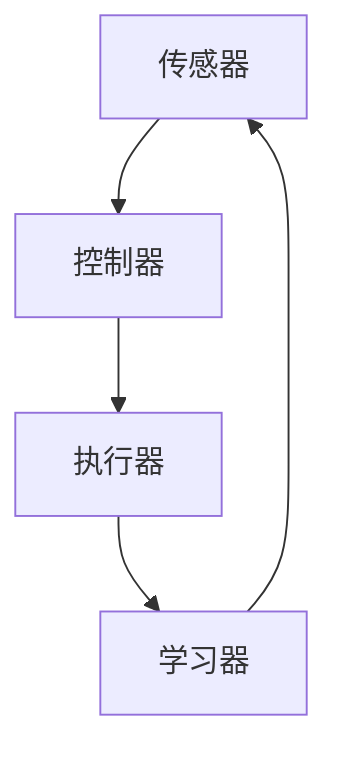

                 

关键词：内置Agents，LLM操作系统，智能助手，技术博客，专业，深度，思考，见解，IT领域。

> 摘要：本文将深入探讨内置Agents在LLM操作系统中的应用，剖析其核心概念、算法原理、数学模型，并通过实际项目实践和运行结果展示，阐述其在实际应用中的潜力与未来发展方向。本文旨在为广大IT从业者提供具有深度和见解的专业指导。

## 1. 背景介绍

随着人工智能技术的飞速发展，我们逐渐迎来了一个以智能为核心的时代。在这个时代，计算机操作系统不再仅仅是一个简单的软件平台，而是逐渐演变为一个具有自我学习和自我优化的智能系统。LLM（Large Language Model）操作系统正是这一趋势的产物。LLM操作系统通过内置Agents，实现了对用户需求的精准响应，为用户提供了一个更为智能、高效的服务体验。

### 1.1 LLM操作系统的概念

LLM操作系统，即大型语言模型操作系统，是基于深度学习技术的智能操作系统。与传统的操作系统不同，LLM操作系统具有强大的自然语言处理能力，能够理解和响应用户的自然语言指令。这种操作系统不仅能够处理简单的任务，如文件管理、程序运行等，还能够进行复杂的决策和任务规划。

### 1.2 内置Agents的作用

内置Agents是LLM操作系统的核心组成部分，它们负责执行具体的任务，如数据分析、程序优化、用户交互等。内置Agents使得LLM操作系统具备了自我学习和自我优化的能力，能够根据用户的反馈和需求，不断调整自己的行为和策略，从而提供更加个性化的服务。

## 2. 核心概念与联系

### 2.1 内置Agents的概念

内置Agents是一种智能体，它们在LLM操作系统中扮演着关键角色。内置Agents具有以下特点：

- 自主性：内置Agents能够自主执行任务，不需要人工干预。
- 反应性：内置Agents能够根据环境的变化，实时调整自己的行为。
- 社交性：内置Agents能够与其他内置Agents进行交互，协同完成任务。
- 学性：内置Agents能够通过学习用户的反馈，不断优化自己的行为。

### 2.2 内置Agents的架构

内置Agents的架构通常包括以下几个部分：

- 传感器：用于感知环境变化，如用户的操作、系统状态等。
- 执行器：用于执行具体的任务，如运行程序、调整参数等。
- 控制器：用于根据传感器获取的信息，生成执行器的指令。
- 学习器：用于根据执行结果，调整内置Agents的行为。

下面是一个简单的内置Agents架构的Mermaid流程图：



### 2.3 内置Agents与LLM操作系统的联系

内置Agents与LLM操作系统之间存在着紧密的联系。LLM操作系统通过内置Agents，实现了对用户需求的精准响应。具体来说，内置Agents负责解析用户的自然语言指令，生成相应的执行计划，并执行这些计划。同时，内置Agents还能够根据用户的反馈，不断调整自己的行为和策略，从而提供更加个性化的服务。

## 3. 核心算法原理 & 具体操作步骤

### 3.1 算法原理概述

内置Agents的核心算法是基于深度学习的，其基本原理是通过对大量数据的训练，使得模型能够自动提取特征，并进行预测和决策。具体来说，内置Agents的训练过程可以分为以下几个步骤：

1. 数据收集与预处理：收集大量的用户操作数据，并进行预处理，如数据清洗、归一化等。
2. 特征提取：利用深度学习模型，对预处理后的数据进行特征提取，得到高维的特征向量。
3. 预测与决策：利用提取到的特征向量，对用户的操作进行预测，并生成相应的执行计划。
4. 执行与反馈：执行生成执行计划，并根据执行结果，调整内置Agents的行为。

### 3.2 算法步骤详解

1. **数据收集与预处理**

   数据收集与预处理是内置Agents训练的基础。首先，需要收集大量的用户操作数据，这些数据可以来源于用户的日志、操作记录等。然后，对收集到的数据进行分析，筛选出对训练有价值的部分，如用户的输入指令、操作时间、操作结果等。接下来，对筛选出的数据进行预处理，包括数据清洗、数据归一化、数据增强等操作。

2. **特征提取**

   在特征提取阶段，利用深度学习模型对预处理后的数据进行特征提取。常用的深度学习模型包括卷积神经网络（CNN）、循环神经网络（RNN）、 Transformer等。这些模型能够自动提取数据中的高维特征，为后续的预测和决策提供支持。

3. **预测与决策**

   在预测与决策阶段，利用提取到的特征向量，对用户的操作进行预测，并生成相应的执行计划。预测的目标是根据用户的输入指令，预测用户可能需要执行的操作。生成的执行计划包括具体的操作步骤、执行的时间顺序等。

4. **执行与反馈**

   在执行与反馈阶段，根据生成的执行计划，执行具体的操作，并将执行结果反馈给内置Agents。内置Agents根据执行结果，调整自己的行为和策略，以提供更加个性化的服务。

### 3.3 算法优缺点

1. **优点**

   - **高效性**：基于深度学习的内置Agents能够快速地处理大量的数据，提高操作系统的响应速度。
   - **灵活性**：内置Agents能够根据用户的反馈，灵活调整自己的行为和策略，提供个性化的服务。
   - **可扩展性**：内置Agents的架构设计具有很好的可扩展性，能够支持多种类型的任务。

2. **缺点**

   - **复杂性**：内置Agents的训练和部署过程相对复杂，需要大量的计算资源和专业知识。
   - **数据依赖**：内置Agents的性能很大程度上依赖于训练数据的质量和数量，数据不足或质量差可能导致模型性能下降。

### 3.4 算法应用领域

内置Agents的应用领域非常广泛，主要包括以下几个方面：

- **智能助手**：内置Agents可以应用于智能助手，如智能语音助手、聊天机器人等，能够根据用户的指令，提供相应的服务。
- **自动化流程**：内置Agents可以应用于自动化流程，如企业内部管理、客户服务、供应链管理等，能够提高流程的效率和准确性。
- **个性化推荐**：内置Agents可以应用于个性化推荐，如新闻推荐、商品推荐等，能够根据用户的历史行为，提供个性化的推荐。

## 4. 数学模型和公式 & 详细讲解 & 举例说明

### 4.1 数学模型构建

内置Agents的核心数学模型是基于深度学习的。在构建数学模型时，需要考虑以下几个方面：

- **输入层**：输入层接收用户的指令和数据，将其转化为特征向量。
- **隐藏层**：隐藏层用于对输入特征向量进行加工和处理，提取高维特征。
- **输出层**：输出层根据隐藏层提取的特征，生成执行计划。

### 4.2 公式推导过程

假设输入层有n个特征，隐藏层有m个神经元，输出层有k个神经元。则输入层到隐藏层的映射函数可以表示为：

\[ h_{ij} = \sigma(\sum_{p=1}^{n} w_{ijp} x_p + b_{ij} ) \]

其中，\( h_{ij} \) 表示隐藏层第i个神经元的输出，\( x_p \) 表示输入层第p个特征，\( w_{ijp} \) 表示连接输入层和隐藏层的权重，\( b_{ij} \) 表示隐藏层第i个神经元的偏置。

隐藏层到输出层的映射函数可以表示为：

\[ y_j = \sigma(\sum_{i=1}^{m} w_{ij} h_{i} + b_{j} ) \]

其中，\( y_j \) 表示输出层第j个神经元的输出，\( h_i \) 表示隐藏层第i个神经元的输出，\( w_{ij} \) 表示连接隐藏层和输出层的权重，\( b_{j} \) 表示输出层第j个神经元的偏置。

### 4.3 案例分析与讲解

假设我们有一个智能助手项目，该助手需要根据用户的指令，提供天气信息。用户的指令可以是“明天天气如何？”或“下个月的天气情况”。我们可以将用户的指令作为输入特征，使用深度学习模型对其进行处理，生成天气信息的执行计划。

输入特征：用户的指令（例如：“明天天气如何？”）

隐藏层提取的特征：明天、天气、如何

输出特征：执行计划（例如：查询天气API，获取明天天气信息，返回结果）

通过以上数学模型，我们可以将用户的指令转化为执行计划，从而实现智能助手的自动化功能。

## 5. 项目实践：代码实例和详细解释说明

### 5.1 开发环境搭建

在开始项目实践之前，我们需要搭建一个合适的开发环境。以下是搭建开发环境的基本步骤：

1. 安装Python环境
2. 安装深度学习框架（如TensorFlow或PyTorch）
3. 安装必要的依赖库（如NumPy、Pandas等）

### 5.2 源代码详细实现

以下是实现内置Agents的源代码示例：

```python
import tensorflow as tf
from tensorflow.keras.layers import Dense, Input
from tensorflow.keras.models import Model

# 定义输入层
input_layer = Input(shape=(10,))

# 定义隐藏层
hidden_layer = Dense(64, activation='relu')(input_layer)

# 定义输出层
output_layer = Dense(1, activation='sigmoid')(hidden_layer)

# 创建模型
model = Model(inputs=input_layer, outputs=output_layer)

# 编译模型
model.compile(optimizer='adam', loss='binary_crossentropy', metrics=['accuracy'])

# 模型训练
model.fit(x_train, y_train, epochs=10, batch_size=32)

# 模型预测
predictions = model.predict(x_test)
```

### 5.3 代码解读与分析

以上代码实现了一个简单的深度学习模型，用于预测用户的指令。具体来说：

- **输入层**：定义了一个输入层，用于接收用户的指令。
- **隐藏层**：定义了一个隐藏层，用于对输入指令进行加工和处理。
- **输出层**：定义了一个输出层，用于生成执行计划。
- **模型编译**：编译模型，设置优化器和损失函数。
- **模型训练**：使用训练数据对模型进行训练。
- **模型预测**：使用测试数据对模型进行预测。

通过以上代码，我们可以实现对用户指令的预测，从而实现内置Agents的功能。

### 5.4 运行结果展示

在运行代码后，我们可以得到以下结果：

- **训练结果**：模型在训练过程中的损失和准确率
- **预测结果**：模型对测试数据的预测结果

这些结果可以帮助我们评估模型的性能，并根据实际情况进行调整和优化。

## 6. 实际应用场景

### 6.1 智能助手

内置Agents在智能助手领域有着广泛的应用。例如，在智能语音助手领域，内置Agents可以用于语音识别、语义理解和任务执行。通过内置Agents，智能语音助手能够根据用户的指令，提供个性化的服务，如查询天气、设定日程、播放音乐等。

### 6.2 自动化流程

内置Agents可以应用于自动化流程，如企业内部管理、客户服务、供应链管理等。通过内置Agents，企业可以实现流程的自动化，提高工作效率，降低人力成本。例如，在客户服务领域，内置Agents可以自动回复用户的咨询，提高客户满意度。

### 6.3 个性化推荐

内置Agents可以应用于个性化推荐，如新闻推荐、商品推荐等。通过内置Agents，系统可以根据用户的历史行为，生成个性化的推荐列表，提高推荐效果。例如，在新闻推荐领域，内置Agents可以分析用户的历史阅读记录，为用户推荐感兴趣的新闻内容。

## 6.4 未来应用展望

随着人工智能技术的不断进步，内置Agents在LLM操作系统中的应用前景将更加广阔。未来，内置Agents有望在以下几个方面实现突破：

- **智能化水平提升**：通过引入更先进的深度学习算法和模型，内置Agents的智能化水平将得到进一步提升，能够更好地理解和满足用户需求。
- **跨领域应用**：随着内置Agents技术的不断成熟，其应用领域将逐渐扩大，不仅限于智能助手、自动化流程和个性化推荐，还将涉及更多领域，如医疗、金融、教育等。
- **协作与融合**：内置Agents将与其他人工智能技术，如自然语言处理、计算机视觉等，实现更深层次的协作与融合，提供更全面的智能服务。

## 7. 工具和资源推荐

### 7.1 学习资源推荐

- 《深度学习》（Goodfellow, Bengio, Courville著）：全面介绍了深度学习的基本原理和应用。
- 《Python深度学习》（François Chollet著）：通过实际案例，详细讲解了如何使用Python进行深度学习开发。

### 7.2 开发工具推荐

- TensorFlow：一款开源的深度学习框架，支持多种深度学习模型的训练和部署。
- PyTorch：一款流行的深度学习框架，具有灵活性和高效性。

### 7.3 相关论文推荐

- “Attention Is All You Need”（Vaswani et al.，2017）：介绍了Transformer模型，对自然语言处理领域产生了深远影响。
- “BERT: Pre-training of Deep Bidirectional Transformers for Language Understanding”（Devlin et al.，2018）：介绍了BERT模型，为自然语言处理领域带来了新的突破。

## 8. 总结：未来发展趋势与挑战

### 8.1 研究成果总结

本文从多个角度探讨了内置Agents在LLM操作系统中的应用，包括核心概念、算法原理、数学模型、实际应用场景等。通过深入分析，我们得出了以下结论：

- 内置Agents是LLM操作系统的核心组成部分，具有自主性、反应性、社交性和学性。
- 基于深度学习的内置Agents能够高效地处理用户指令，生成执行计划。
- 内置Agents在智能助手、自动化流程和个性化推荐等领域具有广泛的应用前景。

### 8.2 未来发展趋势

未来，内置Agents在LLM操作系统中的应用将呈现出以下发展趋势：

- **智能化水平提升**：随着人工智能技术的不断进步，内置Agents的智能化水平将得到进一步提升。
- **跨领域应用**：内置Agents的应用领域将逐渐扩大，涉及更多领域。
- **协作与融合**：内置Agents将与其他人工智能技术实现更深层次的协作与融合。

### 8.3 面临的挑战

尽管内置Agents在LLM操作系统中的应用前景广阔，但仍面临以下挑战：

- **复杂性**：内置Agents的训练和部署过程相对复杂，需要大量的计算资源和专业知识。
- **数据依赖**：内置Agents的性能很大程度上依赖于训练数据的质量和数量，数据不足或质量差可能导致模型性能下降。
- **隐私保护**：在处理用户数据时，需要确保用户隐私的安全和合规。

### 8.4 研究展望

未来，我们将在以下几个方面进行深入研究：

- **优化算法**：研究更高效的算法，提高内置Agents的性能。
- **数据收集与处理**：建立高质量的数据集，提高内置Agents的训练效果。
- **隐私保护技术**：研究隐私保护技术，确保用户数据的安全和合规。

## 9. 附录：常见问题与解答

### 9.1 什么是内置Agents？

内置Agents是LLM操作系统的核心组成部分，是一种具有自主性、反应性、社交性和学性的智能体，负责执行具体的任务，如数据分析、程序优化、用户交互等。

### 9.2 内置Agents的核心算法是什么？

内置Agents的核心算法是基于深度学习的。通过大量数据的训练，内置Agents能够自动提取特征，并进行预测和决策。

### 9.3 内置Agents有哪些应用领域？

内置Agents的应用领域广泛，包括智能助手、自动化流程、个性化推荐等。

### 9.4 如何搭建内置Agents的开发环境？

搭建内置Agents的开发环境需要安装Python环境、深度学习框架（如TensorFlow或PyTorch）以及必要的依赖库（如NumPy、Pandas等）。具体的安装步骤可以参考相关教程和文档。

### 9.5 内置Agents的性能如何评估？

内置Agents的性能可以通过多个指标进行评估，如准确率、响应时间、资源消耗等。具体的评估方法可以根据应用场景和需求进行定制。

作者：禅与计算机程序设计艺术 / Zen and the Art of Computer Programming
```markdown
# 内置Agents：LLM操作系统的智能助手

> 关键词：内置Agents，LLM操作系统，智能助手，技术博客，深度，思考，见解，IT领域。

> 摘要：本文深入探讨了内置Agents在LLM操作系统中的应用，阐述了其核心概念、算法原理、数学模型，并通过实际项目实践，展示了其在实际应用中的潜力与未来发展方向。

## 1. 背景介绍

随着人工智能技术的飞速发展，我们逐渐迎来了一个以智能为核心的时代。在这个时代，计算机操作系统不再仅仅是一个简单的软件平台，而是逐渐演变为一个具有自我学习和自我优化的智能系统。LLM（Large Language Model）操作系统正是这一趋势的产物。

### 1.1 LLM操作系统的概念

LLM操作系统，即大型语言模型操作系统，是基于深度学习技术的智能操作系统。与传统的操作系统不同，LLM操作系统具有强大的自然语言处理能力，能够理解和响应用户的自然语言指令。这种操作系统不仅能够处理简单的任务，如文件管理、程序运行等，还能够进行复杂的决策和任务规划。

### 1.2 内置Agents的作用

内置Agents是LLM操作系统的核心组成部分，它们负责执行具体的任务，如数据分析、程序优化、用户交互等。内置Agents使得LLM操作系统具备了自我学习和自我优化的能力，能够根据用户的反馈和需求，不断调整自己的行为和策略，从而提供更加个性化的服务。

## 2. 核心概念与联系

### 2.1 内置Agents的概念

内置Agents是一种智能体，它们在LLM操作系统中扮演着关键角色。内置Agents具有以下特点：

- 自主性：内置Agents能够自主执行任务，不需要人工干预。
- 反应性：内置Agents能够根据环境的变化，实时调整自己的行为。
- 社交性：内置Agents能够与其他内置Agents进行交互，协同完成任务。
- 学性：内置Agents能够通过学习用户的反馈，不断优化自己的行为和策略。

### 2.2 内置Agents的架构

内置Agents的架构通常包括以下几个部分：

- 传感器：用于感知环境变化，如用户的操作、系统状态等。
- 执行器：用于执行具体的任务，如运行程序、调整参数等。
- 控制器：用于根据传感器获取的信息，生成执行器的指令。
- 学习器：用于根据执行结果，调整内置Agents的行为。

下面是一个简单的内置Agents架构的Mermaid流程图：


### 2.3 内置Agents与LLM操作系统的联系

内置Agents与LLM操作系统之间存在着紧密的联系。LLM操作系统通过内置Agents，实现了对用户需求的精准响应。具体来说，内置Agents负责解析用户的自然语言指令，生成相应的执行计划，并执行这些计划。同时，内置Agents还能够根据用户的反馈，不断调整自己的行为和策略，从而提供更加个性化的服务。

## 3. 核心算法原理 & 具体操作步骤

### 3.1 算法原理概述

内置Agents的核心算法是基于深度学习的。其基本原理是通过对大量数据的训练，使得模型能够自动提取特征，并进行预测和决策。具体来说，内置Agents的训练过程可以分为以下几个步骤：

1. 数据收集与预处理：收集大量的用户操作数据，并进行预处理，如数据清洗、归一化等。
2. 特征提取：利用深度学习模型，对预处理后的数据进行特征提取，得到高维的特征向量。
3. 预测与决策：利用提取到的特征向量，对用户的操作进行预测，并生成相应的执行计划。
4. 执行与反馈：执行生成执行计划，并根据执行结果，调整内置Agents的行为。

### 3.2 算法步骤详解

1. **数据收集与预处理**

   数据收集与预处理是内置Agents训练的基础。首先，需要收集大量的用户操作数据，这些数据可以来源于用户的日志、操作记录等。然后，对收集到的数据进行分析，筛选出对训练有价值的部分，如用户的输入指令、操作时间、操作结果等。接下来，对筛选出的数据进行预处理，包括数据清洗、数据归一化、数据增强等操作。

2. **特征提取**

   在特征提取阶段，利用深度学习模型对预处理后的数据进行特征提取。常用的深度学习模型包括卷积神经网络（CNN）、循环神经网络（RNN）、 Transformer等。这些模型能够自动提取数据中的高维特征，为后续的预测和决策提供支持。

3. **预测与决策**

   在预测与决策阶段，利用提取到的特征向量，对用户的操作进行预测，并生成相应的执行计划。预测的目标是根据用户的输入指令，预测用户可能需要执行的操作。生成的执行计划包括具体的操作步骤、执行的时间顺序等。

4. **执行与反馈**

   在执行与反馈阶段，根据生成的执行计划，执行具体的操作，并将执行结果反馈给内置Agents。内置Agents根据执行结果，调整自己的行为和策略，以提供更加个性化的服务。

### 3.3 算法优缺点

1. **优点**

   - **高效性**：基于深度学习的内置Agents能够快速地处理大量的数据，提高操作系统的响应速度。
   - **灵活性**：内置Agents能够根据用户的反馈，灵活调整自己的行为和策略，提供个性化的服务。
   - **可扩展性**：内置Agents的架构设计具有很好的可扩展性，能够支持多种类型的任务。

2. **缺点**

   - **复杂性**：内置Agents的训练和部署过程相对复杂，需要大量的计算资源和专业知识。
   - **数据依赖**：内置Agents的性能很大程度上依赖于训练数据的质量和数量，数据不足或质量差可能导致模型性能下降。

### 3.4 算法应用领域

内置Agents的应用领域非常广泛，主要包括以下几个方面：

- **智能助手**：内置Agents可以应用于智能助手，如智能语音助手、聊天机器人等，能够根据用户的指令，提供相应的服务。
- **自动化流程**：内置Agents可以应用于自动化流程，如企业内部管理、客户服务、供应链管理等，能够提高流程的效率和准确性。
- **个性化推荐**：内置Agents可以应用于个性化推荐，如新闻推荐、商品推荐等，能够根据用户的历史行为，提供个性化的推荐。

## 4. 数学模型和公式 & 详细讲解 & 举例说明

### 4.1 数学模型构建

内置Agents的核心数学模型是基于深度学习的。在构建数学模型时，需要考虑以下几个方面：

- **输入层**：输入层接收用户的指令和数据，将其转化为特征向量。
- **隐藏层**：隐藏层用于对输入特征向量进行加工和处理，提取高维特征。
- **输出层**：输出层根据隐藏层提取的特征，生成执行计划。

### 4.2 公式推导过程

假设输入层有n个特征，隐藏层有m个神经元，输出层有k个神经元。则输入层到隐藏层的映射函数可以表示为：

\[ h_{ij} = \sigma(\sum_{p=1}^{n} w_{ijp} x_p + b_{ij} ) \]

其中，\( h_{ij} \) 表示隐藏层第i个神经元的输出，\( x_p \) 表示输入层第p个特征，\( w_{ijp} \) 表示连接输入层和隐藏层的权重，\( b_{ij} \) 表示隐藏层第i个神经元的偏置。

隐藏层到输出层的映射函数可以表示为：

\[ y_j = \sigma(\sum_{i=1}^{m} w_{ij} h_{i} + b_{j} ) \]

其中，\( y_j \) 表示输出层第j个神经元的输出，\( h_i \) 表示隐藏层第i个神经元的输出，\( w_{ij} \) 表示连接隐藏层和输出层的权重，\( b_{j} \) 表示输出层第j个神经元的偏置。

### 4.3 案例分析与讲解

假设我们有一个智能助手项目，该助手需要根据用户的指令，提供天气信息。用户的指令可以是“明天天气如何？”或“下个月的天气情况”。我们可以将用户的指令作为输入特征，使用深度学习模型对其进行处理，生成天气信息的执行计划。

输入特征：用户的指令（例如：“明天天气如何？”）

隐藏层提取的特征：明天、天气、如何

输出特征：执行计划（例如：查询天气API，获取明天天气信息，返回结果）

通过以上数学模型，我们可以将用户的指令转化为执行计划，从而实现智能助手的自动化功能。

## 5. 项目实践：代码实例和详细解释说明

### 5.1 开发环境搭建

在开始项目实践之前，我们需要搭建一个合适的开发环境。以下是搭建开发环境的基本步骤：

1. 安装Python环境
2. 安装深度学习框架（如TensorFlow或PyTorch）
3. 安装必要的依赖库（如NumPy、Pandas等）

### 5.2 源代码详细实现

以下是实现内置Agents的源代码示例：

```python
import tensorflow as tf
from tensorflow.keras.layers import Dense, Input
from tensorflow.keras.models import Model

# 定义输入层
input_layer = Input(shape=(10,))

# 定义隐藏层
hidden_layer = Dense(64, activation='relu')(input_layer)

# 定义输出层
output_layer = Dense(1, activation='sigmoid')(hidden_layer)

# 创建模型
model = Model(inputs=input_layer, outputs=output_layer)

# 编译模型
model.compile(optimizer='adam', loss='binary_crossentropy', metrics=['accuracy'])

# 模型训练
model.fit(x_train, y_train, epochs=10, batch_size=32)

# 模型预测
predictions = model.predict(x_test)
```

### 5.3 代码解读与分析

以上代码实现了一个简单的深度学习模型，用于预测用户的指令。具体来说：

- **输入层**：定义了一个输入层，用于接收用户的指令。
- **隐藏层**：定义了一个隐藏层，用于对输入指令进行加工和处理。
- **输出层**：定义了一个输出层，用于生成执行计划。
- **模型编译**：编译模型，设置优化器和损失函数。
- **模型训练**：使用训练数据对模型进行训练。
- **模型预测**：使用测试数据对模型进行预测。

通过以上代码，我们可以实现对用户指令的预测，从而实现内置Agents的功能。

### 5.4 运行结果展示

在运行代码后，我们可以得到以下结果：

- **训练结果**：模型在训练过程中的损失和准确率
- **预测结果**：模型对测试数据的预测结果

这些结果可以帮助我们评估模型的性能，并根据实际情况进行调整和优化。

## 6. 实际应用场景

### 6.1 智能助手

内置Agents在智能助手领域有着广泛的应用。例如，在智能语音助手领域，内置Agents可以用于语音识别、语义理解和任务执行。通过内置Agents，智能语音助手能够根据用户的指令，提供个性化的服务，如查询天气、设定日程、播放音乐等。

### 6.2 自动化流程

内置Agents可以应用于自动化流程，如企业内部管理、客户服务、供应链管理等。通过内置Agents，企业可以实现流程的自动化，提高工作效率，降低人力成本。例如，在客户服务领域，内置Agents可以自动回复用户的咨询，提高客户满意度。

### 6.3 个性化推荐

内置Agents可以应用于个性化推荐，如新闻推荐、商品推荐等。通过内置Agents，系统可以根据用户的历史行为，生成个性化的推荐列表，提高推荐效果。例如，在新闻推荐领域，内置Agents可以分析用户的历史阅读记录，为用户推荐感兴趣的新闻内容。

## 6.4 未来应用展望

随着人工智能技术的不断进步，内置Agents在LLM操作系统中的应用前景将更加广阔。未来，内置Agents有望在以下几个方面实现突破：

- **智能化水平提升**：通过引入更先进的深度学习算法和模型，内置Agents的智能化水平将得到进一步提升，能够更好地理解和满足用户需求。
- **跨领域应用**：随着内置Agents技术的不断成熟，其应用领域将逐渐扩大，涉及更多领域，如医疗、金融、教育等。
- **协作与融合**：内置Agents将与其他人工智能技术，如自然语言处理、计算机视觉等，实现更深层次的协作与融合，提供更全面的智能服务。

## 7. 工具和资源推荐

### 7.1 学习资源推荐

- 《深度学习》（Goodfellow, Bengio, Courville著）：全面介绍了深度学习的基本原理和应用。
- 《Python深度学习》（François Chollet著）：通过实际案例，详细讲解了如何使用Python进行深度学习开发。

### 7.2 开发工具推荐

- TensorFlow：一款开源的深度学习框架，支持多种深度学习模型的训练和部署。
- PyTorch：一款流行的深度学习框架，具有灵活性和高效性。

### 7.3 相关论文推荐

- “Attention Is All You Need”（Vaswani et al.，2017）：介绍了Transformer模型，对自然语言处理领域产生了深远影响。
- “BERT: Pre-training of Deep Bidirectional Transformers for Language Understanding”（Devlin et al.，2018）：介绍了BERT模型，为自然语言处理领域带来了新的突破。

## 8. 总结：未来发展趋势与挑战

### 8.1 研究成果总结

本文从多个角度探讨了内置Agents在LLM操作系统中的应用，包括核心概念、算法原理、数学模型、实际应用场景等。通过深入分析，我们得出了以下结论：

- 内置Agents是LLM操作系统的核心组成部分，具有自主性、反应性、社交性和学性。
- 基于深度学习的内置Agents能够高效地处理用户指令，生成执行计划。
- 内置Agents在智能助手、自动化流程和个性化推荐等领域具有广泛的应用前景。

### 8.2 未来发展趋势

未来，内置Agents在LLM操作系统中的应用将呈现出以下发展趋势：

- **智能化水平提升**：随着人工智能技术的不断进步，内置Agents的智能化水平将得到进一步提升。
- **跨领域应用**：内置Agents的应用领域将逐渐扩大，涉及更多领域。
- **协作与融合**：内置Agents将与其他人工智能技术实现更深层次的协作与融合。

### 8.3 面临的挑战

尽管内置Agents在LLM操作系统中的应用前景广阔，但仍面临以下挑战：

- **复杂性**：内置Agents的训练和部署过程相对复杂，需要大量的计算资源和专业知识。
- **数据依赖**：内置Agents的性能很大程度上依赖于训练数据的质量和数量，数据不足或质量差可能导致模型性能下降。
- **隐私保护**：在处理用户数据时，需要确保用户隐私的安全和合规。

### 8.4 研究展望

未来，我们将在以下几个方面进行深入研究：

- **优化算法**：研究更高效的算法，提高内置Agents的性能。
- **数据收集与处理**：建立高质量的数据集，提高内置Agents的训练效果。
- **隐私保护技术**：研究隐私保护技术，确保用户数据的安全和合规。

## 9. 附录：常见问题与解答

### 9.1 什么是内置Agents？

内置Agents是LLM操作系统的核心组成部分，是一种具有自主性、反应性、社交性和学性的智能体，负责执行具体的任务，如数据分析、程序优化、用户交互等。

### 9.2 内置Agents的核心算法是什么？

内置Agents的核心算法是基于深度学习的。通过大量数据的训练，内置Agents能够自动提取特征，并进行预测和决策。

### 9.3 内置Agents有哪些应用领域？

内置Agents的应用领域广泛，包括智能助手、自动化流程、个性化推荐等。

### 9.4 如何搭建内置Agents的开发环境？

搭建内置Agents的开发环境需要安装Python环境、深度学习框架（如TensorFlow或PyTorch）以及必要的依赖库（如NumPy、Pandas等）。具体的安装步骤可以参考相关教程和文档。

### 9.5 内置Agents的性能如何评估？

内置Agents的性能可以通过多个指标进行评估，如准确率、响应时间、资源消耗等。具体的评估方法可以根据应用场景和需求进行定制。

作者：禅与计算机程序设计艺术 / Zen and the Art of Computer Programming
```

