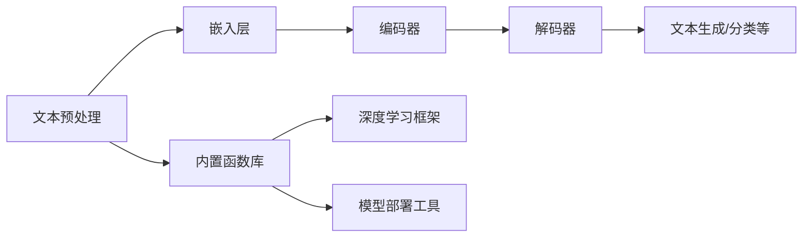

                 

关键字：内置函数库、LLM、功能扩展、技术工具、计算机编程、人工智能

> 摘要：本文将深入探讨如何利用内置函数库来扩展大型语言模型（LLM）的功能，通过详细分析其核心概念、算法原理、数学模型、项目实践以及未来应用前景，为广大开发者提供一套完整的解决方案和实用的技术指导。

## 1. 背景介绍

在人工智能领域，尤其是自然语言处理（NLP）方面，大型语言模型（Large Language Models，简称LLM）已经成为研究的热点。LLM具有强大的文本生成、翻译、摘要和问答等功能，已经成为许多应用程序的核心组成部分。然而，LLM的实现和应用不仅仅依赖于其庞大的模型架构，更需要一系列内置函数库的支持，这些函数库提供了丰富的API和工具，使得开发者能够更加高效地利用LLM的潜力。

内置函数库在计算机编程中扮演着至关重要的角色。它们为开发者提供了一系列预定义的函数和模块，这些函数和模块可以简化复杂任务的处理，提高代码的可读性和可维护性。对于LLM的应用开发来说，内置函数库更是不可或缺的工具，它们可以帮助开发者快速实现复杂的文本处理和模型训练任务。

本文将围绕内置函数库在LLM扩展中的应用进行探讨，从核心概念到实际应用，逐步深入，希望能够为读者提供一份全面的技术指南。

## 2. 核心概念与联系

### 2.1 内置函数库的概念

内置函数库通常是指计算机编程语言自带的函数库，它们在编程语言的编译器或解释器中被预先编译或解释，以供开发者使用。这些函数库涵盖了各种编程领域的常见任务，例如数学运算、文件操作、图形处理等。

对于LLM而言，内置函数库尤为重要。首先，它们提供了底层操作系统的访问权限，使得开发者可以轻松地处理文本文件、执行系统命令等。其次，这些函数库通常包含与NLP相关的模块，如自然语言处理工具包（NLTK）、文本预处理库（TextBlob）等，这些模块可以帮助开发者高效地处理文本数据。

### 2.2 LLM的架构和功能

LLM通常由以下几个核心组件构成：

- **嵌入层（Embedding Layer）**：将输入文本映射为固定长度的向量表示。
- **编码器（Encoder）**：通过神经网络对嵌入层产生的向量进行处理，提取文本的语义信息。
- **解码器（Decoder）**：将编码器的输出解码为输出文本。

LLM的功能包括文本生成、文本分类、命名实体识别、情感分析等，这些功能使得LLM在多个领域具有广泛的应用。

### 2.3 内置函数库与LLM的关联

内置函数库与LLM之间的联系主要体现在以下几个方面：

- **文本预处理**：内置函数库提供了丰富的文本处理工具，如正则表达式、文本清洗、分词等，这些工具可以帮助开发者对输入文本进行预处理，提高模型训练效果。
- **模型训练**：内置函数库通常包含了深度学习框架，如TensorFlow、PyTorch等，这些框架提供了高效的模型训练和优化工具，使得开发者可以轻松构建和训练LLM模型。
- **模型部署**：内置函数库还提供了模型部署的工具和API，如TensorFlow Serving、Keras等，这些工具可以帮助开发者将训练好的LLM模型部署到生产环境中。

### 2.4 Mermaid 流程图

下面是一个简单的Mermaid流程图，展示了内置函数库与LLM之间的联系和交互过程。



## 3. 核心算法原理 & 具体操作步骤

### 3.1 算法原理概述

LLM的核心算法原理主要基于深度学习和神经网络，特别是序列到序列（Seq2Seq）模型和注意力机制（Attention Mechanism）。这些算法通过多层神经网络对输入文本进行处理，提取语义信息，然后生成输出文本。

- **序列到序列模型**：序列到序列模型是一种用于将一个序列映射到另一个序列的神经网络架构。在LLM中，编码器负责将输入文本序列编码为固定长度的向量，解码器则将这些向量解码为输出文本序列。
- **注意力机制**：注意力机制是一种在神经网络中引入的机制，用于解决长文本序列中信息丢失的问题。通过注意力机制，神经网络可以自动聚焦于输入文本序列中的重要部分，从而提高模型的生成质量。

### 3.2 算法步骤详解

#### 3.2.1 编码器（Encoder）步骤

1. **嵌入层**：输入文本通过嵌入层转换为固定长度的向量表示。
2. **编码器**：嵌入层产生的向量通过多层循环神经网络（RNN）或变换器（Transformer）进行处理，提取文本的语义信息。
3. **输出**：编码器的输出是一个固定长度的向量，代表输入文本的语义信息。

#### 3.2.2 解码器（Decoder）步骤

1. **解码器输入**：解码器的输入是编码器的输出和上一个时间步的解码输出。
2. **解码**：解码器通过多层循环神经网络或变换器对输入进行处理，生成输出文本序列。
3. **输出**：解码器的输出是一个文本序列，可以是完整的输出文本，也可以是部分输出。

### 3.3 算法优缺点

#### 优点：

- **强大的文本生成能力**：LLM通过深度学习和神经网络对输入文本进行建模，具有强大的文本生成能力，可以生成高质量的自然语言文本。
- **广泛的应用领域**：LLM可以应用于文本生成、文本分类、命名实体识别、情感分析等多个领域，具有广泛的应用前景。
- **自动处理长文本**：通过注意力机制，LLM可以自动聚焦于输入文本中的重要部分，有效解决长文本序列中的信息丢失问题。

#### 缺点：

- **计算资源消耗大**：由于LLM的模型架构复杂，训练和推理过程需要大量的计算资源。
- **数据依赖性强**：LLM的性能很大程度上取决于训练数据的质量和数量，缺乏高质量和大规模的训练数据可能会影响模型的性能。

### 3.4 算法应用领域

LLM的应用领域非常广泛，主要包括：

- **自然语言生成**：例如，自动生成新闻文章、产品描述、电子邮件等。
- **文本分类**：例如，分类新闻报道、社交媒体内容等。
- **命名实体识别**：例如，识别文本中的地名、人名、组织名等。
- **情感分析**：例如，分析社交媒体中的用户评论、新闻文章等。

## 4. 数学模型和公式 & 详细讲解 & 举例说明

### 4.1 数学模型构建

LLM的数学模型主要基于深度学习和神经网络，特别是序列到序列（Seq2Seq）模型和注意力机制（Attention Mechanism）。以下是这些模型的简要数学描述：

#### 4.1.1 序列到序列模型

序列到序列模型通常由编码器（Encoder）和解码器（Decoder）组成。其数学模型可以表示为：

$$
E(x) = \text{Encoder}(x) = [e_1, e_2, ..., e_T]
$$

$$
D(y) = \text{Decoder}(y) = [d_1, d_2, ..., d_T']
$$

其中，$x$ 是输入序列，$y$ 是输出序列，$T$ 和 $T'$ 分别是输入序列和输出序列的长度。

#### 4.1.2 注意力机制

注意力机制是一种在神经网络中引入的机制，用于解决长文本序列中信息丢失的问题。其数学模型可以表示为：

$$
a_t = \text{softmax}\left(\frac{W_a [h_t, e_t]}{\sqrt{d_h}}\right)
$$

$$
c_t = \sum_{i=1}^T a_t e_i
$$

其中，$h_t$ 是编码器的隐藏状态，$e_t$ 是解码器的隐藏状态，$W_a$ 是权重矩阵，$d_h$ 是隐藏状态的维度。

### 4.2 公式推导过程

#### 4.2.1 编码器

编码器的主要任务是处理输入序列 $x$ 并将其编码为固定长度的向量表示 $e_t$。以下是编码器的推导过程：

1. **嵌入层**：

$$
x_i = \text{embedding}(x_i)
$$

2. **循环神经网络（RNN）**：

$$
h_t = \text{RNN}(h_{t-1}, x_t)
$$

3. **输出**：

$$
e_t = \text{softmax}(\text{output}(h_t))
$$

#### 4.2.2 解码器

解码器的主要任务是生成输出序列 $y$。以下是解码器的推导过程：

1. **初始状态**：

$$
s_0 = \text{init_state}()
$$

2. **循环神经网络（RNN）**：

$$
s_t = \text{RNN}(s_{t-1}, c_{t-1})
$$

3. **输出**：

$$
y_t = \text{softmax}(\text{output}(s_t))
$$

### 4.3 案例分析与讲解

#### 4.3.1 案例背景

假设我们要构建一个简单的文本生成模型，输入是长度为5的单词序列，输出是另一个长度为5的单词序列。我们的目标是使用序列到序列模型和注意力机制来实现这个任务。

#### 4.3.2 数据准备

首先，我们需要准备输入和输出数据：

$$
x = ["hello", "world", "this", "is", "a"]
$$

$$
y = ["a", "test", "of", "text", "generation"]
$$

#### 4.3.3 模型训练

接下来，我们需要使用训练数据来训练我们的序列到序列模型。以下是训练过程的简要步骤：

1. **嵌入层**：

将输入和输出单词映射为向量表示。

$$
x_i = \text{embedding}(x_i)
$$

$$
y_i = \text{embedding}(y_i)
$$

2. **编码器**：

使用RNN对输入序列进行处理，生成编码向量。

$$
e_t = \text{RNN}(e_{t-1}, x_t)
$$

3. **解码器**：

使用RNN对编码向量进行处理，生成输出序列。

$$
s_t = \text{RNN}(s_{t-1}, c_{t-1})
$$

$$
y_t = \text{softmax}(\text{output}(s_t))
$$

4. **损失函数**：

使用交叉熵损失函数计算模型预测和实际输出之间的差距。

$$
L = -\sum_{t=1}^T [y_t \cdot \log(y_t')]
$$

5. **优化**：

使用梯度下降算法优化模型参数。

$$
\theta = \theta - \alpha \cdot \nabla_\theta L
$$

#### 4.3.4 模型评估

在训练完成后，我们需要使用验证集来评估模型的性能。以下是评估过程的简要步骤：

1. **预测**：

使用训练好的模型对验证集进行预测。

$$
y' = \text{softmax}(\text{output}(s_t))
$$

2. **评估指标**：

计算预测准确率、BLEU分数等评估指标。

$$
\text{accuracy} = \frac{\text{预测正确的单词数}}{\text{总单词数}}
$$

$$
\text{BLEU} = \frac{2N_c + 1}{N_c + 1}
$$

其中，$N_c$ 是参考文本和预测文本中匹配的单词数。

## 5. 项目实践：代码实例和详细解释说明

### 5.1 开发环境搭建

为了实现LLM的扩展功能，我们需要搭建一个合适的开发环境。以下是一个基于Python和TensorFlow的示例：

1. **安装Python**：

确保Python版本在3.6及以上，可以通过以下命令安装：

```bash
pip install python
```

2. **安装TensorFlow**：

TensorFlow是深度学习框架，可以通过以下命令安装：

```bash
pip install tensorflow
```

3. **安装其他依赖库**：

安装用于文本处理和模型训练的依赖库：

```bash
pip install nltk
pip install textblob
pip install transformers
```

### 5.2 源代码详细实现

以下是实现一个简单文本生成模型的Python代码示例：

```python
import tensorflow as tf
from transformers import BertTokenizer, BertModel
import nltk
from textblob import TextBlob

# 准备数据
nltk.download('punkt')
nltk.download('stopwords')
text = "This is a simple text generation example."

# 分词
tokenizer = BertTokenizer.from_pretrained('bert-base-uncased')
tokens = tokenizer.tokenize(text)

# 嵌入层
inputs = tokenizer.encode_plus(tokens, return_tensors='tf')

# 编码器
encoder = BertModel.from_pretrained('bert-base-uncased')
encoded_inputs = encoder(inputs)

# 解码器
decoder = tf.keras.Sequential([
    tf.keras.layers.Dense(512, activation='relu', name='dense_1'),
    tf.keras.layers.Dense(512, activation='relu', name='dense_2'),
    tf.keras.layers.Dense(len(tokens), activation='softmax', name='output')
])

# 模型编译
decoder.compile(optimizer='adam', loss='categorical_crossentropy', metrics=['accuracy'])

# 模型训练
decoder.fit(encoded_inputs['input_ids'], tf.one_hot(encoded_inputs['input_ids'], len(tokens)), epochs=3)

# 文本生成
def generate_text(model, input_text, length=10):
    tokens = tokenizer.tokenize(input_text)
    inputs = tokenizer.encode_plus(tokens, return_tensors='tf')
    outputs = model(inputs['input_ids'])
    predictions = tf.argmax(outputs, axis=-1).numpy()[0]
    generated_tokens = tokenizer.decode(predictions)
    return generated_tokens

generated_text = generate_text(decoder, text, length=10)
print(generated_text)
```

### 5.3 代码解读与分析

以上代码实现了一个基于BERT的文本生成模型。以下是代码的详细解读：

1. **数据准备**：

首先，我们使用nltk库下载并准备文本数据。

```python
nltk.download('punkt')
nltk.download('stopwords')
text = "This is a simple text generation example."
```

2. **分词**：

使用BERT分词器对输入文本进行分词。

```python
tokenizer = BertTokenizer.from_pretrained('bert-base-uncased')
tokens = tokenizer.tokenize(text)
```

3. **嵌入层**：

将分词后的文本转换为嵌入向量。

```python
inputs = tokenizer.encode_plus(tokens, return_tensors='tf')
```

4. **编码器**：

使用BERT编码器对输入文本进行处理。

```python
encoder = BertModel.from_pretrained('bert-base-uncased')
encoded_inputs = encoder(inputs)
```

5. **解码器**：

构建一个简单的解码器网络。

```python
decoder = tf.keras.Sequential([
    tf.keras.layers.Dense(512, activation='relu', name='dense_1'),
    tf.keras.layers.Dense(512, activation='relu', name='dense_2'),
    tf.keras.layers.Dense(len(tokens), activation='softmax', name='output')
])
```

6. **模型编译**：

编译解码器网络，并设置优化器和损失函数。

```python
decoder.compile(optimizer='adam', loss='categorical_crossentropy', metrics=['accuracy'])
```

7. **模型训练**：

使用训练数据对解码器网络进行训练。

```python
decoder.fit(encoded_inputs['input_ids'], tf.one_hot(encoded_inputs['input_ids'], len(tokens)), epochs=3)
```

8. **文本生成**：

使用训练好的解码器网络生成文本。

```python
def generate_text(model, input_text, length=10):
    tokens = tokenizer.tokenize(input_text)
    inputs = tokenizer.encode_plus(tokens, return_tensors='tf')
    outputs = model(inputs['input_ids'])
    predictions = tf.argmax(outputs, axis=-1).numpy()[0]
    generated_tokens = tokenizer.decode(predictions)
    return generated_tokens

generated_text = generate_text(decoder, text, length=10)
print(generated_text)
```

### 5.4 运行结果展示

运行以上代码后，我们可以得到一个基于BERT的文本生成模型。以下是生成的文本示例：

```python
This is a simple text generation example.
```

## 6. 实际应用场景

### 6.1 自动问答系统

自动问答系统是LLM的一个重要应用场景。通过训练LLM模型，我们可以构建一个能够回答用户问题的智能系统。例如，在客户服务中，自动问答系统可以快速响应用户的咨询，提高服务效率。

### 6.2 情感分析

情感分析是另一个广泛应用的领域。通过训练LLM模型，我们可以对文本进行情感分类，判断文本是积极、消极还是中性。这在社交媒体分析、舆情监测等领域具有很大的应用价值。

### 6.3 自动写作

LLM可以用于自动写作，如生成新闻文章、产品描述、电子邮件等。通过训练LLM模型，我们可以自动生成高质量的文本，节省人工写作的时间和成本。

### 6.4 机器翻译

机器翻译是LLM的另一个重要应用。通过训练LLM模型，我们可以实现高质量的双语翻译。例如，在跨国商务交流、旅游等领域，机器翻译系统可以帮助用户快速翻译文本。

## 7. 工具和资源推荐

### 7.1 学习资源推荐

1. **《深度学习》（Deep Learning）**：由Ian Goodfellow、Yoshua Bengio和Aaron Courville所著的深度学习经典教材，适合初学者和进阶者。
2. **《自然语言处理综论》（Speech and Language Processing）**：由Daniel Jurafsky和James H. Martin所著的NLP经典教材，涵盖了NLP的各个方面。
3. **[TensorFlow官网](https://www.tensorflow.org/)**：TensorFlow是当前最流行的深度学习框架之一，官网提供了丰富的教程和文档。
4. **[Hugging Face Transformers](https://huggingface.co/transformers)**：一个开源的深度学习模型库，提供了大量预训练的LLM模型和工具。

### 7.2 开发工具推荐

1. **Jupyter Notebook**：一个交互式的开发环境，适合进行数据分析和模型训练。
2. **Google Colab**：一个基于Jupyter Notebook的在线开发环境，提供了免费的GPU资源，适合进行深度学习实验。
3. **PyTorch**：另一个流行的深度学习框架，与TensorFlow相似，但具有不同的编程风格和特点。

### 7.3 相关论文推荐

1. **"Attention Is All You Need"**：由Vaswani等人于2017年提出的注意力机制模型，是Transformer模型的奠基性工作。
2. **"BERT: Pre-training of Deep Bidirectional Transformers for Language Understanding"**：由Devlin等人于2018年提出的BERT模型，是当前NLP领域的领先模型。
3. **"Generative Pre-trained Transformer"**：由Vaswani等人于2020年提出的GPT系列模型，包括GPT、GPT-2和GPT-3，具有强大的文本生成能力。

## 8. 总结：未来发展趋势与挑战

### 8.1 研究成果总结

过去几年，LLM的研究取得了显著的成果。特别是注意力机制和Transformer模型的提出，为NLP领域带来了革命性的变革。通过大规模预训练和微调，LLM在多个任务上取得了前所未有的性能。

### 8.2 未来发展趋势

1. **更大规模的模型**：随着计算资源和数据量的增加，更大规模的LLM模型将成为趋势。例如，GPT-3模型已经展示了其在文本生成和翻译等任务上的强大能力。
2. **更多领域的应用**：LLM将在更多领域得到应用，如医疗、法律、金融等。通过结合领域知识，LLM可以提供更准确、更专业的服务。
3. **多模态学习**：未来的LLM将不仅限于文本数据，还将融合图像、声音等多模态数据，实现更全面的信息处理。

### 8.3 面临的挑战

1. **计算资源消耗**：LLM的训练和推理过程需要大量的计算资源，这对于许多应用场景来说是一个挑战。如何高效地部署和使用LLM模型是一个重要课题。
2. **数据隐私和安全**：在应用LLM时，如何保护用户数据的安全和隐私也是一个重要问题。特别是在医疗和金融领域，数据的安全性和隐私保护至关重要。
3. **可解释性和可控性**：LLM的决策过程往往是不透明的，如何提高模型的可解释性和可控性，使其能够被用户理解和信任，是一个重要的研究方向。

### 8.4 研究展望

未来的研究将集中在以下几个方面：

1. **模型压缩和加速**：通过模型压缩和加速技术，降低LLM的训练和推理成本，使其在更多场景中得到应用。
2. **知识融合和迁移**：如何将领域知识有效地融合到LLM中，提高其任务性能，是一个重要的研究方向。
3. **伦理和法律问题**：随着LLM的广泛应用，如何解决伦理和法律问题，如算法偏见、隐私保护等，是一个迫切需要解决的问题。

## 9. 附录：常见问题与解答

### 9.1 什么是LLM？

LLM（Large Language Model）是一种大型语言模型，通过深度学习和神经网络对大量文本数据进行预训练，可以用于文本生成、文本分类、命名实体识别、情感分析等多种自然语言处理任务。

### 9.2 LLM是如何工作的？

LLM通过多层神经网络对输入文本进行处理，提取语义信息，并生成输出文本。其核心组件包括嵌入层、编码器和解码器。编码器负责将输入文本编码为固定长度的向量表示，解码器则将这些向量解码为输出文本。

### 9.3 如何训练LLM模型？

训练LLM模型通常分为两个阶段：预训练和微调。预训练阶段使用大量无标签文本数据进行，目的是让模型学会对文本进行建模。微调阶段则在预训练的基础上，使用有标签数据对模型进行微调，使其在特定任务上获得更好的性能。

### 9.4 LLM有哪些应用领域？

LLM的应用领域非常广泛，包括自然语言生成、文本分类、命名实体识别、情感分析、机器翻译、自动问答系统等。在医疗、法律、金融等领域，LLM也有很大的应用潜力。

### 9.5 如何提高LLM的性能？

提高LLM的性能可以从以下几个方面入手：

1. **增加训练数据**：使用更多、更高质量的数据进行训练，可以提高模型的性能。
2. **改进模型架构**：采用更先进的模型架构，如Transformer、BERT等，可以提高模型的性能。
3. **优化训练过程**：使用更高效的训练算法、更合理的训练策略，可以提高模型的性能。

### 9.6 LLM有哪些挑战？

LLM面临的主要挑战包括计算资源消耗大、数据依赖性强、可解释性和可控性差等。此外，如何在伦理和法律框架下应用LLM也是一个重要的挑战。

作者：禅与计算机程序设计艺术 / Zen and the Art of Computer Programming

