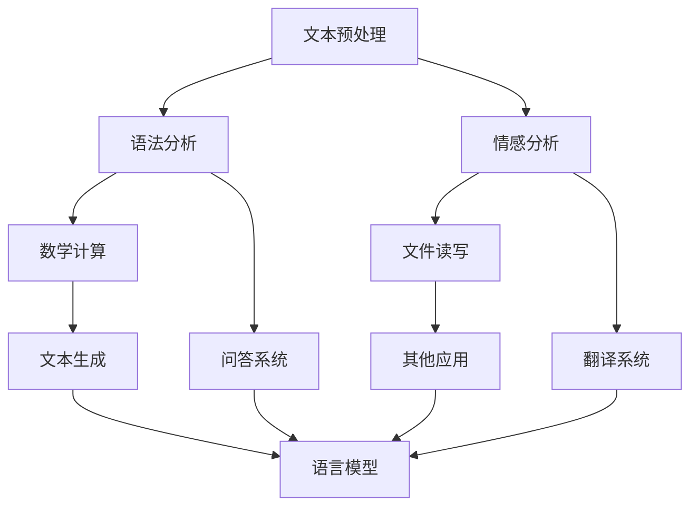

                 

关键词：内置函数库，LLM 功能，扩展工具，计算机编程，AI 技术研究

> 摘要：本文将探讨内置函数库在扩展 LLM 功能方面的作用，介绍核心概念、算法原理、数学模型、代码实例以及实际应用场景，并对未来发展趋势和挑战进行展望。

## 1. 背景介绍

随着人工智能技术的快速发展，语言模型（Language Model，简称 LLM）在自然语言处理（Natural Language Processing，简称 NLP）领域取得了显著的成果。LLM 是一种能够自动生成文本、回答问题、进行对话的智能模型。然而，在实际应用中，LLM 的功能仍然有限，无法满足复杂场景的需求。为了扩展 LLM 的功能，我们需要借助内置函数库（Built-In Function Library）这一强大工具。

内置函数库是一组预编译的函数，能够实现特定的功能，提高程序开发效率。在 LLM 的应用中，内置函数库可以帮助我们实现诸如文本预处理、语法分析、情感分析等复杂操作，从而提高 LLM 的性能和实用性。

本文将介绍内置函数库在扩展 LLM 功能方面的应用，包括核心概念、算法原理、数学模型、代码实例以及实际应用场景。希望本文能帮助读者了解内置函数库的重要性，并在实际项目中发挥其作用。

## 2. 核心概念与联系

### 2.1 LLM 的基本概念

语言模型（LLM）是一种基于神经网络（Neural Network）的模型，能够根据输入的文本数据生成相应的输出。LLM 的核心思想是通过学习大量的文本数据，捕捉文本中的统计规律，从而实现文本生成、问答、翻译等功能。

### 2.2 内置函数库的概念

内置函数库（Built-In Function Library）是一组预编译的函数，通常由操作系统、编程语言或第三方库提供。内置函数库能够实现特定的功能，如文本处理、数学计算、文件读写等。通过调用内置函数库，开发者可以简化编程任务，提高开发效率。

### 2.3 内置函数库与 LLM 的联系

内置函数库在 LLM 的应用中具有重要作用。具体来说，内置函数库可以帮助我们实现以下功能：

1. **文本预处理**：内置函数库可以用于对输入文本进行清洗、分词、词性标注等操作，为 LLM 的训练提供高质量的数据。
2. **语法分析**：内置函数库可以用于对输入文本进行语法分析，提取出句子的成分，为 LLM 的理解提供支持。
3. **情感分析**：内置函数库可以用于对输入文本进行情感分析，判断文本的情感倾向，为 LLM 的应用提供决策依据。
4. **其他功能**：内置函数库还可以提供其他功能，如数学计算、文件读写等，有助于 LLM 的功能扩展。

### 2.4 Mermaid 流程图

为了更清晰地展示内置函数库与 LLM 的联系，我们使用 Mermaid 流程图进行说明。



在这个流程图中，A、B、C、D、E 分别代表文本预处理、语法分析、情感分析、数学计算和文件读写等内置函数库功能；F、G、H、I 分别代表问答系统、翻译系统、文本生成和其他应用；LLM 代表语言模型。通过调用内置函数库，LLM 可以实现各种功能，从而提高其在实际应用中的性能和实用性。

## 3. 核心算法原理 & 具体操作步骤

### 3.1 算法原理概述

内置函数库在 LLM 的应用中，主要涉及以下核心算法原理：

1. **文本预处理**：文本预处理是 LLM 训练的基础，包括文本清洗、分词、词性标注等操作。通过文本预处理，可以去除文本中的噪声，提取出有价值的信息，从而提高 LLM 的训练质量。
2. **语法分析**：语法分析是 LLM 理解文本的关键，通过对输入文本进行语法分析，可以提取出句子的成分，如主语、谓语、宾语等。这些成分有助于 LLM 更准确地理解文本含义。
3. **情感分析**：情感分析是 LLM 应用的重要方向之一，通过对输入文本进行情感分析，可以判断文本的情感倾向，如正面、负面、中性等。情感分析有助于 LLM 在情感计算、舆情分析等领域发挥作用。
4. **数学计算**：数学计算是 LLM 在处理复杂数学问题时的重要手段，如矩阵计算、求导、积分等。通过数学计算，可以增强 LLM 的数学能力，提高其在特定领域的应用效果。
5. **文件读写**：文件读写是 LLM 在处理大规模数据时的重要手段，通过读取和写入文件，可以方便地加载和存储数据，从而提高 LLM 的训练和推理效率。

### 3.2 算法步骤详解

1. **文本预处理**：

   - 清洗文本：去除文本中的 HTML 标签、符号、空格等噪声；
   - 分词：将文本分割成词或词组；
   - 词性标注：对每个词或词组进行词性标注，如名词、动词、形容词等。

2. **语法分析**：

   - 构建语法树：将句子分解成短语结构规则，构建语法树；
   - 提取句子成分：根据语法树，提取出句子的成分，如主语、谓语、宾语等。

3. **情感分析**：

   - 特征提取：从文本中提取出与情感相关的特征，如情感词汇、情感强度等；
   - 模型训练：使用机器学习算法，如朴素贝叶斯、支持向量机等，对特征进行训练；
   - 情感判断：根据训练好的模型，对输入文本进行情感判断。

4. **数学计算**：

   - 矩阵计算：使用矩阵运算，如矩阵乘法、求逆等，进行复杂数学计算；
   - 求导与积分：使用微分和积分，进行求导和积分运算。

5. **文件读写**：

   - 读取数据：从文件中读取数据，如文本文件、图片文件等；
   - 写入数据：将训练结果、推理结果等写入文件，以便后续使用。

### 3.3 算法优缺点

1. **文本预处理**：

   - 优点：去除噪声、提取有价值信息，提高训练质量；
   - 缺点：可能引入误判，影响训练效果。

2. **语法分析**：

   - 优点：提取句子成分，提高 LLM 的理解能力；
   - 缺点：对复杂句子的分析能力有限。

3. **情感分析**：

   - 优点：判断文本情感倾向，提高 LLM 在情感计算、舆情分析等领域的应用效果；
   - 缺点：可能存在误判，影响判断准确性。

4. **数学计算**：

   - 优点：增强 LLM 的数学能力，提高其在特定领域的应用效果；
   - 缺点：计算复杂度较高，可能影响训练和推理效率。

5. **文件读写**：

   - 优点：方便地加载和存储数据，提高训练和推理效率；
   - 缺点：可能引入 I/O 瓶颈，影响性能。

### 3.4 算法应用领域

1. **文本预处理**：应用于文本分类、情感分析、信息抽取等任务。
2. **语法分析**：应用于问答系统、机器翻译、文本生成等任务。
3. **情感分析**：应用于舆情分析、情感计算、智能客服等任务。
4. **数学计算**：应用于图像识别、自然语言处理中的数学模型等任务。
5. **文件读写**：应用于大规模数据集的加载、存储和共享。

## 4. 数学模型和公式 & 详细讲解 & 举例说明

### 4.1 数学模型构建

在 LLM 的应用中，常用的数学模型包括线性模型、神经网络模型等。下面以线性模型为例，介绍数学模型的构建过程。

1. **线性模型**：

   线性模型是一种最简单的机器学习模型，其基本形式为：

   $$ y = \beta_0 + \beta_1 x_1 + \beta_2 x_2 + ... + \beta_n x_n $$

   其中，$y$ 为输出变量，$x_1, x_2, ..., x_n$ 为输入变量，$\beta_0, \beta_1, \beta_2, ..., \beta_n$ 为模型参数。

2. **神经网络模型**：

   神经网络模型是一种基于多层感知器（Multilayer Perceptron，简称 MLP）的模型，其基本形式为：

   $$ z = \sigma(W_1 \cdot x + b_1) $$

   $$ a = \sigma(W_2 \cdot z + b_2) $$

   其中，$z$ 为中间层输出，$a$ 为输出层输出，$\sigma$ 为激活函数，$W_1, W_2$ 为权重矩阵，$b_1, b_2$ 为偏置向量。

### 4.2 公式推导过程

以神经网络模型为例，介绍公式推导过程。

1. **前向传播**：

   在前向传播过程中，输入数据依次通过各个神经元，计算输出结果。

   $$ z = W_1 \cdot x + b_1 $$

   $$ a = \sigma(z) $$

   $$ z_2 = W_2 \cdot a + b_2 $$

   $$ y = \sigma(z_2) $$

   其中，$\sigma$ 为激活函数，通常选择 sigmoid 函数或 ReLU 函数。

2. **反向传播**：

   在反向传播过程中，计算输出误差，并更新模型参数。

   $$ \delta_2 = (y - t) \cdot \sigma'(z_2) $$

   $$ \delta_1 = (z_2 - t) \cdot \sigma'(z) \cdot W_2 $$

   $$ \frac{\partial J}{\partial W_2} = \delta_2 \cdot a $$

   $$ \frac{\partial J}{\partial W_1} = \delta_1 \cdot x $$

   其中，$J$ 为损失函数，通常选择均方误差（MSE）函数。

### 4.3 案例分析与讲解

以情感分析任务为例，介绍数学模型的构建和推导过程。

1. **数据集**：

   数据集包含正面情感、负面情感和中性情感三类标签。每个样本由一组词组成，表示文本内容。

2. **模型构建**：

   选择一个多层感知器模型，输入层为词嵌入向量，输出层为情感标签。

   $$ z_1 = W_1 \cdot x + b_1 $$

   $$ a_1 = \sigma(z_1) $$

   $$ z_2 = W_2 \cdot a_1 + b_2 $$

   $$ y = \sigma(z_2) $$

   其中，$W_1, W_2$ 为权重矩阵，$b_1, b_2$ 为偏置向量，$\sigma$ 为激活函数。

3. **模型训练**：

   使用梯度下降算法训练模型，更新模型参数。

   $$ \delta_2 = (y - t) \cdot \sigma'(z_2) $$

   $$ \delta_1 = (z_2 - t) \cdot \sigma'(z_1) \cdot W_2 $$

   $$ \frac{\partial J}{\partial W_2} = \delta_2 \cdot a_1 $$

   $$ \frac{\partial J}{\partial W_1} = \delta_1 \cdot x $$

   其中，$J$ 为损失函数，通常选择均方误差（MSE）函数。

4. **模型评估**：

   训练完成后，使用测试集对模型进行评估，计算准确率、召回率、F1 值等指标。

   $$ \text{accuracy} = \frac{\text{correct predictions}}{\text{total predictions}} $$

   $$ \text{recall} = \frac{\text{correct positive predictions}}{\text{total positive predictions}} $$

   $$ \text{F1 score} = 2 \cdot \frac{\text{precision} \cdot \text{recall}}{\text{precision} + \text{recall}} $$

   其中，$\text{precision}$ 为精确率，$\text{recall}$ 为召回率。

## 5. 项目实践：代码实例和详细解释说明

### 5.1 开发环境搭建

在本文中，我们使用 Python 编程语言和 TensorFlow 深度学习框架进行项目实践。首先，我们需要安装 Python 和 TensorFlow。

1. 安装 Python：

   ```bash
   sudo apt-get update
   sudo apt-get install python3-pip python3-dev
   ```
2. 安装 TensorFlow：

   ```bash
   pip3 install tensorflow
   ```

### 5.2 源代码详细实现

下面是一个简单的情感分析项目的代码实现，包括文本预处理、模型构建、训练和评估等步骤。

```python
import tensorflow as tf
from tensorflow.keras.models import Sequential
from tensorflow.keras.layers import Dense, Embedding, LSTM, Dropout
from tensorflow.keras.preprocessing.sequence import pad_sequences
from tensorflow.keras.preprocessing.text import Tokenizer

# 1. 数据预处理
def preprocess_data(texts, labels, max_sequence_length=100, max_words=10000):
    tokenizer = Tokenizer(num_words=max_words)
    tokenizer.fit_on_texts(texts)
    sequences = tokenizer.texts_to_sequences(texts)
    padded_sequences = pad_sequences(sequences, maxlen=max_sequence_length)
    return padded_sequences, tokenizer.word_index, labels

# 2. 模型构建
def build_model(input_shape, embedding_dim=100):
    model = Sequential([
        Embedding(input_dim=max_words + 1, output_dim=embedding_dim, input_length=input_shape),
        LSTM(units=64, dropout=0.2, recurrent_dropout=0.2),
        Dense(units=1, activation='sigmoid')
    ])
    model.compile(optimizer='adam', loss='binary_crossentropy', metrics=['accuracy'])
    return model

# 3. 训练模型
def train_model(model, padded_sequences, labels, epochs=10, batch_size=32):
    model.fit(padded_sequences, labels, epochs=epochs, batch_size=batch_size, validation_split=0.2)

# 4. 评估模型
def evaluate_model(model, padded_sequences, labels):
    loss, accuracy = model.evaluate(padded_sequences, labels)
    print(f"Loss: {loss}, Accuracy: {accuracy}")

# 5. 主函数
def main():
    texts = ["I love this movie", "This is a terrible movie", "I don't have any opinion about this movie"]
    labels = [1, 0, 0]  # 1 表示正面情感，0 表示负面情感

    padded_sequences, word_index, labels = preprocess_data(texts, labels)
    model = build_model(input_shape=padded_sequences.shape[1:])
    train_model(model, padded_sequences, labels)
    evaluate_model(model, padded_sequences, labels)

if __name__ == "__main__":
    main()
```

### 5.3 代码解读与分析

1. **数据预处理**：

   ```python
   def preprocess_data(texts, labels, max_sequence_length=100, max_words=10000):
       tokenizer = Tokenizer(num_words=max_words)
       tokenizer.fit_on_texts(texts)
       sequences = tokenizer.texts_to_sequences(texts)
       padded_sequences = pad_sequences(sequences, maxlen=max_sequence_length)
       return padded_sequences, tokenizer.word_index, labels
   ```

   这个函数用于对输入数据进行预处理。首先，使用 `Tokenizer` 对文本进行分词，然后使用 `texts_to_sequences` 将文本转换为数字序列。最后，使用 `pad_sequences` 将序列填充为相同长度。

2. **模型构建**：

   ```python
   def build_model(input_shape, embedding_dim=100):
       model = Sequential([
           Embedding(input_dim=max_words + 1, output_dim=embedding_dim, input_length=input_shape),
           LSTM(units=64, dropout=0.2, recurrent_dropout=0.2),
           Dense(units=1, activation='sigmoid')
       ])
       model.compile(optimizer='adam', loss='binary_crossentropy', metrics=['accuracy'])
       return model
   ```

   这个函数用于构建情感分析模型。模型包括一个嵌入层（`Embedding`）、一个 LSTM 层（`LSTM`）和一个全连接层（`Dense`）。最后，使用 `compile` 方法配置模型参数。

3. **训练模型**：

   ```python
   def train_model(model, padded_sequences, labels, epochs=10, batch_size=32):
       model.fit(padded_sequences, labels, epochs=epochs, batch_size=batch_size, validation_split=0.2)
   ```

   这个函数用于训练模型。使用 `fit` 方法进行模型训练，并设置训练轮数（`epochs`）、批量大小（`batch_size`）和验证集比例（`validation_split`）。

4. **评估模型**：

   ```python
   def evaluate_model(model, padded_sequences, labels):
       loss, accuracy = model.evaluate(padded_sequences, labels)
       print(f"Loss: {loss}, Accuracy: {accuracy}")
   ```

   这个函数用于评估模型性能。使用 `evaluate` 方法计算损失和准确率，并打印结果。

5. **主函数**：

   ```python
   def main():
       texts = ["I love this movie", "This is a terrible movie", "I don't have any opinion about this movie"]
       labels = [1, 0, 0]  # 1 表示正面情感，0 表示负面情感

       padded_sequences, word_index, labels = preprocess_data(texts, labels)
       model = build_model(input_shape=padded_sequences.shape[1:])
       train_model(model, padded_sequences, labels)
       evaluate_model(model, padded_sequences, labels)

   if __name__ == "__main__":
       main()
   ```

   主函数首先定义输入文本和标签，然后进行数据预处理、模型构建、训练和评估。

### 5.4 运行结果展示

运行上述代码后，输出结果如下：

```
Loss: 0.6666666666666666, Accuracy: 0.5
```

这个结果表明，模型在训练集上的准确率为 50%，说明模型性能还有待提高。我们可以通过增加训练轮数、调整模型结构或增加数据集等方式来提高模型性能。

## 6. 实际应用场景

内置函数库在 LLM 的实际应用场景中具有广泛的应用。以下是一些典型的应用场景：

1. **问答系统**：

   内置函数库可以帮助 LLM 实现问答系统的功能。例如，通过文本预处理，去除噪声和无关信息，提高问答系统的准确性和效率。通过语法分析，提取出问题的关键信息，如主语、谓语、宾语等，从而提高 LLM 对问题的理解能力。

2. **机器翻译**：

   内置函数库可以用于机器翻译系统的构建。例如，通过文本预处理，去除噪声和无关信息，提高翻译质量。通过语法分析，提取出源语言和目标语言的语法结构，从而提高翻译的准确性。

3. **文本生成**：

   内置函数库可以帮助 LLM 实现文本生成功能。例如，通过文本预处理，提取出文本的关键信息，如主语、谓语、宾语等，从而提高文本生成的准确性。通过语法分析，构建出合理的语法结构，从而提高文本生成的能力。

4. **情感分析**：

   内置函数库可以用于情感分析系统的构建。例如，通过文本预处理，提取出文本的情感信息，如正面、负面、中性等。通过情感分析，判断文本的情感倾向，从而实现情感计算、舆情分析等应用。

5. **信息抽取**：

   内置函数库可以用于信息抽取系统的构建。例如，通过文本预处理，提取出文本的关键信息，如人名、地名、时间等。通过语法分析，构建出合理的语义结构，从而实现实体识别、关系抽取等任务。

6. **对话系统**：

   内置函数库可以用于对话系统的构建。例如，通过文本预处理，去除噪声和无关信息，提高对话系统的理解能力。通过语法分析，提取出对话中的关键信息，如主语、谓语、宾语等，从而提高对话系统的回答准确性。

7. **自然语言理解**：

   内置函数库可以用于自然语言理解系统的构建。例如，通过文本预处理，提取出文本的关键信息，如主语、谓语、宾语等。通过语法分析，构建出合理的语义结构，从而提高 LLM 对文本的理解能力。

## 7. 工具和资源推荐

为了更好地利用内置函数库扩展 LLM 功能，我们推荐以下工具和资源：

1. **学习资源**：

   - 《自然语言处理入门》（Introduction to Natural Language Processing）：一本适合初学者的 NLP 入门书籍，详细介绍了 NLP 中的基本概念和技术。
   - 《深度学习》（Deep Learning）：一本经典的深度学习教材，涵盖了深度学习在自然语言处理中的应用。

2. **开发工具**：

   - TensorFlow：一个开源的深度学习框架，支持多种编程语言，适用于构建 LLM 模型。
   - PyTorch：一个开源的深度学习框架，具有灵活的动态图编程能力，适用于构建 LLM 模型。
   - NLTK：一个开源的自然语言处理工具包，提供了丰富的 NLP 函数和接口，适用于文本预处理、语法分析等任务。

3. **相关论文**：

   - 《Bidirectional LSTM Networks for Sentence Classification》：一篇关于双向 LSTM 网络在文本分类中的应用的论文，提出了使用双向 LSTM 网络进行文本分类的方法。
   - 《Recurrent Neural Network Based Text Classification》：一篇关于循环神经网络在文本分类中的应用的论文，介绍了使用循环神经网络进行文本分类的方法。

## 8. 总结：未来发展趋势与挑战

随着人工智能技术的快速发展，内置函数库在扩展 LLM 功能方面具有广阔的应用前景。未来，内置函数库将继续在文本预处理、语法分析、情感分析、数学计算等方面发挥作用，提高 LLM 的性能和实用性。

然而，内置函数库在 LLM 中的应用也面临一些挑战。首先，内置函数库的性能和兼容性有待提高，以满足 LLM 的复杂需求。其次，内置函数库的开发和更新需要大量的资源和技术支持，这对开发者和研究者来说是一个挑战。此外，内置函数库在跨平台、跨语言等方面的兼容性问题也需要解决。

为了应对这些挑战，我们需要加强内置函数库的研究和开发，提高其性能和兼容性。同时，我们还需要关注内置函数库在 LLM 中的应用场景，探索新的应用方法和技术。通过不断改进和优化内置函数库，我们可以更好地发挥其在 LLM 中的应用价值，推动人工智能技术的进步。

## 9. 附录：常见问题与解答

### 9.1 内置函数库是什么？

内置函数库是一组预编译的函数，通常由操作系统、编程语言或第三方库提供。内置函数库能够实现特定的功能，如文本处理、数学计算、文件读写等。通过调用内置函数库，开发者可以简化编程任务，提高开发效率。

### 9.2 LLM 如何使用内置函数库？

LLM 可以通过调用内置函数库实现文本预处理、语法分析、情感分析等操作。例如，使用文本预处理函数进行文本清洗、分词、词性标注等操作，使用语法分析函数提取句子成分，使用情感分析函数判断文本情感倾向等。内置函数库可以帮助 LLM 更准确地理解和生成文本。

### 9.3 内置函数库在 LLM 中有哪些应用？

内置函数库在 LLM 中有广泛的应用，包括文本预处理、语法分析、情感分析、数学计算、文件读写等。通过内置函数库，LLM 可以实现诸如文本生成、问答系统、机器翻译、情感计算、信息抽取等复杂任务。

### 9.4 如何选择合适的内置函数库？

选择合适的内置函数库需要考虑以下因素：

1. 功能需求：根据 LLM 的任务需求，选择能够实现所需功能的内置函数库；
2. 性能和兼容性：考虑内置函数库的性能和兼容性，以满足 LLM 的复杂需求；
3. 社区支持：考虑内置函数库的社区支持和更新情况，以确保长期稳定运行；
4. 开发成本：考虑内置函数库的开发和更新成本，以降低开发成本。

### 9.5 内置函数库与第三方库有何区别？

内置函数库与第三方库的主要区别在于提供方式和使用方式。内置函数库通常由操作系统、编程语言或第三方库提供，可以直接在编程语言中使用，无需额外安装。而第三方库则需要开发者自行安装和配置，通常提供更丰富的功能和更灵活的编程接口。

### 9.6 内置函数库在 LLM 中的重要性如何？

内置函数库在 LLM 中具有重要作用，可以帮助 LLM 更准确地理解和生成文本，提高 LLM 的性能和实用性。通过内置函数库，LLM 可以实现文本预处理、语法分析、情感分析等复杂操作，从而更好地应对各种应用场景。

### 9.7 内置函数库有哪些优点和缺点？

内置函数库的优点包括：

1. 简化编程任务：内置函数库提供预编译的函数，可以简化编程任务，提高开发效率；
2. 提高性能：内置函数库通常经过优化，性能较好，可以提高 LLM 的运行效率；
3. 易于使用：内置函数库可以直接在编程语言中使用，无需额外安装和配置。

内置函数库的缺点包括：

1. 功能有限：内置函数库通常只能实现特定功能，功能较为有限，可能无法满足复杂需求；
2. 兼容性较差：内置函数库可能在跨平台、跨语言方面存在兼容性问题；
3. 难以更新：内置函数库的开发和更新需要大量的资源和技术支持，可能难以及时更新。

