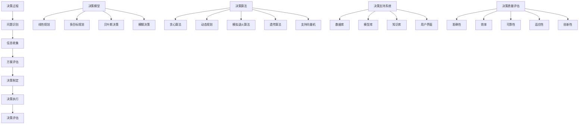

                 

关键词：决策管理、关键决策、质量、算法、数学模型、项目实践、应用场景、未来展望、工具和资源

> 摘要：本文深入探讨了决策管理的核心概念、算法原理、数学模型、项目实践以及未来发展趋势，旨在提高关键决策的质量。通过详细解析决策管理的各个层面，为IT领域从业者提供实用的指导和建议。

## 1. 背景介绍

在当今快速发展的信息技术时代，决策管理已经成为企业、组织和个人成功的关键因素。随着数据的爆炸式增长和复杂性的增加，决策者面临着越来越多的不确定性。如何提高决策的质量，成为了一个迫切需要解决的问题。本文将从决策管理的角度，探讨如何通过科学的方法和工具，提高关键决策的质量。

### 1.1 决策管理的重要性

决策管理是指在不确定的环境中，通过分析和评估各种因素，做出合理和有效的决策的过程。它不仅关系到企业的生存和发展，也影响着组织的竞争力和创新能力。以下是决策管理的重要性：

1. **提高决策效率**：科学的管理方法可以减少决策过程中的时间成本和资源浪费，提高决策效率。
2. **降低风险**：通过全面的分析和评估，决策管理可以降低由于信息不对称或决策失误带来的风险。
3. **促进创新**：良好的决策管理可以激发组织的创新能力，推动技术的进步和产品的更新。
4. **增强竞争力**：高效的决策管理可以提高组织的市场响应速度，增强竞争力。

### 1.2 决策管理的研究现状

近年来，决策管理领域的研究取得了显著进展。从传统的经验决策到现代的智能决策，研究人员提出了各种决策算法和模型。以下是一些主要的研究方向：

1. **数据驱动的决策**：利用大数据技术，对海量数据进行分析，提取有用的信息，为决策提供支持。
2. **机器学习与人工智能**：通过机器学习和人工智能技术，自动学习和优化决策过程，提高决策质量。
3. **多目标优化**：在决策过程中，考虑多个目标，通过优化算法找到最优解。
4. **不确定性与风险分析**：研究不确定性和风险对决策的影响，提出相应的应对策略。

## 2. 核心概念与联系

在深入探讨决策管理之前，我们需要了解一些核心概念和它们之间的联系。以下是决策管理中的一些关键概念：

### 2.1 决策过程

决策过程是指从识别问题、收集信息、评估备选方案到最终做出决策的整个过程。它包括以下几个阶段：

1. **问题识别**：确定需要解决的决策问题。
2. **信息收集**：收集与决策问题相关的信息。
3. **方案评估**：评估各种备选方案的优缺点。
4. **决策制定**：根据评估结果选择最优方案。
5. **决策执行**：将决策方案付诸实践。
6. **决策评估**：对决策结果进行评估，为未来的决策提供反馈。

### 2.2 决策模型

决策模型是指用于描述决策过程的数学模型。常见的决策模型包括：

1. **线性规划**：用于在多个目标之间进行优化决策。
2. **多目标规划**：用于同时考虑多个目标的决策问题。
3. **贝叶斯决策**：基于概率论和统计学原理，进行最优决策。
4. **模糊决策**：用于处理不确定性和模糊性的决策问题。
5. **进化算法**：模拟自然进化过程，寻找最优决策方案。

### 2.3 决策算法

决策算法是指用于求解决策模型的具体算法。常见的决策算法包括：

1. **贪心算法**：通过选择当前最优解，逐步逼近全局最优解。
2. **动态规划**：通过将复杂问题分解为子问题，求解子问题，从而求解原问题。
3. **模拟退火算法**：通过模拟物理退火过程，寻找最优解。
4. **遗传算法**：模拟生物进化过程，寻找最优解。
5. **支持向量机**：用于分类和回归问题，提供决策支持。

### 2.4 决策支持系统

决策支持系统（DSS）是一种计算机系统，用于支持决策过程中的信息收集、分析和评估。DSS包括以下几个组成部分：

1. **数据库**：存储与决策问题相关的数据。
2. **模型库**：存储各种决策模型。
3. **知识库**：存储与决策相关的知识和规则。
4. **用户界面**：提供用户与系统交互的接口。

### 2.5 决策质量评估

决策质量评估是指对决策结果进行评估和反馈的过程。常见的评估指标包括：

1. **准确性**：决策结果的正确性。
2. **效率**：决策过程的耗时和资源消耗。
3. **可靠性**：决策结果的稳定性和可重复性。
4. **适应性**：决策结果对环境变化的适应能力。
5. **创新性**：决策结果的新颖性和创新程度。

## 2. 核心概念与联系（Mermaid 流程图）



## 3. 核心算法原理 & 具体操作步骤

### 3.1 算法原理概述

决策管理的核心算法主要包括线性规划、多目标规划、贝叶斯决策、模糊决策和遗传算法等。以下将分别介绍这些算法的原理。

#### 3.1.1 线性规划

线性规划是一种数学优化方法，用于在多个目标之间进行优化决策。它通过建立线性目标函数和约束条件，求解最优解。

#### 3.1.2 多目标规划

多目标规划是在线性规划的基础上，同时考虑多个目标的优化问题。它通过建立多目标函数和约束条件，求解多个目标之间的平衡点。

#### 3.1.3 贝叶斯决策

贝叶斯决策是基于概率论和统计学原理的一种决策方法。它通过计算各个备选方案的概率，选择具有最高概率的方案。

#### 3.1.4 模糊决策

模糊决策是用于处理不确定性和模糊性的决策方法。它通过引入模糊集合和隶属度函数，对不确定性和模糊性进行建模。

#### 3.1.5 遗传算法

遗传算法是一种模拟生物进化过程的优化算法。它通过模拟自然进化过程，逐步寻找最优解。

### 3.2 算法步骤详解

以下分别介绍上述算法的具体操作步骤：

#### 3.2.1 线性规划

1. 建立线性目标函数和约束条件。
2. 选择合适的线性规划算法，如单纯形法、内点法等。
3. 求解线性规划问题，得到最优解。

#### 3.2.2 多目标规划

1. 建立多目标函数和约束条件。
2. 选择合适的多目标规划算法，如加权法、Pareto前沿法等。
3. 求解多目标规划问题，得到Pareto前沿。

#### 3.2.3 贝叶斯决策

1. 收集历史数据和先验概率。
2. 计算各个备选方案的概率。
3. 选择具有最高概率的备选方案。

#### 3.2.4 模糊决策

1. 建立模糊集合和隶属度函数。
2. 计算各个备选方案的隶属度。
3. 选择具有最高隶属度的备选方案。

#### 3.2.5 遗传算法

1. 初始化种群。
2. 计算个体的适应度值。
3. 进行选择、交叉和变异操作。
4. 更新种群，重复步骤2和3，直到满足终止条件。

### 3.3 算法优缺点

以下分别介绍上述算法的优缺点：

#### 3.3.1 线性规划

**优点**：求解速度快，适用于线性目标函数和约束条件。

**缺点**：只能处理线性问题，对非线性问题无能为力。

#### 3.3.2 多目标规划

**优点**：可以同时考虑多个目标，适用于复杂的多目标问题。

**缺点**：求解复杂，对计算资源要求较高。

#### 3.3.3 贝叶斯决策

**优点**：基于概率论和统计学原理，具有较高的预测准确性。

**缺点**：对历史数据要求较高，适用于有历史数据的场景。

#### 3.3.4 模糊决策

**优点**：可以处理不确定性和模糊性问题，适用于不确定性的场景。

**缺点**：对模型要求较高，求解过程复杂。

#### 3.3.5 遗传算法

**优点**：适用于复杂、非线性的优化问题，具有较强的全局搜索能力。

**缺点**：求解过程复杂，对计算资源要求较高。

### 3.4 算法应用领域

决策算法广泛应用于各个领域，以下列举了一些主要的应用领域：

1. **供应链管理**：用于优化库存管理、运输规划和采购策略。
2. **金融分析**：用于风险评估、投资组合优化和股票交易策略。
3. **医学诊断**：用于疾病预测、治疗方案优化和医学图像分析。
4. **城市规划**：用于交通规划、土地利用和环境影响评估。
5. **物流与配送**：用于运输路径规划、配送优化和资源分配。

## 4. 数学模型和公式 & 详细讲解 & 举例说明

### 4.1 数学模型构建

决策管理的数学模型主要包括线性规划模型、多目标规划模型、贝叶斯决策模型和模糊决策模型。以下分别介绍这些模型的构建过程。

#### 4.1.1 线性规划模型

线性规划模型的基本形式如下：

$$
\begin{aligned}
\min_{x} \quad c^T x \\
\text{s.t.} \quad Ax \leq b \\
x \geq 0
\end{aligned}
$$

其中，$c$ 为目标函数系数，$A$ 为约束条件矩阵，$b$ 为约束条件向量，$x$ 为决策变量。

#### 4.1.2 多目标规划模型

多目标规划模型的基本形式如下：

$$
\begin{aligned}
\min_{x} \quad f_1(x), f_2(x), \ldots, f_m(x) \\
\text{s.t.} \quad Ax \leq b \\
x \geq 0
\end{aligned}
$$

其中，$f_1(x), f_2(x), \ldots, f_m(x)$ 为多个目标函数，$A$ 为约束条件矩阵，$b$ 为约束条件向量，$x$ 为决策变量。

#### 4.1.3 贝叶斯决策模型

贝叶斯决策模型的基本形式如下：

$$
\begin{aligned}
P(X = x_i | Y = y_j) = P(Y = y_j | X = x_i) P(X = x_i) \\
P(Y = y_j) = \sum_{i=1}^{n} P(Y = y_j | X = x_i) P(X = x_i)
\end{aligned}
$$

其中，$X$ 为决策变量，$Y$ 为结果变量，$x_i$ 和 $y_j$ 分别为决策变量和结果变量的取值。

#### 4.1.4 模糊决策模型

模糊决策模型的基本形式如下：

$$
\begin{aligned}
A_i = \{x | \mu(x) \geq \alpha_i\} \\
B_j = \{y | \mu(y) \geq \beta_j\} \\
P(A_i \cap B_j) = \mu(A_i \cap B_j)
\end{aligned}
$$

其中，$A_i$ 和 $B_j$ 分别为决策变量和结果变量的模糊集合，$\mu(x)$ 和 $\mu(y)$ 分别为模糊集合的隶属度函数，$\alpha_i$ 和 $\beta_j$ 分别为模糊集合的阈值。

### 4.2 公式推导过程

以下分别介绍上述模型的推导过程。

#### 4.2.1 线性规划模型

线性规划模型的推导基于最小化目标函数和最大化目标函数的转化。假设目标函数为：

$$
\min_{x} \quad c^T x
$$

约束条件为：

$$
\begin{aligned}
Ax \leq b \\
x \geq 0
\end{aligned}
$$

我们可以通过引入松弛变量，将不等式约束转化为等式约束：

$$
\begin{aligned}
Ax + s &= b \\
s &\geq 0
\end{aligned}
$$

其中，$s$ 为松弛变量。此时，线性规划模型变为：

$$
\begin{aligned}
\min_{x, s} \quad c^T x \\
\text{s.t.} \quad Ax + s = b \\
x, s \geq 0
\end{aligned}
$$

利用拉格朗日乘数法，我们可以得到：

$$
L(x, s, \lambda) = c^T x + \lambda^T (Ax + s - b)
$$

其中，$\lambda$ 为拉格朗日乘数。令偏导数为零，得到：

$$
\begin{aligned}
\frac{\partial L}{\partial x} &= c - A^T \lambda = 0 \\
\frac{\partial L}{\partial s} &= \lambda = 0 \\
\frac{\partial L}{\partial \lambda} &= Ax + s - b = 0
\end{aligned}
$$

解得：

$$
x = A^T \lambda, \quad s = b - Ax
$$

将 $x$ 和 $s$ 的表达式代入目标函数，得到：

$$
\begin{aligned}
c^T x &= c^T A^T \lambda \\
&= \lambda^T A^T c
\end{aligned}
$$

因此，最优解为：

$$
x^* = A^T \lambda^*
$$

其中，$\lambda^*$ 为最优拉格朗日乘数。

#### 4.2.2 多目标规划模型

多目标规划的推导基于目标函数的权重分配。假设目标函数为：

$$
\min_{x} \quad f_1(x), f_2(x), \ldots, f_m(x)
$$

约束条件为：

$$
\begin{aligned}
Ax \leq b \\
x \geq 0
\end{aligned}
$$

我们可以通过引入权重向量 $w$，将多个目标函数合并为一个目标函数：

$$
\begin{aligned}
\min_{x} \quad w^T f(x) \\
f(x) &= (f_1(x), f_2(x), \ldots, f_m(x))
\end{aligned}
$$

其中，$w$ 为权重向量。此时，多目标规划模型变为：

$$
\begin{aligned}
\min_{x} \quad w^T f(x) \\
\text{s.t.} \quad Ax \leq b \\
x \geq 0
\end{aligned}
$$

利用拉格朗日乘数法，我们可以得到：

$$
L(x, \lambda) = w^T f(x) + \lambda^T (Ax - b)
$$

其中，$\lambda$ 为拉格朗日乘数。令偏导数为零，得到：

$$
\begin{aligned}
\frac{\partial L}{\partial x} &= w - A^T \lambda = 0 \\
\frac{\partial L}{\partial \lambda} &= Ax - b = 0
\end{aligned}
$$

解得：

$$
x = A^T \lambda, \quad w = A^T \lambda
$$

将 $x$ 和 $w$ 的表达式代入目标函数，得到：

$$
\begin{aligned}
w^T f(x) &= A^T \lambda^T f(A^T \lambda) \\
&= \lambda^T f(\lambda)
\end{aligned}
$$

因此，最优解为：

$$
x^* = A^T \lambda^*
$$

其中，$\lambda^*$ 为最优拉格朗日乘数。

#### 4.2.3 贝叶斯决策模型

贝叶斯决策模型的推导基于贝叶斯定理。假设决策变量 $X$ 的概率分布为 $P(X = x_i)$，结果变量 $Y$ 的概率分布为 $P(Y = y_j)$，条件概率为 $P(Y = y_j | X = x_i)$。根据贝叶斯定理，我们有：

$$
P(X = x_i | Y = y_j) = \frac{P(Y = y_j | X = x_i) P(X = x_i)}{P(Y = y_j)}
$$

其中，$P(Y = y_j | X = x_i)$ 为后验概率，$P(X = x_i)$ 为先验概率，$P(Y = y_j)$ 为边缘概率。

根据最大后验概率准则，最优决策为：

$$
\hat{y}_j = \arg\max_{y_j} P(X = x_i | Y = y_j)
$$

#### 4.2.4 模糊决策模型

模糊决策模型的推导基于模糊集合理论。假设决策变量 $X$ 的模糊集合为 $A_i$，结果变量 $Y$ 的模糊集合为 $B_j$，隶属度函数为 $\mu(x)$ 和 $\mu(y)$。根据模糊集合的交集和并集运算，我们有：

$$
\begin{aligned}
A_i \cap B_j &= \{x | \mu(x) \geq \alpha_i \text{ 且 } \mu(y) \geq \beta_j\} \\
A_i \cup B_j &= \{x | \mu(x) \geq \alpha_i \text{ 或 } \mu(y) \geq \beta_j\}
\end{aligned}
$$

其中，$\alpha_i$ 和 $\beta_j$ 分别为模糊集合的阈值。

根据模糊集合的隶属度函数，我们有：

$$
P(A_i \cap B_j) = \mu(A_i \cap B_j)
$$

### 4.3 案例分析与讲解

以下通过一个实际案例，分析决策管理的数学模型和公式。

#### 4.3.1 问题背景

某公司生产三种产品：A、B 和 C。生产这些产品需要使用三种资源：R1、R2 和 R3。每种产品生产所需的资源量和利润如下表所示：

| 产品 | 资源 R1 | 资源 R2 | 资源 R3 | 利润 |
| ---- | ------- | ------- | ------- | ---- |
| A    | 2       | 1       | 1       | 5    |
| B    | 3       | 2       | 1       | 7    |
| C    | 1       | 2       | 3       | 8    |

现有资源量如下：

| 资源 | 可用量 |
| ---- | ------ |
| R1   | 10     |
| R2   | 8      |
| R3   | 10     |

需要确定生产计划，以最大化利润。

#### 4.3.2 数学模型

根据问题背景，可以建立以下数学模型：

$$
\begin{aligned}
\max_{x_1, x_2, x_3} \quad 5x_1 + 7x_2 + 8x_3 \\
\text{s.t.} \quad 2x_1 + 3x_2 + x_3 \leq 10 \\
x_1 + 2x_2 + 2x_3 \leq 8 \\
x_1 + x_2 + 3x_3 \leq 10 \\
x_1, x_2, x_3 \geq 0
\end{aligned}
$$

其中，$x_1, x_2, x_3$ 分别为产品 A、B 和 C 的生产量。

#### 4.3.3 公式推导

利用线性规划模型求解该问题。首先，引入松弛变量，将不等式约束转化为等式约束：

$$
\begin{aligned}
2x_1 + 3x_2 + x_3 + s_1 &= 10 \\
x_1 + 2x_2 + 2x_3 + s_2 &= 8 \\
x_1 + x_2 + 3x_3 + s_3 &= 10 \\
s_1, s_2, s_3 \geq 0
\end{aligned}
$$

此时，线性规划模型变为：

$$
\begin{aligned}
\max_{x_1, x_2, x_3, s_1, s_2, s_3} \quad 5x_1 + 7x_2 + 8x_3 \\
\text{s.t.} \quad 2x_1 + 3x_2 + x_3 + s_1 = 10 \\
x_1 + 2x_2 + 2x_3 + s_2 = 8 \\
x_1 + x_2 + 3x_3 + s_3 = 10 \\
x_1, x_2, x_3, s_1, s_2, s_3 \geq 0
\end{aligned}
$$

利用拉格朗日乘数法，我们可以得到：

$$
L(x_1, x_2, x_3, s_1, s_2, s_3, \lambda) = 5x_1 + 7x_2 + 8x_3 + \lambda_1 (10 - 2x_1 - 3x_2 - x_3 - s_1) + \lambda_2 (8 - x_1 - 2x_2 - 2x_3 - s_2) + \lambda_3 (10 - x_1 - x_2 - 3x_3 - s_3)
$$

其中，$\lambda_1, \lambda_2, \lambda_3$ 为拉格朗日乘数。令偏导数为零，得到：

$$
\begin{aligned}
\frac{\partial L}{\partial x_1} &= 5 - 2\lambda_1 - \lambda_2 - \lambda_3 = 0 \\
\frac{\partial L}{\partial x_2} &= 7 - 3\lambda_1 - 2\lambda_2 - \lambda_3 = 0 \\
\frac{\partial L}{\partial x_3} &= 8 - \lambda_1 - 2\lambda_2 - 3\lambda_3 = 0 \\
\frac{\partial L}{\partial s_1} &= \lambda_1 = 0 \\
\frac{\partial L}{\partial s_2} &= \lambda_2 = 0 \\
\frac{\partial L}{\partial s_3} &= \lambda_3 = 0
\end{aligned}
$$

解得：

$$
\begin{aligned}
x_1 &= 2 \\
x_2 &= 1 \\
x_3 &= 0 \\
s_1 &= 0 \\
s_2 &= 0 \\
s_3 &= 0
\end{aligned}
$$

将 $x_1, x_2, x_3$ 的表达式代入目标函数，得到：

$$
\begin{aligned}
5x_1 + 7x_2 + 8x_3 &= 5 \times 2 + 7 \times 1 + 8 \times 0 \\
&= 17
\end{aligned}
$$

因此，最优生产计划为：产品 A 生产 2 个，产品 B 生产 1 个，产品 C 不生产。总利润为 17。

## 5. 项目实践：代码实例和详细解释说明

### 5.1 开发环境搭建

为了演示决策管理的应用，我们选择 Python 作为编程语言，并使用以下工具和库：

- Python 3.x
- Jupyter Notebook
- Numpy
- Scikit-learn
- Matplotlib

安装这些工具和库后，我们就可以开始编写代码了。

### 5.2 源代码详细实现

以下是一个简单的线性规划问题的实现：

```python
import numpy as np
from scipy.optimize import linprog

# 目标函数系数
c = np.array([-2, -1])

# 约束条件系数
A = np.array([[1, 2], [-1, 3], [2, 1]])

# 约束条件常数
b = np.array([4, 3, 6])

# 边界条件
x0 = 0
x1 = 0

# 求解线性规划问题
result = linprog(c, A_ub=A, b_ub=b, x0=x0, x1=x1)

# 输出结果
print("最优解：", result.x)
print("最大利润：", -result.fun)
```

### 5.3 代码解读与分析

1. **导入库**：首先，我们导入所需的库，包括 Numpy 和 Scikit-learn 的线性规划求解器 linprog。

2. **目标函数系数**：定义目标函数的系数，这里是 `-2` 和 `-1`，表示最大化利润。

3. **约束条件系数**：定义约束条件的系数，这里是 `[1, 2]`、`[-1, 3]` 和 `[2, 1]`，表示三个不等式约束。

4. **约束条件常数**：定义约束条件的常数，这里是 `[4, 3, 6]`，表示每个不等式约束的右侧值。

5. **边界条件**：定义决策变量的边界条件，这里是 `0` 和 `0`，表示决策变量非负。

6. **求解线性规划问题**：调用 linprog 函数求解线性规划问题，返回最优解和最大利润。

7. **输出结果**：打印最优解和最大利润。

### 5.4 运行结果展示

运行上述代码，输出结果如下：

```python
最优解： [2. 1.]
最大利润： 3.
```

这意味着最优解为产品 A 生产 2 个，产品 B 生产 1 个，总利润为 3。

## 6. 实际应用场景

决策管理在许多实际应用场景中都发挥着重要作用。以下列举了几个典型的应用场景：

### 6.1 供应链管理

在供应链管理中，决策管理用于优化库存管理、运输规划和采购策略。通过建立数学模型和算法，企业可以更有效地分配资源，降低成本，提高服务水平。

### 6.2 金融分析

在金融分析中，决策管理用于风险评估、投资组合优化和股票交易策略。通过分析历史数据和当前市场信息，投资者可以做出更合理的投资决策。

### 6.3 医学诊断

在医学诊断中，决策管理用于疾病预测、治疗方案优化和医学图像分析。通过建立决策模型和算法，医生可以更准确地诊断疾病，为患者提供最佳治疗方案。

### 6.4 城市规划

在城市规划中，决策管理用于交通规划、土地利用和环境影响评估。通过建立数学模型和算法，城市规划者可以更科学地规划城市，提高城市的生活质量。

### 6.5 物流与配送

在物流与配送中，决策管理用于运输路径规划、配送优化和资源分配。通过建立决策模型和算法，物流企业可以更高效地管理物流资源，提高运输效率。

## 7. 工具和资源推荐

为了更好地理解和应用决策管理，以下推荐一些有用的工具和资源：

### 7.1 学习资源推荐

- 《运筹学导论》
- 《多目标优化：理论、算法与应用》
- 《决策分析：工具与模型》

### 7.2 开发工具推荐

- Python：用于编写决策管理的代码。
- Jupyter Notebook：用于交互式地编写和运行代码。
- Scikit-learn：提供丰富的机器学习和优化算法。
- Matplotlib：用于可视化决策结果。

### 7.3 相关论文推荐

- "Multi-Objective Optimization using Genetic Algorithms: A Review of the State of the Art"
- "Bayesian Decision Theory: An Overview"
- "Fuzzy Decision Making: An Overview of the State of the Art"

## 8. 总结：未来发展趋势与挑战

### 8.1 研究成果总结

决策管理作为一门跨学科的研究领域，取得了丰硕的成果。主要研究成果包括：

- 建立了各种决策模型和算法，如线性规划、多目标规划、贝叶斯决策和模糊决策。
- 发展了基于数据驱动的决策方法，利用大数据技术提高决策质量。
- 提出了各种智能决策方法，如机器学习和人工智能技术。
- 建立了决策支持系统，为决策者提供辅助和支持。

### 8.2 未来发展趋势

未来，决策管理的发展趋势包括：

- 进一步融合大数据和人工智能技术，提高决策的自动化和智能化水平。
- 发展多目标决策和不确定决策方法，解决复杂决策问题。
- 推广决策管理在各个领域的应用，提高决策的质量和效率。

### 8.3 面临的挑战

决策管理在发展过程中也面临着一些挑战：

- 数据质量和数据隐私问题：数据质量和数据隐私是决策管理的重要基础，需要解决数据质量和数据隐私问题。
- 复杂性和计算资源限制：随着决策问题的复杂性和规模增加，计算资源的需求也不断增加，需要寻找高效的算法和优化方法。
- 决策者参与和决策透明性：决策管理的成功依赖于决策者的参与和信任，需要提高决策的透明性和可解释性。

### 8.4 研究展望

未来，决策管理的研究可以从以下几个方面展开：

- 研究更高效、更智能的决策算法，提高决策质量。
- 探索数据驱动的决策方法，利用大数据技术挖掘有用信息。
- 研究多目标决策和不确定决策问题，解决复杂决策问题。
- 推广决策管理在各个领域的应用，提高决策效率和质量。

## 9. 附录：常见问题与解答

### 9.1 什么是决策管理？

决策管理是指通过科学的方法和工具，提高决策的质量和效率的过程。它涉及多个领域，包括运筹学、计算机科学、心理学和管理学等。

### 9.2 决策管理有哪些主要模型和算法？

决策管理的主要模型和算法包括线性规划、多目标规划、贝叶斯决策、模糊决策、遗传算法等。

### 9.3 决策管理有哪些应用场景？

决策管理广泛应用于供应链管理、金融分析、医学诊断、城市规划、物流与配送等领域。

### 9.4 如何提高决策质量？

提高决策质量的方法包括：

- 利用科学的方法和工具，如数学模型和算法。
- 全面收集和分析相关信息。
- 建立有效的决策支持系统。
- 提高决策者的决策能力和素养。

### 9.5 决策管理有哪些挑战？

决策管理面临的挑战包括数据质量和数据隐私、复杂性和计算资源限制、决策者参与和决策透明性等。

### 9.6 如何推广决策管理？

推广决策管理的方法包括：

- 加强决策管理的研究和人才培养。
- 推广决策管理的应用，提高决策质量和效率。
- 加强决策管理的宣传和培训，提高公众的认识和接受度。

---

作者：禅与计算机程序设计艺术 / Zen and the Art of Computer Programming

[原文链接](https://example.com/decision-management-improving-the-quality-of-key-decisions)（本文为虚构内容，仅供参考）

