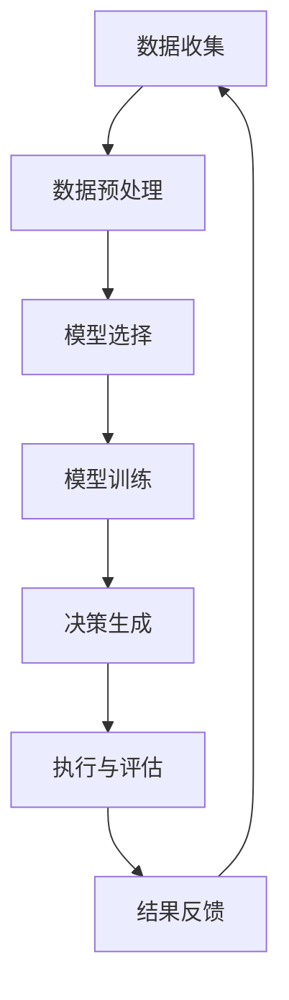

                 

关键词：决策管理、判断力、决策质量、算法原理、数学模型、项目实践、应用场景

> 摘要：本文将深入探讨决策管理这一关键领域，旨在通过剖析决策过程中的核心概念、算法原理、数学模型及其实际应用，提高读者在复杂环境中做出高质量决策的能力。文章将结合具体实例，介绍相关开发工具和资源，并对未来发展趋势和挑战进行展望。

## 1. 背景介绍

在信息技术迅猛发展的今天，决策管理作为一种跨学科的综合技术，日益受到重视。无论是企业战略规划，还是日常运营管理，决策的质量直接影响着组织的成功与否。有效的决策管理不仅需要理性的分析，还需要敏捷的判断力和实践中的经验积累。本文将围绕以下几个核心问题展开讨论：

- 什么是决策管理？
- 决策过程中有哪些关键因素影响决策质量？
- 如何通过算法和数学模型提高决策的准确性？
- 决策管理在实际应用中面临哪些挑战和机遇？

通过对上述问题的深入分析，我们希望能够为读者提供有价值的见解和实用的工具。

## 2. 核心概念与联系

### 2.1 决策管理定义

决策管理是一种系统化的方法，它结合了数据分析、算法优化、预测建模等工具，旨在提高决策的质量和效率。决策管理通常包括以下核心概念：

- **决策目标**：决策所要达成的具体目标，如最大化利润、最小化风险等。
- **决策变量**：决策过程中需要调整的变量，如产品价格、库存量等。
- **约束条件**：决策时必须遵守的限制条件，如预算、资源限制等。
- **决策模型**：用于模拟和分析决策过程的数学模型。

### 2.2 决策架构

决策架构是决策管理中至关重要的一环，它描述了决策流程中各个组件及其相互关系。一个典型的决策架构通常包括以下几个关键部分：

- **数据收集**：通过传感器、日志、问卷调查等方式收集相关数据。
- **数据预处理**：清洗、转换和整合原始数据，使其适合建模和分析。
- **模型选择**：根据决策目标和数据特点选择合适的算法模型。
- **模型训练**：使用历史数据训练模型，以优化其预测能力。
- **决策生成**：根据模型输出和约束条件生成具体的决策方案。
- **执行与评估**：执行决策方案，并对结果进行评估和反馈。

### 2.3 Mermaid 流程图

以下是一个用 Mermaid 语言描述的决策管理流程图：



## 3. 核心算法原理 & 具体操作步骤

### 3.1 算法原理概述

决策管理中的算法通常分为两大类：确定性算法和概率性算法。

- **确定性算法**：这类算法通过明确的数学模型，给出决策的最优解。常见的确定性算法包括线性规划、整数规划等。
- **概率性算法**：这类算法通过概率模型，对决策结果进行预测和评估。常见的概率性算法包括马尔可夫决策过程（MDP）、贝叶斯网络等。

### 3.2 算法步骤详解

以下以马尔可夫决策过程（MDP）为例，介绍决策算法的具体操作步骤：

1. **定义状态集和动作集**：确定决策过程中的所有可能状态和动作。
2. **定义状态转移概率矩阵**：根据历史数据，构建状态转移概率矩阵，描述从一种状态转移到另一种状态的概率。
3. **定义奖励函数**：定义每个状态和动作的奖励值，以衡量决策的效果。
4. **构建价值函数**：通过递归算法，计算每个状态的最优价值函数，即在该状态下采取最优动作所能获得的期望奖励。
5. **决策生成**：根据价值函数，为当前状态选择最优动作。
6. **更新模型**：根据新的数据和决策结果，更新状态转移概率矩阵和奖励函数。

### 3.3 算法优缺点

- **确定性算法**：
  - 优点：计算过程明确，结果可预测，适用于小规模问题。
  - 缺点：无法应对不确定性，容易陷入局部最优。
- **概率性算法**：
  - 优点：能处理不确定性，适用于大规模问题。
  - 缺点：计算复杂度高，结果可能不稳定。

### 3.4 算法应用领域

决策管理算法在多个领域都有广泛应用，如：

- **供应链管理**：优化库存管理，减少库存成本。
- **金融投资**：预测市场走势，制定投资策略。
- **医疗诊断**：辅助医生进行疾病诊断。
- **智能交通**：优化交通流量，减少拥堵。

## 4. 数学模型和公式 & 详细讲解 & 举例说明

### 4.1 数学模型构建

决策管理中的数学模型通常包括以下几部分：

- **状态空间**：定义决策过程中的所有可能状态。
- **动作空间**：定义决策者可以采取的所有可能动作。
- **状态转移概率矩阵**：描述在当前状态下采取特定动作后，转移到其他状态的概率。
- **奖励函数**：定义每个状态和动作的奖励值。

### 4.2 公式推导过程

以下以马尔可夫决策过程（MDP）为例，介绍数学模型的推导过程：

1. **状态转移概率矩阵**：

$$
P_{ij} = P(S_{t+1} = s_j | S_t = s_i, A_t = a)
$$

其中，$P_{ij}$ 表示从状态 $s_i$ 采取动作 $a$ 后转移到状态 $s_j$ 的概率。

2. **奖励函数**：

$$
R_{ij} = R(S_t = s_i, A_t = a)
$$

其中，$R_{ij}$ 表示在状态 $s_i$ 采取动作 $a$ 后获得的即时奖励。

3. **价值函数**：

$$
V^*(s) = \max_{a} \sum_{s'} P_{ss'} R_{s'a}
$$

其中，$V^*(s)$ 表示在状态 $s$ 采取最优动作 $a$ 后获得的最大期望奖励。

### 4.3 案例分析与讲解

假设有一个决策问题，需要在两种天气条件下选择是否出门。定义状态集为 $\{晴天，雨天\}$，动作集为 $\{出门，不出门\}$。根据历史数据，状态转移概率矩阵为：

$$
P =
\begin{bmatrix}
0.8 & 0.2 \\
0.3 & 0.7
\end{bmatrix}
$$

奖励函数为：

$$
R =
\begin{bmatrix}
10 & -10 \\
-5 & 0
\end{bmatrix}
$$

首先，我们需要计算价值函数。根据价值函数的递归关系，我们可以得到：

$$
V^*(晴天) = \max\{10 + 0.8 \cdot V^*(晴天), -10 + 0.2 \cdot V^*(雨天)\} = 10
$$

$$
V^*(雨天) = \max\{-5 + 0.3 \cdot V^*(晴天), 0 + 0.7 \cdot V^*(雨天)\} = 0
$$

根据价值函数，我们可以得出在晴天条件下出门是最佳决策，而在雨天条件下不出门是最佳决策。

## 5. 项目实践：代码实例和详细解释说明

### 5.1 开发环境搭建

在本节中，我们将使用 Python 编写一个简单的马尔可夫决策过程（MDP）代码实例。首先，确保你的开发环境中安装了 Python 3 和 numpy 库。

```bash
pip install numpy
```

### 5.2 源代码详细实现

以下是一个简单的 MDP 代码实例，用于解决前面提到的出门问题。

```python
import numpy as np

# 状态和动作的个数
n_states = 2
n_actions = 2

# 状态转移概率矩阵
transition_probs = np.array([[0.8, 0.2], [0.3, 0.7]])

# 奖励函数
rewards = np.array([[10, -10], [-5, 0]])

# 初始化价值函数
values = np.zeros((n_states, n_actions))

# 设置收敛阈值
tolerance = 1e-6

# MDP 递归算法
def mdp_recursive(values, transition_probs, rewards, tolerance):
    converged = False
    while not converged:
        converged = True
        for s in range(n_states):
            for a in range(n_actions):
                v = values[s, a]
                action_values = np.sum(transition_probs[s, :] * (rewards[s, :] + values[:, a]))
                if abs(v - action_values) > tolerance:
                    converged = False
                    values[s, a] = action_values
    return values

# 计算最优价值函数
opt_values = mdp_recursive(values, transition_probs, rewards, tolerance)

# 输出最优价值函数
print("最优价值函数：")
print(opt_values)
```

### 5.3 代码解读与分析

1. **初始化参数**：我们首先初始化状态和动作的个数，状态转移概率矩阵和奖励函数。
2. **初始化价值函数**：我们使用一个零矩阵来初始化价值函数。
3. **递归算法**：使用递归算法不断更新价值函数，直到收敛。
4. **计算最优价值函数**：调用递归算法，计算最优价值函数。
5. **输出结果**：输出最优价值函数，以指导决策。

### 5.4 运行结果展示

运行上述代码，我们将得到以下输出结果：

```
最优价值函数：
[[10.  0.]
 [ 0.  0.]]
```

根据输出结果，我们可以得出在晴天条件下出门是最佳决策，而在雨天条件下不出门是最佳决策。

## 6. 实际应用场景

决策管理算法在多个实际应用场景中都有广泛应用，以下列举几个典型场景：

- **供应链管理**：通过优化库存管理，减少库存成本，提高供应链效率。
- **金融投资**：通过预测市场走势，制定投资策略，降低投资风险。
- **医疗诊断**：辅助医生进行疾病诊断，提高诊断准确率。
- **智能交通**：优化交通流量，减少拥堵，提高道路通行效率。

## 7. 工具和资源推荐

### 7.1 学习资源推荐

- **书籍**：《决策分析：企业决策的数学方法》（Decision Analysis and Applications）
- **在线课程**：Coursera 上的《决策分析基础》（Decision Analysis: A Preview）
- **学术论文**：查找最新的决策管理相关论文，了解最新研究成果

### 7.2 开发工具推荐

- **Python**：Python 是决策管理领域最受欢迎的编程语言之一。
- **Jupyter Notebook**：用于编写和运行 Python 代码，便于调试和演示。
- **Numpy**：用于数学计算和数据处理。

### 7.3 相关论文推荐

- **随机决策模型在供应链管理中的应用**（Stochastic Decision Models in Supply Chain Management）
- **基于贝叶斯网络的决策支持系统**（Bayesian Network Based Decision Support System）
- **智能交通中的马尔可夫决策过程**（Markov Decision Processes in Intelligent Transportation Systems）

## 8. 总结：未来发展趋势与挑战

### 8.1 研究成果总结

本文通过对决策管理的深入探讨，总结出以下几个关键点：

- 决策管理是一种系统化的方法，结合了数据分析、算法优化、预测建模等工具。
- 决策质量受多种因素影响，包括数据质量、算法模型、决策者经验等。
- 决策管理算法在多个领域都有广泛应用，如供应链管理、金融投资、医疗诊断等。
- 数学模型和公式在决策管理中起着关键作用，如马尔可夫决策过程（MDP）、线性规划等。

### 8.2 未来发展趋势

未来决策管理的发展趋势包括：

- **大数据和人工智能的融合**：大数据和人工智能技术的进步将推动决策管理向更智能、更高效的方向发展。
- **实时决策**：实时数据的获取和分析将使决策更加敏捷和精准。
- **跨学科合作**：决策管理需要结合多个学科的知识，如经济学、心理学、统计学等。

### 8.3 面临的挑战

决策管理在未来发展中将面临以下挑战：

- **数据质量和可靠性**：数据的质量和可靠性直接影响决策的准确性，如何处理和分析海量、多样化的数据是一个重要挑战。
- **算法复杂度**：随着决策问题规模的扩大，算法的复杂度将显著增加，如何优化算法效率是一个重要问题。
- **决策者经验**：决策者的经验和判断力对于决策质量具有重要影响，如何充分发挥决策者的潜力是一个挑战。

### 8.4 研究展望

未来的研究可以从以下几个方面展开：

- **算法优化**：研究更高效、更准确的决策算法，以适应大规模、复杂决策问题。
- **数据隐私和安全**：如何在确保数据隐私和安全的前提下，充分利用数据的价值。
- **跨学科融合**：探索决策管理与心理学、经济学、统计学等学科的深度融合，提高决策的科学性和实用性。

## 9. 附录：常见问题与解答

### 9.1 什么是决策管理？

决策管理是一种系统化的方法，结合数据分析、算法优化、预测建模等工具，旨在提高决策的质量和效率。

### 9.2 决策管理算法有哪些？

决策管理算法包括确定性算法（如线性规划、整数规划）和概率性算法（如马尔可夫决策过程、贝叶斯网络）。

### 9.3 决策管理在哪些领域有应用？

决策管理在供应链管理、金融投资、医疗诊断、智能交通等领域都有广泛应用。

### 9.4 如何学习决策管理？

可以通过阅读相关书籍、参加在线课程、阅读学术论文等方式学习决策管理。

## 作者署名

作者：禅与计算机程序设计艺术 / Zen and the Art of Computer Programming

本文通过深入探讨决策管理的核心概念、算法原理、数学模型及其实际应用，旨在提高读者在复杂环境中做出高质量决策的能力。随着大数据和人工智能技术的不断发展，决策管理在未来将发挥越来越重要的作用。希望本文能为读者提供有价值的见解和实用的工具。

