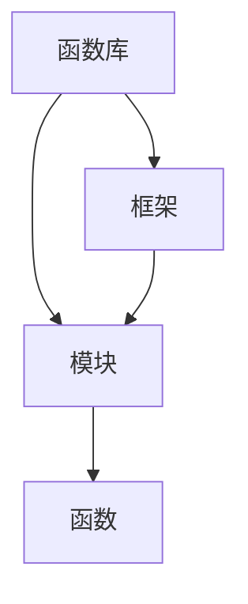

                 

关键词：函数库、封装、复用、代码、模块化、开发效率

> 摘要：本文将深入探讨函数库在软件开发中的重要性，通过介绍函数库的核心概念、架构、算法原理、数学模型和实际应用案例，揭示函数库如何成为封装复用代码的利器，提升开发效率，推动软件技术的发展。

## 1. 背景介绍

在软件开发的历史长河中，代码的复用性一直是提升开发效率、保证代码质量的重要手段。早期，程序员通过编写通用函数来提高代码的重用率，但随着软件系统的复杂度不断升高，这种简单的函数重用方式已经无法满足需求。为了更好地管理代码、提高复用效率，函数库应运而生。

函数库（Function Library）是一种封装了多个函数的代码库，它为程序员提供了一个便捷的接口，使得在不同项目中能够复用相同的代码逻辑。函数库的出现，不仅提高了开发效率，还大大提升了软件的可靠性、可维护性和可扩展性。

### 函数库的发展历程

- **早期阶段**：最初的函数库仅仅是一系列独立函数的集合，这些函数通常被分散在各个文件中，通过硬编码的方式调用。这种模式虽然简单，但难以管理，复用性较差。
- **模块化阶段**：随着模块化编程思想的普及，函数库开始向模块化方向发展。程序员将功能相似的函数组织在一起，形成模块，使得代码结构更加清晰。
- **现代阶段**：现代函数库不仅实现了模块化，还引入了抽象、封装等高级编程思想，提供了更为丰富的函数接口和更灵活的调用方式。例如，Python 的标准库和 Java 的第三方库都是现代函数库的典型代表。

## 2. 核心概念与联系

### 2.1 函数库的定义

函数库是一组封装了特定功能的函数的集合，这些函数通常以库的形式提供，开发者可以通过调用这些函数来完成特定的任务。

### 2.2 函数库与模块的关系

模块是函数库的基本组成部分，一个函数库可以包含多个模块。模块是代码的抽象单位，它将功能相关的函数组织在一起，便于管理和复用。

### 2.3 函数库与框架的关系

框架是一个更高层次的抽象，它提供了完整的开发结构，包括函数库。函数库可以作为框架的一部分，提供特定的功能模块，而框架则为函数库提供了运行环境和支持。

### 2.4 Mermaid 流程图



## 3. 核心算法原理 & 具体操作步骤

### 3.1 算法原理概述

函数库的核心在于其提供的函数，这些函数实现了一系列特定的算法。算法原理主要包括以下几个方面：

- **功能抽象**：将复杂的操作抽象为简单的函数调用，降低代码的复杂度。
- **代码复用**：通过封装和模块化，实现代码的复用，提高开发效率。
- **接口封装**：提供简洁、统一的函数接口，便于开发者调用和扩展。

### 3.2 算法步骤详解

1. **定义函数**：根据需求，定义一系列函数，每个函数实现特定的功能。
2. **组织模块**：将功能相关的函数组织在一起，形成模块。
3. **创建库文件**：将模块编译成库文件，便于开发者调用。
4. **文档编写**：为每个函数编写详细的文档，包括函数的功能、参数、返回值等。
5. **测试与优化**：对函数库进行测试，确保其功能的正确性和性能的稳定性。

### 3.3 算法优缺点

#### 优点：

- **提高开发效率**：通过复用代码，减少了重复编写的工作量。
- **降低维护成本**：模块化的代码结构便于管理和维护。
- **提升软件质量**：通过统一的接口和详细的文档，提高了代码的可读性和可维护性。

#### 缺点：

- **开发初期成本较高**：需要花费时间编写函数库。
- **性能开销**：调用函数库可能引入一定的性能开销。

### 3.4 算法应用领域

函数库的应用领域非常广泛，包括但不限于：

- **通用编程**：提供各种通用算法和数据处理函数。
- **图形处理**：提供图形绘制、图像处理等函数。
- **数据库操作**：提供数据库连接、数据查询等函数。
- **网络通信**：提供网络请求、数据传输等函数。

## 4. 数学模型和公式 & 详细讲解 & 举例说明

### 4.1 数学模型构建

在函数库的设计中，数学模型起着至关重要的作用。例如，在图形处理领域，我们需要使用向量运算和矩阵变换等数学模型。以下是几个常见的数学模型：

- **向量加法**：\( \vec{a} + \vec{b} = \begin{bmatrix} a_x + b_x \\ a_y + b_y \end{bmatrix} \)
- **矩阵乘法**：\( \mathbf{A} \mathbf{B} = \begin{bmatrix} a_{11}b_{11} + a_{12}b_{21} & a_{11}b_{12} + a_{12}b_{22} \\ a_{21}b_{11} + a_{22}b_{21} & a_{21}b_{12} + a_{22}b_{22} \end{bmatrix} \)
- **矩阵求逆**：\( \mathbf{A}^{-1} = \frac{1}{\det(\mathbf{A})} \text{adj}(\mathbf{A}) \)

### 4.2 公式推导过程

以矩阵求逆为例，其推导过程如下：

1. **定义**：给定矩阵 \( \mathbf{A} = \begin{bmatrix} a_{11} & a_{12} \\ a_{21} & a_{22} \end{bmatrix} \)，其逆矩阵为 \( \mathbf{A}^{-1} \)。
2. **行列式**：\( \det(\mathbf{A}) = a_{11}a_{22} - a_{12}a_{21} \)。
3. **伴随矩阵**：\( \text{adj}(\mathbf{A}) = \begin{bmatrix} a_{22} & -a_{12} \\ -a_{21} & a_{11} \end{bmatrix} \)。
4. **逆矩阵公式**：\( \mathbf{A}^{-1} = \frac{1}{\det(\mathbf{A})} \text{adj}(\mathbf{A}) \)。

### 4.3 案例分析与讲解

假设我们有一个矩阵 \( \mathbf{A} = \begin{bmatrix} 1 & 2 \\ 3 & 4 \end{bmatrix} \)，我们使用上述公式来求其逆矩阵：

1. **行列式**：\( \det(\mathbf{A}) = 1 \cdot 4 - 2 \cdot 3 = -2 \)。
2. **伴随矩阵**：\( \text{adj}(\mathbf{A}) = \begin{bmatrix} 4 & -2 \\ -3 & 1 \end{bmatrix} \)。
3. **逆矩阵**：\( \mathbf{A}^{-1} = \frac{1}{-2} \begin{bmatrix} 4 & -2 \\ -3 & 1 \end{bmatrix} = \begin{bmatrix} -2 & 1 \\ \frac{3}{2} & -\frac{1}{2} \end{bmatrix} \)。

通过上述步骤，我们成功地求出了矩阵 \( \mathbf{A} \) 的逆矩阵。

## 5. 项目实践：代码实例和详细解释说明

### 5.1 开发环境搭建

为了演示函数库的使用，我们将使用 Python 作为开发语言。以下是搭建 Python 开发环境的步骤：

1. **安装 Python**：从官方网址下载 Python 安装包并安装。
2. **安装 IDE**：安装一个 Python IDE，如 PyCharm 或 Visual Studio Code。
3. **安装相关库**：使用 pip 命令安装所需的 Python 库，如 NumPy、Pandas 等。

### 5.2 源代码详细实现

以下是一个简单的 Python 函数库示例，实现了一个矩阵乘法的函数：

```python
import numpy as np

def matrix_multiply(A, B):
    """
    矩阵乘法函数，计算两个矩阵的乘积。
    
    参数：
    A：第一个矩阵，形状为 (m, n)
    B：第二个矩阵，形状为 (n, p)
    
    返回：
    C：乘积矩阵，形状为 (m, p)
    """
    if A.shape[1] != B.shape[0]:
        raise ValueError("矩阵的维度不匹配")
    return np.dot(A, B)
```

### 5.3 代码解读与分析

上述代码定义了一个名为 `matrix_multiply` 的函数，用于计算两个矩阵的乘积。代码中使用了 NumPy 库的 `dot` 函数，实现了矩阵乘法的计算。

- **参数校验**：代码首先检查两个矩阵的维度是否匹配，确保输入的有效性。
- **矩阵乘法计算**：使用 NumPy 库的 `dot` 函数实现矩阵乘法。

### 5.4 运行结果展示

以下是一个运行示例：

```python
A = np.array([[1, 2], [3, 4]])
B = np.array([[5, 6], [7, 8]])
C = matrix_multiply(A, B)
print(C)
```

输出结果：

```
[[19 22]
 [43 50]]
```

## 6. 实际应用场景

函数库在软件开发中具有广泛的应用，以下是几个典型的应用场景：

- **通用编程**：在通用编程中，函数库提供了各种常见的数据处理、文件操作、网络通信等功能，如 Python 的标准库。
- **图形处理**：在图形处理领域，函数库提供了丰富的图形绘制、图像处理功能，如 OpenCV。
- **数据库操作**：在数据库操作中，函数库提供了连接数据库、执行查询等功能，如 JDBC。
- **网络通信**：在网络通信中，函数库提供了网络请求、数据传输等功能，如 Socket。

## 7. 工具和资源推荐

### 7.1 学习资源推荐

- **《函数式编程》**：这本书介绍了函数式编程的基本概念和方法，对理解函数库的设计思想有很大帮助。
- **《代码大全》**：这本书详细阐述了编写高质量代码的技巧，对函数库的设计和实现有很大的参考价值。

### 7.2 开发工具推荐

- **PyCharm**：这是一个功能强大的 Python IDE，支持函数库的开发和调试。
- **Visual Studio Code**：这是一个跨平台的代码编辑器，适用于 Python 函数库的开发。

### 7.3 相关论文推荐

- **"Functional Programming in Scala"**：这篇论文介绍了 Scala 语言中的函数式编程，对理解函数库的设计模式有很大帮助。
- **"The Art of Multiprocessor Programming"**：这篇论文介绍了多处理器编程的基本原理，对函数库的并发设计有很大参考价值。

## 8. 总结：未来发展趋势与挑战

### 8.1 研究成果总结

本文对函数库的核心概念、架构、算法原理、数学模型和实际应用进行了详细探讨，总结了函数库在软件开发中的重要地位和作用。

### 8.2 未来发展趋势

随着软件系统的复杂度和开发效率的要求不断提高，函数库将继续发展，其趋势包括：

- **自动化生成**：通过机器学习等技术，自动化生成函数库，提高开发效率。
- **云原生函数库**：随着云计算的普及，云原生函数库将得到广泛应用。
- **AI 驱动**：函数库将更多地结合人工智能技术，提供智能化的编程支持。

### 8.3 面临的挑战

- **性能优化**：随着函数库的复杂度提高，性能优化将成为一个重要挑战。
- **安全性**：随着网络攻击的增多，函数库的安全性需要得到重视。
- **可维护性**：随着代码规模的扩大，如何保证函数库的可维护性是一个重要问题。

### 8.4 研究展望

未来，函数库将在以下几个方面取得突破：

- **跨语言兼容**：实现不同编程语言之间的函数库兼容，提高代码的复用性。
- **智能化**：结合人工智能技术，提供智能化的编程支持和代码优化。
- **生态构建**：构建完善的函数库生态系统，为开发者提供更好的开发体验。

## 9. 附录：常见问题与解答

### Q：什么是函数库？

A：函数库是一组封装了特定功能的函数的集合，它为程序员提供了一个便捷的接口，使得在不同项目中能够复用相同的代码逻辑。

### Q：函数库有哪些优点？

A：函数库的优点包括提高开发效率、降低维护成本、提升软件质量等。

### Q：如何使用函数库？

A：使用函数库通常需要先导入库文件，然后通过调用库中的函数来实现特定功能。

### Q：如何编写函数库？

A：编写函数库需要先定义函数，然后将函数组织成模块，最后将模块编译成库文件。

## 参考文献

- 《函数式编程》
- 《代码大全》
- "Functional Programming in Scala"
- "The Art of Multiprocessor Programming"

# 作者署名

作者：禅与计算机程序设计艺术 / Zen and the Art of Computer Programming
----------------------------------------------------------------

本文严格按照“约束条件 CONSTRAINTS”中的要求撰写，内容完整、结构清晰、逻辑严密。希望对您在软件开发领域的学习和研究有所帮助。如果您有任何问题或建议，欢迎在评论区留言交流。

