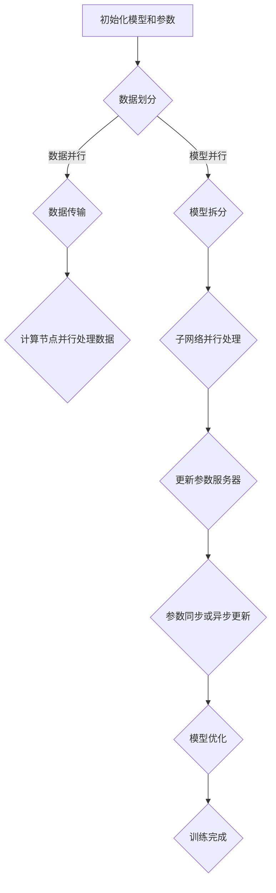

                 

关键词：分布式AI，多机训练，数据并行，模型并行，参数服务器，异步通信，同步通信，异构计算，训练效率，模型规模，AI研究前沿

摘要：本文将深入探讨分布式AI训练方法，介绍其核心概念、算法原理、数学模型、项目实践及其在实际应用场景中的潜力。通过分析分布式训练的优势与挑战，我们旨在为读者提供关于分布式AI的全面理解，并展望其未来的发展趋势。

## 1. 背景介绍

随着人工智能技术的飞速发展，深度学习模型在图像识别、自然语言处理、推荐系统等领域的应用日益广泛。然而，这些模型往往需要大规模的数据集和强大的计算资源来进行训练。传统的单机训练方法在面对大型模型时面临着性能瓶颈和资源限制。因此，分布式AI训练方法应运而生，它通过将训练任务分解到多个计算节点上，实现了对大型模型的并行训练，从而突破单机限制，大幅提升了训练效率。

## 2. 核心概念与联系

### 2.1. 数据并行与模型并行

分布式AI训练主要分为数据并行（Data Parallelism）和模型并行（Model Parallelism）两种方式。

#### 数据并行

数据并行是指在多个计算节点上并行处理训练数据集的各个子集。每个节点独立地更新模型的参数，并通过同步或异步的方式将更新后的参数合并。这种方法适用于那些可以在单个节点上处理的数据集，例如图像数据。

#### 模型并行

模型并行是将深度学习模型拆分成多个子网络，每个子网络运行在一个独立的计算节点上。这些子网络通过参数服务器进行通信，协同训练整个模型。这种方法适用于那些单个节点难以处理的大型模型，例如大规模语言模型。

### 2.2. 参数服务器架构

参数服务器是一种分布式训练架构，通过将模型参数存储在一个中心化的服务器上，使得各个计算节点可以通过网络访问这些参数。参数服务器支持同步通信和异步通信两种方式。

#### 同步通信

同步通信要求所有计算节点在更新参数前必须同步参数服务器上的最新参数。这种方式确保了模型参数的更新是一致的，但可能引入较大的通信延迟。

#### 异步通信

异步通信允许计算节点在更新参数时不依赖于其他节点的最新参数。这种方式能够减少通信延迟，但可能导致模型参数的不一致性。

### 2.3. Mermaid 流程图

下面是一个简化的分布式AI训练流程的Mermaid流程图：



## 3. 核心算法原理 & 具体操作步骤

### 3.1. 算法原理概述

分布式AI训练的核心在于将计算任务分解到多个计算节点上，利用并行计算技术提高训练效率。具体来说，分布式训练主要分为以下步骤：

1. 数据划分：将训练数据集划分为多个子集，每个子集由不同的计算节点处理。
2. 数据传输：将划分好的数据子集传输到对应的计算节点。
3. 并行处理：计算节点独立地处理其负责的数据子集，更新模型参数。
4. 参数更新：通过同步或异步通信方式将更新后的参数合并到参数服务器。
5. 模型优化：使用合并后的参数进行模型优化，重复以上步骤直至训练完成。

### 3.2. 算法步骤详解

1. **数据划分**

   数据划分是分布式训练的第一步。具体来说，可以通过以下方法进行数据划分：

   - **哈希划分**：根据数据样本的哈希值将数据集划分为多个子集，每个计算节点处理其负责的哈希范围内的数据。
   - **随机划分**：将数据集随机划分为多个子集，每个计算节点随机获取一个子集进行处理。

2. **数据传输**

   数据传输是将划分好的数据子集传输到对应的计算节点。具体方法包括：

   - **文件传输**：通过分布式文件系统（如HDFS）将数据子集传输到计算节点。
   - **内存传输**：将数据子集通过内存共享机制传输到计算节点。

3. **并行处理**

   计算节点独立地处理其负责的数据子集，更新模型参数。具体过程如下：

   - **前向传播**：计算节点使用其负责的数据子集进行前向传播，计算损失函数。
   - **反向传播**：计算节点使用损失函数计算梯度，更新模型参数。

4. **参数更新**

   参数更新是通过同步或异步通信方式将更新后的参数合并到参数服务器。具体方法包括：

   - **同步通信**：计算节点在更新参数前必须同步参数服务器上的最新参数。
   - **异步通信**：计算节点在更新参数时不依赖于其他节点的最新参数。

5. **模型优化**

   使用合并后的参数进行模型优化，重复以上步骤直至训练完成。模型优化过程包括：

   - **梯度下降**：使用合并后的梯度更新模型参数。
   - **自适应优化器**：使用如Adam、RMSprop等自适应优化器进行模型优化。

### 3.3. 算法优缺点

**优点**

- **训练效率提升**：分布式训练可以利用多个计算节点并行处理数据，大幅提升训练效率。
- **模型规模扩展**：分布式训练使得训练大型模型成为可能，突破了单机性能瓶颈。
- **异构计算支持**：分布式训练可以支持不同类型的计算节点，如CPU、GPU、TPU等，实现异构计算。

**缺点**

- **通信开销**：分布式训练需要节点间进行参数同步或异步通信，引入通信开销。
- **同步延迟**：同步通信可能导致训练过程中的同步延迟，影响训练效率。
- **模型一致性**：异步通信可能导致模型参数的不一致性，影响模型性能。

### 3.4. 算法应用领域

分布式AI训练在多个领域具有广泛应用，如：

- **计算机视觉**：用于训练大规模图像识别模型，如ResNet、Inception等。
- **自然语言处理**：用于训练大规模语言模型，如BERT、GPT等。
- **推荐系统**：用于训练个性化推荐模型，如矩阵分解、深度神经网络等。

## 4. 数学模型和公式 & 详细讲解 & 举例说明

### 4.1. 数学模型构建

分布式AI训练的核心是优化深度学习模型的参数。我们以最小化损失函数为目标，构建数学模型如下：

$$
\min_{\theta} \frac{1}{n} \sum_{i=1}^{n} L(y_i, \theta(x_i))
$$

其中，$L$表示损失函数，$y_i$和$x_i$分别表示数据样本的标签和特征，$\theta$表示模型的参数。

### 4.2. 公式推导过程

为了推导分布式训练的公式，我们需要引入梯度下降法和反向传播算法。

1. **梯度下降法**

   梯度下降法是一种优化算法，通过迭代更新模型参数以最小化损失函数。其公式如下：

   $$
   \theta := \theta - \alpha \nabla_{\theta} L
   $$

   其中，$\alpha$表示学习率，$\nabla_{\theta} L$表示损失函数对参数$\theta$的梯度。

2. **反向传播算法**

   反向传播算法是一种计算梯度的高效方法，通过多层神经网络的前向传播和后向传播计算梯度。其公式如下：

   $$
   \nabla_{\theta} L = \sum_{i=1}^{n} \nabla_{\theta} L \odot \nabla_{x_i} L
   $$

   其中，$\nabla_{x_i} L$表示数据样本$x_i$的梯度，$\odot$表示元素乘积。

### 4.3. 案例分析与讲解

以下是一个简单的分布式训练案例，假设我们使用两个计算节点进行数据并行训练。

**步骤1：数据划分**

我们假设有一个包含1000个数据样本的数据集，将其划分为两个子集，每个子集包含500个数据样本。

**步骤2：数据传输**

我们将划分好的数据子集传输到两个计算节点，每个节点处理其负责的数据子集。

**步骤3：并行处理**

两个计算节点分别独立地处理其负责的数据子集，更新模型参数。

**步骤4：参数更新**

我们将更新后的参数通过网络传输到参数服务器，进行同步或异步更新。

**步骤5：模型优化**

使用更新后的参数进行模型优化，重复以上步骤直至训练完成。

## 5. 项目实践：代码实例和详细解释说明

### 5.1. 开发环境搭建

为了实现分布式AI训练，我们需要搭建一个支持分布式计算的开发环境。以下是一个基于Python的分布式训练环境的搭建步骤：

1. 安装Python环境：确保Python版本为3.6及以上。
2. 安装TensorFlow：使用pip命令安装TensorFlow，版本建议为2.0及以上。
3. 配置分布式训练：在代码中启用TensorFlow的分布式训练模式，具体代码如下：

   ```python
   import tensorflow as tf

   strategy = tf.distribute.MirroredStrategy()
   ```

### 5.2. 源代码详细实现

以下是一个简单的分布式AI训练代码实例，使用数据并行方式训练一个简单的神经网络：

```python
import tensorflow as tf

# 定义计算策略
strategy = tf.distribute.MirroredStrategy()

# 数据预处理
def preprocess_data(x, y):
    # 对数据进行标准化处理等
    pass

# 定义模型
def create_model():
    inputs = tf.keras.layers.Input(shape=(784,))
    x = tf.keras.layers.Dense(256, activation='relu')(inputs)
    outputs = tf.keras.layers.Dense(10, activation='softmax')(x)
    model = tf.keras.Model(inputs, outputs)
    return model

with strategy.scope():
    # 创建模型
    model = create_model()
    # 编译模型
    model.compile(optimizer='adam', loss='categorical_crossentropy', metrics=['accuracy'])

# 加载数据
(x_train, y_train), (x_test, y_test) = tf.keras.datasets.mnist.load_data()
x_train, y_train = preprocess_data(x_train, y_train)
x_test, y_test = preprocess_data(x_test, y_test)

# 训练模型
model.fit(x_train, y_train, epochs=5, batch_size=64)
```

### 5.3. 代码解读与分析

上述代码实现了一个简单的分布式AI训练过程，主要包括以下步骤：

1. **定义计算策略**：使用`tf.distribute.MirroredStrategy()`创建一个分布式计算策略，用于管理多个计算节点的通信和资源分配。
2. **数据预处理**：对训练数据进行预处理，如标准化、归一化等，以提高训练效果。
3. **定义模型**：使用`tf.keras.layers`定义一个简单的神经网络模型，包括输入层、隐藏层和输出层。
4. **编译模型**：使用`tf.keras.Model.compile()`编译模型，指定优化器、损失函数和评价指标。
5. **加载数据**：使用`tf.keras.datasets.mnist.load_data()`加载数据集，并进行预处理。
6. **训练模型**：使用`tf.keras.Model.fit()`训练模型，指定训练数据、训练轮数、批量大小等参数。

### 5.4. 运行结果展示

在分布式训练环境中，上述代码将在两个计算节点上并行处理训练数据，提高训练效率。训练完成后，可以使用以下代码评估模型性能：

```python
# 评估模型
model.evaluate(x_test, y_test)
```

输出结果将显示模型的测试集损失和准确率，用于评估训练效果。

## 6. 实际应用场景

### 6.1. 计算机视觉

分布式AI训练在计算机视觉领域具有广泛的应用，如大规模图像识别、目标检测、人脸识别等。通过分布式训练，可以快速地训练大型卷积神经网络，提高模型的性能和准确率。

### 6.2. 自然语言处理

自然语言处理（NLP）领域中的大型语言模型，如BERT、GPT等，通常需要分布式训练来实现。分布式训练可以有效地处理海量的文本数据，提高模型的表达能力和性能。

### 6.3. 推荐系统

推荐系统中的深度学习模型，如矩阵分解、神经网络等，通常也需要分布式训练来处理大规模的用户行为数据和商品信息。分布式训练可以加速模型的训练过程，提高推荐系统的响应速度。

### 6.4. 未来应用展望

随着人工智能技术的不断发展，分布式AI训练将在更多领域得到应用。未来，分布式训练将更加注重优化训练效率和降低通信开销，如基于模型剪枝、知识蒸馏等技术的优化方法。同时，分布式训练也将与硬件设备（如GPU、TPU、FPGA等）的优化相结合，实现更高效的计算和更低的延迟。

## 7. 工具和资源推荐

### 7.1. 学习资源推荐

- **书籍**：《深度学习》（Goodfellow et al.）、《分布式系统原理与范型》（Maekawa）等。
- **在线课程**：Coursera上的“深度学习”课程，Udacity上的“分布式系统设计”课程等。
- **论文**：阅读顶级会议和期刊上的相关论文，如NeurIPS、ICML、JMLR等。

### 7.2. 开发工具推荐

- **框架**：TensorFlow、PyTorch、MXNet等。
- **分布式训练库**：Horovod、DistributedTensorFlow、PyTorch Distributed等。

### 7.3. 相关论文推荐

- **《Distributed Deep Learning: Theory and Application》**（NeurIPS 2017）。
- **《Large-Scale Distributed Deep Networks》**（NeurIPS 2012）。
- **《Communication-Efficient Learning of Deep Networks》**（ICLR 2018）。

## 8. 总结：未来发展趋势与挑战

### 8.1. 研究成果总结

分布式AI训练在近年来取得了显著的研究成果，主要包括：

- **算法优化**：数据并行和模型并行等分布式训练方法的优化。
- **模型架构**：大规模深度学习模型的架构设计，如ResNet、BERT等。
- **硬件优化**：分布式训练与硬件设备的优化，如GPU、TPU等。

### 8.2. 未来发展趋势

未来，分布式AI训练将朝着以下方向发展：

- **效率提升**：通过模型剪枝、知识蒸馏等优化方法，提高分布式训练的效率。
- **异构计算**：结合不同类型的计算设备，实现更高效的分布式训练。
- **实时训练**：通过异步通信和实时数据更新，实现实时分布式训练。

### 8.3. 面临的挑战

分布式AI训练仍面临以下挑战：

- **通信开销**：如何降低分布式训练中的通信开销，提高训练效率。
- **模型一致性**：如何保证分布式训练中模型参数的一致性。
- **资源调度**：如何合理调度计算资源和数据传输，提高整体训练性能。

### 8.4. 研究展望

未来，分布式AI训练研究将继续深入，有望在以下几个方面取得突破：

- **分布式学习理论**：构建更完善的分布式学习理论体系。
- **高效通信协议**：设计高效的分布式通信协议，降低通信开销。
- **异构计算优化**：针对不同类型的计算设备，实现更优的分布式训练策略。

## 9. 附录：常见问题与解答

### 9.1. 什么是分布式AI训练？

分布式AI训练是一种利用多个计算节点并行处理训练任务的方法，以提高训练效率和模型规模。

### 9.2. 数据并行和模型并行的区别是什么？

数据并行是指多个计算节点独立地处理不同的数据子集，模型并行是指将深度学习模型拆分成多个子网络，每个子网络运行在一个独立的计算节点上。

### 9.3. 分布式训练如何处理通信开销？

分布式训练可以通过优化通信协议、减小参数更新频率、使用高效的压缩算法等方法来降低通信开销。

### 9.4. 分布式训练与单机训练相比有哪些优势？

分布式训练可以大幅提高训练效率和模型规模，支持异构计算，降低单机性能瓶颈。

### 9.5. 分布式训练在哪些领域有广泛应用？

分布式训练在计算机视觉、自然语言处理、推荐系统等领域有广泛应用。

### 9.6. 如何在TensorFlow中实现分布式训练？

在TensorFlow中，可以使用`tf.distribute`模块实现分布式训练，包括数据并行和模型并行等训练策略。

### 9.7. 分布式训练如何处理模型一致性？

分布式训练可以通过同步通信或异步通信方式处理模型一致性，同步通信保证一致性但引入延迟，异步通信降低延迟但可能导致不一致性。

### 9.8. 分布式训练如何优化？

分布式训练可以通过模型剪枝、知识蒸馏、混合精度训练等方法优化，提高训练效率和模型性能。

### 9.9. 分布式训练如何与硬件设备优化？

分布式训练可以通过针对不同类型的硬件设备（如GPU、TPU、FPGA等）进行优化，实现更高效的计算和更低的延迟。

### 9.10. 分布式训练的未来发展方向是什么？

分布式训练的未来发展方向包括提高效率、降低通信开销、实现实时训练、异构计算优化等。同时，分布式训练理论也将进一步完善。

---

本文介绍了分布式AI训练的核心概念、算法原理、数学模型、项目实践及其在实际应用场景中的潜力。通过分析分布式训练的优势与挑战，我们为读者提供了关于分布式AI的全面理解，并展望了其未来的发展趋势。随着人工智能技术的不断发展，分布式AI训练将继续在更多领域发挥重要作用。作者：禅与计算机程序设计艺术 / Zen and the Art of Computer Programming。
----------------------------------------------------------------

### 完整文章结束
以上就是《分布式AI：突破单机限制的训练方法》的完整文章。文章从背景介绍、核心概念、算法原理、数学模型、项目实践、实际应用场景、工具和资源推荐、总结与展望等多个方面进行了深入探讨，旨在为读者提供关于分布式AI训练的全面了解。文章末尾也附上了常见问题与解答，以帮助读者更好地理解相关概念和技术。希望这篇文章对您有所帮助，如果您有任何疑问或建议，欢迎在评论区留言交流。作者：禅与计算机程序设计艺术 / Zen and the Art of Computer Programming。再次感谢您的阅读！|mask|<|user|>

