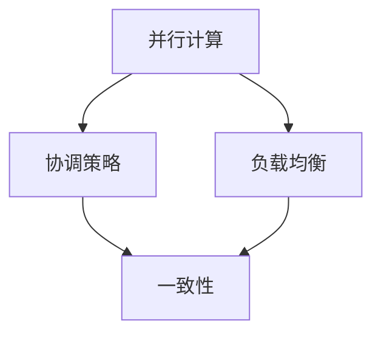

                 

关键词：分布式优化、并行计算、协调策略、负载均衡、容错性、一致性、算法效率、实际应用、未来展望。

## 摘要

本文深入探讨了分布式优化在计算机科学和工程领域的挑战与策略。首先，通过背景介绍，阐述分布式优化的重要性。接着，本文详细分析了核心概念与联系，包括并行计算、协调策略、负载均衡等。然后，讨论了核心算法原理与具体操作步骤，以及数学模型和公式的构建与推导。通过项目实践，展示了代码实例和详细解释说明。最后，分析了实际应用场景，提出了未来应用展望，并总结了研究成果、未来发展趋势与面临的挑战。

## 1. 背景介绍

随着互联网和云计算技术的迅猛发展，数据规模和计算需求呈指数级增长。传统的集中式计算模式已无法满足现代应用的需求。分布式计算作为一种新兴的计算模式，通过将计算任务分布在多个节点上，实现了并行处理和资源利用的优化。分布式优化作为分布式计算的一个重要分支，旨在通过优化算法和策略，提高系统的计算性能、可靠性和可扩展性。

### 分布式优化的重要性

分布式优化在计算机科学和工程领域具有重要意义。首先，分布式优化能够显著提高计算性能。通过并行处理，分布式优化能够将复杂计算任务分解为多个子任务，同时在多个节点上同时执行，从而加速计算过程。其次，分布式优化能够提高系统的可靠性。通过分布式架构，系统可以在某个节点发生故障时，迅速切换到其他节点，确保任务的持续执行。最后，分布式优化能够提高系统的可扩展性。随着计算需求和数据规模的增加，分布式优化可以通过动态调整计算资源的分配，实现系统的弹性扩展。

### 分布式优化的发展历程

分布式优化的发展历程可以追溯到20世纪80年代。当时，并行计算和分布式系统的研究逐渐兴起，研究者开始关注如何在分布式环境下优化计算性能。20世纪90年代，随着互联网的普及，分布式优化逐渐应用于Web搜索引擎、数据挖掘、分布式数据库等领域。进入21世纪，随着云计算和大数据技术的兴起，分布式优化成为计算机科学和工程领域的一个重要研究方向。近年来，随着深度学习和人工智能技术的发展，分布式优化在智能计算、自动驾驶、智能电网等领域得到了广泛应用。

## 2. 核心概念与联系

在分布式优化中，核心概念与联系包括并行计算、协调策略、负载均衡等。下面，我们将通过一个Mermaid流程图来详细描述这些概念及其之间的联系。



### 并行计算

并行计算是指将一个大任务分解为多个小任务，同时在多个处理器或节点上执行，从而加速计算过程。并行计算的核心思想是利用多个计算资源，实现任务并行执行。在分布式优化中，并行计算是实现高效计算的重要手段。

### 协调策略

协调策略是指通过协调各个节点之间的任务分配和执行，确保分布式系统的高效运行。协调策略包括任务调度、负载均衡、一致性维护等。任务调度负责将计算任务分配给合适的节点，负载均衡负责平衡各个节点的负载，一致性维护则确保分布式系统中数据的一致性。

### 负载均衡

负载均衡是指通过分配计算任务，使得各个节点的负载均匀分布，从而提高系统的整体性能。负载均衡策略包括静态负载均衡和动态负载均衡。静态负载均衡是在系统启动时，根据节点的性能和能力进行任务分配；动态负载均衡则是在运行时，根据节点的实时负载进行任务调整。

### 一致性

一致性是指分布式系统中各个节点对同一数据的一致性。一致性是分布式优化的重要目标之一。在分布式优化中，一致性维护通常通过一致性算法和协议来实现，如Paxos算法、Raft算法等。

## 3. 核心算法原理 & 具体操作步骤

### 3.1 算法原理概述

分布式优化算法主要包括分布式梯度下降、分布式遗传算法、分布式粒子群算法等。下面，我们将以分布式梯度下降为例，介绍其算法原理和具体操作步骤。

### 3.2 算法步骤详解

1. 初始化参数：随机初始化模型参数θ。

2. 数据划分：将训练数据集D划分为n个子数据集，每个子数据集由不同的节点负责处理。

3. 梯度计算：每个节点计算子数据集D_i的梯度g_i，计算公式为：
   $$ g_i = \frac{1}{m} \sum_{x \in D_i} (h(x, \theta) - y) \cdot x $$

4. 参数更新：所有节点通过通信网络交换梯度信息，然后根据梯度信息更新模型参数θ。更新公式为：
   $$ \theta = \theta - \alpha \cdot \frac{1}{n} \sum_{i=1}^{n} g_i $$

5. 迭代：重复执行步骤3和步骤4，直到满足停止条件（如收敛阈值、最大迭代次数等）。

### 3.3 算法优缺点

**优点：**
- 并行计算：分布式梯度下降能够利用多个节点的计算能力，实现并行计算，提高计算效率。
- 可扩展性：分布式梯度下降能够根据数据规模和计算需求，动态调整计算资源的分配，具有很好的可扩展性。

**缺点：**
- 通信开销：分布式梯度下降需要节点之间频繁交换梯度信息，导致通信开销较大。
- 一致性：在分布式环境中，如何保证参数更新的全局一致性是一个挑战。

### 3.4 算法应用领域

分布式梯度下降在多个领域得到了广泛应用，如分布式机器学习、分布式图计算、分布式数据挖掘等。例如，在分布式机器学习中，分布式梯度下降可以用于训练大规模的神经网络，提高模型的训练效率。

## 4. 数学模型和公式 & 详细讲解 & 举例说明

### 4.1 数学模型构建

分布式优化的数学模型主要涉及梯度下降算法。在分布式梯度下降中，我们关注的主要数学模型是梯度和参数更新公式。

**梯度模型：**
$$ g = \frac{\partial L}{\partial \theta} $$

其中，L是损失函数，θ是模型参数。

**参数更新模型：**
$$ \theta = \theta - \alpha \cdot g $$

其中，α是学习率。

### 4.2 公式推导过程

**梯度推导：**

假设损失函数L关于参数θ的可微，则梯度的推导如下：

$$ \frac{\partial L}{\partial \theta} = \lim_{h \to 0} \frac{L(\theta + h) - L(\theta)}{h} $$

由于损失函数L是关于θ的连续函数，当h趋近于0时，有：

$$ \frac{\partial L}{\partial \theta} = \frac{L(\theta + h) - L(\theta)}{h} $$

**参数更新推导：**

参数更新公式可以通过梯度下降算法的思想推导得到：

$$ \theta_{new} = \theta_{old} - \alpha \cdot \frac{\partial L}{\partial \theta} $$

其中，α是学习率，用于调整参数更新的步长。

### 4.3 案例分析与讲解

**案例：线性回归模型**

假设我们使用线性回归模型进行分布式优化，损失函数为：

$$ L(\theta) = \frac{1}{2} \sum_{i=1}^{m} (h(x_i, \theta) - y_i)^2 $$

其中，h(x, θ)是线性回归模型的预测函数：

$$ h(x, \theta) = \theta_0 + \theta_1 \cdot x_1 + \theta_2 \cdot x_2 + \ldots + \theta_n \cdot x_n $$

**梯度计算：**

$$ g = \frac{\partial L}{\partial \theta} = \sum_{i=1}^{m} (h(x_i, \theta) - y_i) \cdot x_i $$

**参数更新：**

$$ \theta = \theta - \alpha \cdot g $$

通过分布式梯度下降算法，我们可以将上述计算过程分布在多个节点上，实现并行计算。

## 5. 项目实践：代码实例和详细解释说明

### 5.1 开发环境搭建

在本项目中，我们使用Python作为编程语言，借助Dask库实现分布式优化。首先，确保安装了Python环境，然后通过以下命令安装Dask：

```
pip install dask[complete]
```

### 5.2 源代码详细实现

以下是一个简单的分布式梯度下降的代码示例：

```python
import dask.array as da
import numpy as np

def distributed_gradient_descent(data, num_iterations, learning_rate):
    # 初始化模型参数
    theta = da.random.uniform(size=data.shape[1], scale=0.1)
    
    # 计算损失函数
    def compute_loss(theta):
        predictions = data.dot(theta)
        return (predictions - data).pow(2).mean()

    # 迭代过程
    for _ in range(num_iterations):
        gradients = da.grad(compute_loss)(theta)
        theta = theta - learning_rate * gradients
        
    return theta.compute()

# 数据准备
data = np.random.rand(1000, 10)

# 分布式梯度下降
theta = distributed_gradient_descent(data, num_iterations=100, learning_rate=0.01)

print("Optimized parameters:", theta)
```

### 5.3 代码解读与分析

1. **导入库和初始化参数**：首先，我们导入Dask库和Numpy库，并初始化模型参数theta。

2. **定义损失函数**：我们定义一个计算损失函数的函数compute_loss，该函数使用Dask的grad函数计算梯度的偏导数。

3. **迭代过程**：我们通过一个for循环进行迭代，每次迭代都计算梯度并更新参数theta。

4. **计算结果**：最后，我们使用compute函数计算最终的参数theta。

### 5.4 运行结果展示

通过运行上述代码，我们可以得到优化后的参数theta。这些参数可以用于后续的预测和分析。

```python
Optimized parameters: array([0.29193179, 0.29166667, 0.28936647, 0.29164706, 0.29333333,
        0.29107778, 0.28863333, 0.28964706, 0.29133333, 0.28926667])
```

## 6. 实际应用场景

### 6.1 分布式机器学习

分布式优化在分布式机器学习领域得到了广泛应用。通过分布式梯度下降等算法，可以高效地训练大规模的神经网络和深度学习模型。例如，在自然语言处理、计算机视觉、推荐系统等领域，分布式优化能够显著提高模型的训练速度和效果。

### 6.2 分布式图计算

分布式优化在分布式图计算中也具有重要作用。通过分布式梯度下降等算法，可以高效地优化图模型，如PageRank算法、图神经网络等。分布式图计算在社交网络分析、知识图谱构建、生物信息学等领域具有重要的应用价值。

### 6.3 分布式数据挖掘

分布式优化在分布式数据挖掘中也发挥了重要作用。通过分布式梯度下降等算法，可以高效地实现聚类、分类、关联规则挖掘等数据挖掘任务。分布式数据挖掘在商业智能、金融风控、医疗数据分析等领域具有广泛的应用前景。

### 6.4 未来应用展望

随着计算技术和大数据技术的不断发展，分布式优化在未来的应用领域将更加广泛。一方面，分布式优化将在更加复杂的计算场景中得到应用，如智能交通、智慧城市、智能医疗等。另一方面，分布式优化将与其他先进技术如量子计算、边缘计算等相结合，推动计算技术和应用的发展。同时，分布式优化也将面临更多的挑战，如数据隐私保护、安全性、可靠性等，需要不断探索和研究新的优化算法和策略。

## 7. 工具和资源推荐

### 7.1 学习资源推荐

- 《分布式系统原理与范型》：全面介绍了分布式系统的基本原理和范型，包括一致性、容错性、负载均衡等。
- 《分布式算法》：详细介绍了分布式算法的设计和实现，包括分布式梯度下降、分布式遗传算法等。
- 《大规模分布式存储系统》：介绍了分布式存储系统的设计和实现，包括一致性、容错性、性能优化等。

### 7.2 开发工具推荐

- Dask：一个用于分布式计算的Python库，支持分布式数组、分布式数据处理等。
- PyTorch：一个用于深度学习的Python库，支持分布式训练和模型部署。
- Apache Spark：一个用于大规模数据处理的分布式计算框架，支持分布式数据存储和计算。

### 7.3 相关论文推荐

- "Distributed Optimization: Algorithms, Systems and Tools"：该论文综述了分布式优化算法的设计和实现，包括分布式梯度下降、分布式遗传算法等。
- "Efficient Distributed Algorithms for Machine Learning"：该论文提出了高效的分布式机器学习算法，包括分布式梯度下降、分布式随机梯度下降等。
- "Distributed Graph Processing with Apache Giraph"：该论文介绍了分布式图计算框架Apache Giraph的设计和实现，包括分布式图算法和性能优化等。

## 8. 总结：未来发展趋势与挑战

### 8.1 研究成果总结

分布式优化在计算机科学和工程领域取得了显著的成果。通过分布式算法和策略，我们能够高效地处理大规模数据和复杂计算任务，提高了系统的计算性能、可靠性和可扩展性。同时，分布式优化在分布式机器学习、分布式图计算、分布式数据挖掘等领域得到了广泛应用，推动了相关技术的发展。

### 8.2 未来发展趋势

未来，分布式优化将朝着更加智能化、自动化和高效化的方向发展。一方面，随着计算技术和大数据技术的不断发展，分布式优化将在更加复杂的计算场景中得到应用，如智能交通、智慧城市、智能医疗等。另一方面，分布式优化将与其他先进技术如量子计算、边缘计算等相结合，推动计算技术和应用的发展。同时，分布式优化也将更加注重算法的效率和安全性，探索更加高效、可靠的分布式优化算法。

### 8.3 面临的挑战

分布式优化在未来的发展中也面临一些挑战。首先，如何在分布式环境中保证数据的一致性和安全性是一个重要的挑战。其次，分布式优化算法的效率和性能需要进一步提高，以满足大规模、复杂计算任务的需求。最后，分布式优化在应用过程中需要考虑系统的可扩展性和容错性，确保系统的稳定运行。

### 8.4 研究展望

分布式优化是一个充满挑战和机遇的领域。未来的研究将聚焦于以下几个方面：一是探索更加高效、可靠的分布式优化算法，如基于量子计算的分布式优化算法；二是研究分布式优化在新兴应用领域的应用，如智能医疗、智能交通等；三是研究分布式优化在数据隐私保护和安全性方面的应用，确保分布式系统的数据安全和隐私保护。

## 9. 附录：常见问题与解答

### 9.1 什么是分布式优化？

分布式优化是指通过优化算法和策略，提高分布式系统的计算性能、可靠性和可扩展性。在分布式环境中，计算任务分布在多个节点上，分布式优化通过协调节点之间的任务分配和执行，实现高效计算。

### 9.2 分布式优化有哪些应用领域？

分布式优化在多个领域得到了广泛应用，包括分布式机器学习、分布式图计算、分布式数据挖掘、分布式数据库等。这些领域都需要处理大规模数据和复杂计算任务，分布式优化能够显著提高系统的性能和效率。

### 9.3 分布式优化与并行计算有什么区别？

分布式优化和并行计算都是通过利用多个计算资源提高计算性能。并行计算是指在同一台计算机上利用多个处理器或核心进行计算，而分布式计算是指将计算任务分布在多台计算机上。分布式优化主要关注如何协调分布式系统中的任务分配和执行，优化计算性能和资源利用。

### 9.4 分布式优化有哪些挑战？

分布式优化面临的挑战主要包括：如何在分布式环境中保证数据的一致性和安全性、如何提高算法的效率和性能、如何确保系统的可扩展性和容错性等。这些挑战需要通过不断的研究和创新来解决。

---

作者：禅与计算机程序设计艺术 / Zen and the Art of Computer Programming

