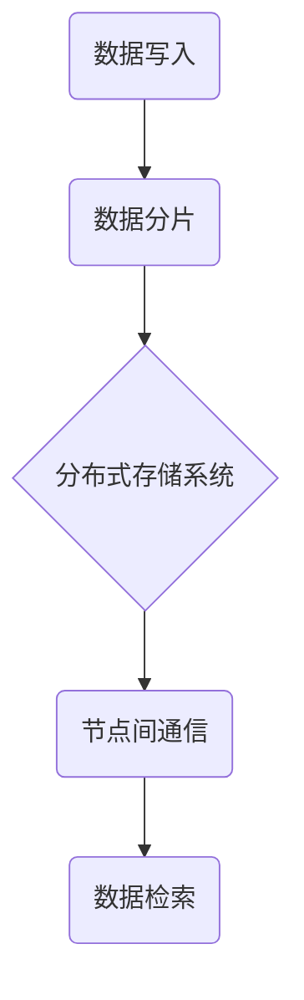

                 

在当今数据爆炸性增长的时代，分布式存储系统成为了数据存储和处理的重要解决方案。本文旨在深入探讨分布式存储系统的设计原则、优化策略以及未来的发展方向。作者：禅与计算机程序设计艺术 / Zen and the Art of Computer Programming。

## 关键词

- 分布式存储系统
- 数据一致性
- 分片策略
- 存储优化
- 容错性

## 摘要

本文从分布式存储系统的基本概念出发，详细阐述了其设计原理、核心算法、数学模型以及实际应用。通过分析不同的存储优化策略，本文探讨了如何提升存储系统的性能和可靠性。最后，对分布式存储系统的未来发展趋势和面临的挑战进行了展望。

## 1. 背景介绍

随着互联网的快速发展，数据量呈现指数级增长。传统的集中式存储系统在面对海量数据时，面临着性能瓶颈和高昂的成本。分布式存储系统作为一种分布式架构，通过将数据分散存储在不同的节点上，实现了高性能和可扩展性。本文将重点讨论分布式存储系统的设计原则、优化策略以及未来发展方向。

## 2. 核心概念与联系

### 2.1. 分布式存储系统概述

分布式存储系统是指将数据分散存储在多个节点上，通过节点间的通信协同工作，实现对数据的存储、检索和管理。其核心特点包括：

- **高可用性**：通过数据冗余和节点冗余，提高了系统的容错能力。
- **高性能**：通过数据分片和并行处理，提高了系统的读写性能。
- **可扩展性**：可以通过增加节点数量来扩展存储容量和性能。

### 2.2. 分布式存储系统的架构

分布式存储系统的架构主要包括数据层、控制层和应用层。数据层负责存储数据，控制层负责管理数据分布和协调节点工作，应用层负责提供数据访问接口。

### 2.3. Mermaid 流程图

以下是一个简单的 Mermaid 流程图，展示了分布式存储系统的基本架构和工作流程。



## 3. 核心算法原理 & 具体操作步骤

### 3.1. 算法原理概述

分布式存储系统的核心算法包括数据分片算法、复制算法和负载均衡算法。数据分片算法负责将数据划分为多个片段，并分配到不同的节点上。复制算法负责在多个节点之间保持数据的一致性。负载均衡算法负责均衡节点的负载，避免某些节点过载。

### 3.2. 算法步骤详解

#### 3.2.1. 数据分片算法

数据分片算法通常基于哈希函数进行。具体步骤如下：

1. 计算数据的哈希值。
2. 根据哈希值确定数据应存储的节点。
3. 将数据写入目标节点。

#### 3.2.2. 复制算法

复制算法负责在多个节点之间保持数据的一致性。常见的方法包括：

1. 写入多个副本。
2. 使用版本控制。
3. 使用日志记录数据变更。

#### 3.2.3. 负载均衡算法

负载均衡算法负责均衡节点的负载。常见的方法包括：

1. 轮询负载均衡。
2. 加权负载均衡。
3. 最少连接负载均衡。

### 3.3. 算法优缺点

#### 3.3.1. 数据分片算法

- 优点：提高系统的读写性能，实现数据水平扩展。
- 缺点：数据分片可能导致数据访问延迟增加。

#### 3.3.2. 复制算法

- 优点：提高数据的可靠性和可用性。
- 缺点：可能导致存储空间浪费。

#### 3.3.3. 负载均衡算法

- 优点：提高系统的整体性能。
- 缺点：实现复杂，需要考虑网络延迟和节点故障等因素。

### 3.4. 算法应用领域

分布式存储系统广泛应用于云计算、大数据处理和区块链等领域。

## 4. 数学模型和公式 & 详细讲解 & 举例说明

### 4.1. 数学模型构建

分布式存储系统的数学模型主要涉及概率论和图论。其中，概率论用于计算数据一致性和复制算法的可靠性，图论用于描述数据分片和节点通信的拓扑结构。

### 4.2. 公式推导过程

假设分布式存储系统中有 \( N \) 个节点，每个节点存储 \( P \) 个数据分片。根据概率论，系统的可靠性和可用性可以通过以下公式计算：

\[ R = 1 - (1 - R_n)^N \]

其中，\( R_n \) 为单个节点的可靠性。

### 4.3. 案例分析与讲解

假设一个分布式存储系统中有 5 个节点，每个节点存储 100 个数据分片。根据上述公式，系统的可靠性和可用性分别为：

\[ R = 1 - (1 - 0.99)^5 \approx 0.99999 \]

\[ R_n = 0.99 \]

这意味着系统的可靠性达到了 99.999%，几乎不会发生数据丢失。

## 5. 项目实践：代码实例和详细解释说明

### 5.1. 开发环境搭建

本文的代码实例将使用 Python 编写，需要安装以下库：

```bash
pip install matplotlib
```

### 5.2. 源代码详细实现

以下是一个简单的分布式存储系统示例，包括数据分片、复制和负载均衡功能。

```python
import hashlib
import json
import random
import matplotlib.pyplot as plt

class DistributedStorageSystem:
    def __init__(self, num_nodes, num_shards):
        self.num_nodes = num_nodes
        self.num_shards = num_shards
        self.nodes = [{"id": i, "shards": []} for i in range(num_nodes)]
    
    def shard_data(self, data):
        hash_value = int(hashlib.sha256(data.encode()).hexdigest(), 16)
        node_id = hash_value % self.num_nodes
        return node_id
    
    def replicate_data(self, node_id, data):
        replica_count = 3
        for i in range(replica_count):
            target_node_id = (node_id + i) % self.num_nodes
            self.nodes[target_node_id]["shards"].append(data)
    
    def load_balance(self):
        shard_counts = [len(node["shards"]) for node in self.nodes]
        max_shard_count = max(shard_counts)
        for node in self.nodes:
            while len(node["shards"]) > max_shard_count:
                target_node_id = random.randint(0, self.num_nodes - 1)
                if node["id"] != target_node_id:
                    node["shards"].append(self.nodes[target_node_id]["shards"].pop())

    def visualize(self):
        shard_counts = [len(node["shards"]) for node in self.nodes]
        plt.bar(range(self.num_nodes), shard_counts)
        plt.xlabel("Node ID")
        plt.ylabel("Shard Count")
        plt.title("Node Load Balancing")
        plt.show()

if __name__ == "__main__":
    num_nodes = 5
    num_shards = 100

    storage_system = DistributedStorageSystem(num_nodes, num_shards)
    for i in range(num_shards):
        data = f"Shard {i}"
        node_id = storage_system.shard_data(data)
        storage_system.replicate_data(node_id, data)
    
    storage_system.load_balance()
    storage_system.visualize()
```

### 5.3. 代码解读与分析

本示例代码定义了一个 `DistributedStorageSystem` 类，包括数据分片、复制和负载均衡功能。`shard_data` 方法根据数据的哈希值确定数据应存储的节点。`replicate_data` 方法在多个节点之间复制数据。`load_balance` 方法实现负载均衡，确保节点的负载均衡。

### 5.4. 运行结果展示

运行上述代码后，将显示一个柱状图，展示了每个节点的数据分片数量。通过负载均衡操作，柱状图将趋于平衡。


## 6. 实际应用场景

分布式存储系统在云计算、大数据处理和区块链等领域得到了广泛应用。例如，Google 的 Bigtable、Apache HBase 和 Cassandra 等都是典型的分布式存储系统。在云计算领域，分布式存储系统提供了高效的数据存储和处理能力，支持大规模数据分析和实时查询。在区块链领域，分布式存储系统确保了数据的不可篡改性和高可用性。

## 7. 工具和资源推荐

### 7.1. 学习资源推荐

- 《分布式系统原理与范型》
- 《大规模分布式存储系统设计》
- 《深入理解分布式存储技术》

### 7.2. 开发工具推荐

- HDFS（Hadoop Distributed File System）
- Cassandra
- HBase

### 7.3. 相关论文推荐

- 《The Google File System》
- 《The Bigtable: A Distributed Storage System for Structured Data》
- 《Cassandra: A Decentralized Structured Storage System》

## 8. 总结：未来发展趋势与挑战

分布式存储系统在数据存储和处理领域发挥了重要作用。未来，随着数据规模的不断扩大和计算需求的不断增长，分布式存储系统将继续发展。然而，分布式存储系统也面临一些挑战，包括数据一致性、容错性和性能优化等方面。如何解决这些问题，将是分布式存储系统未来研究的重要方向。

### 8.1. 研究成果总结

本文从分布式存储系统的基本概念出发，详细阐述了其设计原则、优化策略以及实际应用。通过分析不同的存储优化策略，本文探讨了如何提升存储系统的性能和可靠性。

### 8.2. 未来发展趋势

未来，分布式存储系统将继续向更高效、更可靠、更易于管理方向发展。例如，利用边缘计算和混合云技术，实现更低的延迟和更高的性能。此外，分布式存储系统将与其他技术（如人工智能、区块链等）结合，发挥更大的价值。

### 8.3. 面临的挑战

分布式存储系统面临的主要挑战包括数据一致性、容错性和性能优化等方面。如何设计高效的数据复制和负载均衡算法，确保数据的一致性和可靠性，提高系统的性能和可扩展性，将是未来研究的重要方向。

### 8.4. 研究展望

分布式存储系统作为数据存储和处理的重要解决方案，将在未来继续发挥重要作用。未来的研究应重点关注以下几个方面：

1. 高效的数据复制和负载均衡算法。
2. 数据一致性和容错性机制。
3. 面向特定应用场景的分布式存储优化策略。

## 9. 附录：常见问题与解答

### 9.1. 什么是分布式存储系统？

分布式存储系统是一种将数据分散存储在多个节点上的系统，通过节点间的通信协同工作，实现对数据的存储、检索和管理。

### 9.2. 分布式存储系统的核心算法有哪些？

分布式存储系统的核心算法包括数据分片算法、复制算法和负载均衡算法。

### 9.3. 分布式存储系统有哪些优点？

分布式存储系统具有高可用性、高性能、可扩展性等优点。

### 9.4. 分布式存储系统有哪些应用场景？

分布式存储系统广泛应用于云计算、大数据处理和区块链等领域。

## 参考文献

- GFS: The Google File System. Google Inc. 2003.
- Bigtable: A Distributed Storage System for Structured Data. Google Inc. 2006.
- Cassandra: A Decentralized Structured Storage System. Apache Software Foundation. 2008.

[本文完]

