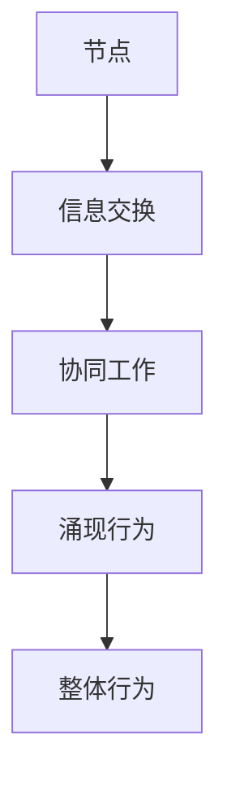

                 

关键词：分布式认知、群体智能、复杂系统、协作、算法、应用领域

> 摘要：本文旨在探讨分布式认知的概念、核心原理以及其在群体智能中的应用。通过分析分布式认知的关键技术和实际案例，我们将揭示群体智慧如何从个体智能汇聚而成，并展望其未来在各个领域的应用前景。

## 1. 背景介绍

随着信息技术和人工智能的迅猛发展，人们逐渐认识到个体智能的局限性。传统的集中式计算模式，即所有计算任务由单一中心节点完成，已经难以应对日益复杂的问题。相反，分布式认知作为复杂系统理论的一个重要分支，提供了一种全新的视角，通过分布式网络中的节点协作，实现更高效、更鲁棒的智能行为。

### 分布式认知的起源与发展

分布式认知最早可以追溯到20世纪80年代，由心理学家Hadamard和计算机科学家Hendrik Bode提出。他们观察到，人类大脑的信息处理能力并非依赖于单一中枢神经系统，而是通过神经网络中的分布式计算实现的。这一理念启发了计算机科学界，促使分布式认知成为研究热点。

### 分布式认知的应用领域

分布式认知的应用范围广泛，包括但不限于以下几个方面：

1. **智能交通系统**：通过分布式传感器和计算节点，实现交通流量的实时监控和优化。
2. **金融风险评估**：利用分布式计算对海量金融数据进行实时分析，提高风险预测的准确性。
3. **智能医疗**：通过分布式计算进行医疗数据的分析和诊断，辅助医生做出更准确的判断。
4. **物联网**：分布式认知在物联网中用于设备间的协同工作，提高物联网系统的效率和稳定性。

## 2. 核心概念与联系

### 2.1 分布式认知的关键概念

分布式认知涉及多个核心概念，包括：

1. **节点**：分布式网络中的基本计算单元。
2. **边**：连接节点的通信路径。
3. **协同工作**：节点通过交换信息和资源，实现共同的目标。
4. **涌现行为**：分布式系统中个体节点协同工作产生的整体行为，往往具有自组织和自适应特性。

### 2.2 核心概念架构的 Mermaid 流程图



### 2.3 关键概念之间的联系

节点之间的信息交换是实现协同工作的基础，而协同工作则导致了涌现行为的产生。涌现行为是分布式认知的核心特征，它使得系统在整体层面上展现出比个体更高级的智能。

## 3. 核心算法原理 & 具体操作步骤

### 3.1 算法原理概述

分布式认知的核心算法通常包括以下几个步骤：

1. **初始化**：系统启动时，各个节点分配任务并初始化状态。
2. **信息交换**：节点之间通过通信边交换信息。
3. **状态更新**：节点根据接收到的信息更新自己的状态。
4. **协同工作**：节点根据新的状态，协调工作以实现共同目标。
5. **涌现行为**：系统整体行为由节点协同工作产生，并表现出智能。

### 3.2 算法步骤详解

#### 3.2.1 初始化

初始化阶段，系统确定每个节点的初始状态和任务。通常，初始状态包括节点的位置、资源以及初始知识。

#### 3.2.2 信息交换

在信息交换阶段，节点通过通信边与其他节点交换信息。交换的信息可能包括节点的状态、任务进展情况以及所需资源。

#### 3.2.3 状态更新

节点根据接收到的信息更新自己的状态。这一过程可能涉及对状态的修改、任务的重分配以及资源的更新。

#### 3.2.4 协同工作

更新后的状态使得节点能够协同工作，共同实现系统的目标。这一阶段通常涉及任务分解、资源调度以及任务协调。

#### 3.2.5 涌现行为

最终，节点协同工作产生的整体行为形成了系统的涌现行为。这一行为具有智能特征，能够在复杂环境中自主适应和优化。

### 3.3 算法优缺点

#### 优点

1. **鲁棒性**：分布式认知系统具有较强的鲁棒性，能够在节点失效或网络中断的情况下继续运作。
2. **适应性**：系统可以自适应地调整节点状态，以应对环境变化和任务需求。
3. **高效性**：分布式计算能够快速处理海量数据，提高系统的处理效率。

#### 缺点

1. **通信开销**：节点之间的信息交换可能带来较大的通信开销，影响系统性能。
2. **协调困难**：在大量节点参与的情况下，协调节点工作变得复杂，可能导致效率降低。

### 3.4 算法应用领域

分布式认知算法在多个领域具有广泛的应用：

1. **智能交通系统**：通过分布式节点监控交通流量，实现交通信号优化和道路拥堵预测。
2. **金融风控**：利用分布式计算分析金融数据，提高风险预测和决策的准确性。
3. **医疗诊断**：通过分布式计算进行医疗数据的分析和诊断，辅助医生做出更准确的判断。
4. **物联网**：分布式认知在物联网设备间实现协同工作，提高系统效率和稳定性。

## 4. 数学模型和公式 & 详细讲解 & 举例说明

### 4.1 数学模型构建

分布式认知的数学模型通常基于图论和网络理论。以下是构建分布式认知数学模型的基本步骤：

#### 4.1.1 节点和边的定义

- 节点：代表分布式系统中的计算单元，如传感器、计算机等。
- 边：代表节点之间的通信路径，可以是网络连接、物理连接等。

#### 4.1.2 状态定义

- 节点状态：包括节点的位置、资源、任务进展等信息。
- 系统状态：整个分布式系统的状态，由所有节点的状态组成。

#### 4.1.3 动力学模型

- 状态转移方程：描述节点状态随时间变化的规律。
- 系统演化方程：描述系统状态随时间变化的规律。

### 4.2 公式推导过程

分布式认知的动力学模型通常基于以下方程：

\[ \Delta s_i(t) = f_i(s_i(t), \sum_j w_{ij} s_j(t)) \]

其中：

- \( \Delta s_i(t) \) 是节点 \( i \) 在时刻 \( t \) 的状态变化。
- \( s_i(t) \) 是节点 \( i \) 在时刻 \( t \) 的状态。
- \( w_{ij} \) 是节点 \( i \) 与节点 \( j \) 之间的权重。
- \( f_i \) 是节点状态变化的函数。

### 4.3 案例分析与讲解

#### 4.3.1 智能交通系统的案例

假设一个智能交通系统包含多个传感器节点和计算节点。每个节点都收集交通流量数据，并通过通信边与其他节点交换信息。

1. **状态定义**：节点状态包括交通流量、道路状况等信息。
2. **状态转移方程**：根据交通流量数据，更新节点状态。
3. **系统演化方程**：通过节点状态的传递，形成整个交通系统的状态。

通过构建数学模型，可以分析交通流量的动态变化，从而优化交通信号控制和道路拥堵预测。

## 5. 项目实践：代码实例和详细解释说明

### 5.1 开发环境搭建

为了实现分布式认知算法，需要搭建相应的开发环境。以下是一个基本的开发环境搭建步骤：

1. 安装Python编程环境。
2. 安装必要的Python库，如NetworkX、NumPy等。
3. 配置分布式计算框架，如Dask或PySpark。

### 5.2 源代码详细实现

以下是一个简单的分布式认知算法实现示例：

```python
import networkx as nx
import numpy as np

# 创建图
G = nx.Graph()

# 添加节点
G.add_nodes_from(range(10))

# 添加边
G.add_edges_from([(i, j) for i in range(10) for j in range(i+1, 10)])

# 初始化节点状态
states = np.random.rand(10)

# 状态更新函数
def update_state(state, neighbors):
    return state + np.mean(neighbors)

# 协同工作
for node in G.nodes():
    neighbors = [states[nbr] for nbr in G.neighbors(node)]
    states[node] = update_state(states[node], neighbors)

print(states)
```

### 5.3 代码解读与分析

上述代码实现了简单的分布式认知算法，包括图创建、节点状态初始化、状态更新函数以及协同工作过程。

1. **图创建**：使用NetworkX库创建一个无向图，节点表示计算单元，边表示通信路径。
2. **节点状态初始化**：使用NumPy库生成随机状态值，代表节点的初始状态。
3. **状态更新函数**：定义状态更新函数，根据邻居节点的状态更新当前节点的状态。
4. **协同工作**：遍历图中的每个节点，根据邻居节点的状态更新自己的状态。

### 5.4 运行结果展示

运行上述代码，输出节点状态的变化过程。可以看到，随着迭代次数的增加，节点状态逐渐趋于一致，表现出协同工作的特征。

## 6. 实际应用场景

分布式认知在多个领域具有实际应用，以下是一些典型的应用场景：

1. **智能交通系统**：通过分布式节点监控交通流量，实现交通信号优化和道路拥堵预测。
2. **金融风控**：利用分布式计算分析金融数据，提高风险预测和决策的准确性。
3. **智能医疗**：通过分布式计算进行医疗数据的分析和诊断，辅助医生做出更准确的判断。
4. **物联网**：分布式认知在物联网设备间实现协同工作，提高系统效率和稳定性。

### 6.1 智能交通系统的应用

智能交通系统利用分布式认知技术，通过在道路上的传感器节点收集交通流量数据，实现实时监控和优化。例如，在交叉路口设置传感器节点，收集车辆流量、速度等信息，并通过分布式计算实现交通信号的优化。

### 6.2 金融风控的应用

在金融领域，分布式认知技术可用于实时分析海量金融数据，提高风险预测的准确性。例如，银行可以使用分布式计算框架对客户的交易行为进行分析，识别潜在的欺诈行为，从而提高风控能力。

### 6.3 智能医疗的应用

智能医疗系统通过分布式计算进行医疗数据的分析和诊断，辅助医生做出更准确的判断。例如，在癌症诊断中，分布式认知算法可以分析患者的基因数据、临床数据和历史病历，提高诊断的准确性和效率。

### 6.4 物联网的应用

物联网（IoT）系统中的设备通过分布式认知实现协同工作，提高系统的效率和稳定性。例如，智能家居系统中的设备可以通过分布式认知算法协调工作，实现自动化控制和能源管理。

## 7. 工具和资源推荐

### 7.1 学习资源推荐

1. **《分布式认知与群体智能》**：一本关于分布式认知和群体智能的综合性教材，涵盖了基本概念、算法和实际应用。
2. **《复杂系统与分布式计算》**：介绍复杂系统和分布式计算的基础知识，适合对分布式认知感兴趣的读者。

### 7.2 开发工具推荐

1. **Dask**：一个高效的分布式计算框架，适用于大规模数据处理和分析。
2. **PySpark**：基于Apache Spark的Python库，适用于大规模分布式计算。

### 7.3 相关论文推荐

1. **"Distributed Cognitive Systems: A Review of Theory and Applications"**：一篇综述性论文，详细介绍了分布式认知系统的理论和应用。
2. **"A Survey of Distributed Cognitive Systems for IoT Applications"**：一篇关于分布式认知在物联网领域应用的综述性论文。

## 8. 总结：未来发展趋势与挑战

### 8.1 研究成果总结

分布式认知领域在过去几十年取得了显著的研究成果，包括理论模型的建立、算法的创新以及实际应用案例的积累。这些成果为分布式认知技术在各个领域的应用奠定了基础。

### 8.2 未来发展趋势

1. **算法优化**：继续优化分布式认知算法，提高计算效率和适应性。
2. **跨领域应用**：探索分布式认知在其他领域的应用，如智能城市、环境监测等。
3. **硬件支持**：随着硬件技术的发展，分布式认知系统将受益于更高效的计算资源和更稳定的通信网络。

### 8.3 面临的挑战

1. **通信开销**：如何降低节点之间的通信开销，提高系统性能。
2. **协调困难**：在大量节点参与的情况下，如何实现高效的协调和调度。
3. **隐私保护**：分布式认知系统中如何保护用户隐私，确保数据安全。

### 8.4 研究展望

分布式认知技术将在未来继续发展，为解决复杂问题提供新的思路和方法。随着人工智能和物联网的普及，分布式认知技术将在更多领域得到应用，为人类社会带来更多福祉。

## 9. 附录：常见问题与解答

### 9.1 分布式认知与集中式认知的区别是什么？

分布式认知与集中式认知的主要区别在于计算任务的分配和执行方式。在分布式认知中，计算任务分散到多个节点上，通过节点间的协作完成；而在集中式认知中，计算任务集中在单一中心节点完成。

### 9.2 分布式认知算法在物联网中如何应用？

分布式认知算法在物联网中可用于设备间的协同工作，如智能交通系统中的车辆协同、智能家居系统中的设备自动化控制等。通过分布式计算，物联网系统可以实现更高效、更稳定的运行。

### 9.3 分布式认知技术如何保障数据安全？

分布式认知技术在保障数据安全方面可以从以下几个方面入手：

1. **加密通信**：采用加密技术确保节点间通信的安全性。
2. **数据隔离**：将敏感数据存储在受保护的隔离区域，避免数据泄露。
3. **访问控制**：实施严格的访问控制策略，确保只有授权用户可以访问数据。

### 9.4 分布式认知算法在金融领域有哪些应用？

分布式认知算法在金融领域可用于以下应用：

1. **风险预测**：通过分析海量金融数据，预测市场风险和投资机会。
2. **智能投顾**：基于分布式认知算法，为用户提供个性化的投资建议。
3. **反欺诈**：利用分布式计算识别和防范金融欺诈行为。

---

本文通过对分布式认知的核心概念、算法原理、实际应用以及未来发展进行深入探讨，揭示了群体智慧的奥秘。分布式认知技术将为解决复杂问题提供新的思路和方法，推动人工智能和物联网等领域的发展。希望本文对读者有所启发，共同探索分布式认知的广阔前景。

