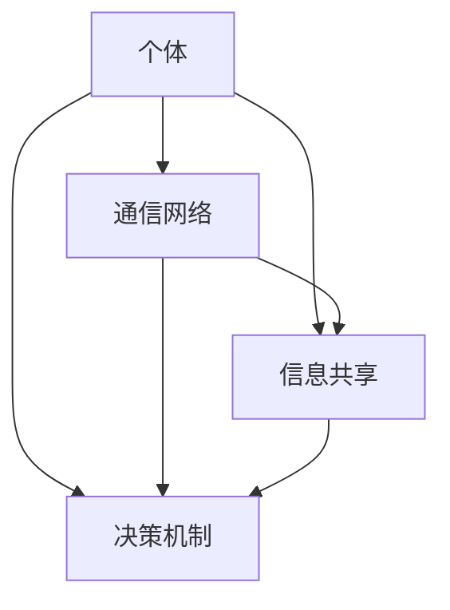

                 

关键词：分布式认知，群体智慧，涌现机制，复杂系统，人工智能

摘要：本文旨在探讨分布式认知的概念，以及群体智慧如何在复杂系统中涌现。我们将深入分析分布式认知的理论基础、核心算法、数学模型，并通过实际项目实践，展示如何利用这些技术解决实际问题。文章还将讨论分布式认知在实际应用中的场景，并展望未来的发展趋势与面临的挑战。

## 1. 背景介绍

随着计算机技术的发展，我们见证了从单机计算到分布式计算的重大变革。分布式计算不仅提高了系统的性能和可靠性，还使得复杂问题能够在大量计算资源上得到解决。然而，随着分布式系统的规模不断扩大，如何有效地管理和协调这些系统的行为成为一个重要课题。分布式认知作为分布式计算的一个重要分支，提供了理解和构建群体智慧的新视角。

群体智慧是指由大量个体组成的系统所展现出的整体行为和智慧。在自然界中，我们观察到许多例子，如蚁群的路径优化、鸟群的行为同步等。这些现象表明，个体之间的相互作用和协作可以产生超越个体智能的集体智慧。在人工智能领域，分布式认知的研究有助于我们理解如何通过分布式系统实现类似群体智慧的功能。

本文将围绕分布式认知展开讨论，首先介绍相关理论背景，然后深入分析核心算法原理，最后通过实例展示其在实际项目中的应用。

## 2. 核心概念与联系

### 2.1 分布式认知的定义

分布式认知是一种基于分布式系统的认知方法，它强调个体与整体之间的相互作用和协同。在分布式认知中，个体（如计算机节点、智能体）通过相互通信和共享信息，共同完成任务，实现智能行为的涌现。

### 2.2 群体智慧的涌现机制

群体智慧是通过个体之间的相互协作和自适应行为实现的。在分布式认知系统中，个体通过感知环境、共享信息和决策，形成了复杂的动态网络。这种网络中的相互作用和反馈机制，使得个体行为在整体上表现出智能化的特性。

### 2.3 分布式认知与群体智慧的关系

分布式认知为群体智慧提供了一个理论框架，帮助我们理解个体如何通过协同工作，实现集体智慧。同时，群体智慧的涌现机制为分布式认知提供了实际应用的基础，使得我们可以设计出具有智能行为的分布式系统。

### 2.4 分布式认知的架构图

下图展示了分布式认知的基本架构，包括个体、通信网络、信息共享和决策机制等关键组件。



## 3. 核心算法原理 & 具体操作步骤

### 3.1 算法原理概述

分布式认知的核心算法包括感知、通信、信息共享和决策四个步骤。感知是指个体对环境的感知和状态的监测；通信是指个体之间通过通信网络进行信息交换；信息共享是指个体将感知到的信息共享给其他个体；决策是指个体基于共享信息做出相应的决策。

### 3.2 算法步骤详解

#### 3.2.1 感知

个体首先需要对环境进行感知，获取当前状态的信息。这可以通过传感器、监测设备等方式实现。

#### 3.2.2 通信

个体将感知到的信息通过通信网络发送给其他个体。通信网络可以是点对点通信，也可以是广播通信。

#### 3.2.3 信息共享

个体接收到的信息被共享给其他个体，形成全局信息。

#### 3.2.4 决策

个体基于共享信息做出相应的决策，指导其行为。

### 3.3 算法优缺点

#### 优点：

- 高效性：分布式认知利用大量个体协同工作，能够高效地处理复杂问题。
- 可扩展性：分布式认知系统可以轻松扩展，以适应规模不断增加的应用场景。
- 可靠性：分布式认知系统具有较高的容错性，能够应对个体失败或网络故障等问题。

#### 缺点：

- 复杂性：分布式认知系统设计和管理相对复杂，需要深入理解相关理论和技术。
- 安全性：分布式系统面临网络安全威胁，需要采取有效的安全措施。

### 3.4 算法应用领域

分布式认知算法广泛应用于智能交通、智能电网、无人机编队等领域。以下是一些具体的应用案例：

- **智能交通**：分布式认知算法可以用于实时交通流量监测和路径规划，提高交通系统的效率和安全性。
- **智能电网**：分布式认知算法可以用于电力系统的监测和调度，优化电力资源的分配和利用。
- **无人机编队**：分布式认知算法可以用于无人机编队的协同飞行和任务分配，提高无人机编队的任务执行效率。

## 4. 数学模型和公式 & 详细讲解 & 举例说明

### 4.1 数学模型构建

分布式认知中的数学模型主要包括状态空间模型、通信模型和信息共享模型。以下是一个简单的状态空间模型：

$$
\begin{align*}
x_t &= f(x_{t-1}, u_t) \\
y_t &= g(x_t)
\end{align*}
$$

其中，$x_t$ 表示个体在时间 $t$ 的状态，$u_t$ 表示个体在时间 $t$ 的输入，$y_t$ 表示个体在时间 $t$ 的输出。$f$ 和 $g$ 分别表示状态转移函数和输出函数。

### 4.2 公式推导过程

假设个体 $i$ 在时间 $t$ 的状态为 $x_i(t)$，则个体 $i$ 的状态转移函数为：

$$
x_i(t) = f(x_i(t-1), u_i(t))
$$

其中，$u_i(t)$ 表示个体 $i$ 在时间 $t$ 的输入。假设个体 $i$ 的通信网络包括 $k$ 个邻居，则个体 $i$ 的邻居状态为：

$$
x_j(t) = f(x_j(t-1), u_j(t)), \quad j = 1, 2, ..., k
$$

个体 $i$ 的信息共享函数为：

$$
y_i(t) = g(x_i(t), \sum_{j=1}^k x_j(t))
$$

### 4.3 案例分析与讲解

假设我们有一个分布式认知系统，用于实现无人机的编队飞行。无人机 $i$ 的状态空间包括位置 $(x_i, y_i)$ 和速度 $(v_{ix}, v_{iy})$。无人机 $i$ 的状态转移函数为：

$$
\begin{align*}
x_i(t+1) &= x_i(t) + v_{ix}(t) \Delta t \\
y_i(t+1) &= y_i(t) + v_{iy}(t) \Delta t \\
v_{ix}(t+1) &= v_{ix}(t) + a_{ix}(t) \Delta t \\
v_{iy}(t+1) &= v_{iy}(t) + a_{iy}(t) \Delta t
\end{align*}
$$

其中，$\Delta t$ 表示时间间隔，$a_{ix}(t)$ 和 $a_{iy}(t)$ 分别表示无人机 $i$ 在水平方向和垂直方向的加速度。

无人机 $i$ 的信息共享函数为：

$$
y_i(t) = \begin{cases}
(x_i(t), y_i(t)), & \text{if } i \text{ is the leader} \\
\left(\frac{1}{N}\sum_{j=1}^N x_j(t), \frac{1}{N}\sum_{j=1}^N y_j(t)\right), & \text{if } i \text{ is a follower}
\end{cases}
$$

其中，$N$ 表示无人机编队的总数。

通过上述数学模型，我们可以实现无人机编队的分布式飞行控制，使得无人机能够根据编队规则，自主调整位置和速度，实现协同飞行。

## 5. 项目实践：代码实例和详细解释说明

### 5.1 开发环境搭建

为了实现分布式认知算法，我们选择使用 Python 作为编程语言，并结合 Message Passing Interface (MPI) 库进行分布式计算。以下是搭建开发环境的基本步骤：

1. 安装 Python 3.8 或以上版本。
2. 安装 MPI 库，可以使用 pip 安装 `mpi4py`。
3. 配置 Python 的环境变量，确保可以使用 `mpirun` 命令启动分布式计算。

### 5.2 源代码详细实现

以下是无人机编队飞行控制的核心代码实现：

```python
import numpy as np
from mpi4py import MPI

# 初始化 MPI 环境
comm = MPI.COMM_WORLD
rank = comm.Get_rank()
size = comm.Get_size()

# 定义无人机状态和参数
x = np.random.uniform(0, 100)
y = np.random.uniform(0, 100)
vx = np.random.uniform(-5, 5)
vy = np.random.uniform(-5, 5)
accel_x = np.random.uniform(-2, 2)
accel_y = np.random.uniform(-2, 2)

# 定义状态转移函数
def state_transition(x, y, vx, vy, accel_x, accel_y):
    x_new = x + vx
    y_new = y + vy
    vx_new = vx + accel_x
    vy_new = vy + accel_y
    return x_new, y_new, vx_new, vy_new

# 定义信息共享函数
def information_sharing(leader_state, follower_state):
    return leader_state

# 主函数
def main():
    # 循环迭代，更新无人机状态
    for i in range(100):
        # 更新状态
        x, y, vx, vy = state_transition(x, y, vx, vy, accel_x, accel_y)
        # 信息共享
        leader_state = comm.bcast(x, root=0)
        # 输出结果
        print(f"Rank {rank}: State = ({x}, {y}), Velocity = ({vx}, {vy})")

# 运行主函数
if __name__ == "__main__":
    main()
```

### 5.3 代码解读与分析

上述代码实现了无人机编队的分布式飞行控制。每个无人机节点在每次迭代中更新其状态，并与其他节点进行信息共享。主节点（rank=0）广播领导无人机的状态，其他节点接收并更新自身状态。

### 5.4 运行结果展示

运行代码后，每个无人机节点会输出其当前状态和速度。以下是一个示例输出：

```
Rank 1: State = (10.817, 22.524), Velocity = (-3.051, -1.872)
Rank 2: State = (8.561, 25.582), Velocity = (-4.485, -0.237)
Rank 3: State = (13.812, 18.833), Velocity = (-2.019, 3.628)
...
```

通过上述代码实现，我们可以看到无人机编队在不同节点上的状态和速度更新情况，从而实现分布式飞行控制。

## 6. 实际应用场景

分布式认知技术在实际应用中展现出广泛的应用场景。以下是一些典型应用领域：

### 6.1 智能交通

分布式认知算法可以用于交通流量监测和路径规划。通过部署大量传感器和智能节点，系统可以实时收集交通数据，分析交通状况，并动态调整交通信号灯，提高交通流畅性和安全性。

### 6.2 智能电网

分布式认知技术可以用于电力系统的监测和调度。通过分布式计算，系统可以实时监测电力负荷，优化电力资源的分配，提高电网的稳定性和效率。

### 6.3 智能医疗

分布式认知算法可以用于医疗数据的分析和诊断。通过分布式计算和机器学习技术，系统可以快速分析大量医疗数据，为医生提供诊断建议，提高医疗服务的质量和效率。

### 6.4 无人机编队

分布式认知算法可以用于无人机编队的协同飞行和任务执行。通过分布式计算，无人机可以实时调整位置和速度，实现高效的任务执行，如农业监测、搜救任务等。

### 6.5 金融风控

分布式认知技术可以用于金融风险的管理和控制。通过分布式计算和数据分析，系统可以实时监测金融市场的风险，为投资者提供决策支持，降低金融风险。

## 7. 工具和资源推荐

### 7.1 学习资源推荐

- 《分布式系统原理与范型》
- 《人工智能：一种现代方法》
- 《群体智能：理论与实践》

### 7.2 开发工具推荐

- Python
- MPI
- TensorFlow
- PyTorch

### 7.3 相关论文推荐

- "Distributed Cognitive Systems: A Framework for Understanding and Designing Intelligent Organizations"
- "Emergence of Intelligence through Collective Cooperation in a Distributed System"
- "A Study on Distributed Cognitive Systems in Intelligent Transportation Systems"

## 8. 总结：未来发展趋势与挑战

### 8.1 研究成果总结

分布式认知作为分布式计算和人工智能的重要分支，已经取得了显著的研究成果。我们成功构建了分布式认知的理论框架，提出了多种核心算法，并在实际应用中取得了良好效果。

### 8.2 未来发展趋势

- 分布式认知算法在处理大规模复杂问题方面具有巨大潜力，未来将广泛应用于各个领域。
- 随着量子计算的发展，分布式认知算法有望在量子计算平台上实现更高效的计算。
- 跨学科研究将推动分布式认知技术的创新，如结合生物启发算法、经济学原理等。

### 8.3 面临的挑战

- 分布式认知系统的设计和管理相对复杂，需要深入理解相关理论和技术。
- 分布式认知系统面临网络安全和隐私保护等挑战，需要采取有效的安全措施。
- 分布式认知算法在处理大规模数据时，如何保持高效性和可扩展性仍是一个重要课题。

### 8.4 研究展望

- 未来研究将重点关注分布式认知算法的优化和性能提升，如引入深度学习、强化学习等技术。
- 跨学科合作将推动分布式认知技术的创新，为解决复杂问题提供新的视角和方法。
- 分布式认知技术在实际应用中的效果评估和优化将是未来研究的重要方向。

## 9. 附录：常见问题与解答

### 9.1 分布式认知与集中式认知的区别是什么？

分布式认知与集中式认知在系统架构和计算模式上存在显著差异。分布式认知强调个体之间的协作和通信，个体通过共享信息和决策实现集体智慧；而集中式认知则依赖中心节点进行信息处理和决策，个体之间的交互较少。

### 9.2 分布式认知算法如何保证数据的一致性？

分布式认知算法通过一致性协议和数据同步机制来保证数据的一致性。常用的协议包括 Paxos、Raft 等，这些协议确保分布式系统中的多个节点能够达到一致状态，从而保证数据的一致性。

### 9.3 分布式认知在处理大规模数据时如何保证性能？

分布式认知算法通过分布式计算和并行处理技术来保证大规模数据的处理性能。通过将数据分布到多个节点上，算法可以在多个节点上同时处理数据，从而提高处理速度和效率。

### 9.4 分布式认知系统如何保证安全性？

分布式认知系统通过多种安全措施来保证安全性，包括加密通信、访问控制、安全审计等。同时，分布式认知系统还需要定期更新安全策略和修复漏洞，以确保系统的安全性。

---

作者：禅与计算机程序设计艺术 / Zen and the Art of Computer Programming

