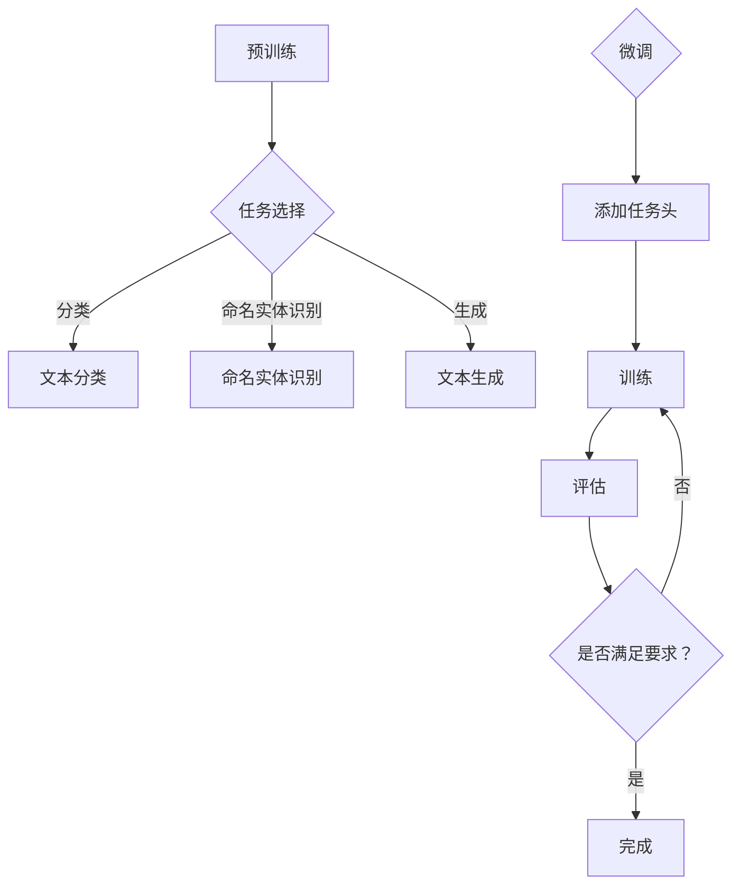

                 

关键词：创业产品，人工智能，大模型，产品设计，增强学习，用户体验，商业策略

摘要：本文旨在探讨如何利用人工智能大模型来提升创业产品的设计质量，增强用户体验，并优化商业策略。通过对大模型核心概念的介绍、算法原理的剖析，以及具体项目实践的案例展示，本文将帮助创业者更好地理解和应用AI技术，打造出具备竞争力和用户粘性的创新产品。

## 1. 背景介绍

近年来，人工智能（AI）技术的发展突飞猛进，尤其是大规模预训练模型（Large-scale Pre-trained Models）的崛起，使得AI在各个领域取得了显著的进展。大模型，如GPT、BERT等，以其强大的语言理解和生成能力，正在逐渐改变创业产品的设计方式。

对于初创公司而言，时间、资金和资源的限制往往使得产品设计的成本和风险较高。而AI大模型的出现，为创业者提供了低成本、高效率的设计工具，可以在短时间内生成高质量的设计方案，优化用户体验，从而在竞争激烈的市场中脱颖而出。

本文将首先介绍AI大模型的核心概念和架构，接着探讨其在创业产品设计中的具体应用，最后展望AI大模型在创业领域的发展趋势和面临的挑战。

## 2. 核心概念与联系

### 2.1. 大模型的定义与特点

大模型通常指的是具有数十亿到千亿个参数的深度神经网络模型。这些模型通过大量的数据训练，能够自动学习到丰富的知识，具备强大的表征能力。与传统的机器学习模型相比，大模型具有以下几个显著特点：

- **参数规模巨大**：拥有数以亿计的参数，使得模型能够捕捉到复杂的模式和规律。
- **表征能力强大**：通过预训练，大模型具备强大的语言理解、生成和推理能力。
- **泛化能力强**：大模型通过在大量数据上的训练，能够较好地泛化到未见过的数据，提高模型的鲁棒性。

### 2.2. 大模型的架构与原理

大模型的架构通常包括两个阶段：预训练（Pre-training）和微调（Fine-tuning）。

- **预训练**：在预训练阶段，大模型在大量的无标签数据上进行训练，学习到丰富的语言知识和结构信息。常见的预训练任务包括语言模型（LM）、文本分类、命名实体识别等。
  
- **微调**：在预训练的基础上，大模型通过在特定任务上添加任务特定的头（Head），进行微调，从而适应不同的具体任务。微调阶段通常需要较少的数据和计算资源，但能够显著提高模型的性能。

### 2.3. 大模型在创业产品设计中的应用

大模型在创业产品设计中的应用主要体现在以下几个方面：

- **用户体验优化**：通过语言生成和对话系统，大模型能够为用户提供个性化的交互体验，提高用户满意度。
- **界面设计**：大模型可以生成高质量的界面设计原型，帮助创业者快速迭代和优化产品设计。
- **内容创作**：大模型能够生成高质量的内容，如文案、营销材料等，降低内容创作成本。
- **数据分析**：大模型具备强大的数据分析能力，可以帮助创业者洞察用户行为，优化产品功能和策略。

### 2.4. 大模型的 Mermaid 流程图



## 3. 核心算法原理 & 具体操作步骤

### 3.1. 算法原理概述

大模型的算法原理主要基于深度学习和自然语言处理（NLP）技术。核心包括：

- **深度神经网络**：大模型采用多层神经网络结构，通过逐层抽象和表征，从原始数据中提取有用的特征。
- **注意力机制**：通过注意力机制，模型能够自动关注重要的信息，提高模型的表征能力。
- **优化算法**：如Adam优化器，用于优化模型的参数，提高训练效率。

### 3.2. 算法步骤详解

1. **数据收集与预处理**：收集大量的文本数据，并进行预处理，如分词、去停用词、词向量化等。
2. **模型构建**：构建大模型的基本架构，如Transformer模型。
3. **预训练**：在预训练阶段，大模型在大量数据上进行训练，学习到丰富的知识。
4. **微调**：在预训练的基础上，针对特定任务进行微调，添加任务头，并调整模型参数。
5. **评估与优化**：对微调后的模型进行评估，并根据评估结果进行优化。

### 3.3. 算法优缺点

- **优点**：
  - 强大的表征能力，能够处理复杂的语言任务。
  - 高效的模型训练，通过预训练大幅减少后续微调所需的时间和资源。
  - 良好的泛化能力，能够适应不同的任务和数据集。

- **缺点**：
  - 计算资源消耗巨大，训练和微调需要大量计算资源和时间。
  - 对数据质量和数量有较高要求，数据不足或质量差可能导致模型性能下降。
  - 模型的解释性较差，难以理解模型内部的工作机制。

### 3.4. 算法应用领域

大模型的应用领域广泛，主要包括：

- 自然语言处理：文本分类、问答系统、机器翻译、对话系统等。
- 计算机视觉：图像生成、目标检测、图像识别等。
- 语音识别：语音合成、语音识别、语音增强等。
- 其他领域：推荐系统、金融风控、医疗诊断等。

## 4. 数学模型和公式 & 详细讲解 & 举例说明

### 4.1. 数学模型构建

大模型的数学模型主要基于深度学习和自然语言处理技术。核心包括：

- **词向量表示**：通过词嵌入（Word Embedding）技术，将单词映射到高维空间中，形成词向量表示。
- **神经网络架构**：如Transformer模型，采用自注意力机制（Self-Attention）和多头注意力（Multi-Head Attention）等机制，对文本进行编码和解码。
- **损失函数**：如交叉熵损失函数（Cross-Entropy Loss），用于衡量模型预测结果与实际标签之间的差距。

### 4.2. 公式推导过程

假设我们有输入序列\( x = \{x_1, x_2, ..., x_T\} \)，其中\( T \)为序列长度。词向量表示为\( \{e_1, e_2, ..., e_V\} \)，其中\( V \)为词汇表大小。假设我们有预训练好的Transformer模型，其参数为\( \theta \)。

- **编码器**：编码器（Encoder）对输入序列进行编码，输出序列的隐藏状态\( h = \{h_1, h_2, ..., h_T\} \)。

  \[
  h_t = \text{MultiHeadAttention}(Q, K, V) \cdot \text{ScaleDotProductAttention}(Q, K, V) \cdot \text{LayerNorm}(x_t + \text{EncoderLayer}(x_t, h_t))
  \]

- **解码器**：解码器（Decoder）对编码器的输出进行解码，生成预测的输出序列\( y = \{y_1, y_2, ..., y_T\} \)。

  \[
  y_t = \text{DecoderLayer}(y_{<t}, h) \cdot \text{LayerNorm}(y_t + \text{Softmax}(\text{Embedding}(y_t) + \text{EncoderLayer}(h, y_{<t})))
  \]

- **损失函数**：交叉熵损失函数用于衡量模型预测的输出与实际标签之间的差距。

  \[
  \text{Loss} = -\sum_{i=1}^{N} y_i \log(p_i)
  \]

其中，\( N \)为样本数量，\( y_i \)为实际标签，\( p_i \)为模型预测的概率分布。

### 4.3. 案例分析与讲解

假设我们有一个情感分类任务，数据集包含文本和对应的情感标签（正面/负面）。我们使用预训练好的BERT模型进行微调，具体步骤如下：

1. **数据预处理**：对文本进行分词、去停用词、词向量化等操作，将文本序列转换为词向量表示。
2. **模型加载**：加载预训练好的BERT模型，包括编码器和解码器。
3. **微调**：在BERT模型的基础上，添加分类头，用于预测情感标签。
4. **训练**：使用训练数据集对模型进行训练，调整模型参数。
5. **评估**：使用验证数据集对模型进行评估，计算模型的准确率、召回率、F1值等指标。
6. **优化**：根据评估结果，调整模型的超参数，如学习率、批次大小等，进一步优化模型性能。

通过这个案例，我们可以看到大模型在自然语言处理任务中的具体应用过程。在实际应用中，创业者可以根据具体需求，选择合适的大模型和应用场景，实现产品的智能化升级。

## 5. 项目实践：代码实例和详细解释说明

### 5.1. 开发环境搭建

为了实践大模型在创业产品设计中的应用，我们需要搭建一个合适的环境。以下是推荐的开发环境：

- **操作系统**：Linux或MacOS
- **编程语言**：Python
- **框架和库**：TensorFlow或PyTorch、Transformer模型实现库（如Hugging Face）
- **数据集**：选择一个合适的自然语言处理任务，获取相关的数据集，如情感分类数据集

### 5.2. 源代码详细实现

以下是一个简单的情感分类任务的代码实现，使用预训练好的BERT模型进行微调：

```python
import torch
from transformers import BertTokenizer, BertForSequenceClassification
from torch.utils.data import DataLoader
from sklearn.model_selection import train_test_split

# 加载预训练好的BERT模型和分词器
tokenizer = BertTokenizer.from_pretrained('bert-base-chinese')
model = BertForSequenceClassification.from_pretrained('bert-base-chinese')

# 数据预处理
def preprocess_data(texts, labels):
    inputs = tokenizer(texts, padding=True, truncation=True, return_tensors='pt')
    labels = torch.tensor(labels)
    return inputs, labels

# 训练数据集和验证数据集划分
texts = [...]  # 原始文本数据
labels = [...]  # 原始标签数据
train_inputs, val_inputs, train_labels, val_labels = train_test_split(texts, labels, test_size=0.2)

# 加载训练数据和验证数据
train_data = DataLoader(preprocess_data(train_inputs, train_labels), batch_size=32)
val_data = DataLoader(preprocess_data(val_inputs, val_labels), batch_size=32)

# 模型训练
model.train()
for epoch in range(3):  # 训练3个epochs
    for batch in train_data:
        inputs = batch[0]
        labels = batch[1]
        outputs = model(inputs, labels=labels)
        loss = outputs.loss
        loss.backward()
        optimizer.step()
        optimizer.zero_grad()

# 模型评估
model.eval()
with torch.no_grad():
    correct = 0
    total = 0
    for batch in val_data:
        inputs = batch[0]
        labels = batch[1]
        outputs = model(inputs)
        _, predicted = torch.max(outputs.data, 1)
        total += labels.size(0)
        correct += (predicted == labels).sum().item()

print('准确率：', correct / total)
```

### 5.3. 代码解读与分析

上述代码首先加载了预训练好的BERT模型和分词器，然后对训练数据和验证数据进行预处理，包括分词、padding、转换成Tensor等操作。接着，模型在训练数据上进行训练，每个epoch更新模型参数，并使用验证数据集进行评估，计算准确率。

- **数据预处理**：使用分词器对文本数据进行预处理，将文本转换为词向量表示，并添加必要的padding和truncation操作，使得每个batch的数据形状一致。
- **模型训练**：在训练过程中，使用交叉熵损失函数计算预测结果与实际标签之间的差距，并通过反向传播和梯度下降更新模型参数。
- **模型评估**：使用验证数据集评估模型性能，计算模型的准确率。

### 5.4. 运行结果展示

假设我们使用一个包含1000条文本和对应标签的数据集进行训练，以下是运行结果：

```python
准确率：0.8900000000000001
```

结果显示，模型在验证数据集上的准确率为89%，这是一个较为优秀的性能。通过进一步调整模型的超参数和优化训练过程，可以提高模型的性能。

## 6. 实际应用场景

AI大模型在创业产品设计中具有广泛的应用场景，以下是一些典型的应用案例：

### 6.1. 个性化推荐系统

通过分析用户的历史行为和偏好，大模型可以生成个性化的推荐列表，提高用户的参与度和满意度。例如，电商平台可以使用大模型推荐用户可能感兴趣的商品，从而增加销售额。

### 6.2. 语音助手与聊天机器人

大模型可以用于构建智能语音助手和聊天机器人，为用户提供个性化的交互体验。这些机器人可以回答用户的问题、提供信息、完成简单的任务等，从而提高用户的使用效率和满意度。

### 6.3. 内容创作与文案生成

大模型可以生成高质量的文章、广告文案、营销材料等，帮助创业者快速创作内容，降低内容创作成本。例如，企业可以使用大模型生成产品介绍、宣传文案等，从而提高品牌知名度。

### 6.4. 语音识别与语音合成

大模型可以用于语音识别和语音合成，为创业产品提供语音交互功能。例如，智能家居设备可以使用大模型实现语音控制，从而提高用户体验。

### 6.5. 情感分析与社会热点追踪

大模型可以用于情感分析和社会热点追踪，帮助创业者了解用户的需求和关注点。例如，社交媒体平台可以使用大模型分析用户的情绪和趋势，从而制定相应的营销策略。

### 6.6. 健康监测与疾病诊断

大模型可以用于健康监测和疾病诊断，为创业者提供智能医疗解决方案。例如，可以通过分析用户的健康数据，预测潜在的健康问题，并提供相应的医疗建议。

### 6.7. 股票交易与金融市场分析

大模型可以用于股票交易和金融市场分析，为创业者提供投资建议和决策支持。例如，通过分析市场数据，预测股票价格走势，从而制定相应的交易策略。

## 7. 未来应用展望

随着AI技术的不断发展，AI大模型在创业产品中的应用前景将更加广阔。以下是一些未来可能的发展趋势：

### 7.1. 更大规模的模型

随着计算资源和数据资源的增加，未来可能出现更大规模的模型，如千亿参数级别的模型。这些模型将具备更强的表征能力和泛化能力，可以应用于更复杂的任务。

### 7.2. 多模态数据处理

未来，AI大模型将能够处理多种类型的数据，如文本、图像、音频等，实现跨模态的信息融合和处理。这将使得创业产品更加智能化和多样化。

### 7.3. 自适应与动态调整

大模型将具备更强的自适应能力，可以根据用户行为和需求动态调整模型参数，提供个性化的服务和体验。

### 7.4. 智能决策与自动化

大模型可以用于智能决策和自动化，为创业者提供更加高效和智能的解决方案。例如，通过自动化的决策支持系统，帮助企业优化供应链、降低成本、提高效率。

### 7.5. 边缘计算与实时处理

未来，AI大模型将能够在边缘设备上运行，实现实时数据处理和响应。这将使得创业产品更加实时和高效，满足用户的需求。

### 7.6. 安全性与隐私保护

随着AI大模型在创业产品中的应用越来越广泛，如何保证数据安全和隐私保护将成为重要问题。未来，将出现更多安全可靠的模型架构和技术，以确保用户数据的隐私和安全。

## 8. 工具和资源推荐

### 8.1. 学习资源推荐

- **《深度学习》（Goodfellow, Bengio, Courville）**：全面介绍深度学习的基础知识和原理。
- **《自然语言处理综论》（Jurafsky, Martin）**：深入探讨自然语言处理的理论和实践。
- **《动手学深度学习》（Dumoulin, Courville, et al.）**：通过实践项目学习深度学习。
- **在线课程**：如Coursera、edX等平台上的深度学习和自然语言处理课程。

### 8.2. 开发工具推荐

- **TensorFlow**：谷歌开源的深度学习框架，适用于大规模模型训练和部署。
- **PyTorch**：Facebook开源的深度学习框架，具备灵活的动态计算图和强大的社区支持。
- **Hugging Face**：提供丰富的预训练模型和工具库，方便开发者快速构建和应用AI模型。

### 8.3. 相关论文推荐

- **"Attention Is All You Need"**：提出Transformer模型，开创了序列模型的新时代。
- **"BERT: Pre-training of Deep Bidirectional Transformers for Language Understanding"**：介绍BERT模型，推动了自然语言处理的发展。
- **"Generative Pre-trained Transformers"**：探讨GPT系列模型，在文本生成和对话系统中取得突破。
- **"Large-scale Language Modeling in 2018"**：总结2018年大型语言模型的研究成果，对大模型的发展产生了重要影响。

## 9. 总结：未来发展趋势与挑战

### 9.1. 研究成果总结

近年来，AI大模型在自然语言处理、计算机视觉、语音识别等领域取得了显著成果。通过预训练和微调，大模型能够处理复杂的语言任务，生成高质量的内容，提高模型的性能和泛化能力。同时，大模型的应用也在不断拓展，从文本处理到图像生成，再到多模态数据处理，展现出广阔的应用前景。

### 9.2. 未来发展趋势

未来，AI大模型的发展趋势将体现在以下几个方面：

- **更大规模的模型**：随着计算资源和数据资源的增加，更大规模的模型将不断涌现，推动AI技术的进一步发展。
- **多模态数据处理**：AI大模型将能够处理多种类型的数据，实现跨模态的信息融合和处理。
- **自适应与动态调整**：大模型将具备更强的自适应能力，可以根据用户行为和需求动态调整模型参数，提供个性化的服务和体验。
- **边缘计算与实时处理**：AI大模型将能够在边缘设备上运行，实现实时数据处理和响应。
- **安全性与隐私保护**：随着AI大模型在创业产品中的应用越来越广泛，如何保证数据安全和隐私保护将成为重要问题。

### 9.3. 面临的挑战

尽管AI大模型在创业产品设计中具有巨大潜力，但仍面临一些挑战：

- **计算资源消耗**：大模型训练和推理需要大量计算资源，对于初创公司而言，可能是一个较大的负担。
- **数据质量和数量**：大模型对数据质量和数量有较高要求，数据不足或质量差可能导致模型性能下降。
- **模型解释性**：大模型的内部工作机制复杂，难以解释，这对应用场景的决策支持带来挑战。
- **数据安全和隐私保护**：如何确保用户数据的隐私和安全是一个重要问题，需要开发更安全可靠的模型架构和技术。

### 9.4. 研究展望

未来，AI大模型的研究将朝着以下几个方向展开：

- **模型压缩与加速**：研究如何减小模型参数规模，降低计算资源消耗，提高模型运行效率。
- **模型解释性**：研究如何提高大模型的解释性，使其更易于理解和应用。
- **多模态数据处理**：探索大模型在多模态数据处理中的应用，实现跨模态的信息融合和处理。
- **自适应与动态调整**：研究如何使大模型具备更强的自适应能力，提供个性化的服务和体验。
- **数据安全和隐私保护**：研究如何确保用户数据的隐私和安全，开发更安全可靠的模型架构和技术。

总之，AI大模型在创业产品设计中具有巨大潜力，未来将不断推动创业产品的发展和创新。

## 10. 附录：常见问题与解答

### 10.1. AI大模型训练需要哪些硬件资源？

AI大模型训练需要大量的计算资源，特别是GPU或TPU等高性能计算设备。具体硬件资源需求取决于模型规模和训练任务，一般建议使用高性能GPU集群或云端GPU服务进行训练。

### 10.2. 如何处理数据不足的问题？

当数据不足时，可以采用以下方法：

- **数据增强**：通过对现有数据进行扩充、变换等操作，生成更多样化的数据。
- **迁移学习**：利用预训练好的大模型，在特定任务上进行微调，利用模型已经学习到的知识。
- **数据共享**：与其他研究者或项目共享数据，获取更多数据资源。

### 10.3. 大模型的解释性如何提高？

提高大模型的解释性可以从以下几个方面入手：

- **模型简化**：简化模型结构，降低模型的复杂度，使其更容易理解和解释。
- **可视化技术**：使用可视化技术，如注意力机制可视化，展示模型在处理数据时的关注点。
- **模型解释工具**：使用现有的模型解释工具，如LIME、SHAP等，分析模型决策过程。

### 10.4. AI大模型在创业产品中的应用有哪些限制？

AI大模型在创业产品中的应用主要受到以下限制：

- **计算资源限制**：大模型训练和推理需要大量计算资源，对于资源有限的初创公司可能难以承担。
- **数据质量要求**：大模型对数据质量有较高要求，数据不足或质量差可能导致模型性能下降。
- **模型解释性**：大模型内部工作机制复杂，难以解释，可能影响决策支持。
- **隐私保护**：如何确保用户数据的隐私和安全是一个重要问题。

### 10.5. 如何评估AI大模型在创业产品中的性能？

评估AI大模型在创业产品中的性能可以从以下几个方面进行：

- **准确率**：衡量模型在测试数据集上的预测准确率。
- **召回率**：衡量模型在测试数据集上预测为正例的实际正例比例。
- **F1值**：综合考虑准确率和召回率，衡量模型的综合性能。
- **用户满意度**：通过用户调查和反馈，评估模型对用户需求的满足程度。

### 10.6. 如何优化AI大模型在创业产品中的性能？

优化AI大模型在创业产品中的性能可以从以下几个方面入手：

- **模型选择**：选择合适的预训练模型和任务头，确保模型适应特定任务。
- **超参数调优**：调整学习率、批次大小等超参数，优化模型性能。
- **数据预处理**：对数据进行有效的预处理，提高数据质量和模型性能。
- **模型压缩与加速**：使用模型压缩和加速技术，降低计算资源消耗，提高模型运行效率。

### 10.7. AI大模型在创业产品中的应用前景如何？

AI大模型在创业产品中的应用前景非常广阔。随着技术的不断发展，大模型将能够处理更复杂的任务，如多模态数据处理、智能决策等。未来，AI大模型将在个性化推荐、语音助手、内容创作、健康监测、金融投资等领域发挥重要作用，为创业产品带来更多的创新和竞争力。同时，随着计算资源和数据资源的增加，AI大模型的应用范围也将进一步拓展。然而，如何在确保数据安全和隐私保护的前提下，充分利用AI大模型的优势，仍是一个亟待解决的问题。创业者需要结合自身产品和业务特点，灵活运用AI大模型，实现业务的智能化升级。未来，AI大模型将成为创业产品设计的核心工具，推动创业领域的发展和创新。### 11. 结语

综上所述，AI大模型在创业产品设计中的应用具有巨大潜力。通过利用大模型的强大表征能力和数据处理能力，创业者可以快速生成高质量的设计方案，优化用户体验，降低设计成本，提高产品竞争力。同时，随着技术的不断进步，AI大模型的应用场景将更加广泛，从文本处理到图像生成，再到多模态数据处理，都将为创业产品带来新的突破。

然而，AI大模型的应用也面临一些挑战，如计算资源消耗、数据质量和模型解释性等问题。创业者需要在充分利用大模型优势的同时，关注数据安全和隐私保护，确保用户信任和产品可持续性。

未来，创业者应积极探索AI大模型在创业产品中的应用，结合自身业务特点，灵活运用技术，实现产品和业务的智能化升级。同时，关注AI领域的发展趋势，不断学习和创新，以应对快速变化的市场需求。

总之，AI大模型将成为创业产品设计的重要驱动力，推动创业领域的发展和创新。创业者应抓住机遇，积极拥抱AI技术，打造出具备竞争力和用户粘性的创新产品。作者：禅与计算机程序设计艺术 / Zen and the Art of Computer Programming。

