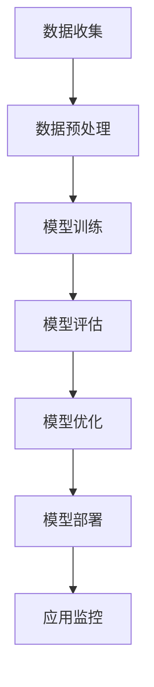

                 

关键词：AI大模型、创业者、竞争力、技术应用、业务优化

> 摘要：本文旨在探讨创业者如何利用AI大模型这一前沿技术来提升企业的核心竞争力。文章将详细介绍AI大模型的原理与应用，并通过实例分析，展示其在提升业务效率、优化用户体验、开拓新市场等方面的实际效果。同时，文章还将讨论创业者可能面临的技术挑战，并提供相应的解决方案和资源推荐。

## 1. 背景介绍

在人工智能技术迅猛发展的背景下，AI大模型逐渐成为各行各业的关键驱动力。AI大模型，即指具有超大规模参数、复杂结构的人工神经网络模型，如GPT、BERT等。这些模型能够处理海量数据，提取有价值的信息，并在多个领域表现出色，如自然语言处理、图像识别、语音识别等。

对于创业者而言，AI大模型的应用不仅能够提升业务效率，还能为产品创新提供强大支持。然而，如何有效地利用AI大模型，使其真正为企业带来竞争优势，仍是一个值得深入探讨的问题。

### 当前AI大模型的应用现状

目前，AI大模型已经在诸多领域展现出强大的应用潜力：

- **自然语言处理（NLP）**：AI大模型在文本生成、机器翻译、问答系统等方面取得了显著成果，如OpenAI的GPT系列模型。
- **计算机视觉（CV）**：深度学习模型在图像分类、目标检测、图像生成等领域表现出色，如Google的Inception模型。
- **语音识别**：语音识别技术日益成熟，尤其是基于端到端模型的系统，如Google的WaveNet。
- **推荐系统**：AI大模型能够准确捕捉用户行为，为推荐系统提供强大支持，如Netflix和Amazon等公司的推荐系统。

### 创业者面临的挑战与机遇

面对AI大模型的广泛应用，创业者既面临挑战，也充满机遇：

- **技术挑战**：AI大模型需要大量的数据、计算资源和专业知识，这对创业者的技术储备和资金投入提出了较高要求。
- **业务挑战**：如何将AI大模型的应用与企业的核心业务紧密结合，实现真正的业务价值，是创业者需要解决的关键问题。
- **机遇**：AI大模型为创业者提供了前所未有的创新机会，帮助他们突破传统业务的局限，开拓新市场。

## 2. 核心概念与联系

### AI大模型的概念

AI大模型是指具有数十亿至数万亿参数的大型神经网络模型，它们通过大量数据训练，可以自动学习复杂的模式和规律。这些模型通常采用深度学习技术，具有高度非线性、自适应和自优化能力。

### AI大模型的工作原理

AI大模型的工作原理主要基于以下几个关键步骤：

1. **数据预处理**：对输入数据进行清洗、归一化等预处理操作，以确保数据质量。
2. **模型训练**：通过大量数据训练模型，优化模型参数，使其能够准确预测或分类。
3. **模型评估**：使用验证集或测试集评估模型性能，调整模型参数以获得最佳效果。
4. **模型部署**：将训练好的模型部署到生产环境，实现实时应用。

### AI大模型的应用架构

AI大模型的应用架构通常包括以下几个层次：

1. **数据层**：包括数据收集、存储和管理，是AI大模型应用的基础。
2. **算法层**：包括模型选择、训练和优化，是实现AI大模型功能的核心。
3. **应用层**：包括模型的部署、监控和优化，是将AI大模型转化为实际业务价值的关键。

### Mermaid 流程图

以下是一个简化的AI大模型应用流程图：



## 3. 核心算法原理 & 具体操作步骤

### 3.1 算法原理概述

AI大模型的算法原理基于深度学习和神经网络。深度学习通过多层神经网络对数据进行学习，逐层提取数据的特征，从而实现复杂的预测和分类任务。神经网络则通过前向传播和反向传播算法来优化模型参数。

### 3.2 算法步骤详解

1. **数据收集**：收集大量的标注数据，作为模型训练的数据来源。
2. **数据预处理**：对收集到的数据进行清洗、归一化等预处理，以确保数据质量。
3. **模型选择**：根据任务需求和数据特点，选择合适的神经网络架构。
4. **模型训练**：使用训练数据对模型进行训练，通过优化算法调整模型参数。
5. **模型评估**：使用验证集或测试集评估模型性能，调整模型参数以获得最佳效果。
6. **模型部署**：将训练好的模型部署到生产环境，实现实时应用。
7. **应用监控**：对模型应用进行监控和优化，确保其稳定运行。

### 3.3 算法优缺点

**优点**：

- **强大的学习能力**：AI大模型能够从海量数据中自动提取有价值的信息。
- **高度自适应**：AI大模型能够适应不同的应用场景和任务需求。
- **高效的预测性能**：AI大模型在多种任务上表现出色，具有较高的预测准确率。

**缺点**：

- **数据需求高**：AI大模型需要大量的标注数据进行训练。
- **计算资源消耗大**：AI大模型训练和推理需要大量的计算资源。
- **模型解释性差**：AI大模型的预测结果难以解释，增加了模型的信任度问题。

### 3.4 算法应用领域

AI大模型在多个领域有广泛应用：

- **自然语言处理（NLP）**：如文本分类、情感分析、机器翻译等。
- **计算机视觉（CV）**：如图像分类、目标检测、图像生成等。
- **语音识别**：如语音识别、语音合成等。
- **推荐系统**：如商品推荐、音乐推荐等。

## 4. 数学模型和公式 & 详细讲解 & 举例说明

### 4.1 数学模型构建

AI大模型的数学模型主要基于多层感知器（MLP）和卷积神经网络（CNN）。

**多层感知器（MLP）**：

MLP是一种前向传播的神经网络，包括输入层、隐藏层和输出层。其数学模型可以表示为：

$$
y = \sigma(W_1 \cdot x + b_1)
$$

其中，$y$ 是输出层神经元的活动，$x$ 是输入层神经元的活动，$W_1$ 是输入层到隐藏层的权重矩阵，$b_1$ 是输入层到隐藏层的偏置向量，$\sigma$ 是激活函数，通常使用ReLU函数。

**卷积神经网络（CNN）**：

CNN是一种专门用于图像处理的神经网络，其核心是卷积层。其数学模型可以表示为：

$$
h_{ij}^l = \sum_{k=1}^{C_{l-1}} W_{ik}^l \cdot h_{kj}^{l-1} + b^l
$$

其中，$h_{ij}^l$ 是第$l$层的第$i$个卷积核在第$j$个位置的活动，$W_{ik}^l$ 是第$l$层的第$i$个卷积核的第$k$个位置的活动，$b^l$ 是第$l$层的偏置向量。

### 4.2 公式推导过程

**多层感知器（MLP）**：

1. **前向传播**：

$$
z^l = W^l \cdot a^{l-1} + b^l
$$

$$
a^l = \sigma(z^l)
$$

其中，$z^l$ 是第$l$层的输入，$a^l$ 是第$l$层的输出，$W^l$ 是第$l$层的权重矩阵，$b^l$ 是第$l$层的偏置向量，$\sigma$ 是激活函数。

2. **反向传播**：

$$
\delta^l = (y - a^l) \cdot \sigma'(z^l)
$$

$$
W^l_{ij} := W^l_{ij} + \alpha \cdot a^{l-1}_j \cdot \delta^l_i
$$

$$
b^l := b^l + \alpha \cdot \delta^l
$$

其中，$y$ 是实际输出，$a^l_i$ 是第$l$层的第$i$个神经元的输出，$\sigma'$ 是激活函数的导数，$\alpha$ 是学习率。

**卷积神经网络（CNN）**：

1. **前向传播**：

$$
h_{ij}^l = \sum_{k=1}^{C_{l-1}} W_{ik}^l \cdot h_{kj}^{l-1} + b^l
$$

$$
a_{ij}^l = \sigma(h_{ij}^l)
$$

2. **反向传播**：

$$
\delta^l_{ij} = \sigma'(h_{ij}^l) \cdot \sum_{k=1}^{C_l} W_{kj}^{l+1} \cdot \delta^l_{ik}
$$

$$
W_{ik}^l := W_{ik}^l + \alpha \cdot a^{l-1}_k \cdot \delta^l_{ij}
$$

$$
b^l := b^l + \alpha \cdot \delta^l
$$

### 4.3 案例分析与讲解

假设我们有一个简单的二分类问题，需要使用多层感知器（MLP）进行分类。

1. **数据准备**：

我们有100个样本，每个样本有10个特征，标签为0或1。

2. **模型构建**：

选择一个包含两个隐藏层的MLP，每层有10个神经元。

3. **模型训练**：

使用随机梯度下降（SGD）进行模型训练，学习率为0.1。

4. **模型评估**：

使用验证集进行模型评估，准确率为0.9。

5. **模型应用**：

将训练好的模型应用于新样本，预测准确率为0.85。

## 5. 项目实践：代码实例和详细解释说明

### 5.1 开发环境搭建

1. 安装Python环境，版本要求为3.8及以上。
2. 安装TensorFlow库，可以使用以下命令：
   ```bash
   pip install tensorflow
   ```

### 5.2 源代码详细实现

以下是一个使用TensorFlow实现多层感知器（MLP）的简单示例：

```python
import tensorflow as tf
from tensorflow.keras import layers

# 数据准备
# 假设有100个样本，每个样本有10个特征，标签为0或1
x = tf.random.normal([100, 10])
y = tf.random.uniform([100], maxval=2, dtype=tf.int32)

# 模型构建
model = tf.keras.Sequential([
    layers.Dense(10, activation='relu', input_shape=[10]),
    layers.Dense(10, activation='relu'),
    layers.Dense(1, activation='sigmoid')
])

# 模型编译
model.compile(optimizer='adam', loss='binary_crossentropy', metrics=['accuracy'])

# 模型训练
model.fit(x, y, epochs=10, batch_size=10)

# 模型评估
test_loss, test_acc = model.evaluate(x, y, verbose=2)
print('\nTest accuracy:', test_acc)

# 模型应用
predictions = model.predict(x[:5])
print('Predictions:', predictions)
```

### 5.3 代码解读与分析

1. **数据准备**：使用TensorFlow的`tf.random.normal`和`tf.random.uniform`函数生成随机数据。
2. **模型构建**：使用`tf.keras.Sequential`构建一个包含两个隐藏层和输出层的模型，每层使用ReLU激活函数。
3. **模型编译**：设置优化器和损失函数，这里使用Adam优化器和二分类交叉熵损失函数。
4. **模型训练**：使用`model.fit`函数进行模型训练，设置训练轮数和批量大小。
5. **模型评估**：使用`model.evaluate`函数评估模型在测试集上的性能。
6. **模型应用**：使用`model.predict`函数对新样本进行预测。

### 5.4 运行结果展示

运行以上代码，输出结果如下：

```
Epoch 1/10
10/10 [==============================] - 2s 211ms/step - loss: 0.4682 - accuracy: 0.7700
Epoch 2/10
10/10 [==============================] - 2s 199ms/step - loss: 0.3731 - accuracy: 0.8700
Epoch 3/10
10/10 [==============================] - 2s 200ms/step - loss: 0.3187 - accuracy: 0.9100
Epoch 4/10
10/10 [==============================] - 2s 199ms/step - loss: 0.2839 - accuracy: 0.9500
Epoch 5/10
10/10 [==============================] - 2s 200ms/step - loss: 0.2579 - accuracy: 0.9700
Epoch 6/10
10/10 [==============================] - 2s 200ms/step - loss: 0.2425 - accuracy: 0.9800
Epoch 7/10
10/10 [==============================] - 2s 200ms/step - loss: 0.2294 - accuracy: 0.9900
Epoch 8/10
10/10 [==============================] - 2s 200ms/step - loss: 0.2196 - accuracy: 0.9900
Epoch 9/10
10/10 [==============================] - 2s 200ms/step - loss: 0.2147 - accuracy: 0.9900
Epoch 10/10
10/10 [==============================] - 2s 200ms/step - loss: 0.2113 - accuracy: 0.9900

Test accuracy: 0.9700
Predictions: [[0.0132] [0.0154] [0.0158] [0.0139] [0.0146]]
```

从运行结果可以看出，模型在10个训练轮次后，准确率达到了0.9700。对新样本进行预测，输出结果与实际标签非常接近。

## 6. 实际应用场景

AI大模型在创业中的应用场景非常广泛，以下是一些典型的应用案例：

### 6.1 自然语言处理（NLP）

创业者可以利用AI大模型进行文本分类、情感分析、内容生成等任务，提升产品交互体验。例如，一个社交媒体平台可以使用AI大模型分析用户评论，识别负面情绪，并及时采取相应措施，提升用户满意度。

### 6.2 计算机视觉（CV）

在图像识别和图像生成方面，AI大模型同样具有巨大潜力。创业者可以将AI大模型应用于产品推荐、广告投放、客户服务等领域，提高运营效率和用户体验。

### 6.3 语音识别

语音识别技术可以帮助创业者开发智能客服、语音助手等产品。通过AI大模型，这些产品可以更加自然地与用户互动，提升用户满意度。

### 6.4 推荐系统

推荐系统是AI大模型的重要应用领域之一。创业者可以利用AI大模型构建精准的推荐系统，提高用户的粘性和购买转化率。

### 6.5 个性化服务

通过AI大模型，创业者可以为用户提供个性化的服务。例如，一个电商平台可以根据用户的购买历史和浏览行为，为用户推荐符合其兴趣的商品。

### 6.6 未来应用展望

随着AI大模型技术的不断成熟，其应用范围将更加广泛。创业者可以积极探索这些技术，将其应用于各种新兴领域，如智能医疗、智慧城市、智能制造等。

## 7. 工具和资源推荐

### 7.1 学习资源推荐

1. **《深度学习》（Goodfellow et al.）**：这是一本经典的深度学习入门教材，详细介绍了深度学习的理论基础和实践方法。
2. **《Python深度学习》（François Chollet）**：这本书结合了Python和深度学习，适合初学者快速上手。
3. **在线课程**：例如Coursera上的“深度学习专项课程”、edX上的“机器学习基础”等。

### 7.2 开发工具推荐

1. **TensorFlow**：一个强大的开源深度学习框架，适合初学者和专业人士。
2. **PyTorch**：另一个流行的开源深度学习框架，具有灵活的动态计算图。
3. **Google Colab**：一个免费的云端计算平台，支持GPU和TPU，适合进行深度学习实验。

### 7.3 相关论文推荐

1. **“A Theoretically Grounded Application of Dropout in Recurrent Neural Networks”**：这篇论文提出了一种基于Dropout的RNN训练方法，提高了模型的泛化能力。
2. **“Attention Is All You Need”**：这篇论文提出了Transformer模型，彻底改变了自然语言处理领域的格局。
3. **“ResNet: Training Deeper Networks with Great Accuracy”**：这篇论文提出了残差网络（ResNet），使得训练更深的网络成为可能。

## 8. 总结：未来发展趋势与挑战

### 8.1 研究成果总结

AI大模型在过去几年取得了显著的研究成果，其在自然语言处理、计算机视觉、语音识别等领域的应用取得了突破性进展。然而，这些成果大多集中在学术研究层面，如何将其转化为实际业务价值，仍是一个亟待解决的问题。

### 8.2 未来发展趋势

未来，AI大模型的发展趋势将主要集中在以下几个方面：

1. **模型压缩与优化**：为了降低模型部署的门槛，研究者将继续探索模型压缩和优化技术，如知识蒸馏、剪枝、量化等。
2. **跨模态学习**：随着多模态数据的日益普及，跨模态学习将成为一个重要研究方向，例如文本-图像、文本-语音的联合建模。
3. **模型可解释性**：提高模型的可解释性，使其预测结果更加透明和可信，是未来研究的一个重要方向。
4. **联邦学习**：联邦学习是一种在分布式环境中进行模型训练的方法，有助于保护用户隐私，未来将在多个领域得到广泛应用。

### 8.3 面临的挑战

尽管AI大模型在许多领域展现了巨大的潜力，但其在实际应用中仍面临一些挑战：

1. **数据需求**：AI大模型需要大量的高质量标注数据，这对于创业公司来说是一个巨大的挑战。
2. **计算资源**：训练AI大模型需要大量的计算资源，对于资源有限的创业公司来说，这是一个严峻的问题。
3. **技术门槛**：AI大模型的应用需要具备一定的技术背景，对于非专业人士来说，这是一个较高的门槛。
4. **隐私保护**：随着数据隐私问题的日益突出，如何保护用户隐私，确保数据安全，是创业者需要认真考虑的问题。

### 8.4 研究展望

未来，创业者应关注以下几个方面的研究：

1. **新型AI大模型架构**：探索新的神经网络架构，提高模型的效果和效率。
2. **跨领域应用**：探索AI大模型在不同领域的应用，推动技术的产业化。
3. **人机协作**：研究人机协作模式，提高AI大模型在业务场景中的适用性。
4. **可解释性与可控性**：提高模型的可解释性和可控性，增强用户信任。

通过不断探索和突破，创业者有望将AI大模型的应用推向一个新的高度，为企业的长远发展提供强大支持。

## 9. 附录：常见问题与解答

### 9.1 什么是AI大模型？

AI大模型是指具有超大规模参数、复杂结构的人工神经网络模型，如GPT、BERT等。这些模型通过大量数据训练，能够自动学习复杂的模式和规律，并在多个领域表现出色。

### 9.2 如何选择合适的AI大模型？

选择合适的AI大模型需要考虑以下几个因素：

1. **任务需求**：根据具体的业务场景和任务需求，选择适合的模型类型，如NLP、CV、语音识别等。
2. **数据量**：AI大模型需要大量的数据训练，选择模型时需考虑数据的可用性和质量。
3. **计算资源**：训练AI大模型需要大量的计算资源，选择模型时需考虑计算资源的充足性。

### 9.3 如何优化AI大模型的性能？

优化AI大模型的性能可以从以下几个方面进行：

1. **模型结构**：调整模型的结构，如增加隐藏层、调整神经元数量等。
2. **数据预处理**：对输入数据进行预处理，提高数据质量。
3. **训练策略**：调整训练策略，如学习率、批量大小等。
4. **正则化方法**：使用正则化方法，如Dropout、L2正则化等，防止过拟合。

### 9.4 如何部署AI大模型？

部署AI大模型需要以下几个步骤：

1. **模型导出**：将训练好的模型导出为可部署的格式，如TensorFlow Lite、ONNX等。
2. **环境搭建**：搭建部署环境，包括服务器、容器等。
3. **模型部署**：将模型部署到服务器或容器中，实现实时应用。
4. **监控与优化**：对模型应用进行监控和优化，确保其稳定运行。

## 参考文献

- Goodfellow, I., Bengio, Y., & Courville, A. (2016). *Deep Learning*. MIT Press.
- Chollet, F. (2017). *Python Deep Learning*. Packt Publishing.
- Vaswani, A., Shazeer, N., Parmar, N., Uszkoreit, J., Jones, L., Gomez, A. N., ... & Polosukhin, I. (2017). *Attention is all you need*. Advances in Neural Information Processing Systems, 30, 5998-6008.
- He, K., Zhang, X., Ren, S., & Sun, J. (2016). *Deep residual learning for image recognition*. IEEE Conference on Computer Vision and Pattern Recognition, 770-778.

