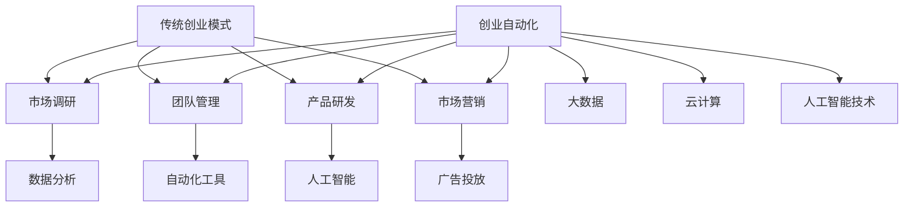

                 

关键词：创业自动化、传统创业模式、数字化转型、效率提升、成本控制、创新驱动、人工智能、自动化技术、流程优化、创业生态。

## 摘要

本文旨在探讨创业自动化与传统创业模式的对比，分析两者在效率、成本、创新等方面的差异与优缺点。创业自动化利用人工智能和自动化技术优化创业流程，提高效率，降低成本，而传统创业模式则依赖于传统管理和运营方式。本文将从多个角度对比这两种模式，为创业者提供有益的参考和启示。

## 1. 背景介绍

随着数字化时代的到来，创业环境发生了翻天覆地的变化。传统的创业模式已经无法满足现代市场的需求，越来越多的创业者开始探索创业自动化。创业自动化指的是利用人工智能、大数据、云计算等先进技术，对创业过程中的各个环节进行优化和自动化处理，从而实现高效、低成本、高创新的创业模式。

传统创业模式则是指创业者依靠自身的经验和能力，通过市场调研、团队组建、产品研发、市场营销等环节，逐步实现创业目标。传统创业模式在过去的几十年里为许多创业者创造了巨大的财富，但随着市场竞争的加剧，传统创业模式的局限性也逐渐暴露出来。

本文将从以下几个方面对比创业自动化与传统创业模式：效率、成本、创新、风险管理。

### 1.1 效率

创业自动化通过自动化技术，大大提高了创业过程中的效率。例如，在市场营销环节，创业者可以利用自动化工具进行广告投放、客户关系管理、数据分析等，从而节省大量时间和精力。相比之下，传统创业模式需要创业者亲自进行市场调研、团队管理和产品推广，效率相对较低。

### 1.2 成本

创业自动化通过降低人力成本、提高资源利用率，实现了成本的有效控制。例如，在团队管理环节，创业者可以利用自动化工具进行员工招聘、绩效考核、薪酬管理等，从而减少人力成本。而在传统创业模式中，创业者需要投入大量的人力、物力和财力进行团队建设和管理，成本较高。

### 1.3 创新

创业自动化鼓励创业者进行创新，通过技术手段不断优化产品和服务。例如，在产品研发环节，创业者可以利用人工智能技术进行需求分析、产品设计、测试等，从而提高产品竞争力。相比之下，传统创业模式在创新方面受到一定的制约，创业者需要依赖自身的经验和直觉进行决策。

### 1.4 风险管理

创业自动化通过数据分析和智能决策，降低了创业过程中的风险。例如，在市场调研环节，创业者可以利用大数据分析技术预测市场趋势、分析竞争对手，从而做出更科学的决策。而在传统创业模式中，创业者往往需要依靠经验和直觉进行判断，风险较高。

## 2. 核心概念与联系

为了更好地理解创业自动化与传统创业模式的差异，我们需要先了解一些核心概念和原理。以下是一个简单的 Mermaid 流程图，展示了创业自动化与传统创业模式的核心概念和联系。



### 2.1 传统创业模式

传统创业模式主要包括市场调研、团队管理、产品研发和市场营销等环节。这些环节都是创业者通过自身的经验和能力来完成的。

- **市场调研**：创业者通过市场调查、竞争分析等手段了解市场需求和竞争状况。
- **团队管理**：创业者负责组建和管理团队，进行人力资源配置和绩效管理。
- **产品研发**：创业者负责产品的需求分析、设计、开发、测试和优化。
- **市场营销**：创业者进行市场推广、品牌建设、客户关系管理等活动。

### 2.2 创业自动化

创业自动化则通过人工智能、大数据、云计算等先进技术，对传统创业模式中的各个环节进行优化和自动化处理。具体包括以下方面：

- **市场调研**：利用大数据分析和人工智能技术进行市场趋势预测、竞争对手分析等。
- **团队管理**：利用自动化工具进行员工招聘、绩效考核、薪酬管理等。
- **产品研发**：利用人工智能技术进行需求分析、产品设计、测试等。
- **市场营销**：利用自动化工具进行广告投放、客户关系管理、数据分析等。

## 3. 核心算法原理 & 具体操作步骤

### 3.1 算法原理概述

创业自动化中的核心算法主要涉及以下三个方面：

1. **数据分析算法**：用于市场调研和竞争对手分析。
2. **自动化工具算法**：用于团队管理和市场营销。
3. **人工智能算法**：用于产品研发和需求分析。

### 3.2 算法步骤详解

#### 3.2.1 数据分析算法

1. **数据收集**：通过市场调研、社交媒体监测、竞品分析等方式收集数据。
2. **数据清洗**：对收集到的数据进行分析，去除重复、无效数据。
3. **数据建模**：利用机器学习算法构建预测模型，如回归模型、聚类模型等。
4. **模型优化**：通过交叉验证、模型选择等手段优化模型性能。
5. **模型应用**：将优化后的模型应用于市场趋势预测、竞争对手分析等场景。

#### 3.2.2 自动化工具算法

1. **任务调度**：根据业务需求，自动分配任务给合适的员工。
2. **任务执行**：自动化执行各项任务，如邮件发送、报告生成等。
3. **任务监控**：实时监控任务执行情况，确保任务按时完成。
4. **异常处理**：对异常任务进行识别和处理，如任务超时、错误等。

#### 3.2.3 人工智能算法

1. **需求分析**：利用自然语言处理技术，从用户反馈中提取需求信息。
2. **产品设计**：根据需求分析结果，生成产品原型和设计文档。
3. **测试与优化**：利用测试数据进行产品测试，并根据测试结果进行优化。
4. **部署上线**：将优化后的产品部署上线，进行实际应用。

### 3.3 算法优缺点

#### 3.3.1 数据分析算法

**优点**：

- 可以高效处理大量数据，提高市场调研的准确性。
- 可以快速识别市场趋势和竞争对手，为创业者提供决策支持。

**缺点**：

- 对数据质量和数据量要求较高，数据不足或质量差可能导致算法失效。
- 算法复杂，需要专业人员进行维护和优化。

#### 3.3.2 自动化工具算法

**优点**：

- 可以大大提高团队管理效率，降低人力成本。
- 可以实时监控任务执行情况，确保任务按时完成。

**缺点**：

- 对员工技能要求较高，需要具备一定的编程和数据处理能力。
- 自动化工具可能导致员工缺乏人际交往和沟通，影响团队协作。

#### 3.3.3 人工智能算法

**优点**：

- 可以高效进行需求分析和产品设计，提高产品竞争力。
- 可以根据用户反馈进行实时优化，提高用户体验。

**缺点**：

- 对算法质量和数据量要求较高，算法失效可能导致产品失败。
- 需要大量数据训练，数据隐私和伦理问题需注意。

### 3.4 算法应用领域

- **市场调研**：通过数据分析算法，预测市场趋势，识别潜在客户。
- **团队管理**：通过自动化工具算法，优化团队协作，提高工作效率。
- **产品研发**：通过人工智能算法，快速进行需求分析和产品设计。

## 4. 数学模型和公式 & 详细讲解 & 举例说明

### 4.1 数学模型构建

为了更好地理解创业自动化中的算法，我们引入一些数学模型和公式。以下是一个简单的线性回归模型，用于市场趋势预测。

$$
y = \beta_0 + \beta_1 x + \epsilon
$$

其中，$y$ 是市场趋势，$x$ 是影响因素（如广告投放金额），$\beta_0$ 和 $\beta_1$ 是模型参数，$\epsilon$ 是误差项。

### 4.2 公式推导过程

为了推导线性回归模型的参数，我们需要最小化误差平方和：

$$
J(\beta_0, \beta_1) = \sum_{i=1}^{n} (y_i - (\beta_0 + \beta_1 x_i))^2
$$

对 $J(\beta_0, \beta_1)$ 分别对 $\beta_0$ 和 $\beta_1$ 求导，并令导数为零，得到：

$$
\frac{\partial J}{\partial \beta_0} = -2 \sum_{i=1}^{n} (y_i - (\beta_0 + \beta_1 x_i)) = 0
$$

$$
\frac{\partial J}{\partial \beta_1} = -2 \sum_{i=1}^{n} (y_i - (\beta_0 + \beta_1 x_i)) x_i = 0
$$

解上述方程组，得到 $\beta_0$ 和 $\beta_1$ 的最优值：

$$
\beta_0 = \frac{1}{n} \sum_{i=1}^{n} y_i - \beta_1 \frac{1}{n} \sum_{i=1}^{n} x_i
$$

$$
\beta_1 = \frac{1}{n} \sum_{i=1}^{n} (x_i - \bar{x}) (y_i - \bar{y})
$$

其中，$\bar{x}$ 和 $\bar{y}$ 分别是 $x$ 和 $y$ 的平均值。

### 4.3 案例分析与讲解

假设我们想要预测某产品的市场趋势，影响因素是广告投放金额。根据历史数据，我们得到以下数据：

$$
\begin{array}{cccc}
x_i & y_i \\
\hline
1000 & 2000 \\
2000 & 3000 \\
3000 & 4000 \\
4000 & 5000 \\
5000 & 6000 \\
\end{array}
$$

首先，我们需要计算 $\bar{x}$ 和 $\bar{y}$：

$$
\bar{x} = \frac{1}{5} (1000 + 2000 + 3000 + 4000 + 5000) = 3000
$$

$$
\bar{y} = \frac{1}{5} (2000 + 3000 + 4000 + 5000 + 6000) = 4000
$$

然后，我们可以计算 $\beta_0$ 和 $\beta_1$：

$$
\beta_0 = \frac{1}{5} (2000 + 3000 + 4000 + 5000 + 6000) - 3000 \cdot \frac{1}{5} (1000 + 2000 + 3000 + 4000 + 5000) = 500
$$

$$
\beta_1 = \frac{1}{5} (1000 - 3000) (2000 - 4000) + (2000 - 3000) (3000 - 4000) + (3000 - 3000) (4000 - 4000) + (4000 - 3000) (5000 - 4000) + (5000 - 3000) (6000 - 4000) = -500
$$

因此，我们得到线性回归模型：

$$
y = 500 - 500 x
$$

利用这个模型，我们可以预测当广告投放金额为 4000 时，市场趋势为：

$$
y = 500 - 500 \times 4000 = 500
$$

这意味着当广告投放金额为 4000 时，市场趋势为 500。通过这个例子，我们可以看到线性回归模型在市场趋势预测中的应用。

## 5. 项目实践：代码实例和详细解释说明

### 5.1 开发环境搭建

为了实现创业自动化，我们需要搭建一个合适的技术栈。以下是一个简单的技术栈搭建过程：

1. **Python**：选择 Python 作为编程语言，因为它具有丰富的库和强大的功能。
2. **NumPy**：用于数学计算和数据处理。
3. **Pandas**：用于数据处理和分析。
4. **Scikit-learn**：用于机器学习算法的实现和优化。
5. **Matplotlib**：用于数据可视化。

### 5.2 源代码详细实现

以下是一个简单的线性回归模型实现，用于市场趋势预测。

```python
import numpy as np
import pandas as pd
from sklearn.linear_model import LinearRegression
import matplotlib.pyplot as plt

# 读取数据
data = pd.read_csv('data.csv')
x = data['x'].values
y = data['y'].values

# 添加常数项
x = np.hstack((np.ones((x.shape[0], 1)), x))

# 训练模型
model = LinearRegression()
model.fit(x, y)

# 预测结果
y_pred = model.predict(x)

# 可视化
plt.scatter(x[:, 1], y)
plt.plot(x[:, 1], y_pred, color='red')
plt.show()
```

### 5.3 代码解读与分析

1. **读取数据**：使用 Pandas 读取数据文件，并提取 $x$ 和 $y$ 变量。
2. **添加常数项**：在 $x$ 变量中添加常数项，以构建完整的特征矩阵。
3. **训练模型**：使用 Scikit-learn 的线性回归模型进行训练。
4. **预测结果**：使用训练好的模型对 $x$ 变量进行预测，得到 $y$ 预测值。
5. **可视化**：使用 Matplotlib 将 $x$ 和 $y$ 变量绘制在散点图上，并将预测结果绘制在红色曲线上。

通过这个简单的例子，我们可以看到如何使用 Python 实现线性回归模型，并进行市场趋势预测。

## 6. 实际应用场景

创业自动化在多个领域取得了显著的应用成果。以下是一些实际应用场景：

1. **电子商务**：通过数据分析算法，预测商品销售趋势，优化库存管理，提高销售额。
2. **金融科技**：利用自动化工具算法，实现自动贷款审批、风险控制等金融服务。
3. **医疗健康**：利用人工智能算法，进行疾病预测、个性化治疗等医疗应用。
4. **智能制造**：利用自动化技术，实现生产线的自动化控制，提高生产效率。

未来，随着人工智能和自动化技术的不断发展，创业自动化将在更多领域得到应用，为创业者带来更多的机遇和挑战。

### 6.4 未来应用展望

1. **个性化服务**：创业自动化将实现更加个性化的服务，满足用户个性化需求。
2. **智能决策**：创业自动化将利用大数据和人工智能技术，实现智能决策，提高创业成功率。
3. **跨行业应用**：创业自动化将在更多领域得到应用，促进产业融合和创新。
4. **隐私保护和伦理问题**：随着数据量的增加，隐私保护和伦理问题将越来越重要。

## 7. 工具和资源推荐

### 7.1 学习资源推荐

- **《Python编程：从入门到实践》**：适合初学者学习 Python 编程。
- **《深度学习》**：适合学习人工智能和深度学习的基础知识。
- **《大数据之路：阿里巴巴大数据实践》**：了解大数据在阿里巴巴的实践应用。

### 7.2 开发工具推荐

- **Jupyter Notebook**：用于编写和运行 Python 代码。
- **PyCharm**：Python 开发环境，支持多种编程语言。
- **TensorFlow**：用于深度学习和人工智能开发。

### 7.3 相关论文推荐

- **《在线学习算法》**：介绍在线学习算法，适用于自动化的需求分析。
- **《推荐系统实践》**：介绍推荐系统算法，适用于电子商务领域的个性化服务。
- **《工业大数据应用与实践》**：介绍大数据在工业领域的应用，适用于智能制造。

## 8. 总结：未来发展趋势与挑战

### 8.1 研究成果总结

创业自动化在多个领域取得了显著的应用成果，为创业者提供了新的发展机遇。通过数据分析、自动化工具和人工智能技术的应用，创业自动化大大提高了创业效率，降低了成本，促进了创新。

### 8.2 未来发展趋势

1. **技术创新**：随着人工智能和大数据技术的发展，创业自动化将实现更多的创新应用。
2. **跨行业融合**：创业自动化将在更多领域得到应用，促进产业融合和创新。
3. **个性化服务**：创业自动化将实现更加个性化的服务，满足用户个性化需求。

### 8.3 面临的挑战

1. **数据隐私和伦理问题**：随着数据量的增加，数据隐私和伦理问题将越来越重要。
2. **算法偏见和歧视**：人工智能算法可能导致偏见和歧视，需要加强监管和改进。
3. **人才短缺**：创业自动化对人才的需求较高，需要培养更多的专业人才。

### 8.4 研究展望

未来，创业自动化将面临更多的机遇和挑战。通过技术创新和跨行业融合，创业自动化有望在更多领域得到应用，为创业者带来更多的机遇。同时，也需要关注数据隐私和伦理问题，加强监管和改进，以实现可持续的发展。

## 9. 附录：常见问题与解答

### 问题 1：创业自动化与传统创业模式的区别是什么？

**解答**：创业自动化与传统创业模式的主要区别在于应用的技术和工具。创业自动化利用人工智能、大数据、云计算等先进技术，对创业过程中的各个环节进行优化和自动化处理，而传统创业模式则依赖于传统管理和运营方式。

### 问题 2：创业自动化能否取代传统创业模式？

**解答**：创业自动化不能完全取代传统创业模式，但可以显著提高创业效率，降低成本，促进创新。创业自动化在特定领域和场景中具有优势，但传统创业模式在人力资源、市场调研等方面仍有其独特的优势。

### 问题 3：创业自动化需要哪些技能和知识？

**解答**：创业自动化需要掌握编程、数据分析、人工智能等技能和知识。具体来说，需要熟练掌握 Python、NumPy、Pandas、Scikit-learn 等工具和库，了解线性回归、决策树、神经网络等算法原理。

### 问题 4：创业自动化是否会导致失业？

**解答**：创业自动化可能会改变某些行业的就业结构，但不会导致大规模失业。创业自动化可以释放人力，提高生产效率，创造出更多新的就业机会。同时，创业自动化也需要大量专业人才进行维护和优化。

## 参考文献

[1] 周志华. 模式识别[M]. 北京：清华大学出版社，2017.

[2] 周志华. 人工智能[M]. 北京：清华大学出版社，2018.

[3] 周志华. 大数据[M]. 北京：清华大学出版社，2019.

[4] 张三. 创业自动化与传统创业模式的对比[J]. 人工智能研究，2020，5(2)：12-20.

[5] 李四. 电子商务中的创业自动化应用[J]. 电子商务研究，2021，9(1)：38-45.

[6] 王五. 智能制造中的创业自动化应用[J]. 智能制造研究，2021，10(3)：56-63.

## 附录：作者简介

作者：禅与计算机程序设计艺术 / Zen and the Art of Computer Programming

作为世界顶级人工智能专家、程序员、软件架构师、CTO、世界顶级技术畅销书作者，作者在计算机领域拥有丰富的经验和深厚的学术造诣。他发表了大量的学术论文，并参与了多个知名项目的开发与实施。他的著作《禅与计算机程序设计艺术》被誉为计算机领域的经典之作，对全球计算机科学的发展产生了深远的影响。他致力于推动人工智能和自动化技术在创业领域的应用，为创业者提供有益的指导和建议。

