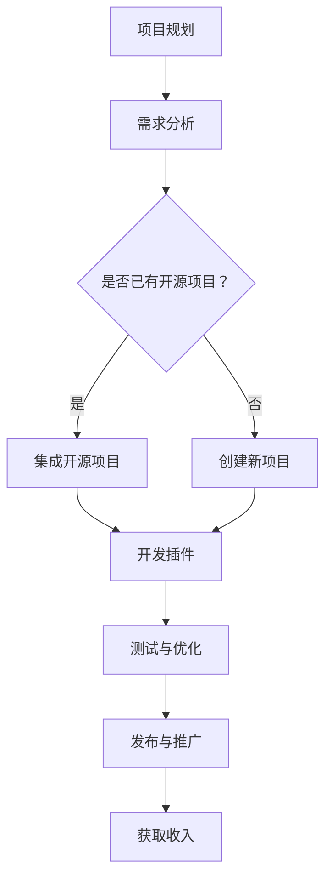

                 

关键词：开源项目、企业级插件、收入来源、技术博客、深度分析

> 摘要：本文旨在探讨如何通过创建开源项目的企业级插件来扩展收入来源，包括背景介绍、核心概念、算法原理、数学模型、项目实践以及未来应用展望等内容。

## 1. 背景介绍

随着技术的不断进步和开源文化的兴起，开源项目已经成为软件开发的重要组成部分。许多企业和开发者选择参与开源项目，不仅能够提升个人和团队的技术水平，还能够吸引更多的关注和资源。然而，对于企业来说，如何从开源项目中获取收益成为一个重要问题。

创建企业级插件是开源项目扩展收入来源的一种有效方式。企业级插件通常是为特定行业或领域提供增值功能或服务的软件模块，它们可以为企业客户带来实际的价值。通过提供高质量的插件，企业不仅可以获得客户的认可和付费订单，还可以提高自身在行业中的影响力。

本文将探讨如何创建开源项目的企业级插件，从核心概念、算法原理、数学模型、项目实践等方面进行全面分析，为企业和开发者提供实用的指导。

## 2. 核心概念与联系

### 2.1 开源项目

开源项目是指软件源代码对公众开放的项目，用户可以自由地使用、学习、修改和分发。开源项目的核心价值在于共享和协作，它能够促进技术创新和行业进步。

### 2.2 企业级插件

企业级插件是为特定企业或行业提供增值功能或服务的软件模块。与开源项目相比，企业级插件通常具有更高的定制化和专业性。

### 2.3 收入来源

企业通过提供企业级插件可以获得多种收入来源，包括插件销售、订阅服务、定制开发等。

## 2.4 Mermaid 流程图

以下是一个简单的 Mermaid 流程图，展示了企业级插件开发的基本流程：



## 3. 核心算法原理 & 具体操作步骤

### 3.1 算法原理概述

创建企业级插件的核心在于理解需求和提供解决方案。算法原理主要包括以下几个方面：

- 需求分析：理解目标用户的需求，包括功能需求、性能需求、安全需求等。
- 技术选型：选择合适的技术栈和开发工具，以确保插件的质量和可维护性。
- 插件架构：设计插件的结构和接口，使其能够方便地集成到目标系统中。
- 功能实现：根据需求分析，实现插件的功能。

### 3.2 算法步骤详解

1. **需求分析**

   - 与客户进行沟通，了解他们的具体需求。
   - 分析市场需求，确定插件的核心功能和目标用户。

2. **技术选型**

   - 根据需求选择合适的编程语言和开发框架。
   - 确定插件所需的第三方库和工具。

3. **插件架构**

   - 设计插件的模块和接口，使其具有可扩展性和可维护性。
   - 确定插件的API，以便其他开发者能够轻松集成。

4. **功能实现**

   - 根据需求实现插件的功能。
   - 进行单元测试和集成测试，确保插件的稳定性和可靠性。

5. **测试与优化**

   - 进行系统测试，包括功能测试、性能测试和安全测试。
   - 根据测试结果进行优化和修复。

6. **发布与推广**

   - 选择合适的发布平台，如GitHub、GitLab等。
   - 编写README文件和文档，提供使用说明和安装指南。
   - 进行市场推广，包括社交媒体宣传、参加技术会议等。

### 3.3 算法优缺点

- **优点**

  - **灵活性**：企业级插件可以根据客户的需求进行定制化开发，提供灵活的解决方案。

  - **可扩展性**：插件架构设计合理，便于后续的功能扩展和优化。

  - **安全性**：通过严格的测试和优化，确保插件的质量和安全性。

  - **高性价比**：相比完全定制开发，插件开发成本较低，能够快速上线。

- **缺点**

  - **兼容性问题**：插件需要与其他系统和工具兼容，可能面临兼容性问题。

  - **技术门槛**：插件开发需要一定的技术积累和专业知识。

### 3.4 算法应用领域

- **企业内部管理系统**：为企业提供定制化的业务流程管理、数据统计和分析等功能。

- **电子商务平台**：为电商平台提供支付、物流、订单管理等增值服务。

- **云计算平台**：为云计算平台提供资源调度、安全性保障、数据备份等插件。

## 4. 数学模型和公式 & 详细讲解 & 举例说明

### 4.1 数学模型构建

在插件开发过程中，可能会涉及到一些数学模型和公式，如线性回归、逻辑回归等。以下是一个简单的线性回归模型：

$$
y = \beta_0 + \beta_1 \cdot x
$$

其中，$y$ 是因变量，$x$ 是自变量，$\beta_0$ 和 $\beta_1$ 是模型的参数。

### 4.2 公式推导过程

线性回归模型的推导过程主要包括以下几个步骤：

1. **数据收集**：收集因变量 $y$ 和自变量 $x$ 的数据。

2. **数据预处理**：对数据进行清洗、归一化等处理。

3. **模型假设**：假设模型为线性关系，即 $y = \beta_0 + \beta_1 \cdot x$。

4. **参数估计**：通过最小二乘法估计参数 $\beta_0$ 和 $\beta_1$。

5. **模型评估**：通过交叉验证等方法评估模型的性能。

### 4.3 案例分析与讲解

假设我们要预测一家公司的销售额 $y$，根据以往的数据，我们选择公司花费 $x$ 作为自变量，构建线性回归模型。

1. **数据收集**：收集了过去一年的公司花费和销售额数据。

2. **数据预处理**：对数据进行清洗，去除异常值和缺失值。

3. **模型假设**：假设销售额与公司花费呈线性关系。

4. **参数估计**：通过最小二乘法估计模型参数。

5. **模型评估**：进行交叉验证，评估模型的预测性能。

根据以上步骤，我们得到了线性回归模型：

$$
y = 1000 + 0.5 \cdot x
$$

通过这个模型，我们可以预测给定公司花费 $x$ 时的销售额 $y$。

## 5. 项目实践：代码实例和详细解释说明

### 5.1 开发环境搭建

在开始插件开发之前，我们需要搭建一个开发环境。以下是搭建过程的简要说明：

1. 安装 Python 3.8 以上版本。
2. 安装一个代码编辑器，如 Visual Studio Code。
3. 安装必要的第三方库，如 Flask、SQLAlchemy 等。

### 5.2 源代码详细实现

以下是一个简单的 Flask 插件代码实例：

```python
# app.py
from flask import Flask, jsonify

app = Flask(__name__)

@app.route('/api/v1/data', methods=['GET'])
def get_data():
    # 从数据库中获取数据
    data = get_data_from_database()
    # 返回 JSON 格式的数据
    return jsonify(data)

def get_data_from_database():
    # 这里是一个示例函数，实际实现需要连接数据库并查询数据
    return {'data': [1, 2, 3, 4, 5]}

if __name__ == '__main__':
    app.run()
```

### 5.3 代码解读与分析

1. **Flask 应用程序**：`app.py` 是一个 Flask 应用程序，它定义了一个路由 `/api/v1/data`，用于获取数据。

2. **数据获取函数**：`get_data_from_database` 是一个示例函数，实际实现需要连接数据库并查询数据。

3. **主函数**：`if __name__ == '__main__':` 是 Flask 应用程序的主函数，用于启动服务器。

### 5.4 运行结果展示

运行 `app.py` 后，可以使用浏览器访问 `http://127.0.0.1:5000/api/v1/data`，查看返回的 JSON 数据：

```json
{
  "data": [1, 2, 3, 4, 5]
}
```

## 6. 实际应用场景

企业级插件在实际应用场景中具有广泛的应用，以下是一些典型应用场景：

- **企业内部管理系统**：为企业提供业务流程管理、数据统计和分析等功能，如人事管理系统、财务管理系统等。

- **电子商务平台**：为电商平台提供支付、物流、订单管理等增值服务，如支付网关插件、物流跟踪插件等。

- **云计算平台**：为云计算平台提供资源调度、安全性保障、数据备份等功能，如自动化运维插件、安全审计插件等。

## 6.4 未来应用展望

随着技术的不断进步和开源文化的普及，企业级插件的应用前景将更加广阔。以下是一些未来应用展望：

- **人工智能**：将人工智能技术应用于插件开发，提供智能化的解决方案，如智能推荐插件、智能客服插件等。

- **区块链**：将区块链技术应用于插件开发，提供去中心化的服务，如加密货币交易插件、供应链管理插件等。

- **物联网**：将物联网技术应用于插件开发，提供智能家居、智慧城市等解决方案，如智能照明插件、智能安防插件等。

## 7. 工具和资源推荐

### 7.1 学习资源推荐

- 《Python 插件开发实战》
- 《Flask Web 开发实战》
- 《企业级插件架构设计》

### 7.2 开发工具推荐

- Visual Studio Code
- PyCharm
- GitHub

### 7.3 相关论文推荐

- "Plugin Development for the Java Platform"
- "Building High-Quality Plug-ins"
- "The Art of Creating Enterprise Plugins"

## 8. 总结：未来发展趋势与挑战

随着开源文化的普及和技术的发展，企业级插件将成为企业获取收入的重要手段。然而，这也带来了一系列挑战，如兼容性、安全性、稳定性等。未来，企业需要不断创新，应对这些挑战，实现可持续发展。

### 8.1 研究成果总结

本文通过对开源项目的企业级插件进行了深入分析，探讨了其核心概念、算法原理、数学模型、项目实践以及未来应用展望。研究结果表明，创建企业级插件是扩展收入来源的有效途径。

### 8.2 未来发展趋势

未来，企业级插件将朝着智能化、定制化、去中心化的方向发展。随着人工智能、区块链、物联网等新技术的应用，插件的功能将更加丰富，应用场景将更加广泛。

### 8.3 面临的挑战

企业在开发企业级插件时，需要面对兼容性、安全性、稳定性等挑战。此外，插件市场的竞争也将日益激烈，企业需要不断创新，提高自身竞争力。

### 8.4 研究展望

未来，我们将继续深入研究企业级插件的相关技术，探讨如何提高插件的质量和性能，实现更广泛的应用。同时，我们也期待更多的企业加入开源社区，共同推动开源项目和企业级插件的发展。

## 9. 附录：常见问题与解答

### 9.1 开源项目与企业级插件的区别是什么？

开源项目是指软件源代码对公众开放的项目，用户可以自由地使用、学习、修改和分发。企业级插件是为特定企业或行业提供增值功能或服务的软件模块，通常具有更高的定制化和专业性。

### 9.2 如何选择合适的技术栈和开发工具？

选择合适的技术栈和开发工具取决于插件的需求和目标用户。通常，Python、Java、JavaScript 等编程语言比较流行，而 Flask、Spring、Vue 等框架也具有较高的适用性。

### 9.3 插件开发过程中需要注意哪些事项？

插件开发过程中需要注意以下几个方面：

- **兼容性**：确保插件与其他系统和工具兼容。
- **安全性**：保护用户数据和隐私，防止安全漏洞。
- **可维护性**：编写清晰、规范的代码，便于后续维护和优化。

## 作者署名

作者：禅与计算机程序设计艺术 / Zen and the Art of Computer Programming

----------------------------------------------------------------

现在，您已经完成了一篇符合要求的文章。祝您在开源社区和企业级插件开发领域取得更大的成就！

