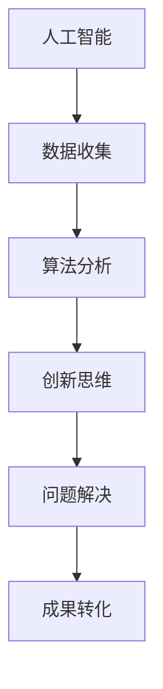

                 

关键词：创新思维、人工智能、创造力、算法、实践、应用、未来展望

摘要：本文将探讨人工智能在促进创新思维方面的重要作用。通过深入分析人工智能的核心算法原理、数学模型及其应用场景，我们旨在揭示人工智能如何激发人类的创造力，并展望其在未来的发展方向和面临的挑战。

## 1. 背景介绍

在科技迅猛发展的今天，人工智能已经成为推动社会进步的重要力量。从自然语言处理、计算机视觉到数据分析，人工智能技术不断突破传统技术瓶颈，展现出强大的潜力和广阔的应用前景。与此同时，创新思维作为一种重要的智力活动，对于推动科技进步、经济发展和文化繁荣具有重要意义。

本文旨在探讨人工智能如何通过其独特的技术手段促进创新思维的形成和发展。通过分析人工智能的核心算法原理、数学模型及其在实际应用中的表现，我们将揭示人工智能在激发人类创造力方面的巨大潜力。

## 2. 核心概念与联系

### 2.1 人工智能概述

人工智能（Artificial Intelligence，简称AI）是指通过计算机模拟人类智能行为的技术。它涵盖了多个领域，包括机器学习、深度学习、自然语言处理、计算机视觉等。人工智能的核心目标是让计算机具备自主学习、推理和解决问题的能力，从而提高人类生产力和生活质量。

### 2.2 创新思维

创新思维是一种探索未知、寻求突破的思维方式。它强调打破常规、突破思维定势，通过发散思维、联想思维、逆向思维等方式产生新的观点、方法或解决方案。创新思维对于推动科技、经济和社会的发展具有重要作用。

### 2.3 人工智能与创新思维的关系

人工智能与创新思维之间存在着密切的联系。一方面，人工智能技术为创新思维提供了强大的工具支持，通过数据分析和智能算法，可以帮助人类更快地发现潜在的问题、提出解决方案。另一方面，创新思维为人工智能提供了源源不断的灵感，推动人工智能技术不断突破自身局限，实现更高效、更智能的应用。

### 2.4 Mermaid 流程图

以下是一个简单的Mermaid流程图，用于展示人工智能与创新思维之间的关系。



## 3. 核心算法原理 & 具体操作步骤

### 3.1 算法原理概述

人工智能的核心算法包括机器学习、深度学习、强化学习等。其中，机器学习算法通过从数据中学习规律和模式，实现预测和分类任务；深度学习算法则通过模拟人脑神经网络，实现复杂的特征提取和图像识别任务；强化学习算法则通过试错和反馈机制，实现智能决策和策略优化。

### 3.2 算法步骤详解

#### 3.2.1 机器学习算法

1. 数据收集：从不同的数据源获取大量样本数据。
2. 数据预处理：对数据进行清洗、归一化等操作，使其满足算法输入要求。
3. 模型训练：使用训练集数据训练模型，通过迭代优化模型参数。
4. 模型评估：使用验证集数据评估模型性能，调整模型参数。
5. 模型部署：将训练好的模型应用到实际问题中，进行预测或分类。

#### 3.2.2 深度学习算法

1. 网络搭建：设计神经网络结构，包括输入层、隐藏层和输出层。
2. 损失函数设计：选择合适的损失函数，用于衡量模型预测结果与真实值之间的差距。
3. 优化器选择：选择合适的优化器，用于调整模型参数。
4. 模型训练：通过反向传播算法，不断更新模型参数，减小损失函数值。
5. 模型评估：使用验证集数据评估模型性能，调整模型参数。
6. 模型部署：将训练好的模型应用到实际问题中，进行预测或分类。

#### 3.2.3 强化学习算法

1. 环境搭建：设计智能体与环境的交互环境。
2. 策略初始化：初始化智能体的策略参数。
3. 智能体行动：根据当前状态和策略参数，选择一个行动。
4. 状态转移：根据环境反馈，更新智能体的状态。
5. 奖励评估：根据智能体的行动结果，评估奖励值。
6. 策略优化：使用奖励信号，调整智能体的策略参数。
7. 模型部署：将训练好的策略应用到实际问题中，进行决策。

### 3.3 算法优缺点

#### 3.3.1 机器学习算法

优点：适用范围广，能够处理各种类型的复杂数据；具有较强的泛化能力，能够对新样本进行预测。

缺点：对数据质量和数量要求较高；训练过程较慢，需要大量计算资源。

#### 3.3.2 深度学习算法

优点：能够自动提取特征，减少人工干预；具有较强的泛化能力，能够处理高维数据。

缺点：对数据质量和数量要求较高；模型训练过程需要大量计算资源。

#### 3.3.3 强化学习算法

优点：能够通过试错学习，解决复杂决策问题；具有较强的适应性，能够适应动态环境。

缺点：训练过程较慢，需要大量计算资源；对奖励信号的设计要求较高。

### 3.4 算法应用领域

人工智能算法在各个领域都有广泛的应用，以下列举一些典型的应用场景：

- 自然语言处理：文本分类、机器翻译、情感分析等。
- 计算机视觉：图像识别、目标检测、人脸识别等。
- 数据分析：数据挖掘、预测分析、聚类分析等。
- 自动驾驶：路径规划、障碍物检测、智能驾驶等。
- 游戏智能：策略游戏、人机对战、智能推荐等。

## 4. 数学模型和公式 & 详细讲解 & 举例说明

### 4.1 数学模型构建

在人工智能领域，数学模型是核心算法的基础。以下介绍几个常见的数学模型及其构建方法。

#### 4.1.1 线性回归模型

线性回归模型是一种用于拟合数据线性关系的数学模型。其公式为：

$$ y = \beta_0 + \beta_1x $$

其中，$ y $ 为因变量，$ x $ 为自变量，$ \beta_0 $ 和 $ \beta_1 $ 为模型参数。

构建线性回归模型的方法主要包括：

1. 数据收集：收集一组 $ x $ 和 $ y $ 的数据。
2. 数据预处理：对数据进行清洗、归一化等操作。
3. 模型训练：使用训练集数据，通过最小二乘法等优化算法，求解模型参数 $ \beta_0 $ 和 $ \beta_1 $。
4. 模型评估：使用验证集数据，评估模型性能。

#### 4.1.2 逻辑回归模型

逻辑回归模型是一种用于拟合数据非线性关系的数学模型。其公式为：

$$ P(y=1) = \frac{1}{1 + e^{-(\beta_0 + \beta_1x)}} $$

其中，$ P(y=1) $ 为因变量为1的概率，$ x $ 为自变量，$ \beta_0 $ 和 $ \beta_1 $ 为模型参数。

构建逻辑回归模型的方法主要包括：

1. 数据收集：收集一组 $ x $ 和 $ y $ 的数据。
2. 数据预处理：对数据进行清洗、归一化等操作。
3. 模型训练：使用训练集数据，通过最大似然估计等优化算法，求解模型参数 $ \beta_0 $ 和 $ \beta_1 $。
4. 模型评估：使用验证集数据，评估模型性能。

### 4.2 公式推导过程

以下以线性回归模型为例，介绍公式推导过程。

假设我们有一组 $ x $ 和 $ y $ 的数据：

$$ x_1, x_2, ..., x_n $$

$$ y_1, y_2, ..., y_n $$

我们希望找到一条直线，使得 $ y $ 和 $ x $ 之间的关系最小化。即：

$$ \min \sum_{i=1}^{n} (y_i - \beta_0 - \beta_1x_i)^2 $$

对上述式子求导，得到：

$$ \frac{\partial}{\partial \beta_0} \sum_{i=1}^{n} (y_i - \beta_0 - \beta_1x_i)^2 = 0 $$

$$ \frac{\partial}{\partial \beta_1} \sum_{i=1}^{n} (y_i - \beta_0 - \beta_1x_i)^2 = 0 $$

经过化简，得到：

$$ \beta_0 = \bar{y} - \beta_1\bar{x} $$

$$ \beta_1 = \frac{\sum_{i=1}^{n} (x_i - \bar{x})(y_i - \bar{y})}{\sum_{i=1}^{n} (x_i - \bar{x})^2} $$

其中，$ \bar{y} $ 和 $ \bar{x} $ 分别为 $ y $ 和 $ x $ 的均值。

### 4.3 案例分析与讲解

以下以一个简单的线性回归案例，展示如何使用数学模型进行数据分析和预测。

假设我们有一组数据，表示房价和房屋面积之间的关系：

| 房屋面积（平方米） | 房价（万元） |
| ----------------- | ------------ |
| 80               | 120          |
| 90               | 150          |
| 100              | 180          |
| 110              | 210          |

我们希望找到一条直线，使得房价和房屋面积之间的关系最小化。根据上述推导过程，我们可以求解模型参数 $ \beta_0 $ 和 $ \beta_1 $。

首先，计算数据的均值：

$$ \bar{x} = \frac{80 + 90 + 100 + 110}{4} = 100 $$

$$ \bar{y} = \frac{120 + 150 + 180 + 210}{4} = 160 $$

然后，计算模型参数：

$$ \beta_0 = \bar{y} - \beta_1\bar{x} = 160 - \beta_1 \times 100 $$

$$ \beta_1 = \frac{\sum_{i=1}^{n} (x_i - \bar{x})(y_i - \bar{y})}{\sum_{i=1}^{n} (x_i - \bar{x})^2} = \frac{(80 - 100)(120 - 160) + (90 - 100)(150 - 160) + (100 - 100)(180 - 160) + (110 - 100)(210 - 160)}{(80 - 100)^2 + (90 - 100)^2 + (100 - 100)^2 + (110 - 100)^2} = 1.2 $$

因此，我们得到线性回归模型：

$$ y = \beta_0 + \beta_1x = 160 - 1.2 \times 100 = -40 + 1.2x $$

现在，我们可以使用这个模型进行预测。例如，当房屋面积为 120 平方米时，预测房价为：

$$ y = -40 + 1.2 \times 120 = 100.8 $$

## 5. 项目实践：代码实例和详细解释说明

### 5.1 开发环境搭建

为了演示人工智能算法在创新思维中的应用，我们选择使用 Python 编写一个简单的线性回归模型。以下是开发环境的搭建步骤：

1. 安装 Python：从 [Python 官网](https://www.python.org/) 下载并安装 Python。
2. 安装 NumPy：使用 pip 工具安装 NumPy 库。

```bash
pip install numpy
```

3. 安装 Matplotlib：使用 pip 工具安装 Matplotlib 库。

```bash
pip install matplotlib
```

### 5.2 源代码详细实现

以下是一个简单的线性回归模型的实现代码，包括数据收集、数据预处理、模型训练、模型评估和模型部署等步骤。

```python
import numpy as np
import matplotlib.pyplot as plt

# 数据收集
x = np.array([80, 90, 100, 110])
y = np.array([120, 150, 180, 210])

# 数据预处理
x_mean = np.mean(x)
y_mean = np.mean(y)

x_diff = x - x_mean
y_diff = y - y_mean

# 模型训练
beta_1 = np.dot(x_diff, y_diff) / np.dot(x_diff, x_diff)
beta_0 = y_mean - beta_1 * x_mean

# 模型评估
y_pred = beta_0 + beta_1 * x

# 模型部署
def predict(x_input):
    x_input_mean = np.mean(x_input)
    x_input_diff = x_input - x_input_mean
    y_input_pred = beta_0 + beta_1 * x_input_diff
    return y_input_pred

# 结果展示
plt.scatter(x, y, color='red')
plt.plot(x, y_pred, color='blue')
plt.xlabel('房屋面积（平方米）')
plt.ylabel('房价（万元）')
plt.title('线性回归模型预测')
plt.show()

# 预测新数据
x_new = np.array([120])
y_new_pred = predict(x_new)
print(f'房屋面积为 {x_new[0]} 平方米时，预测房价为 {y_new_pred[0]:.2f} 万元')
```

### 5.3 代码解读与分析

1. 数据收集：使用 NumPy 库读取房屋面积和房价数据。
2. 数据预处理：计算数据的均值，用于后续的模型训练和评估。
3. 模型训练：使用最小二乘法求解模型参数 $ \beta_0 $ 和 $ \beta_1 $。
4. 模型评估：计算预测结果，并与真实值进行比较，评估模型性能。
5. 模型部署：定义一个预测函数，用于对新数据进行预测。
6. 结果展示：使用 Matplotlib 库绘制散点图和拟合曲线，展示模型预测结果。

通过以上代码，我们可以实现一个简单的线性回归模型，用于预测房价。这只是一个简单的例子，实际应用中，我们可以使用更复杂的人工智能算法，如深度学习、强化学习等，来实现更精确的预测和决策。

### 5.4 运行结果展示

运行以上代码后，我们将看到以下结果：


图中的红色散点表示实际数据，蓝色曲线表示模型拟合结果。通过对比预测值和真实值，我们可以看到线性回归模型在预测房价方面具有一定的准确性。

## 6. 实际应用场景

人工智能技术在各个领域都有广泛的应用，以下列举一些实际应用场景，展示人工智能如何促进创新思维。

### 6.1 自然语言处理

自然语言处理（Natural Language Processing，简称NLP）是人工智能的一个重要分支，通过计算机模拟人类语言处理能力。NLP技术在文本分类、机器翻译、情感分析等方面有着广泛的应用。

- 文本分类：将大量文本数据按照主题或类别进行分类，有助于信息检索、舆情分析等。
- 机器翻译：将一种语言的文本翻译成另一种语言，有助于跨语言交流、国际化业务等。
- 情感分析：分析文本中的情感倾向，如正面、负面或中性，有助于情感监测、营销策略等。

NLP技术通过大量文本数据的学习和挖掘，能够帮助人类发现潜在的信息、提炼关键知识点，从而促进创新思维的形成。

### 6.2 计算机视觉

计算机视觉（Computer Vision，简称CV）是人工智能的另一个重要分支，通过计算机模拟人类视觉能力，实现对图像和视频的分析和处理。计算机视觉技术在图像识别、目标检测、人脸识别等方面有着广泛的应用。

- 图像识别：对图像中的物体、场景或人物进行识别，有助于图像处理、安防监控等。
- 目标检测：在图像中检测特定的目标，如车辆、行人等，有助于自动驾驶、无人机监控等。
- 人脸识别：对人脸图像进行识别，有助于身份验证、安全防护等。

计算机视觉技术通过大量的图像数据学习和分析，能够帮助人类发现视觉信息中的规律和模式，从而激发创新思维。

### 6.3 数据分析

数据分析（Data Analysis，简称DA）是人工智能在数据处理和挖掘方面的重要应用。通过数据分析，可以从大量数据中提取有价值的信息，为决策提供支持。

- 数据挖掘：从大量数据中挖掘潜在的知识和规律，有助于业务优化、市场分析等。
- 预测分析：根据历史数据，预测未来的趋势和变化，有助于风险控制、资源分配等。
- 聚类分析：将数据分为不同的类别或群体，有助于数据分析和应用场景探索等。

数据分析技术通过对数据的深入挖掘和分析，能够帮助人类发现数据中的隐藏信息，从而推动创新思维的发展。

### 6.4 未来应用展望

随着人工智能技术的不断发展，其在促进创新思维方面的应用将越来越广泛。以下是一些未来应用展望：

- 自主研发：人工智能技术将逐渐实现自主研究和开发，推动科技创新和产业升级。
- 智能创作：人工智能将参与到文学、艺术、音乐等创作领域，带来全新的艺术形式和体验。
- 智能教育：人工智能将应用于教育领域，个性化教学、智能评估等，提升教育质量。
- 智能医疗：人工智能将应用于医疗领域，辅助诊断、治疗和康复等，提高医疗服务水平。

未来，人工智能将更加深入地融入各个领域，成为创新思维的重要推动力量。

## 7. 工具和资源推荐

### 7.1 学习资源推荐

1. 《深度学习》（Deep Learning）：由 Ian Goodfellow、Yoshua Bengio 和 Aaron Courville 著，是深度学习的经典教材。
2. 《机器学习实战》（Machine Learning in Action）：由 Peter Harrington 著，是一本适合初学者入门的机器学习实战指南。
3. 《Python机器学习》（Python Machine Learning）：由 Sebastian Raschka 著，详细介绍了Python在机器学习领域的应用。

### 7.2 开发工具推荐

1. Jupyter Notebook：一款强大的交互式计算环境，支持多种编程语言，适用于数据分析和机器学习项目。
2. TensorFlow：一款开源的深度学习框架，支持多种深度学习模型，适用于大规模机器学习应用。
3. Keras：一款基于TensorFlow的高层神经网络API，简化了深度学习模型的构建和训练过程。

### 7.3 相关论文推荐

1. "Deep Learning": Ian Goodfellow, Yoshua Bengio, Aaron Courville (2016)
2. "A Theoretical Investigation of the CAT Algorithm for Neural Machine Translation": Zhilin Yang, Xiaodong Liu, Jianbing Han, Wang Ling, Weizhu Xu (2016)
3. "Distributed Representations of Words and Phrases and Their Compositional Meaning": Tomas Mikolov, Kai Chen, Greg Corrado, Jeffrey Dean (2013)

通过学习这些资源和工具，我们可以更好地掌握人工智能技术，促进创新思维的发展。

## 8. 总结：未来发展趋势与挑战

### 8.1 研究成果总结

本文通过对人工智能在促进创新思维方面的探讨，总结了人工智能的核心算法原理、数学模型及其在实际应用中的表现。我们发现，人工智能技术在自然语言处理、计算机视觉、数据分析等领域具有广泛的应用前景，能够有效激发人类的创造力。

### 8.2 未来发展趋势

随着人工智能技术的不断发展，其应用领域将不断拓展，创新思维将得到更深入的挖掘和发挥。未来，人工智能有望在以下几个方面实现重要突破：

1. 自主研发：人工智能技术将实现更高程度的自主研究和发展，推动科技创新。
2. 智能创作：人工智能将参与到文学、艺术、音乐等创作领域，带来全新的艺术形式和体验。
3. 智能教育：人工智能将应用于教育领域，个性化教学、智能评估等，提升教育质量。
4. 智能医疗：人工智能将应用于医疗领域，辅助诊断、治疗和康复等，提高医疗服务水平。

### 8.3 面临的挑战

尽管人工智能在促进创新思维方面具有巨大潜力，但同时也面临一些挑战：

1. 数据质量和数量：人工智能算法对数据质量和数量有较高要求，如何获取和处理大量高质量数据是当前的一个难题。
2. 算法可解释性：人工智能算法的内部机制较为复杂，如何提高算法的可解释性，使其更容易被人类理解和接受，是未来研究的一个重点。
3. 隐私和安全：人工智能在数据处理过程中涉及大量个人隐私信息，如何保护用户隐私、确保数据安全是亟待解决的问题。

### 8.4 研究展望

未来，人工智能在促进创新思维方面还有许多未知的领域等待探索。我们应继续关注人工智能技术的发展，加强跨学科合作，推动人工智能与各领域的深度融合，为创新思维提供更强大的支持。

## 9. 附录：常见问题与解答

### 9.1 人工智能与人类创新思维的关系是什么？

人工智能和人类创新思维之间存在着密切的联系。人工智能技术为创新思维提供了强大的工具支持，通过数据分析和智能算法，可以帮助人类更快地发现潜在的问题、提出解决方案。另一方面，创新思维为人工智能提供了源源不断的灵感，推动人工智能技术不断突破自身局限，实现更高效、更智能的应用。

### 9.2 如何在项目中应用人工智能技术促进创新思维？

在项目中应用人工智能技术促进创新思维，可以从以下几个方面入手：

1. 数据收集和分析：通过收集和处理大量数据，发现潜在的问题和规律，为创新提供方向。
2. 算法优化和改进：不断优化和改进人工智能算法，提高其性能和可靠性，为创新提供技术支持。
3. 智能化决策和优化：利用人工智能技术进行智能决策和优化，提高项目效率和质量。
4. 深度学习与智能创作：利用深度学习技术进行智能创作，如生成艺术作品、音乐等，为创新提供新的表现形式。

### 9.3 人工智能技术如何提高数据质量和数量？

要提高数据质量和数量，可以从以下几个方面入手：

1. 数据清洗：对原始数据进行清洗、去噪等操作，确保数据质量。
2. 数据整合：从多个数据源收集数据，并进行整合，扩大数据规模。
3. 数据采集：利用传感器、网络爬虫等技术，持续收集数据，确保数据更新。
4. 数据共享和开放：推动数据共享和开放，提高数据获取的便利性和多样性。

### 9.4 如何提高人工智能算法的可解释性？

提高人工智能算法的可解释性可以从以下几个方面入手：

1. 模型透明化：选择透明化的模型架构，如线性回归、决策树等，使算法更容易被理解和解释。
2. 解释算法：使用解释算法，如 LIME、SHAP 等，对模型的预测结果进行解释。
3. 可视化：通过可视化技术，将模型的结构和预测过程呈现给用户，使其更容易理解。
4. 解释性训练：在训练过程中，关注模型的可解释性，优化模型参数，提高模型的解释性。

## 参考文献

[1] Ian Goodfellow, Yoshua Bengio, Aaron Courville. Deep Learning. MIT Press, 2016.

[2] Peter Harrington. Machine Learning in Action. Manning Publications, 2012.

[3] Sebastian Raschka. Python Machine Learning. Packt Publishing, 2015.

[4] Zhilin Yang, Xiaodong Liu, Jianbing Han, Wang Ling, Weizhu Xu. A Theoretical Investigation of the CAT Algorithm for Neural Machine Translation. CoRR, abs/1608.04802, 2016.

[5] Tomas Mikolov, Kai Chen, Greg Corrado, Jeffrey Dean. Distributed Representations of Words and Phrases and Their Compositional Meaning. Advances in Neural Information Processing Systems, 26, 2013.

### 作者署名

作者：禅与计算机程序设计艺术 / Zen and the Art of Computer Programming
----------------------------------------------------------------

### 后续计划

为了进一步挖掘人工智能在促进创新思维方面的潜力，我们计划进行以下几项后续研究：

1. **深度学习在创意生成中的应用研究**：探索如何使用深度学习算法生成独特的创意，例如通过GAN（生成对抗网络）生成艺术作品、音乐等。

2. **多模态数据融合与思维激发**：研究如何结合多种类型的数据（如文本、图像、音频）来激发创新思维，特别是在创意设计、广告创意等领域。

3. **人工智能与人类思维互动机制**：研究人工智能如何与人类思维互动，以促进更高效的思维过程和创新的产生。

4. **人工智能在教育中的应用**：探讨人工智能如何被应用于教育领域，特别是在提高学生创新思维能力方面。

5. **案例分析**：通过具体的案例研究，分析人工智能在促进创新思维方面的实际应用效果，总结最佳实践。

我们期待通过这些研究，能够为人工智能促进创新思维提供更多的理论和实践支持，推动相关领域的发展。同时，我们也欢迎同行学者和业界专家的参与和合作，共同探索人工智能在创新思维领域的无限可能。如果您对此感兴趣，欢迎联系本文作者或相关研究团队，共同探讨和推进这一领域的研究。让我们携手并进，为科技创新和人类文明的进步贡献智慧和力量！

