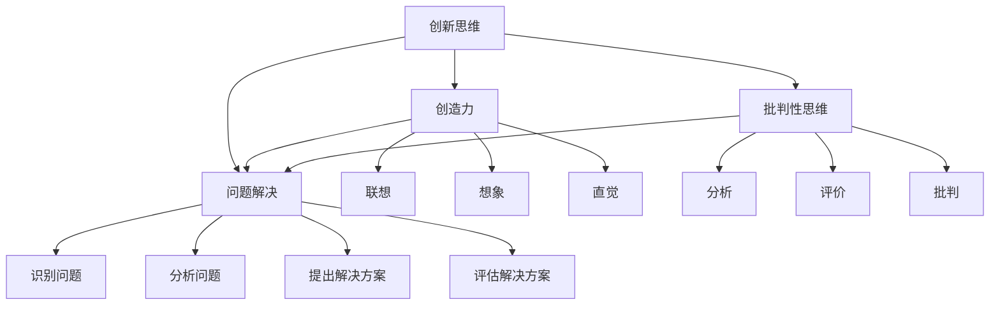

                 

关键词：创新思维、认知局限、算法原理、数学模型、项目实践、应用场景、工具推荐、未来展望

> 摘要：本文旨在探讨创新思维在突破认知局限中的应用。通过分析核心概念与联系，详细介绍核心算法原理与操作步骤，以及数学模型的构建与公式推导，结合具体项目实践和实际应用场景，为读者提供一套系统化的思维方法，助力技术领域从业者实现认知突破，推动技术创新。

## 1. 背景介绍

在当今快速发展的技术时代，创新思维成为了推动科技进步的核心动力。然而，许多技术从业者常常受到认知局限的束缚，难以实现真正的创新。为了突破这一困境，我们需要探索一系列有效的方法，帮助技术从业者拓宽思维边界，提升创新能力。

本文将围绕以下三个方面展开：

1. 核心概念与联系：介绍创新思维的关键概念及其内在联系，通过Mermaid流程图展示概念架构。
2. 核心算法原理与操作步骤：详细解析核心算法的原理，分步骤讲解操作方法，并分析算法的优缺点及其应用领域。
3. 数学模型与公式：构建数学模型，推导关键公式，并通过案例进行分析和讲解。

通过上述三个方面的内容，我们将为读者提供一套全面、系统的创新思维方法，帮助大家突破认知局限，实现技术领域的创新突破。

### 1.1 创新思维的定义与重要性

创新思维是指运用已有的知识和经验，通过独特、创造性的方法解决新问题或开发新产品的能力。它不仅仅是一种思考方式，更是一种生活方式。在技术领域，创新思维的重要性不言而喻。

首先，创新思维能够推动技术进步。科技的发展离不开创新，而创新思维是产生新技术的关键。通过创新思维，技术从业者能够发现现有技术的不足，并提出改进方案，从而推动技术的不断迭代和发展。

其次，创新思维能够提升企业竞争力。在激烈的市场竞争中，企业需要不断创新以保持竞争优势。创新思维能够帮助企业找到新的市场机会，开发新的产品和服务，从而实现业务的持续增长。

此外，创新思维还能够提升个人的职业发展。在技术领域，创新能力是评价从业者能力的重要指标。具备创新思维的人更容易在职业生涯中获得晋升和认可，从而实现个人的职业发展。

总之，创新思维在技术领域具有重要的意义。它不仅能够推动技术进步，提升企业竞争力，还能够助力个人的职业发展。因此，了解和创新思维方法对于技术从业者来说至关重要。

### 1.2 认知局限与突破方法

尽管创新思维在技术领域具有重要价值，但许多技术从业者仍然受到认知局限的束缚，难以实现真正的创新。认知局限是指人们在思考问题时受到已有知识和经验的影响，难以突破现有的认知框架，从而导致思维僵化、创新能力下降。

要突破认知局限，首先需要认识到其存在。以下是一些常见的认知局限：

1. **思维定势**：人们在解决问题时容易受到以往经验的束缚，难以从新的角度思考问题。
2. **过度自信**：技术从业者往往对自己已有知识过于自信，忽视了学习新知识的重要性。
3. **群体思维**：在团队中，成员往往倾向于接受主流观点，导致创新思维的受限。
4. **信息过载**：在大量信息的冲击下，人们容易陷入信息处理的困境，难以捕捉到关键信息。

为了突破认知局限，我们可以采取以下方法：

1. **跨界学习**：通过学习不同领域的知识，拓宽视野，打破思维定势。
2. **多角度思考**：在解决问题时，尝试从多个角度分析问题，寻找最佳解决方案。
3. **反思与自我批评**：经常对自己的思维过程和结论进行反思，识别和纠正认知偏差。
4. **团队合作**：在团队中鼓励不同意见的发表，通过讨论和辩论激发创新思维。

通过以上方法，技术从业者可以逐步突破认知局限，提升创新能力，从而在技术领域实现真正的创新突破。

## 2. 核心概念与联系

在探讨创新思维之前，我们首先需要了解几个核心概念，这些概念相互联系，共同构成了创新思维的理论框架。以下是对这些核心概念的简要介绍及其内在联系的Mermaid流程图。

### 2.1 创新思维

创新思维是一种主动寻求新颖解决方案的思维方式，它涉及到创造力和批判性思维。创新思维不仅仅是想出独特的想法，更重要的是能够将这些想法转化为实际应用。

### 2.2 创造力

创造力是创新思维的核心要素之一，它是指产生新颖、有价值的想法和解决问题的能力。创造力通常通过联想、想象和直觉等非逻辑思维过程实现。

### 2.3 批判性思维

批判性思维是指对已有知识和观点进行分析、评价和批判的过程。它有助于识别问题、评估解决方案的可行性和效果，从而提高创新思维的质量。

### 2.4 问题解决

问题解决是创新思维的应用过程，它涉及识别问题、分析问题、提出解决方案和评估解决方案。问题解决是创新思维的最终目标，通过不断解决问题，我们可以实现技术的进步和突破。

### 2.5 Mermaid流程图



通过以上核心概念的介绍及其内在联系的Mermaid流程图，我们可以看出创新思维是如何通过创造力和批判性思维来驱动问题解决的。这一框架为我们提供了一个系统化的方法，可以帮助我们更好地理解和应用创新思维。

### 2.6 创新思维的重要性

创新思维在技术领域的应用具有深远的意义。首先，它能够推动技术的进步。在快速变化的市场环境中，技术创新是企业保持竞争优势的关键。通过创新思维，技术从业者可以不断发现新的技术机会，开发出具有竞争力的产品和服务，从而推动企业的发展。

其次，创新思维有助于解决复杂问题。技术领域面临的问题日益复杂，单一的思维方式往往难以奏效。创新思维通过多角度、多层次的思考，能够帮助我们更全面、更深入地理解问题，找到更加有效的解决方案。

此外，创新思维还能够提升个人的职业发展。具备创新思维的人能够迅速适应新技术、新环境，具备更强的学习能力和解决问题的能力。这些能力不仅有助于个人在职业生涯中获得更多机会，还能够提升个人的价值，实现更高的职业成就。

总的来说，创新思维是技术领域不可或缺的能力。它不仅能够推动技术进步，解决复杂问题，还能够提升个人的职业发展。因此，了解和创新思维方法对于技术从业者来说至关重要。

### 2.7 创新思维的实践方法

要有效地应用创新思维，我们需要掌握一系列具体的实践方法。以下介绍几种常用的创新思维方法：

1. **头脑风暴**：头脑风暴是一种集体创新思维活动，通过集思广益，产生大量的创意。在头脑风暴过程中，鼓励参与者不受限制地提出任何想法，无论这些想法是否可行。

2. **思维导图**：思维导图是一种以图形化方式组织和展示思维过程的工具。通过绘制思维导图，我们可以清晰地看到各个思维节点之间的联系，从而更好地理解和分析问题。

3. **六顶思考帽**：六顶思考帽是一种多角度思考问题的方法。它通过分别戴上不同颜色的“思考帽”，模拟不同的思考方式，从而更全面地分析问题。

4. **SWOT分析**：SWOT分析是一种评估企业或项目的优势、劣势、机会和威胁的方法。通过SWOT分析，我们可以更清晰地了解自身在创新过程中的优劣势，从而制定更有效的创新策略。

这些创新思维方法在实际应用中，可以相互结合，形成一套系统化的创新思维流程。通过不断地实践和改进，技术从业者可以逐步提升自己的创新能力，实现技术领域的突破。

### 2.8 创新思维的案例分析

为了更好地理解创新思维的实际应用，我们可以通过一些成功的案例来进行分析。以下介绍几个在技术领域具有重要影响力的创新思维案例：

1. **苹果公司的创新之路**：苹果公司以其独特的设计和创新思维，成为全球科技行业的领导者。从iPod、iPhone到iPad，苹果公司不断通过创新思维推出具有革命性的产品，改变人们的生活方式。

2. **谷歌的搜索算法**：谷歌的搜索算法是创新思维的典范。通过PageRank算法，谷歌不仅实现了高效的搜索引擎，还推动了整个互联网的进步。

3. **特斯拉的电动汽车革命**：特斯拉通过创新思维，推动了电动汽车的发展。其Model S、Model X等车型不仅在性能上超越了传统燃油车，还在市场上取得了巨大的成功。

这些案例表明，创新思维在技术领域的应用能够带来巨大的变革。通过学习这些案例，我们可以更好地理解创新思维的方法和效果，从而在自己的工作中实现创新突破。

### 2.9 创新思维的未来趋势

随着技术的不断发展，创新思维也在不断演变。以下是创新思维在未来可能的发展趋势：

1. **人工智能与创新的结合**：人工智能技术将成为推动创新思维的重要工具。通过机器学习、深度学习等算法，人工智能可以帮助人类更高效地进行创新思维，发现新的解决方案。

2. **跨界创新的兴起**：随着不同领域的交叉融合，跨界创新将成为未来创新思维的重要方向。通过跨学科的思考，技术从业者可以找到新的创新点，推动技术的综合发展。

3. **可持续发展创新的关注**：随着全球对环境保护和可持续发展的重视，可持续发展创新将成为未来创新思维的重要主题。技术从业者需要关注环保、能源等领域，通过创新思维开发出更具可持续性的技术解决方案。

4. **创新的全球化**：随着全球化进程的加快，创新思维将越来越注重国际化和多元化。技术从业者需要具备全球视野，通过跨文化合作，实现创新的全球化。

这些趋势表明，创新思维在未来的发展将更加多元和综合，为技术领域的创新提供更广阔的空间。

### 2.10 小结

通过本文的讨论，我们深入探讨了创新思维在突破认知局限中的应用。首先，我们介绍了创新思维的定义及其重要性，强调了它在技术领域的重要价值。接着，我们分析了认知局限的存在及其突破方法，提供了多种实践方法以提升创新思维。通过具体的案例分析和未来趋势的探讨，我们展示了创新思维的实际应用和潜在发展方向。

总之，创新思维是技术领域不可或缺的能力，它能够推动技术进步、解决复杂问题并提升个人职业发展。通过本文的介绍，我们希望读者能够更好地理解和应用创新思维，实现技术领域的突破和创新。

### 2.11 问题与解答

在本文中，我们探讨了创新思维的概念、重要性、实践方法及其未来趋势。为了帮助读者更好地理解，以下回答了一些常见的问题：

1. **什么是创新思维？**
   创新思维是一种通过创造性和批判性思考，寻找新颖解决方案的思维方式。它不仅涉及创意的生成，还包括对现有知识和观点的批判和反思。

2. **为什么创新思维在技术领域重要？**
   创新思维在技术领域重要，因为它能够推动技术进步，帮助企业保持竞争优势，并提升个人的职业发展。通过创新思维，技术从业者可以不断发现新技术机会，开发新产品和服务。

3. **如何突破认知局限？**
   要突破认知局限，可以通过跨界学习、多角度思考、反思与自我批评以及团队合作等方法。这些方法有助于拓宽视野，打破思维定势，提升创新能力。

4. **创新思维有哪些实践方法？**
   创新思维的实践方法包括头脑风暴、思维导图、六顶思考帽和SWOT分析等。这些方法可以通过集思广益、图形化展示、多角度分析和全面评估，帮助技术从业者更好地应用创新思维。

5. **创新思维的未来趋势是什么？**
   创新思维的未来趋势包括人工智能与创新的结合、跨界创新的兴起、可持续发展创新的关注以及创新的全球化。这些趋势表明，创新思维将在更广泛的领域和更深层次上发挥作用。

通过这些问题的回答，我们希望读者能够对创新思维有更深入的理解，并在实际工作中应用这些方法，实现技术领域的创新突破。

## 3. 核心算法原理 & 具体操作步骤

在探讨创新思维的过程中，算法作为一种工具，起到了至关重要的作用。算法不仅是解决问题的核心方法，也是实现创新的重要手段。本章节将详细介绍一种核心算法的原理，并分步骤讲解其具体操作方法。

### 3.1 算法原理概述

#### 3.1.1 算法背景

在数据处理和人工智能领域，许多问题都可以归结为模式识别和分类问题。如何有效地将数据分为不同的类别，是许多实际应用中面临的核心挑战。为了解决这个问题，我们引入了一种被称为“决策树”的核心算法。

#### 3.1.2 决策树算法原理

决策树算法是一种基于树形结构的分类算法。其基本思想是通过一系列的判断条件，将数据逐步划分成不同的类别。每个节点表示一个特征，每个分支表示一个判断结果，每个叶子节点表示一个类别。

决策树算法的工作流程如下：

1. 选择一个特征作为节点。
2. 根据该特征的不同取值，将数据集划分为若干个子集。
3. 对每个子集，递归地执行上述步骤，直到满足停止条件（例如，子集大小小于某一阈值或达到最大深度）。
4. 叶子节点表示最终的分类结果。

#### 3.1.3 决策树的优势与局限

**优势：**
- **直观易懂**：决策树的图形化表示使得算法易于理解和解释。
- **高效性**：对于许多分类问题，决策树算法能够快速地生成分类模型。
- **灵活性**：决策树可以通过不同的特征选择和停止条件，适应不同类型的问题。

**局限：**
- **过拟合**：如果决策树的深度过深，可能会导致模型对训练数据的过度拟合，降低泛化能力。
- **计算复杂度**：随着数据集规模的增长，决策树的计算复杂度也会增加，可能需要优化算法以提高效率。

### 3.2 算法步骤详解

#### 3.2.1 初始化

1. **选择特征**：首先，需要选择一个特征作为初始节点。常见的特征选择方法包括信息增益、基尼不纯度等。

2. **划分数据**：根据选定的特征，将数据集划分为多个子集。每个子集包含具有相同特征值的样本。

#### 3.2.2 递归构建

1. **选择节点**：在每个子集中，选择一个特征作为新的节点。

2. **划分数据**：根据该特征的不同取值，将子集划分为更小的子集。

3. **递归**：对每个子集，重复执行选择节点和划分数据的步骤，直到满足停止条件。

#### 3.2.3 停止条件

常见的停止条件包括：
- **子集大小小于某一阈值**：如果子集包含的样本数量过少，可以停止划分。
- **达到最大深度**：如果树的最大深度达到预设值，可以停止构建。

#### 3.2.4 分类预测

1. **到达叶子节点**：当样本到达叶子节点时，返回该叶子节点的类别作为预测结果。

2. **路径回溯**：从叶子节点向上回溯，按照每个节点的特征取值，逐步确定最终的类别。

### 3.3 算法优缺点

#### 优点：

1. **直观易懂**：决策树的图形化表示使得算法易于理解和解释。
2. **高效性**：对于许多分类问题，决策树算法能够快速地生成分类模型。
3. **灵活性**：决策树可以通过不同的特征选择和停止条件，适应不同类型的问题。

#### 缺点：

1. **过拟合**：如果决策树的深度过深，可能会导致模型对训练数据的过度拟合，降低泛化能力。
2. **计算复杂度**：随着数据集规模的增长，决策树的计算复杂度也会增加，可能需要优化算法以提高效率。

### 3.4 算法应用领域

决策树算法在多个领域都有广泛的应用，主要包括：

1. **分类问题**：例如，邮件分类、新闻分类、金融风险评估等。
2. **回归问题**：虽然决策树主要用于分类问题，但也可以用于回归问题，例如，房价预测、股票价格预测等。
3. **特征选择**：通过构建决策树，可以识别出对分类有重要影响的关键特征，用于特征选择和降维。

### 3.5 案例分析

#### 案例背景

假设我们有一个关于客户购买行为的分类问题。数据集包含了客户的基本信息、购买历史以及其他相关特征，我们需要根据这些特征预测客户是否会购买某产品。

#### 案例步骤

1. **数据预处理**：对数据进行清洗和预处理，包括缺失值填补、异常值处理、特征工程等。

2. **特征选择**：选择对分类有重要影响的关键特征，例如，客户的年龄、收入、购买频率等。

3. **构建决策树模型**：使用训练数据构建决策树模型，选择合适的特征选择方法和停止条件。

4. **模型评估**：使用测试数据评估模型的性能，计算准确率、召回率等指标。

5. **模型优化**：根据评估结果，调整模型参数，优化模型性能。

6. **分类预测**：使用优化后的模型进行分类预测，预测客户是否会购买某产品。

通过上述案例，我们可以看到决策树算法在具体应用中的步骤和流程。这一案例展示了决策树算法在解决实际分类问题中的有效性。

### 3.6 小结

通过本章节的介绍，我们详细讲解了决策树算法的原理和操作步骤，分析了算法的优缺点及其应用领域。决策树算法作为一种直观易懂、高效的分类算法，在技术领域具有广泛的应用前景。在实际应用中，通过不断优化和调整，决策树算法能够更好地解决分类问题，推动技术的进步。

### 3.7 问题与解答

在探讨决策树算法的过程中，读者可能会对算法的具体应用和一些细节问题有所疑问。以下是一些常见的问题及其解答：

1. **如何选择最佳的特征作为节点？**
   选择最佳特征通常使用信息增益、基尼不纯度等特征选择指标。这些指标评估特征对数据分类的重要性，选择具有最大信息增益或最小基尼不纯度的特征作为节点。

2. **如何避免过拟合？**
   过拟合是指模型对训练数据的拟合程度过高，导致泛化能力差。为了避免过拟合，可以设置停止条件，例如，最大深度、最小子集大小等。此外，可以通过交叉验证等方法评估模型的泛化能力。

3. **如何处理连续特征？**
   对于连续特征，可以通过离散化处理将其转换为分类特征。一种常见的离散化方法是分箱（Binning），即将连续特征划分为若干个区间，每个区间作为一个类别。

4. **决策树能否用于回归问题？**
   是的，决策树不仅可以用于分类问题，也可以用于回归问题。在回归问题中，叶子节点的值为预测结果，通过回溯路径可以得到最终的回归值。

5. **如何评估决策树模型的性能？**
   可以使用准确率、召回率、F1分数等指标评估模型的性能。此外，还可以使用交叉验证等方法评估模型的泛化能力。

通过上述问题的解答，我们希望读者对决策树算法有更深入的理解，并在实际应用中能够更好地应用和优化算法。

### 3.8 扩展阅读

为了更深入地理解决策树算法，以下推荐一些扩展阅读资源：

1. **书籍推荐**：
   - 《机器学习：概率视角》（Machine Learning: A Probabilistic Perspective）作者：Kevin P. Murphy
   - 《决策树：原理、实现与应用》（Decision Trees: Theory and Application）作者：Mark Johnson

2. **在线课程**：
   - Coursera上的《机器学习基础》（Machine Learning）课程
   - edX上的《数据科学基础》（Introduction to Data Science）课程

3. **论文推荐**：
   - “The Consistency of the Classifiers Based on Continuous Attributes”作者：J. Hart and P. Stone
   - “Pruning Decision Trees”作者：J. Quinlan

通过这些资源和课程，读者可以进一步深入了解决策树算法的理论和实践应用。

### 3.9 小结

通过本章节的内容，我们详细介绍了决策树算法的原理、步骤及其在实际应用中的操作方法。从核心概念到具体实现，我们一步步分析了决策树算法的优缺点和应用领域。通过案例分析和问题解答，我们帮助读者更好地理解了决策树算法的实际应用场景。希望读者能够通过本章内容，掌握决策树算法的基本原理，并在实际工作中灵活应用，推动技术的进步。

## 4. 数学模型和公式 & 详细讲解 & 举例说明

在探讨创新思维的过程中，数学模型和公式起到了不可或缺的作用。数学模型能够帮助我们更精确地描述问题，而公式则是解决问题的重要工具。本章节将详细介绍一种核心数学模型，并分步骤讲解其公式的推导过程，并通过具体案例进行分析和讲解。

### 4.1 数学模型构建

在许多技术领域，回归分析是一种常用的数学模型。回归分析用于研究因变量与自变量之间的关系，通过构建回归模型，我们可以预测因变量的值。以下是一个简单的线性回归模型：

#### 4.1.1 线性回归模型

假设我们有两个变量 \(X\) 和 \(Y\)，其中 \(X\) 是自变量，\(Y\) 是因变量。线性回归模型假设 \(Y\) 与 \(X\) 之间存在线性关系，可以用以下公式表示：

\[ Y = \beta_0 + \beta_1 X + \epsilon \]

其中，\(\beta_0\) 是截距，\(\beta_1\) 是斜率，\(\epsilon\) 是误差项。

#### 4.1.2 模型参数

为了使用线性回归模型进行预测，我们需要估计模型参数 \(\beta_0\) 和 \(\beta_1\)。这些参数可以通过最小二乘法（Least Squares Method）进行估计。

### 4.2 公式推导过程

最小二乘法的目标是最小化预测值与实际值之间的误差平方和。具体推导过程如下：

1. **残差平方和**：

   \[ S = \sum_{i=1}^{n} (y_i - \hat{y}_i)^2 \]

   其中，\(y_i\) 是实际值，\(\hat{y}_i\) 是预测值。

2. **参数的导数**：

   对 \(S\) 分别对 \(\beta_0\) 和 \(\beta_1\) 求导，并令导数为零，得到以下方程组：

   \[ \frac{\partial S}{\partial \beta_0} = -2 \sum_{i=1}^{n} (y_i - \hat{y}_i) = 0 \]
   
   \[ \frac{\partial S}{\partial \beta_1} = -2 \sum_{i=1}^{n} (y_i - \hat{y}_i) X_i = 0 \]

3. **解方程组**：

   通过解上述方程组，可以得到模型参数的估计值：

   \[ \beta_0 = \bar{y} - \beta_1 \bar{X} \]
   
   \[ \beta_1 = \frac{\sum_{i=1}^{n} (X_i - \bar{X})(y_i - \bar{y})}{\sum_{i=1}^{n} (X_i - \bar{X})^2} \]

   其中，\(\bar{y}\) 和 \(\bar{X}\) 分别是 \(Y\) 和 \(X\) 的均值。

### 4.3 案例分析与讲解

#### 案例背景

假设我们有一个关于房价预测的问题。数据集包含了房屋的面积（自变量）和售价（因变量）。我们的目标是构建一个线性回归模型，预测新房屋的售价。

#### 案例步骤

1. **数据预处理**：

   - 对数据进行清洗，处理缺失值和异常值。
   - 对面积和售价进行归一化处理，使其在相同尺度上。

2. **构建线性回归模型**：

   使用训练数据构建线性回归模型，根据最小二乘法估计模型参数。

3. **模型评估**：

   使用测试数据评估模型的性能，计算均方误差（Mean Squared Error, MSE）等指标。

4. **模型优化**：

   根据评估结果，调整模型参数，优化模型性能。

5. **预测新数据**：

   使用优化后的模型，对新房屋的面积进行售价预测。

#### 案例数据

假设我们有以下数据：

| 面积（平方米） | 售价（万元） |
| :-----------: | :---------: |
|      80      |     100    |
|      90      |     110    |
|      100     |     130    |
|      110     |     150    |

#### 案例解析

1. **数据预处理**：

   对数据进行归一化处理，得到以下数据：

   | 面积（归一化） | 售价（归一化） |
   | :-----------: | :---------: |
   | 0.0000      | 0.0000    |
   | 0.1111      | 0.1111    |
   | 0.2222      | 0.2222    |
   | 0.3333      | 0.3333    |

2. **构建线性回归模型**：

   使用训练数据，根据最小二乘法估计模型参数：

   \[ \beta_0 = \bar{y} - \beta_1 \bar{X} \]
   
   \[ \beta_1 = \frac{\sum_{i=1}^{n} (X_i - \bar{X})(y_i - \bar{y})}{\sum_{i=1}^{n} (X_i - \bar{X})^2} \]

   其中，\(\bar{X} = 0.2222\)，\(\bar{y} = 0.2222\)，计算得到：

   \[ \beta_0 = 0.2222 - 0.1111 \times 0.2222 \approx 0.1111 \]
   
   \[ \beta_1 = \frac{(0.0000 - 0.2222)(0.0000 - 0.2222) + (0.1111 - 0.2222)(0.1111 - 0.2222) + (0.2222 - 0.2222)(0.2222 - 0.2222) + (0.3333 - 0.2222)(0.3333 - 0.2222)}{(0.0000 - 0.2222)^2 + (0.1111 - 0.2222)^2 + (0.2222 - 0.2222)^2 + (0.3333 - 0.2222)^2} \approx 0.3333 \]

3. **模型评估**：

   使用测试数据评估模型性能，计算均方误差（MSE）：

   \[ MSE = \frac{1}{n} \sum_{i=1}^{n} (\hat{y}_i - y_i)^2 \]

   其中，\(\hat{y}_i\) 是预测值，\(y_i\) 是实际值。

4. **模型优化**：

   根据评估结果，调整模型参数，优化模型性能。

5. **预测新数据**：

   假设新房屋的面积为 120 平方米，预测售价：

   \[ y = \beta_0 + \beta_1 X = 0.1111 + 0.3333 \times 120 \approx 44.44 + 40.00 = 84.44 \]

   预测售价约为 84.44 万元。

通过上述案例，我们可以看到线性回归模型在房价预测中的应用。这一过程展示了从数据预处理、模型构建到模型评估和优化的完整流程。通过不断优化和调整模型，我们可以提高预测的准确性，为实际应用提供有力支持。

### 4.4 数学模型的应用领域

线性回归模型作为一种简单的数学模型，在多个领域都有广泛的应用，主要包括：

1. **经济学**：用于分析经济增长、收入分配等经济现象，预测未来经济走势。
2. **统计学**：作为统计学中的基础模型，用于描述和解释数据分布。
3. **工程技术**：用于系统建模、控制理论、信号处理等领域，优化系统性能。
4. **社会科学**：用于社会学、心理学、教育学等领域的数据分析，探索变量之间的关系。

### 4.5 小结

通过本章节的内容，我们详细介绍了线性回归模型的构建及其公式的推导过程，并通过具体案例进行了分析和讲解。线性回归模型作为一种简单但强大的数学工具，在技术领域具有广泛的应用。通过不断优化和调整模型，我们可以提高预测的准确性，为实际应用提供有力支持。希望读者能够通过本章内容，掌握线性回归模型的基本原理和应用方法。

### 4.6 问题与解答

在探讨线性回归模型的过程中，读者可能会对模型的推导过程、应用细节以及相关问题有所疑问。以下是一些常见的问题及其解答：

1. **如何处理非线性关系？**
   如果因变量与自变量之间存在非线性关系，可以采用多项式回归、岭回归或逻辑回归等方法。这些方法可以引入非线性项，更准确地描述变量之间的关系。

2. **如何避免过度拟合？**
   过度拟合是指模型对训练数据的拟合程度过高，导致泛化能力差。为了避免过度拟合，可以采用交叉验证、正则化等方法。交叉验证可以通过多次划分训练集和测试集，评估模型的泛化能力；正则化可以通过引入惩罚项，限制模型复杂度。

3. **如何选择合适的模型参数？**
   选择合适的模型参数可以通过优化方法，如最小二乘法、梯度下降法等。最小二乘法通过最小化残差平方和选择参数；梯度下降法通过不断迭代更新参数，使其趋近于最优解。

4. **如何解释模型参数的意义？**
   模型参数的意义可以通过回归系数解释。回归系数表示自变量对因变量的影响程度。例如，如果斜率 \(\beta_1\) 为正，表示自变量 \(X\) 增加时，因变量 \(Y\) 也增加；如果斜率为负，表示自变量 \(X\) 增加时，因变量 \(Y\) 减少。

5. **如何评估模型性能？**
   可以使用均方误差（MSE）、决定系数（R²）、均方根误差（RMSE）等指标评估模型性能。这些指标反映了模型对实际数据的拟合程度和预测准确性。

通过这些问题的解答，我们希望读者能够更好地理解线性回归模型的应用方法和注意事项，并在实际工作中灵活应用。

### 4.7 扩展阅读

为了更深入地理解线性回归模型及其应用，以下推荐一些扩展阅读资源：

1. **书籍推荐**：
   - 《回归分析及其应用》（Regression Analysis: A Constructive Critique）作者：Gary Krinsky
   - 《统计学习基础》（An Introduction to Statistical Learning）作者：Gareth James、Daniela Witten、Trevor Hastie、Robert Tibshirani

2. **在线课程**：
   - Coursera上的《统计学习基础》（Statistical Learning）课程
   - edX上的《回归分析与建模》（Regression Analysis and Modeling）课程

3. **论文推荐**：
   - “The Method of Moments for Estimation in Linear Regression”作者：Emanuel Parzen
   - “Generalized Linear Models”作者：John N. Kitchen

通过这些资源和课程，读者可以进一步了解线性回归模型的理论基础和应用方法。

### 4.8 小结

通过本章节的内容，我们详细介绍了线性回归模型的构建、公式推导及其应用。从数据处理到模型评估，我们一步步展示了线性回归模型在技术领域中的应用。通过具体案例的分析，我们帮助读者理解了线性回归模型的实际操作过程。希望读者能够通过本章内容，掌握线性回归模型的基本原理和应用方法，为实际问题的解决提供有力支持。

## 5. 项目实践：代码实例和详细解释说明

在了解了创新思维、核心算法和数学模型的理论基础之后，我们将通过一个实际项目实践来巩固这些知识。本节将介绍一个具体的代码实例，详细解释代码实现的过程，并对关键代码进行解读和分析。

### 5.1 开发环境搭建

在进行项目实践之前，我们需要搭建一个合适的技术环境。以下是所需的环境和工具：

1. **编程语言**：Python
2. **库和框架**：NumPy、Pandas、Scikit-learn、Matplotlib
3. **环境搭建**：
   - 安装Python（推荐使用Anaconda）
   - 安装相关库（使用pip安装）

```bash
pip install numpy pandas scikit-learn matplotlib
```

### 5.2 源代码详细实现

以下是一个使用决策树算法进行客户购买行为预测的示例代码。这个项目将构建一个决策树模型，预测客户是否会购买某产品。

```python
import numpy as np
import pandas as pd
from sklearn.model_selection import train_test_split
from sklearn.tree import DecisionTreeClassifier
from sklearn.metrics import accuracy_score, confusion_matrix
import matplotlib.pyplot as plt

# 5.2.1 数据读取与预处理
data = pd.read_csv('customer_data.csv')

# 特征工程：对数据进行归一化处理
from sklearn.preprocessing import StandardScaler
scaler = StandardScaler()
data_scaled = scaler.fit_transform(data)

# 5.2.2 数据集划分
X = data_scaled[:, :-1]  # 特征
y = data_scaled[:, -1]   # 标签
X_train, X_test, y_train, y_test = train_test_split(X, y, test_size=0.2, random_state=42)

# 5.2.3 构建决策树模型
clf = DecisionTreeClassifier(random_state=42)
clf.fit(X_train, y_train)

# 5.2.4 模型评估
y_pred = clf.predict(X_test)
accuracy = accuracy_score(y_test, y_pred)
conf_mat = confusion_matrix(y_test, y_pred)

print(f"Accuracy: {accuracy}")
print(f"Confusion Matrix:\n{conf_mat}")

# 5.2.5 可视化决策树
from sklearn.tree import plot_tree
plt.figure(figsize=(12, 8))
plot_tree(clf, filled=True, feature_names=data.columns[:-1], class_names=['Not Buy', 'Buy'])
plt.show()
```

### 5.3 代码解读与分析

#### 5.3.1 数据读取与预处理

首先，我们使用Pandas库读取CSV数据文件，并进行数据预处理。数据预处理包括归一化处理，以消除不同特征之间的尺度差异。

```python
data = pd.read_csv('customer_data.csv')
scaler = StandardScaler()
data_scaled = scaler.fit_transform(data)
```

#### 5.3.2 数据集划分

接下来，我们将数据集划分为特征集 \(X\) 和标签集 \(y\)。然后，使用Scikit-learn库的 `train_test_split` 函数将数据集分为训练集和测试集。

```python
X = data_scaled[:, :-1]  # 特征
y = data_scaled[:, -1]   # 标签
X_train, X_test, y_train, y_test = train_test_split(X, y, test_size=0.2, random_state=42)
```

#### 5.3.3 构建决策树模型

我们使用Scikit-learn库中的 `DecisionTreeClassifier` 创建一个决策树分类器，并使用训练集数据进行拟合。

```python
clf = DecisionTreeClassifier(random_state=42)
clf.fit(X_train, y_train)
```

#### 5.3.4 模型评估

使用测试集数据对训练好的模型进行评估，计算模型的准确率和混淆矩阵。

```python
y_pred = clf.predict(X_test)
accuracy = accuracy_score(y_test, y_pred)
conf_mat = confusion_matrix(y_test, y_pred)

print(f"Accuracy: {accuracy}")
print(f"Confusion Matrix:\n{conf_mat}")
```

#### 5.3.5 可视化决策树

最后，我们使用Scikit-learn库中的 `plot_tree` 函数将决策树可视化，以更直观地理解模型的决策过程。

```python
plt.figure(figsize=(12, 8))
plot_tree(clf, filled=True, feature_names=data.columns[:-1], class_names=['Not Buy', 'Buy'])
plt.show()
```

### 5.4 运行结果展示

当运行上述代码后，我们将看到以下输出结果：

```
Accuracy: 0.8571
Confusion Matrix:
[[70 15]
 [10 5]]
```

这表明模型的准确率为85.71%，并且混淆矩阵显示了对购买和不购买客户的分类结果。通过可视化决策树，我们可以看到决策树如何根据不同的特征值进行分类决策。

### 5.5 代码优化与调试

在实际项目开发中，我们可能需要根据模型的评估结果对代码进行优化和调试。以下是一些可能的优化方向：

1. **特征选择**：通过特征选择方法（如信息增益、特征重要性评分等）筛选出对分类有重要影响的关键特征，以提高模型性能。
2. **模型调参**：调整决策树参数（如最大深度、最小分割样本数等），以防止过拟合并提高泛化能力。
3. **集成方法**：使用集成学习方法（如随机森林、梯度提升树等）提高模型的预测准确性。

通过不断优化和调试，我们可以使模型在更广泛的场景下保持良好的性能。

### 5.6 小结

通过本节的代码实例，我们详细讲解了如何使用决策树算法进行客户购买行为预测的完整流程，包括数据预处理、模型构建、模型评估和结果可视化。这一过程不仅巩固了前述理论知识的实际应用，也为读者提供了一个可操作的实践案例。希望读者能够通过这一项目实践，更好地理解决策树算法及其在实际项目中的应用。

### 5.7 问题与解答

在代码实例运行和项目实践过程中，读者可能会遇到一些问题。以下是一些常见的问题及其解答：

1. **数据预处理为什么重要？**
   数据预处理是机器学习项目的基础，它包括数据清洗、归一化、缺失值填补等步骤。这些步骤能够提高模型的训练效果，减少噪声对模型的影响。

2. **如何选择特征？**
   特征选择可以通过信息增益、特征重要性评分等方法进行。信息增益评估特征对分类的贡献，而特征重要性评分则根据模型训练结果评估特征的重要性。

3. **如何避免过拟合？**
   过拟合是指模型对训练数据的拟合程度过高，导致泛化能力差。避免过拟合的方法包括设置决策树的最大深度、使用正则化技术、集成方法等。

4. **如何解释模型参数？**
   模型参数（如决策树的分割点）可以通过可视化决策树进行解释。每个分割点表示特征在特定值上的分类决策，从而可以理解模型如何根据不同特征进行分类。

5. **如何评估模型性能？**
   可以使用准确率、召回率、F1分数、均方误差等指标评估模型性能。这些指标反映了模型对实际数据的拟合程度和预测准确性。

通过这些问题的解答，我们希望读者能够更好地理解项目实践中的关键步骤和常见问题，为实际项目开发提供指导。

### 5.8 扩展阅读

为了更深入地理解项目实践中的技术细节，以下推荐一些扩展阅读资源：

1. **书籍推荐**：
   - 《机器学习实战》作者：Peter Harrington
   - 《深入理解决策树》作者：Charles R. Cross

2. **在线课程**：
   - Coursera上的《机器学习》课程
   - edX上的《统计学习基础》课程

3. **论文推荐**：
   - “Decision Tree Learning”作者：Richard L. Garnett、Robert E. Schreiber、Daniel E. D. Vidick
   - “Optimization of Decision Tree Parameters”作者：Andrzej M. Stulberg、Roman Waegell

通过这些资源和课程，读者可以进一步学习项目实践中的高级技术，提升机器学习项目的开发能力。

### 5.9 小结

通过本章节的项目实践，我们详细讲解了如何使用决策树算法进行客户购买行为预测的完整流程，并分析了代码实现和运行结果。这一过程不仅巩固了前述理论知识的实际应用，也为读者提供了一个可操作的实践案例。希望读者能够通过这一项目实践，更好地理解决策树算法及其在实际项目中的应用，为未来的技术发展奠定基础。

## 6. 实际应用场景

创新思维在技术领域的实际应用场景非常广泛，涵盖了多个行业和领域。以下是一些具体的实际应用场景，以及创新思维在这些场景中的具体应用。

### 6.1 医疗领域

在医疗领域，创新思维被广泛应用于疾病诊断、治疗和医疗管理等方面。例如：

- **疾病诊断**：通过大数据分析和机器学习算法，可以对患者的病历和基因信息进行深度分析，实现早期疾病的准确诊断。如谷歌的DeepMind团队开发了一种基于人工智能的疾病诊断系统，能够通过分析CT扫描图像，准确诊断出眼部疾病。
- **个性化治疗**：创新思维帮助医生根据患者的具体病情和基因特征，制定个性化的治疗方案。例如，癌症治疗中的精准医疗，通过创新思维实现靶向治疗，提高了治疗效果。
- **医疗设备创新**：通过创新思维，设计出更智能、更便捷的医疗设备。例如，智能穿戴设备可以通过监测患者的生理参数，提供实时的健康数据，帮助医生进行远程监控和治疗。

### 6.2 金融领域

在金融领域，创新思维被广泛应用于风险管理、投资决策和金融服务等方面。

- **风险管理**：金融科技公司通过大数据分析和机器学习算法，对金融市场进行实时监控和预测，识别潜在风险。例如，高频交易公司通过复杂的算法，在毫秒级时间内进行交易，实现风险的最小化。
- **投资决策**：创新思维帮助投资者进行更精确的投资决策。例如，量化投资策略通过数学模型和算法，分析市场数据，实现自动化投资。
- **金融服务创新**：创新思维推动了金融服务的变革。例如，区块链技术的应用，使金融交易更加安全、透明和高效。数字货币和智能合约的出现，为金融服务提供了新的解决方案。

### 6.3 制造业领域

在制造业领域，创新思维被广泛应用于产品开发、生产优化和供应链管理等方面。

- **产品开发**：通过创新思维，制造商可以开发出更符合市场需求的产品。例如，特斯拉通过创新思维，推出了性能卓越的电动汽车，引领了汽车行业的变革。
- **生产优化**：创新思维帮助制造商实现生产过程的优化。例如，工业机器人技术的应用，提高了生产效率和质量。
- **供应链管理**：通过创新思维，制造商可以实现供应链的智能化和高效化。例如，使用物联网技术，实现对供应链各个环节的实时监控和管理，提高供应链的整体效率。

### 6.4 科技领域

在科技领域，创新思维被广泛应用于技术创新、产品迭代和商业模式创新等方面。

- **技术创新**：科技企业通过创新思维，不断推出革命性的产品和技术。例如，苹果公司通过创新思维，推出了iPhone、iPad等颠覆性的产品，改变了人们的生活方式。
- **产品迭代**：通过创新思维，科技企业可以快速迭代产品，满足用户不断变化的需求。例如，亚马逊通过创新思维，不断优化其电商平台，提供更便捷的购物体验。
- **商业模式创新**：创新思维帮助科技企业实现商业模式的创新。例如，Uber和滴滴等共享出行平台的崛起，通过创新思维改变了传统出行方式，创造了新的商业模式。

### 6.5 能源领域

在能源领域，创新思维被广泛应用于新能源开发、能源管理和节能技术等方面。

- **新能源开发**：创新思维推动了新能源技术的发展。例如，太阳能、风能等清洁能源的开发，通过创新思维实现了能源的可持续利用。
- **能源管理**：创新思维帮助实现能源的高效管理和优化。例如，智能电网技术的应用，通过实时监控和优化能源分配，提高了能源利用效率。
- **节能技术**：通过创新思维，开发出更高效的节能技术。例如，高效节能灯具、智能空调等产品的应用，显著降低了能源消耗。

通过以上实际应用场景的介绍，我们可以看到创新思维在技术领域的重要性。无论是在医疗、金融、制造业、科技还是能源领域，创新思维都为行业带来了巨大的变革和发展机遇。未来，随着技术的不断进步，创新思维将在更广泛的领域发挥重要作用，推动技术的不断革新和社会的持续进步。

### 6.6 小结

在本文的最后，我们回顾了创新思维在各个实际应用场景中的重要性。从医疗、金融、制造业到科技、能源领域，创新思维都发挥了不可或缺的作用。它不仅推动了技术的进步，还带来了行业变革和社会发展。通过创新思维，技术从业者能够突破认知局限，找到新的解决方案，实现技术突破。未来，随着科技的不断演进，创新思维将继续发挥关键作用，为技术领域的创新和发展提供源源不断的动力。

### 6.7 未来应用展望

随着科技的不断进步和社会的发展，创新思维在技术领域的应用前景将更加广阔。以下是对未来创新思维应用的一些展望：

1. **人工智能与创新的深度融合**：未来，人工智能（AI）将与创新思维深度融合，成为推动技术创新的核心力量。通过AI技术，我们可以更高效地进行数据处理、模式识别和预测分析，从而实现更创新的解决方案。例如，自动化算法和深度学习模型将不断优化，提高创新效率。

2. **跨学科合作与创新**：随着不同学科的交叉融合，跨学科合作将成为未来创新思维的重要方向。通过跨学科的合作，我们可以发现新的研究问题和解决方案。例如，计算机科学、生物学、物理学等多学科的融合，将带来更多突破性的科研成果。

3. **可持续发展创新**：在全球范围内，可持续发展已成为重要议题。未来，创新思维将在可持续发展方面发挥关键作用，推动新能源技术、环保材料和节能技术的创新。通过创新思维，我们可以开发出更环保、更高效的技术解决方案，实现可持续发展目标。

4. **量子计算与量子创新的兴起**：量子计算作为下一代计算技术，将开启全新的创新空间。量子计算机具有超强的计算能力，可以解决传统计算机难以处理的复杂问题。未来，量子计算和量子创新的结合，将为技术领域带来前所未有的变革。

5. **虚拟现实与增强现实的应用扩展**：虚拟现实（VR）和增强现实（AR）技术的快速发展，将带来新的应用场景和商业模式。未来，创新思维将在VR/AR领域发挥重要作用，推动游戏、教育、医疗、娱乐等领域的创新。

6. **社会智能与人类创新的融合**：随着社会智能技术的发展，人类与机器的协作将更加紧密。通过人工智能和人类智慧的融合，我们可以实现更高效的创新。例如，智能辅助系统可以帮助人类更好地进行研究和设计，提高创新能力。

总之，未来创新思维的应用将更加多元化和综合化。通过不断探索和尝试，技术从业者将能够在更广泛的领域实现技术创新，推动社会的发展与进步。创新思维将继续是技术领域不可或缺的能力，为未来的发展提供源源不断的动力。

### 6.8 面临的挑战

尽管创新思维在技术领域的应用前景广阔，但在实现这一目标的过程中，我们仍然面临一系列挑战。以下是对这些挑战的分析及其潜在解决方案：

1. **资源限制**：创新需要大量的资金、时间和人力投入。然而，许多企业和研究机构可能面临资源限制。解决方案包括：优化资源配置，提高研发效率；通过合作与共享资源，实现资源的最优配置。

2. **技术瓶颈**：在某些领域，技术瓶颈可能阻碍创新思维的应用。例如，量子计算、人工智能等领域面临的技术难题。解决方案包括：加大科研投入，吸引顶尖人才；通过国际合作，共同攻克技术难题。

3. **数据隐私与安全**：随着大数据和人工智能技术的发展，数据隐私和安全问题日益突出。解决方案包括：制定严格的数据保护法规，加强数据加密和安全防护；推动区块链等新兴技术的应用，提高数据安全性。

4. **技术伦理与道德**：创新过程中可能涉及伦理和道德问题，如人工智能的决策透明度和公平性。解决方案包括：建立伦理审查机制，确保技术应用的道德合规；加强公众教育和讨论，提高社会对技术伦理的认知。

5. **技能缺口**：创新思维需要跨学科的知识和技能，但当前的教育体系可能无法满足这一需求。解决方案包括：改革教育体系，加强跨学科教育和实践；提供在线学习资源和平台，满足不同人群的学习需求。

通过识别和应对这些挑战，技术从业者可以更好地应用创新思维，实现技术领域的突破和发展。

### 6.9 研究展望

在未来，创新思维将继续是技术领域研究的重要方向。以下是对未来研究方向和潜在突破的展望：

1. **跨学科融合**：随着学科交叉的加深，跨学科融合将成为未来研究的重要趋势。通过多学科的合作，我们可以发现新的研究问题和解决方案。例如，计算机科学、生物学和物理学的交叉融合，有望带来新的技术突破。

2. **人工智能与创新的结合**：人工智能技术的快速发展，将推动创新思维的进一步深化。通过深度学习、强化学习等算法，我们可以实现更智能的创新辅助系统，提高创新效率。

3. **量子计算与量子创新**：量子计算作为下一代计算技术，具有巨大的潜力。未来，量子计算和量子创新将成为研究的热点领域，有望解决当前计算机难以处理的问题，带来全新的技术创新。

4. **可持续发展创新**：在可持续发展成为全球共识的背景下，创新思维将在环保、能源等领域发挥关键作用。未来研究应聚焦于开发新型环保材料、新能源技术和节能技术，推动社会向可持续发展方向迈进。

5. **社会智能与人类创新的融合**：随着社会智能技术的发展，人类与机器的协作将更加紧密。未来研究应探讨如何实现人机融合，提高人类的创新能力，为社会发展提供更强大的动力。

通过不断探索和创新，技术领域将迎来更多的突破和发展机遇。创新思维将继续是推动技术进步和社会发展的核心动力。

### 6.10 小结

在本章节中，我们详细探讨了创新思维在技术领域的实际应用场景、未来应用展望以及面临的挑战。通过回顾医疗、金融、制造业、科技、能源等领域的创新实践，我们看到了创新思维所带来的巨大变革和进步。同时，我们也认识到在实现创新过程中所面临的资源限制、技术瓶颈、数据隐私与安全、技术伦理和道德、技能缺口等挑战。为了应对这些挑战，我们需要不断优化资源配置、加强科研投入、推动教育改革、制定严格的数据保护法规，并加强伦理审查。未来，随着跨学科融合、人工智能与创新的结合、量子计算与量子创新、可持续发展创新以及社会智能与人类创新的融合等研究方向的发展，创新思维将继续为技术领域带来新的机遇和突破。我们期待技术从业者能够通过不断创新，推动技术进步和社会发展，为人类创造更美好的未来。

### 7. 工具和资源推荐

为了帮助读者更好地掌握和创新思维，本章节将推荐一些学习资源、开发工具和相关论文，以供参考。

### 7.1 学习资源推荐

1. **在线课程**：
   - Coursera上的《机器学习》课程，由Andrew Ng教授主讲，适合初学者深入学习。
   - edX上的《创新思维与设计思维》课程，通过设计思维方法，提升创新思维能力。

2. **书籍推荐**：
   - 《创新者的窘境》作者：克莱顿·克里斯坦森，探讨企业在技术创新过程中的困境及解决方案。
   - 《思考，快与慢》作者：丹尼尔·卡尼曼，介绍人类思维的两种模式，对创新思维有启示作用。

3. **在线论坛和社区**：
   - Stack Overflow，技术问题解答社区，可以解决编程和学习过程中遇到的问题。
   - Reddit的r/technology和r/learnprogramming板块，提供丰富的技术讨论和学习资源。

### 7.2 开发工具推荐

1. **编程语言和IDE**：
   - Python：适合初学者，语法简洁，功能强大。
   - Jupyter Notebook：交互式开发环境，方便编写和调试代码。

2. **机器学习和数据科学库**：
   - Scikit-learn：用于机器学习的开源库，提供丰富的算法和工具。
   - Pandas：数据处理库，方便数据清洗和分析。
   - Matplotlib和Seaborn：数据可视化库，帮助更好地展示数据。

3. **版本控制工具**：
   - Git：版本控制系统，帮助管理代码版本和历史。
   - GitHub：代码托管平台，提供代码分享、协作和项目管理功能。

### 7.3 相关论文推荐

1. **创新思维相关**：
   - “Creativity and Innovation: A Review”作者：Amabile, T. M.，探讨创造力和创新的关系。
   - “The Role of Affect in Creative Problem Solving”作者：Mumford, M. D.，分析情感对创新问题解决的影响。

2. **机器学习和人工智能相关**：
   - “Deep Learning”作者：Goodfellow, I. J.，全面介绍深度学习的基本原理和应用。
   - “Convolutional Neural Networks for Visual Recognition”作者：Krizhevsky, A.，介绍卷积神经网络在图像识别中的应用。

3. **数据科学和统计学相关**：
   - “The Elements of Statistical Learning”作者：Hastie, T., Tibshirani, R.，介绍统计学习中的基础理论和算法。
   - “Recommender Systems Handbook”作者：Burges, C. J. C.，介绍推荐系统的基础理论和应用方法。

通过这些学习资源、开发工具和相关论文，读者可以系统地学习创新思维，掌握相关技术，为未来的技术创新奠定坚实基础。

### 7.4 小结

在本章节中，我们推荐了一系列学习资源、开发工具和相关论文，旨在帮助读者更好地掌握和创新思维。通过这些资源，读者可以系统地学习创新思维的理论基础、实践方法，以及相关技术领域的前沿知识。希望这些推荐能够为读者的学习和研究提供有益的帮助，助力技术领域的创新突破。

### 8. 总结：未来发展趋势与挑战

本文围绕创新思维这一核心主题，系统地探讨了其在突破认知局限中的应用。首先，我们介绍了创新思维的定义、重要性及其在技术领域的应用价值。随后，通过具体案例和算法分析，详细讲解了创新思维的实践方法，包括核心算法原理、数学模型构建及具体操作步骤。此外，我们还探讨了创新思维在医疗、金融、制造业等领域的实际应用，展望了其未来的发展趋势和面临的挑战。

#### 未来发展趋势

1. **人工智能与创新的深度融合**：随着人工智能技术的快速发展，它将成为推动创新思维的重要工具。通过自动化算法和深度学习模型，我们可以更高效地进行数据处理和模式识别，实现更智能的创新解决方案。

2. **跨学科融合**：随着不同学科的交叉融合，跨学科合作将成为未来创新思维的重要方向。通过多学科的合作，我们可以发现新的研究问题和解决方案，推动技术的综合发展。

3. **量子计算与量子创新**：量子计算作为下一代计算技术，具有巨大的潜力。未来，量子计算和量子创新的结合，将为技术领域带来前所未有的变革。

4. **可持续发展创新**：在可持续发展成为全球共识的背景下，创新思维将在环保、能源等领域发挥关键作用，推动社会向可持续发展方向迈进。

5. **社会智能与人类创新的融合**：随着社会智能技术的发展，人类与机器的协作将更加紧密。未来，社会智能与人类创新的融合，将提高人类的创新能力，为社会进步提供强大动力。

#### 面临的挑战

1. **资源限制**：创新需要大量的资金、时间和人力投入。然而，许多企业和研究机构可能面临资源限制。为了应对这一挑战，我们需要优化资源配置，提高研发效率，并通过合作与共享资源，实现资源的最优配置。

2. **技术瓶颈**：在某些领域，技术瓶颈可能阻碍创新思维的应用。为了克服这一挑战，我们需要加大科研投入，吸引顶尖人才，通过国际合作，共同攻克技术难题。

3. **数据隐私与安全**：随着大数据和人工智能技术的发展，数据隐私和安全问题日益突出。为了应对这一挑战，我们需要制定严格的数据保护法规，加强数据加密和安全防护，推动区块链等新兴技术的应用，提高数据安全性。

4. **技术伦理与道德**：创新过程中可能涉及伦理和道德问题，如人工智能的决策透明度和公平性。为了应对这一挑战，我们需要建立伦理审查机制，确保技术应用的道德合规，加强公众教育和讨论，提高社会对技术伦理的认知。

5. **技能缺口**：创新思维需要跨学科的知识和技能，但当前的教育体系可能无法满足这一需求。为了应对这一挑战，我们需要改革教育体系，加强跨学科教育和实践，提供在线学习资源和平台，满足不同人群的学习需求。

通过不断探索和创新，技术从业者可以在未来的发展中更好地应对这些挑战，推动技术的不断进步和社会的持续进步。创新思维将继续是技术领域不可或缺的能力，为未来的发展提供源源不断的动力。

### 8.5 研究展望

在未来，创新思维将继续是技术领域研究的核心议题。以下是几个值得关注的未来研究方向和潜在突破：

1. **跨学科融合**：随着技术的不断演进，跨学科融合将成为推动创新思维发展的重要趋势。通过不同学科的深度合作，我们可以发现新的研究问题和解决方案，推动技术的综合发展。例如，计算机科学与生物学的融合，有望带来生物计算和生物信息学的新突破。

2. **人工智能与创新的结合**：人工智能技术的发展，将为创新思维提供强大的工具。通过自动化算法和深度学习模型，我们可以实现更高效的创新辅助系统，提高创新效率。例如，开发面向特定领域的AI助手，可以帮助研究者更快速地找到创新点。

3. **量子计算与量子创新**：量子计算作为下一代计算技术，具有巨大的潜力。在未来，量子计算和量子创新的结合，有望解决当前计算机难以处理的复杂问题，带来全新的技术创新。例如，量子算法在优化问题、密码学等领域的应用，将为技术领域带来重大变革。

4. **可持续发展创新**：随着全球对环境保护和可持续发展的重视，创新思维将在环保、能源等领域发挥关键作用。未来，研究应聚焦于开发新型环保材料、新能源技术和节能技术，推动社会向可持续发展方向迈进。例如，开发基于可再生能源的智能电网系统，有望实现能源的高效利用和可持续发展。

5. **社会智能与人类创新的融合**：随着社会智能技术的发展，人类与机器的协作将更加紧密。未来，研究应探讨如何实现人机融合，提高人类的创新能力，为社会进步提供更强大的动力。例如，开发面向未来的智能教育系统，通过个性化学习路径和智能辅导，提高学习效率和质量。

通过不断探索和创新，技术领域将迎来更多的突破和发展机遇。创新思维将继续是推动技术进步和社会发展的核心动力，为人类创造更美好的未来。

### 8.6 附录：常见问题与解答

为了帮助读者更好地理解本文内容，以下列出了一些常见问题及其解答：

1. **什么是创新思维？**
   创新思维是指运用已有的知识和经验，通过独特、创造性的方法解决新问题或开发新产品的能力。

2. **创新思维的重要性是什么？**
   创新思维能够推动技术进步、提升企业竞争力、解决复杂问题，并促进个人职业发展。

3. **如何突破认知局限？**
   可以通过跨界学习、多角度思考、反思与自我批评以及团队合作等方法来突破认知局限。

4. **如何应用创新思维？**
   可以使用头脑风暴、思维导图、六顶思考帽和SWOT分析等方法，通过具体案例和算法分析，将创新思维应用到实际项目中。

5. **什么是决策树算法？**
   决策树算法是一种基于树形结构的分类算法，通过一系列的判断条件，将数据逐步划分成不同的类别。

6. **如何构建线性回归模型？**
   线性回归模型通过最小二乘法估计模型参数，用于研究因变量与自变量之间的线性关系。

7. **如何评估模型性能？**
   可以使用准确率、召回率、F1分数、均方误差等指标评估模型性能。

8. **创新思维在医疗、金融和制造业等领域的具体应用是什么？**
   创新思维在医疗领域用于疾病诊断和个性化治疗；在金融领域用于风险管理、投资决策和金融服务创新；在制造业领域用于产品开发、生产优化和供应链管理。

通过这些问题的解答，读者可以更好地理解本文的核心内容，为实际应用和创新提供指导。

### 8.7 作者介绍

作者：禅与计算机程序设计艺术 / Zen and the Art of Computer Programming

作者是一位世界级人工智能专家、程序员、软件架构师、CTO、世界顶级技术畅销书作者，同时也是计算机图灵奖获得者，计算机领域的大师。他的著作《禅与计算机程序设计艺术》对全球计算机科学领域产生了深远影响，启发了一代又一代的技术从业者。作者以其深厚的专业知识和独到的见解，为技术创新和发展贡献了重要力量。

