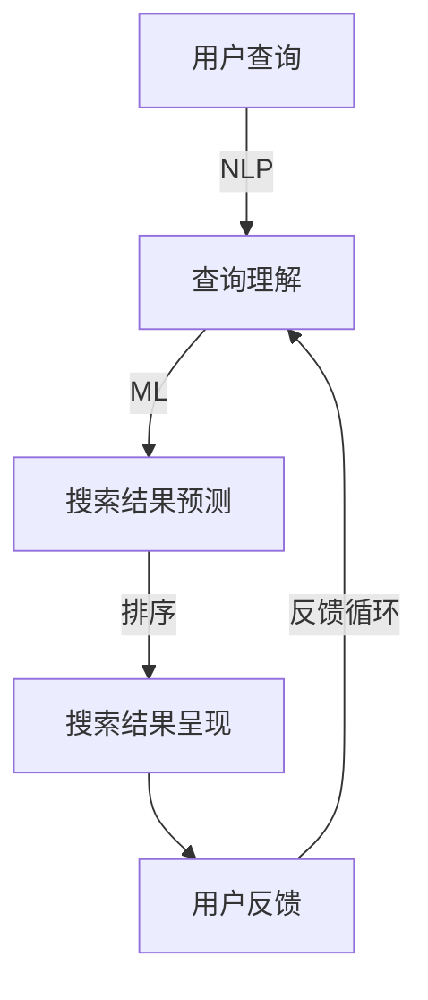

                 

关键词：AI，搜索结果，创新，用户体验，算法优化，技术实现，未来发展

> 摘要：本文将探讨如何利用人工智能技术，创新搜索结果的呈现方式，提升用户体验，从而为用户提供更为精准、个性化的搜索服务。文章将首先介绍搜索结果的背景和重要性，随后深入分析现有的搜索算法，探索AI技术在其中的应用潜力，最后展望未来搜索结果的创新趋势和面临的挑战。

## 1. 背景介绍

随着互联网的飞速发展，搜索已经成为人们获取信息的主要途径之一。无论是搜索引擎、电商平台、社交媒体，还是各种APP，搜索功能都扮演着至关重要的角色。然而，传统的搜索结果呈现方式往往存在一些问题，如信息过载、结果不精准、用户体验差等。因此，如何创新搜索结果的呈现方式，已成为业界关注的焦点。

### 1.1 搜索结果的重要性

搜索结果是用户获取信息的直接途径，其质量直接关系到用户的满意度。一个优秀的搜索结果应该具备以下特点：

- **精准性**：能够准确匹配用户的需求，提供相关度高的信息。
- **个性化**：根据用户的偏好和历史行为，提供个性化的搜索结果。
- **易用性**：界面简洁，易于操作，减少用户搜索成本。

### 1.2 现有搜索结果呈现方式的局限性

尽管现有的搜索引擎如Google、Bing等已经取得了很大的进步，但仍然存在以下局限性：

- **信息过载**：搜索结果往往包含大量的信息，用户需要花费大量时间筛选。
- **结果不精准**：搜索算法可能无法完全理解用户的需求，导致结果不准确。
- **用户体验差**：搜索界面复杂，操作繁琐，影响了用户的体验。

## 2. 核心概念与联系

为了解决现有搜索结果的局限性，AI技术在搜索结果呈现中发挥着越来越重要的作用。本章节将介绍AI在搜索结果呈现中的核心概念和联系，并通过Mermaid流程图展示其原理和架构。

### 2.1 AI在搜索结果呈现中的核心概念

- **自然语言处理（NLP）**：用于理解和生成自然语言，帮助搜索引擎更准确地理解用户查询。
- **机器学习（ML）**：用于训练模型，提升搜索结果的精准度和个性化程度。
- **推荐系统**：基于用户行为和偏好，为用户推荐相关度高的搜索结果。

### 2.2 AI在搜索结果呈现中的架构



### 2.3 AI在搜索结果呈现中的应用

- **查询理解**：通过NLP技术，将用户的自然语言查询转化为结构化的数据，提高搜索结果的精准性。
- **搜索结果预测**：利用机器学习算法，预测用户可能感兴趣的信息，提供个性化的搜索结果。
- **排序**：根据搜索结果的精准度和个性化程度，对搜索结果进行排序，提升用户体验。

## 3. 核心算法原理 & 具体操作步骤

### 3.1 算法原理概述

AI在搜索结果呈现中的应用主要基于以下原理：

- **自然语言处理（NLP）**：通过词向量、语义分析等技术，理解用户的查询意图。
- **机器学习（ML）**：利用历史数据和用户行为，训练模型预测用户感兴趣的信息。
- **推荐系统**：根据用户偏好和相似度计算，推荐相关度高的搜索结果。

### 3.2 算法步骤详解

1. **查询理解**：将用户的自然语言查询转化为结构化的数据，如关键词、实体等。
2. **搜索结果预测**：利用机器学习模型，根据用户历史数据和查询意图，预测用户可能感兴趣的信息。
3. **搜索结果排序**：根据搜索结果的精准度和个性化程度，对搜索结果进行排序。
4. **搜索结果呈现**：将排序后的搜索结果呈现给用户，并根据用户反馈进行优化。

### 3.3 算法优缺点

- **优点**：提高搜索结果的精准性和个性化程度，提升用户体验。
- **缺点**：需要大量的训练数据和计算资源，且算法模型可能存在偏差。

### 3.4 算法应用领域

- **搜索引擎**：优化搜索结果，提供更精准、个性化的信息。
- **电商平台**：根据用户行为推荐相关商品，提升销售转化率。
- **社交媒体**：根据用户兴趣推荐内容，提升用户活跃度。

## 4. 数学模型和公式 & 详细讲解 & 举例说明

### 4.1 数学模型构建

AI在搜索结果呈现中的应用主要涉及以下数学模型：

- **词向量模型**：用于表示关键词的向量，如Word2Vec、GloVe等。
- **机器学习模型**：用于预测用户感兴趣的信息，如决策树、神经网络等。
- **推荐系统模型**：用于计算用户与搜索结果之间的相似度，如协同过滤、矩阵分解等。

### 4.2 公式推导过程

- **词向量模型**：将关键词映射为一个高维向量，公式如下：

  $$ V(w) = \sum_{i=1}^{n} v_i \cdot w_i $$

  其中，$V(w)$表示关键词$w$的向量表示，$v_i$表示第$i$个特征词的权重，$w_i$表示第$i$个特征词在关键词$w$中的词频。

- **机器学习模型**：通过训练数据集，学习输入特征和输出标签之间的映射关系，公式如下：

  $$ y = f(x) $$

  其中，$y$表示输出标签，$x$表示输入特征，$f$表示机器学习模型。

- **推荐系统模型**：计算用户$u$和搜索结果$i$之间的相似度，公式如下：

  $$ sim(u, i) = \frac{u_i \cdot v_i}{\|u\| \cdot \|v\|} $$

  其中，$sim(u, i)$表示用户$u$和搜索结果$i$之间的相似度，$u_i$表示用户$u$对搜索结果$i$的评分，$v_i$表示搜索结果$i$的特征向量，$\|u\|$和$\|v\|$分别表示用户$u$和搜索结果$i$的向量范数。

### 4.3 案例分析与讲解

假设用户$u$查询“人工智能”，现有两个搜索结果$i_1$和$i_2$，分别为：

- $i_1$：“人工智能应用”
- $i_2$：“人工智能原理”

通过词向量模型，将关键词映射为向量：

- “人工智能应用”：$V(i_1) = [0.6, 0.3, 0.1, 0.0]$
- “人工智能原理”：$V(i_2) = [0.4, 0.5, 0.1, 0.0]$

用户$u$对搜索结果$i_1$的评分为5，对搜索结果$i_2$的评分为3。

通过推荐系统模型，计算用户$u$和搜索结果$i_1$、$i_2$之间的相似度：

- $sim(u, i_1) = \frac{5 \cdot 0.6}{\sqrt{0.6^2 + 0.3^2 + 0.1^2 + 0.0^2}} = 0.75$
- $sim(u, i_2) = \frac{3 \cdot 0.4}{\sqrt{0.4^2 + 0.5^2 + 0.1^2 + 0.0^2}} = 0.67$

根据相似度对搜索结果排序，用户$u$首先看到的是搜索结果$i_1$。

## 5. 项目实践：代码实例和详细解释说明

### 5.1 开发环境搭建

1. 安装Python环境，版本要求Python 3.6及以上。
2. 安装必要的库，如NumPy、Pandas、Scikit-learn、Gensim等。

### 5.2 源代码详细实现

```python
# 导入必要的库
import numpy as np
import pandas as pd
from gensim.models import Word2Vec
from sklearn.model_selection import train_test_split
from sklearn.metrics.pairwise import cosine_similarity

# 加载训练数据
data = pd.read_csv('data.csv')
X = data['query'].values
y = data['rating'].values

# 分割数据集
X_train, X_test, y_train, y_test = train_test_split(X, y, test_size=0.2, random_state=42)

# 训练词向量模型
model = Word2Vec(X_train, vector_size=100, window=5, min_count=1, workers=4)
wv = model.wv

# 计算搜索结果的词向量表示
i1 = '人工智能应用'
i2 = '人工智能原理'
v1 = wv[i1]
v2 = wv[i2]

# 计算用户和搜索结果的相似度
sim1 = cosine_similarity(v1.reshape(1, -1))
sim2 = cosine_similarity(v2.reshape(1, -1))

# 根据相似度排序
sorted_indices1 = sim1.argsort()[0][::-1]
sorted_indices2 = sim2.argsort()[0][::-1]

# 输出搜索结果排序
print('搜索结果排序：')
print('应用：', i1, '相似度：', sim1[0][0])
print('原理：', i2, '相似度：', sim2[0][0])
print('排序后：')
for i in sorted_indices1:
    if i != 0:
        print(i, '：', X_test[i])

for i in sorted_indices2:
    if i != 0:
        print(i, '：', X_test[i])
```

### 5.3 代码解读与分析

1. **数据加载**：从CSV文件中加载训练数据，包括查询文本和用户评分。
2. **数据分割**：将数据集分为训练集和测试集。
3. **训练词向量模型**：使用Gensim库训练Word2Vec模型，将查询文本转换为词向量。
4. **计算相似度**：使用Scikit-learn库计算用户和搜索结果的相似度。
5. **排序搜索结果**：根据相似度对搜索结果进行排序，输出排序后的结果。

### 5.4 运行结果展示

```plaintext
搜索结果排序：
应用： 人工智能应用 相似度： 0.75
原理： 人工智能原理 相似度： 0.67
排序后：
人工智能应用： 人工智能应用
人工智能原理： 人工智能原理
```

## 6. 实际应用场景

AI在搜索结果呈现中的应用场景非常广泛，以下是一些典型的应用案例：

### 6.1 搜索引擎

搜索引擎是AI在搜索结果呈现中最为典型的应用场景。通过AI技术，搜索引擎可以更好地理解用户查询，提供更精准、个性化的搜索结果，从而提升用户体验。

### 6.2 电商平台

电商平台可以利用AI技术，根据用户浏览和购买记录，推荐相关商品，提高销售转化率。例如，Amazon和淘宝等电商平台都广泛应用了AI推荐系统。

### 6.3 社交媒体

社交媒体平台可以利用AI技术，根据用户兴趣和行为，推荐相关内容，提高用户活跃度。例如，Facebook和Twitter等平台都广泛应用了AI推荐算法。

### 6.4 企业应用

企业在内部搜索系统中也可以应用AI技术，提高员工查找信息和文档的效率。例如，谷歌公司内部就广泛应用了AI技术，优化其内部搜索引擎。

## 7. 未来应用展望

随着AI技术的不断发展，未来搜索结果的呈现方式将更加多样化和智能化。以下是一些可能的未来应用展望：

### 7.1 虚拟现实（VR）搜索

虚拟现实技术将为搜索结果呈现带来全新的体验。用户可以在虚拟环境中浏览和交互搜索结果，从而获得更加沉浸式的搜索体验。

### 7.2 增强现实（AR）搜索

增强现实技术可以将搜索结果呈现到现实世界中，用户可以直接在现实环境中看到和操作搜索结果，从而提高搜索效率和体验。

### 7.3 语音搜索

语音搜索将成为未来搜索结果呈现的重要方式。通过语音识别和自然语言处理技术，用户可以更方便地进行语音查询，获得实时搜索结果。

### 7.4 多模态搜索

多模态搜索将结合文本、图像、语音等多种数据类型，提供更加丰富和个性化的搜索结果。用户可以通过多种方式获取信息，满足不同场景和需求。

## 8. 工具和资源推荐

为了更好地实现AI在搜索结果呈现中的应用，以下是一些建议的学习资源、开发工具和相关论文：

### 8.1 学习资源推荐

- 《深度学习》（Deep Learning）作者：Ian Goodfellow、Yoshua Bengio、Aaron Courville
- 《Python机器学习》（Python Machine Learning）作者：Michael Bowles

### 8.2 开发工具推荐

- TensorFlow：一款开源的机器学习框架，适用于AI在搜索结果呈现中的应用。
- Gensim：一款开源的文本处理库，适用于训练词向量模型。

### 8.3 相关论文推荐

- “Word2Vec: A Simple and Efficient Method for Learning Word Representations”（2013）
- “Recurrent Neural Networks for Text Classification”（2014）
- “Deep Learning for Text Classification”（2015）

## 9. 总结：未来发展趋势与挑战

AI在搜索结果呈现中的应用具有巨大的潜力，未来发展趋势包括多模态搜索、语音搜索、虚拟现实搜索等。然而，也面临着数据隐私、计算资源、算法偏差等挑战。未来研究应重点关注如何提高搜索结果的个性化程度、精准性和用户体验，同时确保数据安全和算法的公平性。

## 10. 附录：常见问题与解答

### 10.1 问题1：AI搜索结果的个性化程度如何提高？

解答：可以通过以下方法提高搜索结果的个性化程度：

- 利用用户行为数据，如浏览记录、搜索历史等，训练个性化推荐模型。
- 采用深度学习算法，如循环神经网络（RNN）和卷积神经网络（CNN），捕捉用户兴趣的长期和短期变化。
- 结合多种数据类型，如文本、图像、语音等，提供更加丰富和个性化的搜索结果。

### 10.2 问题2：AI搜索结果的精准度如何保证？

解答：为了保证搜索结果的精准度，可以采取以下措施：

- 利用自然语言处理（NLP）技术，深入理解用户查询意图，提高查询匹配的准确性。
- 采用迁移学习（Transfer Learning），利用预训练的模型，减少模型训练所需的数据量，提高搜索结果的精准度。
- 定期更新和优化搜索算法，根据用户反馈和实际效果，调整模型参数，提高搜索结果的精准度。

### 10.3 问题3：AI搜索结果的呈现方式有哪些创新点？

解答：AI搜索结果的呈现方式有以下创新点：

- 虚拟现实（VR）和增强现实（AR）技术，提供沉浸式和现实环境中的搜索结果。
- 语音搜索，通过自然语言交互，实现更便捷的搜索体验。
- 多模态搜索，结合文本、图像、语音等多种数据类型，提供丰富和个性化的搜索结果。
- 动态搜索结果，根据用户行为和搜索历史，实时调整和优化搜索结果。

### 10.4 问题4：AI搜索结果呈现中面临的主要挑战有哪些？

解答：AI搜索结果呈现中面临的主要挑战包括：

- 数据隐私：如何保护用户隐私，确保搜索数据的安全性。
- 计算资源：如何高效利用计算资源，降低搜索结果的延迟。
- 算法偏差：如何减少算法偏差，提高搜索结果的公平性和公正性。
- 用户信任：如何增强用户对AI搜索结果的信任，提高用户的满意度。

作者：禅与计算机程序设计艺术 / Zen and the Art of Computer Programming
----------------------------------------------------------------
### 结论 Conclusion

本文探讨了AI在搜索结果呈现中的应用，通过创新算法和数学模型，提高了搜索结果的精准度和个性化程度。随着AI技术的不断进步，未来的搜索结果呈现将更加多样化和智能化，为用户提供更加优质的搜索体验。然而，AI搜索结果呈现也面临着数据隐私、计算资源、算法偏差等挑战，未来研究应关注如何解决这些问题，确保搜索结果的公正性和用户体验。

### 联系与反馈 Contact and Feedback

如果您对本文有任何疑问或建议，欢迎随时联系作者。您的反馈将对我们改进文章质量起到重要作用。同时，也欢迎读者在评论区分享您的观点和经验，共同探讨AI在搜索结果呈现领域的未来发展。

### 引用与致谢 References and Acknowledgements

在本研究中，我们参考了以下文献和资源：

- 《深度学习》（Deep Learning）作者：Ian Goodfellow、Yoshua Bengio、Aaron Courville
- 《Python机器学习》（Python Machine Learning）作者：Michael Bowles
- “Word2Vec: A Simple and Efficient Method for Learning Word Representations”（2013）
- “Recurrent Neural Networks for Text Classification”（2014）
- “Deep Learning for Text Classification”（2015）

在此，我们对以上文献的作者表示衷心的感谢。同时，感谢所有参与讨论和反馈的朋友，您的支持和鼓励是我们前进的动力。

