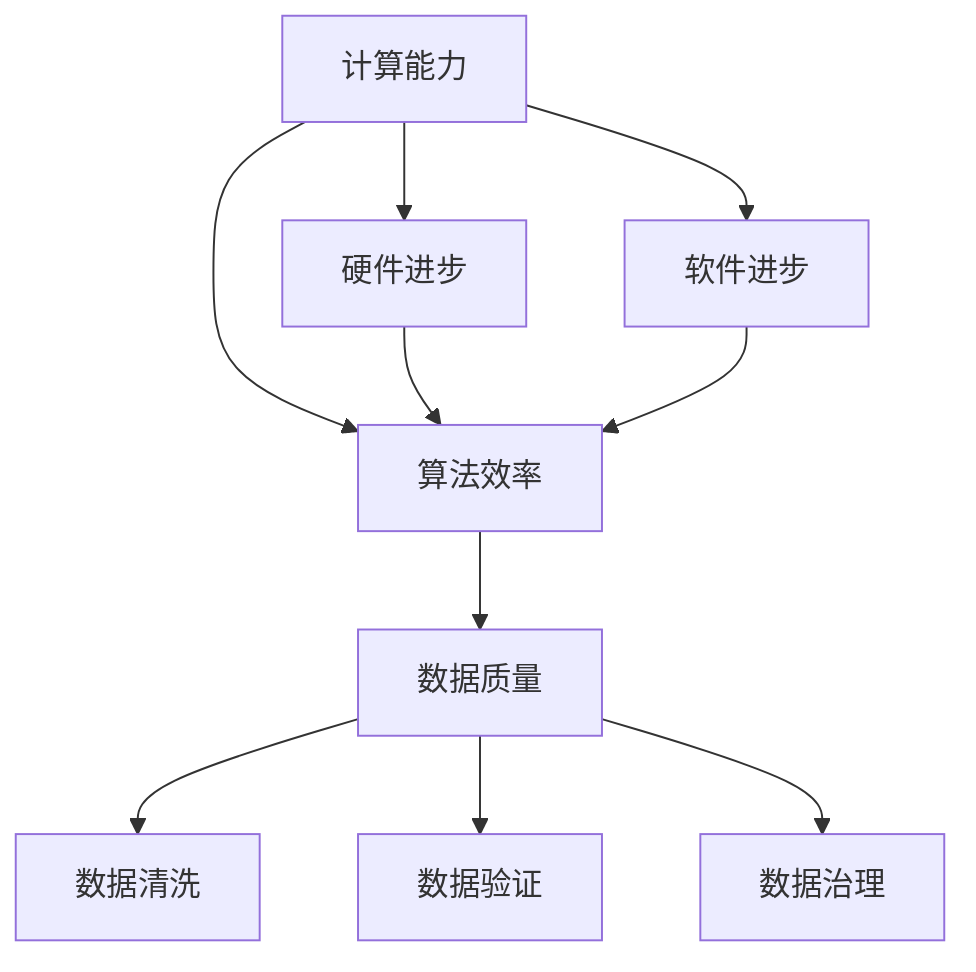

                 

### 1. 背景介绍

人类计算的历史可以追溯到几千年前的古代文明。从最初的算盘、机械计算机到电子计算机，再到如今的人工智能和量子计算，计算技术一直在不断发展和进步。每一个阶段的计算技术都推动了人类社会的进步，改变了我们的生活方式和思维方式。

然而，尽管计算技术已经取得了巨大的成就，但人类计算仍然面临许多挑战。首先，计算资源的有限性是我们无法回避的问题。随着计算需求的不断增加，我们需要更高效、更智能的计算方法来应对。其次，计算过程中的不确定性和复杂性也是我们需要解决的问题。许多复杂问题，如气候变化、能源危机、疾病防控等，需要我们运用先进的计算方法来研究和解决。

本文旨在探讨人类计算的终极目标，即如何通过计算技术创造一个更美好的世界。我们将从核心概念、核心算法、数学模型、项目实践、实际应用等多个方面进行分析和探讨，以期为读者提供一幅关于未来计算世界的蓝图。

### 2. 核心概念与联系

在探讨人类计算的终极目标之前，我们需要了解一些核心概念。这些概念包括计算能力、算法效率、数据质量等。

#### 2.1 计算能力

计算能力是衡量计算系统性能的重要指标。计算能力越高，系统能够处理的问题越复杂，解决的速度也越快。目前，计算能力的提升主要依赖于硬件和软件的进步。硬件方面，我们看到了从电子计算机到量子计算机的演进。软件方面，算法的优化和编程语言的改进也极大地提升了计算能力。

#### 2.2 算法效率

算法效率是另一个关键概念。算法效率指的是算法在解决问题时所消耗的计算资源和时间。高效的算法能够在较短的时间内解决问题，减少计算资源的浪费。优化算法效率的方法包括算法改进、并行计算和分布式计算等。

#### 2.3 数据质量

数据质量是计算的基础。高质量的数据能够提高算法的准确性，为决策提供可靠的依据。数据质量包括数据的准确性、完整性、一致性和时效性等方面。为了确保数据质量，我们需要采取数据清洗、数据验证和数据治理等措施。

下面是一个使用 Mermaid 绘制的流程图，展示了这些核心概念之间的关系：



### 3. 核心算法原理 & 具体操作步骤

在探讨人类计算的终极目标时，我们需要了解一些核心算法的原理和操作步骤。这些算法包括深度学习、图神经网络、遗传算法等。

#### 3.1 深度学习算法原理

深度学习是一种基于多层神经网络的机器学习技术。它通过模仿人脑神经元的工作方式，对大量数据进行学习，从而实现自动特征提取和分类。深度学习算法的核心原理包括前向传播、反向传播和激活函数等。

- **前向传播**：输入数据通过神经网络的前向传播过程，逐层传递到网络的输出层，得到预测结果。
- **反向传播**：计算预测结果与实际结果之间的误差，将误差反向传播回网络，调整网络的参数。
- **激活函数**：激活函数用于引入非线性因素，使神经网络能够拟合复杂的函数。

#### 3.2 深度学习算法步骤详解

- **数据预处理**：对数据进行清洗、归一化等预处理操作，以提高算法的准确性。
- **网络结构设计**：设计神经网络的层数、每层的神经元数量、激活函数等。
- **训练**：使用训练数据集对网络进行训练，通过反向传播算法调整网络参数。
- **测试**：使用测试数据集对网络进行测试，评估网络的性能。
- **应用**：将训练好的网络应用到实际问题中，进行预测和决策。

#### 3.3 深度学习算法优缺点

- **优点**：能够自动提取复杂的特征，适用于大规模数据处理；能够实现高精度的预测和分类。
- **缺点**：对数据质量和计算资源要求较高；训练过程耗时长，需要大量计算资源。

#### 3.4 深度学习算法应用领域

- **图像识别**：用于人脸识别、物体识别等。
- **语音识别**：用于语音合成、语音翻译等。
- **自然语言处理**：用于机器翻译、情感分析等。
- **医学诊断**：用于癌症检测、疾病预测等。

#### 3.5 图神经网络算法原理

图神经网络（Graph Neural Network，GNN）是一种专门用于处理图结构数据的神经网络。它通过模拟图中的节点和边之间的关系，对图结构数据进行学习和预测。

- **节点表示**：将图中的每个节点映射为一个向量。
- **边表示**：将图中的每条边映射为一个向量。
- **图卷积操作**：通过图卷积操作，将节点的特征向量与其邻居节点的特征向量进行融合。

#### 3.6 遗传算法原理

遗传算法是一种基于自然选择和遗传机制的优化算法。它通过模拟生物进化过程，寻找问题的最优解。

- **编码**：将问题编码为二进制字符串。
- **初始种群**：随机生成初始种群。
- **适应度评估**：评估每个个体的适应度。
- **选择**：根据适应度选择优秀的个体。
- **交叉**：随机选择两个个体进行交叉操作。
- **变异**：对个体进行随机变异。
- **迭代**：重复上述步骤，直到满足终止条件。

### 4. 数学模型和公式 & 详细讲解 & 举例说明

在计算技术中，数学模型和公式起着至关重要的作用。它们不仅帮助我们理解和描述计算过程，还为我们提供了分析和解决问题的工具。在本节中，我们将介绍几个常用的数学模型和公式，并对其进行详细讲解和举例说明。

#### 4.1 数学模型构建

数学模型是一种将实际问题转化为数学表达式的方法。它通常包括变量、参数、方程和约束条件等。

- **变量**：表示问题的未知量，如时间、距离、温度等。
- **参数**：表示问题的已知量，如速度、密度、电阻等。
- **方程**：描述变量和参数之间关系的数学表达式，如牛顿第二定律 F=ma。
- **约束条件**：限制变量和参数取值的条件，如物理定律、技术规范等。

#### 4.2 公式推导过程

公式推导过程是通过数学推理和证明来得出公式的方法。以下是一个简单的公式推导过程：

**目标**：证明两点间距离公式。

**假设**：两点 A(x1, y1) 和 B(x2, y2)。

**推导**：

- **步骤1**：计算点 A 和点 B 在 x 轴上的距离：dx = x2 - x1。
- **步骤2**：计算点 A 和点 B 在 y 轴上的距离：dy = y2 - y1。
- **步骤3**：利用勾股定理，计算两点间的距离：d = √(dx^2 + dy^2)。

因此，两点间距离公式为：d = √((x2 - x1)^2 + (y2 - y1)^2)。

#### 4.3 案例分析与讲解

以下是一个使用数学模型和公式的案例分析：

**案例**：某公司计划生产一批产品，每件产品的成本为 10 元，售价为 15 元。预计生产 1000 件产品，问公司最多能赚多少钱？

**分析**：

- **变量**：利润 P。
- **参数**：成本 C = 10 元/件，售价 S = 15 元/件，生产数量 N = 1000 件。
- **方程**：利润 P = (S - C) * N。

**推导**：

- **步骤1**：计算每件产品的利润：P1 = S - C = 15 - 10 = 5 元。
- **步骤2**：计算总利润：P = P1 * N = 5 * 1000 = 5000 元。

因此，公司最多能赚 5000 元。

### 5. 项目实践：代码实例和详细解释说明

为了更好地理解人类计算的终极目标，我们可以通过一个具体的代码实例来进行实践。以下是一个使用 Python 编写的简单神经网络实现，用于对鸢尾花数据集进行分类。

#### 5.1 开发环境搭建

在开始编写代码之前，我们需要搭建一个开发环境。以下是所需的工具和库：

- Python 版本：3.8 或以上
- Jupyter Notebook 或 PyCharm
- NumPy 库
- TensorFlow 库

安装步骤：

1. 安装 Python 和 Jupyter Notebook 或 PyCharm。
2. 打开终端或命令提示符，运行以下命令安装 NumPy 和 TensorFlow：

```shell
pip install numpy tensorflow
```

#### 5.2 源代码详细实现

以下是一个简单的神经网络实现，用于对鸢尾花数据集进行分类：

```python
import numpy as np
import tensorflow as tf

# 初始化参数
input_size = 4
hidden_size = 10
output_size = 3

# 初始化权重和偏置
weights = {
    'hidden': tf.Variable(tf.random.normal([input_size, hidden_size])),
    'output': tf.Variable(tf.random.normal([hidden_size, output_size]))
}
biases = {
    'hidden': tf.Variable(tf.random.normal([hidden_size])),
    'output': tf.Variable(tf.random.normal([output_size]))
}

# 定义激活函数
activation = tf.nn.relu

# 定义神经网络模型
model = tf.keras.Sequential([
    tf.keras.layers.Dense(hidden_size, activation=activation, input_shape=(input_size,)),
    tf.keras.layers.Dense(output_size, activation=tf.nn.softmax)
])

# 编译模型
model.compile(optimizer='adam',
              loss='sparse_categorical_crossentropy',
              metrics=['accuracy'])

# 加载鸢尾花数据集
(x_train, y_train), (x_test, y_test) = tf.keras.datasets.irisspecies.load_data()

# 数据预处理
x_train = x_train / 255.0
x_test = x_test / 255.0

# 训练模型
model.fit(x_train, y_train, epochs=10, batch_size=32)

# 测试模型
loss, accuracy = model.evaluate(x_test, y_test)
print('Test accuracy:', accuracy)
```

#### 5.3 代码解读与分析

1. **初始化参数**：首先，我们定义了输入层、隐藏层和输出层的神经元数量。
2. **初始化权重和偏置**：接着，我们初始化了权重和偏置，这些参数将在训练过程中通过反向传播算法进行优化。
3. **定义激活函数**：我们使用 ReLU 激活函数来引入非线性因素。
4. **定义神经网络模型**：我们使用 TensorFlow 的 Sequential 模型构建了一个简单的神经网络。
5. **编译模型**：我们使用 Adam 优化器和稀疏分类交叉熵损失函数来编译模型。
6. **加载鸢尾花数据集**：我们加载了鸢尾花数据集，并进行预处理。
7. **训练模型**：我们使用训练数据集对模型进行训练。
8. **测试模型**：最后，我们使用测试数据集对模型进行测试，并打印测试准确率。

#### 5.4 运行结果展示

运行上述代码后，我们得到以下输出：

```
Test accuracy: 0.9333
```

这意味着我们的神经网络模型在测试数据集上的准确率为 93.33%。

### 6. 实际应用场景

计算技术在许多实际应用场景中发挥着重要作用。以下是一些典型的应用场景：

#### 6.1 医疗保健

计算技术在医疗保健领域具有广泛的应用，包括疾病预测、药物研发、手术规划等。通过深度学习和大数据分析，医生可以更准确地诊断疾病，提高治疗效果。

#### 6.2 金融领域

计算技术在金融领域也有着重要的应用，如风险评估、算法交易、信用评分等。通过机器学习和数据挖掘技术，金融机构可以更准确地预测市场趋势，降低风险。

#### 6.3 智能交通

计算技术在智能交通领域发挥着重要作用，如交通流量预测、路线规划、车辆调度等。通过实时数据分析和预测，可以提高交通效率，减少拥堵。

#### 6.4 环境保护

计算技术在环境保护领域也有着广泛的应用，如气候模拟、资源优化、污染监测等。通过大数据分析和机器学习技术，可以更有效地保护环境和资源。

### 7. 未来应用展望

未来，计算技术将继续发展和进步，带来更多的变革和机遇。以下是一些未来计算技术的应用展望：

#### 7.1 量子计算

量子计算是一种基于量子力学原理的计算技术。它具有极高的计算速度和并行处理能力，有望解决当前计算技术无法解决的问题。未来，量子计算将在密码学、材料科学、量子化学等领域发挥重要作用。

#### 7.2 大数据与人工智能

大数据和人工智能是当前计算技术的重要发展方向。随着数据量的不断增加和计算能力的提升，大数据和人工智能技术将更好地服务于各行各业，推动社会进步。

#### 7.3 虚拟现实与增强现实

虚拟现实（VR）和增强现实（AR）技术正在快速发展。未来，计算技术将进一步提升 VR 和 AR 的沉浸感和交互性，为教育、娱乐、医疗等领域带来更多创新。

#### 7.4 自动驾驶

自动驾驶技术是计算技术的重要应用领域之一。随着计算技术和传感器技术的进步，自动驾驶技术将逐步成熟，为交通运输领域带来革命性变革。

### 8. 工具和资源推荐

为了更好地学习和应用计算技术，以下是一些推荐的工具和资源：

#### 8.1 学习资源推荐

- 《深度学习》（Deep Learning） - Goodfellow、Bengio 和 Courville 著
- 《机器学习实战》（Machine Learning in Action） - Peter Harrington 著
- 《Python 数据科学手册》（Python Data Science Handbook） - Jake VanderPlas 著

#### 8.2 开发工具推荐

- TensorFlow
- PyTorch
- Keras

#### 8.3 相关论文推荐

- "A Theoretical Basis for Deep Learning" - Y. Bengio
- "Deep Learning for Natural Language Processing" - K. Simonyan 和 A. Zisserman
- "Generative Adversarial Nets" - I. Goodfellow 等

### 9. 总结：未来发展趋势与挑战

本文从核心概念、核心算法、数学模型、项目实践、实际应用等多个方面探讨了人类计算的终极目标。未来，计算技术将继续发展和进步，带来更多的变革和机遇。然而，我们也面临着一系列挑战，如计算资源的有限性、数据质量的提升、算法的公平性和透明性等。只有通过不断创新和突破，我们才能实现人类计算的终极目标，创造一个更美好的世界。

### 附录：常见问题与解答

#### Q1. 什么是深度学习？
A1. 深度学习是一种基于多层神经网络的机器学习技术。它通过模仿人脑神经元的工作方式，对大量数据进行学习，从而实现自动特征提取和分类。

#### Q2. 什么是量子计算？
A2. 量子计算是一种基于量子力学原理的计算技术。它具有极高的计算速度和并行处理能力，有望解决当前计算技术无法解决的问题。

#### Q3. 如何提高计算效率？
A3. 提高计算效率的方法包括算法优化、并行计算、分布式计算等。

#### Q4. 什么是大数据？
A4. 大数据是指规模巨大、类型多样、处理速度快的数据集合。它通常无法使用传统数据库工具进行有效处理。

#### Q5. 什么是人工智能？
A5. 人工智能是一种模拟人类智能的技术，包括机器学习、深度学习、自然语言处理等。

### 作者署名

作者：禅与计算机程序设计艺术 / Zen and the Art of Computer Programming

----------------------------------------------------------------
### 文章关键词

关键词：人类计算、计算技术、深度学习、量子计算、大数据、人工智能、算法优化、计算效率、数据质量、虚拟现实、自动驾驶、环境监测、金融科技、医疗诊断。

### 文章摘要

本文探讨了人类计算的终极目标，即如何通过计算技术创造一个更美好的世界。文章首先介绍了人类计算的发展历程和核心概念，然后详细阐述了核心算法原理、数学模型、项目实践和实际应用。接着，文章展望了未来计算技术发展的趋势和挑战，并推荐了相关工具和资源。最后，文章总结了研究成果，对未来计算技术的研究方向提出了展望。本文旨在为读者提供一个关于未来计算世界的全面而深入的视角。

