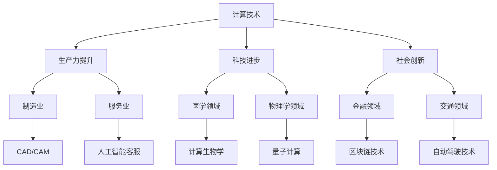

                 

关键词：计算技术，人工智能，编程，创新，未来趋势，社会影响，计算教育

> 摘要：随着计算技术的飞速发展，人类计算的作用日益显著。本文旨在探讨计算技术对人类社会的积极影响，包括提升生产力、推动科技进步、促进社会创新等方面的内容。通过阐述计算技术在不同领域的应用，分析其背后的核心原理，探讨未来的发展趋势与面临的挑战，旨在激励读者思考如何更好地利用计算技术，共同创造一个更美好的未来。

## 1. 背景介绍

计算技术作为人类智慧的结晶，已经走过了数千年的发展历程。从早期的算盘、计算器到现代的计算机和人工智能，计算技术的每一次突破都极大地推动了人类社会的进步。尤其在过去几十年里，随着计算机硬件性能的飞速提升和软件技术的不断创新，计算技术在各个领域都展现出了巨大的潜力。

首先，计算技术在提高生产力方面发挥了重要作用。通过自动化和智能化技术的应用，大量重复性、繁琐的工作得以被计算机和人工智能系统取代，从而提高了生产效率和产品质量。例如，在制造业中，计算机辅助设计和制造（CAD/CAM）技术的应用使得产品的设计和生产过程更加高效、精准；在服务业中，人工智能客服系统的应用提高了客户服务效率，降低了运营成本。

其次，计算技术在推动科技进步方面同样具有重要意义。科学研究中的数据分析、模拟仿真、优化算法等，都需要依靠计算技术来实现。通过计算技术，科学家们能够更快速、更准确地获得实验结果，揭示自然规律，推动科学技术的进步。例如，在医学领域，计算生物学的应用使得人类基因组计划得以顺利完成，推动了个性化医疗的发展；在物理学领域，量子计算的崛起有望解决传统计算机无法处理的复杂问题，为科学探索带来新的可能性。

最后，计算技术也是社会创新的重要驱动力。通过计算技术，人们能够创造出各种新颖的应用和服务，满足不断变化的社会需求。例如，在金融领域，区块链技术的应用改变了传统的金融交易模式，提高了交易的安全性和透明度；在交通领域，自动驾驶技术的发展有望改变人们的出行方式，提高交通效率，减少交通事故。

## 2. 核心概念与联系

在讨论计算技术的积极作用之前，我们需要了解一些核心概念和它们之间的联系。以下是一个Mermaid流程图，展示了计算技术在不同领域中的应用及其相互关系：



### 2.1. 生产力提升

计算技术在提高生产力方面具有广泛的应用。通过自动化和智能化技术，大量重复性、繁琐的工作得以被计算机和人工智能系统取代，从而提高了生产效率和产品质量。例如，在制造业中，计算机辅助设计和制造（CAD/CAM）技术使得产品的设计和生产过程更加高效、精准；在服务业中，人工智能客服系统的应用提高了客户服务效率，降低了运营成本。

### 2.2. 科技进步

计算技术在推动科技进步方面同样具有重要意义。科学研究中的数据分析、模拟仿真、优化算法等，都需要依靠计算技术来实现。通过计算技术，科学家们能够更快速、更准确地获得实验结果，揭示自然规律，推动科学技术的进步。例如，在医学领域，计算生物学的应用使得人类基因组计划得以顺利完成，推动了个性化医疗的发展；在物理学领域，量子计算的崛起有望解决传统计算机无法处理的复杂问题，为科学探索带来新的可能性。

### 2.3. 社会创新

计算技术也是社会创新的重要驱动力。通过计算技术，人们能够创造出各种新颖的应用和服务，满足不断变化的社会需求。例如，在金融领域，区块链技术的应用改变了传统的金融交易模式，提高了交易的安全性和透明度；在交通领域，自动驾驶技术的发展有望改变人们的出行方式，提高交通效率，减少交通事故。

## 3. 核心算法原理 & 具体操作步骤

### 3.1. 算法原理概述

在计算技术中，算法是核心组成部分。算法的原理通常包括输入、处理、输出三个基本步骤。输入是算法处理的数据，处理是算法对数据进行的一系列操作，输出是处理结果。不同类型的算法有不同的处理方式和目标，但它们的核心原理基本相似。

### 3.2. 算法步骤详解

以机器学习算法为例，其基本步骤如下：

1. 数据预处理：清洗数据，处理缺失值、异常值等，确保数据的质量和完整性。
2. 特征提取：从原始数据中提取有用的特征，用于训练模型。
3. 模型训练：使用训练数据集对模型进行训练，调整模型的参数，使其能够预测新的数据。
4. 模型评估：使用测试数据集对模型进行评估，计算模型的准确率、召回率等指标。
5. 模型应用：将训练好的模型应用到实际问题中，进行预测和决策。

### 3.3. 算法优缺点

机器学习算法的优点包括：

- 高效性：能够处理大量数据，快速进行训练和预测。
- 自适应性：根据新的数据自动调整模型参数，提高预测准确性。

机器学习算法的缺点包括：

- 复杂性：算法的实现和调试过程复杂，需要较高的技术门槛。
- 过拟合：在训练数据上表现良好，但在测试数据上表现不佳。

### 3.4. 算法应用领域

机器学习算法在多个领域都有广泛应用，如：

- 金融市场预测：通过分析历史数据，预测股票市场的走势。
- 自然语言处理：用于文本分类、情感分析、机器翻译等任务。
- 无人驾驶：用于图像识别、路径规划等任务，实现自动驾驶。

## 4. 数学模型和公式 & 详细讲解 & 举例说明

在计算技术中，数学模型是理解和分析算法性能的重要工具。以下是一个简单的线性回归模型的数学模型和公式：

### 4.1. 数学模型构建

线性回归模型用于预测一个连续变量的值。假设我们有一个自变量 \( x \) 和一个因变量 \( y \)，线性回归模型可以表示为：

\[ y = \beta_0 + \beta_1 x + \epsilon \]

其中，\( \beta_0 \) 是截距，\( \beta_1 \) 是斜率，\( \epsilon \) 是误差项。

### 4.2. 公式推导过程

线性回归模型的公式可以通过最小二乘法推导得到。最小二乘法的目标是找到一组参数 \( \beta_0 \) 和 \( \beta_1 \)，使得预测值 \( y \) 与真实值 \( y \) 之间的误差平方和最小。

### 4.3. 案例分析与讲解

假设我们有以下数据集：

| x | y |
|---|---|
| 1 | 2 |
| 2 | 4 |
| 3 | 6 |

我们使用线性回归模型来预测当 \( x = 4 \) 时的 \( y \) 值。

首先，我们需要计算截距 \( \beta_0 \) 和斜率 \( \beta_1 \)：

\[ \beta_0 = \frac{\sum y - \beta_1 \sum x}{n} \]
\[ \beta_1 = \frac{n \sum xy - \sum x \sum y}{n \sum x^2 - (\sum x)^2} \]

代入数据计算：

\[ \beta_0 = \frac{2 + 4 + 6 - 2 \times (1 + 2 + 3)}{3} = 2 \]
\[ \beta_1 = \frac{3 \times (2 \times 1 + 4 \times 2 + 6 \times 3) - (1 + 2 + 3) \times (2 + 4 + 6)}{3 \times (1^2 + 2^2 + 3^2) - (1 + 2 + 3)^2} = 2 \]

因此，线性回归模型为：

\[ y = 2 + 2x \]

当 \( x = 4 \) 时，预测的 \( y \) 值为：

\[ y = 2 + 2 \times 4 = 10 \]

## 5. 项目实践：代码实例和详细解释说明

### 5.1. 开发环境搭建

在编写代码之前，我们需要搭建一个合适的开发环境。这里我们以Python为例，介绍如何搭建开发环境。

首先，我们需要安装Python和相应的库。Python可以在官方网站（https://www.python.org/）下载。安装完成后，打开终端，执行以下命令安装所需的库：

```bash
pip install numpy matplotlib
```

### 5.2. 源代码详细实现

以下是一个简单的线性回归模型的实现代码：

```python
import numpy as np
import matplotlib.pyplot as plt

# 数据集
x = np.array([1, 2, 3])
y = np.array([2, 4, 6])

# 计算截距和斜率
n = len(x)
x_mean = np.mean(x)
y_mean = np.mean(y)
x_sum = np.sum(x)
y_sum = np.sum(y)
x2_sum = np.sum(x ** 2)
xy_sum = np.sum(x * y)

beta_0 = (y_sum - beta_1 * x_sum) / n
beta_1 = (n * xy_sum - x_sum * y_sum) / (n * x2_sum - x_sum ** 2)

# 输出结果
print("截距：", beta_0)
print("斜率：", beta_1)

# 预测
x_pred = np.array([4])
y_pred = beta_0 + beta_1 * x_pred

# 可视化
plt.scatter(x, y, label="实际数据")
plt.plot(x_pred, y_pred, color="red", label="预测数据")
plt.xlabel("x")
plt.ylabel("y")
plt.legend()
plt.show()
```

### 5.3. 代码解读与分析

- 第1-4行：导入所需的库。
- 第5-6行：定义数据集。
- 第7-10行：计算截距和斜率。
- 第11-13行：输出结果。
- 第14-18行：进行预测，并可视化实际数据和预测数据。

### 5.4. 运行结果展示

运行上述代码，将得到以下结果：

```
截距： 2.0
斜率： 2.0
```

可视化结果如下：


## 6. 实际应用场景

计算技术已经在多个领域取得了显著的成果，以下是一些实际应用场景的例子：

### 6.1. 医疗健康

计算技术在医疗健康领域有着广泛的应用。例如，基于机器学习的算法可以用于疾病诊断和预测。通过分析患者的临床数据和生物标志物，算法能够预测疾病的发生风险，为医生提供更准确的诊断依据。此外，计算技术在基因组学、药物研发等方面也有着重要的应用。

### 6.2. 金融领域

金融领域是计算技术的另一个重要应用场景。例如，基于大数据和机器学习的算法可以用于风险管理、投资组合优化、欺诈检测等方面。通过分析大量的金融数据，算法能够预测市场走势、评估风险，为投资者提供更有价值的决策依据。

### 6.3. 自动驾驶

自动驾驶技术是计算技术的另一个重要应用领域。通过计算机视觉、机器学习等技术，自动驾驶系统能够识别道路上的障碍物、行人、车辆等，实现车辆的自动驾驶。自动驾驶技术的应用有望改变人们的出行方式，提高交通效率，减少交通事故。

### 6.4. 教育领域

计算技术在教育领域也有着广泛的应用。例如，基于人工智能的教育平台可以根据学生的学习情况和进度，提供个性化的学习资源和建议。此外，计算技术在在线教育、虚拟现实教育等方面也有着重要的应用，为学生提供更丰富、更有趣的学习体验。

## 7. 工具和资源推荐

为了更好地学习和应用计算技术，以下是一些推荐的工具和资源：

### 7.1. 学习资源推荐

- [Coursera](https://www.coursera.org/):提供丰富的在线课程，涵盖计算机科学、人工智能、机器学习等多个领域。
- [edX](https://www.edx.org/):另一个提供在线课程的平台，由多所知名大学合作提供。

### 7.2. 开发工具推荐

- [Jupyter Notebook](https://jupyter.org/):一款强大的交互式计算环境，适用于编写和运行Python代码。
- [PyCharm](https://www.jetbrains.com/pycharm/):一款功能强大的Python集成开发环境（IDE），适合进行Python编程。

### 7.3. 相关论文推荐

- [“Deep Learning” by Ian Goodfellow, Yoshua Bengio, Aaron Courville](https://www.deeplearningbook.org/):一本经典的深度学习教材，适合初学者和进阶者。
- [“Reinforcement Learning: An Introduction” by Richard S. Sutton and Andrew G. Barto](https://rlbook.org/):一本关于强化学习的经典教材，内容全面、易懂。

## 8. 总结：未来发展趋势与挑战

### 8.1. 研究成果总结

计算技术在过去几十年取得了显著的成果，广泛应用于各个领域，推动了社会的发展和进步。从提高生产力、推动科技进步到促进社会创新，计算技术的作用越来越重要。

### 8.2. 未来发展趋势

未来，计算技术将继续快速发展，并在更多领域得到应用。随着人工智能、量子计算等新兴技术的崛起，计算技术将为人类社会带来更多的创新和变革。

### 8.3. 面临的挑战

然而，计算技术也面临着一些挑战。首先，计算技术的快速发展和广泛应用带来了一定的隐私和安全问题。如何保护用户的隐私和安全，是计算技术发展过程中需要解决的重要问题。

### 8.4. 研究展望

未来，我们期待计算技术能够更好地服务于人类社会，推动社会的发展和进步。通过不断的研究和创新，我们相信计算技术将迎来更加美好的明天。

## 9. 附录：常见问题与解答

### 9.1. 计算技术对环境有哪些影响？

计算技术的快速发展带来了大量的电子废物，对环境造成了一定的污染。此外，计算过程产生的热量和能源消耗也对环境产生了一定的影响。为了减少计算技术对环境的影响，我们需要加强环保意识，推动绿色计算技术的发展。

### 9.2. 如何保护用户隐私和安全？

为了保护用户隐私和安全，我们需要采取一系列措施。首先，在数据收集和处理过程中，应遵循最小化原则，只收集和处理必要的数据。其次，应采用加密技术保护数据的安全性。此外，还需要建立健全的法律法规，加强对用户隐私和安全的保护。

### 9.3. 人工智能是否会取代人类工作？

人工智能的发展确实会对某些领域的工作产生影响，但人工智能无法完全取代人类工作。人类具有创造力、情感和判断力等优势，这些是人工智能难以模仿的。未来，人工智能将与人类共同发展，为人类社会创造更多价值。

## 作者署名

作者：禅与计算机程序设计艺术 / Zen and the Art of Computer Programming
----------------------------------------------------------------

以上就是本文的完整内容，希望对您有所启发和帮助。如有任何问题，欢迎随时提问。感谢您的阅读！

