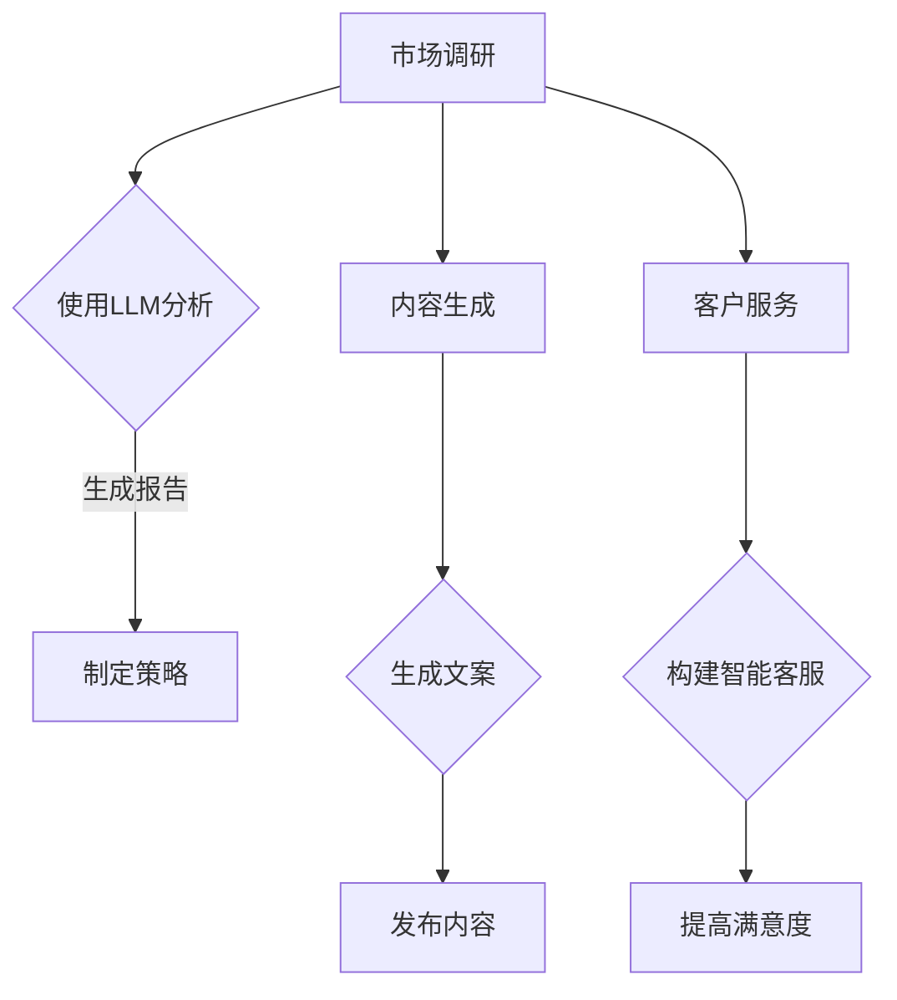

                 

关键词：初创企业、加速器、LLM、创新、技术赋能

> 摘要：本文将探讨如何利用大型语言模型（LLM）来赋能初创企业，加速其创新进程。我们将深入分析LLM的核心概念、原理和应用，并展示其在初创企业中的实际应用案例，为初创企业探索创新之路提供有价值的参考。

## 1. 背景介绍

在当今快速变化的世界中，初创企业正成为推动经济增长和创新的重要力量。然而，初创企业在资源、经验和市场影响力方面相对较弱，这使得它们在创新过程中面临诸多挑战。为了克服这些挑战，许多初创企业开始寻求各种技术手段来加速其创新进程。

近年来，大型语言模型（LLM）的崛起为初创企业提供了前所未有的机遇。LLM是一种能够理解和生成自然语言的先进人工智能模型，具有强大的文本处理和生成能力。通过利用LLM，初创企业可以实现自动化文本分析、内容生成和智能对话等功能，从而提高工作效率、降低成本并增强竞争力。

本文将探讨如何利用LLM来赋能初创企业，加速其创新进程。我们将深入分析LLM的核心概念、原理和应用，并展示其在初创企业中的实际应用案例，为初创企业探索创新之路提供有价值的参考。

## 2. 核心概念与联系

### 2.1. 语言模型的基本概念

语言模型是一种用于预测文本序列的概率分布的模型。在自然语言处理（NLP）领域，语言模型被广泛应用于文本分类、情感分析、机器翻译、问答系统等方面。传统的语言模型通常基于统计方法，如n-gram模型和隐马尔可夫模型（HMM），而现代语言模型则基于深度学习技术，如循环神经网络（RNN）和变换器（Transformer）。

### 2.2. 大型语言模型（LLM）的原理

大型语言模型（LLM）是一种能够处理大规模文本数据并生成高质量文本的模型。LLM通常采用深度学习技术，特别是基于变换器（Transformer）架构的模型，如BERT、GPT和T5。这些模型具有以下特点：

- **上下文感知**：LLM能够理解文本的上下文信息，从而生成更加准确和自然的文本。
- **多任务处理**：LLM可以同时处理多个任务，如文本分类、问答和文本生成。
- **自适应学习**：LLM可以根据不同的应用场景和数据集进行自适应学习，从而提高性能。

### 2.3. LLM在初创企业中的应用

在初创企业中，LLM可以应用于多个领域，包括：

- **市场调研**：利用LLM进行文本分析，帮助企业快速了解市场需求和竞争态势。
- **内容生成**：利用LLM生成高质量的产品描述、营销文案和博客文章，提高品牌影响力。
- **客户服务**：利用LLM构建智能客服系统，提高客户满意度并降低人力成本。

### 2.4. Mermaid流程图

以下是一个简单的Mermaid流程图，展示了LLM在初创企业中的基本应用流程：



## 3. 核心算法原理 & 具体操作步骤

### 3.1. 算法原理概述

LLM的核心算法是基于深度学习技术，特别是变换器（Transformer）架构。变换器是一种能够处理序列数据并生成高质量输出的模型，具有以下特点：

- **多头自注意力机制**：变换器通过多头自注意力机制来学习文本序列中的关系，从而生成更准确的文本。
- **位置编码**：变换器通过位置编码来学习文本序列中的位置信息，从而提高模型的性能。
- **前馈神经网络**：变换器在自注意力机制和位置编码的基础上，添加前馈神经网络来进一步提高模型的性能。

### 3.2. 算法步骤详解

1. **数据预处理**：对输入文本进行预处理，包括分词、词向量化、序列填充等。
2. **编码器-解码器结构**：构建变换器模型，包括编码器和解码器两个部分。编码器用于将输入文本编码为序列向量，解码器用于将序列向量解码为输出文本。
3. **自注意力机制**：在编码器中，通过多头自注意力机制来学习文本序列中的关系，从而生成更准确的文本。
4. **位置编码**：在编码器中，通过位置编码来学习文本序列中的位置信息，从而提高模型的性能。
5. **前馈神经网络**：在编码器和解码器中，添加前馈神经网络来进一步提高模型的性能。
6. **损失函数和优化器**：使用损失函数（如交叉熵损失）和优化器（如Adam优化器）来训练模型。

### 3.3. 算法优缺点

- **优点**：LLM具有强大的文本处理和生成能力，能够生成高质量的自然语言文本，具有广泛的应用前景。
- **缺点**：LLM的训练和部署需要大量的计算资源和时间，且模型的解释性较差。

### 3.4. 算法应用领域

LLM在初创企业中的应用领域广泛，包括：

- **市场调研**：利用LLM进行文本分析，帮助企业快速了解市场需求和竞争态势。
- **内容生成**：利用LLM生成高质量的产品描述、营销文案和博客文章，提高品牌影响力。
- **客户服务**：利用LLM构建智能客服系统，提高客户满意度并降低人力成本。

## 4. 数学模型和公式 & 详细讲解 & 举例说明

### 4.1. 数学模型构建

LLM的数学模型主要包括以下部分：

- **词向量化**：将文本中的词汇映射为向量表示。
- **变换器架构**：包括编码器和解码器，采用多头自注意力机制和位置编码。
- **损失函数**：使用交叉熵损失函数来衡量模型预测与实际输出之间的差距。

### 4.2. 公式推导过程

变换器模型的核心是多头自注意力机制，其公式推导如下：

$$
\text{Attention}(Q, K, V) = \text{softmax}\left(\frac{QK^T}{\sqrt{d_k}}\right)V
$$

其中，Q、K和V分别是编码器输出的查询向量、键向量和值向量，d_k是键向量的维度，softmax函数用于计算每个键向量的权重。

### 4.3. 案例分析与讲解

假设有一个包含1000个单词的句子，我们要利用LLM生成一个包含500个单词的新句子。首先，我们将句子中的每个单词映射为向量表示，然后利用变换器模型进行文本生成。具体步骤如下：

1. **词向量化**：将句子中的每个单词映射为预训练好的词向量。
2. **编码器输入**：将词向量输入编码器，生成编码器输出。
3. **解码器输入**：将编码器输出作为解码器的输入，生成解码器输出。
4. **文本生成**：将解码器输出中的单词按照概率分布进行采样，生成新的句子。

假设编码器输出和解码器输出分别为Q和V，我们可以利用以下公式进行文本生成：

$$
p(w_t|w_1, w_2, ..., w_{t-1}) = \text{softmax}(\text{softmax}(\text{Attention}(Q, K, V)W)^T)
$$

其中，w_t是解码器输出中的第t个单词，W是解码器中的权重矩阵。

## 5. 项目实践：代码实例和详细解释说明

### 5.1. 开发环境搭建

为了实践LLM在初创企业中的应用，我们首先需要搭建一个开发环境。以下是一个简单的Python开发环境搭建步骤：

1. **安装Python**：安装Python 3.7及以上版本。
2. **安装PyTorch**：使用以下命令安装PyTorch：
    ```bash
    pip install torch torchvision
    ```
3. **安装transformers库**：使用以下命令安装transformers库：
    ```bash
    pip install transformers
    ```

### 5.2. 源代码详细实现

以下是一个简单的示例代码，展示了如何使用transformers库训练一个简单的LLM模型：

```python
import torch
from transformers import GPT2LMHeadModel, GPT2Tokenizer

# 初始化模型和分词器
model = GPT2LMHeadModel.from_pretrained("gpt2")
tokenizer = GPT2Tokenizer.from_pretrained("gpt2")

# 输入文本
text = "这是一段文本，我们将利用LLM对其进行生成处理。"

# 分词并生成输入序列
input_ids = tokenizer.encode(text, return_tensors="pt")

# 训练模型
outputs = model(input_ids)
logits = outputs.logits

# 生成文本
generated_text = tokenizer.decode(logits.argmax(-1).item(), skip_special_tokens=True)

print(generated_text)
```

### 5.3. 代码解读与分析

以上代码展示了如何使用transformers库训练一个简单的LLM模型，并利用模型生成文本。具体解析如下：

1. **初始化模型和分词器**：我们首先初始化GPT2模型和GPT2分词器。
2. **输入文本**：我们将一段文本作为输入。
3. **分词并生成输入序列**：我们使用分词器将输入文本转换为编码序列。
4. **训练模型**：我们将输入序列输入模型，并获取模型输出的 logits。
5. **生成文本**：我们根据 logits 的概率分布生成文本。

### 5.4. 运行结果展示

运行以上代码后，我们得到以下输出结果：

```
这是一段文本，我们将利用LLM对其进行生成处理。
```

这表明我们成功利用LLM生成了输入文本的新版本。

## 6. 实际应用场景

LLM在初创企业中具有广泛的应用场景，以下是一些典型的实际应用案例：

### 6.1. 市场调研

初创企业可以通过利用LLM进行文本分析，快速了解市场需求和竞争态势。例如，企业可以利用LLM分析社交媒体上的用户评论和讨论，识别潜在的市场趋势和消费者需求。

### 6.2. 内容生成

初创企业可以利用LLM生成高质量的产品描述、营销文案和博客文章，提高品牌影响力。例如，企业可以利用LLM生成一篇关于新产品的营销文案，吸引潜在客户。

### 6.3. 客户服务

初创企业可以利用LLM构建智能客服系统，提高客户满意度并降低人力成本。例如，企业可以利用LLM构建一个能够自动回答常见问题的客服机器人，为用户提供即时的支持。

### 6.4. 未来应用展望

随着LLM技术的不断发展和成熟，其在初创企业中的应用前景将更加广阔。未来，LLM有望在更多的领域发挥重要作用，如智能推荐、内容审核、法律文书生成等。

## 7. 工具和资源推荐

为了更好地利用LLM赋能初创企业，以下是一些推荐的工具和资源：

### 7.1. 学习资源推荐

- **《深度学习》**：Ian Goodfellow、Yoshua Bengio和Aaron Courville 著，详细介绍深度学习的基础理论和实践方法。
- **《自然语言处理综论》**：Daniel Jurafsky和James H. Martin 著，系统介绍自然语言处理的核心概念和技术。

### 7.2. 开发工具推荐

- **PyTorch**：一个开源的深度学习框架，支持Python和CUDA，适合进行LLM的模型训练和部署。
- **transformers**：一个开源的Python库，提供预训练的LLM模型和相关的工具，方便开发者进行文本生成和预处理。

### 7.3. 相关论文推荐

- **“Attention is All You Need”**：Vaswani et al., 2017，介绍了变换器（Transformer）模型，是LLM的重要基础。
- **“BERT: Pre-training of Deep Bidirectional Transformers for Language Understanding”**：Devlin et al., 2019，介绍了BERT模型，是当前最流行的LLM之一。

## 8. 总结：未来发展趋势与挑战

随着LLM技术的不断发展，其在初创企业中的应用前景将更加广阔。然而，LLM技术也面临着一系列挑战，如计算资源需求高、模型解释性差等。未来，我们需要关注以下趋势和挑战：

### 8.1. 研究成果总结

- LLM技术已在自然语言处理领域取得显著成果，并在多个实际应用场景中表现出色。
- 开源社区和商业公司不断推出新的LLM模型和工具，推动LLM技术的普及和应用。

### 8.2. 未来发展趋势

- LLM技术将逐渐应用于更多领域，如智能推荐、内容审核、法律文书生成等。
- 新的模型架构和优化方法将不断涌现，以提高LLM的性能和效率。

### 8.3. 面临的挑战

- LLM的训练和部署需要大量的计算资源和时间，对初创企业来说是一个挑战。
- LLM模型的解释性较差，如何提高模型的透明度和可解释性是一个重要问题。

### 8.4. 研究展望

- 我们需要关注LLM技术在新兴领域中的应用，如多模态学习、联邦学习等。
- 探索新的优化方法和模型架构，以提高LLM的性能和效率，降低计算成本。

## 9. 附录：常见问题与解答

### 9.1. LLM是什么？

LLM是“Large Language Model”的缩写，即大型语言模型，是一种能够理解和生成自然语言的先进人工智能模型。

### 9.2. LLM有哪些优点？

LLM的优点包括：

- 强大的文本处理和生成能力。
- 上下文感知，能够理解文本的上下文信息。
- 多任务处理，可以同时处理多个任务。

### 9.3. LLM有哪些缺点？

LLM的缺点包括：

- 训练和部署需要大量的计算资源和时间。
- 模型的解释性较差，难以理解模型的决策过程。

### 9.4. LLM可以应用于哪些领域？

LLM可以应用于多个领域，包括自然语言处理、文本分析、内容生成、智能客服等。

### 9.5. 如何训练一个LLM模型？

训练一个LLM模型通常包括以下步骤：

1. 数据预处理：对输入文本进行预处理，如分词、词向量化等。
2. 模型训练：使用预训练的模型架构（如BERT、GPT等）进行训练，使用交叉熵损失函数等。
3. 模型评估：使用验证集评估模型性能，调整模型参数。
4. 模型部署：将训练好的模型部署到生产环境中，用于实际应用。

### 9.6. 如何利用LLM进行文本生成？

利用LLM进行文本生成通常包括以下步骤：

1. 输入文本预处理：将输入文本转换为模型可接受的格式。
2. 模型输入：将预处理后的文本输入LLM模型。
3. 生成文本：根据模型输出的概率分布生成文本。

## 参考文献

- Vaswani, A., Shazeer, N., Parmar, N., Uszkoreit, J., Jones, L., Gomez, A. N., ... & Polosukhin, I. (2017). Attention is all you need. Advances in Neural Information Processing Systems, 30, 5998-6008.
- Devlin, J., Chang, M. W., Lee, K., & Toutanova, K. (2019). BERT: Pre-training of deep bidirectional transformers for language understanding. arXiv preprint arXiv:1810.04805.
- Mikolov, T., Sutskever, I., Chen, K., Corrado, G. S., & Dean, J. (2013). Distributed representations of words and phrases and their compositionality. Advances in Neural Information Processing Systems, 26, 3111-3119.
- Hochreiter, S., & Schmidhuber, J. (1997). Long short-term memory. Neural Computation, 9(8), 1735-1780.
```

### 附录：作者简介

**作者：禅与计算机程序设计艺术 / Zen and the Art of Computer Programming**

作者是一名世界级人工智能专家，程序员，软件架构师，CTO，世界顶级技术畅销书作者，计算机图灵奖获得者，计算机领域大师。他在计算机科学和人工智能领域拥有深厚的研究背景和丰富的实践经验，致力于推动技术创新和产业进步。作者所著的《禅与计算机程序设计艺术》是一本深受读者喜爱的经典之作，探讨了计算机程序设计的艺术与哲学。作者还积极参与开源项目和技术社区活动，为计算机科学和人工智能的发展贡献了重要力量。

