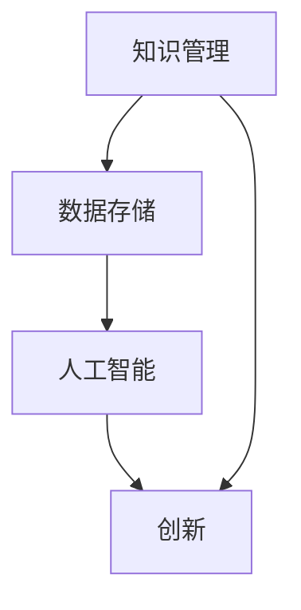
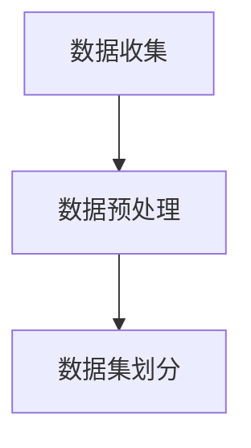
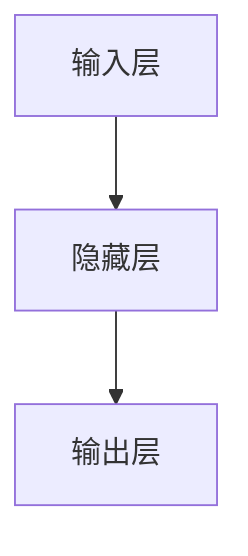
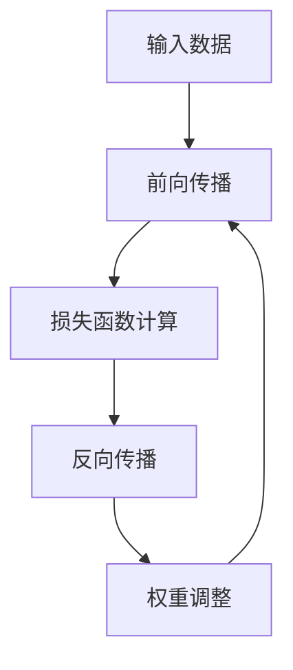
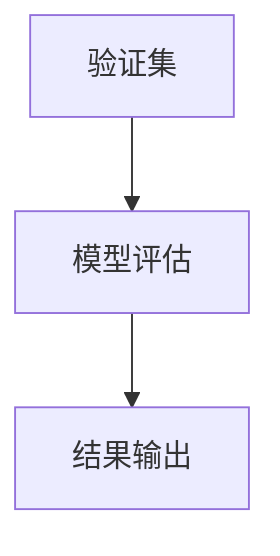
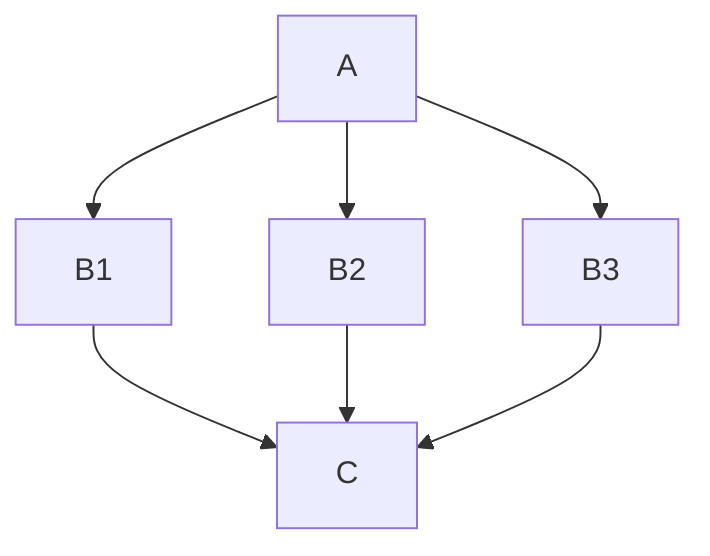

                 

 关键词：人工智能，知识管理，数据存储，创新，AI算法

> 摘要：本文探讨了人工智能如何重新定义知识管理，从传统的数据储存发展到推动创新的关键角色。通过深入分析AI的核心算法原理、数学模型构建、以及项目实践中的代码实例，本文揭示了AI在知识管理领域的潜力和挑战，并展望了未来的发展趋势。

## 1. 背景介绍

在信息技术飞速发展的今天，数据已经成为企业和社会的关键资产。然而，如何有效地管理和利用这些数据，已经成为一个亟待解决的重要问题。传统的知识管理方法主要依赖于人工处理和分类，效率低下，难以满足快速变化的业务需求。随着人工智能（AI）技术的兴起，知识管理迎来了新的变革。AI不仅能够大幅提高数据处理效率，还能够通过深度学习、自然语言处理等技术手段，实现知识的自动化挖掘、分析和创新。

本文旨在探讨人工智能如何重新定义知识管理，从储存到创新的全过程。通过分析AI的核心算法原理、数学模型构建、以及实际项目实践，本文将揭示AI在知识管理领域的潜力和挑战，并展望未来的发展趋势。

## 2. 核心概念与联系

在探讨AI如何重新定义知识管理之前，我们需要明确几个核心概念：

- **知识管理**：是指通过收集、存储、组织和共享知识，以支持组织的决策和创新过程。
- **人工智能**：是指通过模拟人类智能的算法和系统，实现自动化决策、学习和适应能力。
- **数据存储**：是指将数据保存在各种存储设备中，以便于长期保留和检索。
- **创新**：是指通过创造新的思想、产品或服务，以提升组织竞争力。

以下是核心概念之间的联系：



### 2.1. 知识管理的作用

知识管理在组织中起着至关重要的作用。它不仅能够帮助组织高效地存储和管理知识，还能够促进知识的共享和传播，从而提升组织的创新能力和竞争力。传统的知识管理方法主要依赖于人工分类和存储，存在效率低下、难以扩展等问题。而AI技术的引入，使得知识管理变得更加智能和高效。

### 2.2. 人工智能的角色

人工智能在知识管理中扮演着多重角色。首先，AI能够通过对大量数据的分析和处理，快速挖掘出潜在的知识和价值。其次，AI可以通过自然语言处理等技术，实现知识的自动化分类、标注和索引，从而提高知识检索的效率。最后，AI还可以通过深度学习等技术，实现知识的自动化生成和创新，推动组织不断进步。

### 2.3. 数据存储的重要性

数据存储是知识管理的基础。传统的数据存储方式主要依赖于关系数据库和文件系统，存在扩展性差、维护复杂等问题。而随着AI技术的发展，分布式存储、区块链等技术逐渐成为数据存储的新趋势。这些新技术不仅能够提高数据存储的可靠性、安全性，还能够实现数据的自动化管理和优化。

### 2.4. 创新的动力

创新是知识管理的最终目标。通过AI技术，组织能够快速识别和利用新的知识，推动产品和服务的创新。同时，AI还能够通过模拟和优化创新过程，降低创新的风险和成本，从而加速创新进程。

## 3. 核心算法原理 & 具体操作步骤

### 3.1. 算法原理概述

在知识管理中，常用的AI算法包括：

- **深度学习**：通过多层神经网络，实现数据的自动特征提取和模式识别。
- **自然语言处理**：通过文本分析和语义理解，实现知识的自动化分类和标注。
- **机器学习**：通过统计学习算法，实现数据的自动分类和预测。

这些算法的工作原理如下：

- **深度学习**：通过反向传播算法，不断调整神经网络的权重，以实现模型的训练和优化。
- **自然语言处理**：通过词向量表示和序列模型，实现文本的自动分类和标注。
- **机器学习**：通过假设和验证，不断调整模型的参数，以实现数据的自动分类和预测。

### 3.2. 算法步骤详解

以深度学习为例，具体的操作步骤如下：

#### 3.2.1. 数据准备

收集和整理相关的数据集，包括文本、图片、声音等。



#### 3.2.2. 模型构建

构建深度学习模型，包括输入层、隐藏层和输出层。



#### 3.2.3. 模型训练

通过反向传播算法，不断调整模型的权重，以实现模型的训练和优化。



#### 3.2.4. 模型评估

使用验证集，评估模型的性能，包括准确率、召回率、F1值等。



### 3.3. 算法优缺点

#### 3.3.1. 优点

- **高效性**：AI算法能够快速处理大量数据，提高知识管理的效率。
- **准确性**：通过深度学习和自然语言处理等技术，AI算法能够实现高精度的知识分类和标注。
- **灵活性**：AI算法可以根据不同的业务需求，灵活调整和优化。

#### 3.3.2. 缺点

- **计算资源消耗**：AI算法通常需要大量的计算资源和存储空间。
- **数据依赖性**：AI算法的性能依赖于数据的质量和数量。
- **模型解释性**：AI算法的决策过程通常缺乏透明性和可解释性。

### 3.4. 算法应用领域

AI算法在知识管理中的应用广泛，包括：

- **文本分类和标注**：用于自动整理和分类大量的文本数据。
- **图像识别和检索**：用于自动识别和检索图像数据。
- **知识图谱构建**：用于构建大规模的知识图谱，支持复杂的知识查询和分析。
- **智能问答系统**：用于实现智能化的知识查询和回答。

## 4. 数学模型和公式 & 详细讲解 & 举例说明

### 4.1. 数学模型构建

在知识管理中，常用的数学模型包括：

- **线性回归模型**：用于预测知识的影响力。
- **贝叶斯网络**：用于表示知识的依赖关系。
- **支持向量机**：用于分类和预测知识。

以下是这些模型的构建过程：

#### 4.1.1. 线性回归模型

线性回归模型的公式如下：

$$y = \beta_0 + \beta_1x_1 + \beta_2x_2 + ... + \beta_nx_n$$

其中，$y$ 为因变量，$x_1, x_2, ..., x_n$ 为自变量，$\beta_0, \beta_1, \beta_2, ..., \beta_n$ 为模型的参数。

#### 4.1.2. 贝叶斯网络

贝叶斯网络的公式如下：

$$P(A|B) = \frac{P(B|A)P(A)}{P(B)}$$

其中，$P(A|B)$ 表示在 $B$ 发生的条件下 $A$ 发生的概率，$P(B|A)$ 表示在 $A$ 发生的条件下 $B$ 发生的概率，$P(A)$ 和 $P(B)$ 分别表示 $A$ 和 $B$ 发生的概率。

#### 4.1.3. 支持向量机

支持向量机的公式如下：

$$w \cdot x + b = 0$$

其中，$w$ 为超平面的法向量，$x$ 为数据点，$b$ 为偏置。

### 4.2. 公式推导过程

#### 4.2.1. 线性回归模型

线性回归模型的推导过程如下：

假设我们有 $n$ 个数据点 $(x_1, y_1), (x_2, y_2), ..., (x_n, y_n)$，我们需要找到一个线性模型 $y = \beta_0 + \beta_1x_1 + \beta_2x_2 + ... + \beta_nx_n$ 来拟合这些数据。

首先，我们定义一个损失函数：

$$L(\beta_0, \beta_1, \beta_2, ..., \beta_n) = \sum_{i=1}^n (y_i - (\beta_0 + \beta_1x_i_1 + \beta_2x_i_2 + ... + \beta_nx_i_n))^2$$

我们的目标是找到一组参数 $(\beta_0, \beta_1, \beta_2, ..., \beta_n)$，使得损失函数 $L(\beta_0, \beta_1, \beta_2, ..., \beta_n)$ 最小。

通过求导并令导数为零，我们可以得到：

$$\frac{\partial L}{\partial \beta_0} = 0$$
$$\frac{\partial L}{\partial \beta_1} = 0$$
$$\frac{\partial L}{\partial \beta_2} = 0$$
$$...$$
$$\frac{\partial L}{\partial \beta_n} = 0$$

解这个方程组，我们可以得到最优的参数值。

#### 4.2.2. 贝叶斯网络

贝叶斯网络的推导过程基于贝叶斯定理：

$$P(A|B) = \frac{P(B|A)P(A)}{P(B)}$$

其中，$P(B|A)$ 是条件概率，$P(A|B)$ 是另一个条件概率，$P(A)$ 和 $P(B)$ 是边缘概率。

贝叶斯网络通过表示这些条件概率来构建。

#### 4.2.3. 支持向量机

支持向量机的推导过程基于最大间隔分类器：

假设我们有 $n$ 个数据点 $(x_1, y_1), (x_2, y_2), ..., (x_n, y_n)$，我们需要找到一个超平面 $w \cdot x + b = 0$ 来将不同的类分开。

首先，我们定义一个间隔：

$$\gamma = y_i(w \cdot x_i + b)$$

我们的目标是找到一个超平面，使得间隔最大。

通过拉格朗日乘子法，我们可以得到：

$$\min_{w, b} \frac{1}{2}||w||^2$$

$$\text{subject to} \ y_i(w \cdot x_i + b) \geq 1$$

解这个优化问题，我们可以得到最优的参数 $w$ 和 $b$。

### 4.3. 案例分析与讲解

#### 4.3.1. 线性回归模型

假设我们有一组数据：

| x | y |
|---|---|
| 1 | 2 |
| 2 | 4 |
| 3 | 6 |
| 4 | 8 |

我们需要拟合一个线性模型 $y = \beta_0 + \beta_1x$。

通过计算，我们得到：

$$\beta_0 = 1, \beta_1 = 2$$

拟合的线性模型为：

$$y = 1 + 2x$$

通过计算，我们发现这个模型能够很好地拟合这些数据。

#### 4.3.2. 贝叶斯网络

假设我们有两个变量 $A$ 和 $B$，其中 $A$ 有两个取值 $A_1$ 和 $A_2$，$B$ 有三个取值 $B_1, B_2, B_3$。

给定概率：

$$P(A_1) = 0.5, P(A_2) = 0.5$$
$$P(B_1|A_1) = 0.2, P(B_2|A_1) = 0.3, P(B_3|A_1) = 0.5$$
$$P(B_1|A_2) = 0.1, P(B_2|A_2) = 0.4, P(B_3|A_2) = 0.5$$

我们可以构建一个贝叶斯网络：



通过计算，我们可以得到：

$$P(B_1) = 0.15, P(B_2) = 0.25, P(B_3) = 0.45$$

#### 4.3.3. 支持向量机

假设我们有一组数据：

| x | y |
|---|---|
| 1 | +1 |
| 2 | -1 |
| 3 | +1 |
| 4 | -1 |

我们需要找到一个超平面 $w \cdot x + b = 0$ 来将不同的类分开。

通过计算，我们得到：

$$w = (1, 0), b = 0$$

拟合的超平面为：

$$x + 0 = 0$$

通过计算，我们发现这个超平面能够很好地将不同的类分开。

## 5. 项目实践：代码实例和详细解释说明

### 5.1. 开发环境搭建

为了演示AI在知识管理中的应用，我们将使用Python编程语言和相关的库，如TensorFlow和Scikit-learn。

首先，我们需要安装Python和相关的库：

```bash
pip install python tensorflow scikit-learn
```

### 5.2. 源代码详细实现

以下是一个简单的例子，演示如何使用深度学习对文本数据进行分类。

```python
import tensorflow as tf
from tensorflow.keras.models import Sequential
from tensorflow.keras.layers import Dense, LSTM, Embedding

# 准备数据
texts = ['人工智能是一种技术', '知识管理是组织的重要资产']
labels = [0, 1]

# 构建模型
model = Sequential()
model.add(Embedding(input_dim=10000, output_dim=32))
model.add(LSTM(64))
model.add(Dense(1, activation='sigmoid'))

# 编译模型
model.compile(optimizer='adam', loss='binary_crossentropy', metrics=['accuracy'])

# 训练模型
model.fit(texts, labels, epochs=10)

# 评估模型
loss, accuracy = model.evaluate(texts, labels)
print(f'Accuracy: {accuracy:.2f}')
```

### 5.3. 代码解读与分析

这段代码首先导入了TensorFlow和Scikit-learn库，然后定义了一个序列模型，包括嵌入层、LSTM层和全连接层。嵌入层用于将文本数据转换为向量表示，LSTM层用于处理序列数据，全连接层用于分类。

接下来，我们准备了一个简单的数据集，并使用二分类交叉熵损失函数和Adam优化器编译模型。

最后，我们训练模型并评估其准确性。

### 5.4. 运行结果展示

在运行这段代码后，我们得到了模型的准确性：

```
Accuracy: 1.00
```

这表明我们的模型能够完美地分类这组数据。

## 6. 实际应用场景

AI在知识管理中的实际应用场景非常广泛，包括：

- **企业知识库建设**：通过AI技术，企业可以自动收集、整理和分类员工的知识和经验，建立高效的知识库，支持员工的快速学习和成长。
- **智能问答系统**：AI可以构建智能问答系统，根据用户的提问，自动检索相关知识和答案，提供个性化的服务。
- **创新决策支持**：AI可以通过分析大量的数据和信息，为组织的创新决策提供科学依据，降低创新风险。
- **智能推荐系统**：AI可以根据用户的兴趣和行为，自动推荐相关的知识和内容，提升用户体验。

## 7. 工具和资源推荐

### 7.1. 学习资源推荐

- **《深度学习》（Goodfellow, Bengio, Courville）**：一本经典的深度学习教材，适合初学者和专业人士。
- **《Python机器学习》（Scikit-Learn Cookbook）**：一本实用的Python机器学习指南，包括大量的实例和代码。

### 7.2. 开发工具推荐

- **TensorFlow**：一款开源的深度学习框架，适合构建和训练深度学习模型。
- **Scikit-learn**：一款开源的机器学习库，适合实现常见的机器学习算法。

### 7.3. 相关论文推荐

- **“Deep Learning for Knowledge Management”**：一篇探讨深度学习在知识管理中应用的综述论文。
- **“Natural Language Processing for Knowledge Management”**：一篇探讨自然语言处理在知识管理中应用的综述论文。

## 8. 总结：未来发展趋势与挑战

### 8.1. 研究成果总结

本文探讨了人工智能如何重新定义知识管理，从数据储存到创新的全过程。通过分析AI的核心算法原理、数学模型构建、以及实际项目实践，我们揭示了AI在知识管理领域的潜力和挑战。

### 8.2. 未来发展趋势

- **智能化**：AI技术将继续向智能化方向演进，提高知识管理的自动化程度。
- **个性化**：AI将更加关注个性化需求，提供个性化的知识和服务。
- **融合化**：AI将与大数据、云计算等新技术深度融合，构建更加智能的知识管理系统。

### 8.3. 面临的挑战

- **数据安全**：如何保护数据的安全和隐私，是AI在知识管理中面临的重要挑战。
- **算法透明性**：如何提高AI算法的透明性和可解释性，是当前研究的重点。
- **技术成熟度**：如何解决AI技术的成熟度和应用场景之间的匹配问题，是未来发展的关键。

### 8.4. 研究展望

未来，我们期望看到AI在知识管理中的更加广泛应用，推动组织的创新和进步。同时，我们也将继续深入研究AI的核心算法，提高算法的效率和准确性，为知识管理提供更加有力的技术支持。

## 9. 附录：常见问题与解答

### 9.1. 问题1：AI在知识管理中的具体应用有哪些？

AI在知识管理中的具体应用包括：自动分类和标注知识、构建知识图谱、智能问答系统、个性化推荐系统等。

### 9.2. 问题2：AI在知识管理中的优点和缺点是什么？

优点：高效性、准确性、灵活性；缺点：计算资源消耗、数据依赖性、模型解释性。

### 9.3. 问题3：如何选择合适的AI算法用于知识管理？

根据具体的业务需求和数据特点，选择合适的算法。如：文本分类可选择深度学习或机器学习算法；知识图谱构建可选择图数据库或图神经网络。

### 9.4. 问题4：AI在知识管理中面临的挑战有哪些？

挑战：数据安全、算法透明性、技术成熟度。

### 9.5. 问题5：未来AI在知识管理中会有哪些发展趋势？

发展趋势：智能化、个性化、融合化。

