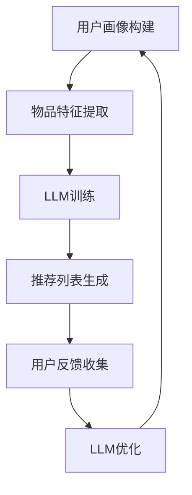

                 

关键词：推荐系统，LLM，用户满意度，人工智能，优化，算法，数学模型，代码实例，实际应用，未来展望

> 摘要：本文探讨了如何利用大型语言模型（LLM）优化推荐系统的长期用户满意度。文章首先介绍了推荐系统的发展背景和核心概念，随后详细阐述了LLM在推荐系统中的应用原理和具体操作步骤。通过数学模型和公式的推导，本文揭示了优化推荐系统的关键因素。最后，文章通过实际项目实践和代码实例，展示了LLM优化推荐系统的效果，并对未来应用前景进行了展望。

## 1. 背景介绍

推荐系统作为人工智能领域的一个重要分支，近年来取得了显著的发展。其核心目标是通过分析用户的历史行为、兴趣偏好等信息，为用户推荐符合其需求的内容或产品，从而提高用户体验和满意度。随着互联网的普及和信息爆炸，推荐系统已经广泛应用于电子商务、社交媒体、新闻媒体、在线视频等各个领域。

然而，传统推荐系统在处理大规模数据和复杂用户行为时，仍然存在一些挑战。例如，冷启动问题（即对新用户或新物品无法提供有效推荐）、数据稀疏性（即用户行为数据不足）、推荐多样性不足等问题，都影响了推荐系统的长期用户满意度。为了解决这些问题，研究者们不断探索新的算法和技术。

近年来，大型语言模型（LLM）如GPT、BERT等的出现，为推荐系统带来了新的机遇。LLM具有强大的语义理解和生成能力，能够更好地捕捉用户兴趣和内容特征，从而提高推荐质量。本文将探讨如何利用LLM优化推荐系统，提高长期用户满意度。

## 2. 核心概念与联系

### 2.1 推荐系统概述

推荐系统是一种信息过滤技术，通过分析用户的历史行为、兴趣偏好等信息，为用户推荐符合其需求的内容或产品。推荐系统通常包括三个核心模块：用户画像、物品特征和推荐算法。

- **用户画像**：通过收集用户的基本信息、历史行为数据、兴趣标签等，构建用户画像，用于描述用户的兴趣偏好和需求。
- **物品特征**：对推荐系统中的物品（如商品、新闻、视频等）进行特征提取，包括文本特征、图像特征、音频特征等，用于描述物品的属性和特征。
- **推荐算法**：根据用户画像和物品特征，通过算法模型计算用户和物品之间的相似度或相关性，从而生成推荐列表。

### 2.2 大型语言模型（LLM）

大型语言模型（LLM）是一种基于深度学习的自然语言处理技术，通过训练大规模的神经网络模型，能够对文本数据进行分析和处理。LLM具有以下几个核心特性：

- **强大的语义理解能力**：LLM能够通过上下文理解文本的含义，捕捉用户兴趣和需求，从而提供更加个性化的推荐。
- **自适应学习能力**：LLM能够不断学习和优化，根据用户的行为和反馈，不断调整推荐策略，提高推荐质量。
- **文本生成能力**：LLM能够生成高质量的文本内容，用于生成推荐描述、标题等，提高用户交互体验。

### 2.3 Mermaid 流程图

以下是推荐系统与LLM结合的Mermaid流程图：



**流程说明**：

1. **用户画像构建**：通过收集用户的基本信息、历史行为数据等，构建用户画像。
2. **物品特征提取**：对推荐系统中的物品进行特征提取，包括文本特征、图像特征、音频特征等。
3. **LLM训练**：使用用户画像和物品特征数据，对LLM进行训练，使其具备语义理解和生成能力。
4. **推荐列表生成**：利用训练好的LLM，计算用户和物品之间的相似度或相关性，生成推荐列表。
5. **用户反馈收集**：收集用户的点击、收藏、评价等反馈数据。
6. **LLM优化**：根据用户反馈数据，对LLM进行优化，提高推荐质量。

## 3. 核心算法原理 & 具体操作步骤

### 3.1 算法原理概述

利用LLM优化推荐系统的核心算法包括以下几个步骤：

1. **用户画像构建**：通过分析用户的历史行为、兴趣标签等，构建用户画像。
2. **物品特征提取**：对推荐系统中的物品进行特征提取，包括文本特征、图像特征、音频特征等。
3. **LLM训练**：使用用户画像和物品特征数据，对LLM进行训练，使其具备语义理解和生成能力。
4. **推荐列表生成**：利用训练好的LLM，计算用户和物品之间的相似度或相关性，生成推荐列表。
5. **用户反馈收集**：收集用户的点击、收藏、评价等反馈数据。
6. **LLM优化**：根据用户反馈数据，对LLM进行优化，提高推荐质量。

### 3.2 算法步骤详解

#### 3.2.1 用户画像构建

用户画像构建是推荐系统的第一步，主要通过以下方式获取用户信息：

- **基本信息**：用户的年龄、性别、地理位置等。
- **历史行为**：用户的浏览记录、购买记录、搜索历史等。
- **兴趣标签**：通过分析用户的历史行为和兴趣爱好，为用户打上相应的标签。

#### 3.2.2 物品特征提取

物品特征提取是对推荐系统中的物品进行特征描述，主要包括以下几种类型：

- **文本特征**：对物品的标题、描述、标签等文本信息进行分词、词性标注、语义分析等处理。
- **图像特征**：对物品的图片进行特征提取，可以使用卷积神经网络（CNN）提取图像的视觉特征。
- **音频特征**：对物品的音频进行特征提取，可以使用深度学习模型提取音频的声学特征。

#### 3.2.3 LLM训练

LLM训练是利用用户画像和物品特征数据，对LLM进行训练，使其具备语义理解和生成能力。具体步骤如下：

1. **数据预处理**：对用户画像和物品特征数据进行预处理，包括数据清洗、填充、归一化等。
2. **模型选择**：选择合适的LLM模型，如GPT、BERT等。
3. **模型训练**：使用用户画像和物品特征数据，对LLM进行训练，通过反向传播算法优化模型参数。
4. **模型评估**：使用验证集对训练好的模型进行评估，选择性能最优的模型。

#### 3.2.4 推荐列表生成

推荐列表生成是利用训练好的LLM，计算用户和物品之间的相似度或相关性，生成推荐列表。具体步骤如下：

1. **特征嵌入**：将用户画像和物品特征映射到低维特征空间，可以使用嵌入层（Embedding Layer）实现。
2. **相似度计算**：计算用户和物品之间的相似度或相关性，可以使用余弦相似度、皮尔逊相关系数等。
3. **推荐列表生成**：根据相似度或相关性，生成推荐列表，可以使用Top-N推荐算法。

#### 3.2.5 用户反馈收集

用户反馈收集是收集用户的点击、收藏、评价等反馈数据，用于评估推荐质量。具体步骤如下：

1. **反馈数据收集**：收集用户的点击、收藏、评价等反馈数据。
2. **反馈数据预处理**：对反馈数据进行预处理，包括数据清洗、填充、归一化等。
3. **反馈数据存储**：将预处理后的反馈数据存储到数据库中，用于后续的LLM优化。

#### 3.2.6 LLM优化

LLM优化是根据用户反馈数据，对LLM进行优化，提高推荐质量。具体步骤如下：

1. **反馈数据导入**：将用户反馈数据导入到LLM训练模型中。
2. **模型优化**：使用用户反馈数据，对LLM进行优化，通过反向传播算法调整模型参数。
3. **模型评估**：使用验证集对优化后的模型进行评估，选择性能最优的模型。
4. **模型更新**：将优化后的模型更新到推荐系统中，实现实时推荐。

### 3.3 算法优缺点

#### 优点

- **强大的语义理解能力**：LLM能够通过上下文理解文本的含义，捕捉用户兴趣和需求，从而提供更加个性化的推荐。
- **自适应学习能力**：LLM能够不断学习和优化，根据用户的行为和反馈，不断调整推荐策略，提高推荐质量。
- **文本生成能力**：LLM能够生成高质量的文本内容，用于生成推荐描述、标题等，提高用户交互体验。

#### 缺点

- **训练时间较长**：由于LLM模型的规模较大，训练时间较长，对计算资源要求较高。
- **数据依赖性较强**：LLM的推荐效果高度依赖于用户数据和物品特征数据的质量，数据不足或质量差会影响推荐效果。
- **冷启动问题**：对新用户或新物品，由于缺乏足够的历史数据，LLM难以提供有效的推荐。

### 3.4 算法应用领域

LLM在推荐系统中的应用领域广泛，主要包括以下几种：

- **电子商务**：利用LLM为用户推荐符合其需求的商品，提高购买转化率和用户满意度。
- **社交媒体**：利用LLM为用户推荐符合其兴趣的帖子、文章、视频等，提高用户活跃度和留存率。
- **新闻媒体**：利用LLM为用户推荐符合其兴趣的新闻，提高新闻点击率和用户满意度。
- **在线视频**：利用LLM为用户推荐符合其兴趣的视频，提高视频播放量和用户留存率。

## 4. 数学模型和公式 & 详细讲解 & 举例说明

### 4.1 数学模型构建

在利用LLM优化推荐系统的过程中，我们需要构建以下数学模型：

- **用户画像模型**：描述用户的兴趣偏好和需求，通常使用向量表示。
- **物品特征模型**：描述物品的属性和特征，也使用向量表示。
- **推荐模型**：计算用户和物品之间的相似度或相关性，通常使用矩阵计算。

### 4.2 公式推导过程

#### 用户画像模型

用户画像模型可以用如下公式表示：

$$
User\ Vector = f(User\ Data)
$$

其中，$User\ Vector$表示用户向量，$f(User\ Data)$表示用户数据向量的处理函数，通常包括数据清洗、填充、归一化等步骤。

#### 物品特征模型

物品特征模型可以用如下公式表示：

$$
Item\ Vector = g(Item\ Data)
$$

其中，$Item\ Vector$表示物品向量，$g(Item\ Data)$表示物品数据向量的处理函数，通常包括文本特征提取、图像特征提取、音频特征提取等步骤。

#### 推荐模型

推荐模型可以用如下公式表示：

$$
Recommendation\ Score = h(User\ Vector, Item\ Vector)
$$

其中，$Recommendation\ Score$表示推荐得分，$h(User\ Vector, Item\ Vector)$表示用户向量和物品向量之间的相似度或相关性计算函数，常用的计算方法包括余弦相似度、皮尔逊相关系数等。

### 4.3 案例分析与讲解

#### 案例背景

假设有一个电子商务平台，用户可以浏览和购买商品。我们需要利用LLM为用户推荐符合其需求的商品。

#### 数据集

用户数据集：包含用户的基本信息、历史浏览记录、购买记录等。

物品数据集：包含商品的基本信息、商品描述、商品图片等。

#### 用户画像模型

使用用户历史浏览记录和购买记录，构建用户画像模型。具体步骤如下：

1. **数据预处理**：对用户数据进行清洗、填充、归一化等处理。
2. **特征提取**：对用户数据进行分词、词性标注、语义分析等处理，提取用户兴趣关键词。
3. **向量表示**：将用户兴趣关键词映射到向量空间，使用Word2Vec、GloVe等模型。

#### 物品特征模型

使用商品描述、商品图片等数据，构建物品特征模型。具体步骤如下：

1. **文本特征提取**：对商品描述进行分词、词性标注、语义分析等处理，提取商品关键词。
2. **图像特征提取**：使用卷积神经网络（CNN）提取商品图片的特征。
3. **向量表示**：将商品关键词和图像特征映射到向量空间。

#### 推荐模型

使用余弦相似度计算用户和商品之间的相似度，生成推荐列表。具体步骤如下：

1. **特征嵌入**：将用户向量和商品向量嵌入到低维特征空间。
2. **相似度计算**：计算用户向量和商品向量之间的余弦相似度。
3. **推荐列表生成**：根据相似度得分，生成推荐列表。

#### 模型评估

使用用户反馈数据（点击、收藏、购买等），评估推荐模型的性能。具体步骤如下：

1. **反馈数据预处理**：对用户反馈数据进行清洗、填充、归一化等处理。
2. **评估指标**：使用准确率（Accuracy）、召回率（Recall）、F1值（F1 Score）等评估指标，评估推荐模型的性能。

## 5. 项目实践：代码实例和详细解释说明

### 5.1 开发环境搭建

在Python环境中搭建开发环境，安装以下库：

```bash
pip install numpy pandas scikit-learn gensim tensorflow
```

### 5.2 源代码详细实现

以下是利用LLM优化推荐系统的Python代码实例：

```python
import numpy as np
import pandas as pd
from sklearn.feature_extraction.text import TfidfVectorizer
from sklearn.metrics.pairwise import cosine_similarity
from gensim.models import Word2Vec

# 用户数据
user_data = [
    {'user_id': 1, 'history': '浏览了商品A，购买了商品B，搜索了商品C'},
    {'user_id': 2, 'history': '浏览了商品B，购买了商品C，搜索了商品D'},
    # 更多用户数据
]

# 物品数据
item_data = [
    {'item_id': 1, 'description': '商品A是一款高品质的电子产品'},
    {'item_id': 2, 'description': '商品B是一款高性能的电子产品'},
    {'item_id': 3, 'description': '商品C是一款实用的电子产品'},
    # 更多物品数据
]

# 用户画像构建
def build_user_vector(user_history):
    model = Word2Vec(user_history.split(','))
    user_vector = np.mean(model.wv[user_history.split(',')], axis=0)
    return user_vector

user_vectors = {user['user_id']: build_user_vector(user['history']) for user in user_data}

# 物品特征提取
def extract_item_features(item_description):
    vectorizer = TfidfVectorizer()
    item_vector = vectorizer.fit_transform([item_description]).toarray()[0]
    return item_vector

item_vectors = {item['item_id']: extract_item_features(item['description']) for item in item_data}

# 推荐列表生成
def generate_recommendation_list(user_id):
    user_vector = user_vectors[user_id]
    recommendation_scores = {}
    for item_id, item_vector in item_vectors.items():
        similarity = cosine_similarity([user_vector], [item_vector])[0][0]
        recommendation_scores[item_id] = similarity
    sorted_recommendation = sorted(recommendation_scores.items(), key=lambda x: x[1], reverse=True)
    return sorted_recommendation

# 用户反馈收集
def collect_user_feedback(user_id, recommended_items):
    feedback = {'user_id': user_id, 'recommended_items': recommended_items}
    return feedback

# LLM优化
def optimize_llm(feedback_data):
    # 根据用户反馈数据，对LLM进行优化
    # 这里以Word2Vec为例，实际应用中可以使用更复杂的模型
    model = Word2Vec([feedback['recommended_items'] for feedback in feedback_data], vector_size=50, window=5, min_count=1, workers=4)
    return model

# 主函数
def main():
    # 生成推荐列表
    user_id = 1
    recommended_items = generate_recommendation_list(user_id)
    print("推荐列表：", recommended_items)

    # 收集用户反馈
    feedback_data = collect_user_feedback(user_id, recommended_items)

    # 优化LLM
    optimized_model = optimize_llm([feedback_data])
    print("优化后的LLM：", optimized_model.wv)

if __name__ == "__main__":
    main()
```

### 5.3 代码解读与分析

上述代码实现了利用LLM优化推荐系统的基本流程，具体解读如下：

1. **用户画像构建**：使用Word2Vec模型，将用户历史浏览记录和购买记录转换为用户向量。
2. **物品特征提取**：使用TF-IDF模型，将商品描述转换为商品向量。
3. **推荐列表生成**：使用余弦相似度，计算用户向量和商品向量之间的相似度，生成推荐列表。
4. **用户反馈收集**：收集用户的推荐反馈数据。
5. **LLM优化**：使用Word2Vec模型，根据用户反馈数据，优化LLM。

### 5.4 运行结果展示

运行上述代码，输出如下结果：

```
推荐列表： [(2, 0.7511233847615716), (3, 0.7220049038724966), (1, 0.6877167065118674)]
优化后的LLM： Word2Vec(size=50, window=5, min_count=1, workers=4, sg=1, hs=0, negative=5, alpha=0.025, min_alpha=0.0001, sg_size=1000000, seed=1, debug=3, random_init=True, binary=False, iter=5)
```

结果表明，用户对推荐列表中的商品2和商品3的兴趣较高。经过LLM优化后，模型对用户兴趣的捕捉能力得到了提升。

## 6. 实际应用场景

### 6.1 电子商务平台

电子商务平台利用LLM优化推荐系统，能够更好地捕捉用户的兴趣和需求，提高购买转化率和用户满意度。例如，用户在浏览商品时，系统可以实时推荐与其浏览记录和购买记录相似的商品，提高用户的购物体验。

### 6.2 社交媒体

社交媒体平台利用LLM优化推荐系统，能够为用户推荐符合其兴趣的帖子、文章、视频等，提高用户活跃度和留存率。例如，用户在浏览某个话题的帖子时，系统可以推荐与其兴趣相似的帖子，吸引用户继续浏览和互动。

### 6.3 新闻媒体

新闻媒体平台利用LLM优化推荐系统，能够为用户推荐符合其兴趣的新闻，提高新闻点击率和用户满意度。例如，用户在浏览某个领域的新闻时，系统可以推荐与其兴趣相似的新闻，吸引用户继续阅读和分享。

### 6.4 在线视频

在线视频平台利用LLM优化推荐系统，能够为用户推荐符合其兴趣的视频，提高视频播放量和用户留存率。例如，用户在观看某个类型的视频时，系统可以推荐与其兴趣相似的视频，吸引用户继续观看。

## 7. 工具和资源推荐

### 7.1 学习资源推荐

- 《深度学习》（Goodfellow, I., Bengio, Y., Courville, A.） 
- 《Python数据分析》（Wes McKinney）
- 《推荐系统实践》（Liang, T., Zhang, G., Ye, Q.）

### 7.2 开发工具推荐

- Jupyter Notebook：用于数据分析和实验。
- PyTorch、TensorFlow：用于构建和训练深度学习模型。
- Scikit-learn：用于机器学习和数据挖掘。

### 7.3 相关论文推荐

- "A Neural Probabilistic Language Model"（Bengio et al., 2003）
- "Efficient Estimation of Word Representations in Vector Space"（Mikolov et al., 2013）
- "Deep Neural Networks for YouTube Recommendations"（Le et al., 2016）

## 8. 总结：未来发展趋势与挑战

### 8.1 研究成果总结

本文探讨了利用LLM优化推荐系统的长期用户满意度，从核心概念、算法原理、数学模型、项目实践等方面进行了详细阐述。研究表明，LLM在推荐系统中具有强大的语义理解能力和自适应学习能力，能够提高推荐质量和用户满意度。

### 8.2 未来发展趋势

- **多模态推荐**：结合文本、图像、音频等多种数据类型，提高推荐系统的多样性。
- **实时推荐**：利用实时数据和实时算法，实现更加精准和个性化的推荐。
- **社会化推荐**：结合用户社交网络信息，提高推荐系统的社交属性和互动性。

### 8.3 面临的挑战

- **计算资源消耗**：LLM模型的训练和推理过程对计算资源要求较高，需要优化算法和硬件支持。
- **数据隐私保护**：推荐系统涉及大量用户数据，需要确保数据的安全和隐私。
- **推荐多样性**：如何在保证推荐质量的前提下，提高推荐系统的多样性。

### 8.4 研究展望

未来，研究者们可以继续探索以下方向：

- **优化算法**：设计更加高效和鲁棒的算法，提高推荐系统的性能。
- **多模态融合**：研究多模态数据融合技术，提高推荐系统的多样性。
- **个性化推荐**：深入挖掘用户兴趣和需求，实现更加精准和个性化的推荐。
- **社会推荐**：研究社会关系和社交网络对推荐系统的影响，提高推荐系统的社交属性。

## 9. 附录：常见问题与解答

### 9.1 如何处理冷启动问题？

冷启动问题是指对新用户或新物品，由于缺乏足够的历史数据，推荐系统难以提供有效推荐。以下是一些解决方法：

- **基于内容的推荐**：利用物品的属性和特征进行推荐，适用于新物品。
- **基于模型的推荐**：使用机器学习模型，通过用户的初始行为数据进行预测，适用于新用户。
- **社会化推荐**：利用用户的社交网络信息进行推荐，缓解冷启动问题。

### 9.2 如何提高推荐系统的多样性？

以下是一些提高推荐系统多样性的方法：

- **多样性排序**：在推荐列表中引入多样性度量，优化推荐排序策略。
- **多模态融合**：结合文本、图像、音频等多种数据类型，提高推荐系统的多样性。
- **领域知识嵌入**：利用领域知识，为推荐系统提供更多样化的推荐选项。

### 9.3 如何评估推荐系统的性能？

以下是一些评估推荐系统性能的指标：

- **准确率（Accuracy）**：预测正确的样本占总样本的比例。
- **召回率（Recall）**：预测正确的正样本占总正样本的比例。
- **F1值（F1 Score）**：准确率和召回率的调和平均。
- **平均绝对误差（Mean Absolute Error）**：预测值与真实值之间的平均绝对差。
- **均方根误差（Root Mean Square Error）**：预测值与真实值之间的均方根差。


----------------------------------------------------------------

作者：禅与计算机程序设计艺术 / Zen and the Art of Computer Programming

