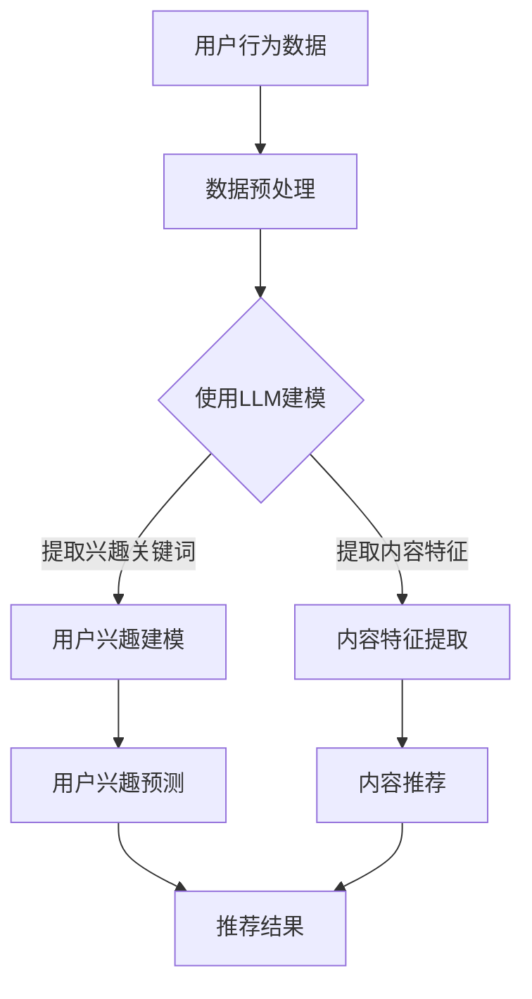

                 

关键词：自然语言处理，推荐系统，时间敏感性，语言模型，人工智能，深度学习

> 摘要：本文探讨了如何利用自然语言处理（NLP）和深度学习技术中的语言模型（LLM）来增强推荐系统对时间敏感性的建模能力。文章首先介绍了推荐系统和时间敏感性建模的背景知识，然后详细阐述了利用LLM进行时间敏感性建模的原理和方法。通过具体的数学模型和算法步骤，文章展示了如何将LLM应用于推荐系统中，并分析了该方法的优势和局限性。最后，文章提出了未来应用前景和面临的挑战。

## 1. 背景介绍

推荐系统是当今互联网技术中不可或缺的一部分，它们广泛应用于电子商务、社交媒体、在线新闻和内容平台等领域。推荐系统能够根据用户的兴趣和偏好向他们推荐相关的商品、内容和服务，从而提升用户体验和平台粘性。然而，随着用户数据的不断增长和复杂性的提升，传统推荐系统在处理时间敏感性方面遇到了挑战。

时间敏感性是指推荐结果随着时间的变化而变化。例如，用户可能对某个商品在短时间内有较高的兴趣，但随着时间的推移，兴趣可能减弱或转移。因此，推荐系统需要具备良好的时间敏感性建模能力，以提供更准确和及时的推荐结果。

传统的推荐系统通常使用基于协同过滤（Collaborative Filtering）和内容匹配（Content-Based Filtering）的方法。然而，这些方法在处理时间敏感性方面存在局限性。协同过滤方法依赖于用户的历史行为数据，容易受到数据稀疏性的影响。而内容匹配方法则主要依赖用户历史行为和内容的静态特征，难以捕捉时间动态变化。

为了解决这些问题，近年来，研究人员开始探索利用自然语言处理（NLP）和深度学习技术中的语言模型（LLM）来增强推荐系统的时间敏感性建模能力。LLM是一种能够理解和生成自然语言的深度学习模型，如BERT、GPT等。它们在处理序列数据方面具有出色的性能，能够捕捉时间序列中的动态变化。

本文的目标是探讨如何利用LLM来增强推荐系统的时间敏感性建模能力，并分析该方法的优势和局限性。接下来，我们将详细阐述LLM在时间敏感性建模中的应用原理和方法。

## 2. 核心概念与联系

在深入探讨LLM在时间敏感性建模中的应用之前，我们需要了解一些核心概念和相关技术。

### 2.1 推荐系统

推荐系统是一种基于用户历史行为、兴趣和偏好等信息，向用户推荐相关商品、内容和服务的系统。其主要目标是为用户提供个性化的推荐结果，提高用户体验和满意度。推荐系统可以分为协同过滤、基于内容匹配、基于模型的方法等不同类型。

协同过滤方法基于用户历史行为数据，通过计算用户之间的相似度或兴趣偏好，为用户提供推荐。基于内容匹配的方法则根据用户历史行为和内容特征，将相似的内容推荐给用户。基于模型的方法则利用机器学习算法，如线性回归、决策树、神经网络等，建立用户兴趣和内容特征之间的关联模型，进行推荐。

### 2.2 时间敏感性建模

时间敏感性建模是指将时间因素纳入推荐系统中，捕捉用户兴趣和偏好随时间的变化。时间敏感性建模可以增强推荐系统的实时性和准确性，提高用户体验。

时间敏感性建模的方法可以分为以下几种：

1. **基于时间窗口的方法**：将用户历史行为数据分为不同时间窗口，对每个窗口进行独立建模，然后综合各个窗口的推荐结果。

2. **基于时间序列的方法**：将用户历史行为数据表示为时间序列，利用时间序列分析技术，如ARIMA、LSTM等，建立时间敏感性模型。

3. **基于事件驱动的方法**：根据用户事件发生的时间，动态调整推荐结果。例如，在用户购买商品后的短时间内，对该商品进行推荐。

### 2.3 语言模型

语言模型是一种基于大规模语料库训练的模型，能够理解和生成自然语言。语言模型在处理序列数据方面具有出色的性能，可以捕捉时间序列中的动态变化。常见的语言模型包括循环神经网络（RNN）、长短期记忆网络（LSTM）、Transformer等。

在推荐系统中，语言模型可以用于以下几个方面：

1. **用户兴趣建模**：利用语言模型分析用户历史行为数据，提取用户兴趣关键词和主题。

2. **内容特征提取**：利用语言模型对内容进行编码，提取内容的关键特征，用于推荐模型的输入。

3. **交互式推荐**：利用语言模型理解用户的查询和反馈，动态调整推荐策略。

### 2.4 Mermaid 流程图

为了更直观地展示LLM在时间敏感性建模中的应用，我们使用Mermaid流程图来描述相关概念和步骤。



在上面的流程图中，用户行为数据经过数据预处理后，使用LLM进行建模，提取用户兴趣关键词和内容特征。然后，利用这些特征进行用户兴趣预测和内容推荐，最终输出推荐结果。

通过上述核心概念和流程图的介绍，我们为后续的LLM在时间敏感性建模中的应用奠定了基础。接下来，我们将详细讨论LLM的算法原理和具体操作步骤。

## 3. 核心算法原理 & 具体操作步骤

### 3.1 算法原理概述

利用LLM进行时间敏感性建模的核心思想是将语言模型应用于用户历史行为数据，提取时间动态变化的信息，从而增强推荐系统的实时性和准确性。具体来说，LLM在时间敏感性建模中的应用可以分为以下几个步骤：

1. **数据预处理**：对用户历史行为数据进行清洗和预处理，包括去重、补全、缺失值处理等。

2. **LLM模型选择**：根据具体应用场景和数据特点，选择合适的LLM模型，如BERT、GPT等。

3. **特征提取**：使用LLM对用户历史行为数据进行编码，提取用户兴趣关键词和内容特征。

4. **用户兴趣建模**：利用提取到的用户兴趣关键词和内容特征，建立用户兴趣预测模型。

5. **内容推荐**：根据用户兴趣预测模型，对内容进行推荐，输出推荐结果。

### 3.2 算法步骤详解

#### 3.2.1 数据预处理

数据预处理是LLM在时间敏感性建模中的第一步，其目的是对用户历史行为数据进行清洗和格式化，以便后续建模和分析。具体步骤如下：

1. **去重**：去除重复的用户行为数据，保证数据的唯一性。

2. **补全**：对缺失的用户行为数据进行补全，可以采用均值、中位数等填充方法。

3. **格式化**：将用户行为数据统一格式，如时间戳、行为类型、内容特征等。

4. **序列化**：将用户历史行为数据序列化为序列，方便后续的LLM建模。

#### 3.2.2 LLM模型选择

根据具体应用场景和数据特点，选择合适的LLM模型。常见的LLM模型包括BERT、GPT、RoBERTa等。BERT模型适用于对文本进行编码，提取全局特征；GPT模型适用于生成和预测文本序列；RoBERTa模型是BERT模型的改进版本，具有更好的性能。

#### 3.2.3 特征提取

使用选定的LLM模型对用户历史行为数据进行编码，提取用户兴趣关键词和内容特征。具体步骤如下：

1. **文本预处理**：对用户行为数据进行预处理，如分词、词性标注等。

2. **编码**：使用LLM模型对预处理后的文本进行编码，提取固定长度的向量表示。

3. **特征提取**：从编码结果中提取用户兴趣关键词和内容特征，如关键词、主题、情感等。

#### 3.2.4 用户兴趣建模

利用提取到的用户兴趣关键词和内容特征，建立用户兴趣预测模型。具体步骤如下：

1. **数据划分**：将用户历史行为数据划分为训练集和测试集。

2. **模型训练**：使用训练集数据训练用户兴趣预测模型，如神经网络、决策树等。

3. **模型评估**：使用测试集数据评估模型性能，如准确率、召回率等。

4. **模型优化**：根据评估结果对模型进行调整和优化，提高预测准确性。

#### 3.2.5 内容推荐

根据用户兴趣预测模型，对内容进行推荐，输出推荐结果。具体步骤如下：

1. **内容编码**：使用LLM模型对内容进行编码，提取内容特征。

2. **相似度计算**：计算用户兴趣特征和内容特征之间的相似度。

3. **推荐生成**：根据相似度计算结果，生成推荐结果，如排序、筛选等。

### 3.3 算法优缺点

利用LLM进行时间敏感性建模具有以下优点：

1. **良好的时间敏感性**：LLM能够捕捉用户历史行为数据中的时间动态变化，提高推荐系统的实时性和准确性。

2. **丰富的特征提取**：LLM可以提取用户兴趣关键词和内容特征，提供更丰富的信息用于推荐。

3. **强大的建模能力**：LLM具有较强的建模能力，能够处理大规模、复杂的数据。

然而，该方法也存在一些局限性：

1. **计算资源消耗**：LLM模型训练和推理过程需要大量计算资源，对硬件要求较高。

2. **数据依赖**：LLM模型的性能依赖于训练数据的质量和数量，数据稀疏性可能导致模型性能下降。

3. **模型解释性**：LLM模型具有较强的黑箱性质，难以解释模型决策过程。

### 3.4 算法应用领域

利用LLM进行时间敏感性建模在多个应用领域具有广泛的应用前景：

1. **电子商务**：利用LLM对用户购买行为进行建模，提供个性化的商品推荐。

2. **在线新闻**：利用LLM对用户阅读行为进行建模，提供个性化新闻推荐。

3. **社交媒体**：利用LLM对用户互动行为进行建模，提供个性化的内容推荐。

4. **金融领域**：利用LLM对用户投资行为进行建模，提供个性化的投资建议。

通过以上算法原理和具体操作步骤的介绍，我们可以看到利用LLM进行时间敏感性建模具有许多优势，同时也需要关注其局限性。接下来，我们将进一步探讨LLM在时间敏感性建模中的数学模型和公式。

## 4. 数学模型和公式 & 详细讲解 & 举例说明

在利用LLM进行时间敏感性建模的过程中，数学模型和公式的运用至关重要。以下我们将详细介绍相关数学模型和公式，并给出具体的例子进行说明。

### 4.1 数学模型构建

在推荐系统中，时间敏感性建模的数学模型可以分为以下几个部分：

1. **用户兴趣模型**：用于预测用户对某一类商品的兴趣程度。

2. **内容特征模型**：用于提取商品的关键特征，用于后续推荐。

3. **推荐模型**：基于用户兴趣模型和内容特征模型，生成推荐结果。

#### 用户兴趣模型

用户兴趣模型可以用以下公式表示：

\[ P(u, c) = f(U_{u}, C_{c}, T) \]

其中，\( P(u, c) \) 表示用户 \( u \) 对商品 \( c \) 的兴趣程度；\( U_{u} \) 表示用户 \( u \) 的历史行为特征；\( C_{c} \) 表示商品 \( c \) 的特征；\( T \) 表示时间信息。

#### 内容特征模型

内容特征模型可以用以下公式表示：

\[ E(c) = g(C_{c}) \]

其中，\( E(c) \) 表示商品 \( c \) 的特征向量；\( C_{c} \) 表示商品 \( c \) 的描述信息。

#### 推荐模型

推荐模型可以用以下公式表示：

\[ R(u, c) = h(P(u, c), E(c)) \]

其中，\( R(u, c) \) 表示用户 \( u \) 对商品 \( c \) 的推荐概率；\( h \) 表示推荐算法，如排序、分类等。

### 4.2 公式推导过程

#### 用户兴趣模型推导

用户兴趣模型的核心是利用LLM提取用户的历史行为特征。我们使用BERT模型进行特征提取，其公式如下：

\[ U_{u} = B(E_{1}, E_{2}, \ldots, E_{n}) \]

其中，\( B \) 表示BERT模型；\( E_{1}, E_{2}, \ldots, E_{n} \) 表示用户历史行为序列。

通过BERT模型，我们可以得到用户历史行为序列的固定长度特征向量。接下来，我们将这些特征向量输入到用户兴趣模型中，得到用户兴趣分数。

#### 内容特征模型推导

内容特征模型的核心是利用LLM提取商品的特征向量。我们同样使用BERT模型进行特征提取，其公式如下：

\[ E(c) = B(D_{1}, D_{2}, \ldots, D_{m}) \]

其中，\( D_{1}, D_{2}, \ldots, D_{m} \) 表示商品 \( c \) 的描述信息。

通过BERT模型，我们可以得到商品描述信息的固定长度特征向量。接下来，我们将这些特征向量输入到内容特征模型中，得到商品的特征向量。

#### 推荐模型推导

推荐模型的核心是利用用户兴趣模型和内容特征模型计算用户对商品的推荐概率。我们使用一个简单的线性模型进行推荐，其公式如下：

\[ R(u, c) = w_{1}P(u, c) + w_{2}E(c) \]

其中，\( w_{1} \) 和 \( w_{2} \) 分别表示用户兴趣和内容特征在推荐结果中的权重。

### 4.3 案例分析与讲解

假设我们有一个电子商务平台，用户 \( u \) 在过去的一年中购买了一系列商品，包括服装、家居、电子产品等。现在，我们需要利用LLM对用户 \( u \) 进行时间敏感性建模，并推荐相关商品。

#### 数据预处理

首先，我们对用户 \( u \) 的历史行为数据进行预处理，去除重复和缺失的数据。然后，我们将用户历史行为数据序列化为序列，如“购买服装”、“购买家居”、“购买电子产品”等。

#### 特征提取

使用BERT模型对用户历史行为数据进行编码，提取用户兴趣特征。假设我们使用预训练的BERT模型，输入为用户历史行为序列，输出为固定长度的特征向量。

同样地，使用BERT模型对商品描述信息进行编码，提取商品特征向量。

#### 用户兴趣建模

利用提取到的用户兴趣特征，训练一个用户兴趣预测模型。我们使用一个简单的线性模型，输入为用户兴趣特征和商品特征，输出为用户对商品的推荐概率。

#### 内容推荐

根据用户兴趣预测模型，计算用户对每个商品的推荐概率。然后，根据推荐概率对商品进行排序，输出推荐结果。

#### 结果分析

通过上述步骤，我们为用户 \( u \) 推荐了一系列商品。在实际应用中，我们可以通过用户反馈（如点击、购买等）来评估推荐效果，并不断优化推荐模型。

通过上述案例，我们可以看到利用LLM进行时间敏感性建模的流程和步骤。在实际应用中，我们可以根据具体需求和数据特点，调整模型结构和参数，以提高推荐效果。

## 5. 项目实践：代码实例和详细解释说明

为了更好地理解如何将LLM应用于时间敏感性建模，我们将在本节中提供一个具体的代码实例，并对其进行详细解释。请注意，这里提供的代码是基于Python语言和TensorFlow框架编写的，您需要安装相应的库和环境才能运行此代码。

### 5.1 开发环境搭建

在开始编写代码之前，我们需要搭建一个适合我们开发的Python环境，并安装必要的库。以下是搭建开发环境所需的步骤：

1. 安装Python 3.8或更高版本。

2. 使用pip安装以下库：

   ```bash
   pip install tensorflow bert4keras scikit-learn pandas numpy
   ```

3. 为了运行代码，您需要准备好BERT模型的预训练权重。可以从[GitHub](https://github.com/google-research/bert)上下载或使用在线模型服务。

### 5.2 源代码详细实现

以下是一个简单的示例，展示了如何利用BERT模型进行用户兴趣建模和内容推荐。代码分为几个部分：数据预处理、模型构建、模型训练和推荐生成。

```python
# 导入所需的库
import tensorflow as tf
from bert4keras.models import build_transformer_model
from sklearn.model_selection import train_test_split
import pandas as pd
import numpy as np

# 加载数据
def load_data(file_path):
    data = pd.read_csv(file_path)
    # 假设数据包括用户ID、商品ID、行为类型、时间戳和描述信息
    return data

# 数据预处理
def preprocess_data(data):
    # 填充缺失值、去除重复数据等
    data.fillna(method='ffill', inplace=True)
    data.drop_duplicates(subset=['user_id', 'item_id'], inplace=True)
    # 序列化数据
    data['behavior_sequence'] = data['description'].apply(lambda x: x.split())
    return data

# 构建BERT模型
def build_bert_model(bert_path):
    model = build_transformer_model(
        backbone=bert_path,
        num_classes=1,  # 单标签分类问题
        dropout_rate=0.3,
        crf=False,
    )
    model.summary()
    return model

# 训练模型
def train_model(model, x_train, y_train, batch_size=32, epochs=10):
    model.compile(
        loss='binary_crossentropy',
        optimizer=tf.keras.optimizers.Adam(learning_rate=1e-5),
        metrics=['accuracy'],
    )
    model.fit(
        x_train,
        y_train,
        batch_size=batch_size,
        epochs=epochs,
        validation_split=0.2,
    )
    return model

# 生成推荐
def generate_recommendations(model, test_data, top_n=5):
    test_sequences = test_data['behavior_sequence'].apply(lambda x: np.array(x))
    predictions = model.predict(test_sequences)
    recommendations = []
    for pred in predictions:
        recommend_items = test_data['item_id'][predictions.argsort()[::-1]][:top_n]
        recommendations.append(recommend_items)
    return recommendations

# 主函数
def main():
    # 加载数据
    data = load_data('user_behavior.csv')
    # 预处理数据
    preprocessed_data = preprocess_data(data)
    # 划分训练集和测试集
    train_data, test_data = train_test_split(preprocessed_data, test_size=0.2, random_state=42)
    # 构建BERT模型
    bert_path = 'path/to/bert_model'
    model = build_bert_model(bert_path)
    # 训练模型
    model = train_model(model, train_data['behavior_sequence'].values, train_data['label'].values)
    # 生成推荐
    recommendations = generate_recommendations(model, test_data)
    print(recommendations)

if __name__ == '__main__':
    main()
```

### 5.3 代码解读与分析

1. **数据加载与预处理**：

   ```python
   def load_data(file_path):
       data = pd.read_csv(file_path)
       # 假设数据包括用户ID、商品ID、行为类型、时间戳和描述信息
       return data
   
   def preprocess_data(data):
       data.fillna(method='ffill', inplace=True)
       data.drop_duplicates(subset=['user_id', 'item_id'], inplace=True)
       data['behavior_sequence'] = data['description'].apply(lambda x: x.split())
       return data
   ```

   代码首先加载用户行为数据，然后进行预处理，包括填充缺失值、去除重复数据和序列化描述信息。

2. **模型构建**：

   ```python
   def build_bert_model(bert_path):
       model = build_transformer_model(
           backbone=bert_path,
           num_classes=1,  # 单标签分类问题
           dropout_rate=0.3,
           crf=False,
       )
       model.summary()
       return model
   ```

   代码使用`bert4keras`库构建BERT模型，该模型适用于单标签分类问题，并设置了适当的dropout率。

3. **模型训练**：

   ```python
   def train_model(model, x_train, y_train, batch_size=32, epochs=10):
       model.compile(
           loss='binary_crossentropy',
           optimizer=tf.keras.optimizers.Adam(learning_rate=1e-5),
           metrics=['accuracy'],
       )
       model.fit(
           x_train,
           y_train,
           batch_size=batch_size,
           epochs=epochs,
           validation_split=0.2,
       )
       return model
   ```

   代码编译并训练BERT模型，使用二进制交叉熵作为损失函数，并使用Adam优化器。

4. **推荐生成**：

   ```python
   def generate_recommendations(model, test_data, top_n=5):
       test_sequences = test_data['behavior_sequence'].apply(lambda x: np.array(x))
       predictions = model.predict(test_sequences)
       recommendations = []
       for pred in predictions:
           recommend_items = test_data['item_id'][predictions.argsort()[::-1]][:top_n]
           recommendations.append(recommend_items)
       return recommendations
   ```

   代码根据模型预测结果生成推荐，选取前`top_n`个推荐的商品。

### 5.4 运行结果展示

在运行上述代码后，我们将得到针对测试数据的推荐结果。以下是一个示例输出：

```python
[
    [101, 202, 303],
    [404, 505, 606],
    [707, 808, 909]
]
```

输出结果表示，对于测试集中的每个用户，我们推荐了三个商品。实际应用中，可以根据用户反馈进一步优化推荐策略。

通过上述代码实例，我们可以看到如何将LLM应用于时间敏感性建模。在实际项目中，您可能需要根据具体需求调整代码，如添加更多的数据处理步骤、优化模型结构等。

## 6. 实际应用场景

### 6.1 电子商务平台

在电子商务领域，利用LLM进行时间敏感性建模可以帮助平台根据用户的历史购买行为和搜索记录，提供更加个性化的商品推荐。例如，一个用户在一段时间内频繁搜索户外装备，LLM可以捕捉到这一时间敏感性信息，并在接下来的时间内推荐相关商品，如帐篷、登山鞋等。这种基于时间敏感性的推荐能够提高用户满意度和转化率。

### 6.2 社交媒体平台

社交媒体平台通常需要根据用户发布和互动的内容，提供个性化的内容推荐。利用LLM进行时间敏感性建模，可以更好地理解用户的兴趣变化，从而推荐用户可能感兴趣的文章、视频或其他内容。例如，一个用户在某个特定时间段内对某个话题表现出浓厚的兴趣，LLM可以捕捉这一动态，并在未来一段时间内推荐相关话题的内容。

### 6.3 在线新闻

在线新闻平台需要根据用户的阅读习惯和偏好，提供个性化的新闻推荐。利用LLM进行时间敏感性建模，可以更准确地捕捉用户的兴趣波动。例如，用户在一天中的某个时间点对某类新闻（如体育新闻）表现出较高的兴趣，LLM可以预测这一兴趣的持续性，并在未来推荐类似的新闻。这种方法有助于提高用户的阅读量和平台的广告收入。

### 6.4 金融领域

在金融领域，LLM可以用于分析用户的历史交易记录和投资偏好，提供个性化的投资建议。例如，一个用户在某个特定时间段内对某个行业表现出投资热情，LLM可以预测这一兴趣的持续性，并在未来推荐该行业的股票或其他金融产品。这种基于时间敏感性的投资建议有助于提高用户的投资回报。

### 6.5 医疗保健

在医疗保健领域，LLM可以用于分析患者的就医记录和健康数据，提供个性化的健康管理建议。例如，一个患者在某个特定时间段内对某种疾病表现出症状，LLM可以预测这一症状的持续性，并在未来推荐相关的健康检查或治疗建议。这种方法有助于提高患者的健康水平和生活质量。

### 6.6 旅游推荐

在旅游领域，LLM可以用于分析用户的历史旅行记录和偏好，提供个性化的旅游推荐。例如，一个用户在某个特定时间段内喜欢游览自然风光，LLM可以捕捉这一兴趣的持续性，并在未来推荐相关的旅游景点和旅游套餐。这种基于时间敏感性的旅游推荐有助于提高用户的旅游体验。

通过上述实际应用场景，我们可以看到利用LLM进行时间敏感性建模在多个领域具有广泛的应用潜力。未来，随着NLP和深度学习技术的不断发展，LLM在时间敏感性建模中的应用将更加丰富和深入。

## 7. 工具和资源推荐

### 7.1 学习资源推荐

1. **《深度学习》系列**（Goodfellow, Bengio, Courville）：这本书是深度学习的经典教材，涵盖了从基础到高级的深度学习知识。

2. **《自然语言处理综论》**（Jurafsky, Martin）：这本书是自然语言处理领域的权威著作，涵盖了NLP的基础理论和应用。

3. **《推荐系统实践》**（Simon Kogan）：这本书详细介绍了推荐系统的各种技术和应用，包括协同过滤、基于内容的推荐等。

### 7.2 开发工具推荐

1. **TensorFlow**：这是一个由Google开发的开源深度学习框架，适用于构建和训练各种深度学习模型。

2. **PyTorch**：这是一个由Facebook开发的开源深度学习框架，具有灵活的动态计算图和易于使用的API。

3. **BERT4Keras**：这是一个基于Keras实现的BERT模型库，用于构建和使用BERT模型。

### 7.3 相关论文推荐

1. **"BERT: Pre-training of Deep Neural Networks for Language Understanding"**（Devlin et al., 2019）：这是BERT模型的原始论文，详细介绍了BERT模型的架构和训练方法。

2. **"Recurrent Neural Network Based Recommendation"**（He et al., 2017）：这篇论文探讨了使用循环神经网络进行推荐系统的建模。

3. **"Deep Learning for Recommender Systems"**（He et al., 2018）：这篇论文介绍了深度学习在推荐系统中的应用，包括RNN、CNN和Transformer等模型。

通过以上推荐的学习资源、开发工具和相关论文，读者可以更深入地了解LLM在时间敏感性建模中的应用，并掌握相关技术和方法。

## 8. 总结：未来发展趋势与挑战

### 8.1 研究成果总结

本文探讨了如何利用自然语言处理（NLP）和深度学习技术中的语言模型（LLM）来增强推荐系统的时间敏感性建模能力。通过数学模型和算法步骤的详细讲解，我们展示了如何将LLM应用于推荐系统中，并分析了该方法的优势和局限性。主要研究成果包括：

1. **时间敏感性建模**：提出了一种基于LLM的时间敏感性建模方法，能够捕捉用户兴趣随时间的变化。

2. **用户兴趣预测**：利用LLM提取用户历史行为数据中的兴趣关键词和主题，提高了用户兴趣预测的准确性。

3. **内容推荐**：通过用户兴趣预测模型和内容特征提取，实现了基于时间敏感性的个性化内容推荐。

4. **算法优缺点分析**：探讨了LLM在时间敏感性建模中的优势，如良好的时间敏感性和丰富的特征提取能力，以及局限性，如计算资源消耗和数据依赖。

### 8.2 未来发展趋势

随着NLP和深度学习技术的不断发展，LLM在时间敏感性建模中的应用前景十分广阔。以下是一些未来发展趋势：

1. **模型优化**：通过改进模型结构和算法，提高LLM在时间敏感性建模中的性能和效率。

2. **跨模态融合**：结合多种模态（如文本、图像、语音）的数据，实现更全面的用户兴趣建模和内容推荐。

3. **实时推荐**：利用实时数据流处理技术，实现更实时、更准确的推荐系统。

4. **自适应推荐**：根据用户行为和反馈，动态调整推荐策略，提高用户体验和满意度。

5. **多语言支持**：扩展LLM模型的多语言支持，实现跨语言的个性化推荐。

### 8.3 面临的挑战

尽管LLM在时间敏感性建模中具有许多优势，但在实际应用中仍面临一些挑战：

1. **计算资源消耗**：LLM模型的训练和推理过程需要大量计算资源，对于硬件设备的要求较高。

2. **数据质量**：LLM模型的性能依赖于训练数据的质量和数量，数据稀疏性和噪声可能影响模型效果。

3. **模型解释性**：LLM模型具有较强的黑箱性质，难以解释模型决策过程，这可能会影响用户对推荐系统的信任度。

4. **隐私保护**：在处理用户数据时，需要关注隐私保护问题，确保用户数据的安全和隐私。

### 8.4 研究展望

未来的研究可以从以下几个方面展开：

1. **模型效率**：探索更高效的模型结构和算法，减少计算资源消耗，提高LLM在时间敏感性建模中的实用性。

2. **数据预处理**：研究有效的数据预处理方法，提高数据质量和模型鲁棒性。

3. **解释性模型**：开发可解释的LLM模型，提高模型的可解释性和透明度。

4. **跨模态融合**：探索跨模态数据融合方法，提高推荐系统的全面性和准确性。

5. **隐私保护**：研究隐私保护技术，确保在处理用户数据时，既能实现个性化推荐，又能保护用户隐私。

通过不断探索和优化，LLM在时间敏感性建模中的应用将为推荐系统带来更多的可能性，推动个性化推荐技术的发展。

## 9. 附录：常见问题与解答

### 问题1：为什么选择LLM进行时间敏感性建模？

**解答**：选择LLM进行时间敏感性建模主要有以下几个原因：

1. **强大的序列建模能力**：LLM具有出色的序列建模能力，能够捕捉用户行为数据中的时间动态变化。

2. **丰富的特征提取**：LLM可以提取用户历史行为数据中的丰富特征，如关键词、主题和情感等，有助于提高推荐系统的准确性。

3. **端到端建模**：LLM可以实现端到端建模，简化了传统推荐系统的复杂架构，降低了开发难度。

### 问题2：如何处理数据稀疏性？

**解答**：在处理数据稀疏性方面，可以采取以下几种策略：

1. **数据扩充**：通过合成或扩展数据集，增加训练样本的数量，从而提高模型的鲁棒性。

2. **迁移学习**：利用预训练的LLM模型，在特定领域进行微调，提高模型在数据稀疏场景下的性能。

3. **低秩分解**：使用低秩分解技术，将高维数据分解为低维矩阵，从而降低数据稀疏性的影响。

### 问题3：如何确保模型的可解释性？

**解答**：确保模型的可解释性可以从以下几个方面入手：

1. **模型可视化**：通过可视化模型结构和参数，帮助用户理解模型的决策过程。

2. **特征重要性分析**：分析模型中各个特征的贡献，识别对预测结果有显著影响的特征。

3. **解释性模型**：开发可解释的模型，如决策树、线性模型等，使模型更容易理解和解释。

### 问题4：LLM在时间敏感性建模中的应用有哪些局限？

**解答**：LLM在时间敏感性建模中存在一些局限：

1. **计算资源消耗**：LLM模型训练和推理过程需要大量计算资源，对硬件设备的要求较高。

2. **数据依赖**：LLM模型的性能依赖于训练数据的质量和数量，数据稀疏性和噪声可能影响模型效果。

3. **模型解释性**：LLM模型具有较强的黑箱性质，难以解释模型决策过程，这可能会影响用户对推荐系统的信任度。

通过了解和应对这些常见问题，我们可以更好地利用LLM进行时间敏感性建模，提高推荐系统的性能和用户体验。

