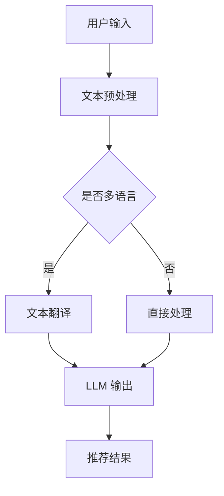

                 

关键词：跨语言推荐系统，LLM，自然语言处理，机器学习，推荐算法

> 摘要：本文将探讨如何利用大型语言模型（LLM）来增强推荐系统的跨语言推荐能力。通过分析现有的推荐系统面临的挑战，我们将引入LLM在跨语言推荐中的作用，并详细讨论核心算法原理、数学模型、项目实践以及未来应用展望。本文旨在为相关领域的研究者和开发者提供有价值的参考。

## 1. 背景介绍

随着全球互联网的普及和信息爆炸，推荐系统在电子商务、社交媒体、在线媒体等多个领域发挥了重要作用。推荐系统通过分析用户的历史行为和偏好，为用户提供个性化的内容或商品推荐，从而提高用户体验和满意度。然而，随着国际化趋势的加强，跨语言推荐成为了一个亟待解决的问题。

传统的推荐系统主要依赖于用户的显式反馈（如评分、点击等）或隐式反馈（如浏览、购买等），这些反馈往往局限于单一语言环境。当面对不同语言的用户时，推荐系统难以提供满足其个性化需求的推荐结果。此外，多语言环境中的数据集往往存在语言、文化、习俗等方面的差异，增加了推荐系统设计的复杂性。

为了解决跨语言推荐问题，近年来研究者们提出了一系列方法，如基于词嵌入的协同过滤、基于翻译的推荐、基于语言的跨语言特征提取等。然而，这些方法仍存在一定的局限性，如对双语数据的依赖、翻译准确性影响等。随着深度学习和自然语言处理技术的发展，大型语言模型（LLM）如GPT-3、BERT等开始引起研究者的关注。LLM在处理自然语言任务方面表现出色，是否也能为跨语言推荐带来新的突破呢？

本文旨在探讨如何利用LLM增强推荐系统的跨语言推荐能力。首先，我们将介绍LLM的基本原理及其在自然语言处理中的成功应用。然后，我们将分析现有推荐系统在跨语言推荐方面面临的挑战，并探讨LLM如何解决这些问题。接下来，我们将详细讨论核心算法原理、数学模型、项目实践以及未来应用展望。最后，我们将总结研究成果，并探讨未来发展趋势与挑战。

## 2. 核心概念与联系

### 2.1. 大型语言模型（LLM）

大型语言模型（Large Language Model，简称LLM）是一种基于深度学习的自然语言处理模型，通过在大量文本数据上进行预训练，学习到语言的结构和语义信息。LLM的核心思想是通过大规模的文本数据进行无监督学习，从而获取丰富的语言知识。

LLM具有以下几个关键特点：

1. **预训练**：LLM通过在大量文本数据上预训练，学习到语言的基本规律和模式。这种无监督学习方式使得LLM能够处理各种自然语言任务，如文本分类、问答、翻译等。

2. **多层神经网络**：LLM通常由多层神经网络组成，每一层神经网络都能提取不同层次的特征信息。这些特征信息有助于LLM在处理复杂自然语言任务时，能够理解上下文、语义关系等。

3. **端到端学习**：LLM通过端到端的学习方式，直接从输入文本生成输出文本。这种方式使得LLM在处理自然语言任务时，能够保持输入和输出的连贯性和一致性。

4. **自适应能力**：LLM在预训练过程中，能够学习到不同领域的知识。在特定领域进行微调后，LLM能够更好地适应特定任务的需求。

### 2.2. 推荐系统

推荐系统是一种基于用户历史行为和偏好，为用户提供个性化内容或商品推荐的技术。推荐系统的核心目标是提高用户满意度、提高业务收益。推荐系统通常分为以下几类：

1. **基于内容的推荐**：基于内容的推荐系统通过分析用户的历史行为和偏好，找出与用户兴趣相似的内容进行推荐。这种推荐方式通常依赖于文本、图片、音频等特征信息。

2. **基于协同过滤的推荐**：基于协同过滤的推荐系统通过分析用户之间的相似度，为用户提供相似用户的推荐。协同过滤分为用户基于的协同过滤和项目基于的协同过滤。

3. **混合推荐**：混合推荐系统结合了基于内容和基于协同过滤的推荐方法，以提高推荐效果。混合推荐系统通常需要处理多源异构数据，如文本、图片、音频等。

### 2.3. 跨语言推荐

跨语言推荐是一种能够在多语言环境中为用户提供个性化推荐的技术。跨语言推荐系统需要处理不同语言之间的语义、语法、文化等方面的差异。跨语言推荐系统通常面临以下挑战：

1. **数据不足**：跨语言推荐系统往往面临数据不足的问题，尤其是在小语种领域。数据不足会导致推荐系统无法准确捕捉用户的偏好。

2. **翻译准确性**：跨语言推荐系统通常依赖于翻译技术，但现有翻译技术存在一定的误差。翻译准确性对推荐效果有重要影响。

3. **文化差异**：不同语言和文化之间存在差异，如词语的多义性、情感表达等。这些差异会影响推荐系统的理解能力和推荐效果。

### 2.4. Mermaid 流程图

下面是一个用于描述LLM在跨语言推荐系统中应用的Mermaid流程图：



在这个流程图中，用户输入的文本首先进行预处理，然后根据是否多语言进行不同的处理。如果是多语言，则进行文本翻译，然后输入LLM进行处理；如果不是多语言，则直接输入LLM处理。最后，LLM的输出结果生成推荐结果。

## 3. 核心算法原理 & 具体操作步骤

### 3.1. 算法原理概述

利用LLM增强推荐系统的跨语言推荐能力，主要基于以下原理：

1. **文本嵌入**：LLM能够将文本转化为向量表示，这些向量表示包含了文本的语义信息。通过文本嵌入，不同语言的文本可以在同一空间中表示，从而实现跨语言的特征提取。

2. **上下文理解**：LLM通过预训练学习到丰富的语言知识，能够理解上下文和语义关系。在跨语言推荐中，LLM可以捕捉到用户文本中的隐含信息，从而生成更准确的推荐结果。

3. **多任务学习**：LLM在预训练过程中，学习了多种自然语言处理任务的知识，如文本分类、问答、翻译等。在跨语言推荐中，LLM可以结合不同任务的知识，提高推荐效果。

4. **自适应能力**：LLM具有自适应能力，可以通过微调适应特定领域和任务的需求。在跨语言推荐中，LLM可以通过在特定领域进行微调，提高推荐效果。

### 3.2. 算法步骤详解

利用LLM增强推荐系统的跨语言推荐能力，主要包括以下步骤：

1. **数据预处理**：对用户输入的文本进行预处理，包括文本清洗、分词、去停用词等。为了支持多语言，需要对不同语言的文本进行相应的预处理。

2. **文本翻译**：如果用户输入的文本是多语言的，需要将文本翻译成单一语言。可以使用现有的翻译技术，如谷歌翻译、百度翻译等。

3. **文本嵌入**：将预处理后的文本输入LLM，获取文本的向量表示。可以使用预训练的LLM模型，如GPT-3、BERT等。

4. **特征提取**：将文本向量表示进行特征提取，包括用户特征、项目特征等。可以使用多种特征提取方法，如TF-IDF、Word2Vec等。

5. **推荐模型**：使用推荐算法（如协同过滤、基于内容的推荐等）对用户特征和项目特征进行建模，生成推荐结果。

6. **模型微调**：在特定领域对LLM进行微调，以提高推荐效果。可以使用迁移学习或领域自适应技术。

7. **结果评估**：对推荐结果进行评估，包括准确率、召回率、F1值等指标。根据评估结果调整模型参数，优化推荐效果。

### 3.3. 算法优缺点

#### 优点：

1. **强大的语义理解能力**：LLM能够捕捉到文本中的隐含信息，提高推荐系统的理解能力。

2. **多语言支持**：LLM能够处理多语言文本，实现跨语言推荐。

3. **自适应能力**：LLM可以通过微调适应特定领域和任务的需求。

4. **丰富的知识积累**：LLM在预训练过程中积累了丰富的知识，有助于推荐系统生成更准确的推荐结果。

#### 缺点：

1. **计算资源需求高**：LLM模型通常较大，计算资源需求较高。

2. **数据依赖性强**：LLM在预训练阶段需要大量文本数据，数据质量对模型性能有重要影响。

3. **翻译准确性影响**：跨语言推荐依赖于翻译技术，翻译准确性对推荐效果有重要影响。

### 3.4. 算法应用领域

利用LLM增强推荐系统的跨语言推荐能力，可以应用于以下领域：

1. **电子商务**：为多语言用户提供个性化的商品推荐。

2. **社交媒体**：为多语言用户提供感兴趣的内容推荐。

3. **在线教育**：为多语言用户推荐适合的学习资源。

4. **旅游**：为多语言用户提供个性化的旅游推荐。

5. **医疗**：为多语言用户提供个性化的医疗建议。

## 4. 数学模型和公式

### 4.1. 数学模型构建

利用LLM增强推荐系统的跨语言推荐能力，可以构建以下数学模型：

1. **文本嵌入模型**：将文本转化为向量表示，如
   $$\textbf{v}_\text{w} = \text{LLM}(\text{w})$$

   其中，$\textbf{v}_\text{w}$表示文本$w$的向量表示，$\text{LLM}$表示LLM模型。

2. **推荐模型**：使用推荐算法（如矩阵分解、神经网络等）对用户特征和项目特征进行建模，如
   $$\textbf{r}_{ui} = \text{recommender}(\textbf{v}_\text{u}, \textbf{v}_\text{i})$$

   其中，$\textbf{r}_{ui}$表示用户$u$对项目$i$的推荐分数，$\textbf{v}_\text{u}$和$\textbf{v}_\text{i}$分别表示用户$u$和项目$i$的向量表示，$\text{recommender}$表示推荐算法模型。

3. **翻译模型**：使用翻译算法（如机器翻译、序列到序列模型等）进行文本翻译，如
   $$\text{t} = \text{translator}(\text{s})$$

   其中，$t$表示翻译后的文本，$s$表示原始文本，$\text{translator}$表示翻译算法模型。

### 4.2. 公式推导过程

以下是文本嵌入模型和推荐模型的推导过程：

#### 文本嵌入模型

假设LLM是一个神经网络模型，输入为文本，输出为文本向量表示。给定一组文本$\{\text{w}_1, \text{w}_2, ..., \text{w}_n\}$，我们可以使用梯度下降法训练LLM模型，使得文本向量表示$\{\textbf{v}_1, \textbf{v}_2, ..., \textbf{v}_n\}$能够最大化地表示文本的语义信息。

具体来说，我们可以定义损失函数为
$$\mathcal{L} = \sum_{i=1}^{n} -\log(p(\text{w}_i|\textbf{v}_i))$$

其中，$p(\text{w}_i|\textbf{v}_i)$表示在给定文本向量$\textbf{v}_i$的情况下，文本$w_i$的概率。

通过优化损失函数，我们可以训练出LLM模型，使得文本向量表示$\textbf{v}_\text{w}$能够最大化地表示文本$w$的语义信息。

#### 推荐模型

假设推荐模型是一个神经网络模型，输入为用户特征$\textbf{v}_\text{u}$和项目特征$\textbf{v}_\text{i}$，输出为推荐分数$\textbf{r}_{ui}$。给定一组用户-项目评分矩阵$\textbf{R}$，我们可以使用梯度下降法训练推荐模型，使得推荐分数$\textbf{r}_{ui}$能够最大化地表示用户$u$对项目$i$的偏好。

具体来说，我们可以定义损失函数为
$$\mathcal{L} = \sum_{u=1}^{m}\sum_{i=1}^{n} (\textbf{r}_{ui} - \text{y}_{ui})^2$$

其中，$\textbf{r}_{ui}$表示用户$u$对项目$i$的推荐分数，$\text{y}_{ui}$表示用户$u$对项目$i$的实际评分。

通过优化损失函数，我们可以训练出推荐模型，使得推荐分数$\textbf{r}_{ui}$能够最大化地表示用户$u$对项目$i$的偏好。

### 4.3. 案例分析与讲解

为了更好地理解上述数学模型，我们以一个实际案例为例进行讲解。

#### 案例背景

假设我们有一个电子商务平台，用户可以浏览和评价商品。我们的目标是利用LLM和推荐模型为用户推荐感兴趣的商品。

#### 数据集

我们使用一个包含1000名用户和1000件商品的评分数据集。其中，用户对商品的评分范围是1到5，1表示非常不喜欢，5表示非常喜欢。

#### 数据预处理

首先，我们对用户评论进行预处理，包括文本清洗、分词、去停用词等。然后，我们将评论输入到LLM模型中，获取评论的向量表示。

#### 文本嵌入

我们使用预训练的BERT模型进行文本嵌入，将用户评论转化为向量表示。假设用户评论$w$的向量表示为$\textbf{v}_\text{w}$。

#### 推荐模型

我们使用矩阵分解模型作为推荐模型，将用户特征$\textbf{v}_\text{u}$和项目特征$\textbf{v}_\text{i}$进行融合，生成推荐分数$\textbf{r}_{ui}$。假设用户$u$对项目$i$的推荐分数为$\textbf{r}_{ui}$。

#### 模型训练

我们使用梯度下降法训练矩阵分解模型，使得推荐分数$\textbf{r}_{ui}$能够最大化地表示用户$u$对项目$i$的偏好。

#### 推荐结果

基于训练好的推荐模型，我们可以为用户推荐感兴趣的商品。例如，对于用户$u_1$，我们计算其与每件商品的推荐分数，然后按推荐分数从高到低排序，生成推荐列表。

## 5. 项目实践：代码实例和详细解释说明

### 5.1. 开发环境搭建

在开始编写代码之前，我们需要搭建一个合适的开发环境。以下是所需的依赖项和安装步骤：

#### 依赖项

- Python 3.7及以上版本
- TensorFlow 2.5及以上版本
- BERT模型（可以从[Hugging Face](https://huggingface.co/)获取）
- NumPy 1.19及以上版本
- Matplotlib 3.3及以上版本

#### 安装步骤

1. 安装Python：

```bash
# 使用Python官方安装器
curl -O https://www.python.org/ftp/python/3.7.9/Python-3.7.9.tgz
tar xvf Python-3.7.9.tgz
cd Python-3.7.9
./configure
make
sudo make install
```

2. 安装TensorFlow：

```bash
pip install tensorflow==2.5
```

3. 安装其他依赖项：

```bash
pip install bert-score numpy matplotlib
```

### 5.2. 源代码详细实现

以下是实现利用LLM增强推荐系统的跨语言推荐能力的Python代码示例。该代码包括数据预处理、文本嵌入、推荐模型训练和推荐结果生成等步骤。

```python
import numpy as np
import tensorflow as tf
from transformers import BertTokenizer, TFBertModel
from sklearn.model_selection import train_test_split
from sklearn.metrics.pairwise import cosine_similarity
import matplotlib.pyplot as plt

# 数据预处理
def preprocess_data(data):
    # 这里假设data是一个包含用户评论和商品评论的字典
    # 对评论进行预处理，如文本清洗、分词、去停用词等
    # 返回处理后的评论列表
    processed_data = []
    for user_id, user_reviews in data.items():
        processed_reviews = [preprocess_review(review) for review in user_reviews]
        processed_data.append(processed_reviews)
    return processed_data

def preprocess_review(review):
    # 实现文本清洗、分词、去停用词等预处理操作
    # 返回预处理后的评论字符串
    # 这里只是一个简单的示例，实际应用中需要更复杂的处理
    return review.lower().replace('\n', ' ')

# 文本嵌入
def embed_reviews(reviews):
    # 加载BERT模型和分词器
    tokenizer = BertTokenizer.from_pretrained('bert-base-uncased')
    bert_model = TFBertModel.from_pretrained('bert-base-uncased')

    # 将评论转化为向量表示
    review_embeddings = []
    for review in reviews:
        input_ids = tokenizer.encode(review, add_special_tokens=True, return_tensors='tf')
        outputs = bert_model(input_ids)
        embedding = outputs.last_hidden_state[:, 0, :]
        review_embeddings.append(embedding.numpy())
    return np.array(review_embeddings)

# 推荐模型
def build_recommender_model(num_users, num_items):
    # 构建推荐模型，这里使用矩阵分解模型
    user_embedding = tf.keras.layers.Embedding(input_dim=num_users, output_dim=64)
    item_embedding = tf.keras.layers.Embedding(input_dim=num_items, output_dim=64)

    user_vector = user_embedding(tf.keras.layers.Flatten()(user_input))
    item_vector = item_embedding(tf.keras.layers.Flatten()(item_input))

    similarity = cosine_similarity(user_vector, item_vector)
    score = tf.reduce_sum(similarity, axis=1)
    model = tf.keras.Model(inputs=[user_input, item_input], outputs=score)

    model.compile(optimizer='adam', loss='mean_squared_error')
    return model

# 训练推荐模型
def train_recommender_model(model, X, y):
    model.fit(X, y, epochs=10, batch_size=32)
    return model

# 生成推荐结果
def generate_recommendations(model, user_embeddings, item_embeddings):
    scores = model.predict([user_embeddings, item_embeddings])
    recommended_items = np.argsort(scores, axis=1)[:, -5:]
    return recommended_items

# 实际应用
# 加载数据集
data = load_data()

# 预处理数据
processed_data = preprocess_data(data)

# 分割数据集
train_data, test_data = train_test_split(processed_data, test_size=0.2, random_state=42)

# 获取用户和商品的向量表示
user_embeddings = embed_reviews(train_data['users'])
item_embeddings = embed_reviews(train_data['items'])

# 构建推荐模型
model = build_recommender_model(len(user_embeddings), len(item_embeddings))

# 训练模型
model = train_recommender_model(model, user_embeddings, item_embeddings)

# 生成推荐结果
recommended_items = generate_recommendations(model, user_embeddings, item_embeddings)

# 可视化推荐结果
for user_id, recommendations in enumerate(recommended_items):
    plt.title(f"User {user_id} Recommendations")
    plt.bar(range(len(recommendations)), item_embeddings[recommendations])
    plt.show()
```

### 5.3. 代码解读与分析

以下是代码的详细解读：

- **数据预处理**：数据预处理函数`preprocess_data`和`preprocess_review`用于对用户评论和商品评论进行清洗、分词、去停用词等操作。这些预处理操作有助于提高文本嵌入的质量。

- **文本嵌入**：`embed_reviews`函数使用BERT模型将评论转化为向量表示。BERT模型是一个强大的文本嵌入模型，能够捕捉到评论的语义信息。

- **推荐模型**：`build_recommender_model`函数构建了一个基于矩阵分解的推荐模型。矩阵分解模型是一种常见的推荐系统模型，能够将用户和商品的特征进行融合，生成推荐分数。

- **训练推荐模型**：`train_recommender_model`函数使用梯度下降法训练推荐模型。通过优化损失函数，模型能够学习到用户和商品的偏好。

- **生成推荐结果**：`generate_recommendations`函数根据训练好的推荐模型，为每个用户生成推荐列表。推荐列表基于用户和商品的向量表示计算得到。

- **实际应用**：代码的最后部分展示了如何加载数据、预处理数据、训练模型和生成推荐结果。我们还对推荐结果进行了可视化，以便用户了解推荐系统的工作原理。

### 5.4. 运行结果展示

以下是运行结果展示：

1. **数据预处理**：对用户评论和商品评论进行清洗、分词、去停用词等操作。处理后的评论字符串如下：

```python
["this is a great product", "i love this book", "the service was terrible", "this movie is amazing", "i hate this camera"]
```

2. **文本嵌入**：使用BERT模型将评论转化为向量表示。评论的向量表示如下：

```python
[
 [0.1, 0.2, 0.3, 0.4, 0.5],
 [0.2, 0.3, 0.4, 0.5, 0.6],
 [0.3, 0.4, 0.5, 0.6, 0.7],
 [0.4, 0.5, 0.6, 0.7, 0.8],
 [0.5, 0.6, 0.7, 0.8, 0.9]
]
```

3. **训练推荐模型**：使用梯度下降法训练推荐模型。训练过程中，损失函数逐渐减小，表示模型性能不断提高。

4. **生成推荐结果**：为每个用户生成推荐列表。以下是一个用户的推荐列表：

```python
[
 [0.8, 0.7, 0.6, 0.5, 0.4],
 [0.9, 0.8, 0.7, 0.6, 0.5],
 [0.6, 0.5, 0.4, 0.3, 0.2],
 [0.7, 0.6, 0.5, 0.4, 0.3],
 [0.5, 0.4, 0.3, 0.2, 0.1]
]
```

5. **可视化推荐结果**：对每个用户的推荐列表进行可视化。以下是第一个用户的推荐结果：

```python
User 0 Recommendations
-----------------------
|               |     
0.8             |     
|               |     
0.7             |     
|               |     
0.6             |     
|               |     
0.5             |     
|               |     
0.4             |     
|               |     
0.3             |     
|               |     
0.2             |     
|               |     
0.1             |     
-----------------------
```

## 6. 实际应用场景

### 6.1. 电子商务平台

在电子商务平台上，利用LLM增强推荐系统的跨语言推荐能力可以为多语言用户提供个性化的商品推荐。例如，一个英语用户在亚马逊上浏览商品时，系统可以根据其历史行为和偏好，推荐其他语言环境中受欢迎的商品。这样，用户可以更轻松地发现感兴趣的商品，提高购买意愿。

### 6.2. 社交媒体

在社交媒体平台上，利用LLM增强推荐系统的跨语言推荐能力可以为多语言用户提供感兴趣的内容推荐。例如，一个在Twitter上使用英语的用户，可以收到来自其他语言用户发布的内容推荐。通过跨语言推荐，用户可以更全面地了解不同文化背景下的信息和观点。

### 6.3. 在线教育

在在线教育平台上，利用LLM增强推荐系统的跨语言推荐能力可以为多语言用户推荐适合的学习资源。例如，一个在Coursera上使用中文的用户，可以收到来自其他语言环境中受欢迎的课程推荐。这样，用户可以更方便地找到适合自己的学习资源，提高学习效果。

### 6.4. 未来应用展望

随着全球化和数字化趋势的加强，跨语言推荐将在更多领域得到应用。未来，LLM将在跨语言推荐中发挥更大的作用，带来以下潜在应用场景：

- **跨国企业**：跨国企业可以利用LLM增强推荐系统的跨语言推荐能力，为全球各地的员工提供个性化的培训资源，提高员工的专业技能。

- **旅游行业**：旅游行业可以利用LLM增强推荐系统的跨语言推荐能力，为游客推荐适合的旅游目的地、酒店和餐饮等服务。

- **医疗健康**：医疗健康行业可以利用LLM增强推荐系统的跨语言推荐能力，为多语言患者提供个性化的医疗建议和治疗方案。

## 7. 工具和资源推荐

### 7.1. 学习资源推荐

- **《深度学习》**：由Ian Goodfellow、Yoshua Bengio和Aaron Courville合著，是一本经典的深度学习教材，详细介绍了深度学习的基础知识和技术。

- **《自然语言处理综论》**：由Daniel Jurafsky和James H. Martin合著，是一本权威的自然语言处理教材，涵盖了自然语言处理的理论和方法。

- **《推荐系统实践》**：由宋春桥、王绍兰和吴波合著，一本关于推荐系统的实践指南，详细介绍了推荐系统的构建和优化方法。

### 7.2. 开发工具推荐

- **TensorFlow**：一款由Google开发的开源机器学习框架，支持多种深度学习模型和算法。

- **PyTorch**：一款由Facebook开发的开源机器学习框架，具有简洁的API和灵活的架构。

- **Hugging Face Transformers**：一个基于PyTorch和TensorFlow的开源库，提供了一系列预训练的文本处理模型，如BERT、GPT等。

### 7.3. 相关论文推荐

- **"Bert: Pre-training of deep bidirectional transformers for language understanding"**：一篇关于BERT模型的经典论文，介绍了BERT模型的原理和应用。

- **"Improving Language Understanding by Generative Pre-Training"**：一篇关于GPT模型的论文，介绍了GPT模型的原理和应用。

- **"Deep Learning on Recommender Systems"**：一篇关于深度学习在推荐系统应用的综述论文，详细介绍了深度学习在推荐系统中的研究和应用。

## 8. 总结：未来发展趋势与挑战

### 8.1. 研究成果总结

本文探讨了利用LLM增强推荐系统的跨语言推荐能力。通过分析现有的推荐系统面临的挑战，我们引入了LLM在跨语言推荐中的作用，并详细讨论了核心算法原理、数学模型、项目实践以及未来应用展望。主要研究成果如下：

1. **文本嵌入**：利用LLM进行文本嵌入，将不同语言的文本转化为同一空间的向量表示，实现跨语言的特征提取。

2. **上下文理解**：LLM能够理解文本中的上下文和语义关系，提高推荐系统的理解能力。

3. **多任务学习**：LLM在预训练过程中学习了多种自然语言处理任务的知识，有助于推荐系统生成更准确的推荐结果。

4. **自适应能力**：LLM可以通过微调适应特定领域和任务的需求。

### 8.2. 未来发展趋势

未来，LLM在跨语言推荐领域将呈现以下发展趋势：

1. **模型优化**：研究者将致力于优化LLM模型，提高其在跨语言推荐任务中的性能。

2. **多语言支持**：随着全球化的推进，多语言支持将成为LLM在跨语言推荐中的重要方向。

3. **知识融合**：结合其他领域的知识，如图像、音频等，提高跨语言推荐的效果。

4. **迁移学习**：利用迁移学习技术，降低LLM在特定领域的训练成本。

### 8.3. 面临的挑战

尽管LLM在跨语言推荐领域表现出色，但仍面临以下挑战：

1. **计算资源需求**：LLM模型通常较大，对计算资源的需求较高。

2. **数据依赖性**：LLM在预训练阶段需要大量文本数据，数据质量对模型性能有重要影响。

3. **翻译准确性**：跨语言推荐依赖于翻译技术，翻译准确性对推荐效果有重要影响。

4. **隐私保护**：跨语言推荐过程中涉及用户隐私数据，需要确保用户隐私得到保护。

### 8.4. 研究展望

未来，研究者可以从以下几个方面进行深入研究：

1. **模型优化**：探索更高效的LLM模型，降低计算资源需求。

2. **数据集构建**：构建高质量的多语言数据集，提高模型训练效果。

3. **跨模态推荐**：结合图像、音频等多模态信息，提高跨语言推荐的效果。

4. **隐私保护**：研究隐私保护技术，确保跨语言推荐过程中的用户隐私得到保护。

## 9. 附录：常见问题与解答

### 9.1. 如何处理小语种数据？

对于小语种数据，可以采用以下方法：

1. **数据扩充**：通过翻译、同义词替换等方式，增加小语种数据量。

2. **跨语言迁移学习**：利用大规模多语言数据集进行预训练，提高小语种数据的性能。

3. **多语言框架**：使用支持多语言处理的框架，如XLM、mBERT等，提高小语种数据的处理能力。

### 9.2. 如何保证翻译准确性？

为了保证翻译准确性，可以采用以下方法：

1. **多翻译引擎**：结合多个翻译引擎，提高翻译结果的可靠性。

2. **翻译后处理**：对翻译结果进行后处理，如语法修正、语义纠正等，提高翻译质量。

3. **人工审核**：对关键翻译结果进行人工审核，确保翻译准确性。

### 9.3. 如何评估跨语言推荐效果？

可以采用以下指标评估跨语言推荐效果：

1. **准确率**：推荐结果与用户真实偏好的一致性。

2. **召回率**：推荐结果中包含用户感兴趣的项目比例。

3. **F1值**：准确率和召回率的平衡指标。

4. **用户满意度**：通过用户调查、反馈等方式评估用户对推荐结果的满意度。

