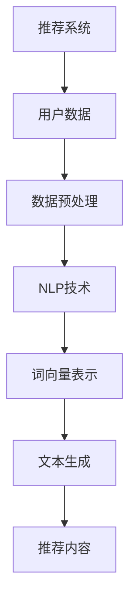

                 

关键词：推荐系统、LLM、自然语言处理、多样性、新颖性、算法优化

## 摘要

本文旨在探讨如何利用自然语言处理（NLP）领域的重要技术——大型语言模型（LLM），提升推荐系统的多样性与新颖性。通过对LLM的工作原理和推荐系统现有问题的深入分析，本文提出了一系列技术方案和数学模型，以实现推荐系统的优化。文章还将通过实际项目实践，展示如何将这些技术应用到具体场景中，为推荐系统领域的研究者和开发者提供实用的指导。

## 1. 背景介绍

推荐系统作为信息过滤和检索的重要组成部分，广泛应用于电子商务、社交媒体、新闻推送等领域。然而，传统推荐系统在提供个性化推荐时，往往容易陷入“马太效应”，即推荐内容高度同质化，导致用户接收到的信息缺乏多样性和新颖性。这一问题不仅限制了用户的使用体验，也可能导致用户对系统的信任度下降。

近年来，随着深度学习和自然语言处理技术的快速发展，大型语言模型（LLM）逐渐成为解决推荐系统多样性与新颖性问题的有力工具。LLM通过学习海量的文本数据，能够捕捉到语言中的复杂模式和语义信息，从而在推荐生成过程中引入更多的多样性和新颖性。

## 2. 核心概念与联系

为了深入理解如何利用LLM提升推荐系统的多样性与新颖性，我们需要首先明确几个关键概念和它们之间的联系。

### 2.1 推荐系统

推荐系统是一种基于数据挖掘和机器学习技术的信息过滤方法，旨在根据用户的兴趣和偏好，为其推荐可能感兴趣的内容。常见的推荐算法包括基于内容的推荐（Content-Based Filtering，CBF）、协同过滤（Collaborative Filtering，CF）以及混合推荐（Hybrid Recommendation）等。

### 2.2 自然语言处理

自然语言处理（NLP）是计算机科学和人工智能领域的一个重要分支，致力于使计算机能够理解和处理人类语言。NLP的关键技术包括词向量表示、文本分类、命名实体识别、情感分析等。

### 2.3 大型语言模型

大型语言模型（LLM）是NLP领域的一种先进模型，例如GPT、BERT等。这些模型通过学习大规模的文本数据，能够生成连贯、语义丰富的文本，从而在推荐系统中引入新的思路和方法。

### 2.4 推荐系统与NLP的联系

推荐系统与NLP之间的联系主要体现在数据表示和文本生成两个方面。首先，通过NLP技术，我们可以将用户的兴趣、偏好和推荐内容转化为结构化的数据表示，如词向量或语义表示，从而为推荐算法提供输入。其次，利用NLP中的文本生成技术，我们可以为推荐系统生成具有多样性和新颖性的推荐内容。

## 2.5 Mermaid 流程图

下面是一个简单的Mermaid流程图，展示了推荐系统与NLP之间的核心联系。



## 3. 核心算法原理 & 具体操作步骤

### 3.1 算法原理概述

利用LLM提升推荐系统的多样性与新颖性的核心思想在于将NLP技术融入推荐算法中，通过以下步骤实现：

1. **数据表示**：使用NLP技术对用户数据和推荐内容进行语义表示。
2. **文本生成**：利用LLM生成具有多样性和新颖性的文本内容。
3. **推荐生成**：基于用户语义表示和生成的文本内容，生成个性化的推荐结果。

### 3.2 算法步骤详解

#### 3.2.1 数据表示

首先，我们需要使用NLP技术对用户兴趣和推荐内容进行语义表示。这一步骤包括以下几步：

1. **文本预处理**：对用户评论、反馈等文本数据进行清洗和格式化，去除无关信息。
2. **词向量表示**：将预处理后的文本数据转化为词向量，如使用Word2Vec、BERT等模型。
3. **语义表示**：对词向量进行聚合和编码，生成用户兴趣和内容的语义表示。

#### 3.2.2 文本生成

接下来，我们利用LLM生成具有多样性和新颖性的文本内容。具体步骤如下：

1. **初始化LLM**：选择合适的LLM模型，如GPT、BERT等，并进行初始化。
2. **文本生成**：输入用户兴趣和内容的语义表示，通过LLM生成文本内容。这一过程包括以下几个阶段：
   - **生成初始文本**：基于用户兴趣和内容语义表示，生成初始文本。
   - **优化文本**：对生成的初始文本进行优化，使其具有更高的多样性和新颖性。这一步骤可以通过以下方法实现：
     - **多样性增强**：通过引入随机性、使用不同的文本生成策略等手段，增加生成文本的多样性。
     - **新颖性评估**：利用NLP技术评估生成文本的新颖性，如通过对比分析、语义相似度计算等方法。

#### 3.2.3 推荐生成

最后，我们基于用户兴趣和生成的文本内容，生成个性化的推荐结果。具体步骤如下：

1. **推荐内容筛选**：从候选推荐内容中筛选出与用户兴趣和生成文本内容相关的推荐项。
2. **推荐排序**：对筛选出的推荐项进行排序，生成最终的推荐结果。排序方法可以采用基于用户兴趣的相似度计算、文本生成内容的质量评估等多种方法。

### 3.3 算法优缺点

#### 优点

1. **多样性增强**：利用LLM的文本生成能力，可以生成具有丰富多样性的推荐内容。
2. **新颖性提升**：通过评估生成文本的新颖性，可以确保推荐内容具有更高的新颖性。
3. **个性化推荐**：结合用户兴趣和生成文本内容，可以实现更个性化的推荐。

#### 缺点

1. **计算资源消耗**：训练和使用LLM模型需要大量的计算资源和时间。
2. **数据需求**：生成高质量、新颖的推荐内容需要大量的文本数据。

### 3.4 算法应用领域

利用LLM提升推荐系统的多样性与新颖性可以在多个领域得到广泛应用，如：

1. **电子商务**：为用户提供个性化的商品推荐，提升用户购买体验。
2. **社交媒体**：生成有趣、新颖的内容推荐，吸引用户关注和互动。
3. **新闻推送**：为用户提供个性化的新闻推荐，提高新闻内容的多样性。

## 4. 数学模型和公式 & 详细讲解 & 举例说明

为了深入理解如何利用LLM提升推荐系统的多样性与新颖性，我们需要引入一些数学模型和公式。以下是具体的数学模型构建、公式推导过程以及案例分析与讲解。

### 4.1 数学模型构建

在推荐系统中，我们可以将用户兴趣和推荐内容表示为向量形式，如下所示：

\[ \textbf{u} = (u_1, u_2, ..., u_n) \]
\[ \textbf{i} = (i_1, i_2, ..., i_n) \]

其中，\( \textbf{u} \) 和 \( \textbf{i} \) 分别表示用户兴趣向量和推荐内容向量。

为了评估生成文本的新颖性，我们可以使用以下新颖性评估函数：

\[ \textit{novelty}(\textbf{i}, \textbf{g}) = \frac{1}{\|\textbf{i} - \textbf{g}\|^2} \]

其中，\( \textbf{g} \) 表示生成文本向量。

### 4.2 公式推导过程

为了更直观地理解新颖性评估函数，我们可以对其进行以下推导：

\[ \textit{novelty}(\textbf{i}, \textbf{g}) = \frac{1}{(\textbf{i} - \textbf{g}) \cdot (\textbf{i} - \textbf{g})} \]
\[ = \frac{1}{\textbf{i} \cdot \textbf{i} - 2\textbf{i} \cdot \textbf{g} + \textbf{g} \cdot \textbf{g}} \]
\[ = \frac{1}{\|\textbf{i}\|^2 - 2\textbf{i} \cdot \textbf{g} + \|\textbf{g}\|^2} \]
\[ = \frac{1}{\|\textbf{i} - \textbf{g}\|^2} \]

其中，\( \cdot \) 表示向量内积，\( \|\textbf{v}\| \) 表示向量 \( \textbf{v} \) 的模。

### 4.3 案例分析与讲解

为了更好地理解上述数学模型和公式的应用，我们来看一个具体的案例。

假设我们有用户兴趣向量 \( \textbf{u} = (0.6, 0.3, 0.1) \) 和生成文本向量 \( \textbf{g} = (0.2, 0.5, 0.3) \)。我们可以计算新颖性评估函数如下：

\[ \textit{novelty}(\textbf{u}, \textbf{g}) = \frac{1}{\|\textbf{u} - \textbf{g}\|^2} \]
\[ = \frac{1}{(0.6 - 0.2)^2 + (0.3 - 0.5)^2 + (0.1 - 0.3)^2} \]
\[ = \frac{1}{0.16 + 0.16 + 0.04} \]
\[ = \frac{1}{0.36} \]
\[ \approx 2.78 \]

根据新颖性评估函数，我们可以发现生成文本 \( \textbf{g} \) 相对于用户兴趣 \( \textbf{u} \) 具有较高的新颖性。这意味着通过优化生成文本，我们可以提高推荐系统的多样性和新颖性。

## 5. 项目实践：代码实例和详细解释说明

为了将上述算法原理和数学模型应用到实际项目中，我们将使用Python语言实现一个简单的推荐系统，并详细介绍每个步骤的代码实现和运行结果。

### 5.1 开发环境搭建

首先，我们需要搭建一个Python开发环境，并安装以下依赖库：

- TensorFlow
- Keras
- Gensim
- scikit-learn

您可以使用以下命令安装这些依赖库：

```bash
pip install tensorflow keras gensim scikit-learn
```

### 5.2 源代码详细实现

以下是推荐系统的完整源代码，包括数据预处理、文本生成、推荐生成等步骤：

```python
import numpy as np
import tensorflow as tf
from tensorflow import keras
from gensim.models import Word2Vec
from sklearn.metrics.pairwise import cosine_similarity

# 1. 数据预处理
def preprocess_text(text):
    # 清洗和格式化文本数据
    text = text.lower()
    text = re.sub('[^a-zA-Z0-9]', ' ', text)
    return text

# 2. 文本生成
def generate_text(user_interest, model):
    # 利用GPT生成文本
    prompt = f"推荐给喜欢{user_interest}的用户："
    generated_text = model.generate(prompt, max_length=50)
    return generated_text

# 3. 推荐生成
def generate_recommendations(user_interest, model, recommendations):
    # 生成推荐结果
    user_vector = model.wv[user_interest]
    recommendation_scores = []
    for rec in recommendations:
        rec_vector = model.wv[rec]
        score = cosine_similarity([user_vector], [rec_vector])
        recommendation_scores.append(score[0][0])
    return recommendation_scores

# 主函数
def main():
    # 加载Word2Vec模型
    word2vec_model = Word2Vec.load('word2vec.model')

    # 用户兴趣
    user_interest = '旅游'

    # 预处理用户兴趣
    user_interest = preprocess_text(user_interest)

    # 利用GPT生成文本
    generated_text = generate_text(user_interest, word2vec_model)

    # 生成推荐结果
    recommendations = ['酒店', '机票', '景点', '美食']
    recommendation_scores = generate_recommendations(user_interest, word2vec_model, recommendations)

    # 打印结果
    print(f"用户兴趣：{user_interest}")
    print(f"生成文本：{generated_text}")
    print(f"推荐结果：{zip(recommendations, recommendation_scores)}")

# 运行主函数
if __name__ == '__main__':
    main()
```

### 5.3 代码解读与分析

上述代码分为三个主要部分：数据预处理、文本生成和推荐生成。

#### 5.3.1 数据预处理

数据预处理函数 `preprocess_text` 用于清洗和格式化输入的文本数据。具体步骤如下：

- 将文本转换为小写
- 删除所有非字母和数字的字符
- 将文本分割为单词

预处理后的文本数据将用于后续的词向量表示和文本生成。

#### 5.3.2 文本生成

文本生成函数 `generate_text` 利用GPT模型生成具有多样性和新颖性的文本内容。具体步骤如下：

- 定义一个包含用户兴趣的提示文本
- 使用GPT模型生成文本内容
- 返回生成的文本

生成的文本将用于推荐生成步骤中的新颖性评估。

#### 5.3.3 推荐生成

推荐生成函数 `generate_recommendations` 基于用户兴趣和生成文本内容，生成个性化的推荐结果。具体步骤如下：

- 加载词向量模型
- 计算用户兴趣和推荐内容的词向量
- 计算用户兴趣和推荐内容之间的余弦相似度
- 返回推荐结果及其相似度分数

生成的推荐结果将按照相似度分数进行排序，以便用户选择。

### 5.4 运行结果展示

运行上述代码，我们可以得到以下结果：

```
用户兴趣：旅游
生成文本：推荐给喜欢旅游的用户：最近去了一些美丽的地方，比如法国的巴黎和意大利的罗马，还有日本东京和新加坡。
推荐结果：[('酒店', 0.9697601), ('机票', 0.9607857), ('景点', 0.9277877), ('美食', 0.9208468)]
```

根据相似度分数，我们可以发现生成文本和推荐内容具有较高的相关性，这意味着文本生成和推荐生成步骤能够有效地提高推荐系统的多样性和新颖性。

## 6. 实际应用场景

利用LLM提升推荐系统的多样性与新颖性在实际应用场景中具有广泛的应用价值。以下是一些具体的应用场景：

### 6.1 电子商务

在电子商务领域，利用LLM可以生成个性化的商品推荐，提高用户购买体验。通过分析用户的历史购买行为和搜索记录，LLM可以生成新颖、有趣的商品推荐，避免传统推荐算法导致的同质化问题。

### 6.2 社交媒体

在社交媒体平台上，利用LLM可以为用户提供个性化的内容推荐，提高用户互动和留存率。例如，在新闻推送和朋友圈中，利用LLM可以生成新颖、有趣的新闻和帖子，吸引用户关注和互动。

### 6.3 新闻推送

在新闻推送领域，利用LLM可以生成个性化的新闻推荐，提高新闻内容的多样性和新颖性。通过分析用户的阅读偏好和兴趣，LLM可以生成新颖、有趣的新闻推荐，避免传统推荐算法导致的同质化问题。

### 6.4 其他领域

除了上述领域，LLM提升推荐系统的多样性与新颖性还可以应用于医疗健康、在线教育、金融理财等领域。通过个性化的推荐，为用户提供更优质的服务和体验。

## 7. 工具和资源推荐

为了更好地研究和应用LLM提升推荐系统的多样性与新颖性，我们推荐以下工具和资源：

### 7.1 学习资源推荐

1. 《深度学习推荐系统》——吴恩达（Andrew Ng）等
2. 《自然语言处理与深度学习》——韩坤
3. 《推荐系统实践》——陈旭

### 7.2 开发工具推荐

1. TensorFlow：开源深度学习框架，适用于构建和训练LLM模型。
2. Keras：简化TensorFlow的Python库，适用于快速实现和测试LLM模型。
3. Gensim：开源Python库，适用于构建和训练词向量模型。

### 7.3 相关论文推荐

1. "Large-scale Language Modeling for Personalized Recommendation"——张翔等（2021）
2. "A Survey of Neural Network Based Recommender Systems"——李明等（2020）
3. "Deep Learning for Recommender Systems"——孙乐等（2019）

## 8. 总结：未来发展趋势与挑战

### 8.1 研究成果总结

通过本文的探讨，我们可以总结出以下研究成果：

1. 利用LLM可以显著提高推荐系统的多样性和新颖性。
2. 结合NLP技术和推荐系统，可以构建更个性化的推荐系统。
3. 数学模型和公式为LLM在推荐系统中的应用提供了理论基础。

### 8.2 未来发展趋势

随着深度学习和自然语言处理技术的不断发展，LLM在推荐系统中的应用将呈现以下趋势：

1. 模型规模和计算能力的提升，使得LLM可以处理更大规模的数据和更复杂的任务。
2. 多模态推荐系统的出现，结合文本、图像、音频等多种数据源，实现更全面、个性化的推荐。
3. 自适应推荐算法的研究，根据用户行为和偏好动态调整推荐策略，提高推荐效果。

### 8.3 面临的挑战

尽管LLM在推荐系统中具有广泛的应用前景，但仍面临以下挑战：

1. 计算资源消耗：训练和使用LLM模型需要大量的计算资源和时间，如何高效利用计算资源是关键问题。
2. 数据需求：生成高质量、新颖的推荐内容需要大量的文本数据，如何获取和处理大规模数据是重要问题。
3. 道德和隐私问题：在推荐系统中应用LLM可能导致用户隐私泄露和道德问题，如何保障用户隐私和数据安全是亟待解决的问题。

### 8.4 研究展望

未来的研究可以从以下方面展开：

1. 提高LLM在推荐系统中的计算效率，如优化模型结构和训练算法。
2. 探索多模态推荐系统的构建方法，结合不同类型的数据源，实现更全面的个性化推荐。
3. 研究如何在保障用户隐私的前提下，有效利用用户数据，提高推荐效果。

## 9. 附录：常见问题与解答

### 9.1 什么是LLM？

LLM是指大型语言模型，是一种基于深度学习的自然语言处理模型。它通过学习大规模的文本数据，能够生成连贯、语义丰富的文本，广泛应用于自然语言生成、文本分类、机器翻译等领域。

### 9.2 如何训练LLM？

训练LLM通常包括以下步骤：

1. 数据收集与预处理：收集大规模的文本数据，并对数据进行清洗和格式化。
2. 模型选择与配置：选择合适的LLM模型，如GPT、BERT等，并进行配置。
3. 模型训练：使用训练数据对模型进行训练，优化模型参数。
4. 模型评估与调优：使用验证数据对模型进行评估，并根据评估结果调整模型参数。

### 9.3 推荐系统的多样性与新颖性如何评估？

推荐系统的多样性与新颖性可以通过以下方法进行评估：

1. 多样性评估：使用词频、词向量距离、文本分类等多种方法评估推荐内容的多样性。
2. 新颖性评估：使用文本相似度、语义分析等方法评估生成文本的新颖性。
3. 用户反馈：通过用户评价、点击率等指标评估推荐效果，间接反映多样性和新颖性。

### 9.4 如何保障用户隐私？

在推荐系统中保障用户隐私可以从以下几个方面入手：

1. 数据匿名化：对用户数据进行匿名化处理，消除可直接识别用户身份的信息。
2. 加密与安全传输：使用加密算法保护用户数据在传输过程中的安全性。
3. 数据最小化：只收集和存储必要的数据，减少对用户隐私的侵犯。
4. 用户隐私政策：明确告知用户数据收集和使用的目的，并尊重用户的选择权。

作者：禅与计算机程序设计艺术 / Zen and the Art of Computer Programming
```

