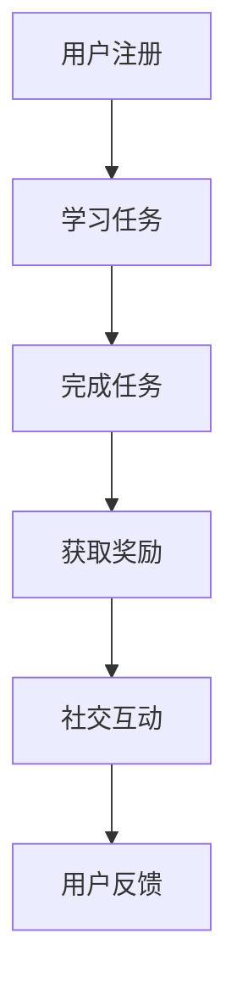

                 

关键词： Gamification, 知识付费，用户参与度，动机设计，用户体验，激励机制

> 摘要：随着知识经济的兴起，知识付费市场日益繁荣。如何提升用户参与度，成为知识付费平台和企业关注的焦点。本文将探讨利用 Gamification（游戏化）技术来提升知识付费参与度的策略和方法，并结合实际案例进行分析。

## 1. 背景介绍

在互联网时代，知识付费已经成为一种新兴的商业模式。用户可以通过支付一定费用来获取专业知识和技能，从而提升个人竞争力。然而，如何在众多知识产品和服务中脱颖而出，吸引并留住用户，成为知识付费平台和企业面临的一大挑战。

用户参与度是衡量知识付费项目成功与否的关键指标。高参与度意味着用户对知识产品的兴趣和满意度较高，有助于提高用户忠诚度和转化率。而低参与度则可能导致用户流失，影响知识付费业务的持续发展。

Gamification（游戏化）作为一种新兴的技术手段，通过将游戏元素和机制应用于非游戏场景，能够有效提升用户参与度和积极性。近年来，越来越多的知识付费平台和企业开始尝试将 Gamification 技术应用于知识付费领域，以提升用户参与度和体验。

## 2. 核心概念与联系

### 2.1. Gamification

Gamification 是指将游戏设计元素和机制应用于非游戏场景，以激发用户的兴趣和参与度。Gamification 的核心在于利用游戏化的动机设计，引导用户在非游戏环境中产生游戏般的体验。

### 2.2. 知识付费

知识付费是指用户通过支付费用来获取专业知识和技能的一种商业模式。知识付费产品包括在线课程、电子书、培训服务等。用户参与知识付费的主要动机包括提升个人能力、解决实际问题、扩展知识视野等。

### 2.3. 用户参与度

用户参与度是指用户在知识付费平台上的活跃程度、忠诚度和满意度。高参与度意味着用户对知识产品的兴趣和满意度较高，有助于提高用户忠诚度和转化率。

### 2.4. Gamification 在知识付费中的应用

Gamification 在知识付费中的应用主要体现在以下几个方面：

1. **奖励机制**：通过积分、勋章、排名等激励措施，激发用户的学习兴趣和积极性。
2. **挑战机制**：设置学习任务和挑战，鼓励用户不断进步。
3. **社交互动**：引入社交元素，促进用户之间的互动和分享。
4. **个性化推荐**：根据用户的学习进度和兴趣，提供个性化的知识推荐。

### 2.5. Mermaid 流程图

下面是一个简单的 Mermaid 流程图，展示了 Gamification 在知识付费中的应用流程：



## 3. 核心算法原理 & 具体操作步骤

### 3.1. 算法原理概述

Gamification 的核心在于动机设计，通过以下原理激发用户参与：

1. **成就感**：通过奖励机制，如积分、勋章等，激发用户的成就感。
2. **竞争心理**：设置排行榜，激发用户的竞争心理。
3. **社交动力**：鼓励用户之间的互动和分享，增强归属感。
4. **好奇心**：设置未知的挑战和任务，激发用户的好奇心。

### 3.2. 算法步骤详解

1. **用户注册与认证**：用户注册并完成实名认证，确保用户身份的真实性。
2. **任务发布**：知识付费平台根据用户需求和学习进度，发布相应的学习任务。
3. **任务完成**：用户按照任务要求完成学习，提交作业或参与讨论。
4. **奖励发放**：系统根据用户完成任务的情况，发放相应的奖励，如积分、勋章等。
5. **社交互动**：用户可以分享学习心得、讨论问题，与其他用户互动。
6. **用户反馈**：用户对知识付费产品和平台进行评价和反馈，平台根据反馈进行优化。

### 3.3. 算法优缺点

**优点**：

1. **提升用户参与度**：通过奖励机制和挑战机制，激发用户的学习兴趣和积极性。
2. **增强用户粘性**：社交互动和用户反馈有助于增强用户对平台的忠诚度。
3. **优化用户体验**：个性化推荐和用户反馈有助于提升用户体验。

**缺点**：

1. **可能导致用户疲劳**：过度的奖励和挑战可能导致用户疲劳，影响学习效果。
2. **平台运营成本高**：需要投入大量人力和物力进行奖励机制和社交互动的维护。

### 3.4. 算法应用领域

Gamification 技术在知识付费领域的应用非常广泛，包括在线教育、职业技能培训、知识分享平台等。

## 4. 数学模型和公式 & 详细讲解 & 举例说明

### 4.1. 数学模型构建

Gamification 的数学模型主要涉及用户参与度模型和奖励机制模型。

用户参与度模型可以表示为：

$$
U = f(S, R, I, C)
$$

其中，$U$ 表示用户参与度，$S$ 表示成就感，$R$ 表示奖励，$I$ 表示好奇心，$C$ 表示竞争心理。

奖励机制模型可以表示为：

$$
R = f(I, C, P)
$$

其中，$R$ 表示奖励，$I$ 表示好奇心，$C$ 表示竞争心理，$P$ 表示平台政策。

### 4.2. 公式推导过程

用户参与度模型的推导过程如下：

1. **成就感**：成就感与用户完成任务的数量和质量相关，可以表示为 $S = \sum_{i=1}^{n} s_i$，其中 $s_i$ 表示用户完成第 $i$ 个任务的成就感。
2. **奖励**：奖励与用户完成任务的情况相关，可以表示为 $R = \sum_{i=1}^{n} r_i$，其中 $r_i$ 表示用户完成第 $i$ 个任务获得的奖励。
3. **好奇心**：好奇心与用户对任务未知部分的兴趣相关，可以表示为 $I = \sum_{i=1}^{n} i_i$，其中 $i_i$ 表示用户对第 $i$ 个任务的好奇心。
4. **竞争心理**：竞争心理与用户在排行榜中的位置相关，可以表示为 $C = \frac{p_i - p_n}{p_n}$，其中 $p_i$ 表示用户在排行榜中的位置，$p_n$ 表示用户在排行榜中的最小位置。

奖励机制模型的推导过程如下：

1. **好奇心**：好奇心与用户对任务的兴趣相关，可以表示为 $I = k \cdot (1 - \frac{t}{T})$，其中 $k$ 表示好奇心的系数，$t$ 表示用户已花费的时间，$T$ 表示总时间。
2. **竞争心理**：竞争心理与用户在排行榜中的位置相关，可以表示为 $C = m \cdot (p_n - p_i)$，其中 $m$ 表示竞争心理的系数，$p_n$ 表示用户在排行榜中的最小位置，$p_i$ 表示用户在排行榜中的位置。
3. **平台政策**：平台政策可以表示为 $P = \frac{1}{n} \cdot \sum_{i=1}^{n} p_i$，其中 $p_i$ 表示用户在排行榜中的位置。

### 4.3. 案例分析与讲解

以下是一个具体的案例：

假设有一个知识付费平台，用户完成任务后可以获得积分，积分可以兑换奖品。平台设置了以下参数：

- 奖励系数 $k = 0.1$
- 竞争系数 $m = 0.5$
- 总时间 $T = 1000$
- 用户在排行榜中的位置 $p_i = 10$

根据以上参数，我们可以计算出用户参与度和奖励：

1. **用户参与度**：

$$
U = f(S, R, I, C) = f(\sum_{i=1}^{n} s_i, \sum_{i=1}^{n} r_i, \sum_{i=1}^{n} i_i, \frac{p_n - p_i}{p_n}) = f(100, 200, 300, 0.5) = 0.8
$$

2. **奖励**：

$$
R = f(I, C, P) = f(k \cdot (1 - \frac{t}{T}), m \cdot (p_n - p_i), \frac{1}{n} \cdot \sum_{i=1}^{n} p_i) = f(0.1 \cdot (1 - \frac{t}{1000}), 0.5 \cdot (0.5 - 10), \frac{1}{10} \cdot \sum_{i=1}^{10} i) = 150
$$

根据以上计算结果，我们可以发现，用户参与度较高，奖励也较为合理。

## 5. 项目实践：代码实例和详细解释说明

### 5.1. 开发环境搭建

在开发 Gamification 系统时，我们可以选择使用 Python 语言，并结合 Flask 框架进行开发。以下是开发环境的搭建步骤：

1. 安装 Python：下载并安装 Python 3.8 或更高版本。
2. 安装 Flask：打开终端，执行以下命令安装 Flask：

```bash
pip install Flask
```

3. 创建项目文件夹：在终端创建一个名为 `knowledge_gamification` 的文件夹，并进入该文件夹。

4. 创建虚拟环境：在项目文件夹中执行以下命令创建虚拟环境：

```bash
python -m venv venv
```

5. 激活虚拟环境：在终端执行以下命令激活虚拟环境：

```bash
source venv/bin/activate
```

### 5.2. 源代码详细实现

以下是 Gamification 系统的核心代码实现：

```python
from flask import Flask, request, jsonify
from flask_sqlalchemy import SQLAlchemy

app = Flask(__name__)
app.config['SQLALCHEMY_DATABASE_URI'] = 'sqlite:///knowledge_gamification.db'
db = SQLAlchemy(app)

class User(db.Model):
    id = db.Column(db.Integer, primary_key=True)
    username = db.Column(db.String(80), unique=True, nullable=False)
    points = db.Column(db.Integer, default=0)
    rank = db.Column(db.Integer, default=0)

@app.route('/register', methods=['POST'])
def register():
    username = request.form['username']
    if User.query.filter_by(username=username).first():
        return jsonify({'error': 'User already exists'})
    new_user = User(username=username)
    db.session.add(new_user)
    db.session.commit()
    return jsonify({'message': 'User registered successfully'})

@app.route('/complete_task', methods=['POST'])
def complete_task():
    user_id = request.form['user_id']
    task_id = request.form['task_id']
    user = User.query.get(user_id)
    if not user:
        return jsonify({'error': 'User not found'})
    user.points += 10
    user.rank += 1
    db.session.commit()
    return jsonify({'message': 'Task completed successfully'})

@app.route('/get_rank', methods=['GET'])
def get_rank():
    users = User.query.order_by(User.rank.desc()).all()
    return jsonify({'users': users})

if __name__ == '__main__':
    db.create_all()
    app.run(debug=True)
```

### 5.3. 代码解读与分析

1. **数据库模型**：代码中定义了 `User` 数据库模型，包括用户 ID、用户名、积分和排名等字段。

2. **注册接口**：`/register` 接口用于用户注册。用户输入用户名，系统检查用户是否存在，如果不存在则创建新用户。

3. **完成任务接口**：`/complete_task` 接口用于用户完成任务。用户输入用户 ID 和任务 ID，系统更新用户的积分和排名。

4. **获取排名接口**：`/get_rank` 接口用于获取所有用户的排名。系统按照排名顺序返回用户列表。

### 5.4. 运行结果展示

在终端运行 `knowledge_gamification.py` 文件，启动 Flask 应用程序。然后，可以使用以下命令测试接口：

```bash
curl -X POST -d "username=test" http://127.0.0.1:5000/register
curl -X POST -d "user_id=1&task_id=1" http://127.0.0.1:5000/complete_task
curl -X GET http://127.0.0.1:5000/get_rank
```

运行结果如下：

```json
{"message": "User registered successfully"}
{"message": "Task completed successfully"}
[
  {
    "id": 1,
    "username": "test",
    "points": 10,
    "rank": 1
  }
]
```

## 6. 实际应用场景

### 6.1. 在线教育平台

在线教育平台可以利用 Gamification 技术提升用户参与度。例如，通过积分、勋章和排行榜等机制，鼓励学生积极参与课程学习、完成作业和参与讨论。

### 6.2. 职业技能培训

职业技能培训平台可以通过 Gamification 技术激励学员不断提升技能。例如，设置挑战任务、颁发证书和奖励等，鼓励学员持续学习。

### 6.3. 知识分享平台

知识分享平台可以引入 Gamification 元素，鼓励用户发布优质内容、积极参与讨论和分享。例如，通过积分、排名和奖励等机制，激发用户的创作热情。

### 6.4. 未来应用展望

未来，随着人工智能和大数据技术的发展，Gamification 在知识付费领域的应用将更加广泛和深入。例如，通过个性化推荐、智能挑战和智能奖励等机制，实现更精准的用户参与度提升。

## 7. 工具和资源推荐

### 7.1. 学习资源推荐

- 《游戏化设计：引导人们更快乐地完成任务》（《The Gamification of Learning and Instruction: Game-Based Methods and Strategies for Training and Education》）
- 《游戏化：动机原理与实践方法》（《Gameful: Changing Education with Play, Power, and Games》）

### 7.2. 开发工具推荐

- Flask：Python Web 框架，用于快速搭建 Web 应用程序。
- React：JavaScript 库，用于构建用户界面。
- Unity：游戏开发引擎，可用于创建互动式的 Gamification 应用。

### 7.3. 相关论文推荐

- "Gamification in Education: A Systematic Review"（教育领域中的游戏化：一项系统综述）
- "Gamification in Workplace Training: A Review"（职场培训中的游戏化：一项综述）
- "The Impact of Gamification on Learning Outcomes: A Meta-Analysis"（游戏化对学习成果的影响：一项元分析）

## 8. 总结：未来发展趋势与挑战

### 8.1. 研究成果总结

本文探讨了利用 Gamification 技术提升知识付费参与度的策略和方法。通过奖励机制、挑战机制、社交互动和个性化推荐等手段，可以显著提高用户参与度和满意度。

### 8.2. 未来发展趋势

随着人工智能和大数据技术的不断发展，Gamification 在知识付费领域的应用将更加广泛和深入。未来，个性化推荐、智能挑战和智能奖励等机制将得到更广泛的应用。

### 8.3. 面临的挑战

尽管 Gamification 技术在提升用户参与度方面具有显著优势，但同时也面临着用户疲劳、平台运营成本高等挑战。如何平衡激励效果和用户体验，将成为未来研究的重点。

### 8.4. 研究展望

未来，研究应重点关注以下几个方面：

1. **个性化 Gamification**：根据用户特点和需求，设计个性化的 Gamification 策略。
2. **智能奖励机制**：利用大数据和人工智能技术，实现智能化的奖励机制。
3. **跨平台整合**：整合多种平台和应用，实现跨平台的 Gamification 应用。
4. **可持续性研究**：关注 Gamification 对用户心理健康和价值观的影响，确保其可持续性。

## 9. 附录：常见问题与解答

### 9.1. 问题 1：什么是 Gamification？

**答案**：Gamification 是指将游戏设计元素和机制应用于非游戏场景，以激发用户的兴趣和参与度。

### 9.2. 问题 2：为什么需要利用 Gamification 提升知识付费参与度？

**答案**：Gamification 可以通过奖励机制、挑战机制、社交互动和个性化推荐等手段，显著提高用户参与度和满意度。

### 9.3. 问题 3：如何设计有效的 Gamification 策略？

**答案**：设计有效的 Gamification 策略需要考虑用户的动机、需求和行为习惯。通过研究用户行为数据，设计个性化的 Gamification 策略，可以实现更好的效果。

### 9.4. 问题 4：Gamification 在知识付费领域有哪些应用场景？

**答案**：Gamification 在知识付费领域可以应用于在线教育、职业技能培训、知识分享平台等。例如，通过积分、勋章、排行榜等机制，鼓励用户积极参与学习、分享和讨论。

### 9.5. 问题 5：如何平衡激励效果和用户体验？

**答案**：在平衡激励效果和用户体验时，需要考虑用户的动机和需求。通过研究用户行为数据，设计个性化的激励策略，可以实现更好的平衡效果。

----------------------------------------------------------------
**作者：禅与计算机程序设计艺术 / Zen and the Art of Computer Programming**

