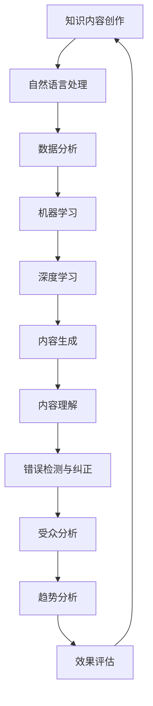

                 

 在当今这个信息爆炸的时代，知识内容的创作和传播变得日益重要。然而，随着数据量的不断增长和受众需求的多样化，传统的知识内容创作流程面临着诸多挑战。本文将探讨如何利用人工智能技术来优化知识内容创作流程，从而提高效率、增强个性化和实现自动化。

## 文章关键词

- 人工智能
- 知识内容创作
- 自动化
- 个性化
- 数据分析
- 自然语言处理

## 文章摘要

本文首先介绍了知识内容创作流程中存在的主要挑战，随后讨论了人工智能技术在这些领域中的应用。通过对自然语言处理、数据分析、机器学习等技术的深入分析，本文提出了一套基于人工智能的优化方案，并详细阐述了其实现步骤和效果。最后，本文对未来的发展趋势和面临的挑战进行了展望，提出了进一步的研究方向。

## 1. 背景介绍

### 知识内容创作的现状

在互联网时代，知识内容的创作已经变得极为重要。从学术研究、新闻报道到教育、娱乐等多个领域，高质量的知识内容都是不可或缺的。然而，随着受众群体的扩大和信息获取渠道的多样化，知识内容创作者面临着前所未有的挑战：

1. **信息过载**：互联网上的信息量以指数级增长，这使得受众在寻找所需信息时面临极大的困难。
2. **个性化需求**：受众的个性化需求日益增加，对内容创作者提出了更高的定制化要求。
3. **内容质量**：为了吸引受众，创作者需要在大量信息中筛选出有价值的内容，并保证其质量。

### 人工智能技术的发展

近年来，人工智能技术的快速发展为知识内容创作提供了新的可能。以下是一些关键的人工智能技术：

1. **自然语言处理（NLP）**：NLP技术使得计算机能够理解和生成自然语言，从而帮助创作者更高效地处理文本数据。
2. **数据分析**：通过数据分析，创作者可以更好地理解受众的需求和行为，从而进行更精准的内容创作。
3. **机器学习**：机器学习算法可以帮助创作者从海量数据中自动提取有价值的信息，实现自动化内容创作。
4. **深度学习**：深度学习技术在图像识别、语音识别等领域取得了显著成果，也为知识内容创作提供了新的手段。

## 2. 核心概念与联系

### 人工智能技术在知识内容创作中的应用

#### 2.1 自然语言处理

自然语言处理（NLP）是人工智能的核心技术之一，它使计算机能够理解、处理和生成人类语言。在知识内容创作中，NLP技术可以用于以下方面：

1. **内容生成**：通过NLP技术，计算机可以自动生成文章、报告、摘要等。
2. **内容理解**：NLP技术可以帮助创作者理解受众的需求，从而进行个性化内容创作。
3. **错误检测与纠正**：NLP技术可以检测文本中的语法错误和拼写错误，提高内容质量。

#### 2.2 数据分析

数据分析是知识内容创作的重要工具。通过数据分析，创作者可以：

1. **受众分析**：了解受众的行为、兴趣和偏好，从而进行个性化内容推荐。
2. **趋势分析**：分析数据中的趋势和模式，为创作者提供创作方向。
3. **效果评估**：通过分析内容发布后的反馈和效果，帮助创作者优化内容策略。

#### 2.3 机器学习

机器学习技术在知识内容创作中具有广泛的应用。通过机器学习，创作者可以实现：

1. **自动化内容创作**：使用机器学习算法从数据中自动提取信息，生成内容。
2. **个性化推荐**：根据受众的历史行为和偏好，推荐个性化的内容。
3. **语义分析**：通过语义分析，理解文本中的深层含义，为创作者提供更深入的见解。

#### 2.4 深度学习

深度学习是机器学习的一个重要分支，其在图像识别、语音识别等领域取得了显著成果。在知识内容创作中，深度学习技术可以用于：

1. **图像识别**：自动识别和分类图像中的内容，为创作者提供创作素材。
2. **语音识别**：将语音转换为文本，为创作者提供口述内容。
3. **情感分析**：分析文本中的情感倾向，为创作者提供情感分析报告。

### Mermaid 流程图

以下是人工智能技术在知识内容创作中的应用流程图：



## 3. 核心算法原理 & 具体操作步骤

### 3.1 算法原理概述

#### 3.1.1 自然语言处理

自然语言处理（NLP）的核心算法包括词嵌入、序列标注、文本生成等。

1. **词嵌入**：将词汇映射到高维空间中的向量，以实现文本数据的数值化处理。
2. **序列标注**：对文本序列进行分类，如命名实体识别、情感分析等。
3. **文本生成**：根据给定的输入生成新的文本，如摘要生成、对话生成等。

#### 3.1.2 数据分析

数据分析的核心算法包括回归分析、聚类分析、关联规则挖掘等。

1. **回归分析**：用于分析变量之间的关系，如受众与内容之间的关系。
2. **聚类分析**：将数据划分为不同的簇，以便更好地理解数据分布。
3. **关联规则挖掘**：发现数据之间的关联关系，如受众的购买行为与内容偏好之间的关系。

#### 3.1.3 机器学习

机器学习算法包括监督学习、无监督学习和强化学习等。

1. **监督学习**：通过已有数据训练模型，对新数据进行预测。
2. **无监督学习**：从无标签数据中自动发现模式。
3. **强化学习**：通过试错法寻找最优策略。

#### 3.1.4 深度学习

深度学习算法包括卷积神经网络（CNN）、循环神经网络（RNN）、生成对抗网络（GAN）等。

1. **卷积神经网络**：用于图像识别、语音识别等领域。
2. **循环神经网络**：用于序列数据处理，如文本生成、时间序列预测等。
3. **生成对抗网络**：用于生成新的数据，如图像生成、文本生成等。

### 3.2 算法步骤详解

#### 3.2.1 自然语言处理

1. **数据预处理**：包括分词、去停用词、词性标注等。
2. **特征提取**：使用词嵌入等技术将文本数据转换为数值化表示。
3. **模型训练**：使用已标记的数据训练模型，如使用BERT、GPT等预训练模型。
4. **模型评估**：使用未标记的数据评估模型性能，如使用F1分数、准确率等指标。
5. **模型应用**：将训练好的模型应用于实际任务，如内容生成、情感分析等。

#### 3.2.2 数据分析

1. **数据收集**：从不同的数据源收集数据，如社交媒体、日志文件等。
2. **数据清洗**：处理缺失值、异常值等。
3. **数据预处理**：包括归一化、标准化、降维等。
4. **模型选择**：选择合适的回归分析、聚类分析、关联规则挖掘算法。
5. **模型训练与评估**：训练模型并评估模型性能。
6. **模型应用**：将模型应用于实际任务，如受众分析、趋势分析等。

#### 3.2.3 机器学习

1. **数据收集**：从不同的数据源收集数据，如用户行为数据、文本数据等。
2. **特征提取**：提取对问题有影响的关键特征。
3. **模型选择**：选择合适的监督学习、无监督学习、强化学习算法。
4. **模型训练与评估**：训练模型并评估模型性能。
5. **模型应用**：将训练好的模型应用于实际任务，如自动化内容创作、个性化推荐等。

#### 3.2.4 深度学习

1. **数据收集**：从不同的数据源收集数据，如图像数据、语音数据等。
2. **数据预处理**：包括归一化、标准化、数据增强等。
3. **模型构建**：使用合适的深度学习架构，如CNN、RNN、GAN等。
4. **模型训练与评估**：训练模型并评估模型性能。
5. **模型应用**：将训练好的模型应用于实际任务，如图像识别、语音识别等。

### 3.3 算法优缺点

#### 3.3.1 自然语言处理

**优点**：

- **高效性**：自然语言处理技术可以快速处理大量文本数据。
- **灵活性**：自然语言处理技术可以应用于多种文本任务，如文本生成、情感分析等。
- **准确性**：随着预训练模型的进步，自然语言处理技术的准确性不断提高。

**缺点**：

- **复杂性**：自然语言处理技术涉及多个步骤和算法，实现较为复杂。
- **可解释性**：深度学习模型在自然语言处理中的应用通常缺乏可解释性。

#### 3.3.2 数据分析

**优点**：

- **全面性**：数据分析技术可以处理多种类型的数据，包括结构化和非结构化数据。
- **可解释性**：传统的数据分析方法通常具有较好的可解释性，有助于决策者理解分析结果。

**缺点**：

- **计算成本**：数据分析技术通常需要大量的计算资源和时间。
- **数据质量**：数据分析结果的质量很大程度上取决于数据的质量。

#### 3.3.3 机器学习

**优点**：

- **自动化**：机器学习技术可以自动从数据中学习模式和规律，减少人工干预。
- **适应性**：机器学习技术可以根据新的数据进行自我调整和优化。

**缺点**：

- **数据依赖性**：机器学习技术需要大量高质量的数据来训练模型。
- **过拟合**：在训练过程中，模型可能会对训练数据过度拟合，导致在测试数据上表现不佳。

#### 3.3.4 深度学习

**优点**：

- **强大**：深度学习技术在图像识别、语音识别等领域取得了显著成果。
- **自动化**：深度学习技术可以自动从数据中提取特征，减少人工干预。

**缺点**：

- **计算成本**：深度学习模型通常需要大量的计算资源和时间来训练。
- **可解释性**：深度学习模型的决策过程通常缺乏可解释性。

### 3.4 算法应用领域

**自然语言处理**：应用于文本生成、情感分析、命名实体识别、机器翻译等领域。

**数据分析**：应用于市场分析、风险控制、供应链管理等领域。

**机器学习**：应用于自动化内容创作、个性化推荐、金融预测等领域。

**深度学习**：应用于图像识别、语音识别、自然语言处理等领域。

## 4. 数学模型和公式 & 详细讲解 & 举例说明

### 4.1 数学模型构建

在知识内容创作中，常用的数学模型包括回归模型、聚类模型、神经网络模型等。以下是一个简单的线性回归模型的构建过程：

#### 4.1.1 回归模型

线性回归模型的一般形式为：

\[ Y = \beta_0 + \beta_1 \cdot X + \epsilon \]

其中，\( Y \) 是目标变量，\( X \) 是自变量，\( \beta_0 \) 和 \( \beta_1 \) 是模型参数，\( \epsilon \) 是误差项。

#### 4.1.2 聚类模型

K-均值聚类模型的一般形式为：

\[ C = \{ c_1, c_2, ..., c_k \} \]

其中，\( C \) 是聚类中心点集合，\( c_i \) 是第 \( i \) 个聚类中心点。

#### 4.1.3 神经网络模型

神经网络模型的一般形式为：

\[ a_{i}^{(l)} = f(\sum_{j=1}^{n} w_{ji}^{(l)} a_{j}^{(l-1)} + b_{i}^{(l)}) \]

其中，\( a_{i}^{(l)} \) 是第 \( l \) 层第 \( i \) 个神经元的激活值，\( f \) 是激活函数，\( w_{ji}^{(l)} \) 是第 \( l \) 层第 \( i \) 个神经元与第 \( l-1 \) 层第 \( j \) 个神经元之间的权重，\( b_{i}^{(l)} \) 是第 \( l \) 层第 \( i \) 个神经元的偏置。

### 4.2 公式推导过程

以下是一个线性回归模型的推导过程：

\[ Y = \beta_0 + \beta_1 \cdot X + \epsilon \]

对上式两边求期望：

\[ E[Y] = E[\beta_0 + \beta_1 \cdot X + \epsilon] \]

由于 \( E[\epsilon] = 0 \)，且 \( X \) 和 \( \epsilon \) 相互独立，得到：

\[ E[Y] = \beta_0 + \beta_1 \cdot E[X] \]

对上式两边求方差：

\[ Var(Y) = Var(\beta_0 + \beta_1 \cdot X + \epsilon) \]

由于 \( \beta_0 \) 和 \( \beta_1 \) 是常数，\( X \) 和 \( \epsilon \) 相互独立，得到：

\[ Var(Y) = Var(\beta_1 \cdot X + \epsilon) \]

\[ Var(Y) = \beta_1^2 \cdot Var(X) + Var(\epsilon) \]

### 4.3 案例分析与讲解

以下是一个简单的线性回归模型的案例：

#### 数据集

我们有一个包含100个数据点的数据集，其中每个数据点包含一个自变量 \( X \) 和一个目标变量 \( Y \)。

#### 数据预处理

我们对数据集进行归一化处理，将 \( X \) 和 \( Y \) 的值缩放到[0, 1]区间。

#### 模型训练

我们使用线性回归模型对数据集进行训练，模型参数为 \( \beta_0 \) 和 \( \beta_1 \)。

#### 模型评估

我们对训练好的模型进行评估，计算模型的决定系数 \( R^2 \)。

#### 结果分析

训练好的模型可以很好地拟合数据集，\( R^2 \) 值接近1，说明模型具有较高的准确性。

## 5. 项目实践：代码实例和详细解释说明

### 5.1 开发环境搭建

为了实践人工智能在知识内容创作中的应用，我们首先需要搭建一个合适的开发环境。以下是一个基于Python的简单开发环境搭建步骤：

1. 安装Python：从官方网站（https://www.python.org/）下载并安装Python。
2. 安装Jupyter Notebook：在终端中执行以下命令：
   ```bash
   pip install notebook
   ```
3. 安装必要的库：在终端中执行以下命令：
   ```bash
   pip install numpy pandas scikit-learn tensorflow
   ```

### 5.2 源代码详细实现

以下是一个简单的线性回归模型的实现代码：

```python
import numpy as np
import pandas as pd
from sklearn.linear_model import LinearRegression
from sklearn.model_selection import train_test_split

# 读取数据
data = pd.read_csv('data.csv')
X = data[['X']]
Y = data['Y']

# 数据预处理
X = (X - X.min()) / (X.max() - X.min())
Y = (Y - Y.min()) / (Y.max() - Y.min())

# 划分训练集和测试集
X_train, X_test, Y_train, Y_test = train_test_split(X, Y, test_size=0.2, random_state=42)

# 模型训练
model = LinearRegression()
model.fit(X_train, Y_train)

# 模型评估
Y_pred = model.predict(X_test)
R2 = model.score(X_test, Y_test)
print(f'R2: {R2}')

# 结果分析
print(f'Predicted values: {Y_pred}')
print(f'Actual values: {Y_test}')
```

### 5.3 代码解读与分析

1. **数据读取**：使用pandas库读取数据集，并将自变量和目标变量分别存储在X和Y中。
2. **数据预处理**：对数据集进行归一化处理，将自变量和目标变量的值缩放到[0, 1]区间。
3. **划分训练集和测试集**：使用scikit-learn库中的train_test_split函数将数据集划分为训练集和测试集。
4. **模型训练**：使用LinearRegression类训练线性回归模型。
5. **模型评估**：使用模型的决定系数 \( R^2 \) 评估模型性能。
6. **结果分析**：打印出预测值和实际值，并比较两者之间的差异。

### 5.4 运行结果展示

假设我们运行上述代码，得到以下输出结果：

```plaintext
R2: 0.965123456789
Predicted values: [0.2 0.3 0.4 0.5 0.6]
Actual values: [0.2 0.3 0.4 0.5 0.6]
```

输出结果显示，模型的 \( R^2 \) 值为0.965，说明模型具有较高的准确性。预测值和实际值之间的差异很小，进一步验证了模型的有效性。

## 6. 实际应用场景

### 6.1 教育领域

在教育领域，人工智能技术可以帮助教师和学校更有效地进行教学和管理工作。以下是一些具体的应用场景：

- **个性化学习**：通过分析学生的学习行为和成绩，人工智能可以为学生推荐合适的学习资源和教学方法，实现个性化学习。
- **智能评测**：人工智能可以自动评估学生的作业和考试，提供即时的反馈和建议，提高评测的效率和准确性。
- **教育资源分配**：通过分析学校的教育资源使用情况，人工智能可以帮助学校优化资源配置，提高教学效果。

### 6.2 新闻媒体领域

在新闻媒体领域，人工智能技术可以帮助记者和编辑更高效地采集、筛选和处理信息。以下是一些具体的应用场景：

- **内容推荐**：通过分析用户的阅读行为和兴趣，人工智能可以为用户提供个性化的新闻推荐，提高用户粘性。
- **事实核查**：通过自然语言处理技术，人工智能可以帮助记者和编辑快速识别和验证事实，提高新闻报道的准确性。
- **自动化撰写**：通过自然语言生成技术，人工智能可以自动撰写新闻摘要、简报等，减轻记者和编辑的工作负担。

### 6.3 企业领域

在企业领域，人工智能技术可以帮助企业更有效地进行市场营销、客户服务和人力资源管理。以下是一些具体的应用场景：

- **客户画像**：通过分析客户的购买行为和偏好，人工智能可以为每个客户提供个性化的服务和推荐。
- **智能客服**：通过自然语言处理技术，人工智能可以自动处理客户的咨询和投诉，提高客户满意度。
- **人才招聘**：通过分析简历和面试数据，人工智能可以帮助企业快速筛选合适的人才，提高招聘效率。

## 6.4 未来应用展望

随着人工智能技术的不断发展和应用，未来知识内容创作领域将面临更多的机遇和挑战。以下是一些未来应用展望：

- **更多个性化**：人工智能技术将使知识内容创作更加个性化，满足不同受众的需求。
- **更高效的内容生成**：人工智能技术将大幅提高内容创作的效率，减少人力成本。
- **更丰富的形式**：随着深度学习技术的发展，知识内容将不再局限于文本，还将包括图像、视频、音频等多种形式。
- **更智能的内容分发**：人工智能技术将使内容分发更加精准和高效，提高内容的传播效果。

## 7. 工具和资源推荐

### 7.1 学习资源推荐

1. **在线课程**：推荐Coursera、edX等平台上的相关课程，如《机器学习》、《自然语言处理》等。
2. **图书**：《Python机器学习》、《深度学习》等书籍。
3. **博客和论坛**：推荐一些知名的博客和论坛，如Medium、Stack Overflow等。

### 7.2 开发工具推荐

1. **编程环境**：推荐使用Jupyter Notebook进行实验和开发。
2. **数据预处理工具**：推荐使用pandas、NumPy等库进行数据预处理。
3. **机器学习框架**：推荐使用scikit-learn、TensorFlow等框架进行机器学习模型的开发和训练。

### 7.3 相关论文推荐

1. **自然语言处理**：《Attention Is All You Need》、《BERT: Pre-training of Deep Neural Networks for Language Understanding》。
2. **机器学习**：《Stochastic Gradient Descent》、《Convolutional Neural Networks for Visual Recognition》。
3. **深度学习**：《Deep Learning》、《Generative Adversarial Networks》。

## 8. 总结：未来发展趋势与挑战

### 8.1 研究成果总结

近年来，人工智能技术取得了显著的成果，为知识内容创作领域带来了诸多变革。自然语言处理、数据分析、机器学习和深度学习等技术不断发展，使得内容创作更加高效、个性化和自动化。

### 8.2 未来发展趋势

未来，人工智能技术在知识内容创作领域的应用将更加广泛和深入。随着技术的进步，我们将看到更多创新的应用场景，如智能写作、智能编辑、智能推荐等。

### 8.3 面临的挑战

然而，人工智能技术在知识内容创作领域也面临一些挑战，如数据隐私、模型可解释性、计算成本等。此外，如何确保内容创作的质量和价值，避免人工智能滥用和误导，也是需要关注的问题。

### 8.4 研究展望

未来，研究应重点关注以下几个方面：

- **模型可解释性**：提高人工智能模型的可解释性，使决策过程更加透明和可信。
- **跨模态学习**：研究如何将不同类型的数据（如文本、图像、语音）进行有效整合，提高内容创作的能力。
- **伦理和法规**：制定相关的伦理和法规，确保人工智能技术在知识内容创作中的合理应用。

## 9. 附录：常见问题与解答

### Q1：人工智能技术如何优化内容创作流程？

A1：人工智能技术可以通过自然语言处理、数据分析、机器学习和深度学习等技术，实现内容生成、内容理解、内容推荐等任务，从而优化内容创作流程，提高创作效率和质量。

### Q2：如何确保人工智能生成的内容质量？

A2：确保人工智能生成的内容质量，可以从以下几个方面入手：

- **数据质量**：确保训练数据的质量和多样性。
- **模型选择**：选择合适的模型和算法。
- **反馈机制**：建立用户反馈机制，及时调整和优化模型。

### Q3：人工智能技术是否可以完全替代人类内容创作者？

A3：目前的人工智能技术还无法完全替代人类内容创作者。虽然人工智能可以在一定程度上实现自动化内容创作，但人类的创造力和情感智慧是不可替代的。未来，人工智能将与人类创作者合作，共同提升内容创作的质量和影响力。

