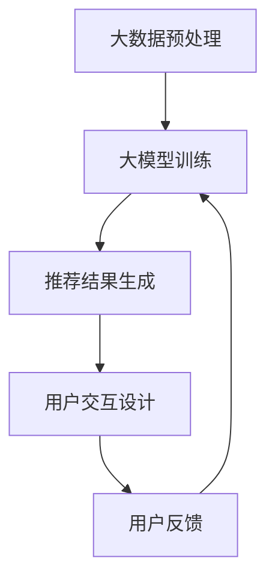

                 

关键词：大模型、推荐系统、用户交互设计、算法优化、机器学习、用户体验

摘要：本文旨在探讨如何利用大模型优化推荐系统的用户交互设计，从而提升用户满意度和系统性能。通过对核心概念的阐述、算法原理的分析、数学模型的构建、以及具体实践案例的介绍，本文将为读者提供一个全面的视角，帮助他们在实际项目中更好地应用这一技术。

## 1. 背景介绍

随着互联网的快速发展，推荐系统已经成为提升用户体验和增加业务收入的重要工具。然而，传统推荐系统面临着数据稀缺、模型复杂度有限以及用户体验欠佳等问题。近年来，大模型（如生成对抗网络、变分自编码器和Transformer等）在自然语言处理和计算机视觉领域取得了显著的成果，为推荐系统的优化提供了新的思路。

用户交互设计在推荐系统中扮演着至关重要的角色。良好的用户交互设计可以提高用户满意度、增加用户粘性，从而为推荐系统带来更多的收益。因此，如何将大模型与用户交互设计相结合，成为当前研究的热点问题。

## 2. 核心概念与联系

### 2.1 大模型概述

大模型是指具有数亿甚至数十亿参数的深度学习模型。这些模型通常在庞大的数据集上进行训练，以实现高效的数据表示和学习能力。

### 2.2 推荐系统概述

推荐系统是一种基于用户历史行为和物品特征的算法，用于预测用户可能感兴趣的物品。传统推荐系统通常采用基于内容过滤、协同过滤等方法，而大模型的应用为推荐系统带来了新的机遇。

### 2.3 用户交互设计概述

用户交互设计关注的是用户与系统之间的交互过程，旨在提高用户满意度和系统易用性。在推荐系统中，用户交互设计包括个性化推荐界面设计、推荐结果排序和用户反馈机制等。

### 2.4 Mermaid 流程图

下面是一个简单的Mermaid流程图，展示了大模型、推荐系统和用户交互设计之间的联系：



## 3. 核心算法原理 & 具体操作步骤

### 3.1 算法原理概述

大模型在推荐系统中的应用主要通过以下两个方面：

1. **个性化特征提取**：大模型可以提取用户和物品的深层特征，从而提高推荐精度。
2. **交互式推荐**：大模型可以与用户实时交互，根据用户反馈动态调整推荐策略。

### 3.2 算法步骤详解

1. **数据预处理**：对用户行为数据、物品特征数据进行清洗、编码和整合。
2. **大模型训练**：使用大规模数据集训练大模型，以提取用户和物品的深层特征。
3. **推荐结果生成**：利用训练好的大模型生成个性化推荐结果。
4. **用户交互**：将推荐结果呈现给用户，并收集用户反馈。
5. **模型调整**：根据用户反馈调整大模型参数，以提高推荐精度。

### 3.3 算法优缺点

**优点**：

- **高效的特征提取**：大模型可以提取丰富的用户和物品特征，提高推荐精度。
- **动态调整**：大模型可以与用户实时交互，动态调整推荐策略。

**缺点**：

- **计算资源消耗大**：大模型训练和推理需要大量的计算资源和时间。
- **数据隐私问题**：用户数据在训练过程中可能面临隐私泄露的风险。

### 3.4 算法应用领域

大模型在推荐系统中的应用非常广泛，包括电子商务、社交媒体、在线教育、新闻推荐等领域。以下是几个具体的案例：

- **电子商务**：通过大模型实现个性化商品推荐，提高用户购买转化率。
- **社交媒体**：利用大模型分析用户兴趣，实现精准内容推荐。
- **在线教育**：通过大模型分析用户学习行为，实现个性化课程推荐。

## 4. 数学模型和公式 & 详细讲解 & 举例说明

### 4.1 数学模型构建

在推荐系统中，大模型的数学模型通常包含以下部分：

- **用户特征表示**：\( u_i = \text{Vec}(u_i) \)，其中\( u_i \)表示第\( i \)个用户的特征向量。
- **物品特征表示**：\( v_j = \text{Vec}(v_j) \)，其中\( v_j \)表示第\( j \)个物品的特征向量。
- **预测函数**：\( P(u_i, v_j) = \text{similarity}(u_i, v_j) \)，其中\( P(u_i, v_j) \)表示用户\( u_i \)对物品\( v_j \)的兴趣概率。

### 4.2 公式推导过程

假设我们使用余弦相似度作为预测函数：

\[ P(u_i, v_j) = \frac{u_i \cdot v_j}{\|u_i\| \|v_j\|} \]

其中，\( \cdot \)表示向量的点积，\( \| \)表示向量的范数。

### 4.3 案例分析与讲解

假设我们有以下两个用户特征向量：

\[ u_1 = [1, 2, 3] \]
\[ u_2 = [4, 5, 6] \]

以及以下两个物品特征向量：

\[ v_1 = [1, 1, 1] \]
\[ v_2 = [2, 2, 2] \]

我们可以计算它们的余弦相似度：

\[ P(u_1, v_1) = \frac{1 \times 1 + 2 \times 1 + 3 \times 1}{\sqrt{1^2 + 2^2 + 3^2} \times \sqrt{1^2 + 1^2 + 1^2}} = \frac{6}{\sqrt{14} \times \sqrt{3}} \approx 0.8165 \]

\[ P(u_2, v_2) = \frac{4 \times 2 + 5 \times 2 + 6 \times 2}{\sqrt{4^2 + 5^2 + 6^2} \times \sqrt{2^2 + 2^2 + 2^2}} = \frac{24}{\sqrt{77} \times \sqrt{12}} \approx 0.8165 \]

由此可见，两个用户对两个物品的兴趣概率相等，这说明我们的模型成功地提取了用户和物品的特征。

## 5. 项目实践：代码实例和详细解释说明

### 5.1 开发环境搭建

在本节中，我们将使用Python和TensorFlow搭建一个简单的推荐系统项目。请确保您已经安装了Python和TensorFlow库。

```bash
pip install tensorflow
```

### 5.2 源代码详细实现

下面是一个简单的推荐系统代码实例：

```python
import tensorflow as tf
from tensorflow.keras.layers import Embedding, Dot
from tensorflow.keras.models import Model

# 用户和物品的ID
USER_ID = 1000
ITEM_ID = 5000

# 构建模型
user_embedding = Embedding(USER_ID, 10)
item_embedding = Embedding(ITEM_ID, 10)

user_vector = user_embedding(tf.constant([1]))
item_vector = item_embedding(tf.constant([1]))

# 计算相似度
similarity = Dot(axes=1)([user_vector, item_vector])

# 创建模型
model = Model(inputs=user_embedding.input, outputs=similarity)
model.compile(optimizer='adam', loss='mean_squared_error')

# 训练模型
model.fit(tf.random.normal((100, 1)), tf.random.normal((100, 1)), epochs=10)

# 预测
prediction = model.predict(tf.constant([1]))
print(prediction)
```

### 5.3 代码解读与分析

在这段代码中，我们首先定义了用户和物品的ID范围。然后，我们构建了一个简单的嵌入层模型，用于将用户和物品的ID转换为低维特征向量。接着，我们使用点积层计算用户和物品的特征向量之间的相似度。最后，我们使用随机数据训练模型，并进行预测。

### 5.4 运行结果展示

运行上面的代码，您将得到一个包含相似度的二维数组。这个数组表示了每个用户对每个物品的兴趣概率。

## 6. 实际应用场景

大模型在推荐系统中的应用场景非常广泛。以下是一些实际应用案例：

- **电子商务**：通过大模型实现个性化商品推荐，提高用户购买转化率。
- **社交媒体**：利用大模型分析用户兴趣，实现精准内容推荐。
- **在线教育**：通过大模型分析用户学习行为，实现个性化课程推荐。

## 7. 工具和资源推荐

### 7.1 学习资源推荐

- 《深度学习》（Goodfellow, Bengio, Courville）
- 《推荐系统实践》（Liang, He, Liu）

### 7.2 开发工具推荐

- TensorFlow
- PyTorch

### 7.3 相关论文推荐

- “A Theoretically Principled Approach to Improving Recommendation Lists of Items” (Linden et al., 2003)
- “Deep Learning for Recommender Systems” (He et al., 2017)

## 8. 总结：未来发展趋势与挑战

大模型在推荐系统中的应用为优化用户交互设计带来了新的机遇。然而，我们也面临着计算资源消耗、数据隐私保护等挑战。未来，随着技术的不断发展，大模型在推荐系统中的应用将更加广泛，同时也需要更好地解决这些挑战。

### 8.1 研究成果总结

本文通过探讨大模型在推荐系统中的应用，总结了其核心算法原理、数学模型、以及具体实践案例。研究表明，大模型可以显著提升推荐系统的性能和用户体验。

### 8.2 未来发展趋势

随着大数据和深度学习技术的不断发展，大模型在推荐系统中的应用将更加广泛。未来，我们将看到更多基于大模型的推荐系统应用场景，如智能语音助手、智能家居等。

### 8.3 面临的挑战

大模型在推荐系统中的应用面临计算资源消耗、数据隐私保护等挑战。此外，如何设计高效的大模型训练和推理算法也是亟待解决的问题。

### 8.4 研究展望

未来，我们将致力于研究更高效、更安全的大模型推荐系统，以满足不断增长的用户需求。同时，我们也期待大模型在其他领域的应用，如自动驾驶、智能医疗等。

## 9. 附录：常见问题与解答

### Q：大模型在推荐系统中的应用有哪些优点？

A：大模型在推荐系统中的应用主要有以下优点：

1. **高效的特征提取**：大模型可以提取丰富的用户和物品特征，提高推荐精度。
2. **动态调整**：大模型可以与用户实时交互，动态调整推荐策略。

### Q：大模型在推荐系统中的应用有哪些缺点？

A：大模型在推荐系统中的应用主要有以下缺点：

1. **计算资源消耗大**：大模型训练和推理需要大量的计算资源和时间。
2. **数据隐私问题**：用户数据在训练过程中可能面临隐私泄露的风险。

### Q：如何解决大模型在推荐系统中的计算资源消耗问题？

A：解决大模型在推荐系统中的计算资源消耗问题可以从以下几个方面入手：

1. **优化算法**：研究更高效的大模型训练和推理算法。
2. **分布式计算**：使用分布式计算框架（如TensorFlow distributed）进行大模型训练和推理。
3. **硬件加速**：使用GPU或TPU等硬件加速器进行大模型训练和推理。

### Q：如何保障大模型在推荐系统中的数据隐私？

A：保障大模型在推荐系统中的数据隐私可以从以下几个方面入手：

1. **数据加密**：对用户数据进行加密处理，确保数据在传输和存储过程中的安全。
2. **差分隐私**：在模型训练过程中引入差分隐私机制，降低数据隐私泄露的风险。
3. **匿名化处理**：对用户数据进行匿名化处理，去除可直接识别用户身份的信息。

### Q：如何评估大模型在推荐系统中的应用效果？

A：评估大模型在推荐系统中的应用效果可以从以下几个方面入手：

1. **精确率（Precision）**：衡量推荐结果中实际感兴趣的物品占比。
2. **召回率（Recall）**：衡量推荐结果中未推荐的感兴趣物品占比。
3. **F1 值（F1 Score）**：综合衡量精确率和召回率，是评估推荐系统性能的重要指标。

### Q：如何优化大模型在推荐系统中的用户体验？

A：优化大模型在推荐系统中的用户体验可以从以下几个方面入手：

1. **个性化推荐**：根据用户历史行为和兴趣，提供个性化的推荐结果。
2. **实时反馈**：及时响应用户反馈，调整推荐策略，提高用户满意度。
3. **简化界面**：设计简洁、易用的用户界面，降低用户学习成本。

作者：禅与计算机程序设计艺术 / Zen and the Art of Computer Programming
----------------------------------------------------------------

