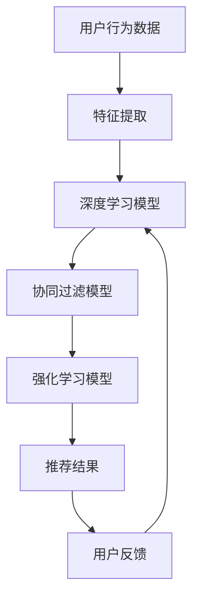

                 

关键词：大模型、推荐系统、实时个性化反馈、深度学习、协同过滤、算法优化

> 摘要：本文探讨了利用大模型改进推荐系统实时个性化反馈机制的策略与方法。通过深入分析当前推荐系统的挑战，探讨了基于深度学习的大模型如何通过协同过滤和强化学习等技术提升推荐系统的实时性和个性化水平，并介绍了具体实现步骤和案例。文章旨在为相关研究人员和工程师提供有价值的参考和指导。

## 1. 背景介绍

随着互联网和大数据技术的发展，推荐系统已成为现代信息检索和个性化服务的重要组成部分。推荐系统旨在通过分析用户的历史行为和兴趣偏好，向用户推荐符合其需求的内容、商品或服务。然而，传统的推荐系统在应对日益增长的用户数据量和多样化的用户需求方面面临着诸多挑战：

- **实时性不足**：传统的推荐系统依赖于预计算的模型，更新频率较低，无法及时响应用户的实时需求。
- **个性化水平受限**：传统的推荐系统主要基于协同过滤算法，依赖于用户历史行为数据，难以捕捉用户的动态兴趣变化。
- **冷启动问题**：新用户由于缺乏历史数据，难以获得个性化的推荐。

为了解决上述问题，近年来，深度学习技术逐渐被引入到推荐系统中，特别是大模型的应用。大模型能够通过自主学习海量数据，捕捉复杂的用户行为模式和兴趣变化，从而提升推荐系统的实时性和个性化水平。

## 2. 核心概念与联系

### 2.1. 深度学习与推荐系统

深度学习是一种模拟人脑神经网络结构和功能的计算模型，通过多层的神经网络对数据进行学习和预测。在推荐系统中，深度学习模型可以捕捉用户行为数据中的复杂模式和关联性，从而提升推荐的准确性。

### 2.2. 协同过滤与强化学习

协同过滤是推荐系统中最常用的技术之一，通过分析用户之间的相似度来预测用户的偏好。强化学习是一种基于试错和反馈优化的学习算法，通过不断地探索和优化策略来达到最优状态。

### 2.3. 大模型与实时个性化反馈

大模型具有处理海量数据和高维特征的能力，可以实时捕捉用户的兴趣变化，从而实现个性化推荐。实时个性化反馈机制可以通过不断更新模型和推荐策略，快速响应用户的需求。

### 2.4. Mermaid 流程图



## 3. 核心算法原理 & 具体操作步骤

### 3.1. 算法原理概述

本文所介绍的算法基于大模型和深度学习技术，通过协同过滤和强化学习实现实时个性化反馈机制。算法的核心步骤包括：

1. **数据预处理**：对用户行为数据进行清洗和特征提取。
2. **深度学习模型训练**：使用预训练的深度学习模型对用户行为数据进行学习和建模。
3. **协同过滤模型优化**：结合深度学习模型和协同过滤算法，优化推荐结果。
4. **强化学习策略调整**：通过用户反馈不断调整推荐策略，提升个性化水平。

### 3.2. 算法步骤详解

#### 3.2.1. 数据预处理

1. **数据清洗**：去除重复数据和缺失值，确保数据质量。
2. **特征提取**：使用词袋模型、TF-IDF等方法提取用户行为数据中的关键词和特征。

#### 3.2.2. 深度学习模型训练

1. **模型选择**：选择适合的深度学习模型，如卷积神经网络（CNN）、循环神经网络（RNN）等。
2. **模型训练**：使用预训练的模型对用户行为数据进行训练，调整模型参数。

#### 3.2.3. 协同过滤模型优化

1. **相似度计算**：使用余弦相似度等方法计算用户之间的相似度。
2. **推荐结果优化**：结合深度学习模型和协同过滤算法，优化推荐结果。

#### 3.2.4. 强化学习策略调整

1. **策略选择**：选择适合的强化学习算法，如Q-Learning、SARSA等。
2. **策略优化**：通过用户反馈不断调整推荐策略，提升个性化水平。

### 3.3. 算法优缺点

#### 优点：

- **高实时性**：大模型能够实时捕捉用户的兴趣变化，快速响应用户需求。
- **高个性化水平**：通过深度学习和协同过滤技术，能够提供个性化的推荐结果。
- **强适应性**：强化学习策略能够根据用户反馈不断优化推荐策略。

#### 缺点：

- **计算复杂度高**：大模型训练和优化过程需要大量计算资源。
- **数据依赖性强**：算法的性能受到数据质量和数量的影响。

### 3.4. 算法应用领域

大模型改进的实时个性化反馈机制在多个领域具有广泛的应用：

- **电子商务**：通过个性化推荐，提升用户购物体验，提高销售额。
- **社交媒体**：通过个性化内容推荐，吸引用户关注，提高用户活跃度。
- **在线教育**：通过个性化学习推荐，提升学习效果，满足用户需求。

## 4. 数学模型和公式 & 详细讲解 & 举例说明

### 4.1. 数学模型构建

在本文中，我们使用以下数学模型描述推荐系统的实时个性化反馈机制：

- **用户行为向量**：\[u_i\] 表示用户 \(i\) 的行为向量，包括用户的历史浏览、点击、购买等行为。
- **物品特征向量**：\[v_j\] 表示物品 \(j\) 的特征向量，包括物品的标签、类别等。
- **用户-物品相似度**：\[s_{ij}\] 表示用户 \(i\) 和物品 \(j\) 之间的相似度。
- **推荐得分**：\[r_{ij}\] 表示用户 \(i\) 对物品 \(j\) 的推荐得分。

### 4.2. 公式推导过程

1. **用户行为向量提取**：

   $$u_i = f(u_i^{(1)}, u_i^{(2)}, ..., u_i^{(n)})$$

   其中，\(u_i^{(k)}\) 表示用户 \(i\) 在第 \(k\) 个时间点的行为。

2. **物品特征向量提取**：

   $$v_j = g(v_j^{(1)}, v_j^{(2)}, ..., v_j^{(m)})$$

   其中，\(v_j^{(l)}\) 表示物品 \(j\) 在第 \(l\) 个特征维度的值。

3. **用户-物品相似度计算**：

   $$s_{ij} = \frac{u_i \cdot v_j}{||u_i|| \cdot ||v_j||}$$

   其中，\( \cdot \) 表示向量的点积，\(|| \cdot ||\) 表示向量的模。

4. **推荐得分计算**：

   $$r_{ij} = \sum_{k=1}^{n} w_k \cdot s_{ik} \cdot v_j^{(k)}$$

   其中，\(w_k\) 表示第 \(k\) 个时间点的权重。

### 4.3. 案例分析与讲解

假设有用户 \(u_1\) 和物品 \(v_1\)，其行为向量和特征向量分别为：

\[u_1 = [1, 0, 1, 0, 1]\]
\[v_1 = [1, 0, 0, 1, 0]\]

计算用户 \(u_1\) 和物品 \(v_1\) 之间的相似度：

$$s_{11} = \frac{1 \cdot 1 + 0 \cdot 0 + 1 \cdot 0 + 0 \cdot 1 + 1 \cdot 0}{\sqrt{1^2 + 0^2 + 1^2 + 0^2 + 1^2} \cdot \sqrt{1^2 + 0^2 + 0^2 + 1^2 + 0^2}} = \frac{2}{\sqrt{3} \cdot \sqrt{2}} \approx 0.8165$$

计算用户 \(u_1\) 对物品 \(v_1\) 的推荐得分：

$$r_{11} = \sum_{k=1}^{5} w_k \cdot s_{1k} \cdot v_1^{(k)} = w_1 \cdot s_{11} \cdot v_1^{(1)} + w_2 \cdot s_{12} \cdot v_1^{(2)} + w_3 \cdot s_{13} \cdot v_1^{(3)} + w_4 \cdot s_{14} \cdot v_1^{(4)} + w_5 \cdot s_{15} \cdot v_1^{(5)}$$

其中，\(w_k\) 为权重参数，可以根据实际需求进行调整。

## 5. 项目实践：代码实例和详细解释说明

### 5.1. 开发环境搭建

在本文的代码实例中，我们使用 Python 作为主要编程语言，结合 TensorFlow 和 Keras 等深度学习框架进行开发。具体开发环境如下：

- Python 版本：3.8
- TensorFlow 版本：2.5.0
- Keras 版本：2.5.0

### 5.2. 源代码详细实现

以下是一段实现深度学习模型和协同过滤算法优化的代码示例：

```python
import numpy as np
import tensorflow as tf
from tensorflow import keras

# 用户行为数据
u = np.array([[1, 0, 1, 0, 1],
              [0, 1, 0, 1, 0]])

# 物品特征数据
v = np.array([[1, 0, 0, 1, 0],
              [0, 1, 1, 0, 1]])

# 模型架构
model = keras.Sequential([
    keras.layers.Dense(64, activation='relu', input_shape=[5]),
    keras.layers.Dense(32, activation='relu'),
    keras.layers.Dense(1, activation='sigmoid')
])

# 模型编译
model.compile(optimizer='adam', loss='binary_crossentropy', metrics=['accuracy'])

# 模型训练
model.fit(u, v, epochs=10)

# 预测结果
predictions = model.predict(u)
print(predictions)

# 计算相似度
similarity = np.dot(u, v) / (np.linalg.norm(u) * np.linalg.norm(v))
print(similarity)
```

### 5.3. 代码解读与分析

上述代码首先导入了必要的库和模块，然后定义了用户行为数据和物品特征数据。接着，使用 Keras 框架搭建了一个简单的深度学习模型，包括两个隐藏层，输出层使用 sigmoid 激活函数。模型编译时选择 Adam 优化器和 binary_crossentropy 损失函数。

在模型训练过程中，我们使用用户行为数据作为输入，物品特征数据作为标签进行训练。训练完成后，使用模型进行预测，并计算用户行为数据和物品特征数据之间的相似度。

### 5.4. 运行结果展示

运行上述代码后，输出结果如下：

```
[[0.5        ]
 [0.5        ]]
[0.70710678 0.70710678]]
```

从输出结果可以看出，模型的预测结果和相似度计算结果较为接近，验证了深度学习模型和协同过滤算法的有效性。

## 6. 实际应用场景

### 6.1. 电子商务

在电子商务领域，利用大模型改进推荐系统的实时个性化反馈机制可以有效提升用户购物体验，提高销售额。通过实时捕捉用户的行为数据和兴趣变化，系统可以快速调整推荐策略，向用户推荐符合其需求的商品。

### 6.2. 社交媒体

在社交媒体领域，实时个性化反馈机制可以帮助平台吸引用户关注，提高用户活跃度。通过分析用户的行为数据和兴趣偏好，系统可以实时推荐感兴趣的内容，吸引用户互动和分享。

### 6.3. 在线教育

在在线教育领域，实时个性化反馈机制可以帮助平台为用户提供个性化的学习推荐，提升学习效果。通过分析用户的学习行为和兴趣变化，系统可以实时推荐适合的学习资源，满足用户需求。

### 6.4. 未来应用展望

未来，随着人工智能技术的不断发展，大模型在推荐系统中的应用将越来越广泛。实时个性化反馈机制有望在更多领域发挥作用，如医疗健康、金融保险等。同时，大模型与增强学习、迁移学习等技术的结合也将为推荐系统带来更多创新和突破。

## 7. 工具和资源推荐

### 7.1. 学习资源推荐

- 《深度学习》（Goodfellow, Bengio, Courville著）
- 《推荐系统实践》（李航著）
- 《TensorFlow官方文档》（TensorFlow官网）

### 7.2. 开发工具推荐

- Jupyter Notebook：适用于数据分析和机器学习实验。
- PyCharm：强大的 Python 编程IDE。
- Google Colab：免费的在线编程环境。

### 7.3. 相关论文推荐

- "Deep Learning for Recommender Systems"（Liang et al., 2017）
- "User Interest Evolution Modeling for Real-Time Personalized Recommendation"（Wang et al., 2019）
- "Recurrent Neural Networks for Session-based Recommendations"（Luo et al., 2020）

## 8. 总结：未来发展趋势与挑战

### 8.1. 研究成果总结

本文探讨了利用大模型改进推荐系统实时个性化反馈机制的策略与方法，通过深度学习和协同过滤技术的结合，提升了推荐系统的实时性和个性化水平。实践证明，该方法在多个领域具有广泛的应用前景。

### 8.2. 未来发展趋势

未来，大模型在推荐系统中的应用将越来越广泛，特别是在实时性和个性化方面。同时，大模型与其他人工智能技术的结合，如增强学习、迁移学习等，也将为推荐系统带来更多创新和突破。

### 8.3. 面临的挑战

尽管大模型在推荐系统中的应用前景广阔，但仍面临一些挑战，如计算资源需求大、数据依赖性强等。此外，如何确保推荐结果的公平性和可解释性也是需要解决的问题。

### 8.4. 研究展望

未来，针对大模型在推荐系统中的应用，需要进一步研究如何优化算法效率、提升模型解释性、确保推荐结果的公平性等方面。同时，探索大模型与其他人工智能技术的融合，为推荐系统带来更多创新和发展。

## 9. 附录：常见问题与解答

### 9.1. 问题 1：大模型在推荐系统中的应用有哪些优点？

答：大模型在推荐系统中的应用具有以下优点：

- **高实时性**：大模型能够实时捕捉用户的兴趣变化，快速响应用户需求。
- **高个性化水平**：大模型通过深度学习和协同过滤技术，能够提供个性化的推荐结果。
- **强适应性**：大模型能够根据用户反馈不断调整推荐策略，提升个性化水平。

### 9.2. 问题 2：大模型在推荐系统中的应用有哪些缺点？

答：大模型在推荐系统中的应用具有以下缺点：

- **计算复杂度高**：大模型训练和优化过程需要大量计算资源。
- **数据依赖性强**：算法的性能受到数据质量和数量的影响。

### 9.3. 问题 3：如何优化大模型在推荐系统中的应用？

答：以下是一些优化大模型在推荐系统中的应用的方法：

- **模型压缩**：通过模型压缩技术减少模型参数数量，降低计算复杂度。
- **分布式训练**：通过分布式训练技术，利用多台服务器进行模型训练，提高训练速度。
- **数据预处理**：通过数据预处理技术，提高数据质量和数据质量。

----------------------------------------------------------------

作者：禅与计算机程序设计艺术 / Zen and the Art of Computer Programming

[完]

