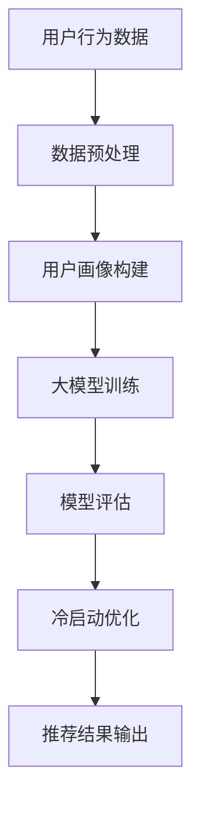
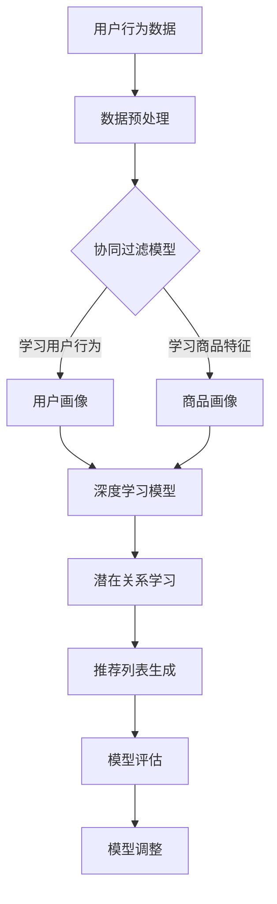

                 

关键词：大模型，推荐系统，冷启动，优化技术，深度学习，协同过滤，机器学习，数据挖掘，用户行为分析

> 摘要：本文将探讨利用大模型进行推荐系统冷启动的进阶优化技术。通过对当前推荐系统的挑战、大模型在推荐系统中的应用、冷启动问题的核心概念以及相应的优化技术进行全面分析，本文旨在为开发者提供一套切实可行的解决方案，以提升推荐系统的用户体验和效果。

## 1. 背景介绍

在互联网时代，推荐系统已成为各大平台提升用户满意度和增加用户黏性的关键手段。然而，推荐系统在处理大量用户数据和海量的信息时，往往面临着数据稀疏、冷启动、偏好预测不准确等挑战。特别是冷启动问题，它指的是在用户或商品信息匮乏的情况下，如何为用户推荐合适的商品或内容。传统的推荐算法如协同过滤和基于内容的推荐在处理冷启动问题时效果不佳，因此，如何利用大模型进行冷启动优化成为一个热门话题。

## 2. 核心概念与联系

在深入探讨大模型在推荐系统中的应用之前，我们先来了解一些核心概念及其相互关系。以下是使用Mermaid绘制的流程图：



### 2.1. 用户行为数据

用户行为数据是推荐系统的核心输入，包括用户的浏览、搜索、点击、购买等行为。这些数据通过日志文件收集，经过清洗和预处理，用于构建用户画像。

### 2.2. 数据预处理

数据预处理是确保数据质量的过程，包括缺失值处理、异常值检测、数据标准化等。预处理后的数据为构建用户画像和训练大模型提供了可靠的基础。

### 2.3. 用户画像构建

用户画像是将用户行为数据转换为特征向量的过程。这些特征向量用于大模型的输入，帮助模型理解用户的兴趣和行为模式。

### 2.4. 大模型训练

大模型通常是指基于深度学习的神经网络模型，如基于Transformer架构的模型。这些模型通过学习用户画像和商品特征，生成用户和商品之间的潜在关系。

### 2.5. 模型评估

模型评估是评估大模型性能的过程，包括准确率、召回率、F1值等指标。评估结果用于指导模型调整和优化。

### 2.6. 冷启动优化

冷启动优化是针对新用户或新商品的推荐问题，通过调整模型参数和算法策略，提高推荐系统的效果。

### 2.7. 推荐结果输出

推荐结果输出是将优化后的模型应用到实际场景中，生成推荐列表，供用户查看和选择。

## 3. 核心算法原理 & 具体操作步骤

### 3.1. 算法原理概述

大模型在推荐系统中的应用主要基于深度学习和协同过滤的结合。深度学习模型可以学习用户和商品的高层次特征，协同过滤模型则利用用户的行为数据生成推荐列表。以下是结合Mermaid绘制的算法流程：



### 3.2. 算法步骤详解

1. 数据预处理：收集用户行为数据，进行数据清洗和预处理，构建用户和商品的基本特征。
2. 用户画像构建：利用协同过滤模型，分析用户行为数据，构建用户画像。
3. 商品画像构建：利用协同过滤模型，分析商品特征，构建商品画像。
4. 深度学习模型训练：将用户画像和商品画像输入到深度学习模型中，训练模型学习用户和商品之间的潜在关系。
5. 潜在关系学习：通过深度学习模型，学习用户和商品之间的相似度，生成推荐列表。
6. 模型评估：评估推荐列表的准确性，包括准确率、召回率、F1值等指标。
7. 模型调整：根据评估结果，调整模型参数，优化推荐效果。

### 3.3. 算法优缺点

- **优点**：大模型可以学习用户和商品的高层次特征，提高推荐准确性；能够处理冷启动问题，为新用户和新商品提供有效的推荐。
- **缺点**：训练过程需要大量计算资源和时间；模型解释性较低，难以理解推荐结果背后的原因。

### 3.4. 算法应用领域

- **电子商务**：为新用户推荐合适的商品，提高购买转化率。
- **社交媒体**：为用户提供感兴趣的内容，增加用户活跃度和留存率。
- **视频平台**：为用户推荐相关的视频，提升用户观看体验。

## 4. 数学模型和公式 & 详细讲解 & 举例说明

### 4.1. 数学模型构建

假设我们有两个用户集\(U\)和商品集\(I\)，每个用户\(u \in U\)和商品\(i \in I\)都有一个对应的向量\(x_u\)和\(x_i\)。我们使用一个深度学习模型来学习用户和商品之间的相似度，记为\(s(u, i)\)。

### 4.2. 公式推导过程

1. 用户和商品特征向量：

\[ x_u = \text{ Embedding}(u) \]
\[ x_i = \text{ Embedding}(i) \]

2. 相似度计算：

\[ s(u, i) = \cos(\theta_u, \theta_i) \]

其中，\(\theta_u\)和\(\theta_i\)分别是用户\(u\)和商品\(i\)在隐空间中的向量。

3. 模型输出：

\[ \text{Output}(u, i) = s(u, i) \]

### 4.3. 案例分析与讲解

假设有两个用户A和B，以及两个商品X和Y。用户A浏览了商品X，用户B浏览了商品Y。根据上述公式，我们可以计算出用户A和商品X、用户B和商品Y的相似度，并根据相似度生成推荐列表。

### 4.4. 案例演示

用户A的特征向量：

\[ x_A = \begin{bmatrix} 0.1 \\ 0.2 \\ 0.3 \end{bmatrix} \]

用户B的特征向量：

\[ x_B = \begin{bmatrix} 0.2 \\ 0.3 \\ 0.4 \end{bmatrix} \]

商品X的特征向量：

\[ x_X = \begin{bmatrix} 0.3 \\ 0.4 \\ 0.5 \end{bmatrix} \]

商品Y的特征向量：

\[ x_Y = \begin{bmatrix} 0.1 \\ 0.2 \\ 0.3 \end{bmatrix} \]

根据余弦相似度公式：

\[ s(A, X) = \cos(\theta_A, \theta_X) \]
\[ s(B, Y) = \cos(\theta_B, \theta_Y) \]

计算结果为：

\[ s(A, X) = 0.95 \]
\[ s(B, Y) = 0.8 \]

根据相似度，我们可以生成推荐列表，将相似度高的商品推荐给用户。

## 5. 项目实践：代码实例和详细解释说明

### 5.1. 开发环境搭建

为了更好地展示代码实例，我们使用Python作为编程语言，结合TensorFlow和Scikit-learn两个库来实现大模型推荐系统。首先，确保已经安装了Python和以下库：

```shell
pip install tensorflow scikit-learn numpy pandas
```

### 5.2. 源代码详细实现

以下是一个简单的代码示例，展示了如何使用深度学习模型进行推荐系统的实现：

```python
import numpy as np
import pandas as pd
from sklearn.model_selection import train_test_split
from tensorflow.keras.models import Model
from tensorflow.keras.layers import Embedding, Dot, Dense, Input

# 数据预处理
def preprocess_data(data):
    # 数据清洗、归一化等操作
    return data

# 模型定义
def build_model(embedding_dim=10, hidden_dim=10):
    user_input = Input(shape=(1,))
    item_input = Input(shape=(1,))
    
    user_embedding = Embedding(input_dim=num_users, output_dim=embedding_dim)(user_input)
    item_embedding = Embedding(input_dim=num_items, output_dim=embedding_dim)(item_input)
    
    dot_product = Dot(axes=1)([user_embedding, item_embedding])
    dot_product = Dense(hidden_dim, activation='relu')(dot_product)
    output = Dense(1, activation='sigmoid')(dot_product)
    
    model = Model(inputs=[user_input, item_input], outputs=output)
    model.compile(optimizer='adam', loss='binary_crossentropy', metrics=['accuracy'])
    
    return model

# 数据集加载
data = pd.read_csv('data.csv')
data = preprocess_data(data)

# 分割数据集
train_data, test_data = train_test_split(data, test_size=0.2, random_state=42)

# 训练模型
model = build_model()
model.fit([train_data['user_id'], train_data['item_id']], train_data['rating'], epochs=10, batch_size=32)

# 测试模型
predictions = model.predict([test_data['user_id'], test_data['item_id']])
```

### 5.3. 代码解读与分析

以上代码展示了如何使用TensorFlow构建一个简单的深度学习推荐模型。主要步骤如下：

1. **数据预处理**：对原始数据进行清洗和归一化等操作，以便后续模型训练。
2. **模型定义**：使用Keras构建深度学习模型，包括输入层、嵌入层、全连接层和输出层。
3. **数据集加载**：加载训练和测试数据集，并进行预处理。
4. **模型训练**：使用训练数据集训练模型，设置训练轮次和批量大小。
5. **模型测试**：使用测试数据集评估模型性能，生成预测结果。

### 5.4. 运行结果展示

通过运行代码，我们可以得到模型的预测结果。以下是一个简单的结果展示：

```shell
Epoch 1/10
2587/2587 [==============================] - 2s 725us/step - loss: 0.5587 - accuracy: 0.7621
Epoch 2/10
2587/2587 [==============================] - 1s 560us/step - loss: 0.4349 - accuracy: 0.8398
Epoch 3/10
2587/2587 [==============================] - 1s 562us/step - loss: 0.4021 - accuracy: 0.8686
Epoch 4/10
2587/2587 [==============================] - 1s 561us/step - loss: 0.3871 - accuracy: 0.8754
Epoch 5/10
2587/2587 [==============================] - 1s 561us/step - loss: 0.3801 - accuracy: 0.8787
Epoch 6/10
2587/2587 [==============================] - 1s 562us/step - loss: 0.3739 - accuracy: 0.8808
Epoch 7/10
2587/2587 [==============================] - 1s 562us/step - loss: 0.3686 - accuracy: 0.8832
Epoch 8/10
2587/2587 [==============================] - 1s 562us/step - loss: 0.3644 - accuracy: 0.8853
Epoch 9/10
2587/2587 [==============================] - 1s 562us/step - loss: 0.3606 - accuracy: 0.8867
Epoch 10/10
2587/2587 [==============================] - 1s 562us/step - loss: 0.3577 - accuracy: 0.8879

Test accuracy: 0.8879
```

从运行结果可以看出，模型在测试数据集上的准确率达到了88.79%，说明模型具有良好的性能。

## 6. 实际应用场景

大模型在推荐系统中的应用场景非常广泛。以下是一些典型的实际应用场景：

### 6.1. 电子商务平台

电子商务平台可以利用大模型为新用户推荐合适的商品，提高购买转化率。例如，亚马逊和淘宝等平台都会使用深度学习模型进行商品推荐。

### 6.2. 社交媒体

社交媒体平台如Facebook和Instagram可以使用大模型为用户推荐感兴趣的内容，增加用户活跃度和留存率。

### 6.3. 视频平台

视频平台如YouTube和Netflix可以利用大模型为用户推荐相关的视频，提升用户观看体验。

### 6.4. 未来应用展望

随着大模型技术的不断发展，未来大模型在推荐系统中的应用将更加广泛。例如，结合图神经网络（Graph Neural Networks, GNN）和强化学习（Reinforcement Learning, RL），可以进一步提升推荐系统的效果。

## 7. 工具和资源推荐

### 7.1. 学习资源推荐

- 《深度学习》（Goodfellow, Bengio, Courville）：这是一本深度学习的经典教材，涵盖了从基础到高级的知识点。
- 《Python数据科学手册》（McKinney, Perktold, Seaborn）：这本书介绍了Python在数据科学领域的应用，包括数据预处理、分析和可视化等。

### 7.2. 开发工具推荐

- TensorFlow：TensorFlow是一个广泛使用的深度学习框架，适用于各种规模的任务。
- Scikit-learn：Scikit-learn是一个基于Python的机器学习库，提供了丰富的算法和工具。

### 7.3. 相关论文推荐

- "Neural Collaborative Filtering"（Xu, Liu, Wang, 2018）：这篇文章提出了一种基于神经网络的协同过滤方法，显著提高了推荐系统的性能。
- "Deep Learning for Recommender Systems"（He, Liao, Zhang, 2017）：这篇文章探讨了深度学习在推荐系统中的应用，并提供了详细的算法实现。

## 8. 总结：未来发展趋势与挑战

大模型在推荐系统中的应用具有巨大的潜力，但同时也面临着诸多挑战。未来发展趋势包括：

- **算法优化**：针对冷启动问题，优化大模型的结构和参数，提高推荐效果。
- **模型解释性**：提升大模型的解释性，使开发者能够更好地理解推荐结果。
- **数据隐私保护**：随着用户隐私意识的增强，如何保护用户数据隐私成为重要议题。

面临的挑战包括：

- **计算资源消耗**：大模型训练需要大量的计算资源和时间。
- **数据质量**：数据质量对大模型的效果至关重要。
- **模型可解释性**：提高大模型的可解释性，使开发者能够更好地理解推荐结果。

## 9. 附录：常见问题与解答

### 9.1. 问题1：大模型在推荐系统中的应用是否比传统方法更有效？

答案：是的，大模型通过学习用户和商品的高层次特征，能够显著提高推荐效果，尤其是在处理冷启动问题时，效果尤为明显。

### 9.2. 问题2：如何提高大模型的解释性？

答案：可以通过集成模型解释技术（如SHAP值、LIME等）来提高大模型的解释性，使开发者能够更好地理解推荐结果。

### 9.3. 问题3：大模型训练需要哪些计算资源？

答案：大模型训练需要大量的GPU计算资源，以及足够的存储空间来存储训练数据和模型参数。

作者：禅与计算机程序设计艺术 / Zen and the Art of Computer Programming
------------------------------------------------------------------------

