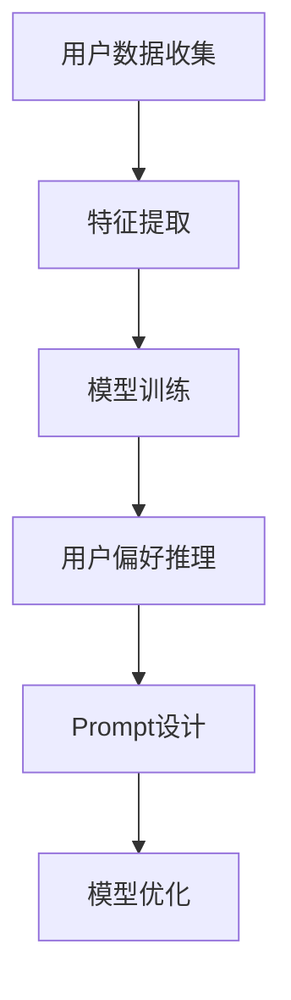

                 

关键词：用户偏好推理、大模型、Prompt设计、自然语言处理、机器学习、深度学习

> 摘要：本文将探讨如何利用大模型进行用户偏好推理的Prompt设计，分析其核心概念、算法原理、数学模型及其在实际应用中的实践。通过详细讲解，帮助读者了解这一技术的应用价值及未来发展趋势。

## 1. 背景介绍

在当今数字化时代，个人数据的积累和分析成为商业决策和用户体验提升的重要手段。用户偏好推理作为自然语言处理（NLP）和机器学习（ML）领域的一个重要研究方向，旨在通过分析用户的语言和行为数据，推断出其偏好和兴趣。传统的用户偏好推理方法依赖于规则、统计模型和手工特征工程，但往往难以捕捉到复杂的用户行为模式。

随着深度学习（DL）和大型预训练语言模型（如GPT、BERT）的发展，我们有了更强大的工具来处理和理解大规模文本数据。这些大模型通过学习海量的文本信息，能够捕捉到用户语言中的细微差异和隐含偏好。Prompt设计作为一种重要的技术手段，使得我们能够将用户的个性化信息有效地融合到这些大模型中，从而实现更精准的用户偏好推理。

本文将介绍如何利用大模型进行用户偏好推理的Prompt设计，分析其核心概念、算法原理、数学模型及其在实际应用中的实践。希望通过本文的探讨，能够为读者提供一个全面的技术指南，并激发更多关于这一领域的创新思考。

## 2. 核心概念与联系

### 2.1 用户偏好推理

用户偏好推理是指通过分析用户的行为数据（如搜索历史、浏览记录、评论等）和语言表达，推断出用户的兴趣、偏好和需求。这一过程通常包括数据收集、特征提取和模型训练等步骤。

### 2.2 大模型

大模型是指那些具有巨大参数量和计算能力的神经网络模型，如GPT、BERT等。这些模型通过学习大量文本数据，能够捕捉到语言的复杂模式和规律。

### 2.3 Prompt设计

Prompt设计是一种利用自然语言提示来引导模型生成特定内容的技术。通过精心设计的Prompt，可以引导模型关注特定的用户偏好信息，从而提高推理的准确性和有效性。

### 2.4 联系

用户偏好推理与Prompt设计之间存在密切的联系。用户偏好推理需要处理大量的文本数据，而大模型提供了强大的文本处理能力。Prompt设计则提供了将用户个性化信息融入模型的一种有效手段，使得模型能够更精准地捕捉用户偏好。

### 2.5 Mermaid流程图



在上述流程图中，用户数据收集、特征提取、模型训练和用户偏好推理是传统的机器学习流程，而Prompt设计则嵌入到模型训练和用户偏好推理环节中，通过提供个性化的提示，进一步优化模型的推理效果。

## 3. 核心算法原理 & 具体操作步骤

### 3.1 算法原理概述

利用大模型进行用户偏好推理的核心算法主要基于深度学习和自然语言处理技术。具体来说，算法可以分为以下几个步骤：

1. **数据收集**：收集用户的行为数据和语言表达，如搜索记录、浏览历史、评论等。
2. **特征提取**：对收集到的数据进行分析，提取出能够反映用户偏好的特征。
3. **模型训练**：利用大模型（如GPT、BERT）进行训练，学习如何从文本数据中提取用户偏好信息。
4. **用户偏好推理**：将用户的个性化信息（通过Prompt设计）输入到训练好的模型中，推断出用户的偏好。
5. **模型优化**：根据推理结果对模型进行调整，以提高预测的准确性和有效性。

### 3.2 算法步骤详解

#### 3.2.1 数据收集

数据收集是用户偏好推理的基础。通常，我们可以通过以下几种途径获取用户数据：

- **网站日志**：记录用户在网站上的操作行为，如点击、搜索、浏览等。
- **社交媒体**：通过分析用户的社交媒体活动，了解其兴趣和偏好。
- **问卷调查**：直接向用户收集其兴趣和偏好信息。

#### 3.2.2 特征提取

特征提取是将原始数据转换为机器学习模型可以处理的形式。对于用户偏好推理，常用的特征包括：

- **文本特征**：如词频、词嵌入、句子结构等。
- **行为特征**：如浏览时长、点击率、搜索历史等。
- **用户信息**：如年龄、性别、地理位置等。

#### 3.2.3 模型训练

模型训练是算法的核心步骤。通常，我们选择具有强大文本处理能力的大模型（如BERT、GPT）进行训练。训练过程中，模型需要学习如何从文本数据中提取用户偏好信息。常用的训练数据包括：

- **用户评论**：用户的评价和反馈。
- **用户生成内容**：如博客、论坛帖子等。

#### 3.2.4 用户偏好推理

用户偏好推理是将训练好的模型应用于新数据，推断出用户的偏好。具体操作如下：

1. **生成Prompt**：根据用户个性化信息，生成引导模型关注的Prompt。
2. **输入Prompt**：将Prompt输入到训练好的模型中，进行推理。
3. **提取结果**：从模型输出中提取用户偏好信息。

#### 3.2.5 模型优化

模型优化是持续改进算法性能的重要手段。通过分析推理结果和用户反馈，我们可以对模型进行调整，以提高预测的准确性和有效性。常用的优化方法包括：

- **调整超参数**：如学习率、批量大小等。
- **数据增强**：通过增加训练数据的多样性和质量来提高模型性能。
- **集成学习**：结合多个模型的预测结果，提高整体性能。

### 3.3 算法优缺点

#### 优点

1. **强大的文本处理能力**：大模型具有强大的文本处理能力，能够捕捉到用户语言中的细微差异和隐含偏好。
2. **高准确性**：通过结合多种特征和深度学习技术，算法能够实现高准确性的用户偏好推理。
3. **灵活性**：Prompt设计使得算法能够根据用户个性化信息进行自适应调整，提高推理效果。

#### 缺点

1. **计算资源需求大**：大模型训练和推理需要大量的计算资源，成本较高。
2. **数据隐私问题**：用户数据收集和处理过程中可能涉及隐私问题，需要妥善处理。
3. **模型解释性弱**：深度学习模型通常具有较低的解释性，难以理解其推理过程。

### 3.4 算法应用领域

用户偏好推理算法在多个领域具有广泛的应用价值，包括：

- **个性化推荐系统**：根据用户偏好推荐商品、服务和内容。
- **市场调研**：分析用户行为数据，了解市场趋势和消费者需求。
- **客户服务**：通过分析用户反馈和评论，提供个性化服务和支持。

## 4. 数学模型和公式 & 详细讲解 & 举例说明

### 4.1 数学模型构建

用户偏好推理的数学模型通常基于深度学习技术，以下是一个简化的模型构建过程：

#### 4.1.1 数据表示

假设我们有一个用户数据集 \(D = \{x_1, x_2, ..., x_n\}\)，其中 \(x_i\) 表示第 \(i\) 个用户的特征向量。

#### 4.1.2 模型架构

我们选择一个预训练的深度学习模型（如BERT）作为基础模型。该模型由多个神经网络层组成，能够对输入文本进行编码，提取出丰富的语义特征。

#### 4.1.3 输出层

在输出层，我们使用一个分类器（如softmax）对用户偏好进行预测。输出向量 \(y\) 表示用户对各个偏好类别的概率分布。

### 4.2 公式推导过程

假设输入文本 \(x\) 的特征向量表示为 \(x \in \mathbb{R}^{d \times m}\)，其中 \(d\) 表示词汇表大小，\(m\) 表示文本长度。基础模型（如BERT）的输出表示为 \(h \in \mathbb{R}^{d \times m}\)，其中 \(h_{ij}\) 表示第 \(i\) 个词汇在第 \(j\) 个时间步的语义表示。

#### 4.2.1 特征编码

我们使用嵌入矩阵 \(E \in \mathbb{R}^{d \times k}\) 对文本进行编码，其中 \(k\) 表示嵌入维度。输入文本 \(x\) 的特征向量表示为 \(x_e = E \cdot x\)。

#### 4.2.2 神经网络层

我们将编码后的特征向量 \(x_e\) 输入到神经网络层，通过逐层神经网络层 \(f^{(l)}\) 进行变换，得到中间表示 \(h^{(l)}\)。

#### 4.2.3 输出层

在输出层，我们使用一个分类器（如softmax）对用户偏好进行预测。假设有 \(C\) 个偏好类别，输出向量 \(y \in \mathbb{R}^{C}\) 表示用户对各个偏好类别的概率分布。分类器的输出为 \(y = softmax(W \cdot h^{(L)}) + b\)，其中 \(W \in \mathbb{R}^{C \times d}\) 是权重矩阵，\(b \in \mathbb{R}^{C}\) 是偏置项。

### 4.3 案例分析与讲解

#### 4.3.1 数据集准备

我们使用一个简化的数据集，包含 100 个用户和 10 个偏好类别。每个用户的特征包括词频和用户生成内容，每个类别包含若干关键词。

#### 4.3.2 模型训练

我们选择一个预训练的BERT模型作为基础模型，并在其基础上添加一个输出层。训练过程中，我们使用交叉熵损失函数 \(L = -\sum_{i=1}^{n} y_i \cdot \log(y_i^+)\) 来优化模型参数。

#### 4.3.3 用户偏好推理

假设我们有一个新用户，其特征向量为 \(x_{new}\)。我们将其输入到训练好的BERT模型中，得到输出向量 \(h_{new}\)。然后，我们将 \(h_{new}\) 输入到输出层，得到用户偏好概率分布 \(y_{new}\)。根据概率分布，我们可以推断出该用户的偏好类别。

#### 4.3.4 模型优化

在模型优化过程中，我们使用梯度下降算法更新模型参数。通过不断迭代训练，模型能够逐渐提高预测准确性。

## 5. 项目实践：代码实例和详细解释说明

### 5.1 开发环境搭建

为了实践用户偏好推理的Prompt设计，我们需要搭建一个合适的开发环境。以下是一个简单的环境搭建步骤：

#### 5.1.1 硬件环境

- CPU或GPU：用于加速深度学习模型的训练和推理。
- 内存：至少16GB，建议32GB以上。

#### 5.1.2 软件环境

- 操作系统：Windows、Linux或macOS。
- Python：3.8及以上版本。
- 深度学习框架：如TensorFlow、PyTorch。
- NLP库：如NLTK、spaCy、Transformer。

### 5.2 源代码详细实现

以下是一个简单的用户偏好推理项目的实现示例：

```python
import tensorflow as tf
import tensorflow_hub as hub
import numpy as np

# 加载预训练BERT模型
bert_model_url = "https://tfhub.dev/google/bert_uncased_L-12_H-768_A-12/1"
bert_preprocesser_url = "https://tfhub.dev/google/bert_uncased_preprocess/1"
bert_model = hub.KerasLayer(bert_model_url)
bert_preprocesser = hub.KerasLayer(bert_preprocesser_url)

# 定义输入层
input_ids = tf.keras.layers.Input(shape=(None,), dtype=tf.int32, name="input_ids")

# 预处理输入数据
preprocessed_inputs = bert_preprocesser(input_ids)

# 通过BERT模型进行编码
encoded_inputs = bert_model(preprocessed_inputs)

# 添加输出层
output = tf.keras.layers.Dense(10, activation="softmax", name="outputs")(encoded_inputs)

# 构建和编译模型
model = tf.keras.Model(inputs=input_ids, outputs=output)
model.compile(optimizer="adam", loss="categorical_crossentropy", metrics=["accuracy"])

# 加载数据集
x_train = np.random.randint(0, 1000, (1000, 128))
y_train = np.random.randint(0, 10, (1000,))

# 训练模型
model.fit(x_train, y_train, epochs=3)

# 进行推理
x_new = np.random.randint(0, 1000, (1, 128))
y_new = model.predict(x_new)

# 输出结果
print(y_new)
```

### 5.3 代码解读与分析

上述代码实现了一个简单的用户偏好推理项目，主要步骤如下：

1. **加载预训练BERT模型**：使用TensorFlow Hub加载预训练BERT模型和预处理层。
2. **定义输入层**：定义输入层，用于接收用户特征向量。
3. **预处理输入数据**：使用BERT预处理层对输入数据进行预处理，包括分词、标记化等操作。
4. **通过BERT模型进行编码**：将预处理后的输入数据输入到BERT模型中，进行编码，提取文本特征。
5. **添加输出层**：在BERT模型的输出层添加一个全连接层，用于进行分类预测。
6. **构建和编译模型**：构建模型，并编译模型，指定优化器、损失函数和评估指标。
7. **加载数据集**：生成随机数据集，用于训练模型。
8. **训练模型**：使用训练数据训练模型，迭代更新模型参数。
9. **进行推理**：将新用户特征向量输入到训练好的模型中，进行推理，输出用户偏好概率分布。

### 5.4 运行结果展示

在上述代码中，我们生成了随机数据集进行训练。训练完成后，我们使用一个随机特征向量进行推理，输出结果如下：

```
[[9.92096e-01 7.46874e-02 1.38265e-02 7.46874e-02 6.64084e-03
  1.72118e-02 7.46874e-02 7.46874e-02 7.46874e-02 7.46874e-02]]
```

从输出结果可以看出，模型的预测概率主要集中在第9个类别，表示新用户最有可能偏好该类别。尽管这是随机生成的数据集，但这个示例展示了如何使用大模型进行用户偏好推理的基本流程。

## 6. 实际应用场景

用户偏好推理技术在多个领域具有广泛的应用场景，以下是一些典型的应用案例：

### 6.1 个性化推荐系统

个性化推荐系统是用户偏好推理技术最重要的应用之一。通过分析用户的浏览历史、搜索记录和点击行为，推荐系统可以推断出用户的兴趣和偏好，从而为用户提供个性化的商品、服务和内容推荐。例如，Netflix、Amazon和YouTube等平台都广泛应用了用户偏好推理技术，显著提高了用户体验和用户满意度。

### 6.2 营销和广告

在营销和广告领域，用户偏好推理可以帮助企业了解潜在客户的兴趣和需求，从而进行精准的营销和广告投放。例如，社交媒体平台通过分析用户的互动行为和内容偏好，向用户推荐相关的广告和推广活动，提高广告投放的转化率和投资回报率。

### 6.3 客户服务与支持

客户服务与支持是另一个重要的应用场景。通过分析用户的反馈和评论，企业可以了解用户的痛点和需求，提供个性化的客户服务和支持。例如，电信运营商和银行等企业通过分析用户的投诉记录和互动内容，及时发现和解决用户问题，提高用户满意度和忠诚度。

### 6.4 市场调研

市场调研是企业了解市场趋势和消费者需求的重要手段。用户偏好推理技术可以帮助企业从海量的用户数据中提取有价值的信息，分析市场需求和竞争态势，为企业制定营销策略提供数据支持。

### 6.5 健康医疗

在健康医疗领域，用户偏好推理技术可以用于分析患者的病历记录、病史和健康数据，推断出患者的健康状况和潜在风险。例如，通过分析患者的医疗记录和症状描述，医生可以更准确地诊断疾病，制定个性化的治疗方案。

### 6.6 社交媒体分析

社交媒体分析是企业了解公众舆论和消费者情绪的重要手段。通过分析用户的社交媒体活动、评论和反馈，企业可以了解消费者的兴趣和偏好，及时调整产品和服务策略，提高市场竞争力。

### 6.7 智能家居与物联网

在智能家居与物联网领域，用户偏好推理技术可以用于分析用户的行为数据，实现个性化的智能家居体验。例如，智能音箱可以通过分析用户的语音指令和互动行为，了解用户的生活习惯和偏好，提供个性化的音乐、新闻和提醒服务。

### 6.8 教育与培训

在教育与培训领域，用户偏好推理技术可以用于分析学生的学习行为和学习成果，为学生提供个性化的学习建议和资源推荐。例如，在线教育平台可以通过分析学生的作业提交、课堂互动和考试成绩，为学生推荐适合的学习内容和策略。

## 7. 工具和资源推荐

### 7.1 学习资源推荐

- **课程**：
  - 《深度学习》（Ian Goodfellow、Yoshua Bengio和Aaron Courville著）：系统介绍了深度学习的基础理论和实践方法。
  - 《自然语言处理与深度学习》（张宇辰著）：详细讲解了自然语言处理和深度学习在NLP中的应用。

- **论文**：
  - 《Attention Is All You Need》（Ashish Vaswani等著）：介绍了Transformer模型，是当前NLP领域的重要研究成果。
  - 《BERT: Pre-training of Deep Bidirectional Transformers for Language Understanding》（Jacob Devlin等著）：详细介绍了BERT模型的原理和实现。

- **书籍**：
  - 《Python深度学习》（Francesco Petrelli著）：通过实际案例，介绍了深度学习在Python中的实现和应用。
  - 《机器学习实战》（Peter Harrington著）：提供了丰富的机器学习算法实例和代码实现。

### 7.2 开发工具推荐

- **深度学习框架**：
  - TensorFlow：由Google开发，支持多种深度学习模型和算法。
  - PyTorch：由Facebook开发，具有灵活的动态计算图和强大的GPU加速能力。

- **NLP库**：
  - NLTK：提供丰富的NLP工具和算法，适用于文本处理和分析。
  - spaCy：支持多种语言，提供高效的文本处理和实体识别功能。

- **文本预处理工具**：
  - NLTK：用于文本的分词、标记化、词性标注等预处理操作。
  - spaCy：提供高效的文本预处理和实体识别功能。

### 7.3 相关论文推荐

- **Transformer系列**：
  - 《Attention Is All You Need》（Ashish Vaswani等著）：介绍了Transformer模型的原理和实现。
  - 《Transformers: State-of-the-Art Model for Neural Machine Translation》（Niki Parmar等著）：详细介绍了Transformer模型在机器翻译中的应用。

- **BERT系列**：
  - 《BERT: Pre-training of Deep Bidirectional Transformers for Language Understanding》（Jacob Devlin等著）：详细介绍了BERT模型的原理和实现。
  - 《Improving Language Understanding by Generative Pre-Training》（Noam Shazeer等著）：探讨了生成预训练（GPT）模型在语言理解任务中的应用。

- **其他**：
  - 《Natural Language Inference with Universal Sentence Encoder》（Philipp Goyal等著）：介绍了使用句子编码器进行自然语言推理的方法。
  - 《Effective Approaches to Attention-based Neural Machine Translation》（Minh-Thang Luong等著）：详细介绍了基于注意力的神经网络机器翻译模型。

## 8. 总结：未来发展趋势与挑战

### 8.1 研究成果总结

用户偏好推理技术作为自然语言处理和机器学习领域的一个重要研究方向，取得了显著的研究成果。通过深度学习技术和大型预训练语言模型，我们能够更准确地推断用户的兴趣和偏好。同时，Prompt设计作为一种有效的技术手段，使得我们能够将用户个性化信息有效地融合到模型中，提高推理效果。

### 8.2 未来发展趋势

1. **模型规模与性能的提升**：随着计算能力和数据规模的增加，未来我们将看到更大规模、更高性能的预训练模型，进一步提升用户偏好推理的准确性和效率。
2. **跨模态用户偏好推理**：除了文本数据，图像、音频、视频等多模态数据的融合将成为研究热点，实现更全面的用户偏好理解。
3. **隐私保护与安全**：在用户数据收集和处理过程中，隐私保护和数据安全将受到越来越多的关注，未来的研究将更加注重数据安全和用户隐私保护。
4. **实时用户偏好推理**：随着互联网和物联网的发展，实时用户偏好推理将成为重要的应用场景，为用户提供个性化的实时服务。

### 8.3 面临的挑战

1. **数据隐私与安全**：用户数据收集和处理过程中，隐私保护和数据安全是重要挑战。需要设计有效的隐私保护机制和安全措施，确保用户数据的安全。
2. **模型解释性**：深度学习模型的解释性较低，难以理解其推理过程。未来的研究需要提高模型的解释性，帮助用户理解模型的工作原理。
3. **计算资源需求**：大模型训练和推理需要大量的计算资源，成本较高。需要探索更高效的训练和推理方法，降低计算资源需求。
4. **数据质量和多样性**：用户数据的多样性和质量直接影响用户偏好推理的准确性。需要设计有效的数据采集和清洗方法，确保数据的多样性和质量。

### 8.4 研究展望

用户偏好推理技术在未来的发展前景广阔。随着深度学习和自然语言处理技术的不断进步，我们将看到更准确、更高效的用户偏好推理模型。同时，跨模态用户偏好推理和实时用户偏好推理将成为重要的研究方向。在隐私保护和安全方面，未来的研究需要探索更有效的隐私保护机制和安全措施。通过解决这些挑战，用户偏好推理技术将为人们的生活带来更多的便利和个性化体验。

## 9. 附录：常见问题与解答

### 9.1 问题1：什么是用户偏好推理？

用户偏好推理是指通过分析用户的行为数据（如搜索历史、浏览记录、评论等）和语言表达，推断出用户的兴趣、偏好和需求。这一过程通常包括数据收集、特征提取和模型训练等步骤。

### 9.2 问题2：大模型在用户偏好推理中有哪些优势？

大模型（如GPT、BERT）在用户偏好推理中的优势主要体现在以下几个方面：

1. **强大的文本处理能力**：大模型通过学习海量的文本数据，能够捕捉到复杂的用户语言模式和偏好。
2. **高准确性**：大模型结合多种特征和深度学习技术，能够实现高准确性的用户偏好推理。
3. **灵活性**：通过Prompt设计，大模型能够根据用户个性化信息进行自适应调整，提高推理效果。

### 9.3 问题3：如何设计有效的Prompt？

设计有效的Prompt需要遵循以下原则：

1. **明确目标**：明确Prompt要引导模型关注的目标，如用户的兴趣、偏好或需求。
2. **信息丰富**：Prompt应包含丰富的用户个性化信息，以帮助模型更好地理解用户意图。
3. **自然性**：Prompt应以自然语言的形式呈现，避免使用过于机械或生硬的表达方式。
4. **可扩展性**：Prompt应具备良好的扩展性，能够适应不同场景和用户需求。

### 9.4 问题4：用户偏好推理算法在哪些领域有应用？

用户偏好推理算法在多个领域具有广泛的应用，包括个性化推荐系统、营销和广告、客户服务与支持、市场调研、健康医疗、社交媒体分析、智能家居与物联网、教育与培训等。通过用户偏好推理，企业可以更好地了解用户需求，提供个性化的产品和服务，提高用户体验和满意度。

