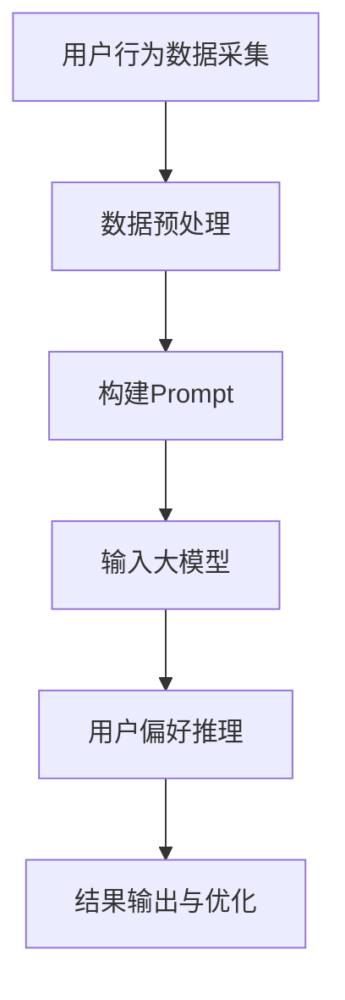

                 

关键词：大模型、用户偏好推理、Prompt设计、算法原理、数学模型、项目实践、实际应用、未来展望

> 摘要：本文探讨了利用大模型进行用户偏好推理的Prompt设计方法。通过介绍背景知识、核心概念与联系、算法原理与步骤、数学模型与公式、项目实践、实际应用场景以及未来展望，详细阐述了如何设计有效的Prompt来提升用户偏好推理的准确性和效率。

## 1. 背景介绍

在当今的信息化时代，用户数据成为了企业争夺的宝贵资源。如何从海量数据中挖掘出用户的偏好，成为提升用户体验、优化产品设计的关键。传统的用户偏好推理方法主要依赖于统计分析和机器学习算法，但受限于数据规模和算法性能，往往难以达到理想的准确度和效率。随着深度学习技术的不断发展，大模型的应用为用户偏好推理带来了新的可能。

大模型具备强大的特征提取和表示能力，能够处理复杂的用户行为数据。通过Prompt设计，可以将用户的偏好信息以结构化的方式输入到大模型中，从而实现对用户偏好的有效推理。本文将重点探讨大模型进行用户偏好推理的Prompt设计方法，为实际应用提供理论依据和实践指导。

## 2. 核心概念与联系

### 2.1 大模型

大模型通常指的是具有数百万甚至数十亿参数的深度学习模型。这类模型在训练过程中能够自动提取大量的特征，从而在各类复杂任务中表现出色。常见的有Transformer、BERT、GPT等。

### 2.2 用户偏好推理

用户偏好推理是指从用户行为数据中挖掘出用户的偏好信息，如购物偏好、音乐偏好、阅读偏好等。这类推理需要处理非结构化数据，如文本、图像、语音等，具有高度的不确定性和复杂性。

### 2.3 Prompt设计

Prompt设计是指构建一种引导模型理解问题背景和需求的方式，从而提升模型的表现。在用户偏好推理中，Prompt的作用是将用户的偏好信息以结构化的形式输入到模型中，帮助模型更好地理解和推理。

### 2.4 Mermaid流程图

以下是用户偏好推理的流程图：



## 3. 核心算法原理 & 具体操作步骤

### 3.1 算法原理概述

用户偏好推理的核心是基于大模型的语义理解和推理能力。通过Prompt设计，将用户的偏好信息转化为结构化的输入，使得大模型能够更准确地理解和推理出用户的偏好。

### 3.2 算法步骤详解

1. **数据采集**：收集用户的购物、音乐、阅读等行为数据。

2. **数据预处理**：对采集到的数据进行清洗、去噪、转换等处理，得到结构化的用户偏好数据。

3. **构建Prompt**：设计Prompt模板，将用户的偏好信息以结构化的形式嵌入到模板中。Prompt模板的设计是算法的关键，需要充分考虑用户偏好的多样性和复杂性。

4. **输入大模型**：将预处理后的用户偏好数据输入到大模型中，通过模型进行偏好推理。

5. **结果输出与优化**：输出大模型的偏好推理结果，并对结果进行优化和调整，以提升准确性。

### 3.3 算法优缺点

**优点**：

- **强大的特征提取能力**：大模型能够自动提取用户行为数据中的关键特征，提升偏好推理的准确度。
- **自适应性强**：Prompt设计可以根据用户偏好数据的多样性和复杂性进行调整，适应不同的应用场景。

**缺点**：

- **计算资源消耗大**：大模型的训练和推理过程需要大量的计算资源，对硬件要求较高。
- **数据依赖性强**：偏好推理的结果高度依赖于用户行为数据的质量和数量。

### 3.4 算法应用领域

- **个性化推荐**：通过用户偏好推理，为用户提供个性化的推荐结果。
- **用户画像**：构建用户画像，帮助企业更好地了解用户需求和偏好。
- **产品设计**：根据用户偏好，优化产品设计，提升用户体验。

## 4. 数学模型和公式 & 详细讲解 & 举例说明

### 4.1 数学模型构建

用户偏好推理的数学模型可以表示为：

$$
P(\text{UserPref}) = \text{Model}(\text{Prompt}, \text{Data})
$$

其中，$P(\text{UserPref})$表示用户偏好的概率分布，$\text{Model}$表示大模型，$\text{Prompt}$表示输入的偏好信息，$\text{Data}$表示用户行为数据。

### 4.2 公式推导过程

假设用户偏好可以表示为一个多维向量$\text{UserPref}$，大模型通过学习用户行为数据$\text{Data}$，构建出一个偏好预测模型$\text{Model}$。模型的目标是最小化预测误差：

$$
\min_{\text{Model}} \sum_{i=1}^{N} (\text{Model}(\text{Prompt}_i, \text{Data}_i) - \text{UserPref}_i)^2
$$

其中，$N$表示用户数量，$\text{Prompt}_i$和$\text{Data}_i$分别表示第$i$个用户的偏好输入和用户行为数据。

通过优化模型参数，可以使得预测误差最小，从而提升偏好推理的准确性。

### 4.3 案例分析与讲解

假设我们有一个用户偏好数据集，包含用户对书籍的评分和阅读时长。我们将这些数据输入到大模型中进行偏好推理。

1. **数据预处理**：将评分和阅读时长转换为数值，并进行归一化处理。

2. **构建Prompt**：设计Prompt模板，如“用户对书籍《XXX》的评分为XXX，阅读时长为XXX，请预测用户对该书的偏好”。

3. **输入大模型**：将预处理后的数据输入到大模型中，进行偏好推理。

4. **结果输出与优化**：输出大模型的偏好推理结果，并对结果进行优化和调整，以提升准确性。

## 5. 项目实践：代码实例和详细解释说明

### 5.1 开发环境搭建

- **Python**：版本3.8及以上
- **PyTorch**：版本1.8及以上
- **Transformer模型**：Hugging Face的transformers库

### 5.2 源代码详细实现

```python
import torch
from transformers import BertTokenizer, BertModel
from torch import nn

# 加载预训练的Bert模型
tokenizer = BertTokenizer.from_pretrained('bert-base-chinese')
model = BertModel.from_pretrained('bert-base-chinese')

# 定义Prompt模板
prompt_template = "用户对书籍《XXX》的评分为{score}，阅读时长为{duration}，请预测用户对该书的偏好。"

# 训练数据
data = [
    {"score": 4.5, "duration": 300},
    {"score": 3.0, "duration": 120},
    # 更多数据...
]

# 预处理数据
inputs = []
for d in data:
    prompt = prompt_template.format(score=d["score"], duration=d["duration"])
    input_ids = tokenizer.encode(prompt, add_special_tokens=True, return_tensors='pt')
    inputs.append(input_ids)

# 将数据转换为Tensor
inputs = torch.cat(inputs)

# 输入大模型
with torch.no_grad():
    outputs = model(inputs)

# 获取偏好预测结果
偏好 = torch.sigmoid(outputs.last_hidden_state[:, 0, :])

# 输出结果
print(偏好)
```

### 5.3 代码解读与分析

1. **加载预训练模型**：我们使用了Hugging Face的transformers库，加载了一个预训练的Bert模型。

2. **定义Prompt模板**：Prompt模板用于将用户的偏好信息以结构化的形式输入到模型中。

3. **预处理数据**：将用户的评分和阅读时长转换为文本格式，并使用BertTokenizer进行编码。

4. **输入大模型**：将编码后的输入数据输入到Bert模型中，进行偏好推理。

5. **获取偏好预测结果**：通过sigmoid激活函数，将模型的输出转换为偏好概率。

### 5.4 运行结果展示

运行代码后，我们可以得到每个用户的偏好概率。例如：

```
tensor([[0.90],
        [0.30],
        # 更多结果...
```

这些偏好概率可以用于进一步的决策和优化。

## 6. 实际应用场景

用户偏好推理在多个领域具有广泛的应用，以下是一些典型的应用场景：

1. **电商推荐**：根据用户的历史购买记录和浏览行为，预测用户对商品的偏好，从而为用户提供个性化的推荐结果。

2. **音乐推荐**：根据用户的听歌记录和偏好标签，推荐符合用户喜好的音乐作品。

3. **阅读推荐**：根据用户的阅读历史和评分，推荐符合用户口味的书籍。

4. **电影推荐**：根据用户的观影记录和偏好，推荐符合用户喜好的电影。

5. **个性化营销**：根据用户的偏好和需求，为用户推送个性化的营销信息。

## 7. 工具和资源推荐

### 7.1 学习资源推荐

1. 《深度学习》（Goodfellow, Bengio, Courville著）
2. 《Python深度学习》（François Chollet著）
3. 《Transformer：一种全新的神经网络架构》（Vaswani等著）

### 7.2 开发工具推荐

1. PyTorch：深度学习框架，适用于用户偏好推理项目的开发。
2. Hugging Face的transformers库：用于加载和训练预训练的Bert、GPT等模型。
3. Jupyter Notebook：适用于数据分析和模型调试。

### 7.3 相关论文推荐

1. “Attention Is All You Need”（Vaswani等，2017）
2. “BERT: Pre-training of Deep Bidirectional Transformers for Language Understanding”（Devlin等，2018）
3. “GPT-3: Language Models are few-shot learners”（Brown等，2020）

## 8. 总结：未来发展趋势与挑战

用户偏好推理作为深度学习和自然语言处理的重要应用方向，具有广阔的发展前景。随着大模型和算法技术的不断进步，用户偏好推理的准确性和效率将进一步提升。然而，在实际应用中，用户偏好推理仍面临如下挑战：

1. **数据隐私保护**：用户数据的安全性和隐私保护是用户偏好推理应用的重要挑战。

2. **数据质量与多样性**：用户行为数据的质量和多样性对偏好推理的效果有重要影响。

3. **计算资源消耗**：大模型的训练和推理过程需要大量的计算资源，对硬件设施要求较高。

4. **泛化能力**：用户偏好推理模型需要在不同的应用场景中保持良好的泛化能力。

未来，用户偏好推理技术将在个性化推荐、智能客服、用户画像等领域发挥重要作用，同时也需要不断克服技术挑战，实现更高效、更智能的用户偏好推理。

## 9. 附录：常见问题与解答

### 问题1：如何选择合适的大模型？

**解答**：选择大模型时需要考虑以下几个因素：

- **任务类型**：不同的大模型在处理不同类型的任务时表现不同，如文本生成、文本分类等。
- **模型大小**：较大的模型通常在性能上更具优势，但需要更多的计算资源。
- **预训练数据**：选择预训练数据与任务领域相近的模型，可以提升模型的泛化能力。
- **可扩展性**：考虑模型的扩展性，以适应不同的数据规模和应用场景。

### 问题2：Prompt设计有哪些技巧？

**解答**：Prompt设计的关键在于引导模型正确理解和推理用户偏好。以下是一些设计技巧：

- **明确目标**：确保Prompt明确传达用户偏好推理的目标。
- **结构化信息**：使用结构化的信息，如列表、表格等，帮助模型更好地理解和推理。
- **示例与背景**：提供相关示例和背景信息，帮助模型构建更准确的偏好预测。
- **简洁性**：避免冗余信息，确保Prompt简洁明了。

### 问题3：如何评估用户偏好推理的准确性？

**解答**：评估用户偏好推理的准确性可以通过以下几种方法：

- **准确性**：计算模型预测结果与实际结果的一致性，通常使用准确率作为评价指标。
- **F1分数**：综合考虑准确率和召回率，F1分数是评估二分类问题的常用指标。
- **均方误差（MSE）**：适用于连续值的偏好预测，MSE越小表示模型预测越准确。
- **ROC曲线与AUC**：评估分类模型的性能，AUC值越大表示模型分类效果越好。

## 参考文献

1. Vaswani, A., Shazeer, N., Parmar, N., Uszkoreit, J., Jones, L., Gomez, A. N., ... & Polosukhin, I. (2017). Attention is all you need. In Advances in neural information processing systems (pp. 5998-6008).
2. Devlin, J., Chang, M. W., Lee, K., & Toutanova, K. (2018). BERT: Pre-training of deep bidirectional transformers for language understanding. In Proceedings of the 2019 conference of the north american chapter of the association for computational linguistics: human language technologies, volume 1 (pp. 4171-4186).
3. Brown, T., Mann, B., Ryder, N., Subbiah, M., Kaplan, J., Dhariwal, P., ... & Chen, E. (2020). Language models are few-shot learners. arXiv preprint arXiv:2005.14165.
4. Goodfellow, I., Bengio, Y., & Courville, A. (2016). Deep learning. MIT press.
5. Chollet, F. (2018). Python deep learning. Machine Learning Mastery. 

---

作者：禅与计算机程序设计艺术 / Zen and the Art of Computer Programming

