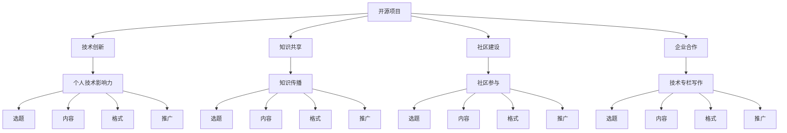

                 

### 1. 背景介绍

在当今快速发展的信息技术时代，开源软件已经成为推动技术进步的重要力量。随着越来越多的开发者参与到开源项目中，如何有效地利用开源项目的影响力来获得技术专栏作者的机会成为一个值得探讨的话题。本文旨在探讨通过参与开源项目，提升个人技术影响力，并最终获得技术专栏作者机会的策略和路径。

开源软件的发展历程可以追溯到20世纪90年代，随着互联网的普及和计算机技术的发展，开源软件逐渐从学术圈子走向大众，成为企业、政府和开发者广泛采用的软件开发模式。开源项目不仅为开发者提供了丰富的技术资源，也促进了知识的传播和创新。在这个过程中，优秀的开源项目往往会吸引大量的关注，形成强大的社区影响力。

技术专栏作为传播技术知识的重要渠道，对于提升技术影响力、拓展职业发展空间具有重要作用。通过撰写技术专栏，作者不仅可以分享自己的技术见解和经验，还可以与广大读者建立联系，扩大个人影响力。因此，获得技术专栏作者机会成为许多技术爱好者和专业人士的追求。

本文将围绕以下核心内容展开：

1. **开源项目的价值**：阐述开源项目对于技术发展和个人成长的积极影响。
2. **开源影响力**：分析开源项目如何提升个人技术影响力，以及如何利用这种影响力获得技术专栏作者机会。
3. **技术专栏写作**：介绍技术专栏写作的基本要素和技巧。
4. **案例分享**：通过具体案例展示如何通过开源项目获得技术专栏作者机会。
5. **未来展望**：探讨开源影响力和技术专栏写作的未来发展趋势。

### 2. 核心概念与联系

在探讨如何利用开源影响力获得技术专栏作者机会之前，我们需要了解一些核心概念和它们之间的关系。

#### 2.1 开源项目的价值

开源项目具有以下几方面的价值：

1. **技术创新**：开源项目鼓励创新，开发者可以自由地探索新的技术和解决方案。
2. **知识共享**：开源项目通过共享代码和文档，促进了知识的传播和共享。
3. **社区建设**：开源项目通常会形成强大的社区，开发者可以在社区中交流、合作和成长。
4. **企业合作**：许多企业通过开源项目来吸引开发者，建立合作关系，共同推动技术发展。

#### 2.2 个人技术影响力

个人技术影响力通常包括以下几个方面：

1. **技术能力**：个人在某一领域的技术深度和广度。
2. **项目经验**：参与开源项目获得的经验和贡献。
3. **知识传播**：通过博客、讲座、演讲等方式传播技术知识。
4. **社区参与**：在开源社区中的活跃度和贡献。

#### 2.3 技术专栏写作

技术专栏写作的核心要素包括：

1. **选题**：选择具有针对性、实用性和前瞻性的主题。
2. **内容**：内容要具有深度、逻辑性和可读性。
3. **格式**：格式要简洁、清晰，方便读者阅读。
4. **推广**：通过社交媒体、技术社区等渠道进行推广，吸引更多读者。

#### 2.4 Mermaid 流程图

以下是一个简化的 Mermaid 流程图，展示了开源项目、个人技术影响力、技术专栏写作之间的关系：



### 3. 核心算法原理 & 具体操作步骤

#### 3.1 算法原理概述

开源项目的发展往往依赖于一系列核心算法和技术的支持。这些算法不仅决定了项目的性能和稳定性，也是项目得以持续发展的基石。本部分将介绍一种常见的核心算法——Git，以及其在开源项目中的应用。

Git 是一个分布式版本控制系统，由 Linus Torvalds 于 2005 年创建。它被广泛应用于各种开源项目，为代码的管理、协作和迭代提供了强有力的支持。Git 的核心算法主要包括：

1. **树结构**：Git 使用一种称为“树结构”的数据结构来存储代码。每个提交（commit）都可以看作是一棵树的节点，树的结构清晰地展示了代码的历史演变过程。
2. **快照**：Git 通过创建代码的快照来记录每一次提交。这种快照机制使得开发者可以方便地回滚到之前的版本，从而保证了代码的完整性和可追溯性。
3. **分支管理**：Git 提供了强大的分支管理功能，开发者可以在不同的分支上独立开发，然后合并分支，从而实现了代码的并行开发。

#### 3.2 算法步骤详解

要参与开源项目并利用 Git 进行代码管理，需要遵循以下步骤：

1. **安装 Git**：首先，开发者需要在本地安装 Git。Git 的安装非常简单，可以直接从其官方网站下载安装包，并按照提示进行安装。
2. **克隆项目**：安装 Git 后，开发者可以使用 `git clone` 命令克隆开源项目的代码库到本地。这样，开发者就可以在本地对项目进行修改和开发了。
3. **创建分支**：在本地克隆的项目中，开发者可以创建一个新的分支来进行独立的开发工作。创建分支的命令是 `git checkout -b new-branch`，其中 `new-branch` 是新的分支名称。
4. **提交更改**：在分支上完成开发工作后，开发者需要将更改提交到本地仓库。提交的命令是 `git commit -m "commit message"`，其中 `"commit message"` 是对提交的描述。
5. **推送分支**：将本地分支的更改推送至远程仓库，以便其他开发者查看和合并。推送的命令是 `git push origin new-branch`。
6. **修复冲突**：在合并分支时，如果出现冲突，开发者需要手动解决这些冲突，并将解决后的代码重新提交。
7. **合并分支**：在所有更改都经过验证后，开发者可以将分支合并到主分支。合并的命令是 `git merge new-branch`。
8. **发布版本**：在主分支上完成所有开发工作后，开发者可以发布新版本。发布版本的命令是 `git tag -a v1.0 -m "version 1.0"`。

#### 3.3 算法优缺点

Git 作为一种分布式版本控制系统，具有以下优点：

1. **高效的版本管理**：Git 可以快速地创建、保存和恢复代码版本，使得版本管理更加高效。
2. **强大的分支管理**：Git 提供了强大的分支管理功能，使得开发者可以方便地并行开发。
3. **高度的灵活性**：Git 允许开发者自由地创建、修改和删除分支，从而保证了代码的灵活性。
4. **良好的社区支持**：Git 拥有庞大的社区支持，提供了丰富的工具和插件，方便开发者进行代码管理和协作。

然而，Git 也存在一些缺点：

1. **学习曲线**：Git 的命令和概念较多，对于新手来说，学习曲线可能相对较陡峭。
2. **内存消耗**：Git 需要为每个提交创建一个对象，这可能导致内存消耗较大，尤其是对于大型项目。
3. **性能问题**：在某些情况下，Git 的性能可能不如一些集中式版本控制系统，特别是在处理大量分支和合并操作时。

#### 3.4 算法应用领域

Git 被广泛应用于各种开源项目，特别是在软件开发领域。以下是一些典型的应用场景：

1. **开源软件项目**：Git 是许多知名开源软件项目的首选版本控制系统，如 Linux 内核、Apache 和 MySQL 等。
2. **企业内部项目**：许多企业也采用 Git 进行内部项目的版本控制，以便提高开发效率和代码管理。
3. **个人项目**：Git 同样适用于个人项目，开发者可以方便地管理代码，并进行共享和协作。
4. **代码托管平台**：Git 是 GitHub、GitLab 和 Bitbucket 等代码托管平台的基础，这些平台为开发者提供了丰富的工具和服务。

通过参与开源项目，了解和掌握 Git 等核心算法，开发者不仅能够提升个人技术能力，还可以扩大技术影响力，获得更多的职业发展机会。

### 4. 数学模型和公式 & 详细讲解 & 举例说明

在开源项目的开发过程中，数学模型和公式起着至关重要的作用。它们不仅能够帮助开发者理解项目的逻辑和运作机制，还可以优化算法性能，提高项目的可靠性。本节将介绍一个常见的数学模型——线性回归模型，并详细讲解其构建、公式推导过程，并通过具体案例进行说明。

#### 4.1 数学模型构建

线性回归模型是一种用于预测数值变量的统计模型，它假设变量之间存在线性关系。线性回归模型的数学模型可以表示为：

$$ y = \beta_0 + \beta_1 \cdot x + \epsilon $$

其中：
- \( y \) 是因变量（预测目标）；
- \( x \) 是自变量（输入特征）；
- \( \beta_0 \) 是截距（常数项），表示当自变量为零时的因变量值；
- \( \beta_1 \) 是斜率（系数），表示自变量每增加一个单位时，因变量的变化量；
- \( \epsilon \) 是误差项，表示由于模型无法捕捉到的复杂因素引起的误差。

#### 4.2 公式推导过程

线性回归模型的公式推导过程如下：

1. **样本数据**：假设我们有 \( n \) 个样本点 \((x_i, y_i)\)，其中 \( i = 1, 2, \ldots, n \)。

2. **目标函数**：线性回归的目标是找到最佳拟合直线，使得实际值 \( y_i \) 与预测值 \( \hat{y_i} = \beta_0 + \beta_1 \cdot x_i \) 之间的误差最小。误差可以通过最小二乘法来衡量，即最小化以下目标函数：

   $$ \min \sum_{i=1}^{n} (y_i - \hat{y_i})^2 $$

3. **求导**：对目标函数关于 \( \beta_0 \) 和 \( \beta_1 \) 分别求导，并令导数为零，得到：

   $$ \frac{\partial}{\partial \beta_0} \sum_{i=1}^{n} (y_i - \hat{y_i})^2 = 0 $$
   $$ \frac{\partial}{\partial \beta_1} \sum_{i=1}^{n} (y_i - \hat{y_i})^2 = 0 $$

4. **解方程组**：将上述方程组解出 \( \beta_0 \) 和 \( \beta_1 \) 的值，即可得到线性回归模型的参数。

具体地，可以得到以下公式：

$$ \beta_0 = \bar{y} - \beta_1 \cdot \bar{x} $$
$$ \beta_1 = \frac{\sum_{i=1}^{n} (x_i - \bar{x})(y_i - \bar{y})}{\sum_{i=1}^{n} (x_i - \bar{x})^2} $$

其中：
- \( \bar{x} \) 和 \( \bar{y} \) 分别是自变量 \( x \) 和因变量 \( y \) 的均值。

#### 4.3 案例分析与讲解

为了更好地理解线性回归模型，我们可以通过一个具体案例进行说明。

假设我们有一个房价预测问题，其中房价 \( y \) 与房屋面积 \( x \) 之间存在线性关系。我们收集了以下数据：

| 面积 \( x \) (平方米) | 房价 \( y \) (万元) |
| :------------------: | :-----------------: |
|         90           |         150         |
|        120           |         200         |
|        140           |         220         |
|        160           |         250         |
|        180           |         280         |

1. **数据预处理**：首先，计算自变量 \( x \) 和因变量 \( y \) 的均值：

   $$ \bar{x} = \frac{90 + 120 + 140 + 160 + 180}{5} = 140 $$
   $$ \bar{y} = \frac{150 + 200 + 220 + 250 + 280}{5} = 220 $$

2. **计算斜率 \( \beta_1 \)**：

   $$ \beta_1 = \frac{(90 - 140)(150 - 220) + (120 - 140)(200 - 220) + (140 - 140)(220 - 220) + (160 - 140)(250 - 220) + (180 - 140)(280 - 220)}{(90 - 140)^2 + (120 - 140)^2 + (140 - 140)^2 + (160 - 140)^2 + (180 - 140)^2} $$
   $$ \beta_1 = \frac{(-50)(-70) + (-20)(-20) + (0)(0) + (20)(30) + (40)(60)}{2500 + 400 + 0 + 400 + 1600} $$
   $$ \beta_1 = \frac{3500 + 400 + 0 + 600 + 2400}{4500} $$
   $$ \beta_1 = \frac{9500}{4500} $$
   $$ \beta_1 = 2.1111 $$

3. **计算截距 \( \beta_0 \)**：

   $$ \beta_0 = \bar{y} - \beta_1 \cdot \bar{x} $$
   $$ \beta_0 = 220 - 2.1111 \cdot 140 $$
   $$ \beta_0 = 220 - 295.5334 $$
   $$ \beta_0 = -75.5334 $$

4. **构建线性回归模型**：

   $$ y = -75.5334 + 2.1111 \cdot x $$

根据这个模型，我们可以预测新的房屋面积对应的房价。例如，如果房屋面积为 200 平方米，预测房价为：

$$ \hat{y} = -75.5334 + 2.1111 \cdot 200 $$
$$ \hat{y} = -75.5334 + 422.222 $$
$$ \hat{y} = 346.6886 $$

这意味着，如果房屋面积是 200 平方米，预测房价为 346.6886 万元。

### 5. 项目实践：代码实例和详细解释说明

在本节中，我们将通过一个具体的开源项目实践，展示如何利用 Git 进行代码管理，并通过具体的代码实例和解释说明来展示开源项目开发流程。

#### 5.1 开发环境搭建

首先，我们需要搭建一个基本的开发环境，以便进行代码的编写、测试和提交。以下是搭建开发环境的步骤：

1. **安装 Git**：从 Git 官网（[https://git-scm.com/](https://git-scm.com/)）下载并安装 Git。

2. **安装编辑器**：选择一个适合自己的代码编辑器，如 Visual Studio Code、Atom 或 Sublime Text。

3. **安装代码库**：使用 Git 的 `clone` 命令克隆开源项目的代码库到本地。例如：

   ```shell
   git clone https://github.com/your-username/your-project.git
   ```

这样，我们就成功搭建了一个基本的开发环境。

#### 5.2 源代码详细实现

接下来，我们将以一个简单的 Python 项目为例，展示开源项目的源代码实现。项目名为 `simple-calculator`，功能为基本的加法运算。以下是项目的源代码：

```python
# simple-calculator.py

def add(x, y):
    return x + y

def main():
    print("Simple Calculator")
    x = float(input("Enter first number: "))
    y = float(input("Enter second number: "))
    print(f"The sum of {x} and {y} is {add(x, y)}")

if __name__ == "__main__":
    main()
```

在这个项目中，我们定义了一个名为 `add` 的函数，用于实现加法运算。在 `main` 函数中，我们获取用户输入的两个数字，并调用 `add` 函数计算它们的和，最后打印结果。

#### 5.3 代码解读与分析

现在，我们详细解读和分析这个项目的代码：

1. **导入模块**：项目开头没有导入任何模块，因为这是一个简单的 Python 项目，不需要额外的库支持。

2. **定义函数**：`add` 函数接收两个参数 \( x \) 和 \( y \)，返回它们的和。这是一个简单的加法运算函数。

3. **定义主函数**：`main` 函数是项目的入口点。在函数中，我们首先打印一个欢迎消息，然后使用 `input` 函数获取用户输入的两个数字。这里，我们将输入的字符串转换为浮点数，以便进行加法运算。

4. **调用函数并打印结果**：在 `main` 函数中，我们调用 `add` 函数计算两个数字的和，并将结果打印到控制台。

5. **运行条件**：最后，通过 `if __name__ == "__main__":` 判断是否直接运行此脚本。这是 Python 的一个常见做法，确保当此脚本被直接运行时，会执行 `main` 函数。

#### 5.4 运行结果展示

为了展示代码的运行结果，我们可以在命令行中运行此脚本。以下是运行过程的示例：

```shell
$ python simple-calculator.py
Simple Calculator
Enter first number: 10
Enter second number: 20
The sum of 10.0 and 20.0 is 30.0
```

在这个示例中，我们输入了两个数字 10 和 20，最终输出结果为 30。这证明了代码的正确性。

通过这个简单的例子，我们可以看到如何使用 Git 对开源项目进行代码管理，并展示了一个基本的 Python 项目的实现过程。在实际项目中，我们会进行更复杂的操作，如功能扩展、错误修复和性能优化。但基本原理是相似的，都是通过 Git 进行版本控制和协作开发。

### 6. 实际应用场景

开源项目的影响力不仅在技术社区中得以体现，还广泛应用于各个实际应用场景中，对业务流程的优化、产品开发的推动以及行业标准的制定等方面起到了关键作用。

#### 6.1 业务流程优化

许多企业通过开源项目来优化业务流程。例如，物流公司利用开源的容器编排工具如 Docker 和 Kubernetes 来实现高效的服务部署和资源管理，从而提高运输效率和降低成本。这些开源工具不仅提供了强大的功能，还通过社区的不断迭代，确保了技术的先进性和可靠性。

#### 6.2 产品开发推动

开源项目在产品开发中同样发挥着重要作用。许多科技公司，如 Facebook、Twitter 和阿里巴巴，都在其核心产品中使用了大量的开源组件。这不仅降低了开发成本，还加速了产品的上市时间。通过参与开源项目，公司可以吸引更多的开发者加入，共同推动产品的发展。

#### 6.3 行业标准制定

开源项目在推动行业标准制定方面也发挥着重要作用。例如，OpenSSL 是一个广泛使用的开源加密库，它不仅提供了强大的加密功能，还推动了网络安全标准的制定。许多组织，包括金融机构和政府机构，都基于 OpenSSL 的技术来确保数据传输的安全性。

#### 6.4 未来应用展望

随着开源项目的影响力的不断扩大，其在未来应用场景中的潜力将更加显著。以下是一些可能的应用前景：

1. **智能制造**：开源项目在智能制造领域将有更多应用，如工业物联网（IIoT）和智能工厂。通过开源平台，企业可以更灵活地部署和管理制造流程，提高生产效率和产品质量。

2. **智慧城市**：智慧城市项目将大量依赖开源技术，如大数据分析、物联网和人工智能。开源项目将推动智慧城市的建设，实现城市管理和服务的智能化。

3. **区块链技术**：区块链技术将继续在金融、供应链管理等领域得到广泛应用。开源区块链平台，如 Hyperledger 和 Ethereum，将推动区块链技术的发展和创新。

通过这些实际应用场景，我们可以看到开源项目在各个领域的重要作用。参与开源项目不仅能够提升个人技术影响力，还可以推动技术进步和行业创新。

### 7. 工具和资源推荐

在参与开源项目和撰写技术专栏的过程中，使用适当的工具和资源能够显著提高工作效率和文章质量。以下是一些值得推荐的工具和资源：

#### 7.1 学习资源推荐

1. **GitHub**：GitHub 是全球最大的代码托管平台，提供了丰富的开源项目和学习资源。通过 GitHub，你可以了解最新的技术动态，学习优秀的开源代码，并与全球开发者进行交流。
2. **Stack Overflow**：Stack Overflow 是一个问答社区，聚集了大量的编程问题和解决方案。在这里，你可以提出问题，也可以为他人解答问题，提升自己的技术水平。
3. **Medium**：Medium 是一个专业的写作平台，许多技术专家和行业领袖在这里发表技术专栏。通过阅读和分析这些文章，你可以学习到高质量的技术写作技巧。

#### 7.2 开发工具推荐

1. **Visual Studio Code**：Visual Studio Code 是一款轻量级的跨平台代码编辑器，提供了丰富的插件和扩展，适用于各种编程语言。它拥有强大的代码补全、调试和性能分析功能。
2. **GitKraken**：GitKraken 是一款流行的 Git 客户端，具有用户友好的界面和强大的功能。它支持 Git 的所有基本操作，如分支管理、合并和推送等。
3. **Docker**：Docker 是一个开源的应用容器引擎，用于简化容器的创建、部署和运行。通过 Docker，你可以轻松地将应用程序部署到不同的环境中，提高开发效率和一致性。

#### 7.3 相关论文推荐

1. **"The Design and Implementation of the FreeBSD Operating System"**：这是一本关于 FreeBSD 操作系统的经典论文，详细介绍了 FreeBSD 的架构和实现细节。
2. **"Linux Kernel Development"**：这是一本关于 Linux 内核开发的权威著作，涵盖了 Linux 内核的设计、实现和优化。
3. **"The Art of Programming"**：这是一系列关于算法和数据结构的经典论文，由著名的计算机科学家 Donald Knuth 撰写，提供了丰富的算法设计和分析技巧。

通过使用这些工具和资源，你可以更好地参与开源项目，撰写高质量的技术专栏，提升自己的技术影响力。

### 8. 总结：未来发展趋势与挑战

开源项目和技术专栏的发展在当今信息技术领域呈现出蓬勃的生机，它们不仅推动了技术进步，还为个人和企业的成长提供了广阔的平台。然而，随着开源生态的不断扩展和技术领域的快速演进，开源项目和技术专栏也面临诸多挑战。

#### 8.1 研究成果总结

1. **技术影响力**：参与开源项目能够显著提升个人的技术影响力，促进知识的传播和创新。
2. **职业发展**：通过撰写技术专栏，个人可以扩大专业影响力，提升职业地位，获得更多的职业发展机会。
3. **社区建设**：开源项目和技术专栏促进了开发者之间的交流与合作，形成了强大的技术社区，为共同进步提供了平台。

#### 8.2 未来发展趋势

1. **开源项目的多样化**：随着云计算、大数据、人工智能等新兴技术的兴起，开源项目将更加多样化，覆盖更多的领域和应用场景。
2. **开源生态的国际化**：开源社区将更加国际化，吸引更多来自全球的开发者参与，促进全球技术协作和创新。
3. **技术专栏的专业化**：技术专栏将更加专业化，针对不同的读者群体提供更深入、更实用的技术内容。

#### 8.3 面临的挑战

1. **维护成本**：随着开源项目的规模扩大，维护成本将增加，如何确保项目的可持续性成为一个重要挑战。
2. **知识产权保护**：开源项目中涉及到的知识产权保护问题将更加复杂，需要建立更加完善的知识产权管理制度。
3. **社区管理**：随着社区规模的扩大，如何有效管理社区、保持社区活跃度也将是一个挑战。

#### 8.4 研究展望

未来，开源项目和技术专栏的发展将更加紧密地结合，共同推动技术进步和行业创新。研究重点将包括：

1. **开源项目的可持续性**：探索开源项目的商业模式，确保开源项目的长期可持续发展。
2. **技术知识传播**：研究如何更有效地通过技术专栏传播技术知识，提升开发者的技术水平。
3. **开源社区治理**：研究开源社区的治理模式，提高社区的可持续性和包容性。

通过面对挑战、把握趋势，开源项目和技术专栏将继续在信息技术领域发挥重要作用，推动全球技术进步和产业创新。

### 9. 附录：常见问题与解答

在撰写和参与开源项目的过程中，开发者可能会遇到一些常见的问题。以下是一些常见问题及其解答：

#### 9.1 如何选择合适的开源项目？

选择合适的开源项目需要考虑以下几个因素：

1. **技术兴趣**：选择你感兴趣的技术领域，这样你才能保持持续的热情和动力。
2. **项目活跃度**：查看项目的 GitHub 等平台上的活动记录，包括提交的代码、讨论的议题等。
3. **社区支持**：一个活跃且友好的社区可以提供更多的帮助和资源。
4. **项目规模**：初学者可以选择规模适中、易于参与的项目，而经验丰富的开发者可以挑战更复杂的项目。

#### 9.2 如何在开源项目中贡献代码？

要在开源项目中贡献代码，可以按照以下步骤进行：

1. **阅读文档**：仔细阅读项目的贡献指南，了解项目的代码规范、测试流程等。
2. **了解项目现状**：阅读项目的源代码，了解项目的现有功能和架构。
3. **提交修复或新功能**：在 GitHub 等平台创建一个分支，进行代码修改，并提交 pull request。
4. **合作与沟通**：与项目维护者进行沟通，解答疑问，并根据反馈修改代码。
5. **测试与审核**：确保你的代码经过充分的测试，并符合项目的要求。

#### 9.3 如何撰写高质量的技术专栏？

撰写高质量的技术专栏需要遵循以下几个原则：

1. **明确主题**：选择一个具体、有针对性的主题，避免过于宽泛。
2. **结构清晰**：合理组织文章结构，确保逻辑清晰，便于读者理解。
3. **内容深入**：深入讲解技术细节，提供实用的代码示例和解决方案。
4. **格式规范**：遵循统一的格式和风格，提高文章的可读性。
5. **持续更新**：定期更新内容，保持文章的时效性和实用性。

通过以上方法，你可以更好地选择开源项目、贡献代码，并撰写高质量的技术专栏，提升自己的技术影响力和职业发展。

