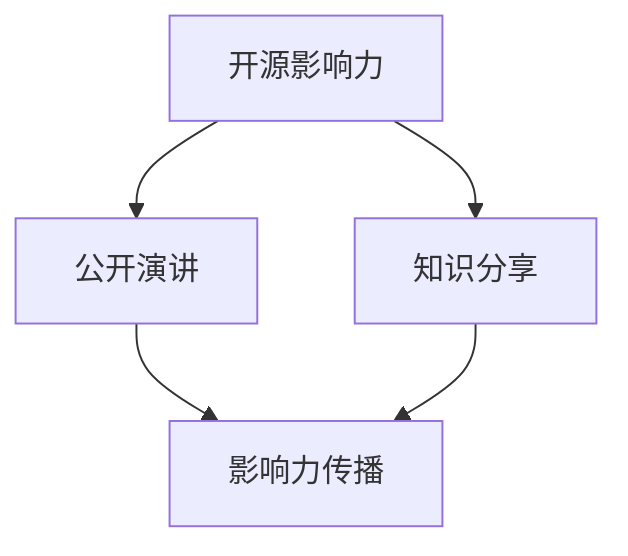

                 

关键词：开源影响力、公开演讲、知识分享、技术博客、演讲技巧、知识传播、开源项目、影响力构建

摘要：本文旨在探讨如何利用开源影响力进行有效的公开演讲和知识分享。通过对开源项目的深入研究和实践经验，本文提出了一系列策略和技巧，帮助开发者和技术专家在演讲和分享过程中提升影响力，传播技术知识，促进个人和社区的成长。

## 1. 背景介绍

开源运动在过去的几十年中迅速发展，已成为科技领域的重要组成部分。开源项目不仅为全球开发者提供了丰富的资源和工具，还推动了技术的创新和进步。随着开源影响力的日益扩大，越来越多的开发者和技术专家希望通过公开演讲和知识分享来传播开源理念和技术知识。

然而，面对日益增长的演讲和分享需求，许多开发者和技术专家却感到困惑。如何才能在公开演讲和知识分享中发挥开源项目的影响力？如何通过这些活动提升个人和项目的影响力？本文将围绕这些问题，提供实用的策略和技巧。

## 2. 核心概念与联系

在探讨如何利用开源影响力进行公开演讲和知识分享之前，我们需要明确几个核心概念：

- **开源影响力**：指开源项目在技术社区中的影响力，包括项目的用户数量、活跃度、贡献者数量等。
- **公开演讲**：指在公众场合进行口头表达，分享知识、经验和观点的活动。
- **知识分享**：指将个人或团队的知识和经验通过文字、图片、视频等形式传递给他人。

这三个概念相互关联，共同构成了开源影响力的传播渠道。为了更好地理解这些概念，我们可以通过一个简单的 Mermaid 流程图来展示它们之间的关系：



### 2.1 开源影响力

开源影响力的大小取决于项目的用户基础、活跃度和贡献者的数量。一个具有高度开源影响力的项目往往会吸引更多的用户和贡献者，从而形成良性的正向循环。以下是几个衡量开源影响力的指标：

- **用户数量**：项目的用户数量是评估开源影响力的关键指标之一。用户越多，项目的受欢迎程度越高。
- **活跃度**：项目的活跃度体现在贡献者的活跃程度、问题反馈的速度和质量等方面。
- **贡献者数量**：项目的贡献者数量反映了项目的开放性和协作性。

### 2.2 公开演讲

公开演讲是一种有效的知识传播方式，通过口头表达，演讲者可以迅速传达观点、经验和知识。公开演讲的形式多种多样，包括技术大会、研讨会、工作坊、线上直播等。

### 2.3 知识分享

知识分享可以通过多种形式进行，包括博客文章、技术文档、视频教程、直播课程等。知识分享的目的是帮助他人了解和掌握技术，促进知识的传播和共享。

### 2.4 影响力传播

开源影响力的传播是通过公开演讲和知识分享实现的。演讲和分享活动不仅可以提升个人和项目的知名度，还可以吸引更多的用户和贡献者，从而进一步扩大开源影响力。

## 3. 核心算法原理 & 具体操作步骤

### 3.1 算法原理概述

利用开源影响力进行公开演讲和知识分享的核心算法可以概括为“影响力-传播-反馈”模型。该模型的基本原理如下：

- **影响力构建**：通过参与开源项目、贡献代码和文档，提升个人和项目的知名度。
- **传播知识**：通过公开演讲和知识分享，将技术知识和经验传递给他人。
- **获取反馈**：通过听众的反馈和互动，不断优化演讲和分享的内容和形式。

### 3.2 算法步骤详解

利用“影响力-传播-反馈”模型进行公开演讲和知识分享的具体操作步骤如下：

#### 3.2.1 影响力构建

1. **参与开源项目**：加入一个或多个与自己兴趣和专长相关的开源项目，积极贡献代码和文档。
2. **建立个人品牌**：通过博客、GitHub、Twitter等平台分享项目进展、技术见解和个人成长，建立个人品牌。
3. **参与社区活动**：参加技术大会、研讨会、线上讨论组等活动，扩大社交网络，提升影响力。

#### 3.2.2 传播知识

1. **确定演讲主题**：根据个人专长和开源项目，选择一个具有实际意义和影响力的演讲主题。
2. **准备演讲内容**：撰写演讲稿，整理和优化演讲结构，确保内容简洁明了、逻辑清晰。
3. **进行演讲**：在技术大会、研讨会等场合进行演讲，通过口才和表达技巧，将知识传递给听众。

#### 3.2.3 获取反馈

1. **收集听众反馈**：在演讲结束后，收集听众的问题和意见，了解听众的需求和兴趣点。
2. **优化演讲内容**：根据反馈，调整演讲内容和形式，提升演讲效果。
3. **持续分享知识**：在后续的演讲和分享中，结合听众反馈，不断优化和改进，提升知识传播的质量。

### 3.3 算法优缺点

#### 优点：

- **高效传播知识**：通过公开演讲和知识分享，可以迅速将技术知识和经验传递给更多的听众。
- **提升个人影响力**：参与开源项目和演讲活动，有助于提升个人在技术社区中的知名度和影响力。
- **促进社区发展**：通过知识传播和互动，可以促进开源社区的发展，吸引更多的贡献者。

#### 缺点：

- **准备时间较长**：公开演讲和知识分享需要充分的准备，包括选题、内容整理、演讲练习等，准备时间较长。
- **需要较高的口才和表达技巧**：演讲者需要具备一定的口才和表达技巧，才能有效地传递知识和吸引听众。

### 3.4 算法应用领域

“影响力-传播-反馈”模型在以下领域具有广泛的应用：

- **技术大会和研讨会**：技术大会和研讨会是传播技术知识和经验的重要平台，通过公开演讲和知识分享，可以提升演讲者和项目的知名度。
- **线上直播和课程**：随着互联网技术的发展，线上直播和课程已成为知识传播的重要形式，通过这些形式，可以更广泛地传播技术知识。
- **开源社区建设**：开源社区的建设需要大量的知识传播和互动，通过公开演讲和知识分享，可以促进社区成员之间的交流和合作。

## 4. 数学模型和公式 & 详细讲解 & 举例说明

在利用开源影响力进行公开演讲和知识分享的过程中，我们可以使用一些数学模型和公式来描述和优化各个环节。以下是一个简单的数学模型和公式的介绍：

### 4.1 数学模型构建

我们假设一个开源项目的用户数量为 \( U \)，活跃度为 \( A \)，贡献者数量为 \( C \)。根据“影响力-传播-反馈”模型，我们可以建立以下数学模型：

\[ I = f(U, A, C) \]

其中，\( I \) 表示开源影响力，\( f \) 是一个函数，用于描述用户数量、活跃度和贡献者数量对开源影响力的影响。

### 4.2 公式推导过程

根据上述假设，我们可以推导出以下公式：

\[ I = U \cdot A \cdot C \]

这个公式表明，开源影响力与用户数量、活跃度和贡献者数量成正比。用户数量越多，活跃度越高，贡献者数量越多，开源影响力越大。

### 4.3 案例分析与讲解

假设一个开源项目的用户数量为 1000，活跃度为 0.8，贡献者数量为 50。根据上述公式，我们可以计算出该项目的开源影响力：

\[ I = 1000 \cdot 0.8 \cdot 50 = 40000 \]

这意味着该项目的开源影响力为 40000。通过这个案例，我们可以看到，开源影响力的大小不仅取决于用户数量，还与活跃度和贡献者数量密切相关。

## 5. 项目实践：代码实例和详细解释说明

### 5.1 开发环境搭建

为了更好地展示如何利用开源影响力进行公开演讲和知识分享，我们将使用一个实际的案例。首先，我们需要搭建一个开发环境。

#### 步骤1：安装Git

```bash
sudo apt-get update
sudo apt-get install git
```

#### 步骤2：安装Python

```bash
sudo apt-get update
sudo apt-get install python3
```

#### 步骤3：安装Jupyter Notebook

```bash
pip3 install notebook
jupyter notebook
```

### 5.2 源代码详细实现

在开发环境中，我们将使用Python和Jupyter Notebook来创建一个简单的开源项目。以下是一个简单的Python代码示例：

```python
# example.py

def hello_world():
    return "Hello, World!"

if __name__ == "__main__":
    print(hello_world())
```

这个简单的代码定义了一个名为 `hello_world` 的函数，它返回一个字符串 “Hello, World!”。在 `if __name__ == "__main__":` 语句中，我们调用这个函数并打印结果。

### 5.3 代码解读与分析

这个简单的代码示例展示了如何使用Python语言进行编程。以下是代码的详细解读：

- **函数定义**：`def hello_world():` 定义了一个名为 `hello_world` 的函数。
- **函数体**：函数体包含一个返回语句 `return "Hello, World!"`，它返回一个字符串。
- **if语句**：`if __name__ == "__main__":` 语句用于判断当前脚本是否作为主程序运行。如果当前脚本作为主程序运行，则执行 `print(hello_world())` 语句，否则不执行。

### 5.4 运行结果展示

在Jupyter Notebook中运行上述代码，将得到以下输出结果：

```python
Hello, World!
```

这表明我们的代码示例成功地打印了字符串 “Hello, World!”。

## 6. 实际应用场景

开源影响力在公开演讲和知识分享中具有广泛的应用场景。以下是一些典型的应用场景：

### 6.1 技术大会和研讨会

技术大会和研讨会是传播技术知识和经验的重要平台。开发者和技术专家可以通过公开演讲和知识分享，展示自己的研究成果和经验，促进技术的创新和进步。

### 6.2 线上直播和课程

随着互联网技术的发展，线上直播和课程已成为知识传播的重要形式。通过这些形式，开发者和技术专家可以更广泛地传播技术知识，吸引更多的听众和学员。

### 6.3 开源社区建设

开源社区的建设需要大量的知识传播和互动。通过公开演讲和知识分享，可以促进社区成员之间的交流和合作，推动开源项目的发展。

## 7. 未来应用展望

随着技术的不断进步和开源运动的深入发展，开源影响力在公开演讲和知识分享中的应用将越来越广泛。未来，我们可以期待以下趋势：

### 7.1 开源演讲平台的兴起

随着开源演讲需求的增加，预计将涌现出更多专注于开源演讲和知识分享的平台。这些平台将提供丰富的资源和工具，帮助开发者和技术专家更高效地进行公开演讲和知识分享。

### 7.2 互动性和实时性的提升

未来的公开演讲和知识分享将更加注重互动性和实时性。通过虚拟现实、增强现实等技术，演讲者和听众可以更真实、直观地进行交流和互动。

### 7.3 多语言支持

随着全球化的推进，开源影响力将在更广泛的语言和文化中传播。未来的公开演讲和知识分享将提供更多的多语言支持，使更多的人能够理解和参与到开源运动中来。

## 8. 工具和资源推荐

为了更好地利用开源影响力进行公开演讲和知识分享，以下是一些推荐的工具和资源：

### 8.1 学习资源推荐

- **GitHub**: 全球最大的代码托管平台，提供了丰富的开源项目和文档。
- **Jupyter Notebook**: 适用于数据分析和研究的交互式计算环境。
- **Medium**: 一个在线写作和阅读平台，适合发布技术博客和文章。

### 8.2 开发工具推荐

- **Visual Studio Code**: 一款强大的代码编辑器，适用于多种编程语言。
- **PyCharm**: 一款专业的Python开发工具，提供了丰富的插件和功能。
- **GitKraken**: 一款易用的Git客户端，适合进行版本控制和协作开发。

### 8.3 相关论文推荐

- **"The Cathedral and the Bazaar"**: Eric S. Raymond的一篇著名论文，阐述了开源运动的核心原则和优势。
- **"Open Source Software Development": Concepts, Methods, and Tools"**: 由 Christian Gütl编写的一本关于开源软件开发的理论和实践指南。

## 9. 总结：未来发展趋势与挑战

随着开源运动的深入发展，开源影响力在公开演讲和知识分享中的应用前景广阔。未来，我们将看到更多开发者和技术专家通过这些活动传播技术知识和经验，推动技术的创新和进步。然而，这也带来了新的挑战：

### 9.1 内容质量

随着分享内容的增加，如何保证内容的质量和准确性成为一项重要任务。演讲者和分享者需要不断提升自己的专业素养和表达能力，确保内容的准确性和实用性。

### 9.2 互动性

未来的公开演讲和知识分享将更加注重互动性和实时性。如何更好地与听众进行互动，提高演讲的吸引力，将是演讲者需要面对的挑战。

### 9.3 多语言支持

全球化的推进将要求开源演讲和知识分享提供更多的多语言支持。如何在不同语言和文化之间进行有效的传播，将是一项挑战。

总之，利用开源影响力进行公开演讲和知识分享是一个充满机遇和挑战的过程。通过不断学习和实践，开发者和技术专家可以在这个领域取得更大的成就。

## 10. 附录：常见问题与解答

### 10.1 如何选择演讲主题？

选择演讲主题时，应考虑以下因素：

- **个人专长**：选择自己擅长和熟悉的技术领域，可以更好地展示专业能力。
- **受众需求**：选择受众感兴趣的、有实际应用价值的技术主题。
- **趋势与热点**：关注行业趋势和热点话题，选择具有前瞻性和实用性的主题。

### 10.2 如何准备演讲内容？

准备演讲内容时，可以遵循以下步骤：

- **确定主题**：明确演讲的主题和目标。
- **收集资料**：查阅相关文献、资料和案例，收集必要的背景知识。
- **整理结构**：将收集到的内容整理成逻辑清晰、结构紧凑的演讲稿。
- **练习演讲**：多次练习演讲，提高表达能力和自信心。

### 10.3 如何处理演讲中的突发情况？

演讲中可能会遇到突发情况，如设备故障、时间紧张等。以下是一些建议：

- **提前准备**：了解演讲场地和设备，确保一切正常运行。
- **灵活应对**：遇到突发情况时，保持冷静，灵活应对，确保演讲的顺利进行。
- **备用方案**：提前准备备用方案，如备用设备、备用演讲稿等。

### 10.4 如何评估演讲效果？

评估演讲效果可以从以下方面入手：

- **听众反馈**：收集听众的反馈，了解他们对演讲内容和形式的评价。
- **互动情况**：观察演讲过程中的互动情况，如提问、讨论等。
- **后续影响**：评估演讲后对听众和社区的影响，如项目参与度、知识传播等。

## 11. 作者署名

作者：禅与计算机程序设计艺术 / Zen and the Art of Computer Programming

