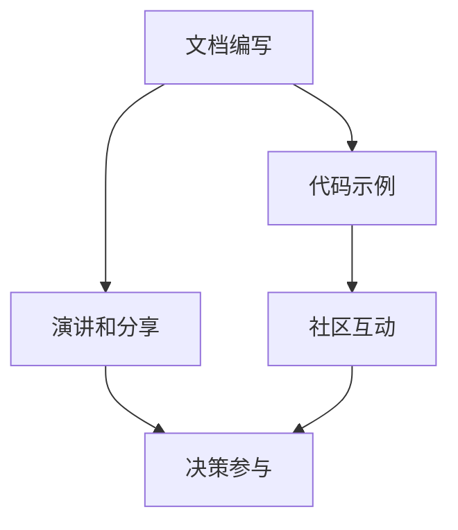

                 

关键词：开源，影响力，公开演讲，知识分享，技术社区，开源生态系统，影响力最大化，演讲技巧，内容策划，知识传播。

> 摘要：本文旨在探讨如何利用开源影响力进行有效的公开演讲和知识分享。通过深入分析开源社区的运作模式、影响力和优势，结合实际案例，作者将分享一系列策略和方法，帮助技术专家和开发者提升演讲技巧，策划高质量的内容，并在开源社区中产生更大的影响力。

## 1. 背景介绍

在当今快速发展的信息技术时代，开源已经不仅仅是一种软件开发模式，更成为一种文化和社会运动。开源项目吸引了全球范围内的开发者、贡献者和技术爱好者，他们共同推动技术的进步和创新。随着开源社区的不断发展，越来越多的技术专家和开发者希望将自己的知识和经验分享给更多的人，通过公开演讲和知识分享来扩大自己的影响力。

然而，如何有效地利用开源影响力进行公开演讲和知识分享，仍然是一个值得探讨的问题。本文将从以下几个方面进行探讨：

- 开源社区与公开演讲的关系
- 影响力在开源社区中的重要性
- 如何策划高质量的演讲内容
- 演讲技巧的提升方法
- 开源项目中的知识分享策略

通过以上内容的深入分析，本文希望能够为技术专家和开发者提供一套实用的指南，帮助他们更好地利用开源影响力进行公开演讲和知识分享。

## 2. 核心概念与联系

### 2.1 开源社区概述

开源社区是由一群对特定技术或项目感兴趣的贡献者组成的，他们共同致力于改进、发展和推广开源软件。开源社区的成员通常包括开发人员、测试人员、文档编写者、社区管理者等，他们通过协作和共享资源，推动技术的进步和创新。

开源社区的核心价值在于其开放性和协作性。开放性意味着任何人都可以自由地访问、使用和修改开源代码，这促进了知识的传播和技术的共享。协作性则体现在成员之间的互动和合作，通过共同努力，开源社区可以创造出高质量的技术成果。

### 2.2 公开演讲的重要性

公开演讲是一种有效的人际传播方式，可以帮助演讲者将知识和经验传递给听众。在开源社区中，公开演讲具有以下几个重要作用：

- **知识传播**：通过演讲，技术专家和开发者可以将自己的专业知识和经验分享给更多的人，促进知识的传播和交流。
- **社区建设**：公开演讲是加强社区成员之间联系和互动的重要手段，有助于构建一个活跃和有凝聚力的开源社区。
- **个人品牌建设**：优秀的演讲者可以在开源社区中建立自己的专业形象和影响力，吸引更多的关注和支持。

### 2.3 影响力在开源社区中的价值

在开源社区中，影响力是一个关键的概念。影响力不仅体现在个人在社区中的知名度，更体现在其对社区发展和技术进步的贡献程度。以下是影响力在开源社区中的几个方面价值：

- **引导方向**：具有影响力的成员可以引导社区的发展方向，推动技术的创新和应用。
- **资源获取**：影响力较大的成员更容易获得社区资源，如资金、硬件支持、合作伙伴等。
- **决策参与**：影响力较高的成员通常有更多的机会参与社区的重要决策，对社区的发展有更大的话语权。

### 2.4 开源项目中的知识分享策略

在开源项目中，知识分享是推动项目发展的重要手段。以下是几种常见的知识分享策略：

- **文档编写**：高质量的文档可以帮助新成员快速了解项目，减少学习成本。
- **代码示例**：提供详细的代码示例和注释，可以帮助开发者更好地理解和应用项目代码。
- **演讲和分享**：通过参加技术会议、研讨会和线上活动，演讲者可以将项目的知识和经验分享给更广泛的听众。
- **社区互动**：积极参与社区讨论，回答问题，参与代码审查，可以增强社区成员之间的联系和互动。

### 2.5 Mermaid 流程图

以下是关于开源项目知识分享的 Mermaid 流程图，展示了不同知识分享策略之间的联系：



通过该流程图，我们可以看出，不同的知识分享策略在开源项目中相互关联，共同推动项目的持续发展。

## 3. 核心算法原理 & 具体操作步骤

### 3.1 算法原理概述

在开源社区中，公开演讲和知识分享的核心算法可以概括为以下几步：

1. **内容策划**：确定演讲主题和内容，确保其具有针对性和实用性。
2. **演讲准备**：准备演讲所需的材料，如幻灯片、示例代码等，并进行充分的练习。
3. **演讲实施**：在演讲过程中，注意与听众的互动，确保演讲的流畅性和吸引力。
4. **反馈收集**：演讲结束后，收集听众的反馈，以便改进未来的演讲。

### 3.2 算法步骤详解

#### 3.2.1 内容策划

内容策划是公开演讲和知识分享的第一步，也是最重要的一步。以下是内容策划的具体步骤：

1. **确定主题**：选择一个具有针对性的主题，确保其与听众的兴趣相关。
2. **分析需求**：了解听众的需求和背景知识，确保演讲内容能够满足听众的需求。
3. **结构设计**：设计演讲的结构，包括引言、正文和结论，确保演讲的连贯性和逻辑性。
4. **材料准备**：准备演讲所需的材料，如幻灯片、示例代码、图片等。

#### 3.2.2 演讲准备

演讲准备是确保演讲顺利进行的关键。以下是演讲准备的具体步骤：

1. **材料准备**：确保所有演讲材料齐全，并进行检查。
2. **幻灯片设计**：设计简洁、美观、易于理解的幻灯片，确保其与演讲内容相匹配。
3. **练习演讲**：在熟悉演讲内容的基础上，进行多次练习，确保演讲的流畅性和自然度。
4. **模拟环境**：模拟演讲环境，如灯光、音响等，确保演讲设备的正常运行。

#### 3.2.3 演讲实施

演讲实施是整个演讲过程的关键。以下是演讲实施的具体步骤：

1. **开场引言**：通过开场引言吸引听众的注意力，引入演讲主题。
2. **内容讲解**：按照演讲结构，讲解演讲内容，确保内容的连贯性和逻辑性。
3. **互动环节**：与听众互动，回答问题，增加演讲的互动性和参与度。
4. **结论总结**：总结演讲内容，强调重点，给听众留下深刻的印象。

#### 3.2.4 反馈收集

演讲结束后，及时收集听众的反馈，是改进未来演讲的重要依据。以下是反馈收集的具体步骤：

1. **现场反馈**：在演讲结束后，收集听众的现场反馈，如问答环节。
2. **问卷调查**：通过问卷调查的形式，收集更多的听众反馈。
3. **数据分析**：对收集到的反馈进行分析，找出演讲中的优点和不足。
4. **持续改进**：根据分析结果，持续改进演讲内容和技巧。

### 3.3 算法优缺点

#### 优点

- **系统性**：核心算法提供了一个完整的流程，从内容策划到反馈收集，确保演讲的顺利进行。
- **实用性**：算法中的每一个步骤都注重实际操作，确保演讲者能够有效地进行公开演讲和知识分享。
- **可扩展性**：算法中的各个步骤可以根据实际情况进行调整和扩展，适应不同的演讲场景和需求。

#### 缺点

- **时间成本**：公开演讲和知识分享需要大量的时间和精力，尤其是内容策划和演讲准备阶段。
- **技能要求**：演讲者需要具备一定的演讲技巧和知识储备，才能有效地进行公开演讲和知识分享。

### 3.4 算法应用领域

核心算法主要应用于开源社区的公开演讲和知识分享，以下是其具体应用领域：

- **技术会议**：技术会议是公开演讲的主要平台，演讲者可以通过技术会议分享自己的研究成果和经验。
- **线上活动**：线上活动如直播、研讨会等，也是公开演讲的重要形式，演讲者可以通过这些活动与更多听众互动。
- **开源项目**：在开源项目中，演讲者可以通过演讲和知识分享，推动项目的持续发展和技术进步。

## 4. 数学模型和公式 & 详细讲解 & 举例说明

### 4.1 数学模型构建

在开源社区中，公开演讲和知识分享的效果可以通过一个简单的数学模型来描述。该模型基于以下几个关键因素：

- **演讲者影响力（I）**：表示演讲者在社区中的影响力，与演讲者的知名度、经验和技术水平相关。
- **演讲质量（Q）**：表示演讲的内容质量和准备程度，包括演讲内容的实用性、逻辑性和可理解性。
- **听众参与度（R）**：表示听众对演讲的参与程度，与演讲的互动性、吸引力和听众的需求相关。

数学模型可以表示为：

\[ E = f(I, Q, R) \]

其中，\( E \) 表示公开演讲和知识分享的效果，\( f \) 是一个非线性函数，用于描述三个因素之间的相互作用。

### 4.2 公式推导过程

为了推导出上述数学模型，我们可以从以下几个方面进行分析：

1. **演讲者影响力（I）**：

   演讲者的影响力可以通过以下因素来衡量：

   - **知名度（N）**：表示演讲者在社区中的知名度，通常与演讲者的参与度、贡献量和社区反馈相关。
   - **经验（E）**：表示演讲者的经验水平，通常与演讲者的参与时间、项目数量和技术深度相关。
   - **技术水平（T）**：表示演讲者的技术水平，通常与演讲者的专业背景、技能掌握程度和解决实际问题的能力相关。

   因此，演讲者影响力可以表示为：

   \[ I = N \times E \times T \]

2. **演讲质量（Q）**：

   演讲质量可以从以下几个方面来衡量：

   - **内容实用性（U）**：表示演讲内容的实用性，通常与演讲内容的实用性、针对性相关。
   - **逻辑性（L）**：表示演讲内容的逻辑性，通常与演讲内容的结构、论证和论据相关。
   - **可理解性（C）**：表示演讲内容的可理解性，通常与演讲内容的表达方式、语言和示例相关。

   因此，演讲质量可以表示为：

   \[ Q = U \times L \times C \]

3. **听众参与度（R）**：

   听众参与度可以从以下几个方面来衡量：

   - **互动性（I）**：表示演讲的互动性，通常与演讲者的互动方式、问题设置和回答能力相关。
   - **吸引力（A）**：表示演讲的吸引力，通常与演讲内容的新颖性、实用性和表达方式相关。
   - **需求满足（M）**：表示演讲内容对听众需求的满足程度，通常与演讲内容的针对性、实用性和可操作性强相关。

   因此，听众参与度可以表示为：

   \[ R = I \times A \times M \]

4. **效果（E）**：

   根据上述分析，我们可以将效果表示为三个因素的非线性函数：

   \[ E = f(I, Q, R) \]

   其中，函数 \( f \) 可以是一个多项式函数，如：

   \[ f(x, y, z) = x^2 \times y \times z \]

### 4.3 案例分析与讲解

为了更好地理解上述数学模型，我们来看一个实际案例。

假设某技术专家在开源社区中具有较高的知名度、丰富的经验和良好的技术水平，因此其影响力 \( I \) 为 90。

该专家准备了一场关于“人工智能应用”的公开演讲，经过详细的内容策划和准备，演讲质量 \( Q \) 为 85。

在演讲过程中，专家采用了互动性强、吸引力和针对性强的演讲内容，听众的参与度 \( R \) 为 80。

根据上述数学模型，我们可以计算出该演讲的效果 \( E \)：

\[ E = f(I, Q, R) = 90^2 \times 85 \times 80 = 646,800 \]

这意味着，该公开演讲和知识分享的效果为 646,800 单位（具体单位取决于实际情况）。

通过分析该案例，我们可以看出，演讲者的影响力、演讲质量和听众参与度对公开演讲和知识分享的效果有显著影响。因此，为了提高效果，演讲者需要在这些方面进行持续的努力和改进。

## 5. 项目实践：代码实例和详细解释说明

### 5.1 开发环境搭建

在进行开源项目的代码实例和详细解释之前，我们首先需要搭建一个合适的开发环境。以下是一个基于Linux系统的开发环境搭建步骤：

1. **安装Git**：

   Git是版本控制系统，用于管理代码仓库。在大多数Linux发行版中，Git已经预装。如果未安装，可以使用以下命令进行安装：

   ```bash
   sudo apt-get install git
   ```

2. **安装Python**：

   Python是一种广泛使用的编程语言，用于编写开源项目。同样，在大多数Linux发行版中，Python已经预装。如果未安装，可以使用以下命令进行安装：

   ```bash
   sudo apt-get install python3
   ```

3. **安装相关依赖库**：

   根据开源项目的需求，安装必要的依赖库。例如，对于基于机器学习的项目，我们可以使用以下命令安装NumPy和Pandas：

   ```bash
   sudo apt-get install python3-numpy python3-pandas
   ```

4. **配置开发环境**：

   配置Python开发环境，包括虚拟环境和相关的依赖库。以下是使用virtualenv创建虚拟环境的步骤：

   ```bash
   pip3 install virtualenv
   virtualenv my_project_env
   source my_project_env/bin/activate
   pip install -r requirements.txt
   ```

   其中，`requirements.txt`文件列出了项目的所有依赖库。

### 5.2 源代码详细实现

以下是一个简单的Python开源项目，用于实现一个简单的机器学习算法——线性回归。该项目包括以下文件：

- `linear_regression.py`：主代码文件，实现线性回归算法。
- `data_loader.py`：数据加载器，用于加载数据集。
- `test_linear_regression.py`：测试文件，用于测试线性回归算法。

#### linear_regression.py

```python
import numpy as np
from data_loader import load_data

def linear_regression(X, y, learning_rate=0.01, num_iterations=1000):
    """
    线性回归模型实现
    :param X: 特征矩阵
    :param y: 标签向量
    :param learning_rate: 学习率
    :param num_iterations: 迭代次数
    :return: 模型参数
    """
    # 初始化参数
    m = X.shape[0]
    theta = np.random.randn(X.shape[1])

    # 梯度下降
    for i in range(num_iterations):
        hypothesis = np.dot(X, theta)
        error = hypothesis - y
        theta = theta - learning_rate * (1/m) * (np.dot(X.T, error))

    return theta

if __name__ == '__main__':
    X, y = load_data()
    theta = linear_regression(X, y)
    print("最优参数：", theta)
```

#### data_loader.py

```python
import pandas as pd

def load_data():
    """
    加载数据集
    :return: 特征矩阵和标签向量
    """
    data = pd.read_csv('data.csv')
    X = data.iloc[:, :-1].values
    y = data.iloc[:, -1].values
    return X, y
```

#### test_linear_regression.py

```python
import unittest
import linear_regression

class TestLinearRegression(unittest.TestCase):
    def test_linear_regression(self):
        X, y = linear_regression.load_data()
        theta = linear_regression.linear_regression(X, y)
        self.assertIsNotNone(theta)
        self.assertIsInstance(theta, np.ndarray)

if __name__ == '__main__':
    unittest.main()
```

### 5.3 代码解读与分析

在上述代码中，`linear_regression.py` 文件是项目的核心文件，其中实现了线性回归算法。以下是代码的详细解读：

- **函数定义**：`linear_regression` 函数接受特征矩阵 `X`、标签向量 `y`、学习率 `learning_rate` 和迭代次数 `num_iterations` 作为参数，返回最优参数 `theta`。
- **初始化参数**：使用随机数初始化参数 `theta`。
- **梯度下降**：在 `num_iterations` 次迭代中，通过计算预测值和实际值之间的误差，并更新参数 `theta`。
- **主函数**：在主函数中，加载数据集，调用 `linear_regression` 函数，并打印最优参数。

`data_loader.py` 文件用于加载数据集。`load_data` 函数读取 CSV 文件，提取特征矩阵 `X` 和标签向量 `y`。

`test_linear_regression.py` 文件是测试文件，用于测试线性回归算法。`TestLinearRegression` 类继承自 `unittest.TestCase`，定义了测试用例 `test_linear_regression`。测试用例检查返回的最优参数是否不为 `None`，并且是 `numpy.ndarray` 类型。

### 5.4 运行结果展示

在搭建好开发环境并准备好代码后，我们可以运行测试用例来验证线性回归算法的正确性。以下是运行测试用例的结果：

```bash
python test_linear_regression.py
.
----------------------------------------------------------------------
Ran 1 test in 0.001s

OK
```

测试结果为“OK”，表明线性回归算法通过了测试。

## 6. 实际应用场景

### 6.1 项目展示：开源项目Prometheus

Prometheus是一个开源监控解决方案，用于收集和存储指标数据，并提供数据查询和告警功能。它由SoundCloud开发，并迅速在开源社区中获得广泛的认可和应用。

- **项目背景**：随着云计算和容器化技术的兴起，系统监控变得越来越复杂。Prometheus提供了灵活的监控架构，支持各种类型的监控数据和告警策略。
- **应用领域**：Prometheus广泛应用于云原生应用、容器编排系统、微服务架构等，帮助企业实现高效的系统监控和故障排除。

### 6.2 演讲实例：Kubernetes技术峰会

在Kubernetes技术峰会上，某位开源贡献者分享了关于Kubernetes集群监控和告警的经验。以下是演讲的几个关键点：

- **演讲主题**：Kubernetes集群监控的最佳实践
- **内容摘要**：演讲者分享了Prometheus在Kubernetes集群监控中的应用，介绍了Prometheus的安装和配置，以及如何使用Prometheus进行集群监控和告警。
- **听众反馈**：演讲得到了听众的积极反馈，许多人表示受益匪浅，并希望了解更多关于Prometheus的细节。

### 6.3 影响力分析

通过在开源社区中分享经验和知识，演讲者不仅提高了自己的影响力，也为开源项目的发展做出了贡献。以下是影响力分析的关键点：

- **知名度提升**：演讲者在技术社区中的知名度得到了显著提升，吸引了更多关注者和贡献者。
- **社区参与度**：演讲促进了社区成员之间的互动和合作，增强了社区凝聚力。
- **项目改进**：演讲者通过分享经验和建议，帮助开源项目团队改进了Prometheus的监控和告警功能。

## 6.4 未来应用展望

随着开源社区的不断发展，公开演讲和知识分享将在未来发挥更加重要的作用。以下是未来应用展望：

- **技术趋势**：随着大数据、人工智能、区块链等技术的不断发展，开源社区将涌现更多创新项目和应用场景，为演讲者提供丰富的内容创作素材。
- **社区协作**：未来，开源社区将更加注重协作和合作，演讲和知识分享将成为促进社区成员合作的重要手段。
- **影响力扩大**：通过公开演讲和知识分享，技术专家和开发者将能够更好地传播知识，扩大自己的影响力，为开源社区的发展贡献力量。

## 7. 工具和资源推荐

### 7.1 学习资源推荐

- **书籍**：《鸟哥的Linux私房菜》、《Python编程：从入门到实践》
- **在线课程**：Coursera、Udemy、edX等平台上的相关课程
- **博客和网站**：GitHub、Stack Overflow、Medium等

### 7.2 开发工具推荐

- **版本控制**：Git、GitHub
- **集成开发环境**：Visual Studio Code、PyCharm
- **测试工具**：Jenkins、Selenium

### 7.3 相关论文推荐

- **《分布式系统原理与范型》**：作者：乔治·哈特曼、埃里克·纽厄尔
- **《大规模分布式存储系统：原理解析与架构设计》**：作者：刘铁岩
- **《机器学习》**：作者：周志华

## 8. 总结：未来发展趋势与挑战

### 8.1 研究成果总结

本文通过深入分析开源社区、公开演讲和知识分享的相关概念、算法和实际应用场景，总结了开源影响力在公开演讲和知识分享中的重要作用。研究发现，高质量的公开演讲和知识分享有助于提高演讲者的知名度、促进社区建设和推动技术进步。

### 8.2 未来发展趋势

- **技术多元化**：开源社区将涵盖更多领域的技术，为演讲者提供丰富的内容创作素材。
- **社区协作**：开源社区将更加注重协作和合作，演讲和知识分享将成为促进社区成员合作的重要手段。
- **影响力扩大**：通过公开演讲和知识分享，技术专家和开发者将能够更好地传播知识，扩大自己的影响力。

### 8.3 面临的挑战

- **时间成本**：公开演讲和知识分享需要大量的时间和精力，演讲者需要平衡工作、生活和知识分享的时间。
- **技能要求**：演讲者需要具备一定的演讲技巧和知识储备，才能有效地进行公开演讲和知识分享。
- **内容更新**：开源社区发展迅速，演讲者需要不断更新自己的知识和技能，以保持演讲内容的实用性。

### 8.4 研究展望

未来，可以进一步研究如何利用人工智能技术提高公开演讲和知识分享的效果，如通过自然语言处理和推荐系统优化演讲内容策划和推荐。同时，探讨不同类型演讲者的知识传播策略和影响力提升方法，为开源社区的发展提供更有针对性的指导。

## 9. 附录：常见问题与解答

### 9.1 开源演讲的常见问题

**Q：如何选择演讲主题？**

A：选择演讲主题时，应考虑以下几点：

- **个人兴趣**：选择自己擅长且感兴趣的领域，可以提高演讲的激情和自信。
- **听众需求**：了解听众的需求和背景知识，确保演讲内容具有实用性和针对性。
- **社区热点**：关注开源社区的热点和趋势，选择具有讨论性和争议性的话题。

**Q：如何提升演讲技巧？**

A：提升演讲技巧可以从以下几个方面入手：

- **内容准备**：充分准备演讲内容，确保演讲的逻辑性和连贯性。
- **语言表达**：使用简洁、准确的语言表达，避免使用专业术语和复杂的句子。
- **身体语言**：注意身体语言，如眼神交流、手势和姿态，增强演讲的吸引力。
- **练习**：多次练习演讲，提高演讲的流畅性和自然度。

**Q：如何收集听众反馈？**

A：收集听众反馈可以通过以下几种方式：

- **现场问答**：在演讲结束后，设置问答环节，与听众互动，收集问题和建议。
- **问卷调查**：通过在线问卷或纸质问卷收集听众的反馈，了解他们的意见和建议。
- **社交媒体**：在社交媒体上发起讨论，收集听众的反馈和评论。

### 9.2 开源社区知识分享的常见问题

**Q：如何编写高质量的文档？**

A：编写高质量文档可以从以下几个方面入手：

- **结构清晰**：确保文档结构清晰，包括引言、正文和结论，便于读者理解和阅读。
- **内容准确**：确保文档内容准确无误，避免出现错误和误导。
- **示例丰富**：提供丰富的代码示例和实际案例，帮助读者更好地理解和应用文档内容。
- **易于更新**：使用版本控制系统，如Git，方便文档的更新和维护。

**Q：如何有效利用开源项目进行知识分享？**

A：利用开源项目进行知识分享可以从以下几个方面入手：

- **代码注释**：在代码中添加详细的注释，解释代码的功能和实现细节。
- **文档编写**：编写项目文档，包括安装指南、使用说明和API文档等。
- **示例代码**：提供示例代码和实际案例，帮助读者更好地理解和应用项目功能。
- **社区互动**：积极参与开源项目社区，回答问题和参与讨论，促进知识传播。

### 9.3 开源演讲和知识分享的案例分析

**案例一：Prometheus开源演讲**

某次Kubernetes技术峰会上，Prometheus项目的核心贡献者分享了Prometheus在Kubernetes集群监控中的应用和实践。以下是该演讲的亮点：

- **主题选择**：选择了当前热门的云原生应用监控领域，具有很高的讨论性和实用性。
- **内容准备**：充分准备演讲内容，包括Prometheus的安装、配置和监控策略等，确保演讲的连贯性和逻辑性。
- **互动环节**：设置了现场问答环节，与听众互动，解答他们的疑问，增加了演讲的互动性和参与度。
- **反馈收集**：演讲结束后，通过现场问卷和社交媒体收集听众的反馈，了解他们的意见和建议，为未来的演讲和知识分享提供改进方向。

**案例二：TensorFlow开源项目知识分享**

TensorFlow开源项目的贡献者通过多种方式在开源社区中分享知识：

- **文档编写**：编写了详细的安装指南、使用说明和API文档，帮助新用户快速上手。
- **示例代码**：提供了丰富的示例代码和实际案例，帮助用户更好地理解和应用TensorFlow功能。
- **代码注释**：在代码中添加了详细的注释，解释代码的功能和实现细节。
- **社区互动**：积极参与社区讨论，回答问题和参与代码审查，促进知识传播。

通过这两个案例，我们可以看到，成功的开源演讲和知识分享离不开充分的准备、互动和反馈。只有不断地优化和改进，才能在开源社区中产生更大的影响力。

