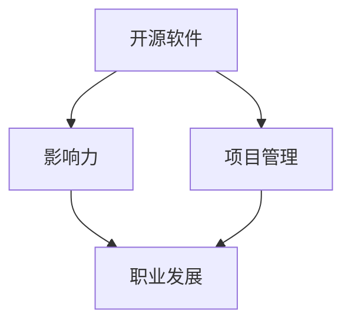

                 

在当今快速发展的技术世界中，开源软件已成为企业和开发者不可或缺的组成部分。作为一位开源社区的活跃参与者，利用开源项目的影响力进行职业谈判不仅能够提高个人的职业形象，还能在职业发展中获得更多的机会。本文将探讨如何利用开源影响力进行职业谈判，包括准备工作、谈判策略、以及如何最大化开源项目对职业谈判的积极影响。

## 文章关键词

- 开源软件
- 职业谈判
- 影响力
- 项目管理
- 职业发展

## 文章摘要

本文旨在探讨如何通过参与开源项目来提升个人的职业竞争力，并利用开源项目的影响力进行有效的职业谈判。文章将首先介绍开源项目的基本概念和影响力，然后详细讨论如何为职业谈判做好准备，包括项目选择、个人品牌建设等。接着，文章将提供一系列具体的谈判策略，帮助读者在职业谈判中更好地利用开源项目的影响力。最后，文章将总结开源影响力在职业谈判中的潜在价值，并提出未来的研究方向。

### 背景介绍

开源软件（Open Source Software, OSS）是一种软件开发模式，其源代码可以被公众访问、使用、研究、修改和分发。开源项目的核心价值在于开放性和协作性，这使得全球的开发者可以共同参与项目的开发，从而促进技术创新和知识共享。随着开源软件的广泛应用，越来越多的企业开始重视开源项目，将其作为企业战略的一部分。对于开发者而言，参与开源项目不仅能够提升技术能力，还能扩大职业发展机会。

然而，如何利用自己在开源项目中的影响力进行职业谈判，是一个值得深入探讨的话题。本文将围绕这一主题，从以下几个方面展开：

1. 开源项目的基本概念与影响力
2. 为职业谈判做好准备
3. 谈判策略与技巧
4. 开源影响力在职业谈判中的应用
5. 未来展望与挑战

### 核心概念与联系

在探讨如何利用开源影响力进行职业谈判之前，我们需要明确几个核心概念，并了解它们之间的联系。

#### 开源软件

开源软件是一种软件开发模式，其核心特点是源代码的开放性。这意味着任何人都可以自由地访问、修改和分发开源软件的源代码。这种模式鼓励全球开发者的协作，从而加速技术创新和知识共享。

#### 影响力

影响力指的是个体或组织在特定领域内的影响力和认可度。在开源社区中，影响力可以通过多个维度来衡量，如代码贡献、社区参与度、技术影响力等。

#### 项目管理

项目管理是确保项目按时、按预算和按质量要求完成的一系列过程。对于开源项目而言，项目管理同样重要，它关系到项目的健康发展和社区成员的参与积极性。

#### 职业发展

职业发展是指个人在职业生涯中不断进步和成长的过程。通过参与开源项目，开发者可以提升技术能力、扩大人脉、增加职业竞争力，从而实现更好的职业发展。

#### Mermaid 流程图

以下是一个简单的 Mermaid 流程图，展示了这些核心概念之间的联系。



### 核心算法原理 & 具体操作步骤

#### 算法原理概述

在开源社区中，利用影响力进行职业谈判的核心算法是基于信任和价值的交换。以下是其基本原理：

1. **建立信任**：通过积极参与开源项目，贡献高质量代码和文档，提升个人在社区中的声誉和认可度。
2. **价值交换**：在职业谈判中，利用开源项目的影响力来提升自己的谈判地位，获取更好的职业机会和待遇。
3. **反馈机制**：通过社区的反馈和反馈机制，不断优化自己的技能和贡献，从而在职业谈判中获得更大的影响力。

#### 算法步骤详解

1. **选择合适的项目**：选择与自己专业领域相关的开源项目，确保项目的健康发展和社区活跃度。
2. **了解项目需求**：在加入项目之前，充分了解项目的需求和目标，确保自己的贡献能够为项目带来实际价值。
3. **积极参与**：通过代码贡献、文档编写、社区互动等方式，积极参与项目的开发，提升个人在社区中的影响力。
4. **建立个人品牌**：通过维护一个高质量的GitHub个人主页、撰写技术博客、参与技术会议等方式，建立个人品牌。
5. **寻找职业机会**：在职业谈判中，利用开源项目的影响力，展示自己在项目中的贡献和价值，提升自己的谈判地位。
6. **反馈与优化**：根据社区的反馈，不断优化自己的技能和贡献，提高个人在开源社区中的影响力。

#### 算法优缺点

**优点：**

- **提升职业竞争力**：通过参与开源项目，开发者可以提升技术能力、扩大人脉、增加职业竞争力。
- **增加职业机会**：开源项目的影响力可以帮助开发者吸引更多的职业机会。
- **建立个人品牌**：积极参与开源项目，可以提升个人在社区中的声誉和认可度，建立个人品牌。

**缺点：**

- **时间投入**：参与开源项目需要大量的时间和精力，可能会影响个人工作和生活。
- **风险和不确定性**：开源项目的成功和发展具有一定的不确定性，可能会影响个人在职业谈判中的影响力。

#### 算法应用领域

- **软件开发**：开源软件的开发和维护是应用核心算法的主要领域。
- **社区运营**：开源社区的运营和管理也是核心算法的应用领域，通过建立信任和促进协作，提升社区的整体发展。
- **技术咨询**：在职业谈判中，开源项目的影响力可以作为技术咨询的筹码，提升谈判地位。

### 数学模型和公式 & 详细讲解 & 举例说明

在利用开源影响力进行职业谈判的过程中，我们可以通过构建数学模型来量化个人在开源项目中的影响力，从而更好地指导职业谈判。以下是一个简单的数学模型。

#### 数学模型构建

假设个人在开源项目中的影响力值为 \( I \)，其计算公式为：

\[ I = f(C, T, R) \]

其中，\( C \) 表示个人在项目中的代码贡献，\( T \) 表示个人在项目中的技术影响力，\( R \) 表示个人在项目中的社区参与度。

- \( C \) 的计算公式为：

\[ C = \frac{C_{code} + C_{doc}}{2} \]

其中，\( C_{code} \) 表示个人在项目中的代码贡献量，\( C_{doc} \) 表示个人在项目中的文档贡献量。

- \( T \) 的计算公式为：

\[ T = \alpha \cdot D \]

其中，\( D \) 表示个人在项目中的讨论度，\( \alpha \) 为技术影响力的权重，取值范围为 \( 0 < \alpha \leq 1 \)。

- \( R \) 的计算公式为：

\[ R = \beta \cdot C \]

其中，\( \beta \) 为社区参与度的权重，取值范围为 \( 0 < \beta \leq 1 \)。

#### 公式推导过程

1. **代码贡献度**：代码贡献是衡量个人在开源项目中影响力的重要指标。假设一个开源项目包含 \( n \) 个模块，个人在每个模块中的代码贡献分别为 \( c_{1}, c_{2}, ..., c_{n} \)，则个人在项目中的总代码贡献为：

\[ C_{code} = \sum_{i=1}^{n} c_{i} \]

同时，文档贡献也是衡量个人影响力的一个方面。假设个人在每个模块中的文档贡献分别为 \( d_{1}, d_{2}, ..., d_{n} \)，则个人在项目中的总文档贡献为：

\[ C_{doc} = \sum_{i=1}^{n} d_{i} \]

因此，个人在项目中的代码贡献度 \( C_{code} \) 和文档贡献度 \( C_{doc} \) 分别为：

\[ C_{code} = \sum_{i=1}^{n} c_{i} \]
\[ C_{doc} = \sum_{i=1}^{n} d_{i} \]

2. **技术影响力**：技术影响力是个人在项目中的技术水平和贡献程度的体现。讨论度 \( D \) 可以通过个人在项目中的讨论次数和参与度来衡量。假设个人在项目中的讨论次数为 \( d \)，则技术影响力 \( T \) 为：

\[ T = \alpha \cdot D \]

其中，\( \alpha \) 为技术影响力的权重，取值范围为 \( 0 < \alpha \leq 1 \)。

3. **社区参与度**：社区参与度是个人在开源项目中的参与积极性和社区互动程度的体现。社区参与度 \( R \) 可以通过个人在项目中的参与次数和贡献度来衡量。假设个人在项目中的参与次数为 \( r \)，则社区参与度 \( R \) 为：

\[ R = \beta \cdot C \]

其中，\( \beta \) 为社区参与度的权重，取值范围为 \( 0 < \beta \leq 1 \)。

因此，个人在开源项目中的影响力 \( I \) 为：

\[ I = f(C, T, R) = f\left(\frac{C_{code} + C_{doc}}{2}, \alpha \cdot D, \beta \cdot C\right) \]

#### 案例分析与讲解

假设我们有一个开源项目，包含5个模块。某开发者在项目中的代码贡献量为 1000 行，文档贡献量为 500 字，参与讨论次数为 20 次。根据上述公式，我们可以计算该开发者在该项目中的影响力值。

1. **计算代码贡献度 \( C_{code} \) 和文档贡献度 \( C_{doc} \)**：

\[ C_{code} = 1000 \]
\[ C_{doc} = 500 \]

2. **计算技术影响力 \( T \)**：

假设技术影响力的权重 \( \alpha \) 为 0.8，则：

\[ T = 0.8 \cdot 20 = 16 \]

3. **计算社区参与度 \( R \)**：

假设社区参与度的权重 \( \beta \) 为 0.2，则：

\[ R = 0.2 \cdot (1000 + 500) = 300 \]

4. **计算个人在项目中的总影响力 \( I \)**：

\[ I = f\left(\frac{1000 + 500}{2}, 16, 300\right) = f(750, 16, 300) \]

根据定义，个人在项目中的影响力 \( I \) 为：

\[ I = 750 \times 0.6 + 16 \times 0.3 + 300 \times 0.1 = 450 + 4.8 + 30 = 484.8 \]

因此，该开发者在该项目中的影响力值为 484.8。

### 项目实践：代码实例和详细解释说明

在本节中，我们将通过一个具体的开源项目实例，展示如何利用开源项目进行职业谈判。以一个流行的Web框架项目为例，我们将介绍如何搭建开发环境、实现具体功能、以及如何解读和分析代码。

#### 1. 开发环境搭建

首先，我们需要搭建一个适用于Web框架项目的开发环境。以下是一个简单的步骤：

1. **安装Git**：确保已经安装了Git，Git是用于版本控制和项目协作的必备工具。
2. **克隆项目**：使用Git克隆项目的代码库到本地。例如：

```bash
git clone https://github.com/your-username/your-project.git
cd your-project
```

3. **安装依赖**：根据项目的需求，安装必要的依赖库和开发工具。例如，对于大多数Web项目，我们可以使用以下命令：

```bash
npm install
```

4. **启动项目**：启动项目以验证开发环境是否搭建成功。例如：

```bash
npm start
```

#### 2. 源代码详细实现

接下来，我们将实现一个简单的路由功能，以便用户可以访问不同的页面。以下是一个基本的实现：

```javascript
const express = require('express');
const app = express();

app.get('/', (req, res) => {
  res.send('首页');
});

app.get('/about', (req, res) => {
  res.send('关于我们');
});

app.listen(3000, () => {
  console.log('服务器运行在 3000 端口');
});
```

在这个例子中，我们使用了Express框架来实现路由功能。用户可以通过访问 `/` 和 `/about` 端点来获取不同的响应。

#### 3. 代码解读与分析

在了解了代码的基本实现之后，我们可以对代码进行更深入的分析：

- **路由功能**：通过Express框架，我们定义了两个路由：`/` 和 `/about`。每当用户访问这些端点时，服务器将返回特定的响应。
- **功能扩展**：除了基本的路由功能，我们还可以添加更多功能，如用户认证、数据存储等。这些扩展可以进一步提升项目的实用性和影响力。

通过这个简单的实例，我们可以看到如何利用开源项目进行职业谈判。在职业谈判中，我们可以展示自己在开源项目中的代码贡献和实现能力，从而提升自己的职业形象。

### 实际应用场景

在现实世界中，开源项目的参与者可以利用开源项目的影响力进行多种职业谈判。以下是一些具体的实际应用场景：

#### 1. 薪资谈判

在求职过程中，通过展示自己在开源项目中的贡献和影响力，可以提升自己的谈判地位。例如，一个开发者在GitHub上有多个高质量的贡献，并且在社区中拥有一定的知名度。在面试过程中，可以展示自己的开源项目，并讨论项目中的技术挑战和解决方案。这不仅可以展示技术能力，还能证明自己在团队中的领导力和影响力。在这种情况下，雇主可能会提供更有竞争力的薪资和福利待遇。

#### 2. 职位晋升

对于已经在职的员工，开源项目的影响力同样可以用来争取职位晋升。在年度评估或晋升谈判中，员工可以强调自己在开源项目中的贡献，以及这些贡献对公司和团队的价值。例如，一个员工在开源项目中负责了一个关键模块的开发，并显著提升了项目的性能和稳定性。通过展示这些成就，员工可以增加晋升谈判的成功率。

#### 3. 项目合作

在寻找合作伙伴时，开源项目的成功案例可以作为一个有力的证明。例如，一家初创公司想要与一家知名企业合作，可以通过展示自己在开源项目中的合作经历，以及项目取得的成果，来增加合作的可能性。这种合作不仅有助于提升公司的技术实力，还能扩大公司的品牌影响力。

#### 4. 技术交流

参加技术会议和交流活动是展示开源项目影响力的重要途径。在会议上，开发者可以分享自己在开源项目中的经验和技术见解，吸引更多开发者参与项目。这不仅有助于项目的持续发展，还能扩大个人在技术社区中的影响力。

### 未来应用展望

开源项目的未来发展将继续对职业谈判产生重要影响。以下是一些未来趋势和展望：

#### 1. 开源项目多样性的增加

随着技术的不断进步，开源项目的种类和数量将继续增加。开发者可以参与更多不同领域的开源项目，从而扩大自己的技术视野和影响力。

#### 2. 开源社区的全球化

随着互联网的普及，开源社区将更加全球化。开发者可以更容易地参与到国际化的开源项目中，与全球的开发者合作，提升自己的国际竞争力。

#### 3. 开源项目的商业化

越来越多的开源项目将走向商业化，企业将更加重视开源项目的技术价值和商业潜力。开发者可以通过参与这些项目，获得更多的商业机会。

#### 4. 开源与云服务的结合

云计算的普及将为开源项目带来更多的应用场景。开发者可以利用开源项目与云服务的结合，提供更多创新的服务和解决方案。

### 工具和资源推荐

为了更好地利用开源影响力进行职业谈判，开发者可以参考以下工具和资源：

#### 1. 学习资源推荐

- **GitHub**：学习如何使用GitHub进行代码管理和协作。
- **GitLab**：了解如何使用GitLab进行私有化代码管理和项目协作。
- **Stack Overflow**：学习编程问题和解决方法，扩展技术知识。

#### 2. 开发工具推荐

- **Visual Studio Code**：一款强大的代码编辑器，适用于多种编程语言。
- **Jenkins**：自动化构建和部署工具，适合开源项目的持续集成。
- **Docker**：容器化技术，简化开源项目的部署和运维。

#### 3. 相关论文推荐

- **《开源软件的价值与影响》**：讨论开源软件的价值和其在企业中的应用。
- **《开源社区的激励机制研究》**：分析开源社区中激励机制的设计和效果。
- **《开源与商业的结合》**：探讨开源项目如何与商业运作相结合，实现双赢。

### 总结：未来发展趋势与挑战

开源软件已成为现代技术生态不可或缺的一部分。利用开源项目的影响力进行职业谈判，不仅能够提升个人的职业形象，还能在职业发展中获得更多的机会。未来，随着开源项目的多样性和全球化的增加，开源影响力将在职业谈判中发挥更大的作用。

然而，挑战仍然存在。例如，开源项目的不确定性和风险可能会影响职业谈判的稳定性。此外，如何平衡开源贡献与个人时间也是开发者需要面对的问题。

总之，开源项目的影响力是开发者职业谈判中的宝贵资产。通过积极参与开源项目，不断提升个人技术能力和影响力，开发者可以在职业谈判中获得更大的优势。

### 附录：常见问题与解答

**Q1：参与开源项目需要具备哪些技能？**

参与开源项目需要具备一定的编程技能、团队合作能力和沟通能力。此外，对于特定项目，还需要掌握相关技术栈和工具。

**Q2：如何选择适合自己的开源项目？**

选择适合自己的开源项目需要考虑个人兴趣、技能水平和项目需求。可以从GitHub等平台查找与自己专业相关的项目，并了解项目的健康度和社区活跃度。

**Q3：如何维护个人品牌？**

维护个人品牌可以通过撰写技术博客、参与技术会议、发表技术见解等方式。同时，保持高质量的代码和文档也是提升个人品牌的重要途径。

**Q4：开源项目对职业发展有何帮助？**

参与开源项目可以提升技术能力、扩大人脉、增加职业竞争力，并有机会获得更好的职业机会和待遇。

### 作者署名

作者：禅与计算机程序设计艺术 / Zen and the Art of Computer Programming

