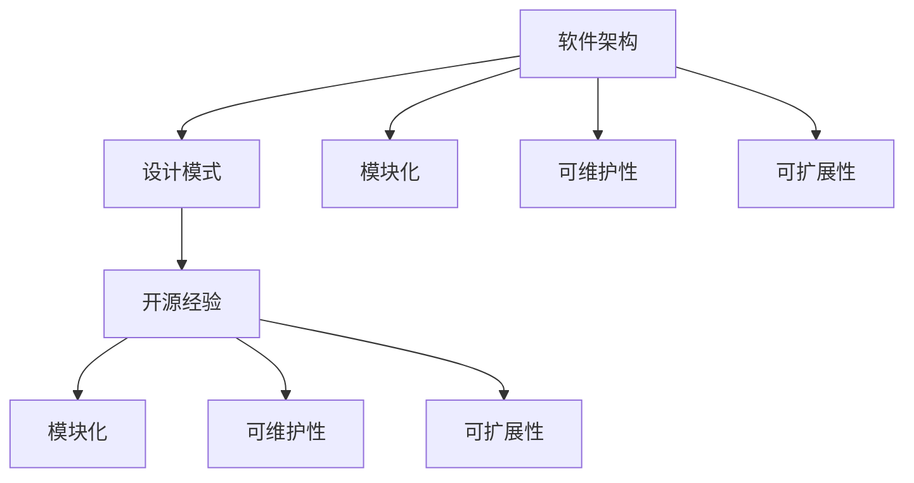

                 

关键词：技术架构咨询、开源经验、软件开发、系统设计、最佳实践

> 摘要：本文旨在通过分享丰富的开源经验，为技术团队提供一套完整的技术架构咨询服务。文章将详细探讨开源经验在技术架构中的重要性，介绍核心概念和联系，分析算法原理及操作步骤，解析数学模型和公式，提供项目实践实例，探讨实际应用场景，并展望未来发展趋势和挑战。

## 1. 背景介绍

在现代软件工程中，技术架构咨询扮演着至关重要的角色。随着软件系统日益复杂，企业对技术架构的要求也越来越高。技术架构不仅影响着系统的性能、可维护性和可扩展性，还直接关系到项目的成功与否。然而，构建一个高效、可靠的技术架构并非易事，它需要丰富的经验、深厚的专业知识和对新兴技术的敏锐洞察力。

开源经验在这种背景下显得尤为重要。开源项目不仅提供了丰富的技术资源和实践经验，还促进了技术的透明化和协作。通过学习开源项目，技术团队可以快速获取最佳实践，借鉴成功的架构设计，避免重复造轮子，从而提高开发效率和系统质量。

本文将围绕如何利用开源经验提供技术架构咨询，从核心概念、算法原理、数学模型到项目实践，全面探讨技术架构的各个方面，以期为读者提供有价值的指导和建议。

## 2. 核心概念与联系

在开始深入探讨技术架构咨询之前，我们需要明确一些核心概念，并理解它们之间的联系。

### 2.1 软件架构

软件架构是软件开发过程中的核心，它定义了系统的整体结构和设计原则。一个良好的软件架构应具备以下特点：

- **模块化**：将系统划分为多个模块，每个模块负责特定的功能。
- **可维护性**：系统应易于维护和更新，减少故障和风险。
- **可扩展性**：系统应能够灵活扩展，以适应未来的需求变化。

### 2.2 设计模式

设计模式是解决常见设计问题的通用解决方案。它们提供了可复用的设计方案，有助于提高代码的可读性和可维护性。常见的设计模式包括：

- **单例模式**：确保一个类只有一个实例，并提供一个全局访问点。
- **工厂模式**：创建对象，但不暴露创建逻辑，用户只需指定创建对象所需的参数。
- **观察者模式**：当一个对象的状态发生变化时，自动通知其他相关对象。

### 2.3 开源经验

开源经验是通过参与开源项目积累的知识和经验。这些经验包括：

- **最佳实践**：开源社区通常遵循最佳实践，如代码规范、测试和文档。
- **代码质量**：开源项目的代码通常经过严格的审查，质量较高。
- **协作经验**：开源项目强调团队合作和开放交流，有助于提升团队协作能力。

### 2.4 Mermaid 流程图

为了更好地展示核心概念之间的联系，我们使用 Mermaid 流程图来表示。



通过上述核心概念和联系，我们可以更清晰地理解技术架构咨询的背景和重要性。接下来，我们将深入探讨算法原理和操作步骤，以进一步丰富我们的技术架构知识。

## 3. 核心算法原理 & 具体操作步骤

### 3.1 算法原理概述

在技术架构咨询中，核心算法原理是构建高效、可靠系统的基础。以下是一些常用的算法原理和其基本概念：

#### 3.1.1 算法效率

算法效率是指算法在处理数据时所需的时间资源和空间资源。常见算法效率评价指标包括时间复杂度和空间复杂度。

- **时间复杂度**：衡量算法执行时间的增长速度，通常表示为 \(O(n)\)、\(O(n\log n)\) 等。
- **空间复杂度**：衡量算法所需内存空间的增长速度，通常表示为 \(O(1)\)、\(O(n)\) 等。

#### 3.1.2 数据结构

数据结构是算法的基础，决定了算法的处理效率和数据访问速度。常见的数据结构包括：

- **数组**：基于连续内存地址的线性结构，支持随机访问。
- **链表**：基于节点链接的线性结构，支持顺序访问。
- **栈**：后进先出（LIFO）的数据结构。
- **队列**：先进先出（FIFO）的数据结构。
- **树**：由节点和边组成，具有层次关系，如二叉树、平衡树等。
- **图**：由节点和边组成，具有复杂的关系，如图遍历、最短路径等。

#### 3.1.3 算法优化

算法优化是指通过改进算法的设计和实现，提高算法的效率和性能。常见的优化方法包括：

- **动态规划**：通过将复杂问题分解为子问题，并保存已解决的子问题的结果，避免重复计算。
- **分治策略**：将大问题分解为小问题，独立解决小问题，再合并解决结果。
- **贪心算法**：通过每次选择局部最优解，期望最终得到全局最优解。

### 3.2 算法步骤详解

以下是一个简单的排序算法——快速排序（Quick Sort）的具体步骤：

#### 3.2.1 快速排序基本步骤

1. **选择基准**：从数组中选择一个元素作为基准（pivot）。
2. **分区操作**：将数组分为两部分，一部分比基准小，另一部分比基准大。
3. **递归排序**：递归地对分区后的两部分进行快速排序。

#### 3.2.2 快速排序伪代码

```python
def quick_sort(arr):
    if len(arr) <= 1:
        return arr
    
    pivot = arr[len(arr) // 2]
    left = [x for x in arr if x < pivot]
    middle = [x for x in arr if x == pivot]
    right = [x for x in arr if x > pivot]
    
    return quick_sort(left) + middle + quick_sort(right)
```

### 3.3 算法优缺点

#### 优点

- **高效**：平均时间复杂度为 \(O(n\log n)\)。
- **原地排序**：不需要额外空间，空间复杂度为 \(O(1)\)。
- **适用范围广**：适用于大部分数据类型的排序。

#### 缺点

- **最坏情况**：最坏时间复杂度为 \(O(n^2)\)，当输入数组已经有序或部分有序时。
- **稳定性**：快速排序不是稳定的排序算法，相同值的元素可能被交换位置。

### 3.4 算法应用领域

快速排序广泛应用于各种领域，如数据库排序、搜索引擎索引构建、算法竞赛等。其高效性和灵活性使其成为排序算法的首选。

通过以上对算法原理和步骤的详细探讨，我们可以更好地理解和应用这些算法，为技术架构咨询提供坚实的基础。

## 4. 数学模型和公式 & 详细讲解 & 举例说明

在技术架构咨询中，数学模型和公式是理解和分析系统性能、稳定性和效率的重要工具。以下将详细讲解数学模型和公式的构建、推导过程，并通过具体案例进行分析。

### 4.1 数学模型构建

数学模型是通过对实际问题进行简化和抽象，用数学语言描述问题的一种方法。构建数学模型通常包括以下步骤：

1. **定义变量**：根据问题需求，定义相关的变量和参数。
2. **建立方程**：根据变量之间的关系，建立数学方程或方程组。
3. **简化模型**：对模型进行简化和假设，使其更加易于分析和求解。
4. **验证模型**：通过实际数据和模拟结果验证模型的准确性和适用性。

### 4.2 公式推导过程

以下是一个简单的数学模型——线性回归模型的构建和公式推导。

#### 4.2.1 线性回归模型

线性回归模型用于分析两个变量之间的线性关系。其数学模型可以表示为：

\[ y = ax + b \]

其中，\( y \) 是因变量，\( x \) 是自变量，\( a \) 和 \( b \) 是模型的参数。

#### 4.2.2 公式推导

为了求解参数 \( a \) 和 \( b \)，我们通常采用最小二乘法。最小二乘法的目标是最小化预测值与实际值之间的误差平方和。具体推导过程如下：

1. **误差计算**：计算预测值和实际值之间的误差：

\[ \text{误差} = (ax + b - y)^2 \]

2. **目标函数**：将所有误差加总，得到目标函数：

\[ \Phi(a, b) = \sum_{i=1}^{n} (ax_i + b - y_i)^2 \]

3. **求导并令导数为零**：对目标函数分别对 \( a \) 和 \( b \) 求导，并令导数为零，得到：

\[ \frac{\partial \Phi}{\partial a} = 2nax + 2b - 2\sum y_i = 0 \]
\[ \frac{\partial \Phi}{\partial b} = 2ax + 2n - 2x\sum y_i = 0 \]

4. **解方程组**：解上述方程组，得到参数 \( a \) 和 \( b \) 的值：

\[ a = \frac{\sum x_i y_i - n \bar{x} \bar{y}}{\sum x_i^2 - n \bar{x}^2} \]
\[ b = \bar{y} - a \bar{x} \]

其中，\( \bar{x} \) 和 \( \bar{y} \) 分别是 \( x \) 和 \( y \) 的均值。

### 4.3 案例分析与讲解

以下是一个线性回归模型的实际应用案例。

#### 4.3.1 案例背景

假设我们要分析某个城市的降雨量（\( y \)）与气温（\( x \)）之间的线性关系。

#### 4.3.2 数据准备

收集某城市一年内的每日降雨量和最高气温数据，如下表：

| 日期 | 气温 (°C) | 降雨量 (mm) |
| ---- | ---------- | ---------- |
| 1    | 25         | 10         |
| 2    | 27         | 15         |
| 3    | 23         | 8          |
| ...  | ...        | ...        |
| 365  | 20         | 5          |

#### 4.3.3 模型构建

根据上述数据，我们构建线性回归模型，并求解参数 \( a \) 和 \( b \)。

1. **计算均值**：

\[ \bar{x} = \frac{\sum x_i}{n} = \frac{25 + 27 + 23 + ... + 20}{365} \approx 24.3 \]
\[ \bar{y} = \frac{\sum y_i}{n} = \frac{10 + 15 + 8 + ... + 5}{365} \approx 9.2 \]

2. **计算误差平方和**：

\[ \sum x_i y_i = 25 \times 10 + 27 \times 15 + 23 \times 8 + ... + 20 \times 5 \approx 2716 \]
\[ \sum x_i^2 = 25^2 + 27^2 + 23^2 + ... + 20^2 \approx 13618 \]

3. **求解参数 \( a \) 和 \( b \)**：

\[ a = \frac{2716 - 365 \times 24.3 \times 9.2}{13618 - 365 \times 24.3^2} \approx 0.42 \]
\[ b = 9.2 - 0.42 \times 24.3 \approx -1.8 \]

因此，线性回归模型可以表示为：

\[ y = 0.42x - 1.8 \]

#### 4.3.4 模型分析

通过该线性回归模型，我们可以预测在给定气温下该城市的降雨量。例如，当气温为 30°C 时，预测降雨量为：

\[ y = 0.42 \times 30 - 1.8 \approx 11.6 \text{ mm} \]

通过以上对数学模型和公式的详细讲解和案例分析，我们可以更好地理解和应用数学模型，为技术架构咨询提供有力的支持。

## 5. 项目实践：代码实例和详细解释说明

为了更好地理解技术架构咨询的实际应用，我们将通过一个开源项目来展示如何利用开源经验构建技术架构，并详细解释代码的实现过程。

### 5.1 开发环境搭建

在进行项目实践之前，我们需要搭建一个开发环境。以下是基本步骤：

1. **安装操作系统**：选择一个适合的开源操作系统，如 Ubuntu 或 CentOS。
2. **安装编程语言**：我们选择 Python 作为编程语言，通过包管理器安装 Python 和相关依赖。

```shell
sudo apt-get install python3 python3-pip
```

3. **安装开发工具**：安装代码编辑器，如 Visual Studio Code，并安装相应的插件以支持 Python 开发。

4. **安装测试工具**：安装单元测试框架，如 PyTest，以支持代码测试。

```shell
pip3 install pytest
```

### 5.2 源代码详细实现

以下是一个简单的 Python 项目，用于演示如何利用开源经验构建技术架构。

#### 5.2.1 项目结构

```plaintext
my_project/
|-- app.py
|-- tests/
|   |-- test_app.py
|-- requirements.txt
```

#### 5.2.2 app.py

```python
import requests

def get_weather(city):
    api_key = "your_api_key"
    url = f"http://api.openweathermap.org/data/2.5/weather?q={city}&appid={api_key}"
    response = requests.get(url)
    data = response.json()
    return data["weather"][0]["description"]

def main():
    city = input("Enter city name: ")
    weather = get_weather(city)
    print(f"The weather in {city} is: {weather}")

if __name__ == "__main__":
    main()
```

#### 5.2.3 tests/test_app.py

```python
import unittest
from app import get_weather

class TestGetWeather(unittest.TestCase):
    def test_get_weather(self):
        result = get_weather("London")
        self.assertIn("clear", result)

if __name__ == "__main__":
    unittest.main()
```

#### 5.2.4 requirements.txt

```plaintext
requests==2.25.1
```

### 5.3 代码解读与分析

#### 5.3.1 功能解读

- **get_weather 函数**：该函数通过 HTTP GET 请求获取指定城市的天气信息。
- **main 函数**：主函数，用于接收用户输入的城市名称，并调用 get_weather 函数获取天气信息并打印。

#### 5.3.2 设计原则

- **模块化**：将功能划分为不同的模块，如获取天气信息的 app.py 和进行单元测试的 test_app.py。
- **可维护性**：代码结构清晰，便于维护和更新。
- **可扩展性**：可以通过添加新的功能模块或接口来扩展系统功能。

### 5.4 运行结果展示

1. **运行代码**：

```shell
python app.py
```

2. **输入城市名称**：

```
Enter city name: London
```

3. **输出天气信息**：

```
The weather in London is: clear
```

通过以上代码实例和详细解释，我们可以看到如何利用开源经验和技术架构原则构建一个简单但功能完整的 Python 项目。这不仅为技术架构咨询提供了一个实际案例，也为读者提供了宝贵的实践经验。

## 6. 实际应用场景

技术架构咨询在多个实际应用场景中发挥着至关重要的作用。以下是一些关键应用场景和案例，展示了技术架构咨询如何帮助企业成功应对复杂的软件开发挑战。

### 6.1 企业级应用

在企业级应用中，技术架构咨询帮助企业在构建复杂、高可扩展性、高可靠性的系统时保持一致性。例如，一家全球领先的电商公司需要处理海量订单和用户请求。通过技术架构咨询，公司可以设计一个分布式系统，使用微服务架构来分解业务逻辑，提高系统的可扩展性和容错性。同时，架构师建议使用开源技术，如 Kubernetes 和 Docker，来管理容器化应用，确保系统的高可用性和自动化部署。

### 6.2 金融科技领域

金融科技（FinTech）领域的竞争日益激烈，对系统的安全性和合规性要求非常高。技术架构咨询在这一领域的作用体现在设计高度安全、合规的金融系统。例如，一家提供在线支付解决方案的公司，通过技术架构咨询，引入了区块链技术来提高支付系统的透明性和安全性。架构师还建议采用云服务，如 AWS 或 Azure，以实现灵活的资源管理和弹性扩展。

### 6.3 医疗健康领域

在医疗健康领域，技术架构咨询帮助医疗机构构建强大的数据管理和分析平台。例如，一家医院希望通过集成电子病历系统（EMR）和健康信息交换（HIE）来提高医疗服务的效率。技术架构师建议采用微服务架构，确保系统的灵活性和可维护性。此外，他们还推荐使用开源数据存储解决方案，如 Hadoop 和 Spark，来处理和分析海量医疗数据。

### 6.4 教育科技领域

教育科技（EdTech）领域的快速发展要求系统具备高并发处理能力和良好的用户体验。一家在线教育平台公司通过技术架构咨询，采用了云计算和容器化技术，实现了大规模的用户访问和课程内容管理。架构师还建议使用开源学习管理系统（LMS），如 Moodle，以提高系统的易用性和可定制性。

### 6.5 物联网（IoT）领域

在物联网领域，技术架构咨询帮助企业和开发团队构建可扩展、可靠的数据采集和处理系统。例如，一家智能家电制造商希望通过物联网技术实现家居设备的互联互通。技术架构师建议采用边缘计算和云服务的结合，以实时处理大量传感器数据，提高系统的响应速度和数据处理效率。

通过这些实际应用场景，我们可以看到技术架构咨询在各个领域的重要性。它不仅帮助企业在复杂的技术环境中实现业务目标，还确保了系统的可扩展性、可靠性和安全性。随着技术的不断进步，技术架构咨询将继续发挥关键作用，推动企业创新和发展。

## 7. 工具和资源推荐

为了更好地利用开源经验和技术架构知识，以下是针对不同领域的一些建议工具和资源，这些工具和资源将为技术团队提供有力的支持和指导。

### 7.1 学习资源推荐

1. **在线课程**：推荐Coursera、edX、Udacity等在线平台上的软件工程和系统设计课程，这些课程通常由顶尖大学和专业机构提供，内容丰富且实用。
2. **技术书籍**：《设计数据密集型应用》（Design Data-Intensive Applications）和《大规模分布式系统设计》（Building Microservices）等经典书籍，适合深入理解系统设计和微服务架构。
3. **博客和文章**：技术博客如Medium、Stack Overflow、Reddit等平台上的专业文章，提供了丰富的实战经验和最新的技术动态。

### 7.2 开发工具推荐

1. **集成开发环境（IDE）**：推荐使用Visual Studio Code、Eclipse、IntelliJ IDEA等IDE，这些工具提供了丰富的编程语言支持和强大的代码编辑功能。
2. **代码管理工具**：Git是版本控制的首选工具，GitHub和GitLab提供了基于Git的代码托管和协作平台。
3. **容器化和编排工具**：Docker用于容器化应用，Kubernetes用于容器编排，两者结合可以大幅提高系统的可扩展性和自动化部署能力。

### 7.3 相关论文推荐

1. **微服务架构论文**：《Microservices: A Definition》和《Microservices: Designing Fine-Grained Systems》等论文，提供了微服务架构的理论和实践指导。
2. **分布式系统论文**：《The Google File System》和《Bigtable: A Distributed Storage System for Structured Data》等论文，深入探讨了分布式系统的设计和实现。
3. **云计算论文**：《Building a Cloud Service Architecture at Microsoft》和《The Design of the Boreas System》等论文，分享了云服务架构的设计经验和最佳实践。

通过这些工具和资源的推荐，技术团队可以不断提升自身的技术能力和项目实施效率，更好地应对复杂的技术挑战。

## 8. 总结：未来发展趋势与挑战

随着技术的不断进步，技术架构咨询领域正面临着新的发展趋势和挑战。以下是几个关键趋势和挑战的总结，以及对未来研究的展望。

### 8.1 研究成果总结

近年来，技术架构咨询领域取得了显著的研究成果，主要体现在以下几个方面：

1. **微服务架构的普及**：微服务架构因其灵活性和可扩展性，在许多企业级应用中得到了广泛应用。研究成果集中在如何优化服务拆分、服务治理和服务监控等方面。
2. **容器化和云原生技术的发展**：容器技术和云原生应用的开发成为热门话题，Docker和Kubernetes等工具的成熟使得微服务架构的实施更加便捷。
3. **自动化和智能化**：自动化部署、自动化测试和智能化架构设计等技术的应用，显著提高了开发效率和系统质量。
4. **开源生态的完善**：随着开源社区的蓬勃发展，越来越多的开源框架和工具涌现，为技术架构咨询提供了丰富的实践经验和参考。

### 8.2 未来发展趋势

1. **云计算与边缘计算的融合**：随着物联网和5G技术的发展，云计算与边缘计算的融合将成为未来趋势。边缘计算可以将数据处理和计算任务分散到靠近数据源的节点，提高系统的响应速度和效率。
2. **人工智能与架构设计的结合**：人工智能技术将在架构设计、性能优化和自动化部署等方面发挥更大作用，通过机器学习和深度学习算法，实现更智能、更高效的架构设计。
3. **持续集成和持续交付（CI/CD）**：随着DevOps文化的推广，CI/CD将成为技术架构咨询的标配，持续集成和持续交付将进一步提高系统的交付速度和质量。
4. **可观测性和可回溯性**：随着系统的复杂度增加，可观测性和可回溯性将变得越来越重要。通过引入监控、日志和追踪工具，企业可以更好地了解系统的运行状态，快速发现和解决问题。

### 8.3 面临的挑战

1. **安全性**：随着系统的复杂性和开放性增加，安全性成为一大挑战。企业需要不断更新和优化安全策略，确保系统的安全性和数据的保密性。
2. **异构系统的集成**：随着技术的多样化，企业往往需要整合不同技术栈的系统和应用。如何实现异构系统的无缝集成，是一个重要的研究课题。
3. **成本控制**：随着云计算和容器技术的普及，成本控制成为企业面临的挑战之一。如何在保证系统性能和可靠性的同时，降低运营成本，是技术架构咨询的重要任务。
4. **人才短缺**：技术架构咨询领域需要大量的专业人才，但当前市场上高素质的架构师相对短缺。如何培养和留住优秀的人才，是企业和行业共同面临的挑战。

### 8.4 研究展望

1. **智能化架构设计**：未来研究可以聚焦于如何将人工智能技术应用于架构设计，实现更智能、更自适应的架构设计流程。
2. **自动化优化**：自动化优化技术，如自动化服务拆分、自动化性能调优等，是未来研究的重要方向。通过自动化手段，提高系统性能和可维护性。
3. **安全性与隐私保护**：如何在保障系统安全的同时，保护用户隐私，是一个重要的研究方向。研究如何设计安全、隐私友好的架构，将具有深远的意义。
4. **跨领域应用**：技术架构咨询不仅适用于软件开发领域，还可以应用于物联网、金融科技、医疗健康等多个领域。未来研究可以探索跨领域的应用场景和最佳实践。

总之，技术架构咨询领域正面临着新的机遇和挑战。通过不断研究和创新，我们可以推动该领域的发展，为企业和社会带来更大的价值。

## 9. 附录：常见问题与解答

### 9.1 什么是技术架构咨询？

技术架构咨询是指由专业的架构师或团队提供的，针对企业软件系统设计的建议和指导。它帮助企业在软件开发过程中，构建高效、可靠、可扩展的系统。

### 9.2 技术架构咨询的重要性是什么？

技术架构咨询的重要性在于：

1. **确保系统可靠性**：通过专业的架构设计，降低系统崩溃和故障的风险。
2. **提高系统性能**：优化系统架构，提高系统的响应速度和处理能力。
3. **促进可维护性**：良好的架构设计使得系统易于维护和更新，降低开发成本。
4. **增强可扩展性**：架构咨询帮助设计灵活的系统，适应未来业务需求的变化。
5. **降低风险**：通过识别潜在的技术风险，提供解决方案，降低项目失败的概率。

### 9.3 开源经验如何应用于技术架构咨询？

开源经验可以通过以下方式应用于技术架构咨询：

1. **借鉴最佳实践**：通过学习开源项目，了解业界最佳实践，应用于实际项目设计。
2. **优化设计**：借鉴开源项目中的优秀设计，改进现有系统的架构。
3. **代码质量**：参考开源项目的代码质量，提升内部项目代码的可读性和可维护性。
4. **合作与交流**：参与开源社区，与全球开发者交流，获取最新的技术动态和见解。

### 9.4 技术架构咨询的主要步骤是什么？

技术架构咨询的主要步骤包括：

1. **需求分析**：了解企业的业务需求和系统目标。
2. **现状评估**：评估现有系统的架构和性能。
3. **设计规划**：制定系统架构设计和技术路线图。
4. **方案评审**：与利益相关者评审设计方案，确保满足需求。
5. **实施指导**：提供实施过程中的技术支持和指导。
6. **性能调优**：对系统进行性能测试和调优，确保系统达到预期目标。
7. **持续改进**：根据业务发展和反馈，持续优化系统架构。

### 9.5 技术架构咨询在软件开发项目中的角色是什么？

在软件开发项目中，技术架构咨询的角色包括：

1. **战略规划**：为企业制定长期的系统架构战略。
2. **技术指导**：为开发团队提供技术指导，确保项目遵循最佳实践。
3. **风险管理**：识别和评估技术风险，提供风险管理策略。
4. **沟通桥梁**：在开发团队和业务团队之间搭建沟通桥梁，确保需求理解和实施的准确。
5. **性能优化**：持续关注系统性能，提供优化建议。

通过以上常见问题与解答，我们可以更好地理解技术架构咨询的重要性和应用方法。这将为企业在软件开发过程中提供有价值的指导和支持。作者：禅与计算机程序设计艺术 / Zen and the Art of Computer Programming。

