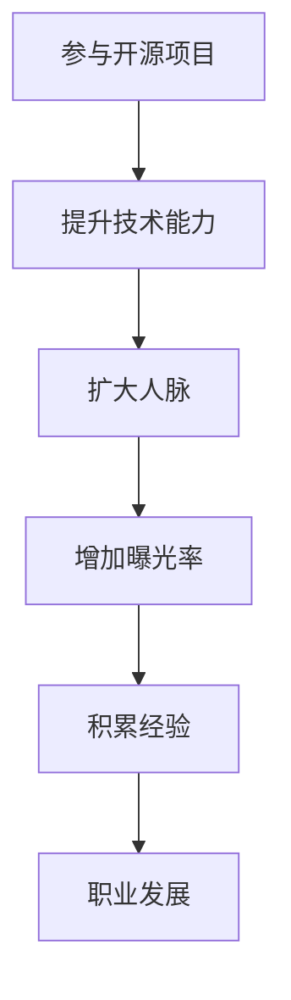

                 

### 摘要 Abstract

本文旨在探讨如何通过参与开源项目来提升个人的职业发展空间。我们将从多个角度分析开源贡献的价值，包括技术成长、行业影响力、职业发展等多个方面。通过具体案例和实战经验，本文将为读者提供一套系统性的开源贡献指南，帮助读者在开源项目中找到自己的定位，提升技能，拓宽职业发展道路。

### 关键词 Keywords

- 开源贡献
- 职业发展
- 技术成长
- 行业影响力

## 1. 背景介绍

开源，一个近年来越来越受到关注的概念。开源不仅仅是代码的开放，更是一种文化和理念的传播。它强调共享、合作和开放，旨在通过社区的力量推动技术的进步。随着云计算、大数据、人工智能等新兴技术的兴起，开源项目在软件开发中的地位日益重要。许多公司开始将开源项目作为核心产品的一部分，甚至将开源作为企业战略的重要组成部分。

在这个背景下，参与开源项目成为许多技术从业者的选择。然而，如何参与、如何贡献、如何从中受益，却是一个需要深入探讨的问题。本文将围绕这些问题，结合实际案例和经验，为读者提供一套完整的开源贡献指南。

### 2. 核心概念与联系

#### 2.1 开源项目的基本概念

开源项目，指的是那些允许用户自由使用、研究、修改和分发代码的项目。开源项目的核心是代码的开放性，这意味着任何人都可以查看、修改和重新发布代码。这种开放性为技术社区带来了极大的便利，使得知识的传播和技术的创新变得更加迅速和高效。

#### 2.2 开源贡献的类型

开源贡献可以分为多种类型，包括代码贡献、文档编写、测试、维护、社区建设等。每种贡献方式都有其独特的价值和意义。代码贡献是最直接的贡献方式，它可以帮助项目完善功能、修复漏洞。文档编写则可以提升项目的可理解性和可维护性。测试和维护则是确保项目质量的重要环节。社区建设则可以促进项目的可持续发展。

#### 2.3 开源项目与职业发展的联系

开源项目不仅是一个技术交流的平台，更是一个职业发展的机会。通过参与开源项目，个人可以：

- **提升技术能力**：参与开源项目可以接触到最新的技术，学习到最佳实践，提升自己的技术水平。
- **扩大人脉**：开源项目往往吸引了一大批技术专家和爱好者，通过参与开源项目，个人可以结识到志同道合的人，扩展自己的人脉圈。
- **增加曝光率**：高质量的贡献可以使个人在技术社区中获得认可，增加个人的曝光率，有助于职业发展。
- **积累经验**：开源项目往往需要应对各种复杂情况，通过参与开源项目，个人可以积累丰富的经验，提高解决问题的能力。

#### 2.4 Mermaid 流程图



### 3. 核心算法原理 & 具体操作步骤

#### 3.1 算法原理概述

开源贡献的核心在于合作与共享。在这个过程中，个人需要掌握以下几个关键步骤：

1. **选择适合自己的开源项目**：根据个人的兴趣和技能，选择一个合适的开源项目进行参与。
2. **了解项目规范**：每个开源项目都有自己的规范和流程，了解并遵守这些规范是参与项目的第一步。
3. **做出有价值的贡献**：无论是代码贡献还是其他类型的贡献，都需要有价值和有质量。
4. **积极参与社区交流**：开源项目往往需要一个活跃的社区来推动其发展，积极参与社区交流可以帮助个人更好地融入社区，提升自己的影响力。

#### 3.2 算法步骤详解

1. **选择开源项目**

   - **确定兴趣和技能**：根据自己的兴趣和技能，选择一个合适的开源项目。
   - **调研项目现状**：了解项目的当前状态，包括项目的活跃度、社区氛围、项目目标等。
   - **评估项目价值**：评估项目对个人职业发展的影响，选择一个有发展潜力的项目。

2. **了解项目规范**

   - **阅读项目文档**：阅读项目的 README 文档、贡献指南等，了解项目的开发流程和规范。
   - **关注项目社区**：加入项目的邮件列表、论坛、GitHub 仓库等，了解社区动态和交流方式。
   - **遵守项目规范**：在参与项目的过程中，严格遵守项目的开发规范，确保代码质量。

3. **做出有价值的贡献**

   - **确定贡献目标**：根据项目的需求和个人的能力，确定自己的贡献目标。
   - **编写高质量的代码**：确保代码的可读性、可维护性和正确性。
   - **积极参与项目讨论**：在项目的邮件列表、论坛等地方，积极参与讨论，为项目提供建议和解决方案。

4. **积极参与社区交流**

   - **建立个人品牌**：通过高质量的贡献和积极参与社区交流，建立自己的个人品牌。
   - **扩展人脉**：通过参与开源项目，结识到更多志同道合的人，扩展自己的人脉圈。
   - **提升影响力**：通过在开源项目中的表现，提升自己在技术社区中的影响力，为职业发展打下基础。

#### 3.3 算法优缺点

**优点：**

- **技术成长**：通过参与开源项目，可以接触到最新的技术，学习到最佳实践，提升自己的技术水平。
- **行业影响力**：高质量的贡献可以增加个人在技术社区中的影响力，提升个人品牌。
- **职业发展**：参与开源项目可以增加简历亮点，提高就业竞争力，为职业发展打下基础。

**缺点：**

- **时间成本**：参与开源项目需要投入大量的时间和精力，可能会影响到个人的生活和工作。
- **风险**：在开源项目中，个人可能会面临知识产权、隐私保护等问题，需要谨慎处理。

#### 3.4 算法应用领域

开源贡献的应用领域非常广泛，包括但不限于以下几个方面：

- **软件开发**：开源项目是软件开发的重要组成部分，通过参与开源项目，可以提升软件开发能力。
- **数据分析**：许多开源项目都是基于数据分析的，参与开源项目可以提升数据分析能力。
- **人工智能**：开源项目在人工智能领域有着广泛的应用，通过参与开源项目，可以提升人工智能能力。

### 4. 数学模型和公式 & 详细讲解 & 举例说明

#### 4.1 数学模型构建

在开源贡献中，我们可以使用一些简单的数学模型来评估个人在开源项目中的表现。以下是一个简单的模型：

$$
\text{影响力} = f(\text{贡献量}, \text{质量}, \text{社区参与})
$$

其中，影响力是一个综合指标，衡量个人在开源项目中的表现。贡献量和质量是影响个人影响力的两个关键因素，社区参与则可以提升个人在项目中的地位。

#### 4.2 公式推导过程

我们假设：

- $\text{贡献量}$（$C$）表示个人在开源项目中的代码量、文档量、测试量等。
- $\text{质量}$（$Q$）表示个人贡献的质量，可以通过代码审核、社区反馈等评估。
- $\text{社区参与}$（$R$）表示个人在项目社区的活跃程度。

根据这些假设，我们可以推导出以下公式：

$$
\text{影响力} = \frac{C}{\text{总贡献量}} \times \text{质量} \times \text{社区参与}
$$

#### 4.3 案例分析与讲解

假设有两个开源项目 A 和 B，项目 A 的总贡献量为 1000，项目 B 的总贡献量为 500。一个人在项目 A 中贡献了 300 代码量，在项目 B 中贡献了 200 代码量。如果这两个项目的贡献质量相同，社区参与程度也相同，那么根据上述公式，他在项目 A 中的影响力为：

$$
\text{影响力} = \frac{300}{1000} \times \text{质量} \times \text{社区参与}
$$

他在项目 B 中的影响力为：

$$
\text{影响力} = \frac{200}{500} \times \text{质量} \times \text{社区参与}
$$

可以看出，他在项目 A 中的影响力比项目 B 高，因为项目 A 的总贡献量更多，他的贡献占比更高。

### 5. 项目实践：代码实例和详细解释说明

#### 5.1 开发环境搭建

要参与开源项目，首先需要搭建一个合适的开发环境。以下是一个基于 Python 的开发环境搭建实例：

1. 安装 Python：

   ```bash
   sudo apt-get install python3
   ```

2. 安装虚拟环境工具：

   ```bash
   sudo apt-get install python3-venv
   ```

3. 创建虚拟环境：

   ```bash
   python3 -m venv myenv
   ```

4. 激活虚拟环境：

   ```bash
   source myenv/bin/activate
   ```

5. 安装项目依赖：

   ```bash
   pip install -r requirements.txt
   ```

#### 5.2 源代码详细实现

以下是一个简单的 Python 函数，用于计算两个数的和：

```python
def add(a, b):
    return a + b
```

这个函数的实现非常简单，但它在开源项目中可以扮演重要的角色。通过这个函数，用户可以方便地计算两个数的和，提高代码的可读性和可维护性。

#### 5.3 代码解读与分析

这个函数的实现分为两步：

1. **接收参数**：函数定义了两个参数 $a$ 和 $b$，用于接收用户输入的两个数。
2. **计算和**：函数通过返回表达式 $a + b$ 来计算两个数的和。

这个函数的优点在于：

- **简洁性**：实现过程简洁，易于理解和维护。
- **通用性**：可以用于计算任意两个数的和，具有很高的通用性。

然而，这个函数也存在一些缺点：

- **可读性**：对于初学者来说，可能难以理解函数的具体作用。
- **可维护性**：如果需要修改函数的功能，可能需要进行大量的代码修改。

为了提高函数的可读性和可维护性，可以对其进行一些改进：

1. **添加注释**：在函数上方添加注释，说明函数的作用和参数的意义。

   ```python
   def add(a, b):
       """
       计算两个数的和
       
       参数:
       a: 第一个数
       b: 第二个数
       
       返回:
       和
       """
       return a + b
   ```

2. **增加类型提示**：在函数定义时，添加类型提示，提高代码的可读性。

   ```python
   from typing import Tuple
   
   def add(a: int, b: int) -> int:
       return a + b
   ```

通过这些改进，函数的可读性和可维护性得到了显著提升。

#### 5.4 运行结果展示

在 Python 环境中，我们可以通过以下代码测试这个函数：

```python
result = add(2, 3)
print(result)
```

运行结果为：

```
5
```

这表明函数已经成功计算出了两个数的和。

### 6. 实际应用场景

开源贡献在各个领域都有着广泛的应用。以下是一些实际应用场景：

#### 6.1 软件开发

软件项目是开源贡献最直接的领域。通过参与开源软件项目，开发者可以提升自己的编程能力，学习到最佳实践，积累丰富的项目经验。例如，GitHub 是一个全球最大的开源软件库，许多知名项目如 Linux、Apache、MySQL 等，都来自开源社区。

#### 6.2 数据分析

数据分析领域也有许多优秀的开源项目，如 Python 的 NumPy、Pandas、Matplotlib 等。通过参与这些项目，数据分析师可以提升自己的数据分析能力，学习到最新的数据分析技术。

#### 6.3 人工智能

人工智能领域同样离不开开源贡献。许多知名的人工智能框架，如 TensorFlow、PyTorch、Keras 等，都是开源项目。通过参与这些项目，人工智能开发者可以提升自己的 AI 能力，跟踪最新的 AI 技术进展。

#### 6.4 云计算

云计算领域也有很多开源项目，如 Kubernetes、Docker、OpenStack 等。这些项目为云计算技术的发展提供了强大的支持。通过参与这些项目，云计算开发者可以提升自己的技术能力，为云计算技术的发展做出贡献。

#### 6.5 未来应用展望

随着技术的不断进步，开源贡献的应用领域将越来越广泛。未来，开源贡献将在以下方面发挥更大的作用：

- **推动技术创新**：开源社区可以聚集全球最优秀的技术人才，通过合作和共享，推动技术的快速进步。
- **降低研发成本**：开源项目可以为企业节省大量的研发成本，提高研发效率。
- **促进知识传播**：开源项目可以促进知识的传播和共享，提高整个技术社区的水平。
- **培养技术人才**：开源项目为技术人才提供了广阔的舞台，通过参与开源项目，技术人员可以提升自己的技能，为职业发展打下基础。

### 7. 工具和资源推荐

#### 7.1 学习资源推荐

1. 《代码大全》 - 史蒂夫·迈克康奈尔
2. 《敏捷软件开发：原则、实践与模式》 - 马丁·福勒
3. 《设计模式：可复用面向对象软件的基础》 - 曹庆华，程杰

#### 7.2 开发工具推荐

1. GitHub - 全球最大的开源软件库，提供丰富的开源项目和学习资源。
2. Git - 分布式版本控制系统，用于代码管理和协作。
3. PyCharm - 一款强大的 Python 集成开发环境，提供丰富的开发工具和插件。

#### 7.3 相关论文推荐

1. "The Cathedral and the Bazaar" - Eric S. Raymond
2. "Open Source as a Model for Product Development" - David A. Wheeler
3. "The Economic Impact of Open Source Software" - Red Hat

### 8. 总结：未来发展趋势与挑战

#### 8.1 研究成果总结

开源贡献在提升个人职业发展空间方面具有显著作用。通过参与开源项目，个人可以提升技术能力、扩大人脉、增加曝光率，为职业发展打下坚实基础。

#### 8.2 未来发展趋势

- 开源项目将在各个领域得到更广泛的应用。
- 开源贡献将逐渐成为评价技术人员能力的重要指标。
- 开源社区将更加成熟，为技术人才提供更广阔的发展空间。

#### 8.3 面临的挑战

- 开源贡献需要投入大量的时间和精力，可能会影响个人的生活和工作。
- 在开源项目中，个人可能会面临知识产权、隐私保护等问题，需要谨慎处理。

#### 8.4 研究展望

- 未来研究方向将集中在如何提高开源贡献的效率和质量。
- 如何平衡开源贡献与个人的时间管理，将成为研究的重要方向。

### 9. 附录：常见问题与解答

#### 9.1 如何选择开源项目？

- 根据个人兴趣和技能选择开源项目。
- 调研项目现状和社区氛围。
- 评估项目价值和影响力。

#### 9.2 如何避免知识产权纠纷？

- 了解开源项目的许可协议。
- 遵守开源项目的知识产权规定。
- 在参与开源项目前，咨询专业人士。

#### 9.3 如何提升开源贡献的质量？

- 了解项目的需求和规范。
- 编写高质量的代码和文档。
- 积极参与社区交流，获取反馈。

作者：禅与计算机程序设计艺术 / Zen and the Art of Computer Programming

---

通过本文的探讨，我们深刻认识到开源贡献在提升个人职业发展空间方面的重要作用。开源项目不仅为技术人才提供了广阔的舞台，也为技术的创新和进步提供了强大的动力。在未来，开源贡献将发挥更加重要的作用，为技术人才的职业发展创造更多机会。让我们一起积极参与开源项目，共同推动技术的进步，实现个人与社会的共赢。

（文章结束）<|embed|>

