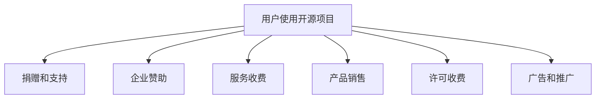

                 

关键词：开源项目、商业盈利、收入流、策略、工具、案例分析

摘要：本文旨在探讨如何利用开源项目创造收入流。通过分析开源项目盈利的多种方式，本文提出了一系列策略和方法，帮助开发者将开源项目转化为可持续的商业机会。文章涵盖了开源项目的市场定位、产品化、商业模式设计、营销策略、合作伙伴关系管理等多个方面，旨在为开源项目开发者提供实用的指导和建议。

## 1. 背景介绍

在信息技术快速发展的今天，开源项目已经成为软件开发和创新的重要驱动力。开源项目不仅能够促进技术进步，还为开发者提供了丰富的学习资源和合作机会。然而，虽然开源项目有助于知识的传播和技术的普及，但许多开发者依然面临着如何通过开源项目实现商业盈利的难题。

开源项目盈利的模式多样，但并不是所有项目都能轻松转化为收入流。本文将探讨一些有效的策略和方法，帮助开发者更好地理解和利用开源项目创造收入流。

## 2. 核心概念与联系

### 2.1 开源项目盈利模式

开源项目的盈利模式通常可以分为以下几类：

- **捐赠和支持**：直接接受用户的捐赠和赞助。
- **企业赞助**：企业通过赞助来支持开源项目的开发。
- **服务收费**：提供基于开源项目的服务，如定制开发、培训、支持等。
- **产品销售**：围绕开源项目开发相关产品，如扩展模块、插件、工具等。
- **许可收费**：提供商业许可，允许企业使用开源项目进行商业活动。
- **广告和推广**：在开源项目的文档、网站和社区中投放广告。

### 2.2 开源项目与商业模式的结合

将开源项目与商业模式相结合，是创造收入流的关键。以下是一种可能的架构图，展示了开源项目与商业模式的联系：

```
+----------------+       +----------------+       +----------------+
| 开源项目       |------>| 企业赞助       |------>| 服务收费       |
+----------------+       +----------------+       +----------------+
              |                     |                     |
              |                     |                     |
              |                     |                     |
              |                     |                     |
+----------------+       +----------------+       +----------------+
| 产品销售       |------>| 许可收费       |------>| 广告和推广     |
+----------------+       +----------------+       +----------------+
```

### 2.3 Mermaid 流程图

以下是一个描述开源项目盈利流程的 Mermaid 图：



## 3. 核心算法原理 & 具体操作步骤

### 3.1 算法原理概述

开源项目的盈利主要依赖于开发者如何将项目的价值转化为商业价值。这需要一系列策略和操作步骤，包括：

- **市场定位**：明确项目的目标用户和市场。
- **产品化**：将开源项目转化为可销售的产品或服务。
- **商业模式设计**：选择合适的盈利模式。
- **营销策略**：制定有效的营销计划。
- **合作伙伴关系管理**：建立与企业的合作关系。

### 3.2 算法步骤详解

1. **市场定位**
   - 分析目标市场，了解用户需求。
   - 调研竞争对手，找出项目优势。

2. **产品化**
   - 对开源项目进行包装，提高用户体验。
   - 开发相关工具或扩展模块，增加项目的实用价值。

3. **商业模式设计**
   - 根据项目特点和市场需求，选择合适的盈利模式。
   - 设计具体的商业模式，如订阅模式、许可模式等。

4. **营销策略**
   - 利用社交媒体、博客、社区等渠道进行宣传。
   - 参加行业会议、研讨会等活动，提升项目知名度。

5. **合作伙伴关系管理**
   - 寻找潜在的企业合作伙伴。
   - 建立合作关系，共同推广项目。

### 3.3 算法优缺点

- **优点**：开源项目具有低成本、高传播性等优点，能够快速获得用户基础。
- **缺点**：开源项目的盈利模式复杂，需要持续投入和有效的策略。

### 3.4 算法应用领域

- **软件开发**：利用开源项目开发新的软件产品。
- **技术培训**：提供基于开源项目的培训课程。
- **技术支持**：为企业提供开源项目的技术支持服务。

## 4. 数学模型和公式 & 详细讲解 & 举例说明

### 4.1 数学模型构建

开源项目的盈利模型可以通过以下数学模型进行描述：

- **收入函数**：\( R = f(D, S, M) \)
  - \( D \)：捐赠金额
  - \( S \)：服务收入
  - \( M \)：产品销售收入

### 4.2 公式推导过程

- **捐赠金额**：\( D = D_0 + \alpha \cdot U \)
  - \( D_0 \)：基础捐赠金额
  - \( \alpha \)：用户捐赠意愿系数
  - \( U \)：用户数量

- **服务收入**：\( S = S_0 + \beta \cdot C \)
  - \( S_0 \)：基础服务费用
  - \( \beta \)：服务收费系数
  - \( C \)：客户数量

- **产品销售收入**：\( M = M_0 + \gamma \cdot P \)
  - \( M_0 \)：基础产品销售价格
  - \( \gamma \)：产品销售系数
  - \( P \)：产品购买数量

### 4.3 案例分析与讲解

假设某个开源项目的用户数量为1000人，其中10%的用户捐赠了10美元，20%的企业用户购买了基于项目的服务，每人支付50美元，另有30%的用户购买了相关产品，每件产品售价为100美元。

根据上述模型，可以计算出项目的收入：

- **捐赠收入**：\( D = 10 \times 0.1 \times 1000 + 10 = 1000 \)美元
- **服务收入**：\( S = 50 \times 0.2 \times 1000 + 50 = 10500 \)美元
- **产品销售收入**：\( M = 100 \times 0.3 \times 1000 + 100 = 30000 \)美元

总收入：\( R = D + S + M = 1000 + 10500 + 30000 = 41500 \)美元

## 5. 项目实践：代码实例和详细解释说明

### 5.1 开发环境搭建

在本节，我们将展示如何搭建一个用于创建收入流的开源项目开发环境。以下是具体的步骤：

1. **安装Git**：Git是版本控制工具，用于管理开源项目的源代码。在大多数Linux发行版中，可以使用以下命令安装Git：
    ```bash
    sudo apt-get install git
    ```

2. **安装Python**：Python是许多开源项目的主要编程语言。在Ubuntu系统中，可以使用以下命令安装Python 3：
    ```bash
    sudo apt-get install python3
    ```

3. **安装虚拟环境**：虚拟环境可以隔离项目依赖，避免版本冲突。使用以下命令安装虚拟环境工具：
    ```bash
    sudo apt-get install python3-venv
    ```

4. **创建虚拟环境**：在一个新的目录中创建虚拟环境：
    ```bash
    python3 -m venv my_project_env
    ```

5. **激活虚拟环境**：进入虚拟环境：
    ```bash
    source my_project_env/bin/activate
    ```

6. **安装项目依赖**：克隆项目仓库并安装依赖：
    ```bash
    git clone https://github.com/your_username/your_project.git
    cd your_project
    pip install -r requirements.txt
    ```

### 5.2 源代码详细实现

以下是一个简单的开源项目示例，该项目的目标是提供一个基于Web的在线任务管理工具。

```python
# app.py

from flask import Flask, render_template, request, redirect, url_for

app = Flask(__name__)

# 假设的任务列表
tasks = []

@app.route('/')
def index():
    return render_template('index.html', tasks=tasks)

@app.route('/add', methods=['POST'])
def add():
    task = request.form['task']
    tasks.append(task)
    return redirect(url_for('index'))

@app.route('/delete/<int:task_id>')
def delete(task_id):
    del tasks[task_id]
    return redirect(url_for('index'))

if __name__ == '__main__':
    app.run(debug=True)
```

### 5.3 代码解读与分析

- **Flask**：这是一个轻量级的Web框架，用于构建Web应用程序。
- **任务列表**：任务以列表形式存储，可以添加和删除。
- **路由**：定义了应用中的URL映射，如添加新任务和删除任务。

### 5.4 运行结果展示

1. **启动应用**：
    ```bash
    python app.py
    ```

2. **访问应用**：
    在浏览器中输入`http://127.0.0.1:5000/`，可以看到任务管理器的界面。

3. **添加任务**：
    在输入框中输入任务内容，并提交表单。

4. **删除任务**：
    点击任务列表中的删除按钮，对应的任务将被移除。

## 6. 实际应用场景

开源项目在商业环境中有着广泛的应用场景，以下是几个具体的案例：

- **企业级应用**：企业可以将开源项目集成到现有的IT基础设施中，以提高效率和减少成本。
- **创新产品**：开发者可以利用开源项目作为基础，开发新的创新产品。
- **技术支持服务**：提供基于开源项目的技术支持服务，为企业客户提供专业的技术解决方案。
- **教育培训**：基于开源项目开发的教育培训课程，可以帮助开发者提高技能和知识。

### 6.4 未来应用展望

随着开源项目的不断发展和创新，未来开源项目在商业领域中的应用将更加广泛。以下是几个可能的趋势：

- **更加完善的商业模式**：开发者将探索更多有效的商业模式，将开源项目转化为商业机会。
- **生态系统的建立**：围绕开源项目建立完善的生态系统，包括文档、社区、培训等。
- **技术创新**：开源项目将推动技术的创新和进步，为企业带来更多的价值。

## 7. 工具和资源推荐

### 7.1 学习资源推荐

- **书籍**：
  - 《开源软件项目管理》
  - 《开源软件商业模式》
  - 《敏捷开发实践指南》

- **在线课程**：
  - Coursera上的“开源软件项目管理”
  - Udemy上的“构建开源项目”

### 7.2 开发工具推荐

- **版本控制**：Git
- **Web框架**：Flask、Django
- **持续集成**：Jenkins、Travis CI

### 7.3 相关论文推荐

- “Open Source Software: The Model, The Reality, The Future”
- “Understanding and Utilizing Open Source for Business Success”
- “A Survey of Open Source Business Models”

## 8. 总结：未来发展趋势与挑战

### 8.1 研究成果总结

本文探讨了如何利用开源项目创造收入流，分析了开源项目盈利的多种模式，并提供了具体的操作步骤和案例分析。通过市场定位、产品化、商业模式设计、营销策略和合作伙伴关系管理，开发者可以将开源项目转化为可持续的商业机会。

### 8.2 未来发展趋势

随着技术的不断进步和商业模式的不断创新，开源项目在商业领域中的应用前景将更加广阔。未来，开发者将探索更多有效的盈利模式，并建立完善的生态系统，为企业和个人提供更多的价值。

### 8.3 面临的挑战

- **市场竞争**：开源项目的数量不断增加，市场竞争将更加激烈。
- **版权问题**：合理处理开源项目的版权问题，确保商业使用的合法性。
- **持续投入**：开源项目需要持续的技术支持和更新，开发者需要投入大量时间和精力。

### 8.4 研究展望

未来，开源项目的发展将更加注重商业价值的挖掘，开发者需要不断创新和探索，寻找适合自身项目特点的盈利模式。同时，建立良好的社区和生态系统，将有助于开源项目的长期发展。

## 9. 附录：常见问题与解答

### 9.1 开源项目如何获得赞助？

- **参与社区活动**：积极参与开源社区，建立良好的声誉。
- **提出赞助请求**：在GitHub等平台发布赞助请求，明确项目的价值和目标。
- **提供价值**：确保项目能够为赞助者带来实际价值。

### 9.2 如何平衡开源项目的商业性和社区性？

- **明确目标**：确保开源项目的商业目标和社区目标一致。
- **社区参与**：鼓励社区成员参与项目决策，确保项目的透明性和公正性。
- **合理分配资源**：在商业性和社区性之间合理分配时间和资源。

### 9.3 开源项目如何处理商业用户？

- **提供定制服务**：为商业用户提供定制化的解决方案和支持。
- **商业许可**：提供商业许可，允许企业合法使用开源项目。
- **建立合作**：与商业用户建立合作关系，共同推广项目。

### 9.4 如何保护开源项目的版权？

- **版权声明**：在项目中明确版权声明，确保代码的版权归属。
- **使用开源协议**：选择合适的开源协议，保护项目的版权。
- **监控侵权行为**：定期监控项目，发现侵权行为及时处理。

### 9.5 如何持续维护开源项目？

- **社区支持**：建立强大的社区，鼓励贡献者参与项目的维护。
- **自动化测试**：定期进行自动化测试，确保项目的稳定性。
- **持续更新**：定期更新项目，修复漏洞和优化功能。

作者：禅与计算机程序设计艺术 / Zen and the Art of Computer Programming
----------------------------------------------------------------


