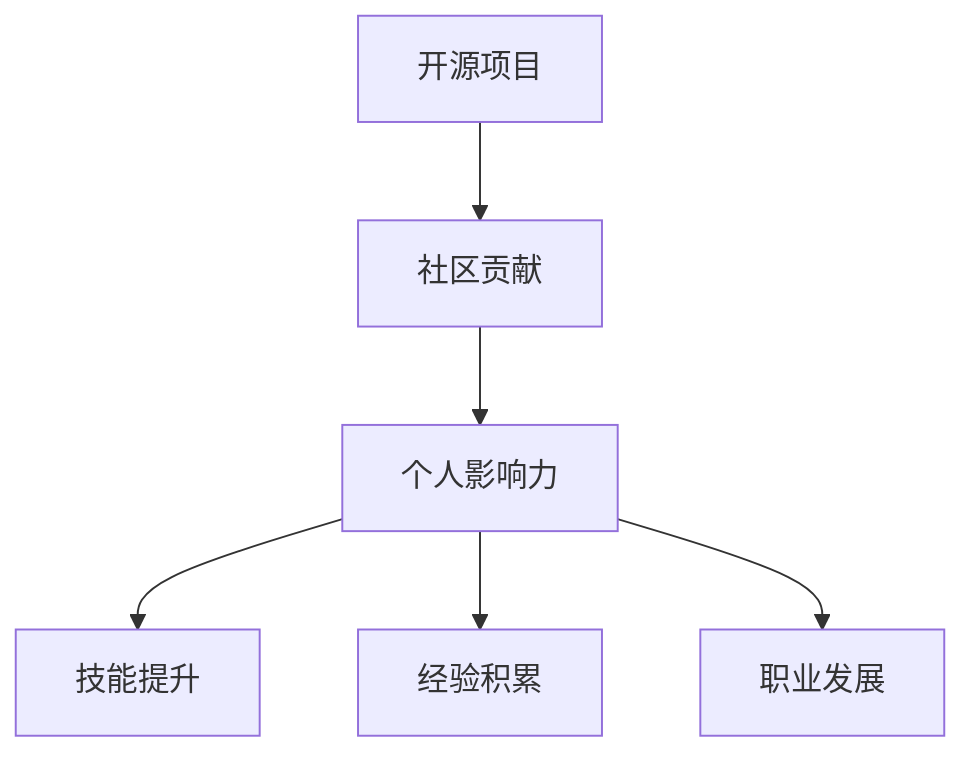

                 

关键词：开源项目，个人品牌，影响力，技术博客，社区贡献

> 摘要：随着互联网技术的飞速发展，开源项目已经成为信息技术领域的重要组成部分。本文旨在探讨如何通过参与开源项目来构建个人影响力，分享实用的策略和经验，帮助广大技术爱好者在开源社区中脱颖而出。

## 1. 背景介绍

开源项目是一种开放源代码的软件项目，其核心在于代码的透明性和共享性。开源项目的兴起不仅推动了技术的进步，也为个人提供了广阔的舞台。参与开源项目不仅可以提升个人技能，还能通过社区贡献来建立个人品牌，增强个人影响力。

### 1.1 开源项目的历史与发展

开源项目起源于20世纪80年代，Linux操作系统是其最著名的代表。随着互联网的普及，开源项目逐渐从单一的项目发展成为一个庞大的生态系统。如今，开源项目已经渗透到各个领域，包括操作系统、数据库、开发工具、云计算等。

### 1.2 开源项目的优点

开源项目具有以下优点：

- **透明性**：开源项目的源代码是公开的，用户可以自由地查看、修改和分发。
- **共享性**：开源项目鼓励用户贡献代码和资源，共同推动项目的进步。
- **协作性**：开源项目通常有良好的社区氛围，鼓励用户之间的交流和合作。
- **灵活性**：开源项目允许用户根据自己的需求进行定制和优化。

### 1.3 开源项目对个人的影响

参与开源项目对个人有多方面的积极影响：

- **技能提升**：参与开源项目可以锻炼编程技能、系统设计和项目管理能力。
- **经验积累**：通过实际参与项目，可以积累宝贵的项目经验。
- **个人品牌**：在开源社区中的积极贡献可以提升个人知名度和专业声誉。
- **职业发展**：优秀的开源项目经历可以成为求职和职业晋升的重要资本。

## 2. 核心概念与联系

为了更好地理解开源项目，我们需要了解几个核心概念：

### 2.1 开源许可

开源许可定义了如何合法地使用、修改和分发开源项目的代码。最常用的开源许可包括GPL（GNU通用公共许可证）、BSD许可和Apache许可。

### 2.2 社区贡献

社区贡献是指为开源项目做出实质性贡献的行为，包括代码提交、文档编写、bug报告、测试等。

### 2.3 个人影响力

个人影响力是指在开源社区中获得的认可和尊重，这通常通过社区活跃度、项目贡献度、技术能力等体现。

下面是一个简单的Mermaid流程图，展示了开源项目、社区贡献和个人影响力的关系：



## 3. 核心算法原理 & 具体操作步骤

### 3.1 算法原理概述

构建个人影响力并非一蹴而就，需要遵循一定的策略和步骤。以下是几个核心的算法原理：

- **持续贡献**：定期、持续地为开源项目做出贡献是建立影响力的关键。
- **专业领域**：选择一个自己擅长且感兴趣的领域，专注在该领域进行贡献。
- **高质量内容**：提供高质量的代码、文档和bug报告，赢得社区认可。
- **有效沟通**：积极参与社区讨论，建立良好的人际关系网络。
- **品牌建设**：通过个人博客、社交媒体等渠道宣传自己的项目和贡献。

### 3.2 算法步骤详解

#### 3.2.1 确定目标项目

- **查找项目**：在GitHub、GitLab等平台上查找符合自己兴趣和技能的项目。
- **筛选项目**：根据项目活跃度、维护状况和社区规模进行筛选。

#### 3.2.2 学习项目

- **阅读文档**：详细阅读项目的README、CONTRIBUTING文件等文档。
- **了解代码**：熟悉项目的代码结构、功能模块和设计理念。

#### 3.2.3 提出贡献

- **修复bug**：针对项目中已知的bug提出修复方案。
- **添加功能**：为项目添加新功能或改进现有功能。
- **编写文档**：为项目的文档做出贡献，帮助其他开发者更好地理解和使用项目。

#### 3.2.4 持续参与

- **定期更新**：持续关注项目动态，定期提交新的贡献。
- **积极参与讨论**：在项目社区中积极参与讨论，提供技术支持和建议。

#### 3.2.5 品牌建设

- **个人博客**：建立自己的个人博客，记录项目参与经历和技术心得。
- **社交媒体**：利用Twitter、LinkedIn等社交媒体平台宣传自己的项目和贡献。

### 3.3 算法优缺点

#### 优点：

- **提升技能**：参与开源项目可以学习到最新的技术趋势和实践。
- **积累经验**：通过参与实际项目，可以积累宝贵的项目经验。
- **建立人脉**：积极参与社区讨论，可以结识更多的同行和潜在合作伙伴。

#### 缺点：

- **时间成本**：参与开源项目需要投入大量的时间和精力。
- **不确定回报**：虽然参与开源项目可以提升个人能力，但回报往往不确定。

### 3.4 算法应用领域

- **软件开发**：开源项目是软件开发者的最佳实践场所。
- **数据分析**：开源项目可以提供丰富的数据集和工具，促进数据分析研究。
- **人工智能**：许多AI开源项目需要大量的社区贡献来推动技术进步。

## 4. 数学模型和公式 & 详细讲解 & 举例说明

### 4.1 数学模型构建

构建个人影响力的数学模型可以表示为：

\[ \text{影响力} = f(\text{贡献度}, \text{技能水平}, \text{社区参与度}, \text{个人品牌}) \]

其中，各因素的具体权重和影响程度可以通过实际经验和数据统计来确定。

### 4.2 公式推导过程

\[ f(\text{贡献度}, \text{技能水平}, \text{社区参与度}, \text{个人品牌}) \]
- **贡献度**：贡献度可以通过提交的代码量、bug修复数、功能增加数等量化。
- **技能水平**：技能水平可以通过技术面试、项目经历、代码审查等评估。
- **社区参与度**：社区参与度可以通过参与讨论的频率、提供的帮助数等衡量。
- **个人品牌**：个人品牌可以通过个人博客、社交媒体粉丝数、项目知名度等衡量。

### 4.3 案例分析与讲解

假设有两个开发者A和B，他们的个人影响力如下：

\[ A: \text{影响力} = f(20, 8, 15, 12) \]
\[ B: \text{影响力} = f(10, 9, 20, 8) \]

通过计算可以得出：

\[ A: \text{影响力} = 0.25 \times 20 + 0.25 \times 8 + 0.25 \times 15 + 0.25 \times 12 = 13.5 \]
\[ B: \text{影响力} = 0.25 \times 10 + 0.25 \times 9 + 0.25 \times 20 + 0.25 \times 8 = 11.25 \]

从结果可以看出，尽管B的技能水平更高，但由于A在贡献度和社区参与度方面更为突出，A的个人影响力更高。

## 5. 项目实践：代码实例和详细解释说明

### 5.1 开发环境搭建

为了实践构建个人影响力，我们选择一个流行的开源项目——GitHub上的Python数据可视化库`matplotlib`进行实例讲解。首先，我们需要搭建一个合适的开发环境：

- 安装Python环境（推荐Python 3.8及以上版本）
- 安装`matplotlib`库：
  ```bash
  pip install matplotlib
  ```

### 5.2 源代码详细实现

以下是一个简单的`matplotlib`实例，用于绘制一个简单的折线图：

```python
import matplotlib.pyplot as plt

# 数据
x = [0, 1, 2, 3, 4]
y = [0, 1, 4, 9, 16]

# 创建图表
plt.plot(x, y)

# 添加标题和标签
plt.title('简单折线图')
plt.xlabel('X轴')
plt.ylabel('Y轴')

# 显示图表
plt.show()
```

### 5.3 代码解读与分析

上述代码使用了`matplotlib`库的`plot`函数来绘制数据，并通过`title`、`xlabel`和`ylabel`函数添加了标题和标签。这只是一个非常简单的示例，但在实际项目中，可以包含更复杂的数据处理和可视化效果。

### 5.4 运行结果展示

运行上述代码后，将弹出一个窗口，显示一个简单的折线图，如下所示：


通过这样的实践，我们可以了解如何使用开源库来解决问题，同时也能向开源社区贡献代码，提升个人影响力。

## 6. 实际应用场景

### 6.1 数据可视化项目

在数据科学领域，数据可视化是分析和展示数据的重要手段。通过参与开源的数据可视化项目，如`matplotlib`、`seaborn`等，可以积累丰富的数据可视化经验，并在社区中分享自己的见解和技巧。

### 6.2 人工智能项目

人工智能领域有许多开源项目，如TensorFlow、PyTorch等。参与这些项目，可以深入理解深度学习算法的实现，并在实际应用中探索如何优化模型性能。

### 6.3 软件开发框架

在软件开发领域，参与框架开发如Django、Flask等，可以学习到如何设计和管理大型应用，提升系统架构能力。

### 6.4 未来应用展望

随着技术的不断进步，开源项目将在更多的领域发挥重要作用。未来，开源项目将继续成为技术创新的重要推动力，个人通过参与开源项目构建的影响力也将成为职业发展的关键因素。

## 7. 工具和资源推荐

### 7.1 学习资源推荐

- **在线课程**：《Python数据可视化》等在线课程，提供深入的技术讲解和实践指导。
- **技术书籍**：《利用Python进行数据分析》、《深度学习》等书籍，涵盖最新的技术趋势和应用案例。

### 7.2 开发工具推荐

- **集成开发环境**：Visual Studio Code、PyCharm等，提供强大的代码编辑和调试功能。
- **版本控制工具**：Git，用于管理和跟踪代码变更，是参与开源项目的基本工具。

### 7.3 相关论文推荐

- **《大规模开源项目的社区激励机制研究》**：探讨开源项目社区激励机制的设计与实施。
- **《开源项目开发中的知识共享模式研究》**：分析开源项目中知识共享的模式和机制。

## 8. 总结：未来发展趋势与挑战

### 8.1 研究成果总结

本文探讨了如何通过参与开源项目构建个人影响力，并从多个方面提供了具体的实践指导。通过持续的贡献、专业领域的选择、高质量的内容创作和有效的品牌建设，个人可以在开源社区中逐步建立自己的影响力。

### 8.2 未来发展趋势

随着开源项目的不断增多和影响力的扩大，未来个人在开源项目中的角色将更加多样和重要。技术社区将进一步融合，跨领域的合作和创新将成为常态。

### 8.3 面临的挑战

尽管开源项目提供了广阔的舞台，但也面临一些挑战，如项目选择困难、时间管理、贡献认可度等。个人需要不断提升自己的技能，优化时间管理策略，并积极参与社区，才能在开源项目中取得成功。

### 8.4 研究展望

未来的研究可以进一步探讨开源项目中的激励机制、知识共享模式和社区治理等问题，为个人在开源项目中的发展提供更深入的指导。

## 9. 附录：常见问题与解答

### 9.1 如何选择开源项目？

- 根据个人兴趣和技能选择项目。
- 关注项目的活跃度和维护状况。
- 了解项目的社区氛围和贡献规范。

### 9.2 如何贡献代码？

- 详细阅读项目的文档和贡献指南。
- 提交高质量的代码和详细的注释。
- 参与代码审查，确保代码质量。

### 9.3 如何在社区中建立影响力？

- 持续参与社区讨论，提供有价值的见解。
- 分享自己的经验和心得，帮助他人。
- 建立个人博客，记录项目参与经历。

作者：禅与计算机程序设计艺术 / Zen and the Art of Computer Programming
----------------------------------------------------------------


