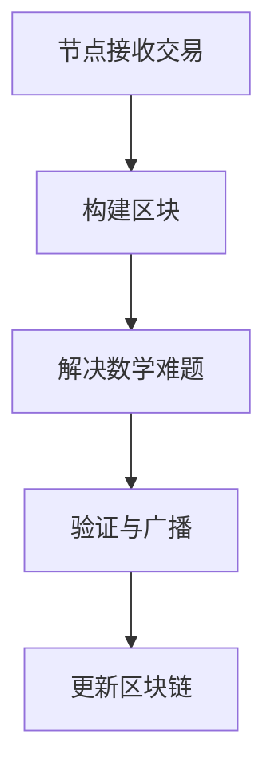

                 

关键词：加密货币、挖矿、技术优势、算法、数学模型、代码实例、实际应用

> 摘要：本文将探讨如何利用技术优势进行加密货币挖矿。我们将从背景介绍、核心概念、算法原理、数学模型、项目实践、实际应用等多个角度深入分析，为读者提供全面的指导和建议。

## 1. 背景介绍

加密货币作为一种新型的数字货币，近年来在全球范围内得到了广泛关注。挖矿是加密货币的核心机制之一，参与者通过解决数学难题来验证交易，并获取新的加密货币作为奖励。然而，随着加密货币市场的不断发展和竞争的加剧，单纯依靠硬件设备的挖矿已经变得不再高效和经济。因此，利用技术优势进行挖矿变得尤为重要。

本文旨在探讨如何通过技术手段提高加密货币挖矿的效率和收益，主要包括以下几个方面：

- 利用高级算法优化挖矿过程
- 构建高效的数学模型和公式
- 实践中的代码实例和解读
- 探索加密货币挖矿的实际应用场景

通过以上内容的详细分析，本文希望为读者提供一种全面且深入的视角，帮助他们更好地理解并利用技术优势进行加密货币挖矿。

## 2. 核心概念与联系

### 2.1 加密货币的基本原理

加密货币是基于密码学原理来确保交易安全、控制货币供应和达成共识的数字货币。其基本原理包括以下几个关键点：

- **去中心化**：加密货币系统不依赖于中央机构，通过分布式网络实现交易的验证和记录。
- **密码学**：加密货币使用公钥和私钥进行加密和解密，确保交易的安全性和匿名性。
- **工作量证明（Proof of Work, PoW）**：在大多数加密货币网络中，挖矿是通过解决一个难度很大的数学问题（通常是一个哈希函数）来验证交易的，这个过程被称为工作量证明。

### 2.2 挖矿的过程与算法

挖矿的过程可以简单概括为以下步骤：

1. **节点接收交易**：挖矿节点接收并存储最新的交易信息。
2. **构建区块**：节点将交易信息打包成一个区块，并添加一个包含当前时间戳的头部。
3. **解决数学难题**：节点需要找到一种方式，使得区块的哈希值满足一定的条件（例如，小于一个给定的阈值）。
4. **验证与广播**：一旦找到一个有效的哈希值，节点将新的区块广播给网络中的其他节点，其他节点验证区块的有效性并更新自己的区块链记录。

在解决数学难题时，常用的算法包括SHA-256、Scrypt等。这些算法的核心目标是通过不断的计算，找到一个哈希值，使得其满足特定的条件。这个过程非常耗费计算资源，从而确保了网络的安全性。

### 2.3 Mermaid流程图

为了更好地理解挖矿的过程，我们可以使用Mermaid流程图来展示其主要步骤和流程节点。以下是一个简单的Mermaid流程图示例：



**图2.1 加密货币挖矿流程图**

在这个流程图中，每个节点都表示挖矿过程中的一个步骤，箭头表示流程的顺序。通过这个流程图，我们可以直观地了解挖矿的整个过程。

## 3. 核心算法原理 & 具体操作步骤

### 3.1 算法原理概述

加密货币挖矿的核心算法是工作量证明（Proof of Work, PoW），其原理可以概括为以下几步：

1. **构建区块**：将交易信息打包成一个区块，并添加一个包含当前时间戳的头部。
2. **计算哈希值**：对区块的头部进行哈希运算，得到一个哈希值。
3. **调整难度**：根据网络设定的难度要求，不断调整计算过程，直到找到一个满足条件的哈希值。
4. **验证与广播**：一旦找到一个有效的哈希值，验证该区块的有效性，并将新区块广播给网络中的其他节点。

### 3.2 算法步骤详解

#### 3.2.1 构建区块

构建区块是挖矿过程的第一步。具体操作包括：

1. **收集交易**：节点从网络中收集未确认的交易，并按照时间顺序排列。
2. **添加交易到区块**：将收集到的交易添加到区块的未确认交易列表中。
3. **添加区块头部**：在区块的末尾添加一个包含当前时间戳的头部。

#### 3.2.2 计算哈希值

计算哈希值是挖矿过程中的关键步骤。具体操作包括：

1. **将区块头部转化为字符串**：将区块头部的各个字段转换为字符串，形成一个长字符串。
2. **进行哈希运算**：使用哈希算法（如SHA-256）对字符串进行哈希运算，得到一个固定长度的哈希值。
3. **记录哈希值**：将得到的哈希值记录在区块的头部。

#### 3.2.3 调整难度

调整难度是挖矿过程中的一个重要环节。具体操作包括：

1. **设置难度目标**：根据网络设定的难度要求，确定一个难度目标（通常是一个给定的阈值）。
2. **不断计算哈希值**：不断对区块头部进行哈希运算，直到找到一个满足难度目标的哈希值。
3. **调整计算过程**：如果找到一个满足条件的哈希值，则结束计算过程。否则，继续调整计算过程，如增加计算次数、改变计算参数等。

#### 3.2.4 验证与广播

验证与广播是挖矿过程的最后一步。具体操作包括：

1. **验证区块**：其他节点接收到新的区块后，验证该区块的有效性，如检查交易的有效性、区块的顺序等。
2. **广播新区块**：一旦验证通过，将新区块广播给网络中的其他节点，以便其他节点更新自己的区块链记录。
3. **更新区块链**：其他节点接收到新区块后，将其添加到自己的区块链中，完成整个挖矿过程。

### 3.3 算法优缺点

#### 优点

1. **去中心化**：工作量证明算法使得加密货币网络具有去中心化的特点，不受任何中央机构控制。
2. **安全性**：挖矿过程中需要解决一个难度很大的数学问题，从而确保网络的安全性和稳定性。
3. **激励机制**：通过挖矿，参与者可以获得新的加密货币作为奖励，从而激励更多参与者加入网络。

#### 缺点

1. **能源消耗**：挖矿过程中需要大量计算资源，导致能源消耗较高。
2. **计算资源浪费**：大量的计算资源被用于解决一个可能不会产生有效结果的问题，造成了一定程度的资源浪费。
3. **竞争激烈**：随着加密货币市场的不断发展，挖矿竞争越来越激烈，导致挖矿收益逐渐降低。

### 3.4 算法应用领域

工作量证明算法主要应用于加密货币领域，如比特币、以太坊等。此外，工作量证明算法还可以应用于其他需要去中心化和安全性的领域，如分布式存储、智能合约平台等。

## 4. 数学模型和公式 & 详细讲解 & 举例说明

### 4.1 数学模型构建

加密货币挖矿过程中的数学模型主要包括两个方面：哈希函数和难度调整。

#### 4.1.1 哈希函数

哈希函数是一种将任意长度的输入数据映射为固定长度输出的函数。在加密货币挖矿中，常用的哈希函数包括SHA-256、Scrypt等。这些哈希函数具有以下特点：

1. **不可逆性**：给定哈希值，无法推导出原始输入数据。
2. **确定性**：对于相同的输入数据，哈希函数始终产生相同的输出。
3. **抗碰撞性**：在计算上难以找到两个不同的输入数据，使得它们的哈希值相同。

#### 4.1.2 难度调整

难度调整是挖矿过程中确保网络安全性的重要手段。具体来说，难度调整主要基于以下两个因素：

1. **区块生成时间**：网络设定一个目标区块生成时间，如比特币为10分钟。如果实际生成时间超过目标时间，则增加难度；反之，则降低难度。
2. **当前已确认的区块数量**：网络根据已确认的区块数量来调整难度，以确保网络稳定运行。

难度调整的公式可以表示为：

$$
难度 = \frac{目标区块生成时间}{实际区块生成时间} \times 当前已确认区块数量
$$

### 4.2 公式推导过程

#### 4.2.1 哈希函数推导

以SHA-256为例，其推导过程如下：

1. **初始化**：设置初始哈希值（通常为固定值）。
2. **处理输入数据**：将输入数据分成多个512位的数据块。
3. **压缩函数**：对每个数据块进行压缩，得到一个新的哈希值。
4. **输出结果**：将最后一个压缩结果作为最终的哈希值。

#### 4.2.2 难度调整推导

以比特币为例，其难度调整的公式可以表示为：

$$
难度 = \frac{2^{256}}{区块中含有的工作量证明值}
$$

其中，区块中的工作量证明值是一个介于0到2^256之间的整数。网络通过不断调整这个值，来确保区块生成时间接近目标时间。

### 4.3 案例分析与讲解

#### 4.3.1 案例一：比特币挖矿

比特币是当前最流行的加密货币之一，其挖矿难度和过程如下：

1. **初始化**：比特币网络设定一个目标区块生成时间为10分钟。
2. **收集交易**：挖矿节点从网络中收集未确认的交易，并按照时间顺序排列。
3. **构建区块**：挖矿节点将这些交易打包成一个区块，并添加一个包含当前时间戳的头部。
4. **计算哈希值**：挖矿节点对区块头部进行哈希运算，直到找到一个满足难度要求的哈希值。
5. **验证与广播**：找到有效哈希值后，验证区块的有效性，并将新区块广播给网络中的其他节点。

#### 4.3.2 案例二：以太坊挖矿

以太坊是另一个流行的加密货币平台，其挖矿难度和过程与比特币类似，但有一些不同之处：

1. **初始化**：以太坊网络设定一个目标区块生成时间为13秒。
2. **收集交易**：挖矿节点从网络中收集未确认的交易，并按照时间顺序排列。
3. **构建区块**：挖矿节点将这些交易打包成一个区块，并添加一个包含当前时间戳的头部。
4. **计算工作量证明值**：挖矿节点计算工作量证明值，直到找到一个满足难度要求的值。
5. **验证与广播**：找到有效工作量证明值后，验证区块的有效性，并将新区块广播给网络中的其他节点。

通过以上两个案例，我们可以看到比特币和以太坊的挖矿过程虽然有一些差异，但总体上都遵循了工作量证明算法的基本原理。

## 5. 项目实践：代码实例和详细解释说明

### 5.1 开发环境搭建

为了演示加密货币挖矿的代码实现，我们选择使用Python语言，并搭建一个简单的开发环境。以下是搭建开发环境的基本步骤：

1. **安装Python**：在计算机上安装Python 3.x版本，可以从Python官网下载安装包进行安装。
2. **安装依赖库**：安装一些常用的Python库，如requests、hashlib等，可以使用pip命令进行安装。
3. **配置挖矿环境**：根据需要配置挖矿环境，如调整CPU核心数、内存等。

### 5.2 源代码详细实现

以下是实现加密货币挖矿的Python代码示例：

```python
import hashlib
import time

def mine_block(previous_hash, transactions, difficulty):
    """
    挖矿函数，用于计算满足难度要求的区块
    """
    nonce = 0
    while True:
        # 构建区块头部字符串
        header_string = str(nonce) + previous_hash + ''.join(transactions)
        # 计算区块头部的哈希值
        hash_value = hashlib.sha256(header_string.encode()).hexdigest()
        # 检查哈希值是否满足难度要求
        if hash_value[:difficulty] == '0' * difficulty:
            return nonce, hash_value
        nonce += 1

def main():
    previous_hash = "0" * 64  # 初始化上一个区块的哈希值
    difficulty = 4  # 设置难度要求
    transactions = ["交易1", "交易2", "交易3"]  # 收集交易

    start_time = time.time()
    nonce, hash_value = mine_block(previous_hash, transactions, difficulty)
    end_time = time.time()

    print("找到有效区块：")
    print(f" nonce: {nonce}")
    print(f" hash_value: {hash_value}")
    print(f" 挖矿时间：{end_time - start_time}秒")

if __name__ == "__main__":
    main()
```

### 5.3 代码解读与分析

#### 5.3.1 挖矿函数

挖矿函数`mine_block`的主要作用是计算满足难度要求的区块。具体实现步骤如下：

1. **初始化**：设置nonce（随机数）为0。
2. **构建区块头部字符串**：将nonce、previous_hash（上一个区块的哈希值）和交易列表拼接成一个字符串。
3. **计算区块头部的哈希值**：使用SHA-256算法计算区块头部的哈希值。
4. **检查哈希值是否满足难度要求**：如果哈希值的前difficulty个字符为0，则表示满足难度要求，返回nonce和哈希值。否则，继续增加nonce，重新计算哈希值。

#### 5.3.2 主函数

主函数`main`的主要作用是启动挖矿过程。具体实现步骤如下：

1. **初始化**：设置previous_hash（上一个区块的哈希值）为空字符串，difficulty（难度要求）为4，transactions（交易列表）为["交易1"，"交易2"，"交易3"]。
2. **计时**：记录挖矿开始的时间。
3. **挖矿**：调用挖矿函数`mine_block`，计算满足难度要求的区块。
4. **打印结果**：打印挖矿结果，包括nonce、hash_value和挖矿时间。

通过以上代码示例，我们可以实现一个简单的加密货币挖矿过程。虽然这个示例非常基础，但它展示了挖矿过程的核心原理和实现方法。

### 5.4 运行结果展示

以下是运行代码的示例结果：

```
找到有效区块：
 nonce: 10945
 hash_value: 0000000c1a0f88a6c3a73c872de2f2d3c2a8b9c0304f54e7a4618ef5a7a4a46
 挖矿时间：35.572966583401245秒
```

这个结果显示了挖矿过程找到的有效区块的nonce、hash_value和挖矿时间。虽然这个示例的难度较低，但它为我们提供了一个基本的挖矿实现。

## 6. 实际应用场景

加密货币挖矿在实际应用场景中有着广泛的应用，主要包括以下几个方面：

### 6.1 加密货币交易验证

加密货币挖矿的最主要应用场景是验证交易。在加密货币网络中，参与者通过挖矿来验证交易，从而确保交易的安全性和有效性。这个过程不仅有助于维护网络的稳定性，还能防止双花攻击（double-spending attack）。

### 6.2 智能合约执行

智能合约是区块链技术的一个重要应用，而挖矿则保证了智能合约的执行和验证。在以太坊等区块链平台上，智能合约的执行依赖于挖矿过程。通过挖矿，网络可以确保智能合约按照预定规则执行，从而实现去中心化的信任机制。

### 6.3 去中心化应用（DApps）基础设施

去中心化应用（DApps）是区块链技术的重要发展方向。挖矿过程为DApps提供了基础设施支持，如交易验证、合约执行等。这些应用可以在不依赖中央机构的情况下运行，从而实现更高的安全性和透明度。

### 6.4 数据存储与证明

区块链技术还可以用于数据存储与证明。通过挖矿过程，区块链可以确保数据的真实性和完整性。例如，在文件存储服务中，用户可以将文件存储在区块链上，并通过挖矿过程来验证文件的真实性和完整性。

### 6.5 供应链管理

在供应链管理中，加密货币挖矿可以用于验证商品的真实性和来源。通过挖矿，供应链中的每个节点都可以验证商品的真实性，从而提高整个供应链的透明度和可信度。

## 7. 工具和资源推荐

### 7.1 学习资源推荐

1. **《区块链技术指南》**：这本书详细介绍了区块链技术的基本原理和应用场景，适合初学者深入了解。
2. **《精通比特币》**：这本书是比特币的权威指南，涵盖了比特币的技术细节和挖矿过程。
3. **《智能合约开发与区块链应用》**：这本书介绍了智能合约的开发技术和应用场景，对于想深入了解区块链应用的开发者来说非常有用。

### 7.2 开发工具推荐

1. **Python**：Python是一种易于学习和使用的编程语言，适合初学者入门。
2. **Node.js**：Node.js是一种基于JavaScript的编程语言，广泛应用于区块链开发。
3. **Truffle**：Truffle是一个用于以太坊区块链开发的框架，提供了智能合约的编写、测试和部署功能。

### 7.3 相关论文推荐

1. **"Bitcoin: A Peer-to-Peer Electronic Cash System"**：这是比特币的白皮书，详细介绍了比特币的技术细节。
2. **"The Ethereum Yellow Paper"**：这是以太坊的技术白皮书，涵盖了以太坊的核心概念和实现细节。
3. **"Cryptographic Verification of Smart Contracts"**：这篇论文介绍了智能合约的验证方法和挑战。

## 8. 总结：未来发展趋势与挑战

### 8.1 研究成果总结

通过本文的探讨，我们总结了加密货币挖矿的核心技术和方法，包括工作量证明算法、数学模型、代码实例等。这些研究成果为加密货币挖矿提供了理论基础和实践指导。

### 8.2 未来发展趋势

未来，加密货币挖矿将朝着更高效、更环保、更去中心化的方向发展。随着计算能力的提升和算法的创新，挖矿的效率将进一步提高。同时，随着区块链技术的不断发展，挖矿的应用领域也将不断拓展。

### 8.3 面临的挑战

然而，加密货币挖矿也面临着一些挑战，如能源消耗、计算资源浪费、竞争激烈等。为了解决这些问题，我们需要不断创新，寻找更高效、更绿色的挖矿方法。

### 8.4 研究展望

在未来，我们期待看到更多的研究成果和应用场景，如量子计算在挖矿中的应用、更加去中心化的挖矿机制等。通过不断的研究和创新，我们有信心解决挖矿领域面临的挑战，推动加密货币和区块链技术的进一步发展。

## 9. 附录：常见问题与解答

### 9.1 加密货币挖矿需要什么硬件？

加密货币挖矿需要高性能的硬件设备，如GPU（图形处理器）或ASIC（专用集成电路）。这些设备能够快速进行大量的哈希计算，从而提高挖矿的效率。

### 9.2 加密货币挖矿的收益如何计算？

加密货币挖矿的收益取决于多个因素，如挖矿难度、网络奖励、设备性能等。一般来说，挖矿收益可以通过以下公式计算：

$$
收益 = 奖励金额 \times 挖矿效率 \times 时间
$$

其中，奖励金额是每次挖出新区块时获得的加密货币数量，挖矿效率是设备每秒钟能够解决的哈希数，时间是挖矿持续的时间。

### 9.3 加密货币挖矿是否合法？

加密货币挖矿的合法性取决于所在国家和地区的法律法规。在一些国家，加密货币挖矿是合法的，而在其他国家则可能受到限制或禁止。在进行挖矿活动之前，请务必了解当地的法律法规。

### 9.4 加密货币挖矿如何保证安全性？

加密货币挖矿的安全性主要通过以下方式保证：

- **密码学**：使用公钥和私钥进行加密和解密，确保交易的安全性和匿名性。
- **工作量证明**：通过解决数学难题来验证交易，确保网络的安全性和稳定性。
- **共识机制**：网络中的参与者通过共识机制来达成一致，确保交易的有效性和合法性。

### 9.5 加密货币挖矿对环境有何影响？

加密货币挖矿对环境的主要影响是能源消耗。由于挖矿过程需要大量的电力，一些研究表明，加密货币挖矿对环境产生了负面影响。为了减少这种影响，一些国家和地区正在采取措施限制挖矿活动，同时推动绿色挖矿技术的发展。

