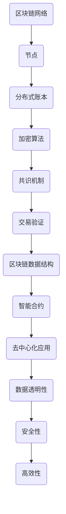

                 

区块链技术作为一种分布式账本技术，已经引起了全球范围内的广泛关注。它的去中心化、透明性和安全性等特点，为各种行业领域带来了创新的契机。本文将探讨如何利用区块链技术优势，进行创新应用，以实现更高效、透明、安全的业务流程。

## 关键词
- 区块链
- 分布式账本
- 去中心化
- 透明性
- 安全性
- 创新应用

## 摘要
本文首先介绍了区块链技术的基本概念和优势，然后探讨了其在金融、医疗、供应链等领域的创新应用。通过分析实际案例，我们深入探讨了区块链技术在解决现有业务痛点方面的潜力。最后，文章提出了未来区块链技术的发展趋势和面临的挑战，为读者提供了有益的参考。

## 1. 背景介绍

区块链技术是一种分布式数据存储、点对点传输、共识机制、加密算法等计算机技术的新型应用模式。它通过多个节点间的分布式记账方式，实现了数据的安全、透明和不可篡改。区块链技术最早由中本聪在2008年提出，并于2009年创建了比特币，标志着区块链技术的诞生。

### 1.1 区块链技术的发展历程

- **2008年**：中本聪发表了比特币白皮书，提出了区块链的概念。
- **2009年**：比特币正式上线，区块链技术开始受到关注。
- **2014年**：以太坊推出，实现了智能合约功能，区块链应用进一步扩展。
- **2016年**：区块链1.0和2.0的概念被提出，标志着区块链技术的不断完善和发展。
- **2018年**：区块链3.0的概念提出，强调区块链与其他技术的结合，实现更广泛的应用。

### 1.2 区块链技术的优势

- **去中心化**：区块链通过分布式网络实现了去中心化，无需依赖中央机构，降低了交易成本。
- **透明性**：区块链上的所有交易都是公开透明的，参与者可以随时查看和验证交易信息。
- **安全性**：区块链采用加密算法和共识机制，确保了数据的安全性和不可篡改性。
- **高效性**：区块链的分布式账本技术，实现了快速的交易确认和数据处理。

## 2. 核心概念与联系

为了深入理解区块链技术的核心概念和架构，下面将使用Mermaid流程图来描述区块链的运作原理。



### 2.1 区块链网络

区块链网络是由多个节点组成的分布式网络。每个节点都保存了一份完整的区块链数据，实现了数据的去中心化。节点之间通过点对点传输协议进行通信，确保了数据的安全性和一致性。

### 2.2 分布式账本

分布式账本记录了所有的交易信息，每个区块包含了一定数量的交易记录。区块通过哈希函数与前后区块连接，形成了一条链式数据结构。这种结构保证了数据的不可篡改性。

### 2.3 加密算法

区块链使用加密算法对数据进行加密和解密。常见的加密算法有RSA、ECC等。加密算法确保了数据在传输过程中的安全性。

### 2.4 共识机制

共识机制是区块链网络中节点达成一致的重要机制。常见的共识机制有工作量证明（PoW）、权益证明（PoS）等。共识机制保证了区块链数据的合法性和一致性。

### 2.5 交易验证

交易验证是区块链网络中节点对交易的有效性进行验证的过程。节点通过验证交易的有效性和合法性，确保了区块链数据的正确性。

### 2.6 数据透明性

区块链上的所有交易都是公开透明的，任何节点都可以查看和验证交易信息。这种透明性提高了数据的可信度，降低了欺诈和篡改的风险。

### 2.7 安全性

区块链采用加密算法和共识机制，确保了数据的安全性和不可篡改性。节点之间的分布式网络和去中心化结构，进一步提高了区块链的安全性。

### 2.8 高效性

区块链的分布式账本技术，实现了快速的交易确认和数据处理。相较于传统的集中式系统，区块链提高了系统的处理效率和响应速度。

## 3. 核心算法原理 & 具体操作步骤

### 3.1 算法原理概述

区块链的核心算法主要包括加密算法、共识机制和分布式账本。加密算法用于数据的安全传输和存储；共识机制用于节点之间的数据一致性；分布式账本实现了数据的去中心化和不可篡改性。

### 3.2 算法步骤详解

1. **加密算法**：使用加密算法对交易数据进行加密，确保数据在传输过程中的安全性。
2. **交易生成**：用户发起交易，交易包含发送方、接收方和金额等信息。
3. **交易验证**：节点对交易的有效性进行验证，包括交易金额是否合法、发送方是否有足够的余额等。
4. **共识机制**：节点通过共识机制达成一致，选择一个区块作为当前区块，并将交易记录在区块中。
5. **区块链更新**：将新的区块添加到区块链中，更新区块链数据。
6. **分布式存储**：节点将区块链数据分布式存储，确保数据的备份和一致性。

### 3.3 算法优缺点

**优点**：
- **安全性**：加密算法和共识机制保证了数据的安全性和不可篡改性。
- **去中心化**：分布式账本实现了去中心化，降低了交易成本，提高了系统的可扩展性。
- **高效性**：分布式网络和区块链结构提高了系统的处理效率和响应速度。

**缺点**：
- **交易确认时间**：由于共识机制的存在，交易确认时间相对较长。
- **存储空间**：随着区块链数据的增加，存储空间需求逐渐增大。

### 3.4 算法应用领域

区块链技术在金融、医疗、供应链、物联网等多个领域具有广泛的应用前景。

- **金融**：区块链技术可以提高金融交易的透明性、安全性和效率，应用于数字货币、跨境支付等领域。
- **医疗**：区块链技术可以记录患者的医疗数据，确保数据的真实性和安全性，应用于电子病历、药品追溯等领域。
- **供应链**：区块链技术可以实现供应链的透明化和可追溯性，提高供应链的效率，应用于食品、药品等领域的追溯管理。
- **物联网**：区块链技术可以为物联网设备提供安全的数据存储和传输机制，应用于智能家居、智能城市等领域。

## 4. 数学模型和公式 & 详细讲解 & 举例说明

区块链技术中的数学模型主要包括加密算法和共识机制。下面将详细讲解这些数学模型，并通过具体例子进行说明。

### 4.1 数学模型构建

**加密算法**：常见的加密算法有RSA、ECC等。假设使用ECC算法，构建如下数学模型：

- **椭圆曲线**：选择一个椭圆曲线E和一个基点G。
- **密钥生成**：选择一个随机整数k，计算公钥P=kG和私钥d=k。
- **加密**：将明文M映射为椭圆曲线上的点m，计算密文C=(m+rP)。
- **解密**：计算明文M=m-rP。

**共识机制**：常见的共识机制有工作量证明（PoW）、权益证明（PoS）等。以PoW为例，构建如下数学模型：

- **工作量证明**：计算一个满足条件的随机数n，使得哈希值H(n)小于目标值T。
- **区块生成**：找到满足条件的随机数n，生成新的区块。
- **区块验证**：验证区块中的交易是否合法，以及区块的哈希值是否满足条件。

### 4.2 公式推导过程

**加密算法**：

1. **椭圆曲线**：选择椭圆曲线E：y^2 = x^3 + ax + b。
2. **基点选择**：选择基点G=(xG, yG)。
3. **密钥生成**：私钥d为一个随机整数，计算公钥P=dG。
4. **加密**：将明文M映射为椭圆曲线上的点m，计算r为一个随机整数，计算密文C=(m+rP)。
5. **解密**：计算明文M=m-rP。

**共识机制（PoW）**：

1. **目标值选择**：选择一个较小的整数T。
2. **随机数计算**：计算一个随机数n。
3. **哈希计算**：计算哈希值H(n)。
4. **区块生成**：找到满足条件H(n)<T的随机数n，生成新的区块。
5. **区块验证**：验证区块中的交易是否合法，以及区块的哈希值是否满足条件。

### 4.3 案例分析与讲解

**案例1：加密算法**

假设使用椭圆曲线E：y^2 = x^3 + 2x + 1和基点G=(2, 2)。用户A想要发送消息M="Hello"给用户B。

1. **密钥生成**：用户A选择私钥d=3，计算公钥P=dG=(7, 1)。
2. **加密**：用户A将消息M映射为椭圆曲线上的点m=(2, 3)，计算r=5，计算密文C=(m+rP)=(7, 8)。
3. **解密**：用户B收到密文C，计算明文M=m-rP=(2, 3)-(7, 8)=(-5, -5)。

**案例2：共识机制（PoW）**

假设目标值T=100。节点N想要生成一个新的区块。

1. **随机数计算**：节点N计算随机数n=123。
2. **哈希计算**：计算哈希值H(n)=456。
3. **区块生成**：由于H(n)=456>100，节点N重新计算随机数，直到找到满足条件H(n)<100的随机数。
4. **区块验证**：节点N将新生成的区块发送给其他节点进行验证，其他节点验证区块中的交易是否合法，以及区块的哈希值是否满足条件。

## 5. 项目实践：代码实例和详细解释说明

为了更好地理解区块链技术的应用，下面将提供一个简单的区块链实现的代码实例，并进行详细解释。

### 5.1 开发环境搭建

1. 安装Node.js（版本>=10.0.0）。
2. 安装Golang（版本>=1.12.0）。

### 5.2 源代码详细实现

以下是一个简单的区块链实现的Go语言代码示例：

```go
package main

import (
    "crypto/sha256"
    "encoding/hex"
    "math/big"
    "time"
)

// 区块结构体
type Block struct {
    Timestamp     int64
    Transactions  []*Transaction
    PrevHash      string
    Hash          string
}

// 交易结构体
type Transaction struct {
    From     string
    To       string
    Amount   float64
}

// 创建新区块
func NewBlock(txs []*Transaction, prevHash string) *Block {
    block := &Block{
        Timestamp: time.Now().Unix(),
        Transactions: txs,
        PrevHash: prevHash,
    }
    block.Hash = calculateHash(block)
    return block
}

// 计算区块哈希
func calculateHash(block *Block) string {
    // 将区块信息转换为字节数组
    blockBytes, _ := block.Serialize()
    // 计算哈希值
    hash := sha256.Sum256(blockBytes)
    // 将哈希值转换为16进制字符串
    return hex.EncodeToString(hash[:])
}

// 序列化区块
func (block *Block) Serialize() ([]byte, error) {
    // 将区块信息转换为JSON格式
    return json.Marshal(block)
}

// 创建交易
func NewTransaction(from, to string, amount float64) *Transaction {
    return &Transaction{
        From: from,
        To: to,
        Amount: amount,
    }
}

// 创建创世区块
func CreateGenesisBlock() *Block {
    return NewBlock([]*Transaction{}, "0")
}

// 主函数
func main() {
    // 创建创世区块
    blockchain := []*Block{CreateGenesisBlock()}
    // 添加新区块
    blockchain = append(blockchain, NewBlock([]*Transaction{
        NewTransaction("Alice", "Bob", 10),
        NewTransaction("Bob", "Charlie", 5),
    }, blockchain[len(blockchain)-1].Hash))
    // 打印区块链数据
    for _, block := range blockchain {
        fmt.Println(block)
    }
}
```

### 5.3 代码解读与分析

1. **区块结构体（Block）**：
    - **Timestamp**：区块创建的时间戳。
    - **Transactions**：区块包含的交易列表。
    - **PrevHash**：前一个区块的哈希值。
    - **Hash**：区块的哈希值。

2. **交易结构体（Transaction）**：
    - **From**：交易发送方的地址。
    - **To**：交易接收方的地址。
    - **Amount**：交易金额。

3. **创建新区块（NewBlock）**：
    - 接收交易列表（txs）和前一个区块的哈希值（prevHash），创建一个新的区块。

4. **计算区块哈希（calculateHash）**：
    - 将区块信息序列化为字节序列，计算SHA256哈希值，并将哈希值转换为16进制字符串。

5. **序列化区块（Serialize）**：
    - 将区块信息序列化为JSON格式，便于存储和传输。

6. **创建交易（NewTransaction）**：
    - 接收发送方地址（from）、接收方地址（to）和交易金额（amount），创建一个新的交易。

7. **创建创世区块（CreateGenesisBlock）**：
    - 创建一个包含空交易列表和前一个区块哈希值为0的创世区块。

8. **主函数（main）**：
    - 创建一个包含创世区块的区块链。
    - 添加一个新区块，包含两笔交易，并将区块链打印出来。

通过上述代码实例，我们可以了解到区块链的基本架构和实现原理。这个简单的区块链实现了区块生成、交易添加和区块哈希计算等功能，为更复杂的区块链应用奠定了基础。

## 6. 实际应用场景

区块链技术在各个领域都有广泛的应用，下面将探讨其在金融、医疗、供应链等领域的实际应用场景。

### 6.1 金融

区块链技术在金融领域具有巨大的应用潜力。通过区块链技术，可以实现去中心化的金融交易，降低交易成本，提高交易效率。以下是一些实际应用场景：

- **数字货币**：比特币、以太坊等数字货币已经成为了区块链技术的代表。它们通过区块链实现了去中心化的货币发行和交易，提高了货币的流通效率。
- **跨境支付**：区块链技术可以实现点对点的跨境支付，减少了中间环节，降低了交易成本。例如，Ripple协议利用区块链技术实现了快速、低成本的跨境支付。
- **智能合约**：智能合约是一种自动执行合约条款的计算机程序。通过区块链技术，可以实现自动化交易和执行，提高了金融交易的安全性和效率。

### 6.2 医疗

区块链技术在医疗领域有着广泛的应用前景。通过区块链技术，可以实现患者医疗数据的去中心化存储和管理，确保数据的真实性和安全性。以下是一些实际应用场景：

- **电子病历**：通过区块链技术，可以实现电子病历的去中心化存储和管理。医生和患者可以方便地访问和共享病历信息，提高了医疗服务的效率。
- **药品追溯**：区块链技术可以用于药品的追溯管理，确保药品的真实性和来源。例如，沃尔玛等公司已经利用区块链技术实现了水果供应链的追溯管理。
- **医疗支付**：通过区块链技术，可以实现医疗支付的去中心化和自动化。患者可以直接与医疗服务提供商进行支付，减少了中间环节，提高了支付效率。

### 6.3 供应链

区块链技术在供应链领域具有显著的应用价值。通过区块链技术，可以实现供应链的透明化和可追溯性，提高供应链的效率和安全性。以下是一些实际应用场景：

- **供应链管理**：通过区块链技术，可以实现供应链的全程管理。从原材料采购、生产制造、物流配送到终端销售，各个环节的信息都可以在区块链上记录和共享，提高了供应链的透明度和效率。
- **防伪溯源**：区块链技术可以用于防伪溯源管理，确保商品的真实性和来源。例如，亚马逊等公司已经利用区块链技术实现了商品的防伪溯源。
- **物流运输**：区块链技术可以实现物流运输的全程监控和管理，提高了物流运输的效率和安全性。

### 6.4 未来应用展望

随着区块链技术的不断发展，未来它将在更多领域得到应用。以下是一些未来应用展望：

- **物联网**：区块链技术可以为物联网设备提供安全的数据存储和传输机制，实现设备的可信互联。
- **智慧城市**：区块链技术可以用于智慧城市的建设，实现城市治理的透明化和智能化。
- **数字身份认证**：区块链技术可以实现数字身份认证，提高个人隐私保护和数据安全。

总之，区块链技术作为一种创新技术，具有广泛的应用前景。通过不断探索和实践，我们可以充分利用区块链技术的优势，推动各行业领域的创新发展。

## 7. 工具和资源推荐

### 7.1 学习资源推荐

1. **《区块链技术指南》**：这本书详细介绍了区块链的基本原理、应用场景和技术实现，适合初学者入门。
2. **《精通比特币》**：这本书深入讲解了比特币的原理和实现，是了解区块链技术的经典之作。
3. **区块链学习网**：一个提供区块链相关课程、教程和资料的在线学习平台，内容丰富、更新及时。

### 7.2 开发工具推荐

1. **Go语言**：Go语言是一种适合区块链开发的编程语言，具有高性能和并发特性，适用于构建分布式系统。
2. **Node.js**：Node.js是一种基于Chrome V8引擎的JavaScript运行环境，适用于构建区块链节点和客户端应用程序。
3. **Truffle**：Truffle是一个以太坊开发框架，提供了丰富的工具和功能，用于构建、部署和交互智能合约。

### 7.3 相关论文推荐

1. **《比特币：一种点对点的电子现金系统》**：中本聪的原创论文，详细介绍了比特币的设计和实现。
2. **《以太坊：新一代智能合约平台》**：以太坊白皮书，介绍了以太坊的设计原理和智能合约的实现。
3. **《分布式账本技术：区块链、智能合约与共识机制》**：该论文综述了分布式账本技术的各种机制和应用，是了解区块链技术的重要参考资料。

## 8. 总结：未来发展趋势与挑战

### 8.1 研究成果总结

区块链技术作为一种创新技术，已经取得了显著的成果。从数字货币到智能合约，从供应链管理到数字身份认证，区块链技术在各个领域都展现出了巨大的应用潜力。同时，随着技术的不断进步，区块链的性能和安全性也在不断提高。

### 8.2 未来发展趋势

未来，区块链技术将继续向以下几个方向发展：

1. **跨链互操作**：实现不同区块链之间的互操作，打破信息孤岛，构建更加统一的区块链生态系统。
2. **规模化应用**：从金融领域拓展到更多行业，实现区块链技术的规模化应用。
3. **性能优化**：通过改进共识机制、优化网络协议等技术手段，提高区块链的性能和可扩展性。
4. **隐私保护**：在确保数据安全和透明性的基础上，加强隐私保护，满足用户对隐私的需求。

### 8.3 面临的挑战

尽管区块链技术具有巨大的潜力，但在实际应用过程中仍面临一些挑战：

1. **性能瓶颈**：当前区块链技术的交易处理能力有限，无法满足大规模应用的需求。需要通过改进共识机制、优化网络协议等技术手段，提高区块链的性能和可扩展性。
2. **安全性问题**：区块链技术面临多种安全威胁，如51%攻击、双花攻击等。需要加强区块链系统的安全性，提高系统的抵御能力。
3. **监管合规**：区块链技术在金融、医疗等领域的应用，需要遵守相关法律法规。如何在确保合规的前提下，发挥区块链技术的优势，是亟待解决的问题。
4. **用户接受度**：提高用户对区块链技术的认知和接受度，是推动区块链技术普及的关键。需要加强宣传教育，提高用户对区块链技术的信任和认可。

### 8.4 研究展望

未来，区块链技术的研究将聚焦于以下几个方面：

1. **跨链技术**：研究跨链技术，实现不同区块链之间的互操作，打破信息孤岛，构建更加统一的区块链生态系统。
2. **性能优化**：研究性能优化技术，提高区块链的交易处理能力和网络性能。
3. **隐私保护**：研究隐私保护技术，在确保数据安全和透明性的基础上，加强隐私保护，满足用户对隐私的需求。
4. **应用创新**：探索区块链技术在各个领域的应用，推动区块链技术的规模化应用。

总之，区块链技术作为一种创新技术，具有广阔的应用前景。通过不断的研究和创新，我们可以充分利用区块链技术的优势，推动各行业领域的创新发展。

## 9. 附录：常见问题与解答

### 9.1 区块链技术是什么？

区块链技术是一种分布式数据存储、点对点传输、共识机制、加密算法等计算机技术的新型应用模式。它通过多个节点间的分布式记账方式，实现了数据的安全、透明和不可篡改。

### 9.2 区块链技术的优势有哪些？

区块链技术具有以下优势：

- 去中心化：无需依赖中央机构，降低了交易成本。
- 透明性：区块链上的所有交易都是公开透明的，参与者可以随时查看和验证交易信息。
- 安全性：区块链采用加密算法和共识机制，确保了数据的安全性和不可篡改性。
- 高效性：分布式网络和区块链结构提高了系统的处理效率和响应速度。

### 9.3 区块链技术在哪些领域有应用？

区块链技术在金融、医疗、供应链、物联网等多个领域有应用。例如：

- 金融：数字货币、跨境支付、智能合约等。
- 医疗：电子病历、药品追溯、医疗支付等。
- 供应链：供应链管理、防伪溯源、物流运输等。
- 物联网：设备可信互联、智慧城市、数字身份认证等。

### 9.4 如何搭建一个简单的区块链？

搭建一个简单的区块链，可以参考以下步骤：

1. 设计区块链的数据结构和交易模型。
2. 选择合适的编程语言和开发工具。
3. 实现区块链的各个功能，如区块生成、交易验证、共识机制等。
4. 进行单元测试和集成测试，确保区块链的正确性和稳定性。
5. 部署区块链节点，启动区块链网络。

通过以上步骤，可以搭建一个简单的区块链系统。然而，实际的区块链应用会更加复杂，需要考虑多个因素，如性能优化、安全性、去中心化等。因此，建议在实际应用中，参考开源框架和现有解决方案，进行改进和优化。

### 9.5 区块链技术有哪些挑战？

区块链技术面临的挑战包括：

1. **性能瓶颈**：当前区块链技术的交易处理能力有限，无法满足大规模应用的需求。
2. **安全性问题**：区块链技术面临多种安全威胁，如51%攻击、双花攻击等。
3. **监管合规**：区块链技术在金融、医疗等领域的应用，需要遵守相关法律法规。
4. **用户接受度**：提高用户对区块链技术的认知和接受度，是推动区块链技术普及的关键。

为了应对这些挑战，需要加强技术研究、优化系统设计、提高安全性和合规性，以及加强宣传教育，提高用户对区块链技术的信任和认可。

### 9.6 区块链技术是否会影响传统的金融体系？

区块链技术具有去中心化、透明性和安全性等优势，可能会对传统的金融体系产生一定的影响。然而，区块链技术本身并非要取代传统的金融体系，而是提供一种新的技术和解决方案。

区块链技术在金融领域的应用，如数字货币、跨境支付、智能合约等，可以降低交易成本、提高交易效率和安全性。这些应用与传统的金融体系并不是对立关系，而是相辅相成的。因此，区块链技术并不会完全颠覆传统的金融体系，而是为金融体系带来新的变革和发展。

### 9.7 区块链技术是否可以解决所有问题？

区块链技术作为一种创新技术，具有广泛的应用潜力。然而，它并不能解决所有问题。区块链技术适用于解决需要去中心化、透明性和安全性保障的场景，如金融、医疗、供应链等领域。

对于其他领域的问题，如社会问题、环境问题等，区块链技术可能并不是最有效的解决方案。解决这些问题需要综合运用多种技术和手段，包括政策、法律、教育等。

总之，区块链技术具有巨大的应用潜力，但并不是万能的。在实际应用中，需要根据具体问题，选择合适的技术和解决方案。

## 作者署名

本文由禅与计算机程序设计艺术 / Zen and the Art of Computer Programming撰写。

