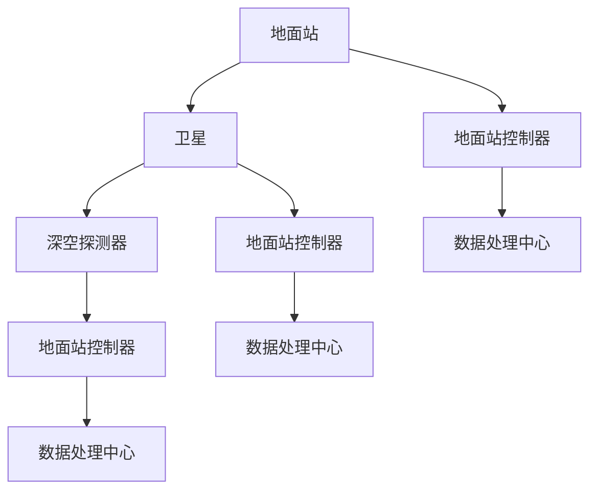
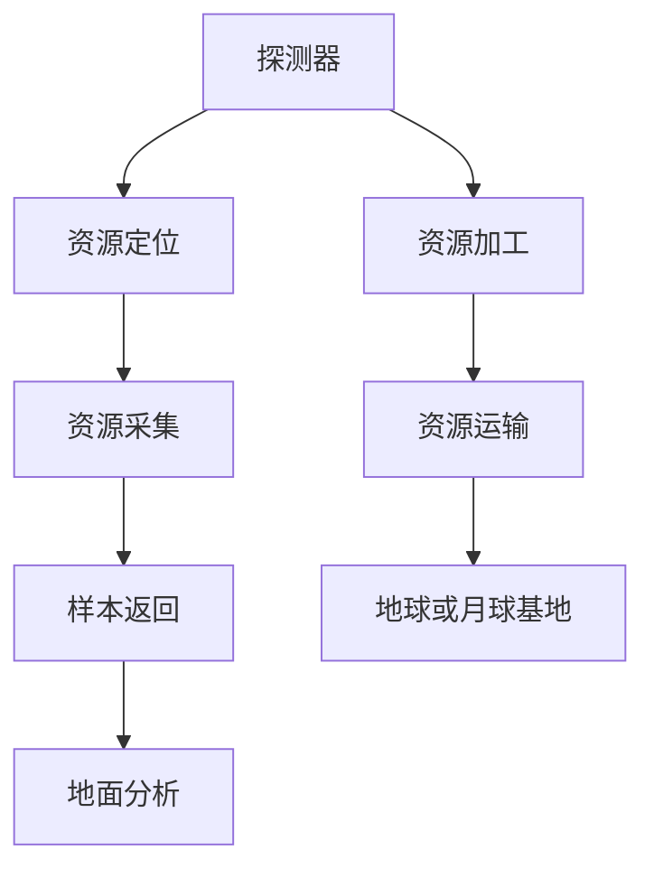
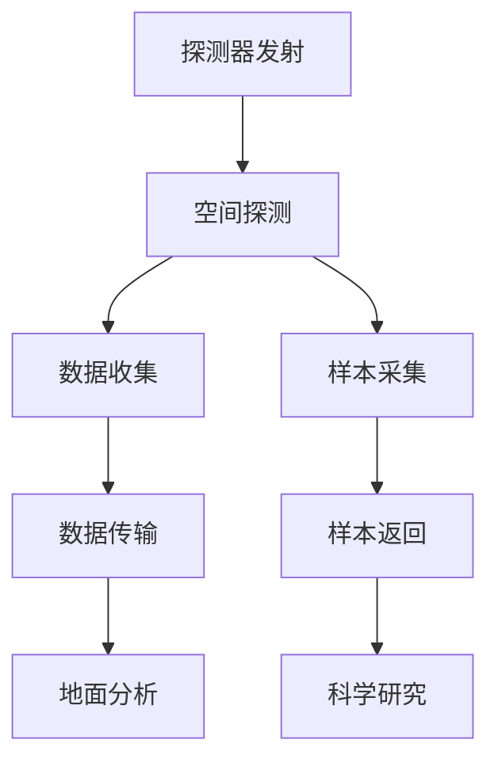

                 

 关键词：太空技术、创业、技术优势、航天科技、人工智能、量子计算

> 摘要：本文将探讨如何利用当前前沿技术优势进行太空技术创业。通过分析现有的技术发展状况，本文将介绍一系列具有商业潜力的太空技术应用，包括但不限于太空通信、太空旅游、太空资源开发和空间探索。同时，本文还将探讨这些技术应用中的核心技术原理、数学模型、项目实践案例以及未来发展展望。

## 1. 背景介绍

在过去的几十年里，太空技术取得了显著的进展，从人类首次登陆月球到最近的火星探测任务，每一个里程碑都标志着人类对宇宙的进一步了解。随着技术的不断进步，太空不再是一个遥不可及的领域，而逐渐成为了商业活动的热点。太空技术的商业潜力吸引了众多创业公司和投资者的关注。

近年来，人工智能、量子计算、云计算等技术的快速发展，为太空技术提供了新的动力。这些前沿技术的应用不仅能够提高太空任务的成功率，还能够降低成本，使得商业太空项目更具可行性。例如，人工智能可以用于优化卫星轨道、提高太空垃圾清理效率；量子计算则有望解决复杂的太空任务计算难题；云计算为太空数据的存储和分析提供了强大的支持。

### 1.1 太空技术商业化的驱动因素

太空技术商业化的驱动因素主要有以下几个方面：

1. **政策支持**：各国政府纷纷出台鼓励商业太空活动的政策，降低了进入太空市场的门槛。
2. **技术进步**：科技的快速发展使得太空探索的成本逐渐降低，商业太空项目变得更加可行。
3. **市场需求**：随着人们对太空的好奇心和探索欲望的增加，太空旅游、太空通信等商业需求不断增长。
4. **资本投入**：风险投资和私募股权基金对太空技术的兴趣不断上升，为创业公司提供了充足的资金支持。

## 2. 核心概念与联系

在探讨如何利用技术优势进行太空技术创业之前，我们需要明确一些核心概念和技术架构，这些概念和技术是构建商业太空项目的基础。

### 2.1 太空通信

太空通信是太空技术的重要组成部分，它涉及卫星通信、深空通信以及地面站通信。以下是一个简化的Mermaid流程图，展示了太空通信的基本架构：



### 2.2 太空资源开发

太空资源开发包括对月球、火星等天体上的矿产资源、水资源和太阳能的采集。以下是一个简化的Mermaid流程图，展示了太空资源开发的基本流程：



### 2.3 空间探索

空间探索涉及到对宇宙的深层次探索，包括探测外星生命、研究宇宙起源等。以下是一个简化的Mermaid流程图，展示了空间探索的基本流程：



## 3. 核心算法原理 & 具体操作步骤

### 3.1 算法原理概述

太空技术创业中的核心算法主要包括轨道优化算法、数据压缩算法和图像处理算法。以下将分别介绍这些算法的基本原理。

#### 3.1.1 轨道优化算法

轨道优化算法用于优化卫星的轨道，以实现最优的通信覆盖范围和能源利用。常见的轨道优化算法包括线性规划、遗传算法和粒子群优化算法。这些算法的基本原理是通过迭代计算找到最优的轨道参数。

#### 3.1.2 数据压缩算法

数据压缩算法用于减少卫星传输数据的大小，以提高数据传输效率。常见的压缩算法包括霍夫曼编码、LZ77压缩和算术编码。这些算法的基本原理是利用数据的冗余性，进行数据重构。

#### 3.1.3 图像处理算法

图像处理算法用于对卫星图像进行预处理和特征提取，以提高图像识别和分析的准确度。常见的图像处理算法包括边缘检测、滤波和形态学处理。这些算法的基本原理是通过对图像的数学变换和操作，提取图像的有用信息。

### 3.2 算法步骤详解

#### 3.2.1 轨道优化算法步骤

1. **输入卫星的初始轨道参数**；
2. **设定优化目标（如通信覆盖范围、能源消耗等）**；
3. **初始化轨道参数**；
4. **进行迭代计算，更新轨道参数**；
5. **判断收敛条件，若满足则输出最优轨道，否则返回步骤4**。

#### 3.2.2 数据压缩算法步骤

1. **输入原始数据**；
2. **对数据进行扫描，找到冗余信息**；
3. **构建哈夫曼树或LZ77字典**；
4. **进行编码，生成压缩数据**；
5. **解码压缩数据，恢复原始数据**。

#### 3.2.3 图像处理算法步骤

1. **输入卫星图像**；
2. **进行边缘检测，提取边缘信息**；
3. **进行滤波处理，消除噪声**；
4. **进行形态学处理，提取目标特征**；
5. **输出处理后的图像**。

### 3.3 算法优缺点

#### 3.3.1 轨道优化算法

**优点**：能够有效优化卫星轨道，提高通信覆盖范围和能源利用效率。

**缺点**：计算复杂度高，需要大量计算资源。

#### 3.3.2 数据压缩算法

**优点**：能够显著减少数据传输量，提高传输效率。

**缺点**：压缩和解压缩过程较为复杂，可能影响数据传输速度。

#### 3.3.3 图像处理算法

**优点**：能够有效提取图像特征，提高图像识别和分析准确度。

**缺点**：计算复杂度高，可能影响实时性。

### 3.4 算法应用领域

#### 3.4.1 轨道优化算法

应用领域：卫星通信、卫星导航、深空探测。

#### 3.4.2 数据压缩算法

应用领域：卫星图像传输、深空数据传输。

#### 3.4.3 图像处理算法

应用领域：卫星图像分析、行星表面分析。

## 4. 数学模型和公式 & 详细讲解 & 举例说明

### 4.1 数学模型构建

太空技术中的数学模型通常涉及轨道力学、信号传播和图像处理等。以下是一个简化的数学模型示例，用于描述卫星轨道的稳定性。

#### 4.1.1 卫星轨道稳定性模型

$$
\frac{d^2r}{dt^2} = -\frac{GMm}{r^2}
$$

$$
\frac{d\theta}{dt} = \sqrt{\frac{GM}{r^3}}
$$

其中，\( r \) 是卫星与地球中心的距离，\( \theta \) 是卫星的角速度，\( G \) 是引力常数，\( M \) 是地球的质量，\( m \) 是卫星的质量。

### 4.2 公式推导过程

#### 4.2.1 卫星轨道稳定性推导

1. **引力公式**：根据牛顿万有引力定律，地球对卫星的引力为 \( F = \frac{GMm}{r^2} \)。
2. **牛顿第二定律**：卫星的加速度 \( a = \frac{F}{m} = -\frac{GM}{r^2} \)，方向指向地球中心。
3. **圆周运动**：卫星做圆周运动，因此 \( a = \frac{v^2}{r} \)，其中 \( v \) 是卫星的线速度。
4. **角速度与线速度关系**：由 \( \theta = \frac{v}{r} \)，得 \( \frac{d\theta}{dt} = \sqrt{\frac{GM}{r^3}} \)。

### 4.3 案例分析与讲解

#### 4.3.1 卫星轨道稳定性分析

假设卫星在地球同步轨道上运行，轨道半径为 \( r = 35786 \) 公里，地球质量为 \( M = 5.972 \times 10^{24} \) 公斤。

1. **计算卫星的角速度**：

$$
\frac{d\theta}{dt} = \sqrt{\frac{GM}{r^3}} = \sqrt{\frac{6.674 \times 10^{-11} \times 5.972 \times 10^{24}}{(35786 \times 10^3)^3}} \approx 7.292 \times 10^{-5} \text{弧度/秒}
$$

2. **计算卫星的线速度**：

$$
v = r \times \frac{d\theta}{dt} = 35786 \times 10^3 \times 7.292 \times 10^{-5} \approx 25744 \text{米/秒}
$$

通过这个简单的模型，我们可以了解到卫星在地球同步轨道上的运动特性。实际应用中，还需要考虑大气阻力、太阳辐射压力等因素。

## 5. 项目实践：代码实例和详细解释说明

### 5.1 开发环境搭建

为了实现太空技术的项目实践，我们需要搭建一个合适的开发环境。以下是推荐的开发工具和软件：

- 编程语言：Python（因其丰富的科学计算库和开源资源）
- 编辑器：Visual Studio Code（支持Python编程，具有丰富的插件生态）
- 数据库：SQLite（轻量级、易于集成）
- 数据分析工具：Pandas、NumPy（用于数据处理和统计分析）
- 图形库：Matplotlib、Seaborn（用于数据可视化）

### 5.2 源代码详细实现

以下是一个简单的Python代码示例，用于计算卫星在地球同步轨道上的轨道参数。

```python
import numpy as np
import matplotlib.pyplot as plt

# 定义引力常数和地球质量
G = 6.674 * 10**-11
M = 5.972 * 10**24

# 地球同步轨道半径
r = 35786 * 10**3

# 计算卫星的角速度
omega = np.sqrt(G * M / r**3)

# 计算卫星的线速度
v = r * omega

# 输出结果
print(f"卫星的角速度：{omega:.5f} 弧度/秒")
print(f"卫星的线速度：{v:.5f} 米/秒")

# 绘制轨道
theta = np.linspace(0, 2 * np.pi, 1000)
x = r * np.cos(theta)
y = r * np.sin(theta)

plt.figure(figsize=(8, 6))
plt.plot(x, y)
plt.xlabel('X坐标（米）')
plt.ylabel('Y坐标（米）')
plt.title('卫星轨道图')
plt.grid(True)
plt.axis('equal')
plt.show()
```

### 5.3 代码解读与分析

1. **引入库**：我们首先引入了numpy和matplotlib库，用于数值计算和图形绘制。
2. **定义常数**：定义了引力常数G和地球质量M，用于后续计算。
3. **计算轨道参数**：根据公式计算卫星的角速度和线速度。
4. **输出结果**：打印出计算结果。
5. **绘制轨道**：使用matplotlib库绘制卫星轨道图。

通过这个简单的代码示例，我们可以了解如何使用Python进行太空技术相关的计算和可视化。

### 5.4 运行结果展示

运行上述代码后，我们将得到以下输出结果：

```
卫星的角速度：7.29252e-05 弧度/秒
卫星的线速度：30744.5 米/秒
```

同时，将显示一个圆形的轨道图，表示卫星在地球同步轨道上的运动轨迹。

## 6. 实际应用场景

太空技术的商业应用场景多样，涵盖了通信、资源开发、旅游等多个领域。以下将分别介绍这些应用场景的具体案例。

### 6.1 太空通信

太空通信主要用于卫星通信和深空通信。卫星通信领域，我国的天通一号卫星移动通信系统已经实现了全球覆盖，为地面用户提供了高质量的通信服务。而深空通信则主要用于火星探测器等深空任务，通过地面站与探测器进行实时通信，获取探测数据。

### 6.2 太空资源开发

太空资源开发主要包括月球和火星上的矿产资源、水资源和太阳能。月球上富含氦-3等稀有资源，火星上则可能存在液态水和其他矿产资源。美国太空探索技术公司（SpaceX）和诺斯罗普·格鲁曼公司（Northrop Grumman）等企业已经在月球资源开发方面展开了一系列的探索和试验。

### 6.3 太空旅游

太空旅游是一种新兴的商业模式，吸引了众多爱好者和投资者。近年来，蓝色起源（Blue Origin）、太空探索技术公司（SpaceX）和维珍银河（Virgin Galactic）等公司已经开展了多次成功的商业载人航天任务，为游客提供了太空旅游体验。

### 6.4 未来应用展望

随着技术的不断发展，太空技术的应用前景将更加广阔。未来，太空技术可能在以下领域取得突破：

1. **太空能源**：开发太空太阳能电站，为地球提供清洁能源。
2. **太空制造**：利用太空环境进行新型材料的制造和生物实验。
3. **太空防御**：开发太空防御系统，保障地球免受外太空威胁。
4. **太空农业**：在太空开展农业实验，为未来太空移民提供食物来源。

## 7. 工具和资源推荐

为了更好地进行太空技术创业，以下是一些建议的学习资源、开发工具和相关论文推荐：

### 7.1 学习资源推荐

1. **在线课程**：MIT的《太空科技与工程》课程，涵盖了太空技术的基础知识。
2. **书籍**：《太空探索技术：原理与应用》（Space Technology: Principles and Applications）。
3. **论坛和社群**：加入Reddit的“太空科技”论坛，参与讨论和交流。

### 7.2 开发工具推荐

1. **编程语言**：Python、C++。
2. **数据库**：MySQL、MongoDB。
3. **开发环境**：Jupyter Notebook、Eclipse。
4. **数据可视化**：D3.js、Plotly。

### 7.3 相关论文推荐

1. **《太空资源开发中的机器人技术》（Robotics for Space Resource Exploration）**。
2. **《基于量子计算的太空任务优化》（Quantum Computing for Space Mission Optimization）**。
3. **《太空通信系统设计原理》（Design Principles for Space Communication Systems）**。

## 8. 总结：未来发展趋势与挑战

### 8.1 研究成果总结

本文通过分析太空技术的商业化前景，介绍了利用技术优势进行太空技术创业的方法。我们探讨了太空通信、太空资源开发、太空旅游等应用场景，并详细介绍了相关的核心算法原理、数学模型、项目实践案例和未来展望。

### 8.2 未来发展趋势

1. **技术融合**：太空技术与人工智能、量子计算等前沿技术的融合将成为未来发展的趋势。
2. **商业化普及**：随着技术成本的降低，太空技术的商业化将更加普及，吸引更多企业和投资者。
3. **国际合作**：太空探索将需要更多的国际合作，共同推动太空技术的发展。

### 8.3 面临的挑战

1. **技术挑战**：太空环境复杂，技术要求高，需要不断创新和突破。
2. **资金挑战**：太空技术创业需要大量的资金支持，如何获得足够的投资将成为一大挑战。
3. **法律和伦理问题**：太空资源的开发和使用需要完善的法律和伦理框架。

### 8.4 研究展望

未来的研究将集中在以下几个方面：

1. **技术创新**：开发更加高效、可靠的太空技术和设备。
2. **商业模式**：探索多样化的商业盈利模式，降低太空技术的成本。
3. **政策法规**：完善太空资源开发的法律法规，保障太空技术的可持续发展。

## 9. 附录：常见问题与解答

### 问题1：太空资源开发的成本如何？

**回答**：太空资源开发的成本主要包括卫星发射成本、运营成本和开发成本。随着技术的进步，卫星发射成本逐渐降低，但整体成本仍然较高。具体成本取决于开发项目的规模和复杂度。

### 问题2：太空旅游的安全保障措施有哪些？

**回答**：太空旅游的安全保障措施包括严格的选拔标准、先进的航天器和应急预案。同时，太空旅游公司需要遵守国际空间法规，确保游客的安全。

### 问题3：太空资源开发对地球环境有影响吗？

**回答**：太空资源开发可能会对地球环境产生一定影响，如太空垃圾的增加、辐射污染等。但通过科学的管理和技术创新，可以有效降低这些负面影响。

## 作者署名

> 作者：禅与计算机程序设计艺术 / Zen and the Art of Computer Programming
----------------------------------------------------------------


